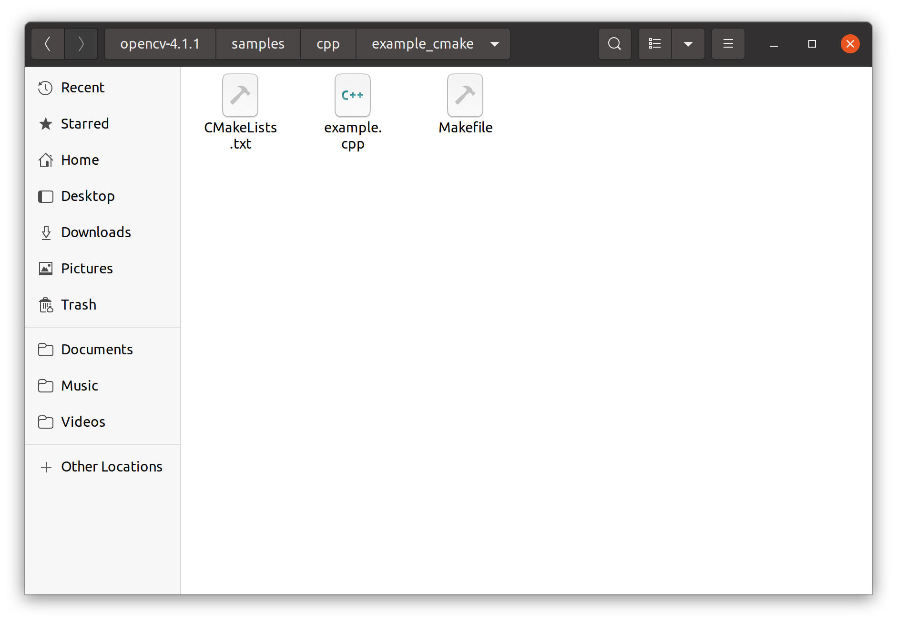
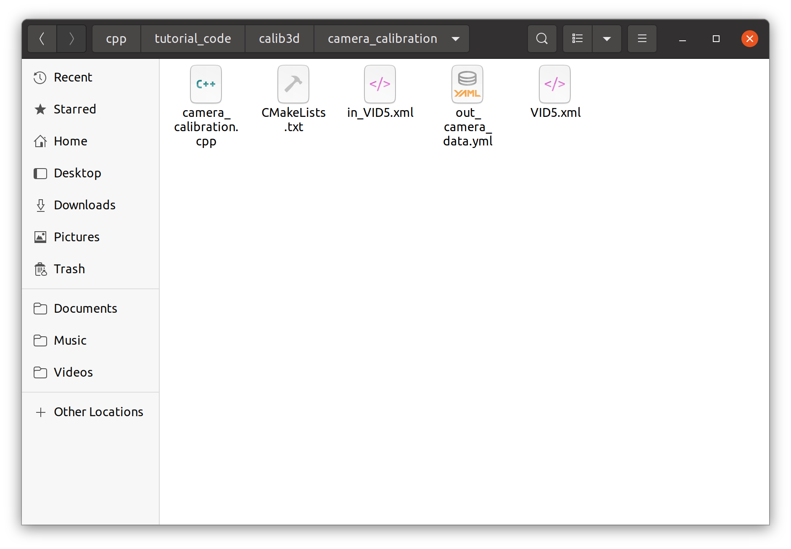
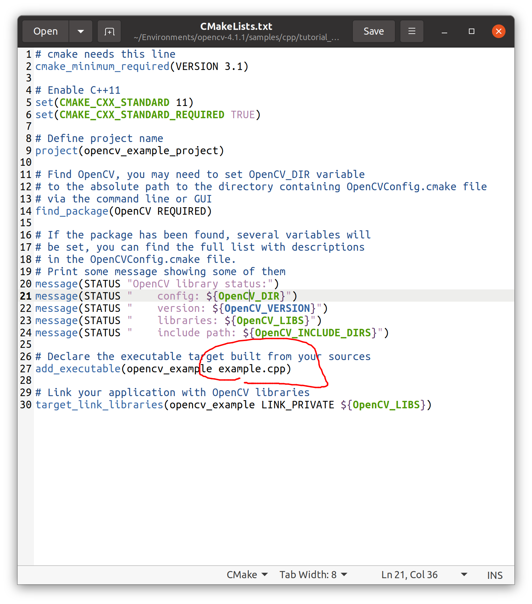
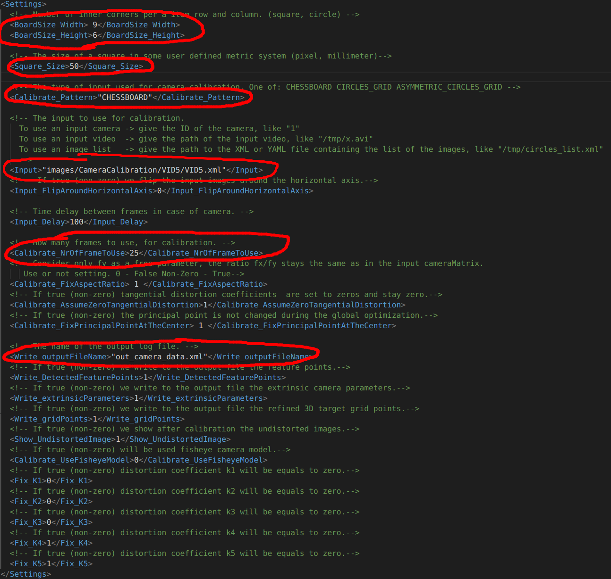

# OpenCV相机标定完全指南(~~有手就行~~)

> 此教程将会教会你如何使用opencv提供的例程进行相机的标定,**并且是利用相机拍摄的视频进行实时标定**.若是提前拍摄照片然后利用照片标定,需要自行阅读官方的教程,并in_VID5.xml中的注释进行修改.

首先你需要安装opencv，教程戳这里：[全网最详细的各种opencv安装教程]()

- linux
  - 安装openvino
  - 从源码编译
- windows
  - 从源码编译
  - 利用msys2工具安装

若是从源码编译安装完opencv后，以C++为例进入,将sample->cpp->example_cmake下的CMakeLists.txt拷贝到sample->cpp(python)->tutorial_code->calib3d->camera_calibration 。笔者这里也有一个可以直接使用的源代码，戳这里下载：[链接稍候补充]()



<center>拷贝此CMakeLists.txt</center>



打开CMakeLists.txt,修改add_exacutable()处的example.cpp为camera_calibration.cpp:



随后你需要打印一个标定板,这篇教程会教你如何DIY标定板的参数:[create calibration pattern](https://docs.opencv.org/4.x/da/d0d/tutorial_camera_calibration_pattern.html)

接下来根据你的标定板样式,对in_VID5.xml进行设置,如果你是一个新手,你只需要关注以下几个参数:



第一个是标定板的长度和宽度,对于CIRCLE_GRID,横纵向分别有几个圆,Width和Height就分别是多少,**特别注意,对于棋盘格,此参数代表的是角点个数而不是格子个数**.

第二个是尺度大小,如果你的标定板参数是自己设定的,要把此参数设定成和你生成的标定板一模一样,否则导致参数异常.

第三个是标定板类型,你生成了什么类型的标定板,就用选对应的类型,注释中有对应的参数,复制下来替换就ok.

第四个是标定数据来源,我们稍后将使用相机的实时拍摄视频进行标定,将此参数改为已经连接的相机的id(一般为0).若你希望用照片进行标定，则将此参数设为照片路径合集，即当前文件夹下的VID5.xml，并且你需要将用于标定的照片的路径全部放入VID5.xml中；用视频则直接填入视频的路径）。

第五个是用于标定的图片总数,一般来说拍摄的角度越多||不同距离的照片越多得到的标定结果越准确.

最后一个是输出的相机内参文件名.此教程将会教会你如何使用opencv提供的例程进行相机的标定,*并且是利用相机拍摄的视频进行实时标定.

修改好之后保存即可,马上在当前文件夹打开一个终端

```shell
cmake . # 生成makefile
make	# 编译
./opencv_example in_VID5.xml #执行程序
```

此时将会打开相机,显示其拍摄的画面,将相机对准标定板,会有负片的效果(反色),说明找到了标定板.在此界面上按下g开始标定,当右下角的计数达到你设置的数量时标定结束,终端中会输出此次标定的结果,根据重投影误差和显示画面的畸变程度我们可以判断标定的效果.


<center>标定进行中（图片待补充）</center>

