# 了解CV和[RoboMaster](https://www.robomaster.com/zh-CN)视觉组

<h6 style="text-align:right">--NeoZng【neozng1@hnu.edu.cn】</h6>

# *0.Catalogue*

[TOC]

---


<center>每个RoboMaster心中应该都有一个冠军梦，和一座金灿灿的奖杯</center>

# **1.摘要**

> ***在阅读本文之前，你需要有计算机科学的基本知识并至少掌握一门编程语言，同时对robomaster比赛规则和过程有大致的了解。***
>
> ***若只是希望知道视觉组的基本工作，仅需要阅读第二部分***。

> 笔者希望在这篇文章中向大家介绍视觉组的工作的基本概况和进入视觉组需要学习的知识，面向的对象为热爱机器人的朋友、战队中的其他技术组或准备进入视觉组的同学。本文会尽量广泛、全面地向你介绍视觉组的方方面面，同时可能涉及一些技术细节，***但又不涉及过多的数学公式和推导，提供尽可能直观的认识***，让其他技术组能够了解机器人视觉模块的运行机制，以便更好地协作开发，防止出现各自为战的境况。**同时让新人能更快地接触这些知识，明白视觉软件开发的过程，减少踩坑的次数。**

> 最后也是记录一下笔者近一年来的成长，算是给自己的一个交待。

- 计算机视觉(computer vision)无疑是当今最火热的研究领域之一。自然而然，在RoboMaster的赛场，视觉的软硬件开发也占有一席之地，视觉组便和其他技术组一样应运而生了。
- 视觉组负责的机器人模块主要是传感器和数据处理，即通过对相机、激光雷达等传感器采集到的信息进行处理从而让机器人在一定程度上具有”视觉”或“知觉”功能。
- 在比赛中，视觉组能够让机器人自动识别地方装甲板，实现“自瞄外挂”；也能让操作手轻松地击打能量机关，使得全队获得增益；视觉组打造的感知系统更是哨兵机器人、自动步兵上的“大脑”，没有视觉组的工作，这些机器人就完全失去了在场上的作用；视觉组同时还全权负责雷达这个兵种，耳听八方眼观六路，可谓是战场指挥官。

在第二部分，主要介绍了**视觉在每个兵种中的作用**。

第三部分则是视觉组在开发时会使用到的**软件**，如Linux系统、一些IDE和小工具。随后将会简述视觉组会使用的**硬件**如相机、各种运算平台等。

在第五部分介绍一些会用到的算法，紧接着在第六部分叙述比赛中对第五部分算法的工程应用，即如何**让算法落地发挥作用**。

第七部分简要说明了在视觉组需要的**开发技能和知识**，同时也代表着**你能在视觉组学到什么东西**。

第八部分叙述了视觉组同学的日常工作和任务安排，以及赛季的工作进程。

最后一个部分是笔者在视觉组学习一年以来的心得体会，和对新人上手视觉工作的一些建议。

！***另外，在每个部分中都会穿插地介绍一些视觉组在这些方面会接触到的知识***！


---

---

---


# **2.视觉在各兵种中的作用**

## 2.1.装甲板识别（步兵、英雄、无人机）

- 由于机器人上安装的图传模块到操作手看到的第一视角的延迟加上操作手反应速度的延迟，操作手几乎很难手动瞄准高速运动的机器人上的装甲板。因此，视觉组在这三个兵种的研发上主要是负责装甲板的识别算法，通过处理图像**找到相机视野范围内的装甲板**（相机一般安装在云台上，和枪口平行放置并指向同一个方向，类似瞄准镜），进而向下位机（STM32等用于控制的MCU,microcontroller unit,单片机）发送**此装甲板的相对枪口的角度**数据，电控根据此数据**控制电机自动转向目标装甲板**，实现装甲板的自动打击。

  

  <center>自动跟随装甲板效果</center>

- 随着自瞄算法的不断升级进步，RoboMaster的赛场上也出现了“反自瞄”，其中的代表之一就是**“小陀螺”**。机器人在小陀螺模式下，云台和底盘处于分离状态，并且底盘绕运动中心高速自旋。在这种情况下，视觉识别的难度会大大上升，一是自瞄很难跟上装甲板的高速转动，基本上我方机器人的云台运动会滞后于装甲板的运动，且难以预测装甲板的轨迹；二是即使跟随到一个装甲板后，那个装甲板随着底盘的转动很快消失在视野中，此时就要锁定另一块装甲板，使得云台会来回转动，无法稳定，导致弹丸命中率下降，从操作手的第一界面看来，整个画面不断晃动带来晕眩感，体验极差。

  因此，**反“小陀螺”**算法出现了：通过设计算法，识别对手的机器人处于小陀螺状态，然后让云台对准敌方机器人的中心位置而不再跟随装甲板移动。由于机器人处于“小陀螺”状态时基本上是匀速转动，这样就可在适当的时机开火（可以采用预测算法预测装甲板何时运动到云台所对准的位置），提高命中率。

  当然，随着反”小陀螺“算法的出现，赛场上又开始出现反‘反“小陀螺“ ’算法如变速小陀螺、超快小陀螺（舵轮步兵）。~~快进到反反反反反小陀螺~~（禁止套娃）因此，今后必定需要研发出鲁棒性（健壮性）和泛化性能更好的算法，才能应对愈发“卷”的比赛啊～

  

  <center>处于小陀螺运动下的步兵机器人</center>

  

  ---


## 2.2.能量机关（步兵）

- 在比赛场地的中央有一个风车形状的结构，就是能量机关。能量机关的激活点距能量机关7m。我们需要用小弹丸连续击中五片随机亮起的扇叶的末端装甲板才可以激活能量机关。激活小能量机关能够为队伍带来50%的攻击力增益，大能量机关能为队伍提供100%的攻击力增益和50%的防御增益。由于在操作手的第一视角看来五片扇叶的**间距非常小**，难以通过鼠标移动来进行打击，并且小能量机关是**匀速旋转**的状态，大能量机关更是**以 *0.785sin(1.884t)+1.305* 的角速度旋转**，操作手**很难预测其运动轨迹**。这便需要视觉组设计算法来识别未被击打过的末端装甲板并对其实现自动瞄准，找准时机控制子弹的发射从而实现自动击打能量机关。

- 除了激活我方的能量机关，我们还可以在对手激活能量机关的过程中干扰对手。倘若击打了错误的扇叶（如已经击打过的扇叶或尚未亮起的扇叶），能量机关则会重置，回到初始状态。因此，我们可以进入敌方半场，通过识别对手已经激活的扇叶并自动瞄准它，发射子弹击中错误的装甲板进而触发重置以干扰对手的激活过程。

  

  <center>正在激活能量机关的步兵机器人；图源RoboMaster2021内部交流</center>

  

  ---


## 2.3.哨兵

- 哨兵机器人被悬挂在基地前方的导轨上往复运动，是场上的一个**全自动机器人**，其移动、搜索目标、打击敌人都依赖于其**自主决策**。它相当于基地的防御塔。编写一个优秀的感知程序和决策程序，是发挥哨兵机器人威力的关键。哨兵机器人的云台会不断地转动使得上方安装的相机能够扫描到它附近的每一个角落，一旦识别到敌方的机器人便能立即锁定对手，随后根据其决策算法判断是否开火。

- 我们还可以让在哨兵机器人遭到攻击时进入快速机动的规避状态，在导轨上进行随机地不规则动作以躲避敌方的弹丸并干扰敌方机器人搭载的预测算法。

- 在前哨站尚未被击毁时，哨兵机器人处于无敌状态，这时我们可以让哨兵机器人保持固定以提高自己的命中率，一旦前哨战被摧毁，立即启动哨兵机器人的底盘，进入巡逻状态。

  

  <center>巡逻中的哨兵机器人；图源RoboMaster2021内部交流</center>

  

  ---


## 2.4.工程

- 工程机器人在本赛季的任务主要有：抓取矿石、兑换矿石和救援阵亡机器人。这里的每一步都可以利用视觉识别以完成自动化。

- 在抓取矿石的时候，可以在工程机器人的机械爪上安装相机、测距传感器，再编写相关的算法来识别矿石，实现自动对位和夹取。在技术交流中，上交、哈工大、深圳大学等惊艳全场的“空接矿石”依赖的就是自动识别矿石的算法。在兑换时，根据兑换站上的一些图像特征，可以定位扫描矿石窗口的位置，来快速地完成兑换。

- 在我方机器人阵亡后，可以通过两种方式复活阵亡机器人：工程机器人将其拖回基地旁的补血点或是让工程机器人所携带的复活卡（RFID射频卡）和其他机器人上的场地交互模块接触（被称作“刷卡复活”）。在这两种情况下，都可以通过编写视觉算法来实现快速准确地救援。我们可以在工程机器人的救援机构（夹爪、电磁铁）旁安装相机，通过确定一些方法阵亡机器人上救援结构（环、柱、磁铁等）的位置让工程机器人自动套牢，随后就可以把阵亡机器人抬走了。

  

  <center>正在夹取矿石的工程机器人(哈工大 I HITer战队)；图源RoboMaster2021内部交流</center>

  

  ---


## 2.5.雷达

- 雷达是本赛季新增的兵种，被放置在场边的一处高地上，拥有**全局视野**。利用目标检测算法和三维重建，可以定位敌方机器人在场上的位置。随后，我们能利用这些信息为我方制作一张实时更新的“小地图”，掌握对方机器人的动向，以帮助我方操作手进行战术决策，做到知己知彼而百战不殆。

- 雷达在将全局数据处理后，还能**通过多机通信功能和己方的自动机器人如哨兵、自动步兵进行通信**，相当于为它们开了一双“天眼”。这无疑是极大地增强了这些自动单位的感知能力和决策能力(我愿称之为云计算!)，使得机器人不再受到边缘计算平台计算能力潺弱的限制，让算法火力全开，~~也让我们离全自动机器人战队又更近了一步。~~

- 功能较为完整的雷达可以参考[上海交通大学雷达站](https://www.bilibili.com/video/BV1FM4y1579H)，API封装的较好，通信功能也很完善，适合在其上进一步开发。

  

  ---


## 2.6.自动步兵

- 自动步兵同样是本赛季新增的兵种。当不为步兵机器人配置操作手时，可以将此机器人配置为自动步兵。自动步兵的**所有属性**都高于普通步兵机器人，其底盘功率、枪口热量上限、冷却速度、血量上限、弹丸射速都相当于同级的步兵机器人选择了所有类型的升级加点，甚至更多，是当之无愧的“**六边形战士**”。

- 超高的属性值便意味着极大的开发难度。由于没有操作手，机器人进行的所有移动、攻击等动作都需要自主决策。虽然弱AI（在一个特定的问题上能够取得比人类更好的成绩）在特定领域已经击败人类，但是强AI（拥有各方面的智能）的诞生也许还为之过早。自动步兵便算是**向强AI探索的一个尝试**。

- 为了知道自己“在哪里”，自动步兵需要搭载**SLAM**（Simultaneous Localization And Mapping)系统以帮助自己构建整个地图的信息；为了能够自己决定“怎么做”，自动步兵要配备**自主决策**系统以确定当下应该执行的动作；为了知道要“往哪走”，自动步兵要能够进行**路径规划**...... 总之，这是一个大有可为，上限极高的研发方向。

  > 由DJI承办的RMUA（RoboMaster Uniersity AI Challenge)赛事便是一项关于全自动机器人对抗的比赛，自动步兵的规则引入也是由此而来的。若要了解更多，请访问[RoboMaster ICRA RMUA](https://www.robomaster.com/en-US/robo/icra)。

- RMUA2021年决赛视频请看[这里](https://www.bilibili.com/video/BV1M64y1S77b)，2022在[这里](https://www.robomaster.com/zh-CN/robo/icra?djifrom=nav)。哈尔滨工业大学（深圳）在今年5月卫冕成功。

  

---

---

---


# **3.视觉组接触的软件**

> 进行视觉开发会用到各种各样的软件、开发环境、辅助工具等，所以很有必要了解一些相关的快捷键、命令、使用技巧。选择一款适合自己的IDE能够提高开发效率，方便版本管理。

## 3.1.Ubuntu

- 为什么使用Ubuntu？

  - Ubuntu是一个Debian系分支的第一大系统，是**用户量最大的linux发行版**。因此，遇到任何问题一般都能够在用户社区[askubuntu](https://askubuntu.com/)中得到解答。它的安装也非常的方便，并且在更新到20.04后，ubuntu的桌面美观性也有提升。同时，ROS是在Ubutnu之下开发的。如果要使用ROS，Ubuntu是你的不二之选。
  - Linux的内核和系统比Windows更加精简，故在**运行时占用的各类资源都要小于Windows**。在不打开任何应用的情况下，笔者的电脑在运行Windows10时占用的内存为4.2G，cpu占用率在10-20%左右，而运行Ubuntu20.04LTS的时候，只使用了2.2G的内存，cpu占用率只有10%不到。这样，在运行我们的视觉算法程序时，可以更充分地利用系统资源，最大程度压榨电脑的性能。（甚至可以在测试结束后实际运行时关闭图形界面，只保留终端！这样，系统内核作为唯一需要运行的基础程序，大概能将cpu占用率缩小到1-2%）
  - Linux对于深度学习的支持比Widnows更加友好，经常有sh脚本能够一键配置开发环境。此外Linux对一些设备驱动的支持也更完善，我们可以选择挂载自己需要的驱动和IO，并且精简属于自己的内核。

- 想要安装Ubutnu，可以参阅这篇教程：[Ubutnu的安装-排除各种问题！-NeoZng](https://blog.csdn.net/NeoZng/article/details/122779035)

- 提到Linux就不得不提到**命令行的使用**，在Linux上进行开发常会使用到命令行，有些软件甚至只有命令行界面的版本。在一些时候，直接在命令行中用键盘操作可能要比数不清的鼠标点击快得多。你需要学习：

  - cd、ls 、pwd、mv、cp、touch、diff、rm、cat、mkdir、rmdir、echo、tar等文件系统的基本操作，grep、find 查找文件和目录
  - 帮助手册man和-help参数。
  - sudo、su、chmod等权限相关的操作。
  - ping、ifconfig、wget等网络相关的操作。
  - ***一定要亲手熟悉命令行的基本命令，切忌只看不动手！***学习以上命令，戳这里[Linux Commands](https://linuxconfig.org/linux-commands).

- **至少掌握一个**无GUI的文本编辑器的基本使用，如vi，vim，nano等。这能够帮助你在系统出现问题的时候快速修改一些配置文件，或是在使用ssh连接的时候简单地编写一些程序。当然，笔者**不推荐**你将这些文本编辑器作为主力IDE使用（即使是安装了各种各样的插件！）例如，虽然一个熟练使用vim的程序员和一个熟练使用eclipse的程序员拥有相同的开发效率，但是vim的学习成本可不知道比eclipse高多少！

- Linux的设计哲学是**“一切皆文件”**。它将所有的IO设备如网络接口、usb接口、显示屏、相机、键盘鼠标、应用都视为文件，和这些“文件”的交互就是以规定的方式进行读写。因此，有必要了解Linux的基本目录，目录结构请参考：[Linux文件目录结构一览表](http://c.biancheng.net/view/2833.html#:~:text=%E4%BD%BF%E7%94%A8%20Linux%20%E6%97%B6%EF%BC%8C%E9%80%9A%E8%BF%87%E5%91%BD%E4%BB%A4%E8%A1%8C%E8%BE%93%E5%85%A5%20ls%20-l%20%2F%20%E5%8F%AF%E4%BB%A5%E7%9C%8B%E5%88%B0%EF%BC%8C%E5%9C%A8%20Linux,%E5%90%8C%E6%97%B6%EF%BC%8C%E5%90%84%E4%B8%80%E7%BA%A7%E7%9B%AE%E5%BD%95%E4%B8%8B%E8%BF%98%E5%90%AB%E6%9C%89%E5%BE%88%E5%A4%9A%E5%AD%90%E7%9B%AE%E5%BD%95%EF%BC%88%E7%A7%B0%E4%B8%BA%20%E4%BA%8C%E7%BA%A7%E7%9B%AE%E5%BD%95%20%EF%BC%89%EF%BC%8C%E6%AF%94%E5%A6%82%20%2Fbin%2Fbash%E3%80%81%2Fbin%2Fed%20%E7%AD%89%E3%80%82%20Linux%20%E6%96%87%E4%BB%B6%E7%B3%BB%E7%BB%9F%E7%9B%AE%E5%BD%95%E6%80%BB%E4%BD%93%E5%91%88%E7%8E%B0%E6%A0%91%E5%BD%A2%E7%BB%93%E6%9E%84%EF%BC%8C%2F%20%E6%A0%B9%E7%9B%AE%E5%BD%95%E5%B0%B1%E7%9B%B8%E5%BD%93%E4%BA%8E%E6%A0%91%E6%A0%B9%E3%80%82)

- 在使用系统的时候，建议大家有良好的文件分类习惯，把代码库、软件、开发环境分开存放，避免出现home目录乱糟糟的情况。

  

<center>这篇文章就是在Ubutnu下使用markdown编辑器完成的</center>


---

---


## 3.2.IDE

想要编写代码，光靠文本编辑器+gcc+gdb可不行，我们要充分利用技术进步带来的便利，谁不喜欢做懒人呢。这里推荐几款Linux下编写C++程序使用的IDE：

- [**VSCode**](https://code.visualstudio.com/Download)：微软的小儿子，啥系统都能用。丰富的插件生态只有你想不到没有你找不到，配置完之后使用起来非常方便，比如C++就有一个**C++ extensions pack**，*关键是好看啊*！在使用了snippets和Visual Sutdio Intellicode这两个插件之后，智能提示也很智能。想要写其他的语言也能够一条龙配齐，总之，上手容易且可定制化程度极高。

  

- [**Clion**](https://www.jetbrains.com/clion/download/#section=linux)：JetBrain家的IDE，界面也很美观，智能提示也很智能。以前用过PyCharm或者其他jb系的IDE的同学可以继续使用。用.edu后缀的学校邮箱可以免费申请教育优惠，就可以免费用了。

  

- [**Qt**](https://wiki.qt.io/Install_Qt_5_on_Ubuntu#:~:text=Installation%20Guide%20%28Ubuntu%20package%29%20Open%20a%20terminal.%20Type,or%2064-bit%20Linux%20installationdepending%20your%20version%20of%20Ubuntu.)：Qt也是一款跨平台的C/C++ IDE，在Qt上编写的GUI程序能够在所有平台上运行。用Qt可以方便地编写一些图形化的程序，比如串口调试助手、调参助手等。他的整体界面也算是比较清爽。

  

- **这里需要特别提及的是CMakeLists的编写。**Linux没有Visual Studio这样保姆级的IDE，并不存在一款能够自动为你生成makefile的软件。所以至少要学习qmake和cmake中的一种工具。这里推荐cmake，虽然比qmake的语法稍微复杂一些，但是cmake的功能非常强大，拥有非常优良的跨平台支持。学习cmake还能帮助你进一步了解程序的编译、链接过程。关于程序是怎么从源代码到机器代码最后在电脑上运行起来和cmake的基本使用，请参考[《程序的生前死后-Cmake-noob-comein》-NeoZng]()这篇文章。

  

萝卜青菜各有所爱。虽然IDE把工具链都集成在了一起，极大地方便了我们的使用，但笔者还是推荐你学习一下**GNU工具链的使用**，至少熟悉编译、汇编、链接的过程。这样可以更深入的了解软件的运行，以便在开发过程中出现问题的时候，快速定位问题所在并找到解决方法。


---

---


## 3.3.Git

团队协作开发需要一款优秀的代码管理工具，那**Git就是不二之选**，大家肯定都听过GitHub这个最大的~~同性交友~~平台，它便是一个基于Git的代码托管平台。这里有个小故事，Git是Linux的元老Linus因为Linux社区被禁止使用BitKeepter这款版本控制软件后，一怒之下在一周之内用C写出来的程序哦。

我们实验室开始的时候都是用u盘拷贝程序，有时候在某个人的电脑上写一点有时候又在minipc上写一点，虽然在文件夹上标准了时间和版本号，然而这并没有什么用，这导致一次合并代码的时候有十多个版本的代码，根本不知道哪个能用哪个不能用，那时候又还不知道diff这个工具，弄得眼睛都快无了。

要学习Git，推荐这几个网站：[廖雪峰的git教程](https://www.liaoxuefeng.com/wiki/896043488029600)   [git简易指南-no deep shits!](https://www.bootcss.com/p/git-guide/)   [GitHub Guides](https://guides.github.com/)

在学习Git的时候，**一定要动手跟着一起实践，切忌光看不动！**


<center>git的标志性图标，分岔的icon表示强大的分支功能</center>


---

---


## 3.4. Docker


---

---


## 3.5. 其他常用软件和小工具

- [Microsofot Edge DEV for Linux](https://www.microsoftedgeinsider.com/en-us/download/?platform=linux) ：Edge浏览器Linux版，可以方便同步windows下的收藏夹、设置、插件等。集锦的功能非常好用。

  

- [SimpleScreenRecorder](https://www.maartenbaert.be/simplescreenrecorder/#download) ：一款录制屏幕的软件

  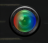

- VLC：一款多媒体播放器，方便录制调试视频后进行观看。若安装系统的时候选择最小安装，则不会预装媒体软件，因此需要自己安装。

  

- qv4l2：linux下相机驱动的图形界面，在Ubuntu软件商店可以找到，方便调节普通USB相机的参数。

  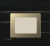

- Meld：一款diff软件的图形界面，方便对比文件的不同，在Git使用merge或pull的时候可能会用上,在Ubuntu软件商店可以找到。vscode也预置了此功能（只需要安装git），但是只能在repo文件夹里面启用。

  

- [Fsearch](http://cboxdoerfer.github.io/fsearch/)：和Windows下的everything类似，提供超快速的文件检索功能。

  

- [Typora](https://typora.io/#linux)：好看好用的markdown编辑器，本文就是使用typora编写的。**使用markdown编写代码的说明文档是一个很好的习惯**，这可以降低其他人阅读你编写的代码的难度，也有利于代码分享和代码的传承。同时，你的也可以使用markdown来记录自己的学习历程、一次艰难的问题解决之路。使用markdown可以提高你的记录效率。vscode内也有相关插件提供对markdown支持。现在似乎要收费了，可以在官网下载beta history版本，版本号为0.x的公测版仍然免费。

  

- TigerVNC：一款局域网内可用的远程桌面软件，VNCViewer也可以作为替代。***强烈推荐使用远程桌面调车！***电控都有无线调试器，我们怎么能跪在地上呢（气抖冷）。在把运算平台安装到机器人上之后，我也曾经拿着一块小屏幕和键鼠，蹲在地上和机器人进行亲密交流，这不仅加深了我和机器人的感情，~~也加重了我的颈椎病和腰椎键盘突出。~~（最恐怖的是车车的云台或者底盘疯了的时候，线全部缠到机器人上**！！机器人甚至有可能对你造成伤害！！**~~都是电控的锅，你云台怎么又疯了~~）使用了vnc后，只要将minipc和你的笔记本连接到同一个局域网，你就可以优雅地拿着笔记本调车了。如果校园网的带宽不够，建议买一个路由器，或者和搭建裁判系统的路由器公用也可以。

  

  其他远程桌面如Xrdp（分辨率和画质最好）、NoMachine（最流畅，画质次之）也是很好的选择。
  
  >  上交的同学更是把这件事做到了极致，他们直接通过网页来修改机器人的各种参数并得到反馈信息，能做到不需要任何远程桌面就能实时调参，此想法以为妙绝！华南师范大学使用ROS进行网页可视化，也是一种选择。不过这些都需要了解包括动态网页的构建在内的一些基本前端知识。
  
- SSH：在外面不需要图形界面的时候，能够直接连接终端就是一件很方便的事情。并且在代码真正部署上车时通常我们为了最大程度降低额外开销会选择关闭图形界面，终端连接就成了不二之选。使用过SSH连接服务器的同学应该对此不陌生了，有兴趣的同学可以了解一下**非对称加密**的原理。linux下可以直接使用终端作为ssh的客户端，windows下Microsoft全新推出的windows terminal也十分美观。其他的如PuTTy等也可以尝试。

  VScode也有SSH connection插件，可以将连接端的文件夹映射到本地，同时还可以直接在code里**重用端口开启多个终端**！
  
  


---

---

---


# **4.视觉组接触的硬件**

> 虽然别人总觉得视觉组就是整天对着屏幕臭敲代码的程序员，实际上我们也会接触很多的底层硬件与传感器，在使用硬件的同时很可能还需要综合运用其他学科的知识。

## 4.1.相机

- 相机是机器人的眼睛。和人眼的成像原理一样，相机通过镜头汇聚光束使他们聚集在一块半导体感光元件上（相当于视网膜）从而产生可供读取的数据。随后图像随着数据线传如miniPC等运算平台（视网膜刺激视神经传到神经冲动到大脑）。时下的感光单元主要分为两种：**CMOS和CCD**。电类的工科生或是摄影爱好者对此应该不会感到陌生。

  - CMOS(complementary metal-oxide semiconductor)传感器是由金属氧化物半导体排成的阵列，和发光半导体相反，其上的pn结受光照时会产生电荷存储在电容中，通过和内存一样的结构采用行选和列选开关，为每一行/每个像素点配备**放大器和AD**（Analog-to-Digital converter,模拟-数字信号转换器），选中位置的信号会通过OP和AD，从而将电荷转换为数字信号，最后生成图像。优点是**成本低，图像帧率高**，但是固有不可消除的采集噪声（每个采集单元的参数不可能完全一致）会影响成像的质量。

  - CCD(charged couple device)传感器是由最简单的MOS电容器阵列构成的，与CMOS不同，CCD的**每一行像素只配有一个信号处理器**，利用时钟脉冲驱动产生的差压，这一行电容器采集到的电荷会以串行的方式依次通过每一行末端的信号处理器从而产生图像。因此CCD能达到**更高的像素密度**（CMOS上的op和ad都要占用空间），其优点是**成像的一致性好，噪声很小**，由于不能同时处理所有信号，其帧率一般不高。

  - 想要获得关于感光单元的更多信息，请参阅[cmos和ccd](https://zhuanlan.zhihu.com/p/139394687)。

  - 系统地学习成像原理，参见国防科技大学的MOOC：[《第十五讲：CCD图像传感器》]([传感器与测试技术_中国大学MOOC(慕课) (icourse163.org)](https://www.icourse163.org/learn/NUDT-1003089003?tid=1466987457#/learn/content?type=detail&id=1247289367&sm=1))

    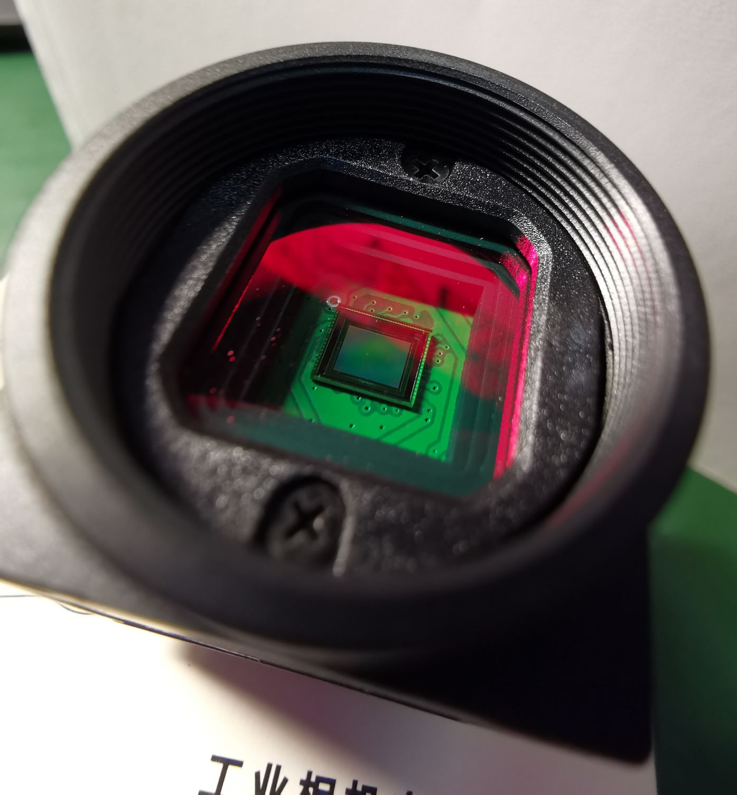

    <center>这是我们实验室的一枚MV工业相机，可以看到正中间有一块小小的CMOS传感器晶片</center>

  相机的快门还有**全局曝光**和**卷帘曝光**之分。全局曝光时一次性采集所有感光单元的信息或为每个感光单元配备一个寄存器暂存电荷，而卷帘曝光则是分时逐行采集信息（根据其名“卷帘”就能看出是一排一排地采集数据）。若经费充足建议购买全局曝光的相机，其所有单元在同一时刻采样，曝光时间和我们设置的曝光时间才是真正一致的。而卷帘曝光的相机第一行首先完成曝光，接着是第二行、第三行...到最后一行完成曝光时，中间大概有数百ns甚至ms级的时间，这就导致整个画面其实不是在同一时间采样的，在面对**高速运动**的物体是会出现**“果冻效应”**，即图像的不同部分出现倾斜、断层等现象，极大地影响了成像质量和识别的效果。CCD相机一般使用全局快门，而CMOS相机使用全局快门的制造成本很高，需要为每个感光单元配置一个寄存器。

  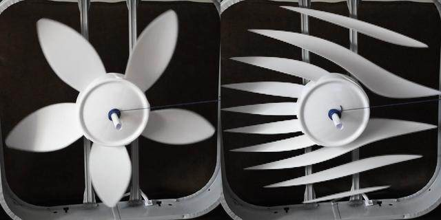

  <center>这两幅风扇的图像是在相同时刻分别用全局快门和卷帘快门的相机拍摄的</center>

  

  ---

  

- **镜头**就像人的晶状体，不同的是，人的晶状体是可以改变焦距但像距固定，而一般使用的工业相机和USB相机配套的镜头**是定焦但可以调节像距的**。不过在小孔成像模型中，我们把透镜看作被压缩成一个点的大小，因此在这种情况下我们认为**焦距和像距等同**。

  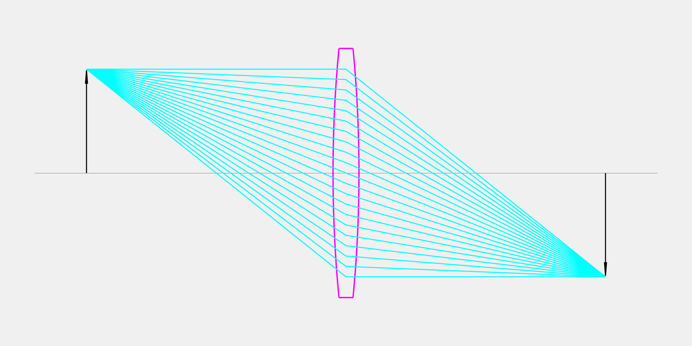

  <center>从透镜到小孔的近似过程，截取自知乎-龚健男的回答-凸透镜和小孔成像的原理与联系</center>

  - 我们都知道镜头是一块凸透镜，在他的两边各有一个焦点，焦点即是所有平行进入透镜的光线的汇聚点。不同焦距的镜头其视距和视野范围不同，一般来说，**视距大（看的远）的镜头，其视野范围小（可视角小）**；**而视距短（看的近些）的镜头，视野范围大**，典型的例子是广角镜头。拿生活中的例子来说，现在的手机的摄影系统都是由多个镜头组成的，每个镜头的焦距一般不同，从而适应不同焦段和视野的摄影需求。高级的镜头通常可以调节光圈大小，从而改变镜头的进光量。

  - 在比赛中，我们一般给步兵机器人配置广角镜头（适用**近战**，可视角广）或是6mm的镜头（中庸的选择，**兼顾长短**）。打击能量机关的步兵机器人会选择8mm、12mm的**长焦镜头**来获得更好的远距离成像效果。哨兵机器人可能会配置两个相机，分别搭载广角镜头和中短焦镜头，广角用于“广撒网”，对敌方目标进行大致的定位，之后交由另外一个相机进行精确的定位。有些打得准（弹道精度高）的队伍甚至为所有机器人都搭载了两枚镜头或选用**变焦镜头**，让机器人成为各个距离都能实施自动打击的多面手。

    *若想要更有针对性地选择镜头的焦距，可以根据相机成像模型进行视野要求和焦距之间相关关系的计算。*

  - 由于凸透镜**本身的性质**和镜头制造的**工艺**问题，使得光线在通过镜头时无法保持物体在空间中原本的位置关系而发生**畸变**，好在这些畸变都能够通过数学建模并由反向解算而得到还原。这需要我们通过**相机标定**来去除这种畸变以便还原图像中物体的真实位置。畸变主要分为切向畸变和桶型畸变，我们可以利用标定板和畸变的数学关系来进行相机标定，OpenCV中也有相关的函数可供调用。关于成像模型、畸变和标定，可以参阅[相机标定](https://zhuanlan.zhihu.com/p/30813733)和OpenCV官方文档中的[CameraCaliberation](https://docs.opencv.org/4.5.2/dc/dbb/tutorial_py_calibration.html)。在 *5.1、6.*3 中我们还会提到这一点，并且给出了提供标定流程的参考文章。

    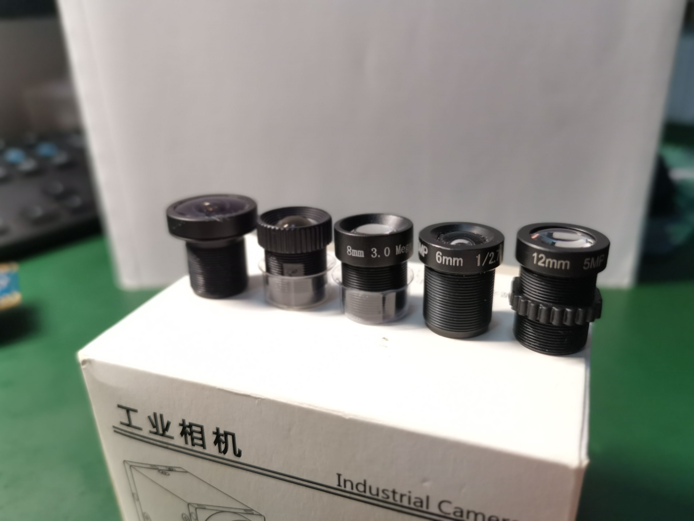

    <center>USB工业相机上几种不同焦距的M12镜头,依次是超广角,4mm,6mm,8mm,12mm</center>

    <center>M12镜头的12指的是相机上的接口直径为12mm</center>
    
  - **光圈**就是镜头前面可以开闭的小扇叶（M12镜头一般不可以调节光圈，但板级工业相机一般有一个“auto aperture”的选项，可以根据环境亮度调节“虚拟光圈”，毕竟上面没有机械光圈）。不同光圈大小代表不同的镜头开度，其影响的是镜头的进光量。一般用**f值**刻画光圈的开合程度：

    

    <center>f/x，x代表的是开合程度，镜头上此数值越大说明通光孔的直径越大</center>

    光圈还和成像的景深有关系，越大的光圈得到的景深越小，即成清晰像的范围越小：

    

    <center>光圈越大，景深越小，反之景深更大</center>

    因此，在调大光圈提高进光量的同时，能够成清晰像的距离范围就缩小了，我们需要在两者之间进行权衡。不过没有关系，为了提高画面的亮度和可视性，我们在下一个小节会介绍曝光时间和增益，以及gamma者三个参数。

    此外，不可追求景深而将光圈缩得太小。一方面是进光量大大下降（平方反比级），另一方面是光在通过小孔的时候会有强烈的**衍射**现象，导致像的边缘模糊，边界不够锐利。

    

  ---

  

- 相机在使用过程中，除了硬件参数我们还可以调节许多采集参数，这里列出一些主要的参数：

  - **曝光**：每一帧图像的感光时间，其值愈大则画面的整体亮度越大，曝光时间过长过短都可能会出现宽容度不够的情况（一片雪白或是漆黑无比），**选择正确的曝光是算法能否奏效的关键**。如传统的灯条特征选取算法就要求恰当的低曝光以保证灯条**不会出现过曝而显现白色**但同时又要能够**看清装甲板中间的数字**以便进行模板匹配、svm分类或其他数字识别；运用卷积神经网络的目标检测算法则需要相机采集到的画面能尽量接近数据集中图片的情况，一般来说需要高一些的曝光。

  - **帧率**：相机每秒钟能够获取的图像数。一般来说，如果你的图像处理算法的速度够快，那么帧率越高越好，这能够保证你处理结果的**实时性**。一些相机提供了***硬件触发*** 功能，这样能够让相机以固定的时间间隔触发采样，保证两帧之间的时间相同，以便于和机器人的控制进行时间线同步。视觉算法处理、数据传输、电控算法处理、再到控制执行机构动作，最后子弹在空中飞行——这几个过程中都有时间延迟，累加之后算是非常可观。***高速的算法和确定的延迟时间是打造预测算法的基础。***

  - **白平衡**：设定白色是怎么样的“白”，本意是不管在任何光源下都让原本呈现白色的物体通过增加偏置而还原为白色。涉及到色温和颜色空间的概念，调节此参数即调整RGB三原色的混合比例。

  - **图像保存格式**：图像的编码方法，如JPEG, RGB, YUYV, YUY2等，不同的编码格式保存的信息量可能有差别。我们会在 *5.0* 节进一步了解相关信息。

  - **分辨率**：一张图像的像素数，常见的有1920x1080，1280x720，640x480，一般来说，分辨率越高则图像保留的细节就越多，但同时相机处理的数据量变大，会降低采集帧率和每秒传输的图像数量。在之后的图像处理中，同样意味着更大的开销和处理速度下降。

  - **增益**：调节感光单元在**进行电荷信号放大时的增益**（gain,一般是用dB表示的,这需要你注意数量级），对于图像的亮度和各颜色信息的保存都有影响。在低曝光的时候可以有效提高成像质量，但同时也可能提高噪声（不规则噪声信号也会被放大）。

  - **对比度**：图像中明暗区域最亮的白和最暗的黑之间不同亮度层级的测量，差异范围越大代表对比越大,在高动态范围和高宽容度的时候，提高对比度可以凸显图像中亮度不同部分的区别，相当于用一把刻度更精细的尺子去测量物体能够得到更精细度量信息。某些情况下，提高对比度所指的则是直接增加亮暗之间的差别，**让亮部更亮，暗部更暗。**

  - **饱和度**：是[HSV色彩空间](https://baike.baidu.com/item/%E9%A5%B1%E5%92%8C%E5%BA%A6/3430026)中的概念，代表了一种颜色的纯度（Saturation）。

    *这里推荐使用qv4l2这款软件，可以方便的给相机调参并实时显示效果。*

    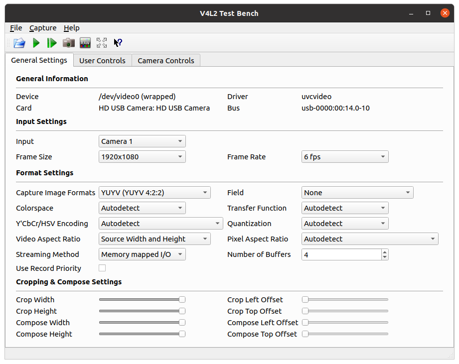

    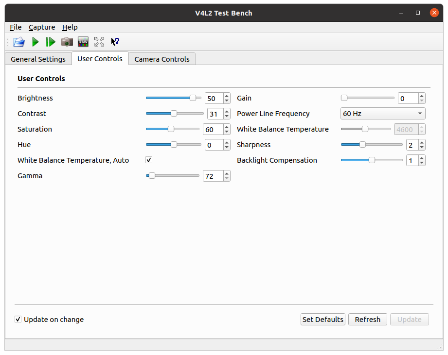

<center>这是软件qv4l2的截图,v4l2是linux自带的相机驱动程序,可以看到有许多可供我们调整的设置</center>

<center>工业相机的配置则需要使用厂商提供的sdk,OpenCV也提供了一些修改相机参数的函数</center>

- 这里介绍一些相机的硬件参数：

  - **靶面尺寸**：该参数即感光元件的面积大小，值越大表明面积越大，面积越大进光量就越大，信噪比自然会相应提高，对于暗光环境会有更好的成像效果，还有其他种种优势，这也是所谓的**底大一级压死人**。使用靶面尺寸这个看起来无厘头的metric其实是有历史渊源的。

    > 在CCD出现之前，摄像机是一直使用光导摄像管的成像器件感光成像的，其直径的大小，直接决定了其成像面积的大小。因此，后来大家就用光导摄像管的直径尺寸来表示不同感光面积的产品型号。直到CCD出现之后，也就自然而然沿用了光导摄像管的尺寸表示方法，进而扩展到所有类型的图像传感器的尺寸表示方法上。
    >
    > 例如，型号为“1/1.8”的CCD或CMOS，就表示其成像面积与一根直径为1/1.8英寸的光导摄像管的成像靶面面积近似。光导摄像管的直径与CCD/CMOS成像靶面面积之间没有固定的换算公式，从实际情况来说，CCD/CMOS成像靶面的对角线长度大约相当于光导摄像管直径长度的2/3。

    常见的靶面尺寸其和实际面积的对应关系如下：

    

    

  - **宽容度/动态范围**：大家常常会问一个问题：为什么我的相机拍出来的画面很暗，但是灯条中间仍然发白？这是相机的硬件特性**动态范围**或**宽容度**（这两个词汇在摄影领域常常被混淆，但是对于数字相机而言这两个词汇代表的意思几乎一致）所决定的。动态范围即感光元件能够记录的光强从最低到最高亮度的范围。最低即感光元件刚好有输出(或是当没有任何光线进入时产生的响应，即暗电流)，会根据光线变化而产生电荷变化的**阈值**；最高亮度范围则是相机能够捕捉的最大累积光强，就像放大器一样，超过了其输出上限就会产生**截断**，此时即使继续提高曝光时间或外界光强增大，转换原件的输出也不会变得更大。因此上面的问题就出在相机的宽容度不足上。以高级的摄影器材为例，它们通常拥有超高的宽容度，相当于“自带” HDR，下方是RM官方制作的数据集ROCO中的一张图片，可以发现画面整体明亮，但是红色装甲板表现地非常“红”，蓝色也很“蓝”，没有出现“过曝”的情况。

    因此在选购相机的时候，特别是对于传统算法，应该选择动态范围大的相机。动态范围一般以dB为单位，表明最大输入和最小输入之间的倍率关系。

    

    <center>图源ROCO数据集，建议在新标签页中打开放大观看</center>

  - **像元尺寸**：顾名思义就是一个像素的实际面积有多大。在靶面尺寸相同的情况下，自然是拥有更大像元尺寸的传感器的感光能力更强了（合并后的像素可以采集更多的光线）。不过相应的，这自然会造成分辨率的下降。一般工业相机的SDK都支持**合并数个像元**（通常是*水平合并* 以及*竖直合并* ，或者叫**Binning**），让用户可以合并相邻像素获得更高的画面亮度（binning也分为模拟binning[硬件支持？]和数字binning[利用算法进行插值]，模拟binning由于DSP需要处理的数据变少了/CMOS转换的行列帧数减少，可以提高采集帧率）。还有另外一种降低分辨率（一般是为了提高采样速度）的方法是下采样，这种方法和像素合并不同，直接看下图就很好理解：

    
  
    <center>只选择深色的像素进行成像，白色像素不工作</center>
    
    特别注意，若选用相机的ROI模式或者直接修改分辨率，则会在cmos上裁剪一块区域用于成像，剩下的区域不会工作。这会提高相机的工作帧率，**但是显然会减小成像的视场角**，因为有效成像面积下降了。下采样则在分辨率下降的时候保持相同的视场角。
    
  - **信噪比**：SNR（signal noise ratio）是真正的由光线引起的动作信号和噪声（电磁干扰、杂光、暗电流和散射光等）的比值，一般也是用dB来衡量。注意区分此参数和动态范围此参数越大，在增大增益的时候，噪点引起的干扰会越小。
  
    
  
    <center>信噪比和动态范围的对比，图源https://www.znjtech.cn</center>
  
  - **像素格式**：或者叫图像保存的格式/采样格式。常见的有这些：
  
    - Mono 8/10/12，黑白
    - Bayer RG 8/10/10Packed/12/12Packed
    - YUV422Packed，YUV422_YUYV_Packed
    - RGB 8，BGR 8 ；BGR 8是最友好的，采集后可以直接用`cv::Mat`处理，不需要额外的转换开销
  
    对于工业相机采集得到的原始数据，OpenCV可以直接处理第一种和第四种，而Bayer格式和YUV系列的则需要经过手动转换或者使用相机自带的SDK进行格式转换，才能为OpenCV所处理（OpenCV似乎也提供了转换的API）。实际上大部分相机在拍摄时的格式都是**Bayer RG**，这是因为像素的实际排列并不是规则的RGB三种像素（一个像素单元实际上只能感受一种波长的光）：
  
    
  
    <center>最常见的RGGB排列方式</center>
  
    既然绿色像素比红蓝像素多，其转换的时候必然要进行权重的矫正。对于没有对应颜色像素存在的地方，转换的时候肯定要进行插值，选择的插值方式（线性、双线性、泰勒）对于**转换速度/转换质量**的影响是比较大的。
  
    > 当初华为手机在宣传其摄影功能的时候就提到它使用的是RYYB的排列以最大程度提高感光能力，不过缺少绿色像素，其成像即使经过算法矫正也通常偏黄。
  
  - **链接方式**：即相机连接到运算平台使用的硬件定义和通信协议。我们会用到的、最常见的有USB3和工业网口GigE，工业场合历史遗留或标准遗留的包括CamerLink和IEEE1394、CoaXPress，由于通用性和可扩展性不佳正在被逐渐淘汰。现代工业相机一般还支持自定义的可编程数字IO接口，即下图中的圆形6-pin数字IO：
  
    
  
    <center>上方为USB3.0，左下方为数字IO</center>
  
    6-pin接口一般包括光耦输入和输出以及光耦地（这两路信号都通过光耦二极管进行电气隔离形成保护），电源和电源地，还有一路可配置GPIO（可以配置成输入或输出）。额外电源一般在USB接口供电能力不足或高负载工作的时候才需要连接，GPIO以及光耦输入输出三条线可以用于硬件触发、采集触发等功能，对于与其他设备同步采集时间戳是一个非常有效的解决方案。
  
    **USB连接线在相机一端一定要选用有固定装置的接头**（相机上都有由于固定的螺孔），防止松动导致连接异常，损坏接口甚至由于不明原因的异常导致相机内部DSP损坏。USB和GigE虽然都支持热拔插，但还是**尽量停止取流并断开相机后**再行拔插，笔者使用海康威视工业相机的时候就常因为连接不稳数次后相机亮红灯，而一些机械结构的设计又让重新拔插分外困难。连接到运算平台的一侧，在确认机械结构不再改动后可以打上热熔胶或使用3D打印件进行固定防止松动。
  
    

---

---


## 4.2.运算平台

- 常见的运算平台有这几种：定制的minipc、Intel NUC、jetson系列、DJI manifold2（有cpu版本和gpu版本，分别相当于同配置的i7-8265u的minipc和jetson tx2，不过manifold的体积很小）、工控主板/工控机、OpenMV、k210、k510等。其实选型的空间并不大，不过需要大家根据预算平衡一下性能和价格。

  那么如何评价一个运算平台的性能呢，这里要提一下CPU和GPU运行的概念。CPU的**时钟频率高**，但是内部的运算单元（ALU、FPU等）**数量有限**，是为**通用**计算和程序控制所设计的，其实并不擅长进行大规模的并行运算，比较擅长单线程的流水线处理。GPU则相反，GPU有**大量的低速运算单元**，但是能够一次性处理巨量并行数据，因此尤其适合**图形计算**（相当于每一个运算单元计算一个像素的相关数据）。视频解码、单线进行的程序适合在CPU上运行；图形处理、显示渲染则适合用GPU进行。这也是为什么大家都说玩3A大作这些大型游戏需要一张好的显卡（GPU）。

  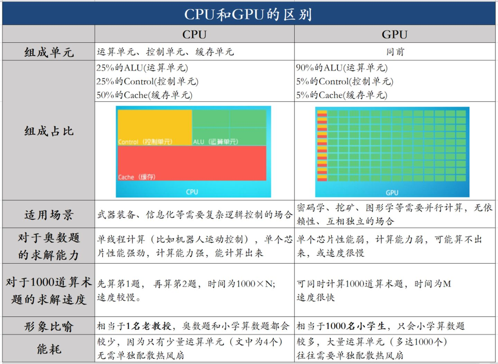

  <center> GPU和CPU的对比-来自知乎用户‘牛鸽’的专栏-https://zhuanlan.zhihu.com/p/156171120 </center>

  当然，也有专门用于各种运算的TPU、NPU、APU等等等等，他们都属于ASIC（application specific integrated circuit），直接将一些特殊运算（比如神经网络中的激活函数、矩阵乘法、非线性运算）或者软件功能**固化在硬件**中，以提高处理速度。

  >  常听说的DSP（digital signal processor ）其实也可以看作一种ASIC，如相机中用于采集cmos信号或专能于图像处理的芯片。

  ---

- 一般用于评价性能的算力指标有GOPS（Giga Operations Per Second），MOPS（Million Operation Per Second），**TOPS（Tera Operations Per Second）**。若有F如TFLOPS，则是衡量**浮点运算能力**。英伟达官方也有一套衡量N家显卡机器学习算力的标准，参见[CUDA GPU | NVIDIA Developer](https://developer.nvidia.com/zh-cn/cuda-gpus)。若显卡的compute ability大于5，一般来说就比较适合进行机器学习的训练。（但是貌似官方没有给出定量的计算方法，可能是根据自家cuda内核数、tensor单元数和主频等参数通过一些加权方法得到的分数）

  注意，不同类型的数据运算速度也不同，因为CPU、GPU等有专门的ALU或针对某些运算优化的指令集。常见的类型有INT8/16/32（8/16/32位整型）和FP16/32（16和32位浮点），也有较为少见的FP8以及一些”奇怪“的混合精度计算。

- 在RM比赛中的识别算法中，**传统的灯条匹配算法是更依赖CPU的**，但是因为涉及到矩阵运算，OpenCV支持的一些图形库能够利用电脑GPU的能力进行加速（intel自家的ippcv以及OpenCV Contrib的cuda库）。而新兴的基于卷积神经网络的**目标检测算法则是非常依赖电脑的GPU性能**。不过，Intel推出的OpenVINO部署平台（仅仅支持Intel的cpu）和腾讯优图开源的NCNN（适合arm架构）推理框架都能够通过优化CPU的运算来提高神经网络的性能。英伟达的TensorRT推理框架则是只支持自家的GPU（jetson平台上也可以部署），能进一步提高神经网络的推理速度。

- 为了提供性能的大致参考指标，这里介绍一下下文所说的[Nanodet](https://github.com/RangiLyu/nanodet)（我们使用的是Nanodet-m，320x320的输入，backbone使用的是shuffleNet V2）和传统算法。Nanodet是一款超轻量化的目标检测模型，是基于卷积神经网络的目标检测算法的代表之一，可以以此作为其他目标检测算法的基准（benchmark）；下文提到的传统算法则是基于特征提取和灯条匹配完成的。我们在第五部分、第六部分会分别详尽地介绍这两个算法。

  *以下分别介绍一下各个运算平台：*

  - **minipc**：搭载i7-8265u, i7-8565u的minipc较为常见，在tb上能够找到各种大小的minipc，至于那些搭载intel **J系列**和**N系列**的Genimi Lake架构的工控机、软路由、电脑棒、计算卡之类的玩意，**是根本带不动神经网络的**，如果是J1900甚至解码视频流都会出现卡顿。我们实验室曾经为了缩小体积购买了一台40x40x40大小的N4100 cpu的minipc，结果就是神经网络的目标检测大约10-12fps，传统的灯条匹配在不进行数字识别、环境光线简单的情况下也只有50-60fps。所以，从性能的角度考虑，**至少是标准架构的i5-7代之后的cpu**才能胜任RoboMaster赛场的视觉任务。

    > 更新：现在有AMD锐龙的minipc下场了，参考配置为R7-4800H和R5-5600U，性价比都还可以，不过外壳都做的比较大，参考价格2000RMB。关键的是，Zen2+在完善了AVX512指令集后似乎也兼容OpenVINO，笔者的电脑（amd r5-5600H）可以正常使用OpenVINO 21.04LTS。

    

  - **Intel NUC**：8代和9代的nuc和上面提到的miniPC并没有什么区别，价格还要贵一些。而nuc10在nuc11登场后就成为了一个性价比比较高的选择，最近NUC11的价格也非常的不错。nuc11建议购买i5以上的配置，intel在第十一代cpu中挤了很多牙膏，用锐炬Xe显卡替代了万年不变的UHD630，这让nuc上运行神经网络成为可能。我们实验室同样配置了一台nuc11猎豹峡谷，cpu为i5-1135G7，运行传统算法能够达到250-350fps（全图检测），加入ROI检测后甚至处理一张图片只需要1ms左右的时间，速度不可谓不快。并且配合Intel OpenVINO推理框架，即使使用OpenVINO推理神经网络也能达到很好的效果。我们实测运行nanodet网络，使用Vulkan+NCNN/MNN/LibTorch对Xe显卡加速后能够达到50-60fps的速度，若运行OpenVINO推理框架则**拥有约150fps的速度**。选择i7系列的nuc11，并且配置更高频率的内存条（核显没有显存使用的是内存因此需要更高频的内存来提供访存带宽），应该能够有进一步的提升。

    参考算力：i7-1185G7的核显拥有1.9FLOPS的fp32算力。FP32推理YOLOX-n拥有50fps的推理速度。

    *推荐购买薄款，厚款其实就是增加了一个2.5inch的机械硬盘位，当然也可以购买厚款然后把外壳拆了让机械组的同学帮忙设计一个亚克力外壳或3d打印一个外壳。*

    

  - **工控主板**：现有intel 11代的工控主板，相当于NUC的翻版，只不过砍掉了雷电接口和无线网卡，但是价格同样直接腰斩！（单单主板2000以内）散热能力稍逊于NUC11，其他方面持平。而且拥有板载串口、USBo1/2，自带2个网口，非常方便扩展。只需要自己用3d打印或板材拼接制作外壳即可，是替代NUC的不二之选。若后续推出AMD的工控主板，性价比应该更高。工控主板的测评可以看华南师范大学CJ的b站：https://www.bilibili.com/video/BV13S4y1e7mS （其实这款工控板最早是笔者发现的哦~😋）

    

  - **Jetson系列**：使用jetson系列主要是看重其GPU性能。目前能够使用神经网络检测达到实时性要求的设备，应该只有jetson tx 2（有些吃力）、jetson Xavier NX和jetson Xavier AGX。若使用Tensorrt框架部署后，Xavier AGX的int8算力接近1080ti，浮点算力和1070持平，是当下**最强力**的边缘运算平台。Xavier NX的算力是AGX的2/3～3/5左右，tx2就要更劣一筹。其大小相对minipc和NUC来说有比较大的优势，哈工深的同学自己定制了一块[Xavier NX载板](https://bbs.robomaster.com/forum.php?mod=viewthread&tid=12232)，进一步缩小了运算平台的体积。不过由于jetson搭载的是ARM64架构的cpu，可能在某些软件的兼容性上有一些问题，如conda等，好在大多数可以在网上找到解决方案或替代方案。GPU类型设备适合推理**标准卷积架构**。不过Jetson系列的CPU稍显孱弱（相比x86大核）。

    ***不推荐使用 jetson nano、jetson tx1。***

    > 更新：Jetson nx以下的开发板现在应该是非常吃力！！Nano和TX2强烈不推荐，而且现在溢价非常严重。
    >
    > 更新：新版的Jetson NX orin和Jetson Xavier orin在2022的第三和第四季度马上要推出了，算力爆炸（当然价格也可能爆炸）。

    

  - **DJI Manifold**：主要优势就是体积和重量，若不差钱且机械对体积重量要求高则可以选择这款。但是使用改造载板的Jetson Xavier NX应该在价格体积重量性能上完胜Manifold G系列了（没有催更DJI的意思，~~反正就算更新了也买不起~~）。

    *极度不推荐使用 Manifold1*

    > 更新：不再推荐使用DJI Manifold

    

  - **OpenMV**：32位架构的处理器算力在复杂的视觉处理场景明显不足，这里提到openmv主要是在飞镖系统上可能会用到这款运算平台，其扩展能力可以同时兼顾运动控制。openmv相对其他的运算平台优点就是体积非常小非常轻，并且编写其程序使用micropython，开发的速度很快。openmv也可以为机器人增加*辅助视觉功能*，提供一些不那么复杂的算法处理工作。

    

  - **k210/k510**：勘智科技推出的人工智能处理芯片。特点是体积小，非常小！现在市面上能买到用micro-python开发的maixpy出品的k210芯片。AI算算力在同价位和大小属于独一档。特别提一下最新推出的k510芯片，算力到达了**2.5TFOPS**，超过了jetson tx 2的2.1 TFPLOS！如果队伍内的电控组或硬件组有能力的话，可以让组内的同学根据datasheet制作pcb板，进一步缩小运算平台的体积。nihui大神已经成功[把ncnn移植到RISC-V](https://zhuanlan.zhihu.com/p/160249065)上（即k210和k510的处理器架构），如果后续能移植linux mint等**微型linux系统**到k510上（机械狂喜ohhhhhhhhh），将会大大便利在这些soc上的开发。并且这些芯片同时提供了低速IO外设，从这里也可以看出它们是专为嵌入式边缘应用打造的。k210适合做飞镖制导，或作为机器人的辅助视觉单元，而k510的超强算力（同体积重量来说）甚至能够胜任整个机器人的控制！不过由于其cpu相比其他平台还是稍显孱弱，除非能在视频解码上进行优化，否则帧率可能会受限。

    > 更新：K510已经上市，参考价格为999RMB，目前只有勘智官方自己做的开发板，体积比较大。

    

  - 各种Linux/Android开发板：例如全志和瑞芯推出的各类arm64架构的开发板。arm64对于ncnn、mnn等推理框架的支持较好，适合推理深度可分离卷积的模型。不过目前似乎没有队伍尝试使用此类运算平台。

    

    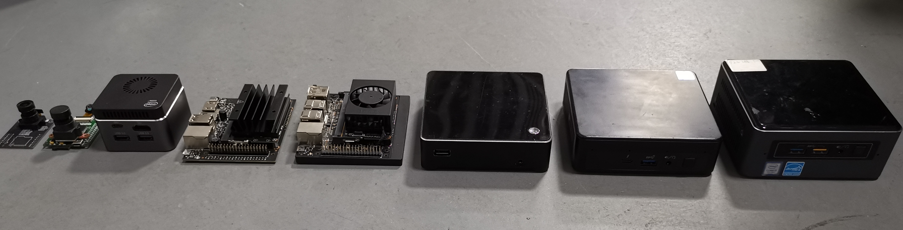

    <center>各个运算平台大小的对比，从左起依次是k210、openmv、某intel N4100的minipc、Jetson nano、jetson Xavier NX、i7-8265u的minipc、intel NUC11猎豹峡谷、intel NUC7 Bean canyon(豆子峡谷)</center>
    
    ---

- 有些经费比较宽裕的队伍可能会专门搭建一台用于队伍网络服务的服务器+深度学习训练机+雷达站运算端。若预算不足，则可以选择在一些提供云服务器训练的商家购买GPU核时进行训练，价格也不算太贵。现在的显卡价格实在过高，不适合自己额外购置显卡，如果有钱当我没说。（~~挖矿的都给爷爬~~）

  若要搭建雷达站又苦于显卡太贵，这里推荐雷达可以使用搭载较好显卡的游戏本或者intel NUC 11幻影峡谷：i7-1185G7+RTX2060的配置进行前向推理还是没有任何问题的，平时若有需要还可以用于训练小模型。

  > 之前在***RM视觉交流群*** 就有小伙伴提出大家可以利用各自手里有的运算平台测试各种网络和传统算法，制作一个modle-zoo，如果有想法的同学或者已经测得数据的小伙伴可以戳我，让我们一起完善这个表格哦！

  

---

---


## 4.3.激光雷达

（To be continued）


---

---


## 4.4.特殊相机

- 双目相机

  双目相机应该是最早出现的也是最成熟的立体视觉方案。利用两个相机的**视差**和他们固定的**相对位置**信息，通过3d数学的几何解算方法计算对应点之间的位置偏差，得到物体的深度信息。关于双目相机的测距原理，请参考《机器人视觉测量与控制》这本书。这篇[教程](https://cloud.tencent.com/developer/article/1824593)较为详细地讲述了双目相机测距的基本原理和用法。

  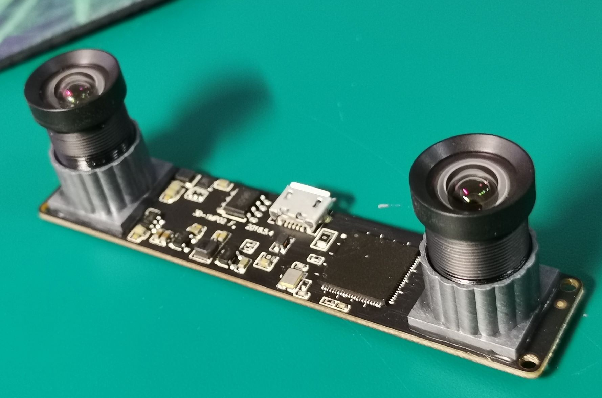

  <center>双目相机</center>

  OpenCV也提供了双目标定的例程和大致的原理说明。同步双目相机（两个相机在一块pcb上，公用一个相机号，在Linux系统下只有一个文件）的标定要比两个单独的相机更容易标定，使用两个单独相机也需要尽量让参数保持一致以便得到更简单的解算模型。

  双目相机通过视差由相似三角形得到的测距精度显然是要比单目高的，不过解算的开销要远大于单目。但是提升的精度对于我们补偿算法的影响其实并不大，而且高精度也带来对误差敏感性的提升。单目相机在目前的RMUC赛场是应该是足够满足我们的需求了。不过，了解双目标定和解算的原理对于理解3维重建、学习3d数学与线性代数是有很大的帮助的。我们会在 *6.3* 中详细介绍距离解算和三维重建的内容。

  > 西北工业大学WMJ战队在2021赛季采用了双目视觉，可以看到他们的哨兵云台拥有一个像《机器人总动员》中WallE一样的长条形大脑袋。不知道他们会不会开源他们的双目视觉解算方案呢～
  
  
  
- 双光相机

  可以采用NIR（近红外）+RGB的双目相机组合，这在目标检测领域这是一个新兴的方向。红外成像可以弥补低可见光照条件下的噪声影响和细节信息的丢失，若采用这种组合则可以进行优势互补。笔者正在测试一款双目双光相机，测试结束后会更新。

  

- 深度相机

  生产深度相机的规模化厂家目前主要有4个：ZED、intel Realsense、奥比中光、Kinect。大部分厂商采用的解决方案都是**双目➕TOF/结构光**的方案，相机内部的DSP芯片会融合多个信息来源的图像进而结算得到深度图。使用深度相机的时候，厂家一般都是对其进行了彻底的封装，我们对于其原理只需要有大致的了解即可。

  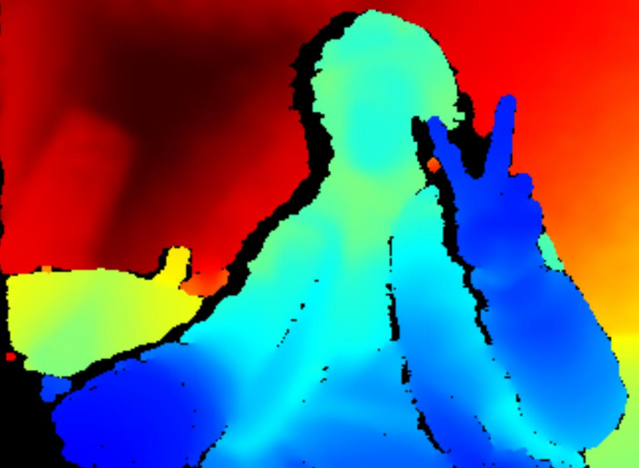

  <center>intel深度相机拍摄得到的深度图像,像素的不同颜色表示距相机的距离不同</center>

  在上图中由紫色到红色表示距离的远近，黑色则是因为遮挡或相差导致双目相机无法解算生成的**深度空洞**，深度相机一般也有一个**空洞率**的参数，越低越好。

  相机提供了相应的SDK供我们进行二次开发，调用对应的函数接口就可以得到一幅深度图，每个像素的value即为相机视野范围内对应点和相机的距离。不过商用产品的闭源特性让我们很难进行深度DIY（深度相机还是不够有深度呀~）。由于需要内置DSP对图像信息进行实时解算，限于体积和功耗，目前市面上的深度相机帧率多少都有些不足，最高的为intel D435，能够在800x640的分辨率下达到90fps的速度（深度图90Hz，而RGB光学相机的采样频率是60Hz故同步时也仅有60Hz）。

  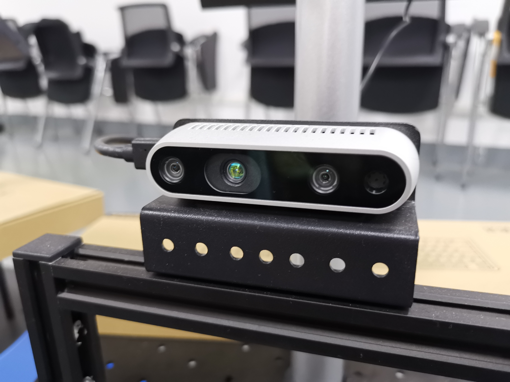

  <center>Intel D435深感相机，采用usb3.0-typec连接</center>

  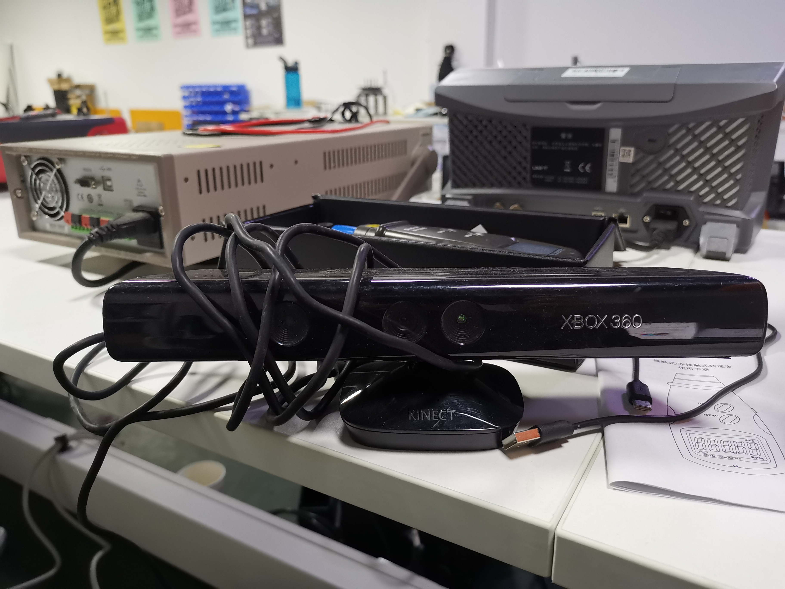

  <center>笔者所在学校的实验室居然还有一个kinect Xbox360体感相机，确定不是买来玩游戏的吗...</center>
  
  在RMUA赛场上，深度相机由于开发方便，赛场场地小，经常被用作视觉SLAM中的一环。期待有学校能够扬长避短，将深度相机部署到RMUC赛场上。


---

---


## 4.5.低速IO外设

在处理完图像并得到装甲板、能量机关扇叶相对相机中心的角度或找到救援目标和矿石之后，我们要设法和电控通信，让下位机能够接收到数据，告诉机器人目标在哪个方向、敌人处于什么状态，进而控制电机、气缸等来执行我们的任务。同时我们也需要从电控获取一些信息，如敌我的颜色、当前工作模式（自瞄、激活能量机关还是手动）、裁判系统读取到的各种状态等。以下介绍两种通信方法和对应的协议。CS专业、了解过计算机网络或学习过嵌入式开发的同学对此应该不陌生。

- **串行通信**：常用通信方法之一就是通过 串口（Serial Port）。为了方便简单起见，我们使用的都是异步串行通信，通过一个usb转串口芯片将解算好的数据发送给电控，电控经过一定处理后再控制电机动作。

  - 串口通信的基本知识：在最简单的串口使用中，通信需要两条线路，一条用于发送，一条用于接收（其实还需要一根共地连接线）。顾名思义，串口通信就是将数据像“串”一样一位一位的顺着一条线发送出去。任何通信方法都需要制定通信协议，串口通信也不例外。异步串口通信中需要通信的双方提前约定好**波特率**、**数据位**、**停止位**、**奇偶校验位**。因为使用的是最简单的两线通信，需要关闭**硬件流控制**。关于串口通信的更多基本信息，请参考[What is Serial Communication and How it works?](https://www.codrey.com/embedded-systems/serial-communication-basics/)

  - 串口在Linux上作为一个设备，同样会以文件的形式挂载在 */dev* 分区，使用时需要赋予串口权限：

    ```bash
    sudo chmod 777 /dev/ttyUSB0 
    #当电脑只连接了一个串口时，将挂载为ttyUSB0，对于一切皆文件的LINUX，其实和赋予文件的读写权限差不多
    ```

    若不想每次使用都输入一次，希望永久赋予串口权限，参考这个教程：[永久打开串口权限](https://blog.csdn.net/qq_39779233/article/details/111400187)

  - 串口通信协议：通信发送开始时，先发送一位0表示开始发送，紧接着是8位的数据（相当于一次发送一个byte，低位在前），然后是一位奇偶校验位（如果开启此功能），最后是一位停止位1（可以设置不同的位数1.5、2）。以上便是串口通信的一个数据包。显然单单通过这样简单的协议（一个数据包传送8位数据，最多可以表示256种状态），我们无法完成复杂的通信功能。因此，在此基础上我们定制一套自己的通信协议以完成数据包更大、数据类型更复杂的通信，形成一个简单的协议栈。

    - 一个简单的协议需要包含**帧头**（标明数据包的开始）、数据内容（需要传送的数据）和**帧尾**（表明一个数据包结束）。
    - 在数据包中可以增加用于数据校验的校验码，通信中常使用的有CRC（cyclic redundant check）、奇偶校验、和校验、哈希校验等。
    - 高层的通信协议（在这里为我们自己制定的通信协议）是以底层协议为基础（这里为串行通信协议），如典型的、当下最复杂的网络——计算机网络，就采用了5层通信协议栈（也有7层的说法）。

  - 刚刚入门没有看懂或是想要更具体的实例，请参考这篇文章：[在串口通信的基础上定制一个简单的通信协议-NeoZng]()

    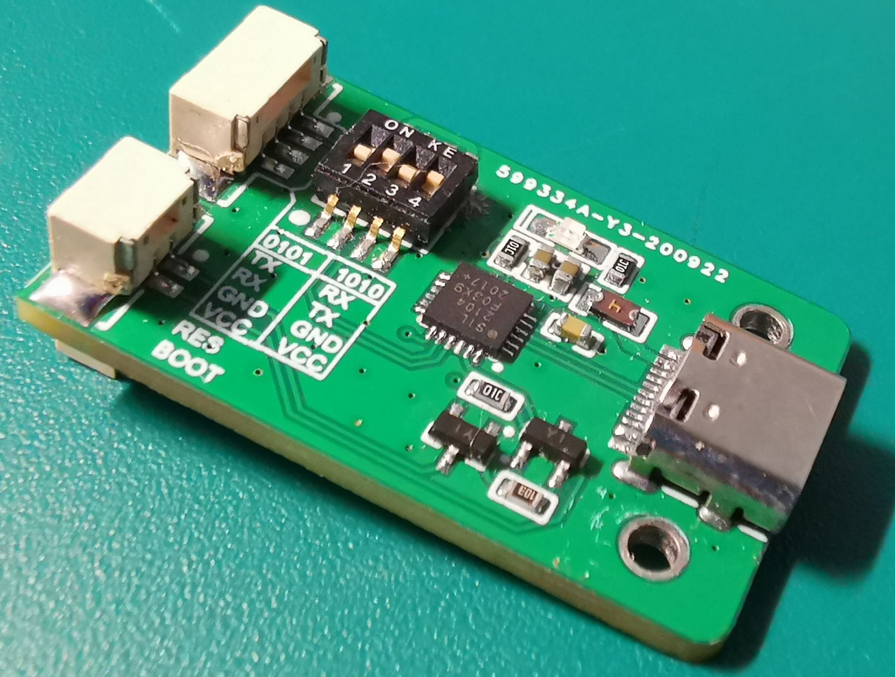

    <center>这是一个USB转TTL串口的芯片，由seasky-lw设计</center>

    

    ---

  

- **CAN**：另一种被广泛使用的方法是CAN（Controller Area Network）通信，CAN是一种由博 世开发的通信规范和协议，是一种应用广泛的现场总线，在工业测控和工业自动化等领域有很大的应用。其最大的特点就是稳定性（使用了**差分通信**的方法）和灵活性（设备只要挂载在总线上就可以使用，不需要额外的连接）。我们在比赛中大量使用了DJI生产的电机，这些电机都非常的智能，通过集成了mcu的电子调速器，我们可以跳过下位机器，直接通过CAN与电调上的微控制器进行通信，将控制信息直接发送给电调从而控制电机的转动。当然也可以把信息通过can发送给电控再由下位机对执行单元进行控制。

  - 想要让运算平台支持CAN通信，有两种方法：

    - Jetson（nano除外）、树莓派等主板上自带 40 pin接口，只需要一个CAN收发器即可实现CAN通信。
    - 购买一个USB转CAN转接器，也可以实现CAN通信。

    希望学习具体的例子，在Linux上利用CAN进行通信，请看这里：[在Jetson Xavier NX上实现CAN通信并控制3508电机-NeoZng]()

  - CAN通信的基本知识：和串口一样，必然也需要一个通信协议。不同的是，其信号是通过其总线上电平的差值来表示的，这样能够有效抑制共模信号（因为噪声对两条线的影响通常是一样的，相减之后噪声的影响便被消除了），因此一般采用两条通信线。不过也最好连接地线，共地可以最大程度降低干扰。还有4-pin的CAN线，额外的一条线用于独立供电，适用于对信号质量特别高的场合，此电源专门为CAN收发器和信号电平供电。

  - 由于采用了总线结构，数据的传输只能是分时复用地，其通信机制更为复杂一些，故不在此赘述，想要详细了解其硬件构成和通信协议，请参阅[一篇易懂的CAN通讯协议指南](https://blog.csdn.net/qq_39779233/article/details/111400187)。

  - 注意CAN的带宽有限，常用的有250k、500k和高速的1M，**不要在一条总线上挂载过多的大流量设备**，否则会出现丢帧、乱码等情况。

  - 每个结点的ID必须独立，CAN协议中的仲裁顺序和send-ack机制就决定了总线上的不同设备需要设定不同的id。新人很容易犯这样的**错误**：两个结点（常常是想要同步转动的电机）设置相同id，这样就能发一次信息让两者同时接收。
  
  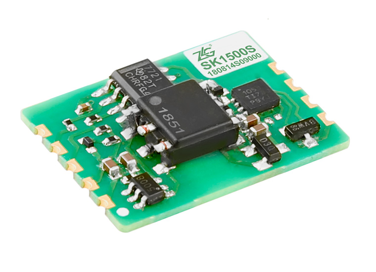
  
  <center>一个CAN收发器<center>


- 对于其他的通信方法如SPI、I2C等，其实都大同小异**，**只要了解了通信的基本原理，都能够很快上手对应的API。感兴趣的同学可以自行搜索学习具体的软硬件实现。

> 说到和电控方面的通信，这里不得不提一下广东工业大学的视觉控制一体解决方案：[rm-control](https://rm-controls.github.io/)，他们机器人只使用了一个运算平台，将上位机下位机合二为一，通过CAN控制电机。这消除了minipc到单片机通信产生的延迟，并且有良好的兼容性和复用性，维护起来也很方便。并且他们还研发了一款应该是市面上体积最小的usb转can模块。很佩服第一个有这样的想法同时又将其付诸实践的同学(廖佬nb！)。


---

---

---


# **5.比赛中的CV算法**

> 讲了这么多，视觉组的重头戏——算法终于来了。
>
> 在大部分时候我们都不需要设计底层的算法，而是直接调用封装好的API，设计更具体的应用于特定问题的算法。当然，**有必要了解一下造轮子（底层算法的实现）的过程**，这能够让我们深入理解算法内部的构造，从而更好地使用这些算法，出错的时候也能更快定位问题。如果只是调用API而不了解原理，那么只是简单的缝合+搭积木，对于提升自我的思考能力和逻辑思维没有任何帮助。应当要有*“使用科技的黑箱会使我惶惶不安”* 的觉悟。
>
> 我们最常用的OpenCV和一些神经网络模型都是开源的，它们都有优秀的注释和说明文档，尤其是OpenCV的Documentation和Tutorial十分详细，全是使用doxygen生成的标准文档系统。通过阅读这些材料，很快就能上手。在GitHub社区你可以提出Issues，和其他开发者一起讨论问题。

## 5.0.CV的常识性概念

计算机视觉是让机器拥有视觉同时让机器能够理解所看到的东西并对其进行一定的分析和处理的研究领域。目前主要分为*图像识别、图像分割、图像生成、目标检测、目标追踪、视频处理* 等，因为有着共通的根基和大量知识交叠，其实很难将他们分得太开。此部分就主要介绍最基本的概念：

- **图像的构成**

  - **像素**：像素是构成图像的基本单元，像素通过行列组合成矩阵就形成了图像。在计算机中一般都以矩阵的形式存储图像。若仔细观察你的手机或电脑屏幕，应该能看到微小的由红绿蓝三色组成的发光单元。当像素密度足够高，人眼就会认为一张图片是连续的了。在图像处理的过程中，我们常把图像视作一个二元函数（如果是灰度图的话），在两个坐标轴上，亮度随坐标而变化。当图片是彩图时，下面会介绍颜色空间的概念。

    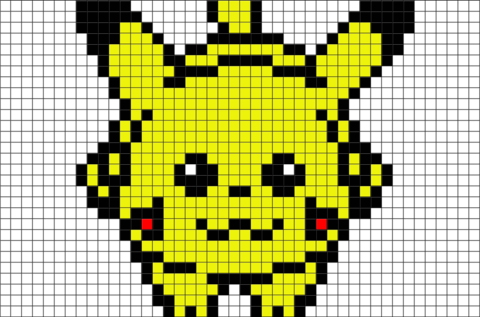

    <center>一张皮卡丘的图片，由一个个像素点构成。</center>

    

  - **像素深度**：自然届中的颜色固然是连续的，但是在计算机中存储的数据是离散的。存储一个像素所使用的位(bit)数叫做像素深度，可以看作图像在某一点取值的值域。常听说的8位宽颜色就是用8位数据表示一种颜色，存储一个像素使用的位数越多，其能保存的信息就越丰富，主要表现在能显示的色彩的数量和对比度上。

    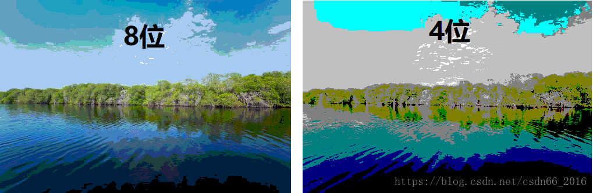

    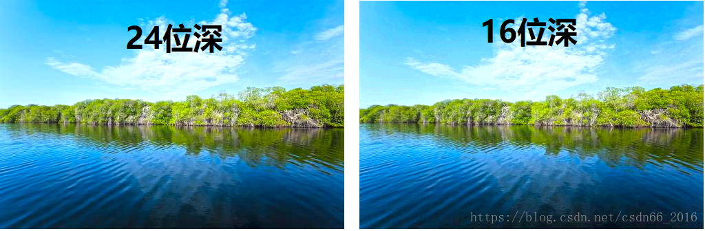

    <center>各中位深度图像的对比，显然24位深度的图像最能还原真实的场景，逼近连续的情况</center>						

    <center>图片源自csdn-[丁香树下丁香花开](https://blog.csdn.net/csdn66_2016)，侵删</center>

    

  - **通道数和颜色空间**：当一张图像只有一个通道的时候，他只能表示一个维度的信息，比如这张灰度图，在唯一的一个亮度（灰度）通道中保存。

    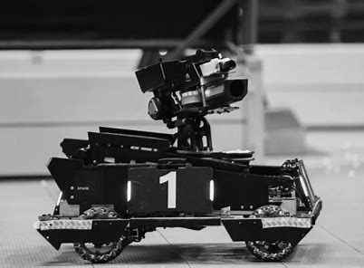

    <center>一张以灰度图形式展现的英雄机器人</center>

    当一张图片想要以彩图的形式保存，它至少需要三个通道，即Red Green Blue（RGB），每个通道都是一个矩阵，矩阵中的每一个元素保存着0～255的值，对应不同的颜色分量。仔细观察下图就会发现，原图中呈现蓝色的部分在蓝色通道中比其他通道要更亮，比如机器人后轮下方的一片蓝光，在红色通道中就几乎没有分量存在。

    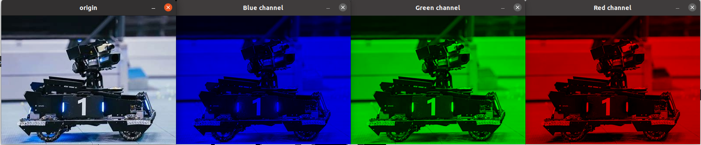

    <center>图片被拆分为三个通道</center>

    除了RGB空间，还有其他不同的颜色空间如HSV、YUV、LAB等，他们都是把图片投影到不同的空间中，图片在这些空间中的每一个坐标轴的投影，就是它在这个方向上的分量（和线性代数中概念的具象）。

    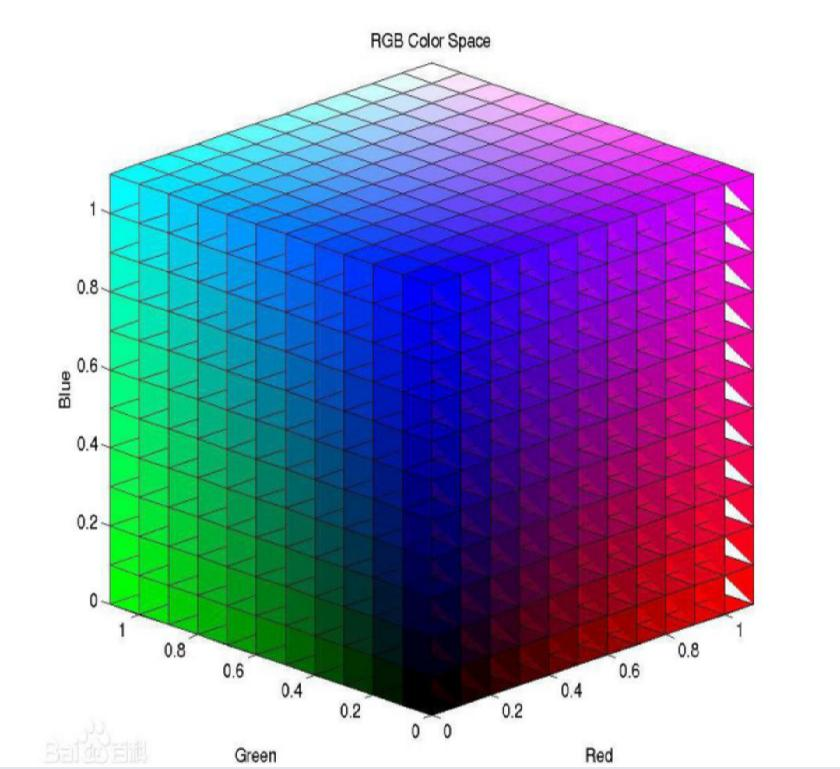

    <center>RGB空间的坐标轴-来自百度百科</center>

    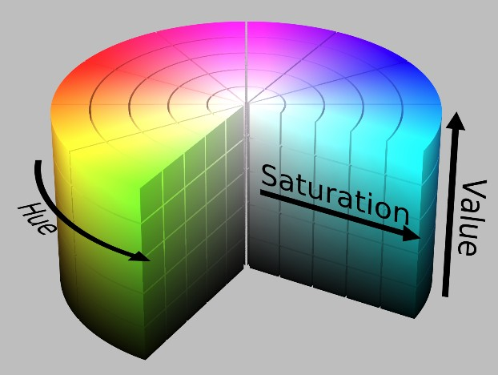

    <center>HSV空间的坐标轴（柱坐标系）</center>

  - **图像的压缩编码方式**：为了达到减少空间占用的目的，我们会通过某种算法将图像进行压缩。存储图片时格式一般有bmp,jpg,png,tif,gif等。不同格式图片的解码速度和占用空间大小不同，有时候甚至是算法时间占用中的关键一环。

    

  ---


- **视频**

  视频就是连续的图像集合，从另一个角度来看，可以把时间当作除x、y外的另一个坐标轴，看作是一个三维的函数。如果选取一个确定时间，则视频退化为图片。最简单的视频保存格式和图像的压缩编码相同，而高级一些的压缩算法会根据两帧或多帧内容的相关性，找到关键帧和相似相同部分，进一步压缩空间。

  

- **典型的任务**

  

  - **图像识别**：给定一张图片，通过算法确定这张图像的分类，又叫图像分类。比如提供一张含有猫的图片给计算机，计算机应当认出：这张图里有一只猫咪。图像识别的输出是**整张图片的标记**，是图片（若把一张宽高分别为w、h的图片看成一个长度为w\*h的向量，则图像识别是找到一个从w\*h的空间到图像分类标记的映射（函数）。

    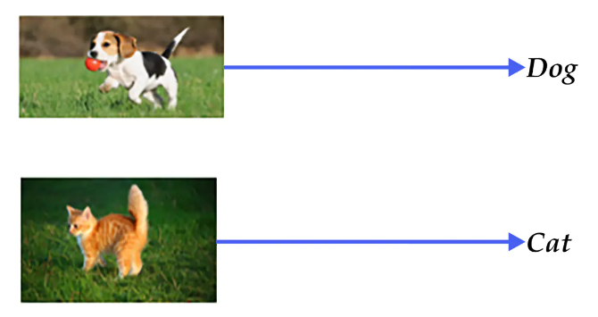

    <center>图像分类的例子</center>

  - **图像生成**：这部分的内容比较复杂，现在一般是通过神经网络训练一个生成模型，它可以根据你给予的标签（如猫咪），根据学习的数据生成一张对应的图片，因此又被成为“画家AI”。GAN是生成模型领域的始祖。若感兴趣可以参考[生成模型之PixelRNN、VAE与GAN三种算法浅解](https://zhuanlan.zhihu.com/p/342136778)。在RM比赛中，我们可以利用生成模型创造出一个会让对手的自瞄算法认为是装甲板的图片，用它来作为机器人的涂装，以此干扰敌方的识别（一般对特定的神经网络有效，对传统算法无效）。这样的涂装看起来和装甲板毫不相干，但是检测算法却会认为它是一个装甲板！下图给出了示例。

    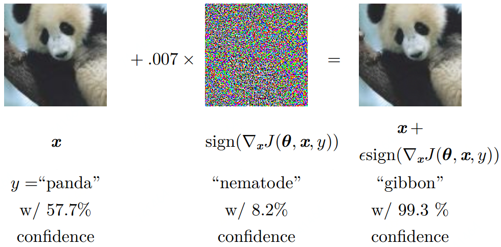

    <center>通过对抗学习，给一张熊猫的图片增加了一些噪声</center>

    虽然在和一张噪声图片叠加之后的熊猫看起来和原来别无二致，但是**目标检测算法却将它认作一只黑猩猩**！当然，我们不能直接在装甲板上添加这样的噪声，这显然无法实现，但我们可以在周围的涂装上使用对抗样本，让神经网络认为贴在涂装上的喷涂样式是一个装甲板。是不是觉得这和迷彩服、隐身战斗机有相似之处呢？

    

  - **目标检测**：**这是Robomater赛场上最常用的算法。**目标检测和图像识别在一些方面有些类似，图像识别主要是对图像进行分类，让计算机判断这张图“有什么”或者”是什么“，而目标检测不仅要判断图片中是否有对应的物体，还要输出关于这些物体”在哪儿“的信息。和目标检测相似的“目标定位”的任务则是对图像中的**一个特定物体**进行定位，而目标检测算法中，图像内含有的对象种类和数量都是**未知的**。*目标检测的输出是目标物体的位置和类别。*

    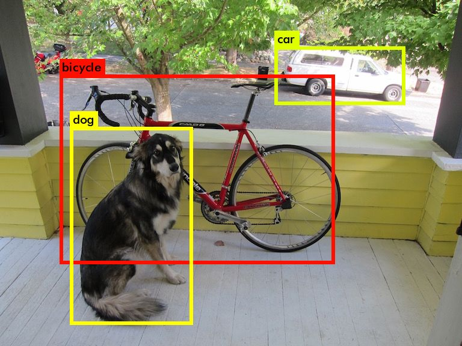

    <center>目标检测算法不仅对图像中的对象给出了分类，还用一个Box把他们框出</center>

    上图展示的是多目标检测算法的检测结果，基于神经网络的目标检测算法能将**一套框架**运用到**所有**目标对象的检测问题上，在训练过程中习得待检测对象的特征。而基于灯条匹配、扇叶识别的算法则是专门针对装甲板识别和能量机关识别的，相当于我们手动设计需要检测对象的特征。他们各有优劣，我们会在 *5.2、6.1、6.2* 中对他们进行更详细的介绍。

    时下效果好、速度快的目标检测算法几乎都是基于神经网络构建的，常见的有R-CNN系列、YOLO、SSD等，我们也会在 *5.2* 中分别解读这几个算法。可以参阅这个系列的文章来进一步了解目标检测：[目标检测入门](https://zhuanlan.zhihu.com/p/34142321)。

    

  - **图像分割**：根据图像的特征把图片分为几个有确定性质的区域，并寻找我们感兴趣的区域。图像分割算法可以目标检测的基础上进一步解析图像，*其输出可以是对每个像素的像素级别的描述*，如下图中灰粉色的区域就代表“运动员”。常见的算法有阈值分割、边缘分割、聚类、基于神经网络的语义分割等。想要了解更多可以参考[图像分割传统方法整理](https://zhuanlan.zhihu.com/p/30732385)。同样，最新的效果最好速度最快的算法也是基于神经网络的。这类算法目前在雷达站、自动步兵上可能会使用到。

    

    <center>图中的运动员和他的自行车被算法从背景中提取了出来</center>

    <center>图源知乎-芝芝-https://zhuanlan.zhihu.com/p/143261645 ，侵删</center>

    

  - **目标跟踪**：视觉目标（单目标）跟踪任务就是在给定某视频序列初始帧的目标大小与位置的情况下，预测后续帧中该目标的大小与位置。有同学可能会疑问，明明目标检测算法能对每一帧图像进行处理确定出目标的位置，为什么还需要目标跟踪？这是因为目标检测算法需要对整张图片进行处理，其消耗的运算资源很大，而目标跟踪不仅运算量以数量级的优势比前者小，还有简单准确，适用面广，抗噪性好的特点。因此在检测出目标之后，可以使用目标跟踪算法来进行后续的处理，同样能识别到装甲板等物体。在 *5.3* 中我们会更具体地介绍这个算法。

    

  - **视频处理**：在以上的几个任务中，大多以单张图片作为任务对象，视频处理则是将一段时间内的所有帧都作为任务输入。一个RM赛场的例子就是，我们可以保存在一秒钟内相机拍摄的所有图片，将它们**堆叠成一个张量**，送入卷积神经网络的输入层（卷核的维度也要进行相应的改变）。此时，我们便不单单可以处理定格在图像中的信息了，还能够对包含时间的数据如**机器人处于小陀螺运动**这个状态进行检测，以启用反小陀螺算法。利用了历史数据的图像处理算法都可以看作是视频处理算法。

    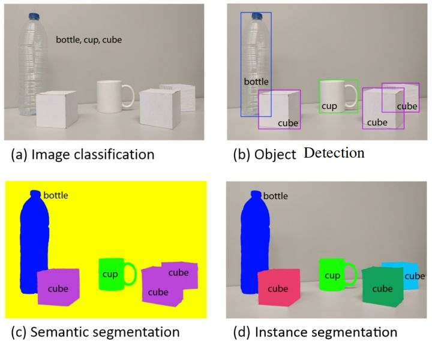

    <center>上文所述的几种任务的直观区别，a为图像分类，b为目标检测，c为语义分割，d为实例分割


​        

---

---


## 5.1.OpenCV常用算法

> OpenCV 是一个软件工具包，用于处理实时图像和视频，并提供分析和机器学习功能。使用这些标准化的软件包可以极大提高我们的开发效率，并且这些工具包对算法运行速度有特别的优化，能够使得这些算法在拥有GPU或支持多线程的电脑上得到加速。掌握OpenCV中的基本数据类型和常用函数是视觉组迈出开发的第一步，同时也能学习大量的相关知识。
>
> 这是[OpenCV](https://opencv.org/)的官方网站，可以在这里的社区和其他开发者交流或查阅说明文档和例程。

*首先你需要安装OpenCV，可以参考[Ubuntu下OpenCV+contirb模块完全安装指南-NeoZng]()。*

- **基本数据类型**

  - Mat：矩阵类型，能够保存图像。
  - Point：一个像素点，或者任何类型的“点”。
  - Scalar：一个四维点类，是许多函数的参数。
  - Size：同样是一对数据构成的组，一般表示一块区域或图像的宽高，有些时候可以和point互换。
  - Rect：rectangle，矩形类，拥有Point和Size成员，用于表示一块矩形的区域。
  - RotatedRect：同上，不过有额外的成员angle用于表示角度。注意这个类的角度系统有些独特，**务必阅读**：[OpenCV中旋转矩形的角度](https://blog.csdn.net/heroacool/article/details/105410202)。

  *具体的说明请参阅OpenCV的说明文档，或在IDE内选择switch to declaration，便能转到注释处。*

  

### 5.1.1. [imgproc ](https://docs.opencv.org/4.1.1/d7/da8/tutorial_table_of_content_imgproc.html)模块（image process）

  **是我们使用OpenCV时最重要的模块之一。**主要是一些像素级的操作，通过图像滤波、形态学操作、阈值操作、通道处理、图像变换、轮廓查找等功能来凸显图像特征或滤除噪声。还可以通过一些简单的绘图函数在图片上作画、输出文本。下面列出一些常用函数：

  - 画图

   ```C++
circle()   //画出一个颜色、大小、粗细可调的圆，一般用于标记角点等特殊位置
line()     //在两点之间画出一条直线，用于框出目标或作为参考。
//用于标记装甲板、能量机关的角点，框出候选的目标
   ```

  - 颜色空间转换

  ```c++
cvtColor()		//将图片从一个颜色空间转换到另一个颜色空间
split()		//把图片的不同通道进行拆分，放入不同的Mat
subtract()		//将两张矩阵的每个元素相减
//这在自瞄中将用于RGB到GRAY和HSV等空间的转换和颜色通道的分离。
  ```

  - 阈值

  ```c++
threshold()		//阈值操作，对一个特定的分量与阈值进行比较，大于阈值则全部设为某个值，小于阈值设为另一个值
inRange()			//进阶版本，可以确定一个分量是否在一个区间内
//我们使用这两个函数来筛选特征，对拆分后的颜色空间进行操作以屏蔽不感兴趣的部分
  ```

  - 滤波与平滑

   ```c++
blur()				 	//加权模糊图像
GaussianBlur()		 	//高斯加权模糊
medianBlur()		    //中值滤波
bilateralFilter()	 	//双边滤波
//用于对图像进行降噪处理，或是抹去小光斑等
   ```

  - 形态学操作

  ```c++
 erode()				   //腐蚀操作，二值图的边缘或收缩
 dilate()			 	   //膨胀操作，二值图的边缘会扩张
 getStructuringElement()   //获得结构元素（核）
 morphologyEx()     	   //更多的形态学操作，包括Opening,Closing,Morphological Gradient,Top Hat,Black Hat等
//用于增强图像的某些特征
  ```

  - 其他图像算子

  ```c++
 Sobel() 	  //微分运算，检测边缘，微分会使得图像中像素强度（某个分量）变化最大的部分为极值
 Laplacian()  //二阶微分，检测边缘，二阶微分会使得图像中像素强度变化最剧烈的部分为零
//寻找图像中的边缘
  ```

  **滤波、平滑、形态学操作等都属于使用图像算子对图片进行卷积操作**，学习过数字图像处理或信号与系统的同学应该对此熟悉。在OpenCV中，你可以使用 *getStructuringElement()* 来构建独特的卷积核，随后使用 *filer2D()* 来对图像进行卷积运算。

  - 寻找/画出轮廓 + 矩形/椭圆拟合

  ```c++
 floodFill()    //漫水法，常用于寻找轮廓的预处理操作，和“画图”软件中“油漆桶”工具有相同的效果
 findContour()	//寻找二值图中的轮廓，并保存为一组点，算法类似于漫水法，遍历所有像素并查找相邻像素
 drawContour()  //根据一组点画出轮廓
//承接上面的各种预处理，用于找出图像中的轮廓并进行下一步操作
     
 minAreaRect()	 //通过轮廓点，拟合出最小面积的RotatedRect
 boundingRect()	 //通过轮廓点，找到其外接矩形Rect(水平)
 fitEcllipse()	 //通过轮廓点，用最小二乘法拟合出一个外接椭圆，函数会返回椭圆的内接旋转矩形RotatedRect
 minEnclosingCircle() 	//通过轮廓点，找到最小面积的包含圆（注意不是外接圆）
//将轮廓点转换为更容易处理的形状对象
  ```

  - 仿射、投影变换

  ```c++
 remap()					//根据给定的映射（函数）改变图像中每个像素点的位置        
 warpPerspective()			//进行透视变换  
 getPerspectiveTransform() 	//获得透视变换所需的矩阵（4个点）  
 warpAffine()				//进行仿射变换  
 getAffineTransform() 		//获得仿射变换所需的矩阵（3个点，为什么比透视少一个点？）
 //一般用于把图像根据变换关系转化成正视图以便进行模板匹配、SVM匹配等操作
  ```

  要区分仿射变换和投影变换，请记住仿射变换是**线性变换**，而投影变换不单单是线性变换。仿射变换会保持对象的相似关系和平行关系，而投影变换可能会改变这种关系，添加了非线性的因素（仿射变换的维度比投影少1，投影是一个商空间）。


### 5.1.2. [imgcodecs ](https://docs.opencv.org/4.1.1/d4/da8/group__imgcodecs.html)模块（image reading and writing）

```c++
imread()		//根据路径读取一张图片
imwrite()   	//向对应路径写入一张图像
imreadmulti()	//一次读取多张图片	
//读取、保存测试用的图片或者自己制作的卷积核、用作模板匹配的图片模板等```
```

### 5.1.3. [videoio](https://docs.opencv.org/4.1.1/dd/de7/group__videoio.html)模块 （video input and output）

```c++
class VideoCapture()	    //构建一个视频捕获类，捕获的视频可以以每一帧图像的形式保存到Mat中    
//VideoCapture cap(0);
//Mat frame; 
//cap>>frame; //这样就把一帧图片保存到frame内部了     
//这个类能够通过get(),set()方法获取和设置一些相机参数    
    
class VideoWriter()		    //构建一个视频保存类，能够方便地保存视频，并且提供各种格式    		    
//在实验室时无法模拟赛场的光线环境，常常在比赛时录制相机第一视角的视频，以供之后测试使用                 
//也可以把检测完的每一帧图片连成视频，保存下来，之后根据这个视频来查找问题、改进算法
```

### 5.1.4. [highgui]([OpenCV: High-level GUI](https://docs.opencv.org/4.5.3/d7/dfc/group__highgui.html))模块（high level graphis user interface）

``` c++
imshow()/*在指定名称的窗口中显示一张图片，注意和waitKey()配合使用否则可能导致异常，用于查看一些算法处理后的结果，waitKey()的参数为图片显示的时间*/   
    
//以下这个组合可以极大地方便参数调试，在程序运行的过程中通过回调函数，可以实时修改参数值
//这种根据用户或客户端的请求进行动作的编程范式被称为“响应式编程”，在GUI、OS和应答服务中很常用
nameWindow() 		//新建一个空窗口  
createTrackBar()	//创建一个拖条，传入相关的参数可以实现参数调节  
getTrackBarPos()	//返回拖条所在的位置     
    
//这个组合能够通过键盘和鼠标向程序传递参数，改变程序的状态，调试的时候非常好用  
setMouseCallback() //设置鼠标的回调函数  
waitKeyEx() 	   //从键盘读取输入
```

除了第一个 *imshow()*，在使用highgui模块时需要你了解一些**响应式编程**的方法（有些类似于中断编程），不同于以往的的控制流命令式（面向过程）编程，响应式的程序在运行的时候会监听并响应异步数据流(Event Stream)，可以时时和用户交互。我们使用的操作系统图形界面几乎都采用了响应式编程。


### 5.1.5. 其他模块

- **ML**：machine learning模块，内有封装完全的多层感知机、基于Dtree决策树的boost集成算法、EM（expectation Maximization）、逻辑回归、朴素贝叶斯分类器、模拟退火优化、支持向量机等经典的机器学习算法和一个能够提供各种功能的内置的数据集包。对于自动步兵、哨兵和雷达的开发有很大的帮助，可能也能帮助我们构建其他需要这些算法的模块如：**装甲板分类**（Bayes或SVM）。

- **calib3d**：Camera Calibration and 3D Reconstruction模块，包含了**相机标定的算法**和一些三维重建方法。我们在得到装甲板的位置后，需要解算装甲板到相机的距离，这就会用到这个模块内的 *solvePnP()*函数。在前面提到过，为了正确的反映物体在原本的位置关系，我们需要对相机进行标定，也是利用这个模块中的函数，幸好OpenCV官方已经为我们编写了一个标定例程，我们可以在OpenCV编译目录下的 */opencv/samples/cpp/tutorial_code/calib3d* 处找到它，在修改 *in_VID5.xml* 和*VID5.xml* 内的参数后就可以开始标定了。

  *如果你想要更具体的实例和操作，请参考[在OpenCV中用例程标定相机-NeoZng]()这篇文章。*

- **video analysis**：包括各种版本的Kalman Filter、光流估计等。OpenCV提供了封装好的标准KF，我们可以通过修改状态转移矩阵、控制矩阵和测量矩阵从而将其升级为Extended版本（扩展卡尔曼滤波，4.5之后似乎自带EKF和UKF以及AUKF）。可以方便地调用此模块完成基础的**运动轨迹预测**功能，同时减少噪声。

- **extra_module**

  - **ccalib**：Custom Calibration Pattern for 3D reconstruction，**双目相机**的标定和双目测距可以利用这里的函数进行。
  - **tracking**：目标追踪模块，内有几个经典的跟踪器如KCF、HAAR、HOG、GOTURN等。可以用于装甲板追踪和雷达站的目标跟踪。
  - **videostab**：视频稳定模块，提供了一些提升视频稳定性的工具，如防抖、插帧、消除模糊等。但由于处理速度稍慢，缺乏实时性，难以用于自动瞄准算法。在雷达站上可以运用，也可以用于分析制作测试视频。
  - **cudaXXX**：以cuda开头的这些模块都是可以利用英伟达的通用并行计算平台（CUDA）来加速（如果你的显卡是英伟达生产的）。

  *若要使用extra_module中的模块，需要和opencv-contrib交叉编译，前文的安装教程中提及了这一点*。

  

---

---


*attention：*5.2、5.3、5.4对于新人来说可能有一定难度。

***若是新人或刚入门的 RMer，可以由此直接跳转道第六部分继续阅读，第六部分看完后再回来这里继续 ~~***

## 5.2.目标检测

> 时下RM赛场上的自瞄算法分为两个流派：传统特征提取和神经网络。前一个部分已经介绍了和比赛相关的OpenCV函数，因此为了保证行文的连贯性和整体性又不重复叙述，这个部分主要介绍新兴的**基于神经网络的目标检测算法**。在第六部分当中则会介绍传统算法的全部流程。
>
> 神经网络是时下最火热的ML的子领域，也就是我们常听说的“深度学习”、“深度神经网络”。而基于卷及神经网络的目标检测算法又是这个领域的超级明星。基于机器人学习的目标检测**几乎在各方面都替代了传统算法**：传统算法需要手工设计检测目标特征，并且很难分离前景和背景。而前者则是通过学习算法来习得检测目标的特征，并且在速度上随着各种trick的加入已经对算本身的改进，已经达到了实时性。虽然缺乏一些可解释性，但也不能阻止其在CV方面大放异彩、在各种顶会顶刊上乱杀的势头。这个部分会介绍卷积神经网络的基本原理和几个热门的目标检测算法的相关知识。检测装甲板、机器人、能量机关这些都只是冰山一角，这些目标检测算法的检测对象几乎是没有限制的，因此基本只需要更改训练集和很少的超参数就可以将算法部署到其他问题上。

目标检测算法经过近十年的发展已经成长为一颗参天大树，基于CNN的目标检测现在大致可以分为两类：**1-stage**和**2-stage**。也可以分为**anchor-based**和**anchor-free**，再加上使用**transformer**的后起之秀这三类。若要入门深度学习（神经网络），**！！！强烈推荐吴恩达的[深度学习系列课程]([【中英字幕】吴恩达深度学习课程第一课 — 神经网络与深度学习_哔哩哔哩_bilibili](https://www.bilibili.com/video/BV164411m79z?spm_id_from=333.999.0.0))！！！**深入浅出贴近实践并且在coursera上有相关的练习。***务必至少看完这个系列的前四部分视频再学习目标检测的相关内容。***同时吴恩达教授的另一个系列课程[机器学习经典名课](https://www.bilibili.com/video/BV164411S78V/?spm_id_from=333.788.videocard.4)也深受大家欢迎，一般在看深度学习课程之前将此课程学完会有更好的理解。若能学完这两个系列的课程，在AI方面就算是入门啦。

深度学习方面广为流传的教程还包括李沐的《动手学深度学习》和台大李宏毅的深度学习课程。《动手学深度学习》在任意搜索引擎搜索d2l即可，拥有配套的jupyter notebook，非常方便，bilibili上有作者本人的[教学视频](https://space.bilibili.com/1567748478/channel/seriesdetail?sid=358497)，他出品的面向真实应用场景的[实用机器学习](https://space.bilibili.com/1567748478/channel/collectiondetail?sid=28144)也非常受欢迎。李宏毅教授的[深度学习课程](https://www.bilibili.com/video/BV1Wv411h7kN)也是广为流传，上课的时候很多梗也很多二次元，PPT精美可视化很多，寓教于乐且紧跟学术前沿。

我们首先介绍目标检测的基础——**神经网络**。

> 当开始阅读5.2之后，笔者默认读者已经拥有了微积分、线性代数、机器学习的基础。

### 5.2.1. 神经网络

- 和传统的统计学习方法如SVM、PCA、LDA等都是需要经过训练的。以最简单的单层感知机为例，其实我们可以将所有的神经网络看作是一个多维特征空间到另一个我们需要的得到的属性的映射。对神经网络的训练，就是用一对对标记好的数据（已知输入的特征向量和输出的属性，即数据标签）对这个“函数黑箱”的建模过程。其中的每个神经元的w、b即是我们需要得到函数的许多构成参数之一。然后我们根据**BP（back propagation）**算法等对网络进行**最优化**（让网络学会这个我们需要的函数，即学习过程），使得这个函数能够逼近我们需要的理想的映射。

  分类问题就是在回归问题的基础上增加后处理，如加入SVM和softmax函数等。对于基于卷积神经网络的猫狗图像分类器，假设其输入是320x320的图像，那么就是有320x320=**102400**个特征（每个像素作为一个特征，单通道位图），其输出是一个**三维向量**[cat dog none]，每个元素智能取0和1并且最多只能有一个元素为1。那么，某个元素的值为1时说明此图像是对应的那种物体，none为1则为说明图像中没有猫也没有狗。那么，训练出来的函数就是一个102400元函数，其输出为3维的离散序列，此函数通过映射将一张图片映射到上述的三维离散空间中。

  在此网站：[A visual proof that neural nets can compute any function](http://neuralnetworksanddeeplearning.com/chap4)，有对神经网络是如何拟合出任意函数的形象的、直观的解释。手机上还有一款就叫做[**神经网络**](https://github.com/jerryjee120/Neural-Network)的App，你可以手动设置隐藏层的数量、各个神经元的w、b和激活函数等，然后得到一张清晰的拟合出的函数的图片（当然只有3维空间以下的结果能够被可视化地输出）。

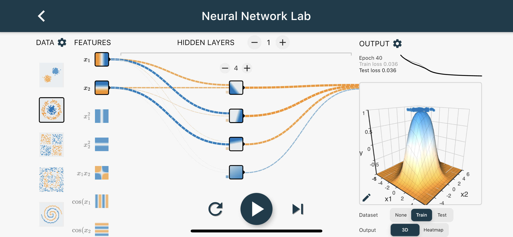

<center>app神经网络的截图，内部还提供了著名的网络如shuffleNet、语言模型、TextCNN、自编码器等</center>

- 对于深度学习或机器学习模型而言，我们不仅要求它对训练数据集有很好的拟合（训练误差小），同时也希望它可以对未知数据集（评价集、测试集、实际应用）有很好的拟合结果（泛化能力强，即训练生成的函数可以很好的根据输入预测输出且基本没有错误），所产生的测试误差被称为泛化误差。度量泛化能力的好坏，最直观的表现就是模型的**过拟合**（overfitting）和**欠拟合**（underfitting）。过拟合和欠拟合是用于描述模型在训练过程中的两种状态。这两个问题的都会导致神经网络的泛化能力下降，欠拟合一般是通过增大训练数据量和模型复杂度解决，而过拟合则是当前科研面临的主要问题，解决方法也多种多样。

  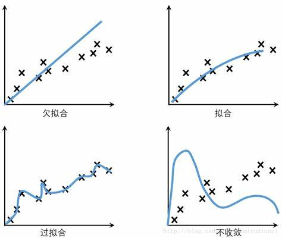

  <center>训练模型得到的几种状态的图解，以回归分析为例</center>

- 因此，在训练神经网络时，我们需要用一些trick来改善它的性能或加速训练过程，在此过程中就涉及到需要人为确定的许多“超参数”。这些超参数设定的数学依据较少甚至没有，很大部分都是启发式的（拍脑袋想出来的），而不是有一套严密优雅的数学方法来对神经网络的表达能力和学习有效性进行分析。这也是神经网络被传统的统计学习学派诟病为**“炼丹”**的原因：**需要在实践中不断调整超参数的值和网络结构，根据训练结果才能改进网络的结构和超参数的值**（就如控制领域的pid算法一样，虽然三板斧调参用起来猛，你却很难说出个所以然来）。

  不过它们确实有效，所以我们还是来看看他们的作用吧.

  

### 5.2.2. 防止过拟合


  - **正则化**（Regularization）

    个人认为这种翻译的有些生硬也不够直观，按照笔者的理解，应该被称做“规范化”或“约束化”。通过对损失函数加入额外的先验知识，防止w在训练中变化过于剧烈，进而在很大的程度上改善过拟合的问题。在一些教程中，常常用一个两参数的单元来可视化这种方法：

    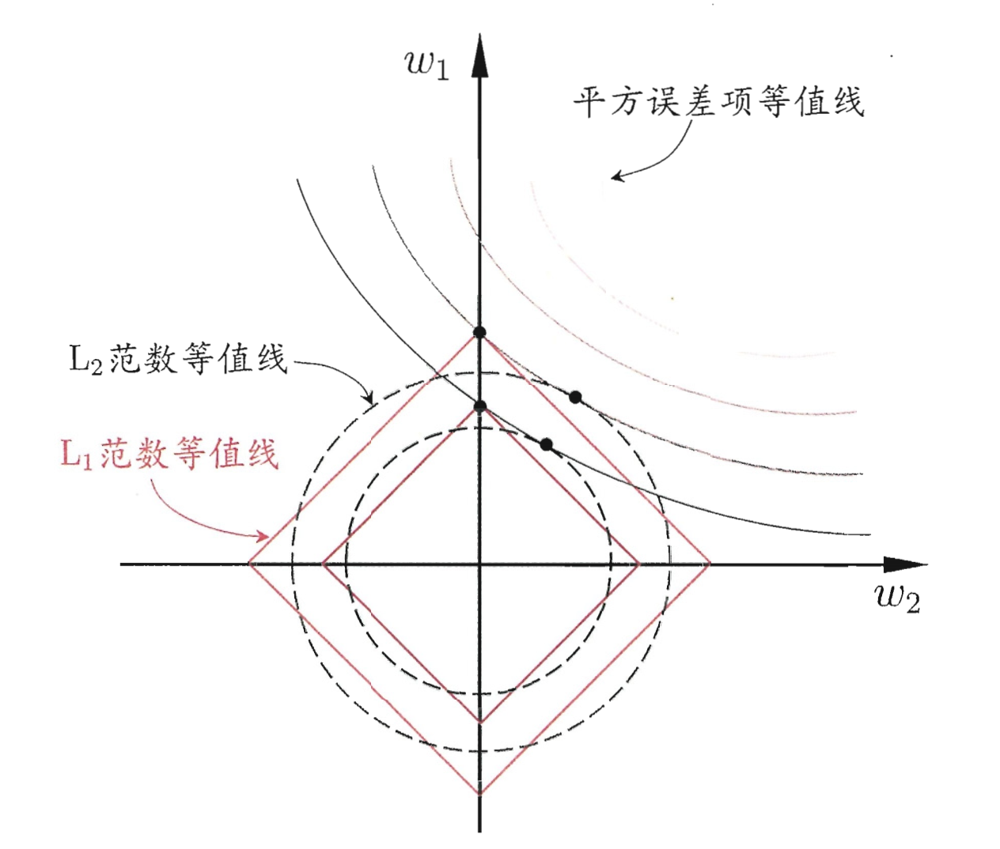

    <center>摘自周志华教授的《机器学习》，L1正则化和L2正则化的形象图解</center>

    通过对w添加额外的限制，倘若w在训练过程中**变化过于迅速**（这是过拟合的一个主要原因，对训练集数据过于“亲近”，以至于学习到了部分分布当中的一些偏差与噪声，而不是整体分布的信息），额外的惩罚项会约束w的增减，降低其变化速度。详细的解释，在Andrew Ng的深度学习课程第二部分p5.

  

  - **数据增强**（Data Augmentation）

    以图像分类为例，通过将训练集中的图像进行翻转、反转、裁切、旋转、变形和添加色彩偏差等方法来扩充数据集，是最廉价最简单的防止overfit的方法。虽然其效果不如收集更多的图片来的得好，可架不住成本低、几乎无开销的特点。在小规模训集上，数据增强是最有效的方法之一。

    高级一些的数据增强如MixUp、Mosaic等复合了以上几种中的若干种，有兴趣的同学可以自行查阅资料。别小看数据增强的方法，一个优秀的DA甚至能提高几个点（mAP）。

    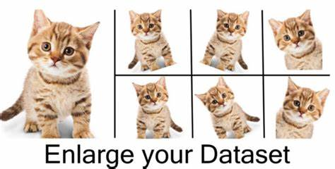

    <center>通过翻转和旋转、裁切等操作，扩充了猫咪数据集</center>

  - **Dropout**正则化（随机丢弃）

    初看dropout方法的同学一般都会认为它深度学习中显得更加玄乎。其原理大概是在某个隐藏层中随机使某个神经元失活（使其输出为零），这样拟合出来的函数参数量下降，不容易拟合复杂的函数，就更不容易出现过拟合的现象。然而dropout会在反向传播中出现难以解决的问题，由于其丢弃的结点是随机的，无法在每一轮反向传播中确定要更新的参数，因而无法明确的定义损失函数，除非每一轮训练只使用一个样本（想想为什么？）。

    从数学角度理解，似乎dropout能够**产生L2正则化的效果**，随机丢弃某一层中的一个结点，其结果就是该结点不会在本次反向传播对损失函数的计算产生影响。若该结点在之前的训练中变化过于剧烈，那么使其失活就有机会让其他结点的参数得到训练从而获得变化，而非将所有的赌注放在那个结点上（put all of its bets on）。因为每个结点失活的概率是相同的，那么**他们应该会得到均等的训练机会**。详细的解释参见深度学习课程第二部分*p7*。

    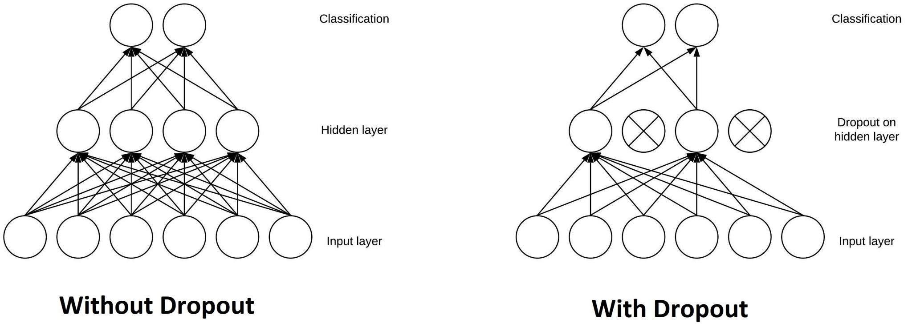

    <center>dropout图示，使神经元失活即置零其输出</center>

  - **Eearly Stopping**（提前停止、早停法）

    非常容易极致简约的方法，如果训练的轮数过多导致模型过拟合了训练数据，那就减少训练轮数。不过我们不用真的用不同的轮数训练多次，而是如一次训练300个epouch（将所有样本都循环300次），然后根据其在测试集上的表现，选取测试误差最小的那一轮，保存其权重作为最后使用的模型。

    

    <center></center>

### 5.2.3. 让你的网络学习得更好

  - **归一化和标准化**（Normalization and Standalization）

    这两个操作常常被混淆，在一些文献中也表示相同的意思，他们都是特征缩放的方法。因此本文将他们视作同一种类的不同操作。常见的归一化操作有minmax缩放、零均值化、方差归一化等。也可以把归一化理解成“单位化”、“统一化”。**minmax缩放**将所有数据通过**线性映射**把值投影到一个区间内。**零均值归一化**操作会将数据特征的均值化为零，**方差归一化**则是将特征的方差变为1。后二者常结合在一起使用。

    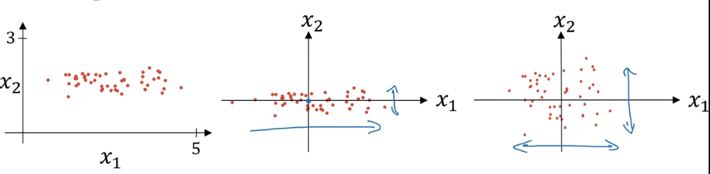

    <center>使用了零均值化和方差归一化后的数据，截取自深度学习系列课程</center>

    通过这些尺度缩放的操作，可以缩小存储数据需要的空间，同时可以让损失函数变得更加“圆润”。下图给出了未归一化和归一化后的损失函数的对比。显然通下降法，归一化后的数据能够更快地使网络收敛，因为在圆周上的任意一点**梯度方向**都是垂直于“等高线“的，梯度是函数变化最快的方向（多元微积分知识）。

    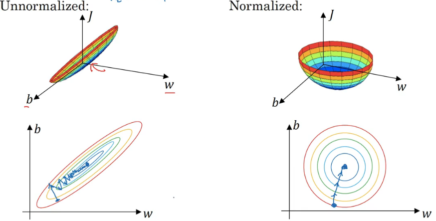

    <center>使用前后的损失函数对比，下方为损失函数的等梯度线（标量）</center>

    

  - **防止陷入局部最优解**

    当损失函数可能不是一个凸函数，或者它有多个极值点（大多数情况下都是这样），那么，使用梯度下降方法可能会使神经网络拟合出来的函数陷入局部最优解（向着不是最小/大的极值点不断迭代）

    - 多种初始化值（从头训练）

      在初始化网络参数权重时，一次选取多组参数，相当于一次训练多个有相同结构的网络。这样，我们能够从参数空间中的不同位置开始运行梯度下降。即使部分解陷入了局部最优，我们还有其他的解。可以把这种方法看成”**广撒网**“式的训练。最后我们会测试这多个网络的性能，选取其中最好的一个。虽然这种方法的效果最好，但是其缺点也十分明显：极大的**训练开销**。

      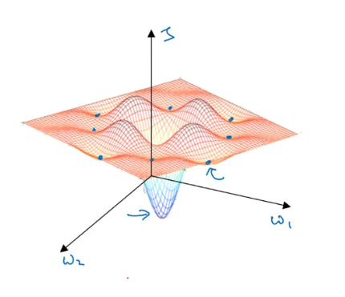

      <center>从参数空间的不同位置(蓝色点)开始梯度下降，即使有部分陷入了局部最优解，也可能有一些会收敛到全局最优，至少也是比较好的极值</center>

    - 局部扰动

      使用局部扰动有一定的概率跳出局部最优解：在网络的Loss function不再减小或缓慢振荡的时候（也许此时陷入了局部最优解），随机地给网络参数进行微小的扰动。若在**有限步迭代**（人为设置地超参数）内能够往其他方向移动并且进一步缩小了Loss function，那么说明我们找到了一个比原来的解更好的解，此时再继续运行梯度下降。若迭代次数超出了我们设置地扰动次数上限，则返回原来的位置，认为函数已经收敛到比较好的极值点了，得到了较优的结果。如此，就有概率跳出局部最优解。

      局部扰动和**模拟退火**算法在有某些相似之处。也有研究人员提出，可以利用模拟退火算法来在小规模网络上进行训练，收敛速度十分迅速。

      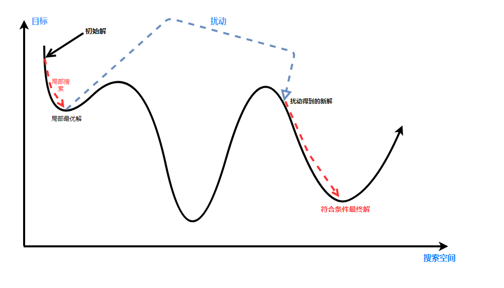

      <center>对局部最优解加入扰动后，成功找到了更好的解</center>

      

  - **mini-batch**（小批量训练）

    不需要遍历整个数据集就进行一次剃度下降，选取部分样本作为一个批次来计算其loss。从另一个角度来理解，就是加快了迈步的频率。朴素的梯度下降是遍历整个数据集后再计算loss，对参数进行一次更新。minibatch则是把数据集分为32/64/128/256...这样的“小训练集“，在一个小训练集遍历后就进行更新。其优点很明显，就是可以提高训练速度。但它也同样存在一个小缺点：只使用部分训练集进行训练可能产生局部的过拟合或是欠拟合（小部分的数据集无法反映整体数据分布），还好在实践中对模型的影响似乎并不是很大。在数据集稍大的情况下，我们一般都会选择使用minibatch进行训练，否则收敛速度过慢且**空间开销过大**。

    mini-batch的极端就是每个batch只有一个样本，即SGD（stochastic gradient descend）。经过调优后的SGD在训练的时候也有很好的效果，这一般需要有经验的炼丹师对学习率、lr schedule和初始化参数等进行调节，新手还是乖乖用Adam吧（这些名词在下面都会进行介绍）。

    

  - **Batch-Norm**（批量归一化）

    - batch-norm字如其名，对每一小批数据进行标准化。它会将一批数据的每一个隐藏层的输出（可以看作**编码后的特征**）都进行归一化。我们在前面已经了解到了Normalization的好处，于是，有研究人员就想到为什么不能对神经网络中的**每一层输出**都进行类似的操作呢？于是，我们采用的Batch-Norm会**将数据集的数据划分为一个个batch**，并对每个batch中的数据在每一层的输出都进行归一化。（思考：那为什么不对**所有**数据即整个训练集的数据在每一个输出层都进行normalization？）

    - 在训练结束后进行推理时，一般都是单个数据的输入（特别是实时视频序列的处理），这时候要注意的问题就是每一个输出层的归一化使用的均值与方差的确定，显然对单个数据没有均值和方差可言。因此在训练过程中，我们会用指数加权平均的方式记录每一批norm的均值和方差，并以此作为推理时的参数（根据大数定律，这个值最终会近似实际的分布）。

    - Batch-Norm为什么奏效呢？在前面的归一化中我们已经了解过，这些操作能够让参数搜索空间中的loss function改变成“碗状”从而获得更好的梯度下降效果。但是既然数据分布已经完成了这件事，在中间的隐藏层为何还要继续使用normalization？这里就要涉及到一个叫做covariate shift的问题。想要理解covariate shift，请看下面这张图：

      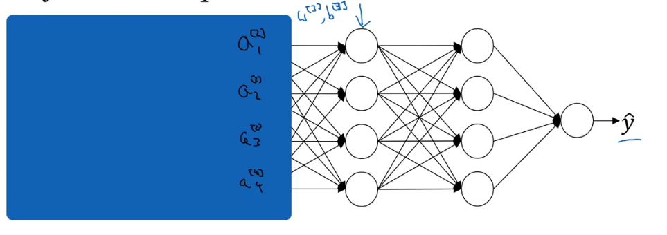

      <center>从第三层开始，可以将其看作整个网络的”子“网络。每一层的参数都试图从前一层的输出中习得这些数据到训练标签y的一个映射</center>

      这里只是以第三层为例，其实可以没去掉一层（计算一层）就把它看作是一组数据到y hat的映射。那么自然**每一层的输出向量都可以看作是一个特征向量**，则我们就对这一批“特征向量”进行归一化。Covariate Shift就是一个向量经过前层的计算，数据原来的分布已经改变了（每一层网络都是非线性映射，从极端的角度来看每一个隐藏层都是一个网络，单层感知机）。那么显然，如果数据的分布一直在改变，网络是**很难习得一个映射**的（数据分布随着参数更新始终发生变化，就像解方程我们需要一些确定的信心，而在这里这个信息却会一直发生变换表现得像未知数）。使用batch-norm则可以把每一层的输出都标准化为方差为1均值为0的分布，虽然它的具体形式还是未知，但至少我们可以线只它的均值和方差达到**限制前层参数的更新对输出数据分布影响的目的**。

    - 同时由于batch-norm只对每一个batch的数据作用，显然一个batch不能体现整体数据的分布，因此会引入统计偏差和噪声，有时候这反而是有利的，其效果类似dropout，能够产生一定的正则化效果，避免网络拟合出来的映射过分依赖于某个神经元。

    *关于Batch-Norm的更多信息，可以参阅论文原文。文章：[re-thinking batch in batchNorm](https://arxiv.org/pdf/2105.07576v1.pdf) 也是一篇很好的参考文章，介绍了更多关于统计和数学原理的知识*

    

  - **学习率衰减**

    学习率作为最重要的超参数之一，于我们来说有很大的操作空间。训练的开始阶段加速学习迈大脚步，采用较大的学习率；在接近最优解时、Loss function下降减慢时减小学习率，防止超调和振荡。

    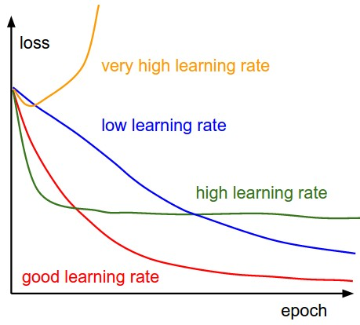

    <center>不同学习率对网络收敛的影响，对比蓝色曲线和绿色曲线，我们可以取二者的精华</center>

    有些训练策略还会在初始阶段进行warmup，先选择较小的学习率防止随机初始化的权重使得模型大幅振荡。Warmup也有两种：一种是常量warmup，在热身时选择一个固定的学习率。它的不足之处在于从一个很小的学习率一下变为比较大的学习率可能会导致训练误差突然增大。另一种是渐进warmup，即从最初的小学习率开始，每个step增大一点点，直到达到最初设置的比较大的学习率，再在之后的学习中逐渐减小学习率。还有warmup-restart、cycling、cosine，每隔若干epoch就会重新启动一次warmup、让学习率从大到小以正弦规律往复变化等等learning rate schedule方法。需要更深入的了解可以自行查阅相关资料。

    

---

  

### 5.2.4. 梯度下降的进化

#### 5.2.4.1. 优化的mini-batch方法

- **GDM**（Gradient Descent with Momentum）

  动量梯度下降法的收敛速度总是要快于普通的梯度下降法，这得益于它的”动量累积“思想（Andrew Ng说物理好的人容易理解这个算法）。假设在一个网络的训练中你遇到的参数搜索空间如下图所示，其等梯度线呈椭圆排布，那么在训练的过程中就会遇到比较大的振荡（梯度总是沿着等梯度线的切线的径向），即蓝线所示的学习路线。一旦你增大学习率，就会得到紫色的学习轨迹，产生过大的振荡甚至出现不能收敛的问题。我们希望在这个学习问题中能够让竖直方向的学习速度下降，水平方向上的学习速度增加（蓝字所示）。

  

  <center>一个二维的搜索空间，红点表示Loss的最小值</center>

  观察蓝线会发现其竖直方向上的**振荡均值始终为零**，走了很多没必要的路，是否可以通过某种方式让竖直方向上的学习率降低？（注意此处说的竖直方向和水平方向的都是以二维情形为例，显然我们的搜索空间没有这么小，在高维空间里就对应多个方向）GDM就是通过观察学习的特点得到的一种优化方法。

  在每一个batch的迭代中，会记录下当前的dw和db，并且以指数加权平均的方式对dw、db进行累积，把得到的累积值用来更新参数。这样，GDM就会记录那些振荡项并把方向不同的dw、db分量抵消，而那些方向相同的分量则会随着迭代的进行不断增大，就好似GDM能够聪明地找到最快下降的方向，顺着“山坡”（最速降线）不断累积“动量”，迅速到达最小值点。

  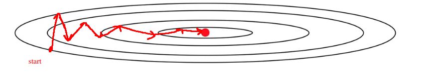

  <center>竖直方向上的分量随着迭代减小，水平方向不断增大</center>

  如果拿具象的例子类比，就是将一个小球置于碗中，并且给它一个切向的初速度（相当于一步迭代）。对于普通的GD，每次小球的切向速度为零时就让小球停下（把径向速度也归零，即重新计算dw），然后再次释放小球；而对于GMD，就只给小球一个切向速度，之后不去干扰小球（每次计算完成之后，dw都会加权累积），那么切向速度会随着往复运动而逐渐减小（dw的反方向分量会抵消缩小），径向由于有重力加速度（方向相同，累积后不断增大），动量会持续累积，以更快的速度到达碗底。

  

- **RMprop** (Root Mean propagation)

  RMprop和GDM异曲同工之处，同样会在迭代中保存每一次的dw值并对其进行均方加权平均。在更新参数的时候会使用当前一次迭代的dw除以前述得到的值即前几次迭代中dw的平方的加权均值（想想为什么用平方），这样，当dw变化很大的时候，该累计值也会很大，经过相除这个值就会相对变小；而dw小的时候，累计值也相对小，那么相除后用于用于更新的参数将会相对变大。这样的操作让每次更新都更加保守，不会像GDM一样速度越来越快而是始终**稳步前进**（此速度可以通过加权平均的系数修改）。这种特性也允许在训练时使用更大的学习率。

  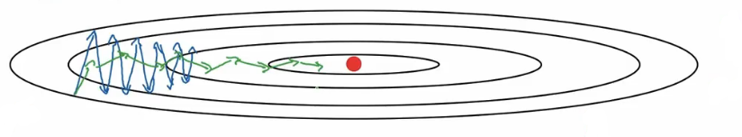

  <center>绿色的箭头就是是用了RMprop后的效果，可以看到学习的步伐非常稳健</center>


- **Adam** (Adaptive Moment Estimatation)

  Adams融合了上面两种方法，最后得到的参数更新公式如下：
  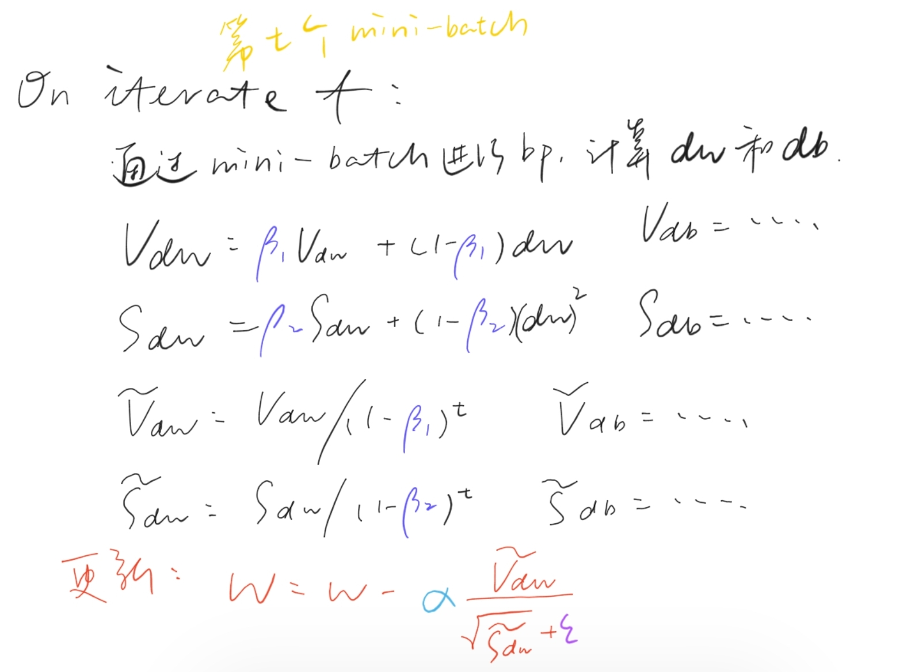

  <center>Adam方法“稳中求进”</center>

  Vdw是GDM的累计项，Sdw是RMprop的累积项，在计算结束后对Vdw和Sdw都进行了指数平均修正，确保在刚开始的时候指数加权平均不至于过小。$\epsilon$是一个很小的数（一般为10e-6）防止出现除零得到NAN的情况，这也是在设计网络中，若出现除法操作常用的训练技巧。

#### 5.2.4.2. 其他优化方法

- **牛顿迭代法**


- **拟牛顿法和其他高阶方法**


了解了神经网络的构成和基本原理后就可以开始进一步学习卷积神经网络了。这里也再次提醒读者应该至少至少先学习Andrew Ng的第一个和第四个视频再来了解相关方面的知识。拥有基本的了解和学习背景对于探索新领域是非常有必要的，否则你只会在n个不同的超链接里面反复横跳（~~这是啥？查一下，诶，这又是啥？再查一下......wft？怎么又回来了？？~~)。若有信号与系统或数字信号处理的前置知识，对于CNN的学习大有脾益。


---


### 5.2.5. 卷积神经网络

> 在5.2.1中我们提到，可以把图像resize成一个1xn的特征向量当作输入投入一个网络当中进行训练和预测，但是这样做会出现很多的问题：首先是参数量过大，拿一张320x320的rgb图像举例，它是一个拥有320x320x3个维度的向量，若隐藏层也采用这样巨大的神经元规模，其参数量是不可想象的（利用你的排列组合知识计算一下）。另外，将图像resize成一维向量，在一定程度上丢失了两个维度之间的相关性（在映射的过程中有信息被压缩到原向量空间的零空间中了）因此，卷积神经网络就诞生了（LeNet5，1994）。但是由于算力的限制，直到到近年GPU的快速发展才得到广泛的应用。
>
> ***卷积神经网络的设计思想是参数共享、空间信息的保存与合理的参数量下降。***

如何用网络设计一个图片分类器？根据前面学习的知识，可以把图像看成一个width\*height维的特征向量并把它输入到一个超大规模的神经网络中。在引言中提到这样做的参数量是随着分辨率的上升以阶乘级上涨的，我们显然无法处理这种规模的参数，并且在 *5.2.1* 也提到了过大的参数量容易让模型在训练过程中过拟合。

那还是看看造物主的杰作吧：计算机科学家从人类的视觉机制出发设计出了卷积神经网络。从认知心理学的角度来分析，人类的**并不是一眼**就能判断物体是什么，而是从其**纹理**、**形状**与**轮廓**这种**低级特征**开始鉴别一个物体，再上升到**局部特征**，最后通过**组合局部特征**得到对**整体的判断**。***也就是说，我们没必要在“第一眼 ”就关注所有像素***。

根据这个思想，我们改进了神经网络的运算方法、参数传递和激活方式：利用卷积运算替代全连接。即不必对每一层都进行全连接，全连接代表每个像素对之后的每一个神经元都有贡献，然而左上角的像素和右下角的像素可以说几乎没有任何相关性（其他大部分像素也是这样）。因此我们在刚开始只需要关注纹理和边缘，然后是纹理和边缘组成的局部特征，最后才是整体。这样，我们可以依据某种规则只让神经元之间进行部分连接，最后部分再进行全连接以充分利用高层次特征。

那要怎么样确定这种规则呢？接下来分别介绍CNN中最常见的三个构成模块：***卷积层、池化层、全连接层***。


#### 5.2.5.1. 卷积层

引子部分提到，如果把图像resize成一个一维向量，我们很可能就在此映射过程中把原来处于相邻像素之间的相关性给丢失了。想要保存这种相关性怎么办？这就要利用到“卷积”操作了。

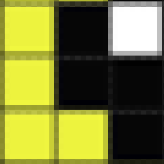

<center>一个3x3的图片，每个像素和周围的像素显然是有位置的相关关系的</center>

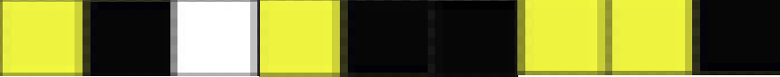

<center>把上图resize成1x9的向量，可以看到这里就丢失了原来的位置关系</center>

学过信号与系统的同学应该已经对一维卷积熟悉，时域的卷积操作可以得到系统**某个时刻由连续输入叠加**产生地相应（一维情形），那对于图像信号该怎么做？显然图像在两个方向上延伸，图像信号就是坐标的函数（二元函数），我们直接把卷积的积分变量由时间改为坐标分量并进行离散化，那么二维卷积操作的结果就是系统在卷积核范围内的输出响应（即计算这个位置是否有相应的特征）。因为只需要采集局部的信息，我们不用把卷积核设置的太大（如果考虑最极端的情况，把卷积核半径设置得和图像一样大，那么就相当于采集了整幅图像的信息，和全连接无异了，只不过保留了位置信息）。来看几个动图：

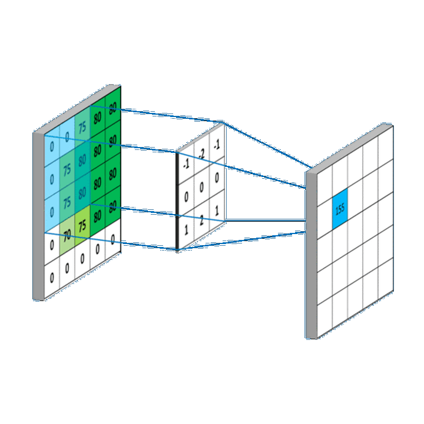

<center>二维卷积</center>


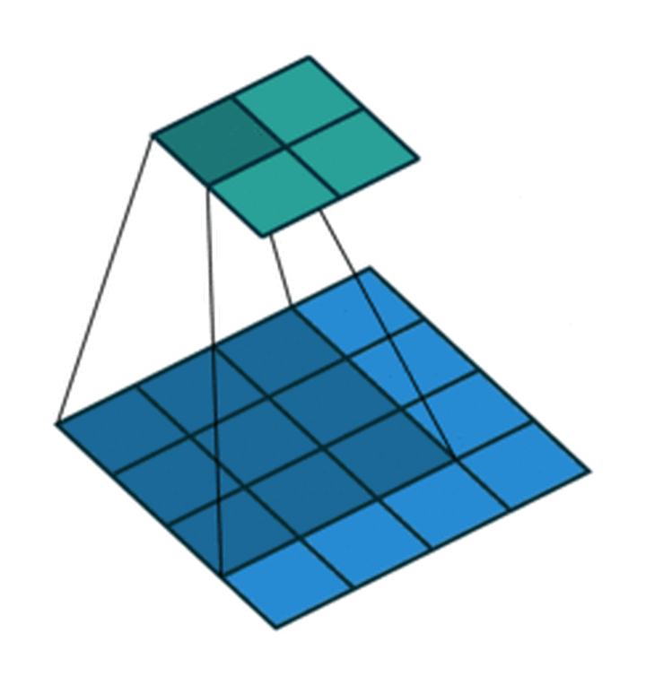

如果没学过信号与系统或者还是不怎么理解卷积,可以参考知乎的这个问题:[如何通俗易懂地解释卷积](https://www.zhihu.com/question/22298352) 。

> 若你学习过信号与系统，可以用我们所熟悉的一维卷积作为类比，二维情形一个大小有限的卷积核就相当于一个一维的只在某个区间有定义的、在其他地方的值为零的卷积函数（脉冲响应函数）。增大卷积核即增加感受野（在 *5.2.3* 中介绍），对比一维卷积函数来说就是扩大了使函数不为零的定义域定义域。
>
> 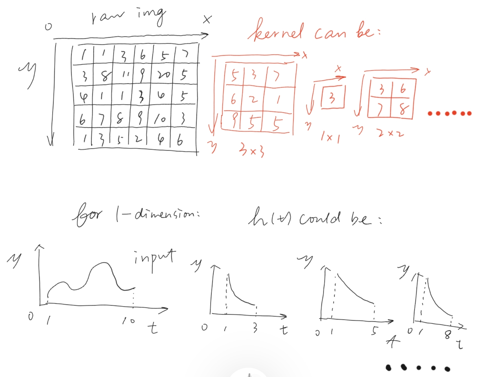
>
> <center>大小有限的卷积核与一维情形卷积函数的对比</center>
>
> 
>
> 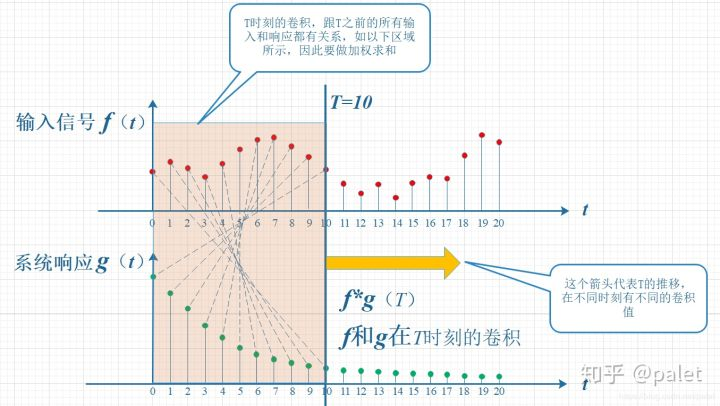
>
> <center>对一维离散序列的卷积</center>
>
> <center>图源知乎-palet</center>
>
> *未学过信号与系统的同学可以忽略这个类比理解。*

那么卷积又是如何得到这些纹理等特征的？让我们看看提取图像中垂直边缘的例子就好了。以提取竖直边缘的特征为例，我们需要一个这样的卷积核：

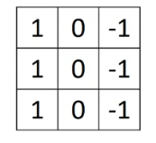

<center>用于提取垂直边缘的卷积核，当某处出现下图所示垂直边缘的时候，卷积操作会在对应位置得到较大的值</center>

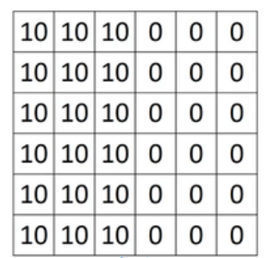

<center>一张图片的像素表示，和他的显示效果（下图）</center>

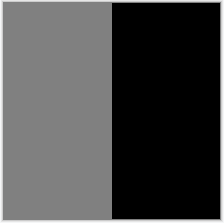

再回想一下卷积的含义，是某个系统在受到连续输入时响应的叠加，这里的“连续输入”指的是随着时间变化的输入信号。很显然图像信号是坐标的函数，那么在拍摄的那一刻所有信息就定格下来，这里的连续输入就变成了**不同坐标的像素输入**（x,y两个维度）。显然，在有垂直特征出现的时候，该区域的卷积结果就会很大，如果没有相应的特征出现，那么结果显然就会比较小。想要提取其他特征同理，这里给出提取水平边缘、角点的卷积核：

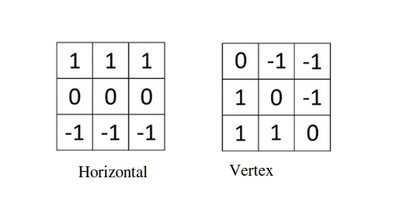

<center>提取水平边缘的卷积核其实就是竖直边缘旋转90度，角点则是两个边缘的交点</center>

因此，有怎么样的卷积核就会提取出怎么样的特征，不过到现在为止，我们还只是**手动设计**了物体的特征，比如上面提到的几个特征提取器（垂直、水平、角点），如何让机器**自己学习特征**？和标准的神经网络对比，这里的卷积核参数（即应该要学习到的特征，卷积核上每一个位置对应的参数值）其实也就是神经网络的**权重参数w和b**（隐藏层变成了卷积层）。这样，我们不必再自己设计特征（自己设计的特征不能涵盖所有情况并且特异性也不够好，学习得到的特征更能反映物体的本质），而是通过反向传播来让网络自己学习特征。

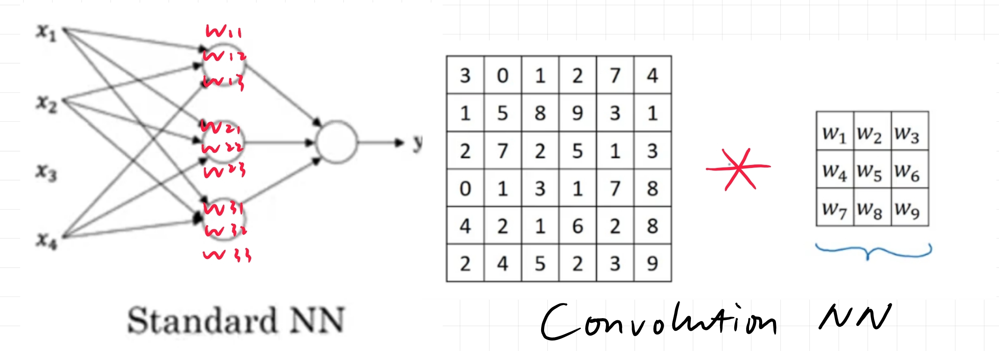

<center>全连接神经网络和卷积神经网络参数（特征）的对比</center>

现在，我们便有能**替代全连接**并且**保持图像中像素的位置关系**的同时还能提取特征的数学工具：卷积操作。通过网络的反向传播和梯度下降，我们便可以提取各种各样的特征。

此外我们还可以修改卷积的**步长step**（上面的例子中都是每隔一个像素都进行一次卷积计算），修改step就会改变每次卷积核移动的像素数，这样能够降低计算量、扩大感受野，对于大物体和高分辨率的图像常常使用3、5、7等大小的步长。

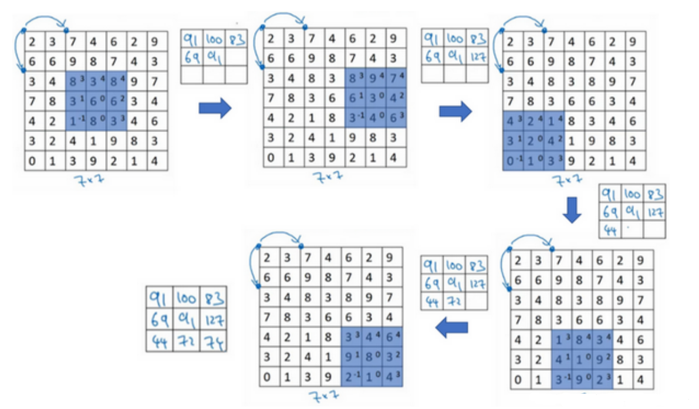

<center>步长为2的卷积示例</center>

对于图像的边缘，常使用“**Padding**”的技术来充分利用角落和边缘的像素（上面的例子中我们可以发现，每次卷积操作[step=1]得到的feature map都会比原图更小，那么我们可以通过在图像周围填充0或是对图像进行简单的复制，使得卷积核在运算时可以让中心保持对齐，这样在一些有特定需求的场景（比如对精度要求高、希望提升准确度）就可以生成和原图大小相同的feature map从而充分保留、突出图像的特征了。还有一些后面会介绍到的特殊的结构如残差连接、密集连接等（其实在现代神经网络也属于标准设计了），也要求输入输出前后的feature map大小相同。

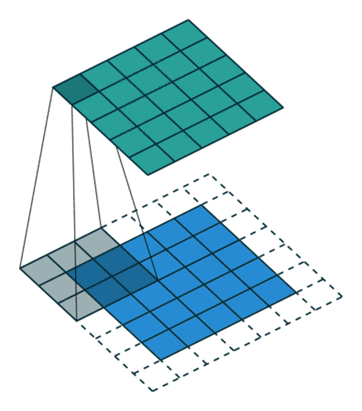

<center>padding示例</center>

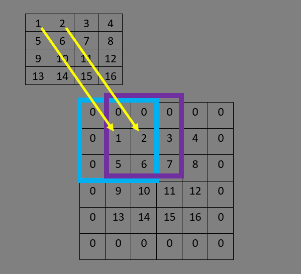

<center>补零padding示例，复制padding则是通过一定的规则例如取边缘平均等方法填充外面一圈的值</center>


是不是已经迫不及待想要训练一个CNN了呢？那么卷积神经网路的反向传播和普通神经网络有什么区别？我们在讲完池化层和全连接层后再来细说，先把前向传播的过程看完吧！


---


#### 5.2.5.2. 池化层

现在我们已经通过了一层卷积并且使用的是竖直边缘提取核，把有竖直特征的区域都保存了下来，那么这张特征图（feature map）里面数值大的点就代表着此区域很有可能有竖直的边缘存在。聪明的你大概已经想到我们可以通过**设置阈值**的方式来筛选这些特征，得到竖直边缘的强度大的区域（“够不够竖”）。不过这里有另一种方法，既能得到最“竖”的那一个特征，又能减少参数量——**Pooling**。

池化其实也是一种降采样的过程，早期对其的翻译也是只表意不表义非常生涩，笔者个人认为叫“汇集层”或“采集层”会更好理解一些，池化操作会提取feature map上最重要和显著的特征。常用的池化操作有最大池化和平均池化（平均池化其实用得非常少了），下图直观地展示了池化操作的过程：

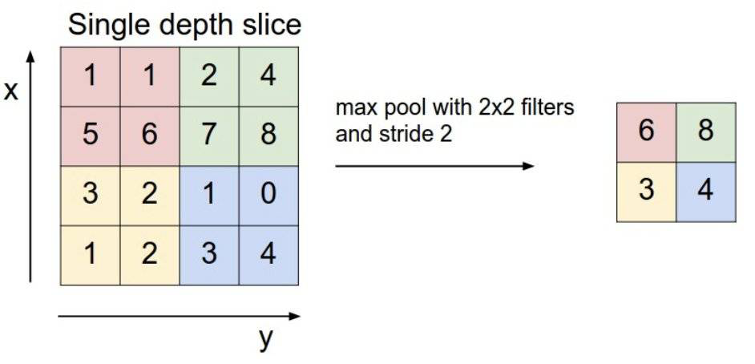

<center>最大池化操作会保留feature map上最显著的特征
</center>
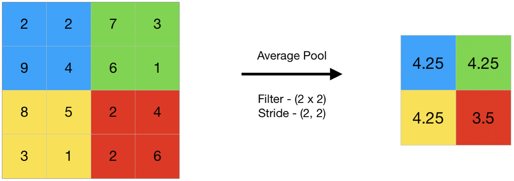

  <center>平均池化则是更加中庸，对一个区域内的特征进行加权平均，一般加权系数相同</center>

  显然我们可以继续用卷积操作来提取feature map上的特征，但是池化不需要进行乘法和加法（最大池化不需要），在速度上远远超过了卷积。并且在用卷积提取了图像的特征之后，利用池化可以让被提取出的特征更有**显著性、更凸出**，以便之后的卷积操作会更有**针对性**，**并且大大减少计算量**。

  使用池化相对于卷积来说还能提供额外的一些好处（当然是必须要配合卷积使用，只有卷积能提取特征，池化是让特征更明显，或者说是卷积+池化操作对比单纯卷积的好处）：

  - 抑制特征噪声，降低重复信息

    当以两个邻近的像素为中心分别进行卷积操作的时候，得到的结果很可能非常接近，这样就带来了信息地冗余并且在之后的对此feature map进行的卷积操作（卷积核必然会同时覆盖到这两个像素）可能会产生不利的影响（过大或过小的结果）。利用最大池化或平均池化，就会把当前特征图上邻近的特征进行融合、取极值以**降低冗余度**。

  - 提升模型的**尺度不变性、旋转不变形、平移不变性**

    当一张图像发生轻微的旋转、平移和尺度缩放，池化操作对这些变化并不敏感，即使部分特征变换了位置或大小，也不会影响池化提取的结果或影响很小（从池化操作是如何进行的来理解）。

  - 一定程度上防止过拟合

    其实和第一个特点有相似之处，因为在进行池化操作的时候，随机噪声会被抑制，而局部样本不太明显的特征显然不如数据分布的相同特征那么显著，**池化更加关注全局的特征而不是局部出现的特征**，这在另一方面来说是对参数空间的降维，以防模型学习到一些不重要的特征维度上的信息。因此能够防止网络的过拟合。

  所以，我们构建CNN的时候一般都是用1～3个卷积层+1个池化层作为一个**基本的block**（conv-pooling-block，CPB），然后用多个block进行串联得到网络的基本结构，最后加上全连接层完成整个网络的构建。

  

---

  

#### 5.2.5.3. 全连接层

在经过数个基本的block（conv+pooling）后，是不是感觉特征提取的差不多，网络已经知道这些特征对应的标签是什么了呢？这时候我们会选择把最后的feature map，resize成一个一维向量（最后的feature map上不同点的相关性其实**已经很差**，并且每一个点在此时都代表着**某种局部特征**，对于图像识别任务来说即使丢失位置信息了也不会对最终的结果产生太大的影）或是使用一个和特征图一样大的卷积核进行卷积或**1x1卷积**（也就是第二种方法，一些情况下也被称作**全卷积**Full Convolution Network），这样便会得到一个1xn的张量，本质上就是一个一维向量了(和resize得到的结果相同了）。一般在最后添加1～3个全连接的隐藏层并在输出时连接到一个神经元，对其使用**softmax分类**（二分类的推广），就可以得到一张图像的类别了。

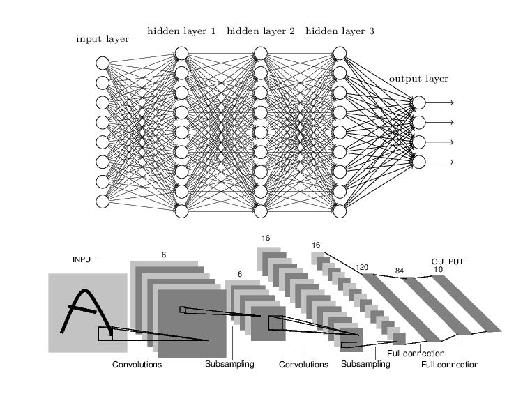

<center>以LeNet-5的结构为例，在数个Conv-Pooling Block（CPB）后增加了最后的全连接后，得到一个最简单的网络结构
</center>


  > 刚刚说到全连接层会损失位置相关性，指的是多个FC串联会造成这种结果。但是一个有趣同时似乎也比较明显的结果的是：在CPB后直接跟上**单层**FC连接反而不会丢失像素间的位置关系并能够充分利用位置信息输出位置敏感的数据，有兴趣的读者可以思考一下两种连接方式的差异和造成这样结果的原因。在 *5.2.6* 中将要介绍的目标检测网络的**回归分支**就常选用全连接层放在最后用于输出检测框。

  至此，一个完整的CNN就搭建好了，假设这是一个已经训练好的网络，这时候我们只需要投入一张图片，它就能够输出对应的分类了！~~可惜它还没训练好~~

  下面让我们看一下CNN和标准的全连接神经网络的训练有什么差别。

  


---

  

#### 5.2.5.4. CNN的反向传播

很多教程在这部分讲得非常模糊甚至根本没有提及这个过程，其实它的原理和普通神经网络是几乎一样的，只不过由于我们更应该去打破这种简单的黑箱子。

CNN在前向传播的时候，计算似乎比全连接网络要复杂，然而其本质都是**线性组合+非线性化**，即用上一层的输出向量通过分量乘以不同权重相加再投入一个激活函数（非线性过程）得到这一层的输出：

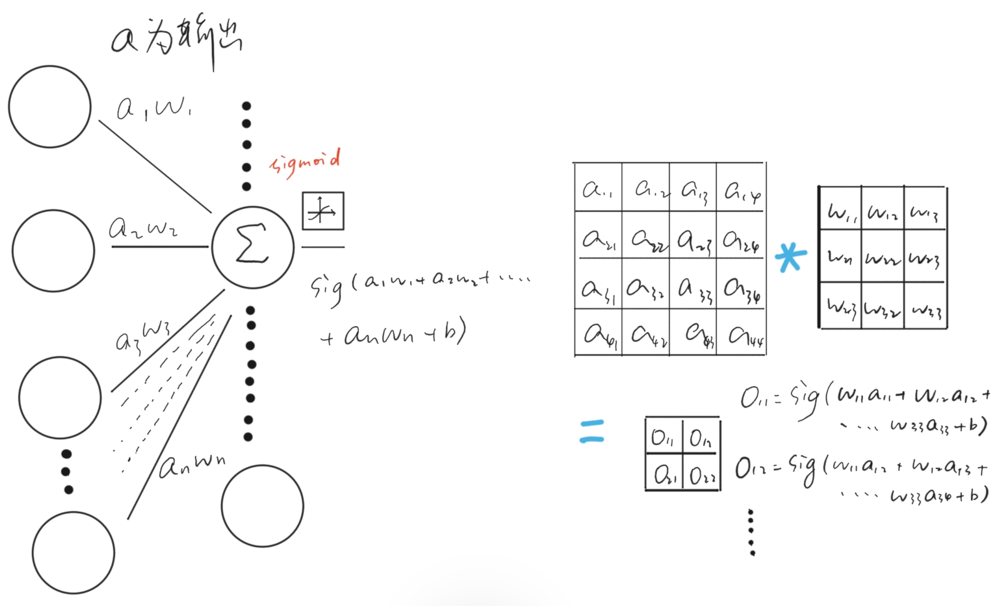

<center>计算过程完全一致，只不过，有没有什么办法可以将CNN的前向传播也写成FC一样的矩阵运算？</center>

为了能够方便的计算出CNN的前向传播结果，充分利用矩阵运算加速库（如numpy等）并发挥GPU的威力，我们只需要将CNN的forward Propogation转化成矩阵形式：

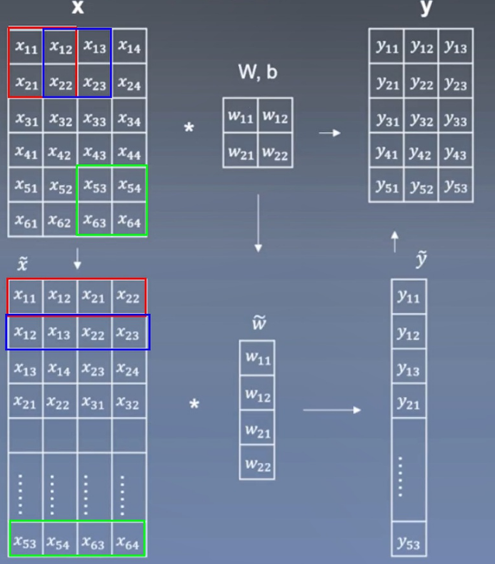

<center>只需要把上方的原图通过一点小trick转换成下方的矩阵，轻松的用矩阵相乘来得到输出了</center>

<center>图源深度之眼-Deepshare.net</center>

这里我们只不过是把原来的一个正方形resize成一个一维向量，观察一下转换后feature map的下标很容易找到resize的规律。这里也回答了前面提出的“为什么单层FC能够保留位置信息”的问题。在此之后，我们也很容易写出反向传播的偏微分方程了。

当然，这里只是对一张单通道图片进行运算，那如果有多张图片，或者一个图片有多个通道该怎么做？小问题，把这些通道或图片全部resize成一个如上图所示的matrix，随后在行的方向上，把它们堆叠起来形成一个长长的矩阵（显然其列数还是保持不变，为卷积核的大小，故满足矩阵相乘的定义），再进行相同的运算即可。

卷积搞定再来想想池化操作，有了上面了例子是不是感觉也简单了不少？平均池化其实就相当于卷积核的参数固定为（1/卷积核大小）的卷积操作，这里不再展开说，直接上图看看最大池化吧：

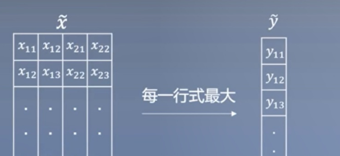

<center>用同样的方式根据卷积核的大小，把原feature map resize成x hat，再取每一行的最大值</center>

池化层只会提取前层最大的特征，显然没有被提取到的特征点在反向传播中不会得到训练，分配到的误差为零，梯度为零：

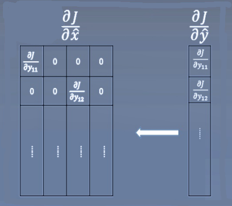

<center>图源深度之眼-Deepshare.net</center>

至此，反向传播的基本介绍就到此结束。当然我们没有讲解使用batchnorm、layernorm的时候反向传播应该如何进行，不过原理都是完全一样的！最简单的办法就是先按照规律resize成一维向量，随后就和标准网络的FC层如出一辙！现在，你应该能够使用pytroch、caffe等网络框架搭建属于你自己的CNN图像识别网络了，快动手试试吧，马上复现一个LeNet-5问题应该不大。


---


### 5.2.6.目标检测

> 利用CNN我们已经可以完成对图像的识别和分类。但是这样是远远不够的，为了能准确定位图像中的物体，我们需要对图像中所有目标进行定位（找出框住目标的bounding box外接矩形框，即[cx,cy,w,h]四个参数，分别表示目标中心在图像中的坐标和bbox的长宽）。此部分会介绍几个经典的目标检测网络实现的原理和方法。

有同学可能会想，那我直接让网络在全连接层后输出一个向量而不是标量（分类），即多输出四个坐标也就是8个值，分别代表图像中目标的四个角点不就行了吗？确实，对于只有一个目标的图像我们可以这么做，可惜倘若图像中有多个目标的话，网络的输出就变成不确定的了（需要一次性输出不确定长度，分别表示每个目标框中心、长宽和其对应的分类），我们是无法训练一个没有确定输出的网络的。

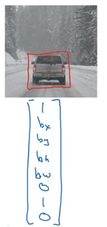

<center>目标定位方法，得到一个WxH到1x9向量的映射</center>

<center>1代表有目标在图像中，随后四个数代表中心坐标和目标框的长宽，最后四个数表示目标分类</center>

因为图像分类是对整张图像进行的，是一个WxH维到一个**确定**的标量或向量（如上面说的同时进行分类和回归）的映射，标准的CNN方法显然无法完成一张图片中多个对象的分类和定位操作。不过机智的你应该已经想到，我们可以把图片**拆成很多的部分**，然后将这些子图分别投入CNN从而得到它们对应的分类，不就把里面的对象定位出来了么。

没错，这就是密集采样的定位思想，也是最早的目标检测方法。使用**滑动窗口**来检测目标位置的方法和模板匹配有些类似。还有一种方法是将图像用不同的长度划分格点，在每个格点中进行图像分类（这其实是一种特殊的滑动窗口方法，即设定滑动步长大小使其与窗口的大小相同）。

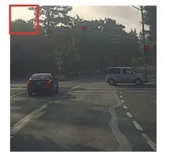

<center>采用不同大小的滑动窗口，裁取图像的一部分投入CNN得到分类（图中只使用了一种大小）</center>

显然，这种方法的缺点也非常明显：**超高的计算开销**。步长设置的过大可能会发生漏检，而为了检测大小不同的目标，我们又需要采用各种大小的窗口来运行CNN，同时还可能需要使用不同长宽比的窗口来应对物体长宽比不同的情况（例如汽车在侧面看是细长的矩形，正面又比较接近正方形，如果仅使用一种类型的窗口，则可能会出现定位不精确的问题，得到的定位框包含了大量的背景）。

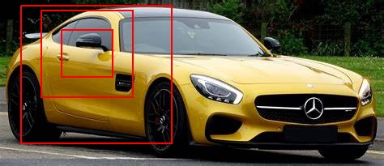

<center>使用滑动窗口方法可能出现的问题，没有一个滑窗能够和汽车整体匹配</center>

仔细观察，我们就会发现，在目标检测问题中，我们面临的最大困难就是候选区域太多且目标大小的尺度不一，问题的搜索空间过于庞大，我们难以用暴力搜索穷举全部解。于是**two-stage**方法的代表作R-CNN（region proposal-CNN）横空出世。不过，再介绍R-CNN之前，先让我们看看目标检测中常用的术语和概念吧。


---


#### 5.2.6.1. 目标检测中的常用术语

1. **GT(ground truth)**

   GT可以理解为真实值、有效值、正确的答案、正确的标注信息。对于目标检测来说，标记的坐标点和标记分类就被称作ground truth。

   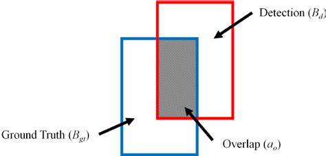

   <center>训练标记的bbox区域（蓝色区域）就是ground truth</center>

   在目标检测网络的推理过程中，如何为预测框分配标签（训练的label即GT的属于的分类）会极大地影响训练的效率和推理的准确度，这也是当前目标检测研究的热点和难点。

2. **IOU(intersection of Union)**

   字面意思。两个bbox的交集和并集的比例，详见上方GT的插图，灰色区域为交集面积，除以两个bbox的并集就得到交并比。交并比是衡量检测生成bbox的准确性的一个指标。现在也出现了一些其他用于衡量预测框质量的指标。

3. **正/负样本(positive/negative sample)**

   在目标检测中，包含了目标的bbox就是正样本，而没有包含目标即bbox内是背景的将被作为负样本。当然一些网络会对正负样本进行特殊定义。特别注意，我们是**根据训练标注来生成正负样本**的，并不是说训练标注中地GT就是正样本，其他区域都是负样本。我们会依据某种准则如与GT的IOU或置信度进而由得到正负样本。

   

   <center>我们的检测目标是杯子，假设网络生成了4个检测框，认为这里面有杯子，那么根据特定的IOU阈值如0.5，我们将生成的4个检测框分别作为正负样本对待；在这里红色框是GT，紫色和蓝色框因为和GT的IOU超过50%被记为正样本，绿色框则被判定为负样本（背景）</center>

   在阅读了低下的几个经典网络后再回来看看，你应该会对正负样本有新的理解。并且目标检测中有一个很大的、亟待解决的问题就是**正负样本**、**难易样本**的**失衡**。（在一张图片中，没有目标存在的区域占了全图的绝大部分，负样本即背景类占了所有样本的大多数，大量负样本在训练时会淹没正样本，导致神经网络失去鉴别能力对负样本产生过拟合）

   正负样本的划分策略（用IOU来划分正负样本是一个合适的准则么？）和不平衡问题同样是目标检测的难点。

4. **ConvNet和特征图**

   ConvNet一般值的是神经网络的backbone（骨干网络），也就是负责提取图像特征的部分，即我们在上面讲解CNN的时候由卷积层和池化层堆叠起来的block。特征图就是经过n个block之后产生的“图片”，因为原图的特征被提取到这些小”图片“上所以我们称之为特征图。简言之经过卷积或池化处理的图片或特征都可以被称作特征图，上面记录着原图的某些特征。

5. **感受野**（receptive field）

   从这个术语的名字应该可以略知一二。receptive field是高层feature map上的一个点的信息是由原图或之前的feature map中多大的范围/面积的像素所贡献的度量。换个简单句：原图上的某个像素或低层次的feature map是否和高层中的feature map上的某个点有关联/间接连接？再或者直接看图：

   

   <center>绿色区域是l2中左上角像素的感受野，而黄色区域是l3中间像素的感受野</center>

   有许多扩大感受野的方法如变步长卷积、空洞卷积、膨胀卷积、focus层等我们稍后介绍。其实这个概念应该在CNN部分就进行介绍，但是由于图像分类对此并不敏感所以将介绍移到了此处。

6. **NMS（非极大值抑制）**

   在生成检测框的时候，可能会出现下图这种情况，这时候我们要根据框的置信度或定位精度等信息筛去一些重叠区域很大的目标框，防止出现重复检测的情况。这里给出了NMS的大致介绍和实现源码：[NMS 在目标检测中的应用](https://www.cnblogs.com/makefile/p/nms.html)。

   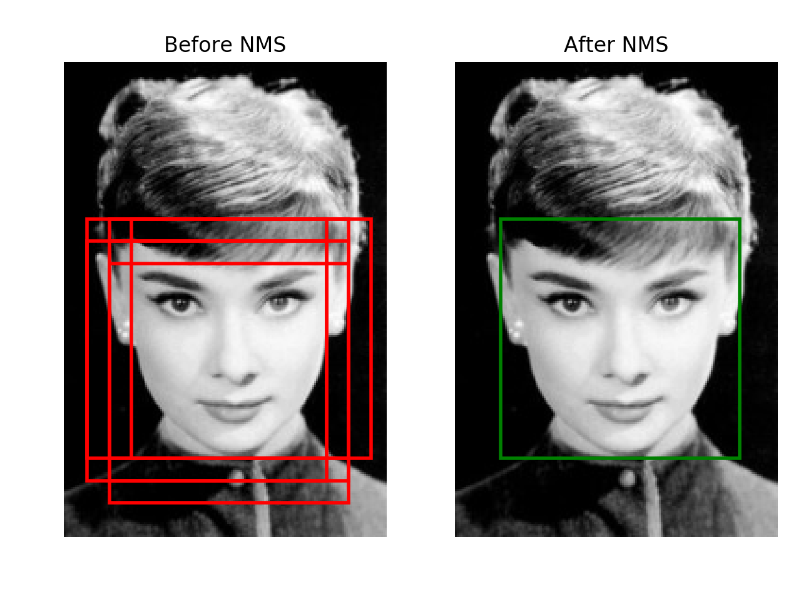

7. **性能指标与mAP（mean average precision）**

   mAP是目标检测中最常见的测试检测器性能的指标。在次之前先让我们看看混淆矩阵，这是机器学习中所有分类器都要确定的一个参数：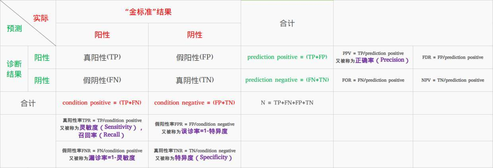

   <center>混淆矩阵和对应的概念含义</center>

   由混淆矩阵中的数据，我们可以通过各种运算来得到千奇百怪的指标，常见的如正确率、真阳性率、特异度、假阴性率（漏诊率）、Youden指数等。我们则选择mAP来指示一个目标检测算法的性能，mAP的计算需要**查准率**（true positive rate,precision： **TP/(TP+FP)**  ）和**查全率**（又叫召回率recall，计算通过TPR：true positive rate，**TP/(TP+FP)**  ）两个信息。这两个指标是一对矛盾指标，当查准率高的时候，说明分类器很少把负类分为正类，只遴选那些最优把握、正类置信度高的样本，显然分类为正类的样本TP+FP将会下降（置信度上升，分类器把更少的样本分为正类），同时查全率必然跟着下降，很多正样本将会成为漏网之鱼而被分类为负样本。当降低阈值希望尽可能多地把所有的正类的查出来，那么很多置信度较高的负类同样容易被分为正类，导致查准度下降。

   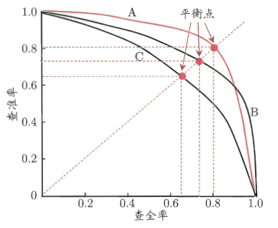

   <center>找到曲线上的平衡点，即边际效用最大的点，当继续往曲线的右侧移动，查全率上升的速度将会低于查准率下降的速度</center>

   目标检测任务中判断预测框的正负样本一般以IOU是否>0.5为准则（这里的分类是说预测框里有没有物体，而对预测框中物体进行的分类则是**直接通过置信度进行**）。那么如何绘制处pr曲线？只需根据不同的分类阈值分别设定分类器并对样本进行分类即可得到PR空间上的一个点（一组测试对应**一个查全率和一个查准率**，也就是PR空间中的两个坐标），改变阈值就能在pr图上画出一些列的点，平滑地连接它们即可得到pr曲线。一般的测试方法是改变阈值每级递增0.05直到0.95，称为IOU=[0.5：0.95]。**AP就是PR曲线下方的面积**（为什么用曲线下的面积，而不用平衡点处的分类器性能作为指标？），称作average precision平均精度。而mAP是把每个类的AP曲线进行求平均，即可算出多分类的平均精确度。

   但是mAP也有一个问题，就是正负样本的数量不同的时候会导致PR曲线严重失衡（从precision和recall计算方法想想为什么），而ROC和AUC就不会出现这个问题，因此这两个指标在分类器性能测试中也很常用。

   得到ROC曲线需要查全率和误诊率两个指标。查全率TPR在上面已经介绍过，这里再介绍**false positive rate**：它被称做假阳性率、误诊率和伪正类率，表示所有被分类器判别为负类的样本有多少实际上是正类（假正类在所有判别为负类的样本中的占比，FPR=FP/(TN+FP)  ），同样会反映分类的精确程度（同样你可以思考一下为什么在正负样本比例失衡的时候ROC曲线不会变形？）。

   和PR曲线的绘制相同，我们需要设置不同阈值来作出一系列的点随后连接绘制ROC曲线。ROC曲线下方的面积AUC即area under curve同样也有一些含义。使用AUC值作为评价标准是因为很多时候ROC曲线并不能清晰的说明哪个分类器的效果更好（阈值不同且指标不同），而作为一个数值，对应AUC更大的分类器效果更好，其具体含义为：当随机挑选一个正样本和一个负样本，根据当前的分类器计算得到的score（置信度）将这个正样本排在负样本前面的**概率**。

   下图中的（b）可以帮助你更好、更直观地理解ROC曲线的含义，竖线处theta即设置的分类置信度。

   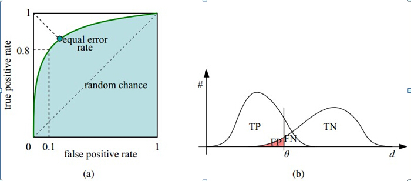

   <center>看此图理解起来没问题/有新的启发就说明你大概掌握了这些概念</center>

   *如果还是没懂也没关系，就把它们当作衡量训练得到的预测器的好坏的指标即可，这个指标越大越好！*

   

8. **公开数据集**

   列出几个最常用的目标检测公开/比赛数据集：

   - VOC（visual object classes chanllenges）2005-2012

     经典的计算机视觉竞赛，任务包括图像分类、目标检测、语义分割和动作检测。20个种类。 VOC07和VOC12最为常用。近年来被更大的数据集像ILSVRC和MS-COCO逐渐取代。

   - ImageNet 2010-2017

     训练数据集包含500,000张图片，属于200类物体。由于数据集太大，训练所需计算量很大，因而很少使用。同时，由于类别数也比较多，目标检测的难度也相当大。一般不会用作检测网络的性能，二是作为训练使用。

   - MSCOCO（microsoft common objects in context）2015-now

     看名字就知道是巨硬家的。最大的特点是除了bounding box 注释，还给了segmentation标注。MS-COCO也包含更多的小目标（面积小于图像大小的百分之一）和稠密的目标。这些特征使得MS-COCO更接近于现实生活。MS-COCO已经成了目标检测家族中的实际标准。


---


>  了解了基本概念,开始上手目标检测吧。在接下来这三个经典网络的介绍中，我们尽量忽略细节上的推导如卷积的通道数和维度，特征图的大小等，而专注于介绍网络实现的思想和总体方法。因此笔者默认你已经了解卷积神经网络的原理和目标检测的基本概念。***如果要深入了解并运用obj detection还是要仔细阅读这些经典网络的论文，精读它们的源码实现！***

#### 5.2.6.2. 经典检测网络之R-CNN家族

- **R-CNN**

  R-CNN为了减少候选区域的数量，在原图上根据不同的比例、颜色、纹理和形状划分出许多区域（例如使用k-means等**聚类算法**），随后再根据区域之间的相似性对这些区域进行合并，这一步被称作**selective search**，会得到大约2000个候选区域即**ROI**（2000是人为确定的让合并算法终止的值，也可以选择其他值，过大的值会导致很大的运算开销；太小的值又容易将小目标区域被合并而使得漏识别或定位不准）；然后对这些区域通过取**外接矩形**的方法得到一个个可能存在**目标的候选框**，把这些候选框全部拉伸成正方形（保证cnn的输入相同方便投入相同的网络中）；接着在这些区域上运行CNN得到特征图，将特征依次投入到多个的二分类SVM（为每个类训练一个SVM，输出只有是和不是）和**角点回归网络**中（一幅图像到4个坐标/8个点的映射，看作一个回归问题），得到每个区域的分类与目标框角点的坐标；最后再运行NMS（non-maximum suppression）后处理（Postprocessor）去除一些重叠的目标框，得到分类结果与预测框。

  

  <center>通过selective search得到的区域图示，对这些连续的色块求出外接矩形即可得到预测框</center>

  整个算法的pipeline如下：

  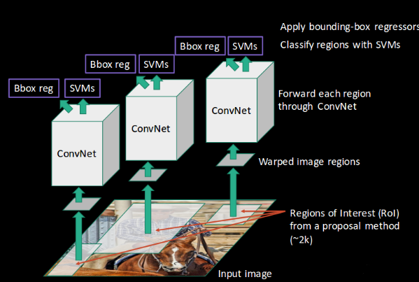

  R-CNN相比最原始的滑动窗口法，采用selective search的方法大大缩小了搜索空间，只在那些有可能有目标的地方运行CNN，使得基于神经网络的目标检测算法变得可用（原来的算法复杂度根本不是多项式时间内可以解出结果的），虽然处理一帧图像的时间为50s量级（怎么还是那么长啊喂），不过相对之前的滑窗方法已经有了极大的提升，R-CNN的成果也让很多目标检测研究人员把目光从传统特征匹配转向了深度学习。

  R-CNN也是首个提出用训练好的图像分类网络（R-CNN使用的是pre-trained的ImageNet）作为检测网络的Backbone再在之后的训练中进行微调（fine-tuning）方法的paper。预训练+微调的方法也一直沿用至今。


> 虽然R-CNN已经大大降低了目标检测的工作量，但是其动辄百秒的检测时间还是令人难以接受。其痛点不仅在与速度，在特征获取和复用上也有很大的问题：
>
> 1. 没有复用特征，直接在原图上裁切子图，会出现大量的区域重叠，而R-CNN又对每一个ROI都运行了一次CNN，从而造成了非常多的重复计算，还是过于暴力了。
> 2. 直接对ROI生成的外接矩形进行拉伸使其变成正方形，目标的特征可能会有损失、变形。


---


既然已经有人开了先河我们也分析了优缺点，那么，有请下一位选手Fast R-CNN登场（名字也够直接的哈，我R-CNN不要面子的吗）！

- **Fast R-CNN**

  废话不多说，直接上pipeline：

  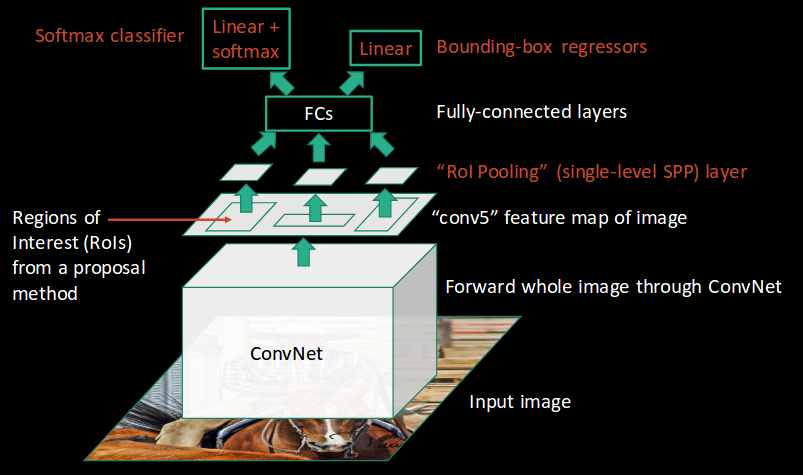

  既然还是叫R-CNN，那么我们就对比着R-CNN来看看这个Fast到底有什么能耐吧。它仍然使用了selective search的方法来生成候选区域，不过它不再把每个ROI区域都投入相同的CNN中，而是先直接对图片运行CNN，得到整张图片的feature map，然后把由原图经过selective search得到的ROI根据映射关系（图像在经过ConvNet后会按一定比例缩小）对应到feature map上，也就是上图的ROIs from a proposal method。以上的操作便改进了R-CNN的第一个缺点，避免了大量重复的卷积运算，让所有可能存在目标的预测框共享了很多特征。

  紧接着使用对这些ROI使用ROI Pooling的技术，把所有的ROI通过这种特殊的Pooling缩放成相同大小以便投入之后的全连接层，这种技术也尽量避免了强行缩放带来的特征变形、损失（虽然还是在一定程度上有影响，之后版本的Mask R-CNN所采用的ROI Align通过双线性插值进一步改善了这一步特征提取）。

  - *此处mark，我们会发现进行检测的时候只使用了对应ROI的feature，feature map的其他部分不会被检测头使用，因此Fast R-CNN和之后的Faster R-CNN只提取了前景信息而忽略了和目标一同出现的背景，在之后的 yolo 算法的误差分析和优缺点整理中我们会对这个mark进行分析。*

  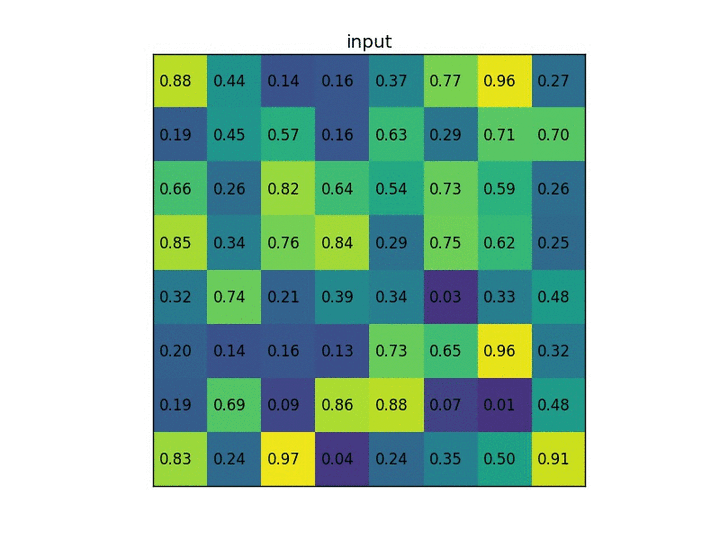

  <center>ROI Pooling图示，例如这里想要采集2x2的特征，就把对应区域的特征图（这里是5x7）尽量平均地分为四个区域（3+2=5，4+3=7，如果需要得到特征的长宽刚好是feature map的长宽的公约数就能平均分了）</center>

  最后就是对FC后得到的特征进行分类和bbox回归了，Fast R-CNN使用线性回归+softmax的方法替代了原来的多个二分类SVM进行目标分类，这样能引入类间的训练竞争；bbox回归还是和原来保持一致（毕竟当时没啥可以优化的），这两部分工作是并行的。

  > 经过这一通操作，不仅提升了识别的准确率，还直接把平均单帧处理时间干到了2s！几十倍的速度提升已经非常可观了 。但是还是达不到实时性的要求，怎么办呢，我们仔细分析一波Fast R-CNN存在的问题：
  >
  > 1. 仍然使用selective search，这部分工作在整个算法中占了大概七八成的时间，对上千个的区域进行运算、合并的开销还是挺大的。
  > 2. ROI pooling这部分会损失精度，还有提升空间。

  

  ---

  

  因为我们的精神是更高更快更强(~~卷就完事了！~~)，所以请出下一位选手Faster R-CNN！

- **Faster R-CNN**

  这个网络相对于Fast R-CNN的改动就比较大了，最重要的贡献是提出了RPN（region proposal network）替代selective search，用于提出候选区域，大大降低了时间开销并且提高了识别精度。同时由于不再使用selective search，为了保证对不同尺度（大小）的目标的检测效果，加入了anchor作为目标尺度的先验信息。听不懂？先看看pipeline：

  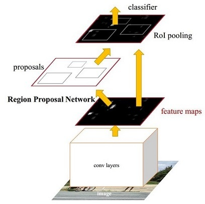

  和Fast R-CNN一样，先通过ConvNet得到整张图片的特征图，随后将此特征图投入RPN中，而RPN的输出是可能存在目标的候选区域，既然是网络那么还一是一种映射：特征图到候选区域的映射。这里得到的候选区域数量就是可能存在目标概率最大的k个区域，至于如何得到请看之后的讲解。得到候选区域后，还是对这些ROI进行特征提取（ROI pooling），之后的流程就和Fast R-CNN一模一样了，我们重点说说RPN。

  为了理解RPN的工作原理，就必须先了解**anchor**。前文中的滑动窗口检测我们提到用大小不同的滑窗来遍历整个图像，分别投入CNN进行检测。使用大小不同的滑窗就是为了对应不同尺度的目标，而遍历图像则是在搜索空间中寻找可能的目标。Selective Search是通过合并相似的区域来进行区域提议（生成候选的ROI）。显然在这个过程中我们都加入了先验的知识来确定目标，seletive search就认为属于一个目标的区域的纹理和颜色等特征应该是相似的，由此**减少搜索空间的大小**，即使是滑动窗口法也加入了一些假设如目标的大小。这些先验信息都以**超参数**的形式加入检测网络（也就是“炼丹”中需要认为修改的参数）。那么RPN就是利用anchor引入先验信息从而缩小搜索空间。首先我们把图像划分为一定数量的格点，然后以每个格点为中心，生成一组比例和长宽各不相同的候选目标框（有同学会想，这还不是在抓瞎吗，这要怎么知道候选框里有没有目标？让我们先保留这个问题）下图是anchor的形象解释。

  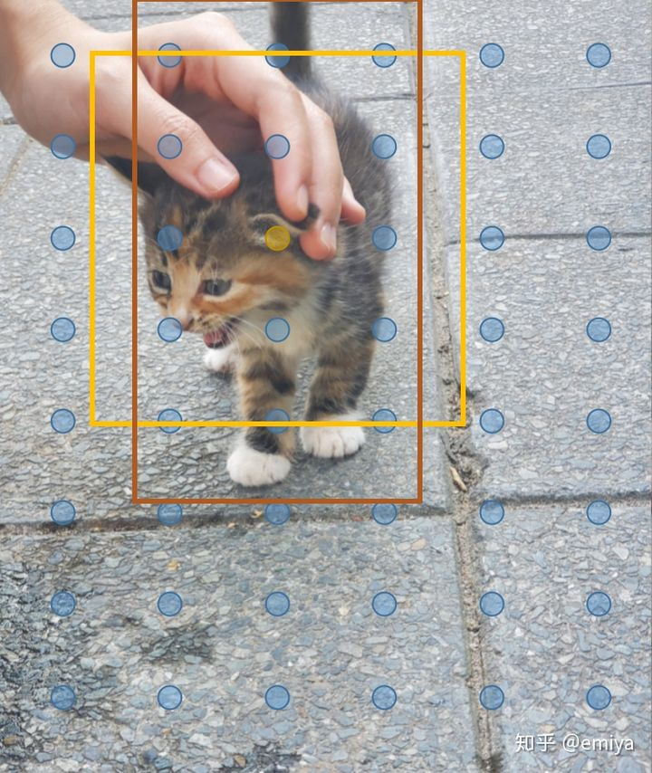

  <center>anchor就是在图像上预置的一堆大小长宽形状不同的候选框，图源知乎-emiya-目标检测算法设计思想</center>

  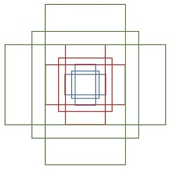

  <center>在Faster R-CNN的RPN中，我们使用9种anchor，在每个格点上生成这样一组anchor</center>

  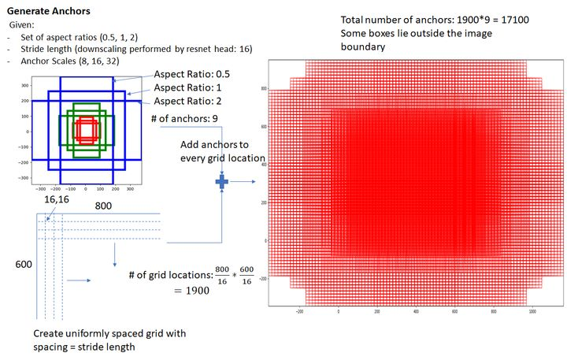

  <center>在进入RPN前，由ConvNet得到的feature map为50x38，于是我们对此feature map的每一个点都设置一组9个anchor（注意要映射回原图，既然是ROI提议，那么anchor肯定是设置在原图上的，因此要进行一个比例缩放）</center>

  上图中右边密密麻麻的就是生成的anchor了，好家伙算一下总共有17100个ROI！到这里为止，采取的方法看起来仍然是“瞎猜”并且候选位置还是太多；而且即使是使用了这么多的anchor，有些物体还是没办法被很好的框住，有可能没完全框住，也有可能是框太大。下面就进入筛选anchor和修正anchor环节。以下给出RPN的结构：

  

  <center>RPN网络的结构，图源知乎-白裳-https://zhuanlan.zhihu.com/p/31426458</center>

  <center>进入红色框之前的是ConvNet得到的feature map</center>

  首先从对ConvNet得到的特征图再进行一次3x3卷积降低参数量，然后分别投入到两个并行的网络分支。上面的分支通过一个1x1卷积再经过softmax函数，判断**每个anchor存在物体的概率**（不管是哪一种目标，只要有目标在里面就行，即只做有/无目标的二分类）。那么第一个问题解决了，我们可以通过物体存在的概率来对anchor进行初步筛选。但是你可能还会想，为什么就得到了每个anchor区域存在物体的概率了？关键就在于3x3卷积和1x1卷积构成的这个小网络，我们会通过训练，让这个网络成为一个**回归器**，之后再通过softmax函数得到每一个anchor包含物体的概率。（映射！还是映射！***网络结构中的 `reshape`暂时不用管他，这个是代码实现的时候需要关心的问题***，reshape后可以方便softmax函数的计算，算完后再reshape回去罢了）

  接下来看第二条分支是怎么解决anchor对物体的贴合度不够的问题的。这个分支会习得一个**修正的**anchor使得anchor能够更接近物体边框的映射，也可以说是原anchor和ground truth的offset。以下面这架飞机的检测为例，绿色的框是训练标记，红色框是RPN生成的anchor中最接近标记的那一个，显然此anchor还是只能覆盖飞机的主体步部分，机翼没有被包含进来。

  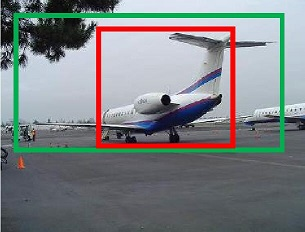

  如果要通过变换来使得生成的红色预测框贴近绿色框（GT），最简单的办法是什么？那肯定是先平移到合适的位置，然后再进行一定比例的缩放。如果anchor和gt差距不大，那么这种变换很显然是可以被**近似成线性变换**的，因此我们假设生成的anchor中最接近gt的那个已经和gt框**很相似**了，只需要用一个平移+缩放来进一步贴近它。所以我们会通过第二个分支中的1x1卷积来学习这种变换关系，即对bbox中心的平移$[dx，dy]$和横向纵向的拉伸比例$[kx，ky]$（当然，也可以直接学习ancho的四个角点和GT的四个角点的偏移量$[dx_i,dy_i],i\in\{1,2,3,4\}$即四个角点）。那么经过训练，这部分网络就会学习到一个对anchor进行修正的映射关系了。网络会为每个anchor都输出一个$[dx，dy，kx，ky]$数组（属于是量身定制了）。

  ok，两步分支结束，接下来我们就要把对anchor的筛选和对anchor的修正给综合起来，为下一步的bbox四角点位置回归和分类提供候选区域。请看RPN结构中的Proposal层，它大概有如下几个步骤：

  1. 根据所有anchor包含物体的概率，对anchor进行筛选，得到概率最大的n个候选框（n还是一个自选数）。
  2. 利用第二个分支得到的[dx，dy，kx，ky]对这些筛选得到的anchor box进行修正。
  3. 对超出图像边界的anchor进行裁切使得它其中一条或两条边变成图像的边界（在生成anchor阶段，处在边缘的格点生成的较大的anchor必然会超出图像边界；同时在进行anchor box的修正时，也有一部分anchor会因为变换而出界）。
  4. 去除特别小、比例异常的anchor（经过变换后可能会出现这样的问题）。
  5. 对剩下的anchor进行非极大值抑制。
  6. 从剩余的anchor中随机选取128个作为正样本，再在被筛选调的anchor中选128个作为负样本，把这些anchor作为候选区域，交给Faster R-CNN的下一个部分。至此，RPN网络即候选区域提议的工作结束。

  下一步就是和Fast R-CNN一样,通过ROI Pooling提取候选区域对应的feature map上的特征，把特征连接到FC层，再分别投入bbox角点回归网络和分类网络，得到更精确的目标框和目标类别。可以看到，相比于Fast R-CNN变动最大的就是利用RPN替代Selective Search这一步，**利用网络来提取深度特征**（用于生成候选框的特征），大大提高了提议区域的精确度；同时也避免了逐像素、逐区域的合并工作，提高了速度，平均单帧处理速度来到了0.2～0.4S！

  Faster R-CNN也首次完成了目标检测任务的“**深度化**”，即整个检测流程都使用神经网络连接完成；在高速的同时成为了当时的state of the art（检测任务竞赛的第一名）；这项工作基本奠定了区域提议+ROI-CNN（区域分类网络）的two-stage检测网络结构，从此全面开启了基于CNN的目标检测。两阶段的网络也让监督信息（设计的loss function和训练数学）能够在不同层次更有针对性地对网络参数的学习进行“指导”。

> Faster R-CNN的成果在当时是振奋人心的，终于让大伙儿看到了基于网络方法的实时检测的希望！不过一秒3、4帧的速度在实时场景还是难堪大用，并且Faster R-CNN也存在一些问题:
>
> 1. 和Fast R-CNN一样使用ROI Pooling丢失了一些特征。
> 2. 属于two-stage，分为区域提议和分类+回归两个阶段而不是**端到端**（end-to-end）的方法。RPN的速度还是不够快。
> 3. 只从ConvNet的最后一个特征图上提取特征，分辨率较小因此对于**多尺度**、**小目标**的检测问题没办法很好地解决。
> 4. 筛选候选框使用NMS而分类时使用softmax，这样可能会把有部分重叠的目标或是大目标框内的小目标给筛除。


---

#### 5.2.6.3. 经典检测网络之YOLO

此时此刻恰如彼时彼刻，一位大佬在阅读了Faster R-CNN 中PRN设计的思想后直接拍桌怒起：既然RPN能直接根据深度特征提取出可能存在物体的ROI，生成提议区域，那我干脆直接就用网络**直接回归出bbox的坐标**不就得了，一步到位岂不是美滋滋？（两阶段的方法相当于先通过RPN大致定位bbox，再在后续的bbox回归中获取更精准的定位框，one-stage的方法直接在特征图上进行bbox的回归）这就是YOLO的设计思想。YOLO是you only look once的缩写，“只看一眼”也昭示着这是一个一阶段的端到端网络，不需要中间的区域提议阶段！

- **YOLO**

  作为one-stage模型的开山之作，yolo直接砍掉了RPN，通过连续的几个卷积层直接回归出bbox坐标和对应的分类。首先一起看看yolo的pipeline：

  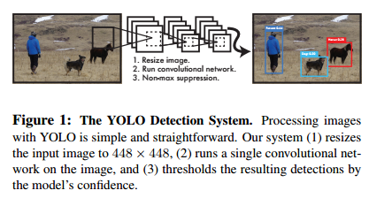

  相比之前介绍的R-CNN家族，是不是感觉一下清爽了不少？从设计结构来说，整个算法的运行就只有3步：

  1. 缩放图片至ConvNet的输入大小
  2. 卷卷卷...
  3. 得到每个框的分类和置信度
  4. 运行NMS去除重复的目标框

  有些同学肯定会疑惑，怎么就得到了回归坐标和分类呢？请牢记一点：网络只不过是会在训练过程中会学会一个映射！那么关键就在于我们应该**如何提供“监督”来让网络学习这个映射**。不过，还是要称赞一下如此简单明了的设计简直满足了所有美好的想像，如此的Unified、elegant！

  请看YOLO的设计思想：

  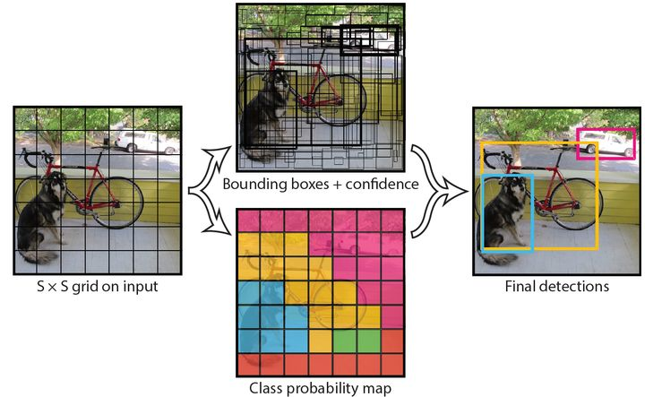

  <center>1.划分格点   2.得到预测框和置信度/得到每个格点的分类概率   3.综合2上一步的两个数据得到检测结果</center>

  1. 首先还是通过密集采样的思想，把图像分成SxS大小的一堆格点，训练时每个单元格将会负责检测那些中心落在对应格点中的目标，即GT的中心落在哪个格子，那个格子就负责预测（初看yolo的教程的同学都很有可能有这样的问题，训练的时候你有训练标记，能够知道每个目标的中心在哪里；可是在推理预测的时候怎么目标中心在哪呢？答案是不用官管！**我们会把每个格点都当作目标中心**，一会还会提到这个问题）。

  2. 由前面简介所述，yolo直接回归得到bbox角点和分类，那么对于bbox的预测，假设每个格点会预测N个检测框（不同的规格和尺度，类似于之前介绍的anchor的概念，也是先验的、用于**缩小搜索空间**的方法），还会得到这个框的置信度（定位是否准确？框内存在物体的概率？总之是这两者的**加权值**），此置信度在训练时通过生成的边界框与GT的**IOU**来表示，如果预测得到的边界框不存在物体则**此项为零**（网络认为这里没有目标那么也没必要计算IOU了）。这一步骤中得到也就是上图中的Bounding boxes+confidence。

  3. 我们还需要为每个格点生成的检测框预测其属于C个类别的概率值（当然也可以训练一个**softmax分类器**来计算每个类的概率，不过既然网络可以直接学会一个图像到分类概率的映射，我们干脆就直接让网络输出对应预测框**属于每个类的概率**吧！读者也可以思考对比一下两者的优劣），有些网络会分为C+1个类因为它们把背景也作为一种分类，不过我们前面已经在bbox的预测中增加了置信度这个指标，那么当预测框中没有目标的时候此项为0，这样就不需要一个额外的分类了。这步对应上图2中的生成class probability map。

  那么，根据上面的介绍，我们最后总共需要网络输出SxSx(5\*N+C)个值，yolo的paper选择的值是s=7，n=2，C=20，即把原图划分为7x7的网格，每个格点预测两种不同大小的预测框，总共检测20种目标，5是框的置信度和中心坐标、框的长宽。因此网络最后会输出7x7x(5\*2+20)个值。*此处mark*，稍后再提如何进行后处理。*

  讲完了整体设计思想，你应该能明白为什么我们把每个格点都作为可能的目标中心了：因为每个格点最后都会产生5*N+C个值！即使在实际推理的时候这个格点里面没有目标存在也没事，**算就完事了！**最后在得到预测值的时候，没有目标存在的格点要么bbox的置信度会**很低**或者**为零**（表示这个框里啥也没有），要么就是这个bbox**属于每个类的概率都很低，在之后的NMS阶段将会被删去**。因此注意训练和推理时的区别，我们只是假设每个格点都有物体，最后是否真的有物体，就看输出得到的置信度和分类分数有多高了，笔者称之为”将计就计“！

  看完了网络的设计思想，终于可以看看网络的结构了：

  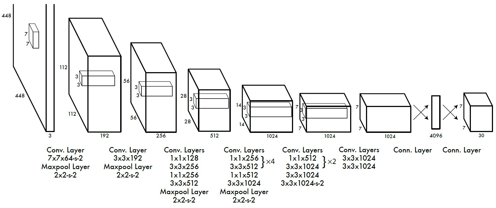

  前面就是一堆卷积层+池化层构成的block，不断地缩小feature map的尺寸（细心的你会发现，虽然feature map横向尺寸变小但是通道数是在增加的，think about it）。倒数第三个block结束后，这里的特征已经非常“高级”了，与是把它们接入全连接层充分利用特征之间的关系，随后连接到一个7x7x30的张量，每个值就代表着我们的需要的那些输出。

  ok，*此处呼应上面忽略的后处理mark*，来讲讲后处理：首先从对所有预测框进行筛选，设定一个阈值把那些“假”预测框筛选掉（也就是对我们假定有目标中心的那些格点进行筛选，具体怎么做？用得到的**bbox置信度**乘以那个bbox**对应的C个类别概率**！）；剩下的就是预测的比较准、类别置信度高的bbox了，再对这些bbox运行NMS，得到最后的预测结果。

  一顿操作猛如虎，YOLO将bbox回归和分类任务并行完成且一步到位，将Faster R-CNN中的RPN也直接给“融合”进来，进一步减小了时间开销，在Pascal VOC2007和2012上得到了63.4的mAP和45FPS的速度，成功实现了**实时检测**！不用想也知道之后one-stage的模型就开始井喷了。

  YOLO的作者还对比Faster R-CNN进行了非常严谨的误差分析：

  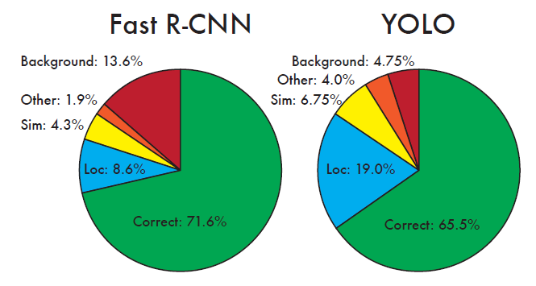

  对比可以发现，YOLO出错的地方大多是Localization错误，即bbox的回归框不准确，每个格点只生成了两个b预测框并且两个预测框预测的是同一个种类；而Faster R-CNN在这方面要好很多，毕竟它有两次修正回归框的机会，先提出候选区域再在其上进行bbox回归。

  - ***此处呼应前文 Fast R-CNN处的前景背景分析mark***

  不过有得必有失，Faster R-CNN在背景分类上出现了很多错误，而YOLO将背景错判为目标的概率只有4.75%，这就很有意思了。从它们俩的结构差别我们应该也能推断处一些端倪：Faster R-CNN在进行分类的时候**只利用了RPN生成的ROI上的特征**，而YOLO从头到尾都是ConvNet的结构，在高层feature map上接近全局的连接获得了更大的感受野，因此也充分利用了**全局的特征**，不容易将背景分为目标。

  由于YOLO没有resion proposal阶段，因此基本没有机会修正正负样本不均衡的问题只能通过一些启发式的技巧最大程度降低负样本过量的影响，而Faster R-CNN在RPN提出候选区域后就能根据生成的候选框与GT的IOU来筛选正负样本使得正负比例约为1：3（作者经过测验发现这是一个比较好的值）。

  YOLO还有一个缺点就是对于小物体的检测很容易忽略，7x7的格点对于小目标来说还是太大并且YOLO没有机会修正检测框。

  

  ---


#### 5.2.6.4. 目标检测小结

> 至此我们已经介绍了4个检测网络，分别是two-stage的代表R-CNN家族和one-stage的开创者yolo，现在可以先小小地来总结一下目标检测网络的设计思想和改进方向了。不过细心的你应该已经发现，我们没有介绍如何训练网络（即loss function的设计思想和具体实现，如何在训练过程中给网络的不同部分提供监督信息？），这其实也是很重要的一部分，我们将在总结完以后大致介绍一下loss funciton和网络pipeline的对应关系。

首先笔者想要再强调一下神经网络作为一个万能的**函数拟合器**的作用：只要合理的设计网络的任务和其损失函数并且提供对应的训练数据，它就能够完成你想做的事！从Faster-RCNN和YOLO的实现结构我们就可以看出，这些block难道有哪个是有实际物理意义的吗？显然没有，即使使用相同的架构，***我也可以通过修改 loss functoin和任务需求来决定最后网络的输出是什么、具有什么意义***。因此在设计网络的时候，最需要关注的问题是我们要***如何把检测任务拆解成合适的几个子任务和模块、怎么样设计最有效的 loss、使用怎样的策略来减小搜索空间、如何去根据检测任务的特点来有针对性地给网络各个部分赋予实际意义。***上面说的这些都是在给网络加入**先验**知识，告诉网络应该如何更好地去学习目标的特征、完成学习。

很多人说神经网络只不过是在**搭积木、炼丹**，此言差矣。诚然大部分时候我们需要花大功夫去调试去改参数，但是怎样设计一个网络还是有很大的学问的。现在也有很多科研人员、很多学者尝试让神经网络的设计更具有逻辑性，通过数学的语言更科学地去建模问题、用更成体系的理论去分析网络结构和模型，减少启发式的设计而更多地去基于模型来调参等等......  和存在已久的传统医学现代医学之争一样，联结主义也一直为人们诟病缺少解释性，被符号主义和行为主义打压（虽然一直被打压但是神经网络还是以不可阻挡之势统治了当前AI的发展，唉呀妈呀真香～），笔者相信随着科研人员在可解释性这条道路越走越远（比如现在火热的可视化），神经网络最终会拥抱科学，完成华丽的蜕变（我们这些小noob就乖乖炼丹把evolution的事情都交给大佬们吧，不过也许你就是将来的大佬！）。

最后笔者想要再次强调强调强调：***神经网络是一个万能的函数拟合器，拟合成什么样关键看你的设计！***这里所说的设计也就是loss function的设计，LF能够用于衡量网络学习效果的好坏，又作为学习的**优化目标**，因此我们依据最小化LF的原则使用梯度下降+反向传播对网络的权重进行训练。


所以接下来让我们把网络需要实现的任务的设计思想具体化，看看其中最重要最关键的一环：**loss function是如何设计的**，并介绍一些对loss的优化方法。这里将会介绍MSE、交叉熵、FL、FCOS、IOU loss等经典方法。

#### 5.2.6.5. 损失函数的设计与改进

##### 5.2.6.5.1. MAE （mean average error）和RMSE（root mean square error）

- MAE即平均绝对值误差，计算得到的是各个样本输入得到的结果相对于对应的标签的差的绝对值，这也是计算误差**最直观最简单**的方法，输出结果和标签差了多少，我们就记多少误差。

  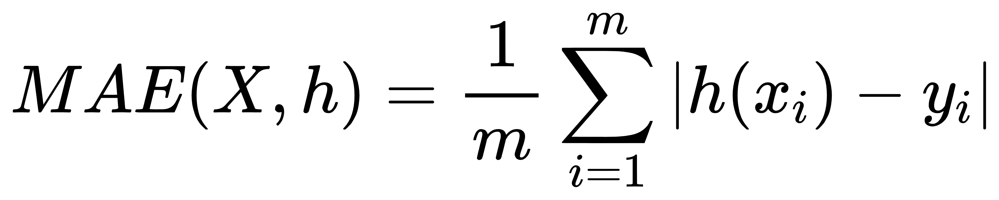

  从数学计算角度看，MAE的结果就是**残差的平均值**。例如有3个西瓜样本的数据x1，x2，x3，每个样本都是一个5维的数据，即：[大小，花纹宽度，重量，颜色深度，拍击是否有回响] ，标签分别为30%，60%，90%将他们输入一个神经网络，希望该神经网络输出的信息为西瓜的甜度；那么，假设该网络对应三个输入的输出值分别为25%，55%，96%，计算其MAE就得到损失值为16/3=5.33。从损失函数这个取名我们也可以看出，其含义就是对于每一个和标签不同的输出，将会产生多少的误差（损失）。

  对于目标检测网络，我们要输出目标框的位置（x,y,w,h）和分类，因此标签也需要有对应的5个值。若采用MAE来计算损失函数，那么就是在一个batch结束后，分别统计每个待估值（需要得到的预测值）对于该batch各个样本的平均绝对误差，让损失函数对xi求偏导再将得到的结果作为反向传播的初始值，进行BP训练。分类只有是和不是，因此是一个二元的损失，但你仍然可以使用MAE作为分类损失函数，虽然它不是太好用。MAE还有一个缺点，就是在原点处不可导。

- RMSE和MAE的区别就在于，他会将误差求平方之后再求平均并在最后开方。

  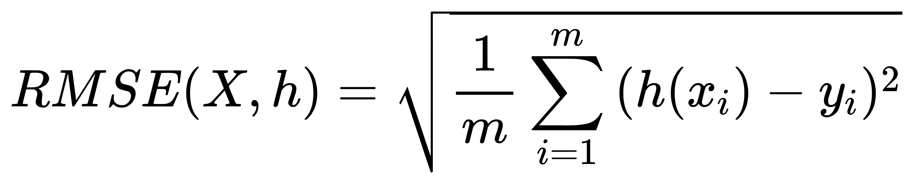

  我们之前已经提到过，设计不同的、有针对性的损失函数是神经网络改进的关键，那么RMAE相对MAE又有什么改进呢？可以看到，MAE对于不同的样本的损失采取的策略是“一视同仁”，即不论单个样本产生的损失值有多大，最后都是获得相同的权重。对于那些损失小的样本，我们会认为该样本网络已经学习得比较好，不需要在这些样本上花费过多的精力；而对于损失值较大的样本，更应该“照顾有加”。那么有没有什么办法实现这种操作？铺垫了这么多，RMAE肯定就是一种能实现该需求的损失函数。每个样本在最终损失中的贡献会随着该样本损失的增大而增大（取了平方，不再是线性关系，相当于y=x^2和y=x比较）。因此RMAE会对训练得不好得样本施以更大的惩罚。但是同样，对于**离群值**（在这里是特别大的异常值）将会有一个**巨大的损失**，这将会误导模型的训练，MAE就没有这个问题。

  > 此处**特别注意**，***并不是 Loss越大，回传的梯度就越大，梯度只和 Loss function的导数（梯度）有关！***网上有很多教程都出现了这个讹误，显然我们从梯度下降法的原理出发就会发现，我们把LF看作是权重ω和b的函数，分别对它们求偏导以得到当前的梯度值并根据往梯度方向更新权重，而LF在参数空间中某一点的大小和梯度是完全无关的！在下面介绍focal loss的时候我们还会再提到这一点。
  >
  > *此处mark*。

  不过不加开方也是可以的，这时候得到的值为MAE（mean square error），公式类似于我们常说的方差（不过方差计算时的yi是这组数据的平均值，MAE的意义显然不是数据的分散程度）。RMSE相对于MAE，由于在最后进行了开平方的操作，就不那么容易产生梯度爆炸的问题了。

  聪明的你应该想到，如果我想让大的更大小的更小，或者让大的不要那么大小的不要那么小，只需要改动误差上的次幂数就行：若选择损失的绝对值的三次方，那么误差大的样本的权重将进一步上升；而选择1.5次方，得到的结果将会比平方更缓和。（那么次幂小于1大于0又是什么情况？）

  此外，RMAE/MSE还有一个较大的缺点，在使用sigmoid作为激活函数配合使用时**（即用于分类）**，收敛速度会非常慢。sigmoid激活函数在特别大或接近零时的**导数几乎为零**，这就导致当预测值落在这些区间时产生的误差非常小，而RMSE又刚好进一步减小了本就很小的梯度（列式计算一下L对xi的i偏导即可，如下图），因此在输出层，神经元的学习速度会非常缓慢。不过好在除了这种方法，还有一些更佳的分类损失函数设计策略（也就是下面要介绍的交叉熵，另外，ReLU系的激活函数几乎已经完全取代了sigmoid，这样在输入激活函数的值大于零的时候会有一个稳定的导数值，不过还是不推荐使用MSE作为分类损失函数）。

  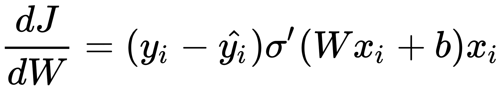

  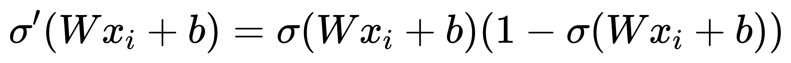

  <center>使用MSE作为分类损失函数时求导得到的结果</center>

  <center>激活值为0/1或接近0/1时梯度会非常小</center>

  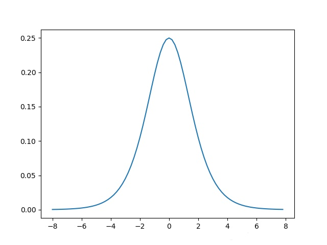

  <center>sigmoid的导数</center>

  从上面的分析中我们可以得出，这三者在目标检测中一般用于设计**距离损失函数**，用于计算预测得到的bbox和groundtruth的差别，也就是常说的**回归问题**。对于**分类问题**就要使用其他的损失函数了。

  ---

##### 5.2.6.5.2. CE/BCE（cross entropy/ binary cross entropy）

既然已经有了距离损失函数，那我们就来看看交叉熵在分类应用的效果如何吧。这篇文章：[损失函数：交叉熵详解](https://zhuanlan.zhihu.com/p/115277553) 从信息熵的前世今生介绍了交叉熵损失函数的由来，强烈推荐。BCE和CE的区别在于一个用于二分类，一个用于多分类，CE就是BCE的多分类推广形式。上面介绍MSE的时候已经提到，我们希望在样本预测值偏离标签大的时候拥有更大的损失值，而RMSE或MSE恰恰在分类任务上对于这点做的不好，因为分类只有错误和正确（0，1），这两者在这些区间的产生的损失值太小不利于网络的训练。

详细的推导的上方的教程里有，不在此赘述，直接看看BCE的形式：

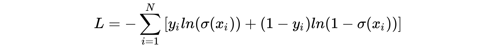

此处时σ(xi)就是将网络最后一层的输出值送入sigmoid函数得到的（将输出归一化为概率，区间为[0,1] )。**L**由两项构成并且总有一项是零。

求L对xi的偏导，就能算出其结果恰正比于预测值和标签值GT的差。这样就解决了MSE存在的问题。不过前面提到，我们希望让误差大（分类分得不好）的样本拥有**更大的权重**，CE就无法做到这一点了，欲知如何解决请看**Focal Loss**。

多分类问题只需要对BCE进行简单的推广，在此直接给出其形式：

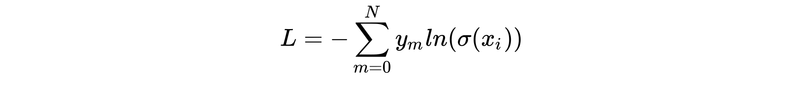

其中

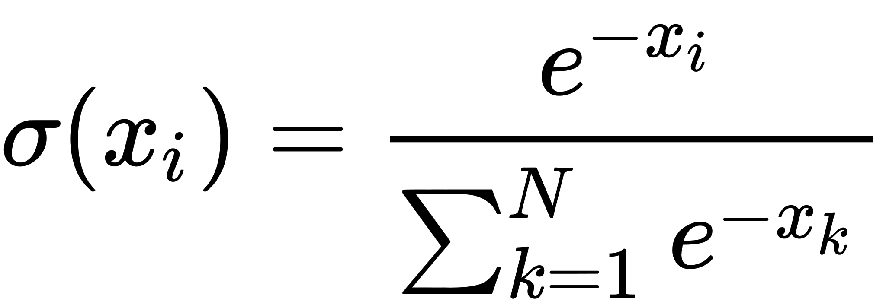

即为softmax函数。

对比BCE的损失函数，细心的你会发现(1-yi)不见了，比如要分为 (apple,banana,pear) 这三个类，最后得到的向量为 [0.2 , 0.5 , 0.3] ，而标签为 [0，1，0] 即最后的分类为banana，apple和pear虽然分别有0.2和0.3的置信度但产生的误差即-0.2和-0.3却不会计入总损失！这样岂不是没办法改善假阳性的问题吗？别担心，我们使用的是softmax函数，由于归一化（除以各个分量的综合），它会让输出的向量各个分量的合即概率合为1，因此提升对yi=1的概率自然就会降低其他分类的预测概率了。

---

##### 5.2.6.5.3. FL（focal loss）

在介绍交叉熵损失的时候我们知道虽然它改善了输出层梯度消失的问题，却无法赋予不同的样本以不同的损失权重。这个问题在one-stage检测器中**尤为严重**，如前文的基本概念中介绍的那样，目标检测的**正负样本严重失衡**，存在大量的背景（负类），而有目标存在的正样本区域则是少之又少。two-stage检测器如Faster R-CNN等可以在区域提议阶段之后对正负样本进行筛选使他们的比例保持在**1：3**左右（经验值），而one-stage由于没有类似RPN的结构因此无法调整正负样本的比例。

并且，负样本又常为易分样本（背景的提取出来的特征和目标特征通常差异很大），正样本由于数量特别少而无法主导损失和梯度，因此模型会往我们不期望的方向发展。在得到MSE的启发后，自然而然，我们需要为此设计一种损失函数，能够提高正样本和难样本的权重，降低简单样本对损失的贡献从而修正这个问题。

Focal Loss将损失函数设计成如下的样子：

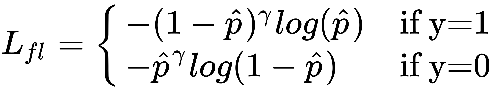

令：

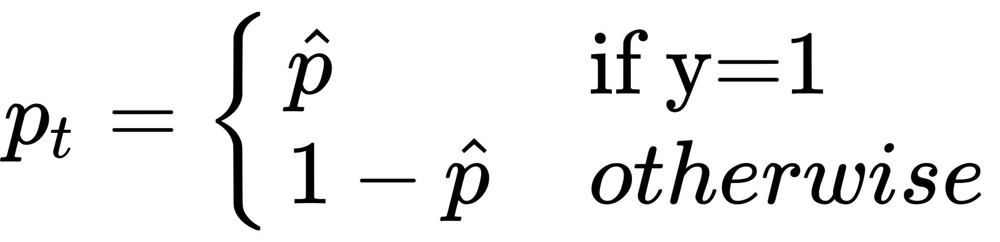

得到统一的表达式：

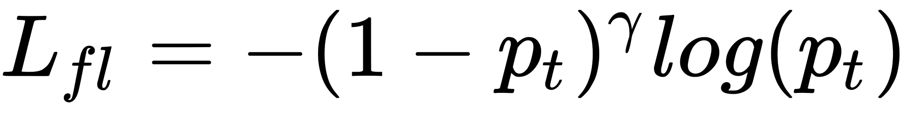

在这里，pt描述了预测值和标签的接近程度，pt越大说明分类越容易（准确度越高）。经过（1-pt）^γ的调制，容易分类的样本的损失贡献将会下降很多，而难分类样本的权重同样会降低（但是降低得不如简单样本那样多），最后的效果就是loss将会**倾向**难分类样本。

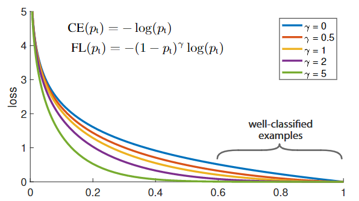

<center>论文原文中不同γ取值的Focal Loss对比CE Loss</center>

*此处回应 RMSE中的 mark*：可是上面我们强调，损失的大小和回传的梯度是无关的，那即使增大了难样本/正样本的损失值，又有什么用？损失函数的梯度和后者无关，**这就说明即使LF的值很大梯度的模还是可能很小**啊，因此可能会出现loss大然而梯度很小甚至为零的情况，那么权重就不会更新，难样本就无法影响学习的过程。这里就需要仔细分析计算一下了，我们分别算出CE和FL的梯度，得到结果如下：

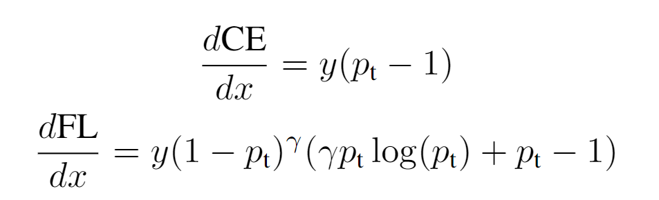

怎么比价两者的大小？光看函数似乎很难得出比较的关系，~~彷佛又想起了求导比大小的恐惧...~~ 没事我用matlab帮你画好了：

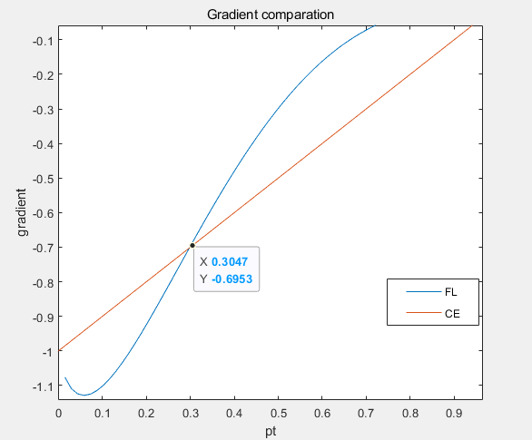

<center>可以发现，在pt小于0.3的时候，FL相比CE将有更大的梯度，而在大于0.3的时候，就更小了</center>

一顿分析猛如虎，我们得到使用FL对于难样本确实可以产生比CE更大的回传梯度，那前面说的”对loss有更大的贡献“到底有没有用？这里我们从两个角度入手考虑这个问题：

1. 特定于Focal Loss的设计，从前面”论文原文中不同γ取值的Focal Loss对比CE Loss“的图上就可以看出，当loss越大的时候，FL的曲线是要比CE**更陡峭**的，这就说明了FL在pt值小的时候会比CE拥有**更大的梯度值**，而在pt大的时候前者的变化趋势会比后者更平缓，也就对应了我们刚刚对其梯度的分析。

   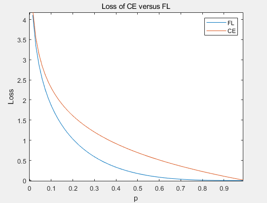

   <center>这里只放了γ=2时的FL和CE，比前面的图更清楚一些</center>

   这是一种巧合吗？似乎也不是。当pt等于1时，我们必然要求loss=0（预测值和标签完全相同，说明很好的拟合了需要的函数），那么，如果我们要求在pt小的时候拥有较大的梯度，在pt大的时候梯度必然会相对更小。举一个实例更直观地理解：让汽车从静止开始在**固定时间**内加速到10m/s，起始的加速度越大，你在后程就必须松更多的油门（减小加速度），对应loss就是一开始有很大的梯度（斜率大），而在pt=1的时候loss必须为零，那后程的斜率就会相对减小了。

   从这里的分析我们也会发现，其实log本身就对pt有一定的”focus“效果，CE曲线对应的损失和梯度也是在pt小时更大，pt大时更小，只不过效果没有FL那么明显罢了。

   > 要从数学上严谨的证明也不是什么难事，若该函数是***单调*** 的，在loss-pt平面上取（0，loss0）和（1，0）两点的连线，若开始时函数的斜率大于此直线的斜率，后面就一定会小于此直线的斜率（凸？凹函数？）。直线对应的就是CE的梯度。

2. 抛开FL的函数形式分析，难样本的贡献大是否有助于网络对难样本的分类？

   这部分主要是笔者的一些感性的、直觉性的想法，请戳：[样本对Loss贡献越大，网络会对它”多多关照“吗？]()。并没有严谨的数学分析，仅作参考！

   ---

##### 5.2.6.5.4. GHM

上面介绍的Focla loss为难易样本施以不同的权重从而让网络倾向难样本分类的训练，一定程度上解决了样本分布不均衡的问题。而GHM（Gradient Harmonized mechanism）则直接从样本产生的**梯度分布**入手，从这个角度看待样本数量和难易程度的不均匀问题。

>  笔者私以为FL其实颇有一点“瞎打误撞”的感觉，原文虽然在最后分析了CE和FL的梯度对比，但是却是从样本产生的loss引入的。很多博客和教程、视频都认为**难样本loss越大则模型权重会往相应的方向更新**，但其实这种说法是知其然不知其所以然，从原理上是**绝对错误**的。对网络的训练过程不甚了解。相信你看完了这一小节，会对loss的设计有更深的理解。

以分类任务为例，希望难样本能够主导网络权重的更新，而不能让简单样本淹没了不容易分类的样本。我们在focal loss已经分析得到，难样本将拥有更大loss贡献，同时也会有更大的梯度，而后者则是问题的**关键**：难样本虽然会产生对应方向上更大的梯度，但是巨量的简单样本产生的梯度叠加起来就会导致网络向简单样本倾斜。

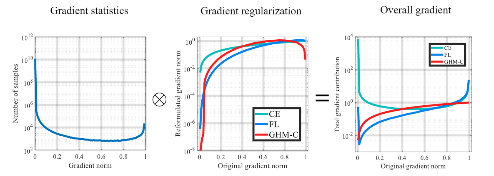

第一幅图中,显示了作者统计的所有样本的梯度范数的，注意纵坐标是对数坐标。梯度范数的就是这个样本在loss function上产生**回传梯度的模值**。不出所料易分样本（左侧Gradient norm很小的样本）的数量比其他都高出了几个数量级，积少成多，简单样本的总梯度共贡献会超过难样本。并且，经过统计还发现，部分特别难的样本（gradient norm右侧，那些在分类中近乎完全错误的样本），也会产生异常的梯度，作者认为这些样本是**outlier**（离群点，标记错误或由于噪声产生的异常值），所以同时也要修正这个问题。

那有什么办法在这种先天不公平的情况下把一碗水端平？只需要选择一个合适的权重，让他们有相同的梯度贡献，那么问题的答案也就呼之欲出了：用该样本的梯度除以**拥有相同梯度样本的数量**，最终得到的统计曲线就如中间的图像所示。那么，我们只需要将原来的样本分布乘以得到的调制系数，便获得了右侧的调制后的梯度。用GHM对比CE和FL，显然GHM在易分样本上有很好的抑制效果，同时对于异常多的难分样本（outlier）也同样有抑制效果。

那么应该如何计算样本的密度分布（也就是拥有相同或类似梯度样本的数量，这可以用一个分布函数来表示，但由于现实世界中的采样是离散的，要进行一些处理）？请看论文原文：[1811.05181 Gradient Harmonized Single-stage Detector (arxiv.org)](https://arxiv.org/abs/1811.05181)。原文中还提出了一种对于bbox回归的梯度均衡化损失函数，并且对梯度密度函数的计算进行了简化和近似，以降低复杂度加快训练速度。

---

##### 5.2.6.5.5. OHEM系列


---

##### 5.2.6.5.6. IOU loss family

在之前训练bbox regression分支的时候，我们只利用了回归得到的角点与GT角点坐标差的模值（若是利用中心点和长宽也类似，用MAE、RMSE、Smooth L1等LF），仔细思考一下就会发现这存在一些问题：实际评价检测效果的时候使用的指标是IOU，但显然我们loss的设计目标和评价指标**不等价**，多个检测框可能有相同的Loss但IOU的差异可以特别大，为了解决这个问题IOU loss就自然而然诞生了。

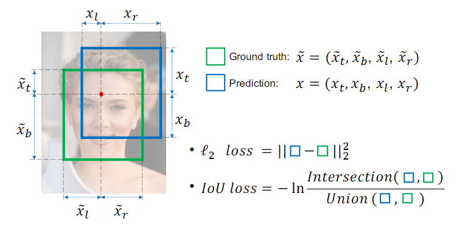

<center>截取自论文原文，这里对比了L2 loss 和IoU loss</center>

IOU loss用IOU来评价bbox回归的好坏，这样就统一了评价指标和训练指标，同时还让bbox regression拥有了**尺度不变性**（原来的距离loss对于不同大小的样本不具有这个特性！）。

欸那有人肯定又会说了，即使IOU相同，回归效果的好坏也会有差啊，不信你看这个：

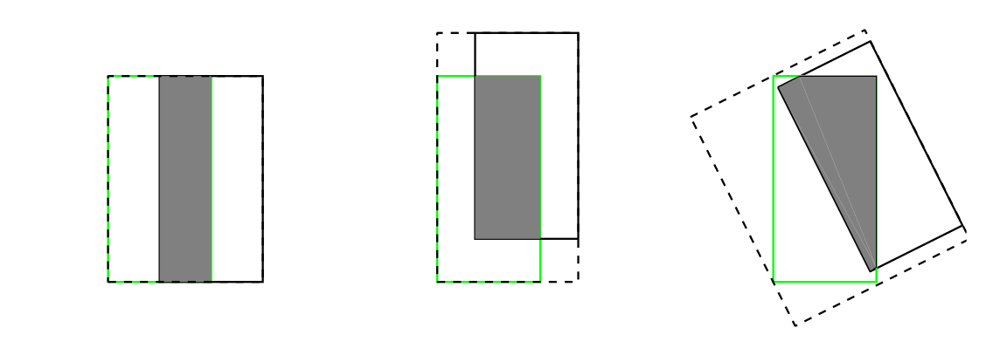

<center>以上三种情况虽然predict和GT的IOU相同，但是他们的回归效果肯定不同</center>

而且在刚开始训练的时候，万一预测的框离GT很远，根本没有产生交集那IOU不就一直是零吗？那么有没有什么办法可以改进IOU loss让他可以区分相同IOU情况下回归效果的好坏并解决预测bbox和GT交集为零时如何训练的问题？GIOU给出了答案。首先找到一个能够包住GT和预测框的最外界矩形Ｃ。然后计算C的面积减去(GT ∪ bbox) 的面积的差与Ｃ的面积的比值，再用GT和bbox的IoU值减去这个比值得到GIoU。

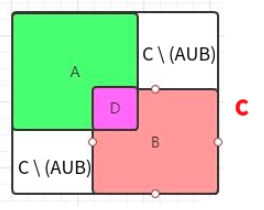

<center>\符号表示集合运算中的减法，定义为C\(A∪B)定义为C中有而AB并集中没有的部分</center>

略加思考你就会发现，GIOU loss会使得IOU尽量大，而C\\(A∪B)尽量的小，那么在bbox和GT尽量对齐的时候，GIOU值会更大，这就在很大程度上解决了前一张图片中出现的无法区分的问题。下面这张图展示了不同情况下L2 损失、IOU loss和GIOU loss的大小：

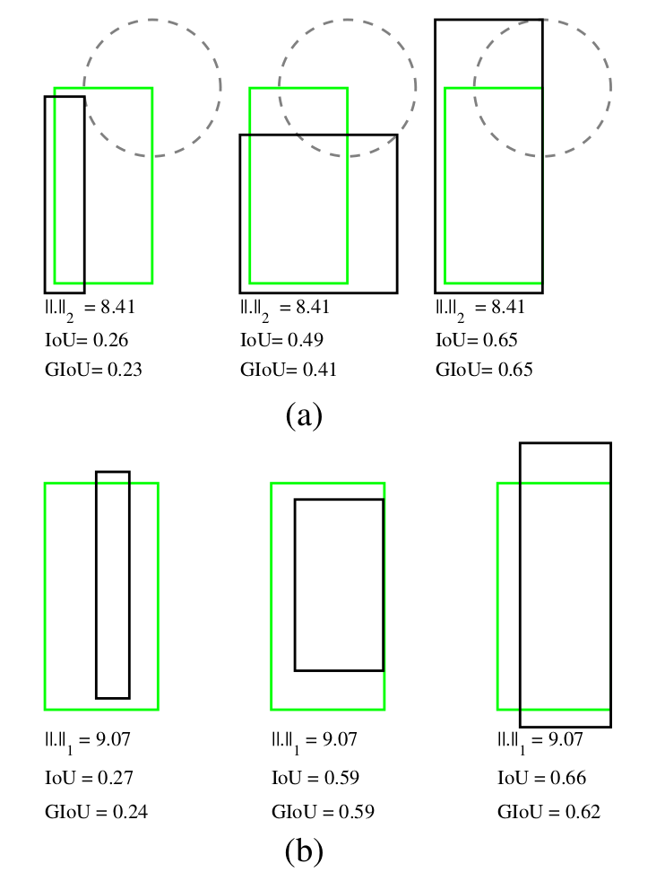

<center>对比下来，GIOU拥有最好的评价效果</center>

既然IOU loss已经在这里开了个大坑，大伙就都在想能不能再这些个loss的基础上再挑挑刺，进一步细化评价标准？还真有，CIOU这不就来了，而且这帮作者还直接一下提了俩，除了CIOU还搞了个DIOU，~~还给不给人活路了,分我也发俩篇撒~~。

论文作者着重考虑了bbox回顾的三个要素：**重叠区域**，**中心点距离**和**长宽比**。从这里入手首先提出DIOU：在IOU loss的基础上添加了一个bbox和GT中心距离的惩罚项，以此为目标进行训练将会逐渐把两个框拉在一起。但是能保证他们对齐程度一定提高吗？CIOU紧随其后，又在DIOU的基础上额外增加了一个bbox的长宽比的约束，让loss能够更快地收敛。对比GIOU，GIOU的损失函数似乎也在做类似的事情，不过它把这两个工作给糅合在了一起而没有在两个方向上分别发力，颇有些”不偏科也没强项“的感觉。CIOU则把中心点距离和长宽比分开考虑，认为他们的作用是正交的，并对两个因素进行专门的优化，从而获得了更好的效果和更快的训练速度。

> 这就像线性代数中的特征值分解/正交分解，把原本糅合在一起的特征或属性在不同的维度/基底上分开考虑，最后再叠加到一起。这也是信号处理的惯用”伎俩“了（fourier、laplace等等）。

同时作者指出在NMS的时候使用DIOU可以获得比简单的IOU更好效果，论文还对GIOU的drawbacks进行了~~鞭尸~~分析，通过实验指出了IOU family前任们的局限性，感兴趣可以戳[ Distance-IoU Loss: Faster and Better Learning for Bounding Box Regression (arxiv.org)](https://arxiv.org/abs/1911.08287)。

---

##### 5.2.6.5.7. GFL

GFL的全称是generalized focal loss，看名字就知道，extend、generalize、complete啊这类的基本都是在原有论文的基础上得到启发进一步得到的结果（~~这说明多看论文就能发paper~~）。

观察IOU family的实现方法，我们发现IOU分支是和分类分支独立的两个分支，特别是使用**解耦head**的结构，训练的时候各玩各。而且前人的ablavation也已经证明**定位框的准确性和分类准确度并没有很大的关联**，因此在训练和预测的时候，两者输出的结果存在一个gap，一个分类置信度很低的bbox却很有可能在IOU分支中获得很高的分数，最后在计算得分的时候将两者相乘就会得到异常的结果。那GFL的解决方法就是，在训练的时候联合两者的表示（representation，定位质量表示框准不准，也就是前述iou family解决的问题，分类表示如one-hot或者softmax的输出，还有用分布来衡量的方法）。

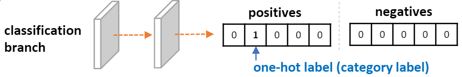

这样，在训练的时候，把原来的one-hot label转换成**分类与质量估计联合**的**连续**label（即one-hot label乘上该预测框和GT的iou作为新的训练标记），将这个label作为分类和质量估计的指导，从而消除训练和推理时的gap（似乎显而易见！但是之前却没有人想到）。

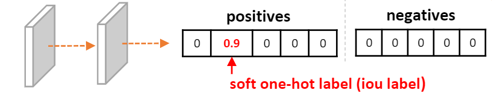

因此对于FL的第一步修改，得到了如下的表达式：

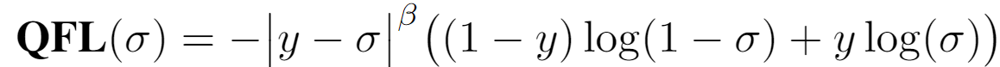

<center>σ就是添加了框质量预测的分类估计值，y是乘上了iou的标签</center>

第二个问题是框的表示，在以往的传统框回归中，实际上是让网络学习一个**狄拉克分布**（冲激函数），即对一个以图像长宽为横纵坐标，框位置为输出的一个函数；也有一些方法尝试为框的回归简历一个高斯分布，即训练目标是得到以训练label为中心的一个尽量集中的高斯分布。GFL的想法则是不去人为指定或设计一个框的分布，而是**让网络自己学习这个任意分布**（颇有一种粒子滤波器的感觉）。

想要得到预测输出，根据概率分布函数的定义，就对整个区间进行积分：

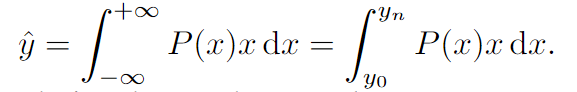

因为图像是一个二维离散平面每一个坐标轴是离散的，所以我们把区间划分成n个小区间，将其离散化：

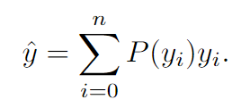

若要回归的更精确,就将区间间隔变得更小,反之增大,极限情况就是一个像素一个区间. 根据概率分布函数的特点，我们希望在积分区间内积分得到1，聪明的你肯定已经想到我们可以用softmax来输出整个离散分布！不过这里还存在一个问题，一个积分值可以对应**无穷种分布函数**，这就会大大降低学习的效率，使得框的分布不能很快地收敛（每个label都大概率会导向不同的分布，虽然他们的总体收敛方向相同，但是中间有很多个step都相互抵消了）。从直观上考虑，下图(3)是比(1)和(2)更好的分布，因此作者对损失函数稍加约束，提高离label最近的两个位置的权重使得分布能够更快的收敛，否则增加的权重可能被放在距离label处更远的地方，如下图（1）。

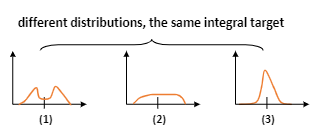

<center>不同中分布积分得到相同值（横轴竖线）</center>

最后得到的DFL（distance focal loss）就是如下的形式：

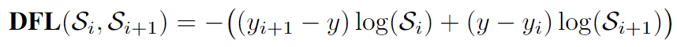

其中yi和yi+1是第i和i+1个位置（这两项看起来和cross entropy也有些相似，其实是在计算预测分布输出和标签的差异），y是标注的Dirac函数（即标注框的位置）Si和Si+1是分布函数在yi和yi+1处的值（也就是前文公式中的P(yi)）。那么每次计算两个位置，若长宽都为100像素则需要计算99+99=198次。

不得不惊叹作者的loss function设计之巧妙，最后还将QFL和DFL进行统一，得到了一个GFL的表达式，有兴趣的同学可以自行参阅原文：[Generalized Focal Loss - arxiv.org](https://arxiv.org/pdf/2006.04388.pdf) 。作者在知乎上也有一篇讲解的文章，戳这里：[大白话 Generalized Focal Loss - 知乎 (zhihu.com)](https://zhuanlan.zhihu.com/p/147691786)

> ***强烈推荐下载原文并且精读***，它对于之前的预测框几种表示的洞察十分深刻，且这篇文章的数学方法并不算难而且对FL和IOU loss 提出的针对性的优化思路**非常清晰明了**，很适合入门后的进阶。随后作者还推出了GFLv2的版本，感兴趣自行搜索阅读。


---


#### 5.2.6.5. 多尺度特征融合

稍作总结后，笔者在这里再介绍一些目标检测领域的trick和改进方法(其实现在已经不新了)，前一部分主要是关于LF的设计，而这一部分主要是关于关于模型的改进的经典方法与训练技巧，还有一些有启发性的机制。

- **多尺度特征融合**

  由于CNN基本构建模块的特点，在最后输出的feature map往往是浓缩了大量的语义信息（“高级的特征”）但分辨率较低、对细节的保留较少，因此对于小目标的检测效果不尽如人意，且模型对检测对象的尺度不变性大部分也只能来自于训练数据。

  SPPNet提出的空间金字塔池化通过对最后一层feature map执行stride大小不同的池化后再进行concatenate，能在一定程度上解决不同尺度物体的检测问题。但是仅仅使用了高级特征（或者说特征其实还是来自同一层），对于不同尺度的融合还是不太好。

  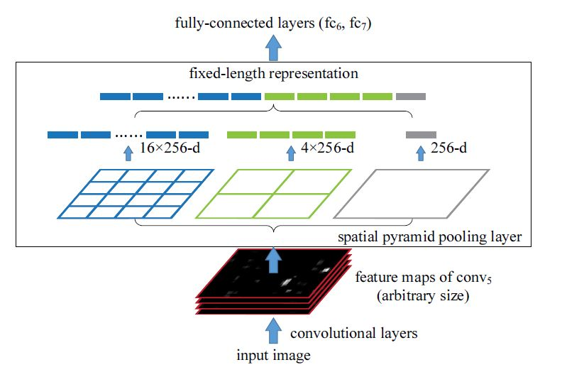

  <center>spp的结构，用不同大小的grid分割后进行max pooling操作，最后concatenate并投入下一层</center>

  SSD首先提出在Backbone的不同层输出进行检测，就是希望能同时利用**不同层次**的信息。但是对于多个feature map的检测也导致了效率的低下，并且低层的feature map能够提供的信息太少而直接检测的计算量又大（分辨率高），虽然对于不同尺度的物体检测能力略有提升，但是速度相对YOLO下降的比较多。

  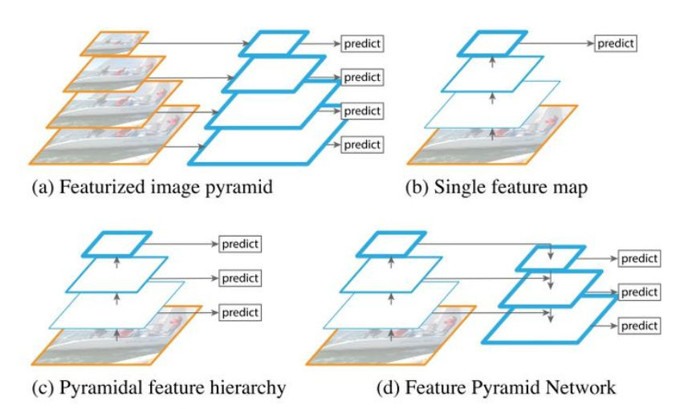

<center>几种检测的方法</center>
<center>(a).传统差分图像金字塔,抽值实现降采样</center>
<center>(b).深度学习经典做法,使用顶层feature map检测</center>
<center>(c).SSD的做法,利用深度网络提取feature并在每一层map上检测</center>
<center>(d).FPN做法,top-down融合并在不同的map上检测</center>


那么很自然的我们就会想到，有没有什么方法可以**综合底层的细节和高层语义信息**，随后利用融合后的信息进行检测，将各种尺度的目标一网打尽？于是便有人提出了特征金字塔网络**Feature Pyramid Netwok**。和以往的图像金子塔不同，FPN的金字塔由深度网络提取的不同层级特征堆叠而成，并在堆叠的基础上通过top-down的element-wise add实现特征的融合，从而实现对不同尺度物体的检测。

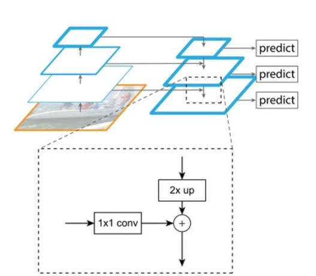

<center>FPN金字塔中的下采样方式，最顶层的特征会经过x2的上采样插值后和底层feature map相加</center>

注意到FPN只有top-down的融合路径，金字塔顶层无法享受到底层的更多细节，那直接添加down-top的融合不就完事了？**PANet**的作者直呼有手就行，提出了这个路径聚合网络用于更充分的特征融合（PANet首先被用在语义分割上，分割其实相当于像素级的分类，因此对于细节的要求更加严苛和敏感，特别是边缘和纹理）。

PANet的整体结构如下，红色虚线表示原始图像经过数十甚至近百层的卷积（即原图经过backbone到最后顶部的feature map）得到的P5已经没有什么细节信息了。那么它相比FPN的不同就是（b）部分的down-top连接将底层细节通过较短的路径融合到上层，即绿色虚线所示的路径（P2->N2->N3->N4->N5)。而这里的Top-down连接通过3x3，stride=1的卷积后再相加来实现而不是简单的element-wise add，**让网络自己去学习如何进行特征融合**（当然如果为了追求速度将卷积换成和FPN中一样的element-wise add也是可以的，或多轻量化网络都是这么做的）。通过绿色虚线路径的特征大概只需要十层不到的conv就能达到N5处，这样的两个部分（top-down和down-top）就很好地解决了利用顶层feature map检测时缺少细节和纹理的问题。

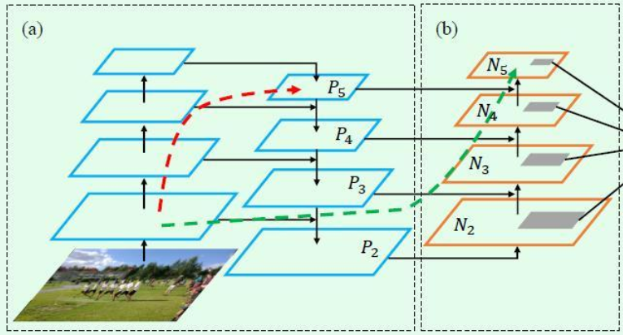

<center>PANet的结构</center>

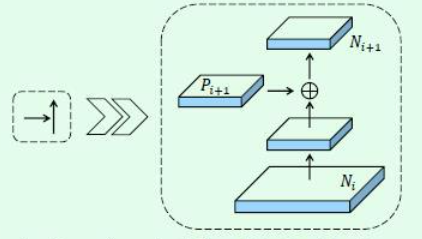

<center>PANet中down-top连接的结构</center>


不过人们对于极致的追求是永不止步的，在进行了大量实验后，EfficientNet将Neck（一般把检测框架中的特征融合/选择部分称作neck）进行了进一步优化，提出了**Bi-FPN**（双向特征金字塔）。

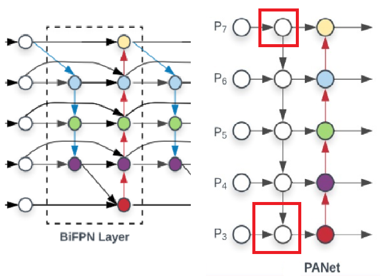

<center>左侧白色单元backbone中不同层次的feature map输出，虚线框内是BiFPN的结构；右侧是PAN的结构</center>

Bi-FPN的总体结构和PAN相同，都是top-down和down-top的排列，我们主要关注他们的不同之处。首先是feature map跨过top-down下采样融合部分直接到bottom-up部分的**远跳连接**，这和ResNet中的结构几乎是一致的， 作用也是相同的，可以分散梯度并防止退化。另一个改变是删除了PANet中红色框的单元直接连接到下一层，作者认为这种单边的连接没有必要添加额外的卷积，因为没有融合的对象，如果进行卷积反而会引入不同层次的特征并增加梯度回传的难度。若有必要，可以通过堆叠Bi-FPN的block实现更多的融合并方便地控制网络规模和深度（g家惯用套路了，比如inception）。

>  还有其他的思路如把接下来要介绍的注意力机制引入特征金字塔中,为不同的连接路径设置不同的可学习权重、通过GAN由高层语义信息还原底层细节（类似超分辨率）等，感兴趣的同学可以自己探索。


---


#### 5.2.6.6. CV中的注意力机制

注意力机制最早被使用在机器翻译（或自然语言处理）上中的Encoder-Decoder模型上，让网络在处理不同部分语句时能够**聚焦**到特定的已经编码的语义向量或输入上。

> 若想要理解上述注意力机制的来源，请学习和NLP和RNN相关的知识：[吴恩达深度学习-序列模型](https://www.bilibili.com/video/BV1F4411y7BA?spm_id_from=333.999.0.0)，这是因为在计算机视觉中的注意力和机器翻译可以从不同角度理解。尤其是自注意力机制，强烈推荐李宏毅老师的讲解：[李宏毅机器学习课程-self attention](https://www.bilibili.com/video/BV1Wv411h7kN?p=23)
>
> ***在阅读空间域的QKV模型时，务必先掌握自注意力模型。***

而在计算机视觉中，我们不大需要用Query/Key/Value的模型来解释，笔者更倾向于使用特征分解这个词，从特征空间的角度解析cv中的注意力机制。用于计算机视觉的注意力机制一般分为三种：通道域、空间域和混合域。其原理是赋予空间中不同通道或区域以不同的权重，而不是像以往一样进行卷积/池化操作时将空间中的**一个位置**（空间中的一个位置，对应所有CxWxH中长度为C的狭长的一列）或**所有通道**视为拥有一样的权重，从而使得网络专注与更重要的信息的提取。

这里会有一个误区，很多同学会认为，网络在训练的时候，只要往正确的方向迭代，不就自然会赋予卷积核中的参数以不同的值，这样难道不会在通道域或空间域产生不同的权重吗？为什么还需要注意力机制？

这里需要特别注意，卷积核上的不同权重参数是**定域**的，即其只能在其**感受野**内形成”小注意力“，虽然随着深度的加深感受野逐渐变大，但是其对于浅层和中层的参数更新也是间接的、微弱的。而注意力机制则会关注所有通道/整个WxH的空间的信息，从而选择最重要的部分。因此，也有”卷积是一种特殊的注意力模块“的说法，这么看来也不无道理。

视觉注意力一般分为三种，即**通道域、空间域和混合域**（前两者都使用）。在分割中还有使用类别注意力（分类特征对于图像分割额外重要），视频分析中也有使用时间注意力来建模目标在时间序列中的关系。

- **通道域**

  通道域注意力的代表作是SENet，其实现思想和过程都非常简单，仅仅加入了一个即插即用的SE模块分支用于建模不同channel之间的相关性就大幅度地提升了模型性能（最后一届ImageNet图像识别的冠军，超过去年冠军25%）。

  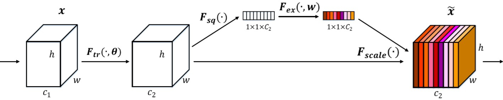

  <center>SENet的结构</center>

  - SE module通过将上图中的c2xhxw的block利用**全局平均池化操作**Fsq（取每一个channel的平均值）得到一个1x1xc2的相关向量，再将其投入一个两层的全连接层Fex后得到一个注意力得分，随后让此得分向量和原feature maps进行简单的标量乘法操作，就得到输出。注意力得分即代表了每个通道的重要性（权重）。由于SE modeul的轻量化设计使得其在几乎没有增加什么运算量的情况下大大提升了网络的性能。

  > 若没有学习过积分变换或信号与系统，可以跳过下面这一段。

  从本节开始谈到的特征空间分解的角度来看通道域的注意力机制，我们可以类比积分变换的思想：多通道卷积相当于把多个二维卷积核堆叠在一起，将他们拆分来看，**每一个二维卷积核其实代表了一种特征空间或像素空间的基**，可以对应傅里叶变换中不同频率的正弦分量（如下图），只不过这些分量的选取不是固定的，同时大概率不是正交的，也几乎不可能是完备的（学过信号与系统的同学可以思考一下这个问题）。那么对于检测一个物体来说，这些在不同特征分量上的**投影**（就是前级feature map经卷积操作产生的不同通道），其重要性也肯定不同。举例来说，如果我们要识别小猫，那么它身上的花纹肯定是一种重要的特征，对应傅里叶变换则应该是一种/多种频率较高的分量（花纹周期性出现），而低频分量就不是我们所关心的。同样对应通道域注意力，虽然我们不知道网络到底学习到了哪些特征（卷积核最终会代表哪一种特征分量），但是不同分量的重要性肯定不是等同的。如SENet这种通道域的注意力，就是让不同通道有不同权重，从而聚焦到那些对于识别特定物体更关键的通道上。

  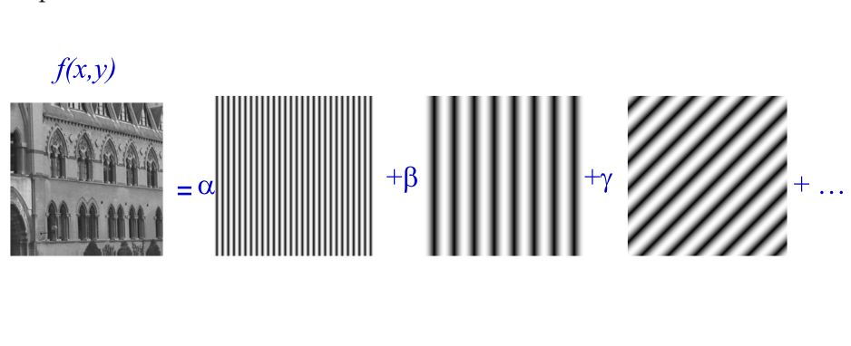

  <center>傅里叶变换将图像变为不同权重的不同分量叠加</center>

  其实在SENet之前，就有paper认为图像中不同频率分量对检测的重要性不同，因此直接对原图进行傅里叶变换，然后将每个分量分别投入不同的网络，最后再用add或multi的方式聚合特征进行检测。其检测效果也还不错，说不定SENet就是借鉴了这类传统方法。

  > 其实已经在可解释性方面的工作尝试发现频域和CNN网络之间的关系，传统图像处理仍然在发挥其优势，想进一步了解相关工作的同学可以参考这篇文章：[频域（DCT,小波变换）与CNN结合](https://zhuanlan.zhihu.com/p/342991714)，这需要一些信号处理的数学知识。

  - 由于SENet仅仅利用简单的global average pooling和两层perceptron建模了不同通道的重要性，对于容量大的网络肯定是不够的。因此，后续作者又对其进行了改进得到SKNet（Selective Kernel，如下图），字如其名，这是一种能够**自己选择合适大小的卷积核**的网络。作者通过实验发现卷积核的结构和待检测物体的尺度有一定的关联，因此希望利用SK module让网络建模这种关联。

    有人会说啊，google的Inception不是已经做到了让网络自适应选择卷积核了嘛，我们要注意的是虽然Inception同时并行使用了1x1，3x3和5x5的卷积，但是在concatenate之后，这些通道之间的重要性是等同的，而且卷积核的参数在训练结束后也是静态的。

  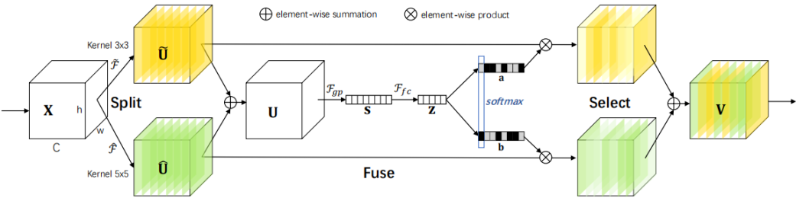

  <center>sknet结构</center>

  上图中U~和U^分别是经过不同大小卷积核卷积后得到的feature maps，直接按元素相加得到U，随后进行global average pooling和fc（还是SENet的味道），再投入softmax得到注意力得分a、b分别和U~，U^对应通道相乘，选出在对应尺寸卷积核下最重要的通道，最后将上述结果进行按元素相加得到输出V。

  ---

- **空间域/混合域**

  空间域的注意力相对比较直观，人类的视觉系统就有这种聚焦与视野内某个区域的特点，帮助我们快速捕捉最重要的信息。在下图里，我们肯定不会去观察海报的白色部分，因为那里没有任何有意义的信息。

  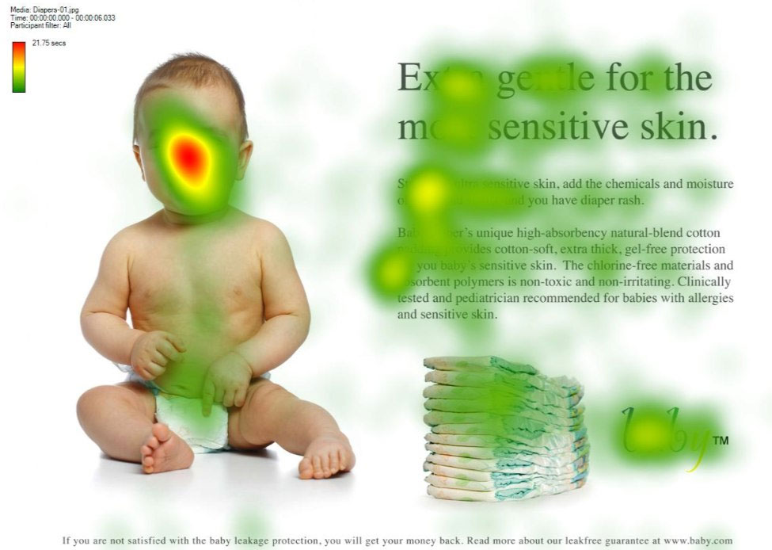

  <center>阅读海报时人类感知系统的注意力分布</center>

  - 经过这么长时间的熏陶，相信你应该已经想到如何构建一个空间注意力模块了：先利用池化或卷积从前层的feature maps中提取一个用于生成注意力分数的相关向量，紧接着将此它投入一个轻量化的fc层或conv层，得到注意力分数后和原feature maps相乘即可。不过需要注意的是，空间注意力需要为大小为WxH中的每个点都分配一个权重，因此生成的是一个注意力分数的矩阵。

    很好！我们已经有了建空间中不同点间相关性的方法，这其实也是**CBAM**（Convolutional block attention module）的做法。CBAM是SENet的改进，在原有的通道注意力基础上增加了空间注意力模块，它其实是一种混合域的做法，只不过我们在这里介绍它的SAM模块以引入空间域。

  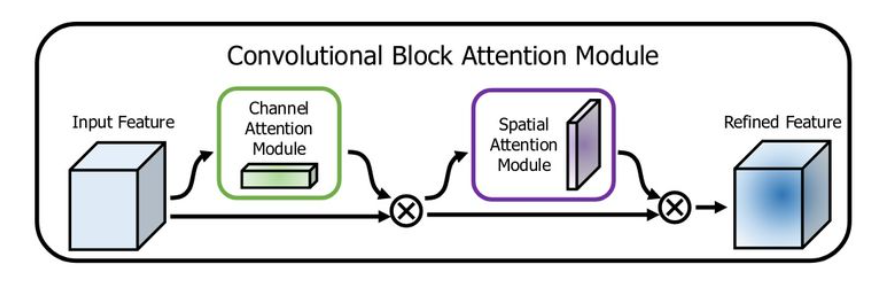

  <center>绿色的是通道注意力模块，实现和SENet基本相同</center>

  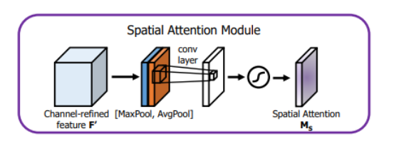

  <center>SAM结构，同时使用最大池化和平均池化提取用于注意力的feature map</center>

  - 而空间域注意力还有另一种结构，是继承自NLP中的**QKV自注意力模型**的：利用原feature maps分别生成Query、Key、Value三个矩阵，然后Q*K得到不同像素的相关性，最后把相关性矩阵和V相乘得到输出。由于直接计算了每个像素之间的关联，所以一般认为其对空间中不同部分特征相关性的建模能力更强。None-local NN是第一个将这种机制引入cv的，在此领域的代表作还有DA-Net，相当于是CBAM的自注意力版，有兴趣的同学可以阅读一下原文：[Dual Attention Network for Scene Segmentation](https://arxiv.org/pdf/1809.02983.pdf).

  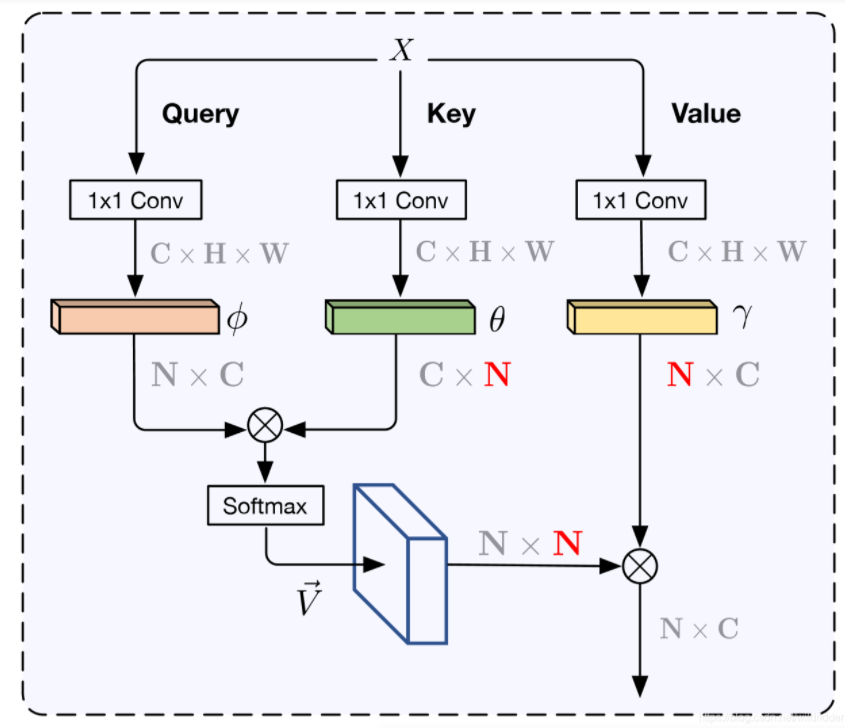

  <center>自注意力的Spatial Attention的结构，其中N=WxH</center>

  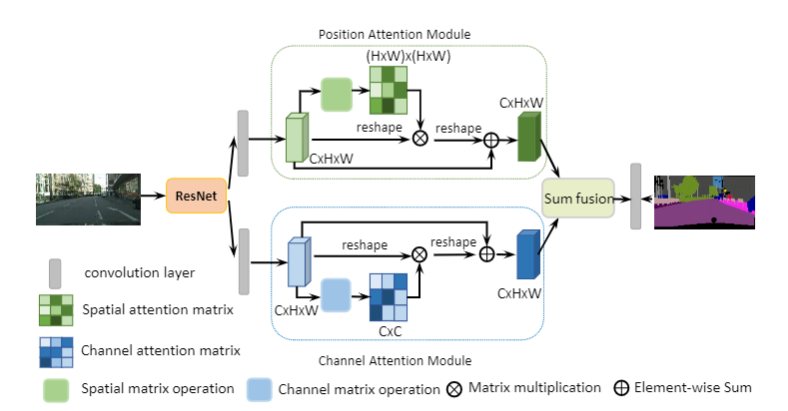

  <center>DA-Net的结构，通过并行的SA和CA模块建模相关性</center>

  - 但是它们都存在一个比较大的问题：巨大的时间开销。源自计算像素之间相关性的矩阵乘法（Q\*K）时间复杂度至少是O（W^2*H^2），这对于实时性是不可接受的。于是就出现了ANN、CCNet和GCnet。

    ANN（Asymmetric Non-local Neural Network）的思想很简单，一个局部区域内的像素或提取出来的特征和另外一个区域的相关性，应该是比较相近的，除了非常精细的边缘，总不可能每隔一个像素相关性就发生巨大的变化吧？并且检测比分割对于边缘的要求更低。因此它对Key和value矩阵进行了下采样的操作，实际上采用的就是**局部线性化**的思想：在feature map上选取稀疏的采样点（锚点），利用这些点替代周围的像素。

  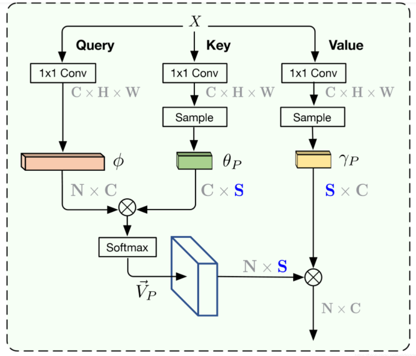

  <center>ANN的思想：Key和Value分别通过采样缩小尺寸，使得时间复杂度获得较为可观的减小</center>

  线性化的具体的操作就是利用**SPP**生成θP和γP(最大池化和平均池化均可，或两者都使用让网络自己学习合适的权重)，SPP产生的不同层次特征还有助于多尺度分割和检测。根据上图的结构，作者提出了AFNB和APNB两个模块。APNB**共享**了Key和Value的参数（类似检测头的参数共享），尽可能在不降低建模能力的情况下减少参数量。而AFNB则是继承了APNB的思想，我们从上图中可以看出θP和γP只要分别保证一个维度为C，S的大小是可以根据锚点的数量而变化的，只需要**保持对齐**即可（取点多则S大，反之少）。既然这样，用于生成QKV的输入也不一定要从同一层feature map中产生，即下图中AFNB模块中的Xh和Xl分别来自不同backbone中的不同层，只需要让生成的θP和γP拥有和Query匹配的维度即可。作者通过实验验证这种做法可以更好地融合不同尺度的特征，因此让backbone的后两个stage分别作为AFNB的输入。

  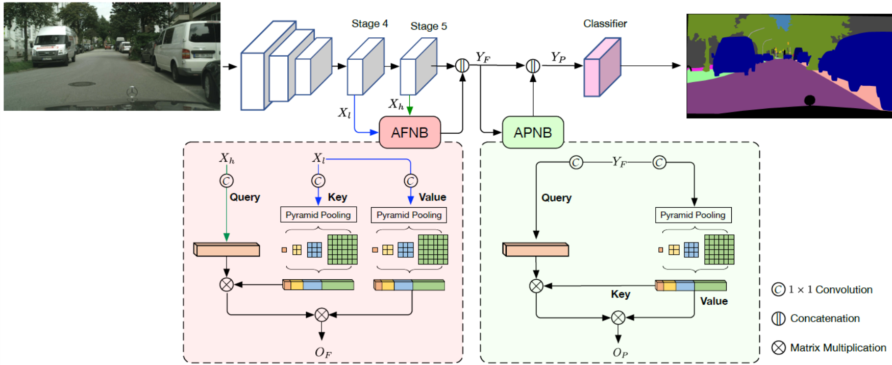

  <center>ANN的架构</center>

  从另一个角度理解，也可以将APNB视作Xh和Xl都来自同一个stage的并共享了Key和Value参数的例子。

  

  - 虽然ANN已经在极大地降低了相关矩阵和注意力分布计算的开销，但是毕竟还是多项式级别的复杂度，有没有什么办法可以进一步减小注意力模块的规模？**GCNet**（global context）的作者通过实验发现，在backbone的后几个stage，将其feature map上任意一个位置的像素作为query，生成的注意力分布图非常相似，也就是说这种non-local的注意力模块学习到了**位置无关**的注意力分布。下图是对注意力的可视化结果，蓝->黄->红表示“聚焦程度”。

    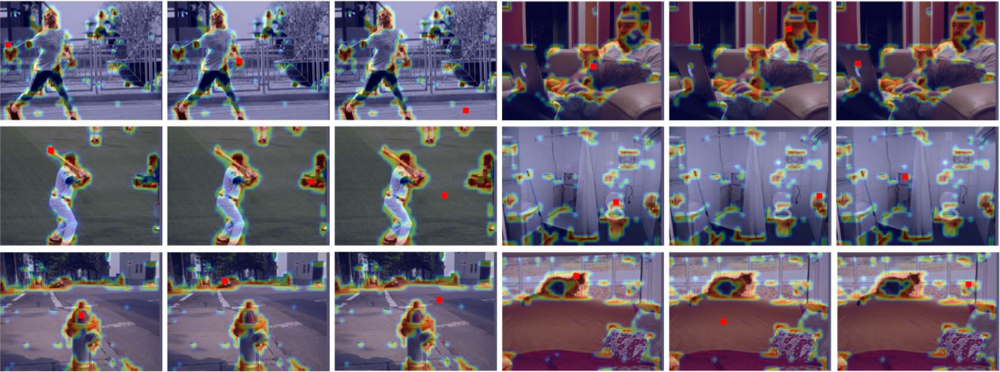

    <center>作者从coco上随机选取了6张图片，发现Non-Local模块对于不同的query point生成了几乎相同的注意力分布</center>

    这里需要特别注意的是，某点注意力分数越高表示该点和query的相关程度越高。这也就是说，**图像上的任意不同点，对于另外一点计算相关性，他们得到的结果是大体相同的**（听起来似乎有些匪夷所思！不过注意这是在backbone的后几个stage，由于卷积的感受野越来越大，feature map上不同点之间的关联也应该随着网络深度的加深而变大）。作者在原文还计算了经过注意力权重加和后的特征向量之间的各种度量距离，发现他们的差距都很小。

    那么结果很明显了，原来要计算WxH个注意力分布，现在我们从输入上随机选一个query point（或者说不需要query了）来计算它和其他像素的相关性，然后把这个注意力分布应用到其他所有位置即可：

    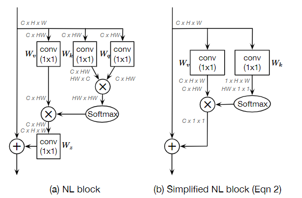

    <center>（b）为简化版本，直接丢弃了Wq矩阵，从计算上来看相当于不关心到底选取了哪一个位置作为query</center>

    这时候输出可以写为：

    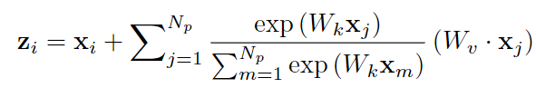

    其中zi为第i个位置的输出，Np=HxW，xi为第i个位置的值，xj为其他位置的值，Σ后的是softmax操作，为了让总得分和为1。如果把Wv提取到求和前面（利用交换律），复杂度可以继续降低：

    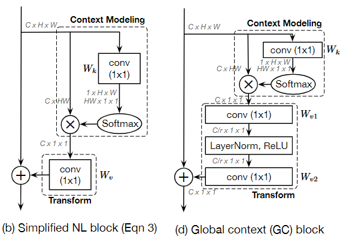

    <center>（b）为简化版本，（d）又加入了通道注意力</center>

    对边之前的版本，Wv的1x1卷积复杂度从原来的O(C^2HW)变成了现在的O(C^2)。作者又在上图中（b）的基础上加入通道注意力（使用降维的1x1卷积 [ **bottle neck**,熟悉inception的同学应该知道这个操作，用于降低参数量 ] 并使用layer normal，ization进一步简化原本的SE模块），得到了最终的GC block，如上图(d)所示。因此GCnet也属于混合域的注意力模型。

    关于位置无关的注意力分布和模型简化、加入通道注意力与ablation还有更多的细节，若感兴趣可以参阅原文：[GCnet](https://arxiv.org/abs/1904.11492)

    

  - 最后一个有趣的很有创意的空间注意力网络是**CCnet**（Criss-Cross Attention [criss : 纵横交错的] ）。CCnet聚焦于相关矩阵计算时的高复杂度，提出的模块结构如下：

    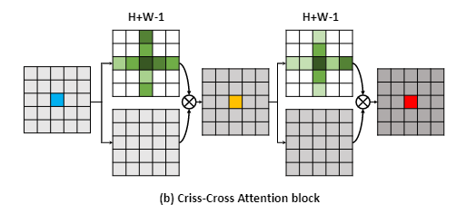

    <center>一个交叉注意力block需要使用两次基本的交叉注意力module</center>

    criss-cross module在计算不同位置相关性的时候只考虑和当前query处于同一行和同一列的像素，单次计算的复杂度变为（H+W）*HW，紧接着还是和V矩阵进行element-wise multiply得到输出。随后再一次进入另一个cc module得到最终结果。

    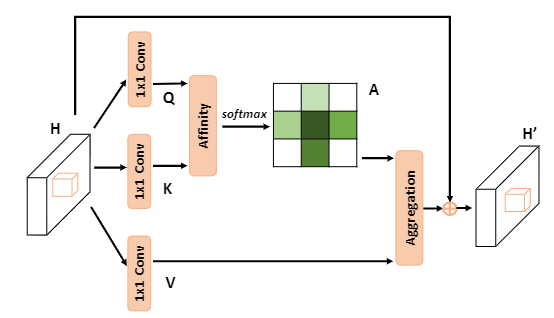

    <center>criss-cross module的结构，总体和non-local自注意力相同</center>

    聪明的你应该已经想到，使用两次计算就可以间接接触到全局的信息了！第一次相关性计算会将当前像素的信息传递到同行同列的所有位置，第二次计算时之前接受到信息的每个像素又会将再次将信息传递到自己的同行同列。更为形象的例子就是，**象棋中的“车”在经过两次移动可以到达棋盘上的任意位置**（在没有遮挡的情况下）。

    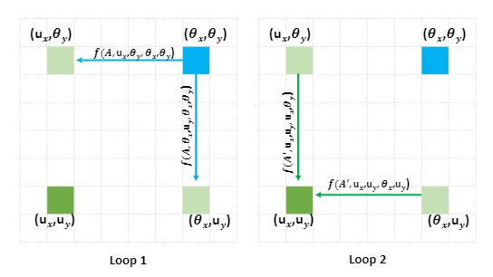

    <center>不在同一行的两个像素经过两次注意力计算产生关联</center>

    

---


#### 5.2.6.7. Anchor-Free模型崛起

我们在学习Faster R-CNN的时候第一次遇到anchor的概念，它利用anchor匹配正负样本，从而**缩小搜索空间**，更准确、简单地进行梯度回传，训练网络。但是anchor也会对网络的性能带来影响，如巡训练匹配时较高的开销、有许多超参数需要人为尝试调节等。而anchor-free模型则摒弃或是绕开了锚的概念，用更加精简的方式来确定正负样本，同时达到甚至超越了两阶段anchor-based的模型精度，并拥有更快的速度。这也让one-stage和two-stage的边缘更加模糊。接下来就让我们介绍几个非常经典的anchor-free模型：

- **FCOS**

  FCOS的全称是fully convulsion one-stage object detector。全卷积网络常用在目标分割任务，最早由FCN引入检测领域。FCOS匹配正负样本的方法别具一格，它直接将backbone输出的feature map上的每一个像素当作预测起点（当然输出的feature map和原图有一个映射的对应关系，本质上并没有将图像上的每一个点当成参考点，而是类似yolo，散布了一组格点），**即把每一个位置都当作训练样本，只要该位置落入某一个GT框，就将其当作正样本进行训练**。同时为了让一个目标不在多个feature map上被重复输出（推理时），FCOS人为限制了每一层回归目标的尺度大小，超过该限制的目标，这一层就不检测。

  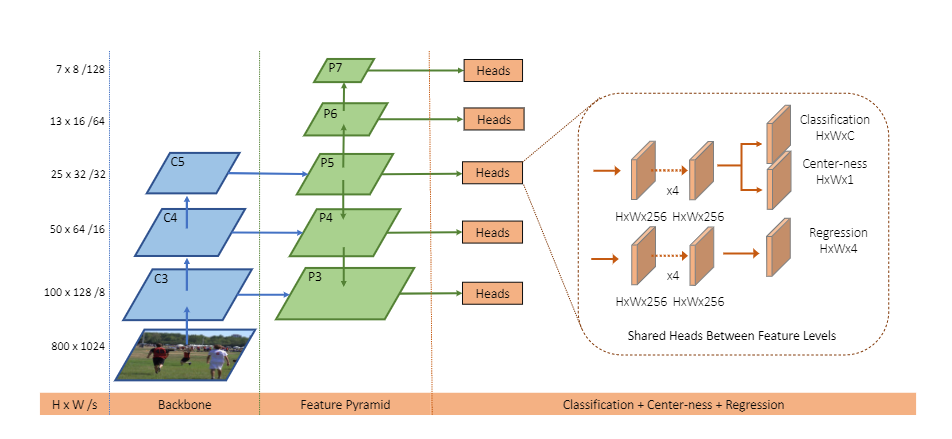

  <center>FCOS的结构</center>

  为了删去低质量的预测框，FCOS还在检测头增加另一个**中心度**分支，保证回归框的中心和GT较为接近。同时和FPN结合，在每一层上只回归特定大小的目标，从而将不同尺度的目标分配到对应层级上。

  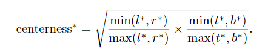

  <center>centerness的计算公式，设置中心度阈值从而保证生成的预测框中心接近GT</center>

  可以发现，虽然不再显式的使用anchor对正负样本进行匹配，但是仍然加入了一些预定规则来给参考点分配标签，之前的anchor是**anchor box**，在某种程度上我们可以将FCOS中的回归位置看作是**anchor point**，或者**步长和边长相等**的一组正方形anchor box。

  

- **CenterNet**

  CenterNet比FCOS更近一步，其论文的名字就叫做Object as points：**将目标看作点**。它直接在BackBone后接Conv层，输出一个代表物体中心点的Heatmap，在预测时取该Heatmp的topk作为可能的物体中心，再进入接下来的回归和分类分支，回归分支输出的是预测框相对于中心的offsets（width、height两个值或left、right、bottom、top四个值）。

  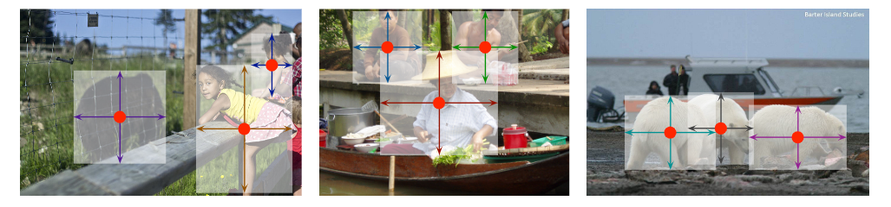

  <center>CenterNet的预测示意图</center>

  其匹配正负样本的方法自然和预测一样，取GT的中点作为正样本。不过仅仅去中点一个点那是在是太少了，网络可能都不会收敛或是被负样本的梯度淹没。因此以GT中点为Gaussian中心，生成一个“**正样本分布**”，在此分布范围内的points都会得到正样本的监督信号，只不过离中点越近，one-hot label的值越大（就是将GT的标签乘上一个gaussian权重，也可以看作距离衰减因子）。

  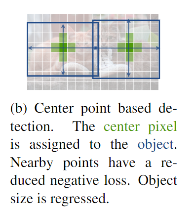

  <center>来自论文原文，GT中点附近会有一个衰减的惩罚，从而间接地增加正样本数量</center>

  虽然CenterNet的论文提到这是一个真正无anchor的网络，然而，我们鸡蛋里挑骨头看看，生成的中心点heatmap在位置上其实和原图也有对应关系，和FCOS一样是原图上的密集网格（网格密度由center heatmap的大小决定）。

  

- **CornerNet**

  CornerNet和CenterNet有异曲同工之妙，两兄弟的论文题目也稍稍互动了一下，这篇叫：Objects as paired points。

  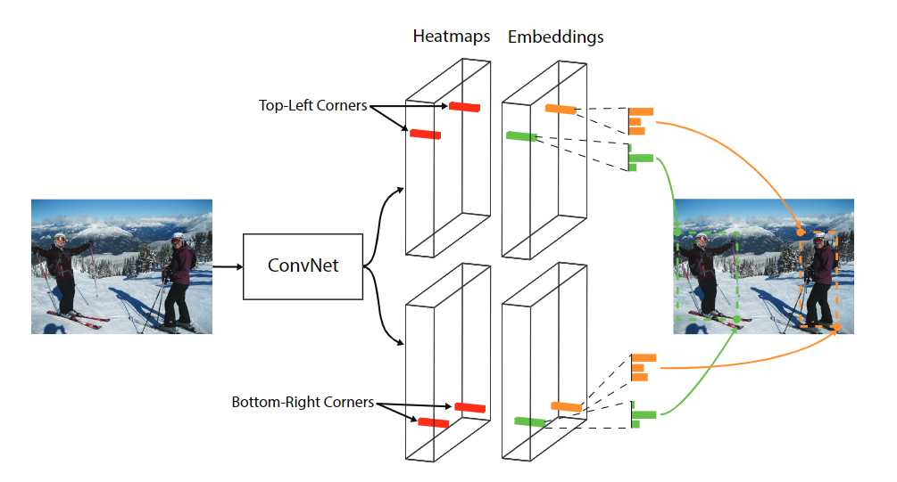

  <center>CornerNet的pipline，通过预测top-left和bottom-right角点得到检测框</center>

  CornerNet通过预测物体的左上和右下角点的heatmap得到预测框。这里其实有两种方式，一种是只预测检测框，不管里面是社么物体，随后再在每一个检测框上运行分类网络；另一种则是直接为每个分类预测左上和右下两组heatmap，直接得到类别和定位，这也是CornerNet的做法（~~说不定你用第一种方法试试，也能发篇paper~~）

  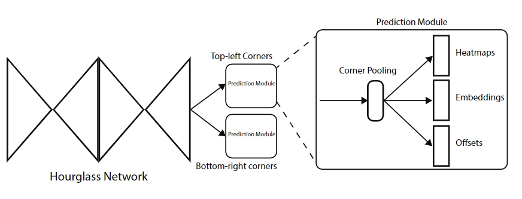

  <center>CornerNet的架构</center>

  CornerNet使用Hourglass作为backbone（是一个常用于姿态估计和关键点检测的backbone），在其后接上两组角点的预测分支，其中每一个分支内又分为三个分支，分别是角点heatmap、角点embedding和角点offset分支。

  前述cornerNet为**每一个类别预测两组heatmap**，因此总共需要预测c组热图，开销还是比较大的。论文还提出了一种用于聚合特征的CornerPooling：

  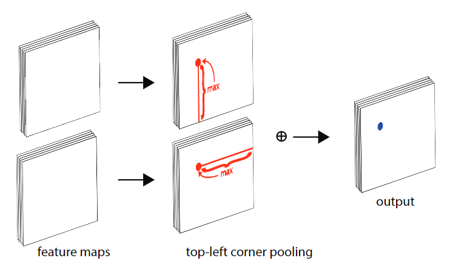

  <center>Corner Pooling的示意图</center>

  corner pooling将会对topleft角点的同一列的下方和同一行的右侧进行channel-wise的max pooling操作，对于bottom-right角点则是同列上方和同行左侧。从直觉上理解，一个物体的外接矩形必然在边框上和物体有相接的地方，从这些地方提取出的特征就能被Corner Pooling很好地捕捉到：

  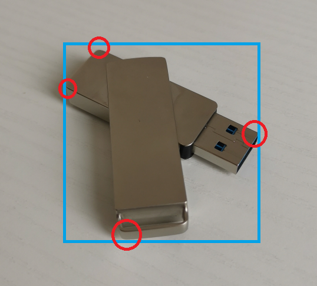

  字如其名，角点embedding将计算**每个角点的嵌入**，以得到最小距离为目标进行训练就能匹配成对的左上和右下角点。

  offsets则输出角点的**偏移量**，用于获取更精确的定位（heamap的分辨率没有原图高，因此需要offset分支来修正角点位置，可以看作一种插值手段）。

  

- **ExtremeNet**

  ExtremeNet师从前两个检测网络，同样是通过**预测特征极值点**的方式来检测物体。通过预测五组极值点的heatmap并使用center grouping的方式将这些极值点分组从而形成检测框。下面这张图阐释了ExtremeNet的检测思路：

  

  <center>也可以称这些极值点为极大的边缘响应</center>

  ExtremeNet匹配四个极值点一组的方法是**暴力搜索**（复杂度为O(n^4)，原文提到有方法可以将复杂度降低到O(n^2)，其中n为生成的heatmap的WxH），取每个heatmap的topk，四个一组进行遍历组合，若这一组极值点生成的检测框的中心附近恰好对应着预测的center heatmap上的一个极值点，就把他们作为一个检测目标输出。

  整个网络的架构如下图所示，同样使用了特征点检测常用的backbone hourglass：

  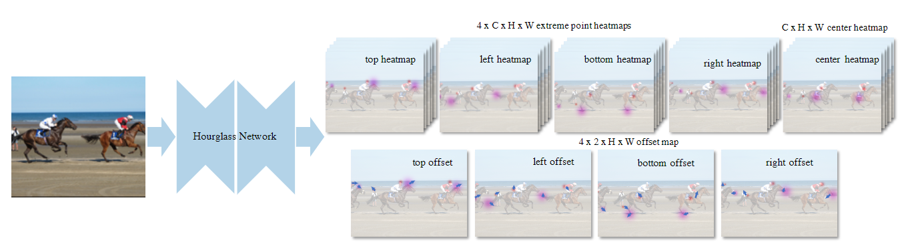

  在骨干网路后紧跟着9个分支，分别检测上下左右和他们对应的修正偏移量，以及物体中心的heatmap。可想而知，这个检测网络的速度不会太快。由于物体的外界矩形边界上可能存在多个极值点，或者这一条边恰好和物体的一条边重合，那极值点就可能会出现连成一条线的情况，因此论文中提出了一种**Edge aggregation**的方法。其实和soft-NMS差不多（NMS则是直接去除分数不是最高的检测框），又和CornerNet的corner pooling有相似之处，它会对每一行列都进行aggregation，若一个极值点附近有其他极值点，直接降低其附近极值点的score。当然，你也可以在检测框生成以后进行NMS，两者的开销比较如何，需要自己计算一下。

  和前面两个网络一样，训练的时候用L1 smooth来作为损失函数计算预测框的损失即可。

  经过一些修改，这个网路可以比较轻松地扩展到分割任务上，方法就是多预测几个极值点，然后用这些点连接成地多边形来近似一个分割mask,以下不同颜色的多边形是用于分割的结果，白色半透明的bbox是外接检测框：

  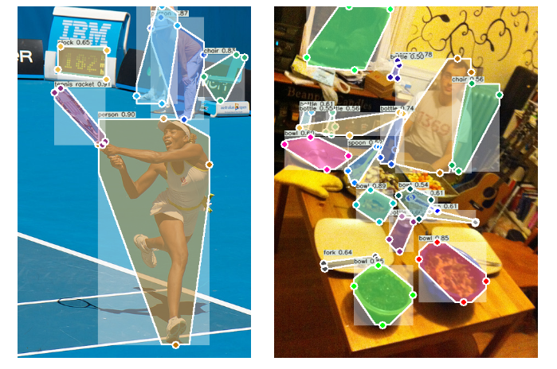

  那么这回，你觉得ExtremeNet是否是真正的anchor-free？似乎它也只是换了一种方式回归bbox，却巧妙地避开了anchor匹配的问题，其实换一种思路，生成四个角点的heatmap然后匹配bbox，这不就是最常见的anchor-based方法嘛。

  

- **FSAF**

  FSAF（feature select anchor-free ）则是的思想也非常的巧妙，可以看作是一个anchor-free和anchor-based网络的结合，其整体架构如下：

  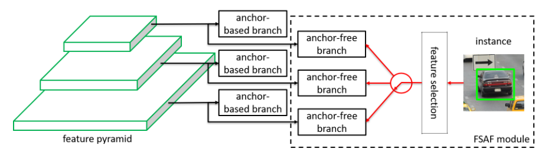

  <center>图中省略了backbone，原文选用的是ResNet-50</center>

  之前的FPN的每一层输出都会接到一个检测头上，常规的检测头都有两个分支：分类和回归。传统的网络为GT选择特征层对进行回归的方法是根据GT box的大小，大目标会被分配到高层，小目标则分配到底层，“大”和“小”的定义都是需要**人为设定的超参数**，人为设计的规则一定是最好的吗？要怎么样分配最合适的特征层去检测对应的目标？

  基于这个问题，在训练时，FSAF让FPN中输出的不同特征层上的anchor-free分支先进行检测，然后输出得到loss，再使用loss最小的那个特征层的anchor-based分支进行回归和分类。这样就做到了**自适应的尺度大小分配**。

  

- **ATSS**

  这个方法的全称是Adaptive training sample selection，基本可以说是一统anchor江湖的天下，人家直接通过严密的消融实验告诉你，anchor不anchor无所谓，**关键是怎么分配正负样本**并采用最好的特征图检测目标！前者也就是后来所说的**标签分配问题**。

  原文对比了两个one-stage检测器，分别是上面介绍的FCOS（anchor-free）和RetinaNet（anchor-based，focal loss），通过控制变量法在MS COCO上验证，得出了不论从从**reference point**（FCOS）还是**anchor box**（RetinaNet）开始检测和回归，产生的差异都不大的结论。

  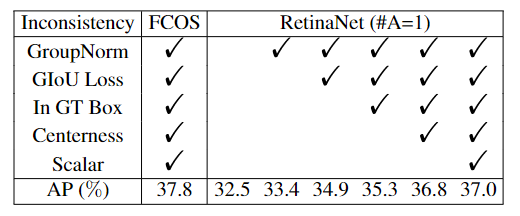

  <center>RetinaNet在把FCOS用到的buff都叠完了以后，就只有0.8AP的差距了</center>

  他们的差异只在于**如何定义正负样本**：FCOS把落入GT内的参考点都当作正样本并限制不同层回归最大目标的尺度，而RetinaNet还是采用的IOU方法：

  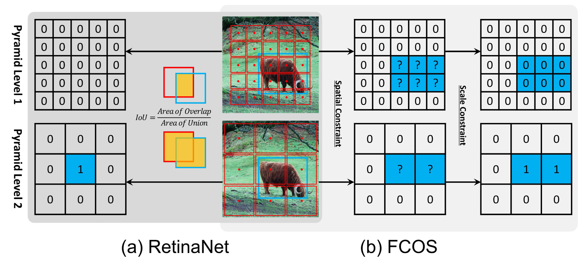

  <center>两者确定正样本的方法的图示</center>

  对于（a），FPN2上布置的一个anchor和GT有**最大的IOU**因此选择pyramid level2上中心位置的anchor作为正样本；对于（b），每一层上都有数个点（grid）落入GT中，但是FCOS对每一层检测的目标尺度大小有限制，level 1超出了尺寸限制故最终选择Pyramid level 2 来学习此GT。

  

  <center>RetinaNet从anchor box开始回归，预测值是四个offsets；FCOS从点开始回归，预测的是点到四边的距离</center>

  因此，作者认为定义更合适的正负样本，如何让对应的拥有最好特征的特征层后接的检测头进行其检测才是问题所在。

  前述的FSAF在一定程度上解决了不同尺度目标检测的问题，但是同层的不同的anchor box的长宽比和大小、数量全部是需要设置的超参数，即使用聚类、差分进化或dynamic anchor，也只是尽量取平均值，不能达到最好的效果。

  在经过了前面一大段的铺垫后，作者提出自适应的样本选择方法ATSS，对于每个GT，在FPN的**每一层**上选择距离GT中心距离最小topk个anchor boxes（有几层就有几\*k个，而且前面的实验已经得出了anchor不anchor无所谓作者为了方便说明就沿用了anchor的概念）。计算这些anchors与GT的IOU**均值 μ** 和 **标准差 σ**，然后选定那些和GT的IOU**大于 μ+σ 的anchor**（高子里面再拔高子！）作为正样本（同时保证这些点是在GT框内的），剩下的都是负样本。如果一个anchor在上述计算下被划入多个GT，就选择IOU最高的那个。

  通过这种方法，就不用设置各种超参数，唯一的参数就是topk的k。经过实验确定，在大于7的情况下也是鲁棒的（用大数定律就能很好地解释，太小的值不能反映其分布特性）。对于不同的anchor大小（其实也就是分割网格的大小），经过实验验证也是稳定的，而且发现即使使用多组不同形状和大小的anchor对于回归和分类也没有帮助。

  都说这篇文章的ablation做的特别扎实，行文流畅条理清晰，颇有终结anchor之争的意味。强烈推荐阅读：[ Bridging the Gap Between Anchor-based and Anchor-free Detection via Adaptive Training Sample Selection (arxiv.org)](https://arxiv.org/abs/1912.02424)

  

---


#### 5.2.6.8. ViT（Vision Transformer）

Transformer是NLP领域的基础架构，也即是前述的自注意力机制加上Encoder-Decorder的结构，这相当于CV领域的CNN架构。这里我们不会从最原始的ViT开始，而是直接介绍FAIR退出的**DERT**模型和其改进版的可形变注意力版本，因为这是在公开数据集上基于transformer的模型第一次拥有了获得超过CNN-based的模型的表现。

不过由于自注意力模块的架构不同于CNN，这导致基本无法使用现有的硬件(如google的npu和nvidia的nn-core与部分cuda-core)和软件（针对3x3conv优化的**winograd**加速算法）对其性能进行优化。而且拥有相同精度的transformer模型的**参数量和计算量往往远超CNN**，因此目前对于我们而言，很难将其部署在边缘平台上，在RoboMaster中也没有太大的舞台，故这里对ViT只是进行尽量完整的介绍以便读者能够了解学术界的前沿。

> 请注意，学习ViT需要一些auto-encoder和自注意力模块的基本知识，这在之前介绍vision attention机制的时候已经提到这一点，有了前述基础，相信你理解ViT也并不会遇到太多的困难，我们可以将vision transformer看作将所有的CNN都替换为自注意力，卷积是一种特殊的自注意力操作（局部），而自注意力又可以看成广义的卷积（kernel和padding都等于图像大小的卷积，并且使用循环padding，即将图像复制并平铺在原图的四周）。

> 笔者的另一篇文章详细介绍了**transformer模型**（也就是增强的自注意力）：[]()，还有一篇介绍auto Encoder-Decoder模型的总览性的文章：[]()

- **DETR**（**DE**tection **TR**sformer）

  DETR是facebook AI research lab（现在已经叫MetaAI了）发布的一个**端到端**的检测器，它将目标检测作为一个集合预测的问题，因为它限定了transformer的输出个数和Decoder的输入。端到端的设计使DETR也实现了真正的**nms-free**，它只会输出限定数量的预测框和其对应的类别。

  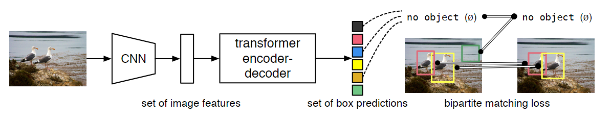

  <center>DETR的检测pipeline</center>

  DETR没有太过极端（同时也是为了减小运算量），它仍然采用CNN作为backbone提取特征，之后将其输出序列化并加上位置编码，投入标准的transformer encoder-decoder架构中，最后输出100个prediction box和class（固定100个输出，若途中没有那么多目标就输出no object，即空集）。在CNN之后的结构和最早的ViT并没有什么不同，关键是DETR优化了损失函数和正样本匹配方法，将正样本和预测框进行**全局二分匹配**以找到最优的标签分配，从而实现上述的端到端方法。

  我们直接顺着pipeline，按照结构顺序来分析DETR：

  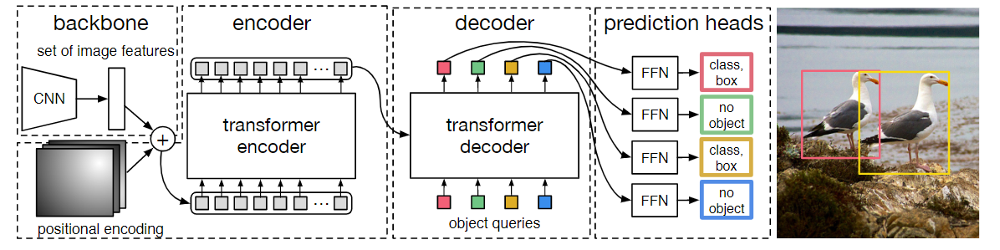

  <center>DETR的结构和数据流</center>

  1. 首先是backbone部分，文中提到采用了传统的卷网络但也没有说具体是用的哪一个网络，具体可以看看它的[代码](https://github.com/facebookresearch/detr)。同时我们需要为生成的feature map添加**位置编码**，因为自注意力计算是位置无关的，导致无法充分利用位置关系，故为每个位置添加位置编码使得transfomer捕捉到这种信息。关于位置编码原文也给出了参考文献和使用不同位置编码得到效果的ablation，将其看作为每个位置的feature map附上其坐标信息即可（可以是element-wise add、scalar mutiply或者concatenate）。

     加上了位置编码之后我们就可以把图片拆分成一个个小块（把三维的dxWxH的feature map变成一维的即序列化，因为feature map上的一个像素对应着原图的一块区域，所以这里说是原图上的一个块，一般称为**patch**），投入transformer中。

  2. 这里使用的transformer结构如下图所示，Encoder中堆叠数个多头自注意力、前向网络和跳连接+归一化组成的基本结构，然后选择一些层的输出作为**Query**和**Key**添加到Decoder的输入中（这些mutil-head attention的输入并没有**特定的要求**，可以是任意打乱顺序的层，类似于FPN中的多尺度特征连接，融合不同尺度的特征）。

     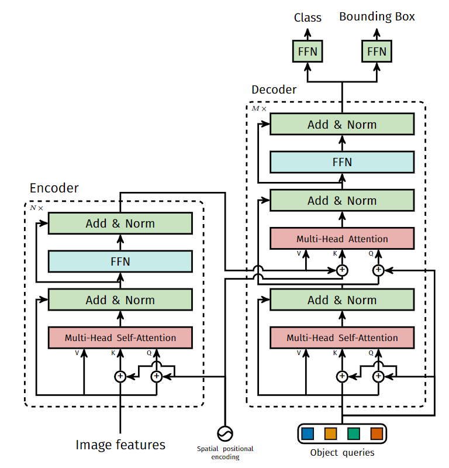

     <center>DETR中的transformer结构</center>

     Decoder不同于Encoder的就是上述的Mutil-Head Attention结构，不仅会用到前层输入还会使用Encoder的中间层或末层输出。同时最重要的是Decoder的第一层输入是一个**可学习**的Obejct Queries，他和FFN、自注意力中的QKV权重一样会随着网络的训练而改变。它在Transformer架构中的地位，相当于CNN架构中的**anchor**，并且这是一个动态的、可变的自适应anchor，只不过换了一种形式出现而已。经过学习后，object queries中的每一个单元都会对应到一些特定的目标，论文也给出了预测框中的top 20（限定transformer的decoder输出100个检测结果）的可视化图表。其在MS COCO上检测的结果显示，每一个slot（可以看成是一个object querie的单元，或是预测集合中的一个元素）都会对应到一些**特定大小**和**比例**的目标，这就和anchor非常非常类似了。

     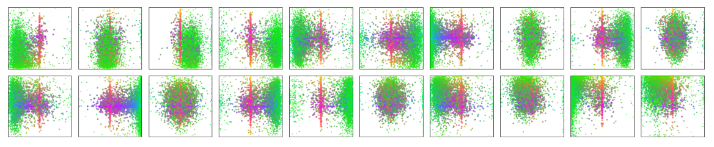

     <center>预测可视化结果，每个结果由一个点表示一个检测框。其中绿色代表小目标，红色代表横向的大目标，蓝色代表纵向大目标</center>

  3. 最后就是head部分，几个FFN（feedforward network，其实就是全连接）后输出预测框位置和分类。这里主要介绍一下训练时的标签匹配方法。这部分匹配和anchor-based的方法相似，要将GT分配给最合适的anchor进行训练，但是由于使用的时end-to-end的策略，在标签分配时自然只能将预测结果和GT进行**一对一匹配**，而DETR设置的100个框显然远远多于一张图片中含有的GT个数（除了个别小样本数据集，如果要扩展到这些数据集上，修改框个数即可），因此没有匹配到GT的预测会被设为空，不对应任何目标。

     

- **Deformable DETR**

  和其他的ViT一样，DETR最大的问题就是transformer模块计算的巨大开销，自注意力（**全局+密集**）计算的复杂度是$W^2H^2$，更何况是多头自注意力。我想作者的灵感应该来自deformable conv和pooling，既然卷积可以形变并且可以看作一个局部的注意力模块，那为什么不能让自注意力稍稍不那么“全局”，并且可以自适应的选择需要需要**特别注意**的那些像素呢？并且之前我们在介绍Vision Attention的时候，GCNet就提出高层次的特征生成的注意力几乎是位置无关的，所以我们并不需要计算所有像素两两的相关性。于是Deformable DETR就自然而然地诞生了。

  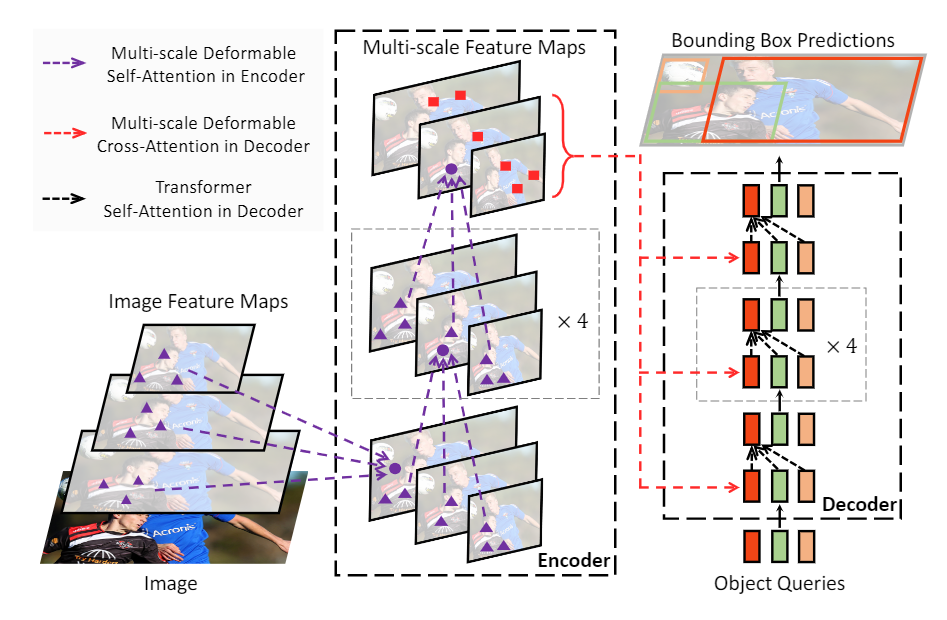

  <center>DDETR的架构</center>

  DDETR的整体和思想架构和DETR的区别不算太大，最关键的就是将自注意力替换成了**可形变注意力**，因此同时需要学习一组用于计算注意力偏移量的参数。可形变注意力不再计算query和其他所有点的相关性而是只计算部分点，那么怎样知道是哪些部分？这就交给offsets进行学习，经过训练offsets能得到对当前query最重要的那些位置。

  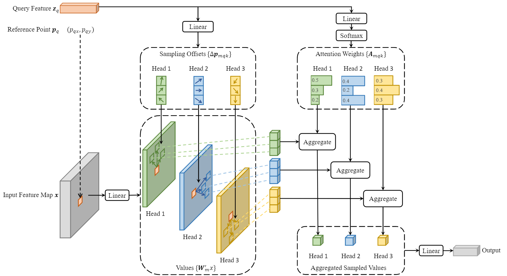

  <center>Deformable Attention模块</center>

  feature map通过简单的线性变换生成Value，Query feature同样经过线性变换生成数个头的注意力偏移量和每个位置注意力的权重，最后将那些位置的feature采集起来并乘以权重得到最后的输出。可以看到上图中Reference Point  $p_q$在Input Feathre Map上的位置已经用相同的粉色标记了出来。

  通过替换全局的自注意力，时间复杂度下降到$WH*k$，其中k为偏移量的个数，也就是用于和query point计算相关性的点的个数。此时，虽然自注意力是”局部“的，但是deformable attention仍然可以通过学习大的offsets从而计算两个相离很远的像素的相关性，这里的”局部“应该作”**部分**“或者”稀疏“来理解，而不是像卷积一样**定域**的。

  由于encoder不再是transfomer一样处理序列化的数据的结构，这里的编码器反倒和Vision Attention的计算非常相似，颇有折衷的感觉，这也说明CNN和Transformer架构处在不断地相互学习和融合的过程中。从他的架构上我们还可以看出DDETR在Encoder结构上**显式地**建模了多尺度特征的融合，而不像DETR一样只使用的CNN backbone的最后一层输出。至于Decoder，还是使用传统的全局自注意力，将Encoder的最后一层输出序列化后融入自己每一层的V和K矩阵中（同样是element-wise add），第一层的输入同样是一个需要训练的Object Query。这里的特征数量已经没有原来这么多，因此处理速度还可以接受。

  关于具体的实现细节，作者开源了代码，请参考：[GitHub - fundamentalvision/Deformable-DETR: Deformable DETR: Deformable Transformers for End-to-End Object Detection.](https://github.com/fundamentalvision/Deformable-DETR#:~:text=Deformable DETR is an efficient and fast-converging end-to-end,DETR via a novel sampling-based efficient attention mechanism.)

  

---


最后的最后，大家可以参照这篇文章：[***目标检测模型的评测与训练技巧***](https://zhuanlan.zhihu.com/p/34179420)，总结的非常好强烈推荐（虽然是两年多前的文章了但是还是非常棒，不过没怎么涉及到细节而是从宏观的角度上复盘了几年来目标检测的发展。建议作为复习或者扩展再自己详细查找相关资料）。如果能看懂/概览里面的内容并且没有任何压力说明你已经悄悄入门目标检测了。而这两年来的发展，主要是对于标签分配、anchor的思考和backbone的优化与训练调优等，单阶段和两阶段网络的差异被进一步模糊，Transfomer架构也在CV领域大放异彩，更多的细节和内容就需要读者自己查阅资料了解了。

此处还推荐一个收集了各种检测网络论文、代码和对应讲解（如果有的话）的合辑：[awesome-object-detection](https://handong1587.github.io/deep_learning/2015/10/09/object-detection.html#densebox)。大家也可以阅读一些综述，进行知识点的查缺补漏并探索自己的兴趣所在。

神经网络-卷积网络-检测网络部分至此在已经编写的内容中占了整个教程一半的篇幅（43206词），希望读者有所收获有所创作。至于分割任务和视频分析等，在比赛中用的比较少，在此不过多赘述。不过目标检测和图像分类作为CV的基石，许多trick和模块都是和其他任务相似的。有了目标检测的基础，相信你在其他任务的学习上也不会遇到什么困难。

理论部分到此结束，检测网络的实践将在第六章再次展开！


---

---


## 5.3.滤波器、观测器、估计器和预测方法

> 这些装置之间的区别在于面对不同场景时候的不同解释（是否考虑信号的统计学特性、随机特点、参数是否变化等）。滤波器在信号与系统中的定义为“只让特定频率的信号的通过的系统”，而在时域处理时则可以指滤除我们不想要的信号的装置，只有一个“前向传播”的过程，信号的流向是单向的。观测器一般在控制系统中是带有反馈通路的，会根据输出和目标的差值修正系统或是更新滤波器参数，因此观测器其是参与到反馈环节当中的模块甚至其本身就是一个带反馈的系统，其输入是信号来源和/或系统处理后的输出（此输出常被作为一个**增广变量**，将被观测器用于下一次迭代）。最常见的观测器是在**状态空间**方法中使用的状态观测器，用于估计一些无法直接测量的状态变量。估计器的概念和观测器类似，一般是用于对扰动的估计和在不能准确得到系统状态时对其进行估计的装置。***但很多时候，我们对这几种装置都是不加区分的。***

> 此部分分为两个方面介绍，一方面是传感器数据的处理（如解算得到的装甲板位置信息和从电控得到的信息，一般为时域信号（也可以转化到频域处理）；另一部分是对图像数据的处理（二维信号，空间域）。

> *当开始阅读 5.3 ，笔者默认读者拥有积分变换、概率论、线性代数、微积分和部分信号处理的前置知识。请务必仔细阅读推荐的教程。*

基于时域的滤波器是控制理论的核心内容之一，状态估计其实也是机器人学中的一个重要部分，自动驾驶中的SLAM就是它大显身手的领域之一。放眼RM赛场，比赛相关的技术无不和以上提到的内容有关，因此有必要学习这个重要的内容。在自瞄算法帧率逐渐上升、稳定性逐渐提高的今天，状态估计和轨迹预测将会成为兵家必争之地，是下一个强队之间对抗的隘口。谁能获得更好的**预测和估计**，谁就能实现更精确地打击。关于这些算法的具体应用我们将会在 *6.4* 中介绍，这里先不谈实践，着重看看原理和前置知识。

学习过信号与系统和自动控制原理等电类工科同学应该对此部分比较熟悉。这部分算法和代码的理解与设计是运动预测和估计非常重要的基础。这里推荐一个做机器人控制的工程师up:[DR_CAN](https://space.bilibili.com/230105574/channel/index)，他的几个系列视频都非常适合了解控制理论和学习。若仅是刚入门RMVisioner，请直接看图像处理部分。

### 5.3.1.常用的几种信号滤波器

#### 5.3.1.1 x通滤波器（频域）

一般在处理传感器数据（IMU、测距传感器等）和控制数据序列的时候会使用。我们这里以低通滤波器为例（显然我们的控制数据序列一般是稳定变化而不是突变，当然部分极端、特殊数据除外）。低通滤波器只会允许低频信号通过，从时域角度来看，就是**变化平缓**的信号量。比如我们从IMU采集的速度序列{5.6，5.2，5，5.5，6，5.7，110，6，5，5.6，5.3，6.1}，突然出现的110这个值是较为平缓序列中的一个突变：若对此序列进行傅里叶变换就会高频处有一个尖峰，即代表着**剧烈变化**的信号。显然这对于IMU来说是一个异常信号，即使是突然启动也不可能有这么大的速度，除非遭到撞击（显然这时候的数据也没有任何用处），那么将此数据序列通过一个低通滤波器，就能够滤除这个异常值。当然我们在实际使用的时候，一般不会将一段时间内的信号序列投入傅里叶变换，而是直接设置一个跳变阈值来筛选这些信号。如果直接把此信号剔除，会出现一个数据为零的空档。一般选择通过插值（顺序平均、指数加权平均等）或者延续上一时刻的信号值来修复这个问题。

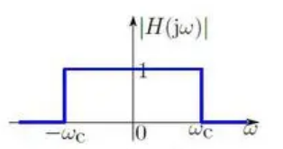

<center>对短序列信号进行筛选我们可以得到一个理想的低通滤波器，这是它在频域的表示</center>

#### 5.3.1.2. 中值滤波器（时域）

和低通滤波器类似，用于消除异常数据的影响，这是一种非线性且有损的滤波器。而且由于其加权计算一段时间内的信号数据之和，通过中值滤波器后的数据一般会变得**更平滑**，有利于消除**突变信号对系统的扰动**。不过也要考虑有时候确实会有跳变信号的出现（比如当前帧的装甲板消失，在视野边缘出现了新的装甲板），要根据这种情况设计特殊的处理，通过调试设置阈值防止正常数据被清扫。


<center>窗口大小为5和14；可以看到两者在幅值低频处有明显衰减，随后在高频呈现波浪状；相频也呈现一定的“周期性”</center>

还可以采用**投票平均法**，仍然选取滑动窗口，不过去掉窗口内的最大值和最小值，然后对剩下的数据取平均。另有其他改进的方法如高斯平滑、指数加权平均、权重衰减平均等方法，能够适应更多的情况、更快的应对数据的变化等。

显然，这两种滤波器都需要采集一段时间的序列数据并进行相应计算和筛选，这是有时间滞后性和开销的，本质上都是低通滤波器，因此一定程度上会牺牲数据的实时性。从控制系统的角度考虑此问题，实际上就是反馈装置（传感器）的带宽设计，若带宽高的确可以提高系统的快速性但却会对高频噪声过于敏感导致高频误动作（电机抖动）；若减小带宽则以损失响应速度为代价提高对异常数据的抗性。

> 我们常说，控制系统实际上是在以某个选定条件约束下的最优化问题，需要在数种性能和参数中取得权衡。这似乎也是机器学习中非常经典的“**天下没有免费的午餐**”定律？


---


#### 5.3.1.3. Kalman Filter（卡尔曼滤波器，时域）

KF家族从被提出以来可谓是运用的**最多最广**的滤波器了，并且其发明者Kalman教授以他的一己之力将控制领域的研究从频域转换到时域（以状态空间设计为基础的现代控制理论）上来，虽然他在后半生一直热衷于频域分析的研究。Kalman滤波器最出名的轶事就是在Kalman博士访问NASA后，那里的工程师认为这是一个极佳的时域修正方法，并且直接在阿波罗6登月飞行器的轨道矫正系统上使用了扩展卡尔曼滤波器。

相比于传统的时域滤波器和频域滤波器，KF运用**马尔卡夫假设**（从概率和信息观测的角度），只需要保留前一个状态的信息，占用内存小且速度非常快。

这一小节主要推荐一些非常棒的教程。关于KF的工程应用和直观理解，Matlab官方出品的这个系列视频很好地讲解了运用过程：[Kalman Filter](https://www.zhihu.com/question/23971601/answer/839664224)。另外若想从概率统计和数学角度初步理解KF，可以进一步参照这篇~~可可爱爱~~的教程：[How a Kalman Filter works](http://www.bzarg.com/p/how-a-kalman-filter-works-in-pictures/#mathybits)。

若是结合控制和概率论解释，并且**完整地进行数学推导**，请看bilibili up主 DR_CAN的：[卡尔曼滤波器系列视频](https://www.bilibili.com/medialist/play/230105574?from=space&business=space_collection&business_id=6939&desc=0)。另外，他从工程的角度讲解了状态空间法中的观测器设计，这能让你更好地从控制角度理解KF，请戳：[龙伯格状态观测器的设计](https://www.bilibili.com/video/BV1bW411i77w?spm_id_from=333.999.0.0)。

若你学习过自动控制原理（准确的说是现代控制理论，主要用到的是关于稳定性分析和线性代数的知识），想从李雅普诺夫稳定性角度分析为什么KF是高斯噪声影响下的最优线性滤波器和其收敛性、抗扰能力，请戳[卡尔曼滤波器原理介绍](https://zhuanlan.zhihu.com/p/42390886)。

如果想进一步了解状态估计和机器人学中的概率论相关知识，可以参阅[《state esstimation of robotics》](http://asrl.utias.utoronto.ca/~tdb/bib/barfoot_ser17.pdf)和[《probabilitics robotics》](https://cs.pomona.edu/~ajc/other/Thrun%20et%20al_2005_Probabilistic%20robotics.pdf )这两本经典的作品中相关的内容，里面详尽地介绍了KF为什么是高斯意义下地最优滤波器以及作为一个贝叶斯估计器的扩展，KF是怎样演化成这种形式的。

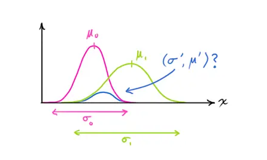

<center>KF从多个信息来源获取数据后的融合过程图示</center>

- 由KF的构成我们可以发现，它能够综合多个数据来源(观测模型)和系统状态转移的模型并根据他们置信度（由协方差的大小来表示）来对各个信息来源赋予不同的权重最终融合得到预测结果。而EKF、UKF都是对非线性系统作近似线性化而产生的滤波器，对于工作点附近非线性程度较小、容易线性化近似的系统（容易指的是求导生成的**Jacobian**矩阵较好计算，不会包含很多非线性函数）有着很好的效果。显然在比赛中大部分的控制数据和传感器数据都是能够比较好地用近似线性化来拟合的，比如在传感器帧率高、处理速度快的时候我们常常假设对手机器人的运动是匀速直线运动，因此KF系列便顺利成章地作为我们使用滤波器的首选。

- 若我们想用KF来**修正**之前的数据（如t-1，t-2时刻），那么卡尔曼滤波器相当于一个插值或平滑数据的装置；若想通过KF来融合**当前**采集的 数据并且消除噪声，那么它是一个估计器，和前者一样都是贝叶斯方法，即利用后验信息来修正概率模型；若想通过它来**预测t+1时刻**的值即通过修改状态转移矩阵用历史数据来推测将来值，这时候就是一个**预测器**（单纯从名词直译来理解）。

- 有了以上教程的铺垫，我们就可以通过修改KF的**状态转移矩阵**来预测将来的数据了：以装甲板的运动为例，我们一般对解算得到的装甲板的中点进行运动学建模并假设装甲板的运动模型（一般假设为匀速直线或匀加速直线）和观测模型（也就是相机的成像模型，可以使用小孔成像）的**非线性程度较小**。这样我们便能选用EKF来对其进行线性化。我们可以把当前帧和之前若干帧的装甲板位置的世界坐标系坐标相减并除以相机的帧率的倒数得到其运动速度，或者进一步求差分以得到加速度信息。在得到这些信息后，把他们填入状态转移矩阵并设置一个**合理的时间间隔**（曝光时间+单帧处理时间+数据发送到电控的通信时间+电机响应时间+子弹飞行时间等，一般需要实车调试进行修改），EKF便能根据转移矩阵和置信度计算出此确定的时间间隔后装甲板的位置了。我们会在 *5.3.2* 进一步介绍运动预测方法，在 *6.4* 也会详细讲解如何利用KF对装甲板的运动进行预测。

- UKF则是EKF的改进版，全称为Unscented KF。当系统模型的非线性程度较大的时候，我们就很难用局部线性化的方法去得到贴近实际的近似分布，因此我们会在参数未进入系统前随机生成**服从高斯分布**的一组点同时给它们**赋予不同的权重**（为什么要这么做？），然后将他们一起投入到此非线性变换模型中，并在变换结束后统计这些点的均值和方差，利用这些数据**重建一个高斯分布**（点参数估计）用于近似此模型的分布。显然，使用的随机点越多则近似越准确（大数定律），但是消耗的资源也越大，这点和下一个要介绍的PF是完全一样的。不过，在实践中的经验来看，UKF对高维模型的近似并不是很好，一来是高维空间的分布更加复杂难以通过线性系统（在这里我们使用高斯分布）近似，另一方面是计算开销也随着维度增加而迅速上涨，维度爆炸是这两种方法（UKF和PF）共同的、最大的问题。

  好在我们的系统并不复杂，最多只有速度、位置、加速度三个维度（加上加加速度和加加加速度也是没有任何问题的，如果你觉得者能够提升你模型的精确度并且这些数值的噪声足够小的话，或者你能够找到其他能够**增加置信度的先验信息**和其他可用传感器数据）。

  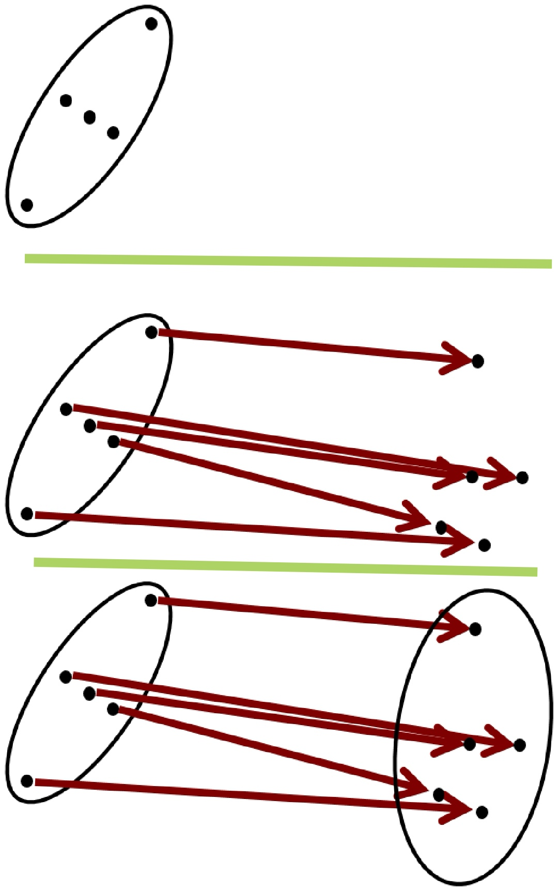

  <center>UKF的流程图解</center>

  

  <center>图源知乎-"fishmarch"的专栏'概率机器人'</center>

  根据上图我们可以把UKF的迭代过程分为以下四步：

  1. 选取服从Gauss分布的随机点 

  2. 和数据一起投入变换 

  3. 根据权重和新的均值方差得到新的Gauss分布，并假设此高斯分布就是经过变换后状态的近似分布

     

- 此外，卡尔曼滤波器还有各式各样的变种，如**SCKF**（状态约束）、**ESKF**（误差状态）、**AUKF**（增强无迹）等，有兴趣的读者可以自行了解相关的内容，无非是从不同状态变量的关系之间入手增加额外信息或约束以进一步逼近真值，或是通过更合理的方法来近似非线性部分。

  

---


#### 5.3.1.4. Partcle Filter（粒子滤波器，时域）

PF可以看作是UKF的进化版。UKF要求用服从高斯分布的一组点经过转换之后去通过采样来得到**新的高斯分布**进而近似真实的状态分布；而PF则是不再追求用高斯分布去近似真实分布，直接用一组点经过模型转换后再采样，用此后验数据来**近似任意分布**。它们的区别在于UKF是通过一组假设在通过系统的转换后仍然服从高斯分布的采样点来求其**参数μ和σ**，是一种参数估计方法；PF是用已知的采样点数据去**求未知的任意分布**，或者从另一个角度来说，就是干脆不给出后验分布函数（不用分布来描述，就是一堆离散化的点），直接根据粒子的权重进行融合得到**状态的一种可能假设**。根据大数定律（又是它！），想要通过采样近似一个分布，样本越多则结果越接近真实分布，因此PF在“撒豆子”时会使用比UKF多得多的样本点，所以它本质上是一种非参数化的蒙特卡洛方法。

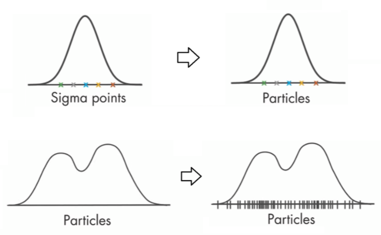


<center>UKF(上)和PF(下)最直观的区别：UKF用根据一组点的权重进行极大似然估计，重建高斯分布；PF直接给采样点分配权重，即图中竖线的密度，之后越密集的点附近被重新采样到的概率会越大</center>

在PF的初始化过程中生成的这些样本点经过观测矩阵、状态转移矩阵变换后，输出一组经过非线性变换得到的“畸形”的分布点。现在，我们要对这些“畸形”的分布点进行重新采样以估计系统的状态，不过，我们不再像EKF、UKF一样去用这些采样得到的点来**还原分布**了，我们直接把这些采样得到的点作为后验信息（通过对这些点进行加权，得到关于系统的状态信息，这时候不再讨论“分布”，上面提到用后验数据来近似任意分布，既然是**任意**的分布，那么也不存在一个既定的模型需要通过这些点来计算其参数即进行参数估计，这些点的信息本身就代表着一种分布）。

那么应该如何赋予权重并重新采样？这一步就对应着KF中的**观测**，我们会根据观测得到的数据为上面的粒子赋予权重（通过观测来得到各个粒子所处对应状态的概率），接着把那些概率小的粒子排除出去（这些概率小的粒子附近位置被重新采样的概率更小），在权重高的粒子附近根据权重重新采样。这样就完成了PF的一次迭代更新，pipeline自然就重新回到第一步。如此往复循环，滤波器输出就能收敛到最“贴近”实际状态的分布了。

这里有一个关于粒子滤波器的简短视频，能够帮助你从直观上理解PF：[Uppsala University:Particle Filter Course](https://zhuanlan.zhihu.com/p/81274229)。上面的介绍都是倾向于通过直观的解释帮助你理解，如果需要采用严谨的数学推导从概率统计、贝叶斯估计的视角入手，也请参阅相关的教材。笔者还没有见到从控制和观测器的角度解释这样的非线性滤波器（主要是笔者的对这方面的知之甚少），若你知道一些相关的材料，请联系我！


---


*接下来两个滤波器对数学和信号处理的知识要求较高，没有相关基础的萌新 RMer可以跳过这两个滤波器的介绍直接看结论。*

#### 5.3.1.5. Least Mean Square Error Filter（最小均方误差滤波器，时域）

经典的频域滤波器要求对信号与噪声的频谱完全得知，并且两者不能有交叠，否则会造成滤除不干净或是影响原有信号的问题。而估计器则是通过已知信息求在某种标准下的原信号的最优估计。LMSEF是维纳博士提出的以最小均方误差为最优准则的一种线性滤波器，奠定了最优滤波器设计的基础。其对于参考信号（或目标信号，即我们希望得到的信号）和噪声信号的要求是**平稳随机信号**并且**统计特性已知**（如果统计特性未知或是会改变，请看下面的自适应滤波器）。维纳滤波的最佳适用场景是处理已经被记录下来的信号，或是能够长时间观测的信号。

假设参考信号为$y(n)$,我们采集到的信号序列为$ x(n) $（可以将其看成一个向量），噪声为$v(n)$（也看作向量）。我们设经过滤波器后的估计值为$\hat{y}(n)$,对于信号**卷积形式**是
$$
\hat{y}(n)=\sum_{k=0}^nh(k)x(n-k)
$$
这里的$h(k)$就是对于采样的输入信号的**冲激响应**；如果将估计值写成$ x(n) $的**线性组合形式**则有：
$$
\hat{y(n)}=\omega^Tx(n)
$$
这里$\omega^T$就是$h(k)$在不同时间点的值，也就是对 $x(n) $序列不同值的加权系数。进一步的，设误差序列为:
$$
e(n)=y(n)-\hat{y}(n)
$$
 则均方误差为：
$$
L=E(e(n)^2)
$$


使得均方误差有最小值,将$L$的表达式展开,我们将得到一个**半正定的二次型**：
$$
E\{y(n)^2-2y(n)\omega^Tx(n)+\omega^Tx(n)x(n)^T\omega\}
$$
,因此通过取一特定的w会有一个全局最小解,我们的目的就是利用已知的信息求取一个$\omega$.

接下来的想法就很简单也很直观了，我们直接对误差函数**求导**，并让其**导数为零**，解出的$\omega$就可以让误差函数最小了：
$$
\grad=\frac{\partial{L}}{\partial{\omega^T}}=E\{-2y(n)x(n)+2x(n)^Tx(n)\omega\}
$$
令上式等于零，解得$\omega_o$：
$$
\omega_o={\{E(x(n)x(n)^T)\}}^{-1}\cdot{E(y(n)x(n))}
$$
式中的两个期望，就分别是**采样信号的自相关**和**原信号和我们采集到信号**的互相关。如果已经得知这些信息，那么就可以求取全局最小解了。从前述的推导就可以发现，我们实际上是在采集到一个序列信号：
$$
x[0],x[1],x[2]\cdots x[n-1],x[n]
$$
之后，再对输入信号进行滤波从而获取原信号的最优估计。因此，当我们面对已经完成采集的图像（相当于在拍摄瞬间完成所有光强信号的定格，序列是一个空间序列，又叫空间域）、音频（扬声器产生了失真，需要进行还原）、dian等，就可以使用wiener filter对其进行处理。**这是因为我们已经获取的关于这些信号的所有可知信息，只需要假设噪声形式就可以直接计算相关矩阵**（虽然不是无限区间）。

不过实际上我们无法得到一个信号序列的这些理想参数，因此通常利用实际输入信号的采样对自相关系数矩阵（一个对称方阵，元素分别为$x[0],x[1],x[2]\cdots x[n-1],x[n]$,之间两两的相关系数）和互相关系数矩阵进行**无偏估计**（指被估量的期望和实际值的期望相同），用此**统计量**来代替真值。该公式也称为维纳-霍夫方程，是最小均方误差准则下的滤波器系数最优解。利用部分信号的统计信息来进行滤波也启发了**自适应滤波**，稍后我们会进行介绍。

显然，对于一个**动态**的任意信号而言，若需要**实时进行处理**，我们获取该信号与输入的互相关还有输入信号的自相关这些**先验信息**难度又更大了，我们只能获取部分的数据并且得到的估计基本上有较大的偏差。由于输入过程取决于外界的信号、干扰环境，这种环境的统计特性常常是**未知的、变化的**，导致我们无法在获取信号的过程中实时求取$\omega_o$. 

如果不知道被估计量的任何信息则**无法**使用LMSEF。但可以对这些先验**进行假设**使其符合一定的形式，和实际情况越贴近则滤波效果越好。

同样，以其他准则为最优的滤波器或多或少也会受到需要统计特性已知或平稳信号的**限制**，这也促使人们开发出了自适应滤波器。此外，由于要进行矩阵的求逆运算，若序列数据的长度很大或是数据的维度和规模很大，我们会遇到“**维数灾难**”，求解的难度乘指数级上升。

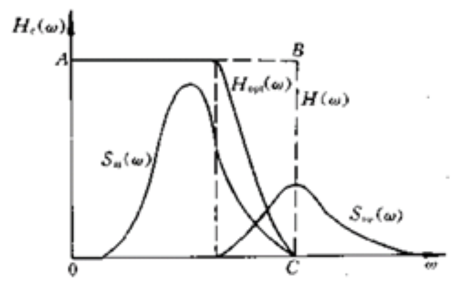

<center>wiener filter和linear filter的对比</center>

相对于一般的线性滤波器（由虚线BC表示的理想滤波器），维纳滤波的响应（上图中的斜线）在噪声和信号的**重叠处**就开始衰减，使得噪声对原信号的影响减小。其倾斜程度和曲率取决于原信号和噪声的**强度比**。


#### 5.3.1.6. 自适应滤波

自适应滤波以前述的wiener filter为基础，这里我们也从统计与优化和控制理论两个角度来介绍它，顺着上一篇介绍维纳滤波器的文章的思路继续进行推导。

- **统计与优化**

  前述的wiener filter在求取最优解的时候受到的限制很多，不仅要求噪声和目标信号的统计特性已知，还需要采集无限时间的信号序列（从零到正无穷）后以得到最优解，而在实际情况下我们一般利用一段时间内的信号序列对$\omega_o$做出无偏估计。不过，这也只是权宜之计。首先倘若要对序列信号进行实时处理，采集一段时间这个要求就无法满足。其次若对信号和噪声的统计特性完全未知甚至它们是非平稳态的，那么问题相当于无解。

  不过，我们可以从维纳滤波器的近似求解中看出一些蛛丝马迹：利用一小段时间内的信号对误差的期望进行最小化，如果再对这个结果进行推广，缩小这个“一小段时间”的长度进行估计并保存这次的结果，认为是当前最佳同时在稍后进行迭代，不再追求最优解而是尽量消除噪声并尽可能**快速**的收敛，不也是一种很好的方法吗？

  那要怎么才能知道$\omega$要如何更新呢？对于全局最优解，我们要求一个$\omega$使得下式为零：
  $$
  \grad=\frac{\partial{L}}{\partial{\omega^T}}=E\{-2y(n)x(n)+2x(n)^Tx(n)\omega\} \tag{1}
  $$
  并且之前我们已经得到，我们要优化的误差函数拥有很好的性质：它是一个凸函数，其上没一点的梯度都指向最优解！很直觉的想法就是，我们让$\omega$每次往最优解迭代若干步，即$\omega_{t+1}=\omega_t-k\frac{\partial{L}}{\partial{\omega_t}}$，其中k为调制因子（学习率），这不就是**梯度下降法**吗！如果在每一次采集完成后都进行数据更新，就成为了**随机梯度下降法**。很多的优化问题如果无法一次性求解，往往会诉诸迭代的解法，逐步逼近最终的解。对于极限情况，我们每采集一次数据就进行一次参数估计，即每一步都更新$\omega$ 。

  不过这里还有一个问题亟待解决，要计算处代价函数上某一点的梯度，还是需要输入信号和原信号的一些统计特性，因此我们让代价函数就等于误差向量，认为当前的样本的损失可以替代总损失。学习过优化或者神经网络的朋友应该对此应该不陌生了，那么求梯度就有：
  $$
  \hat{\grad J}=\frac{\partial{e(n)^2}}{\partial\omega(n)}=\frac{\partial[{y(n)-\hat{y}(n)}]^2}{\partial\omega(n)}=-2[{y(n)-\hat{y}(n)}]\cdot\frac{\partial{\hat{y(n)}}}{\partial\omega(n)}=-2e(n)x(n)\tag{2}
  $$
  其实也就是把式(1)中的后半部分用$\hat{y}(n)x(n)$代替然后用结合律和前半部分相消（当然这种视角不太严谨，比较直觉，因为矩阵乘法没对齐,时间戳也不是对应的）。

  所以我们只需要之前的$\omega$加上当前梯度乘上一个系数就可以达到参数更新的目的了。对于稳态信号，逐渐迭代就能够收敛到最优解附近（根据推导可以发现每次的误差一定会比上次来的小）；而对于非平稳信号，也可在数十步之内逐渐跟上，但不可避免的有相较于稳态信号稍大的误差。

  对于k值的选取，经过稳定性计算可以得出以下条件：
  $$
  0<μ<\frac{1}{\lambda_{max}}
  $$
  其中λ为输入信号自相关矩阵的最大特征值，感兴趣的同学可以自行查找资料，大概证明过程是为了保证代价函数会随着$\omega$的迭代递降，根据递推公式，只需要保证特征值小于1就会让滤波器的输出值收敛。$ \mu$越大收敛得越快，但也容易跑飞或者使得累积误差变得的不可接受。不熟悉特征矩阵、对角化以及幂矩阵运算，请戳这里：[MIT 18.06 linear algebra P23](https://www.bilibili.com/video/BV1bb411H7JN?p=23) 

  所以最终权重更新的公式为：
  $$
  \omega_{t+1}=\omega_t+2μe(n)x(n)
  $$

  > 搜索关键词：自适应滤波、泰勒展开、特征分解、学习率。

  虽然已经找到了求解的方法，但它肯定还是有不足之处，比如收敛速度慢、震荡比较剧烈等。针对这些缺点人们又提出了NLMS、AP、RLS优化等，有些是针对梯度下降的（可以参考之前神经网络部分的adam和momentum）；有些是针对噪声和误差统计特性的；感兴趣的同学可以自己搜索。

  几个参考资料：[adaptic noise canceling](https://www.cs.cmu.edu/~aarti/pubs/ANC.pdf)、

  

- **控制理论**

  待更新。笔者还需要进一步查找相关资料。


- **应用举例**

  - **降噪**

    > 网络上能找到非常多**自适应滤波器用于降噪**的例子，尤其是AEC（自适应回声消除）常常被作为样例，***但是却存在大量的缺解、讹误和疏漏，甚至在根本没有弄清楚原理的情况下就大肆复制粘贴添油加醋***。笔者在初看也一头雾水疑惑也越发头大，经过长达三天的查证和学习，在此归纳总结。

    如下图所示，$x(n)=y'(n)+s(n)$为带有噪声的输入，$y(n)$为和噪声相关的参考信号，那么我们的目的是将$y(n)$作为自适应滤波器的输入，其输出能尽量逼近$y'(n)$。那么经过一段时间的迭代后,$e(n)$就会逼近我们想要的原信号$s(n)$.

    > 注意不要把这里的$x(n),y(n)$和前文的符号记法混淆。

    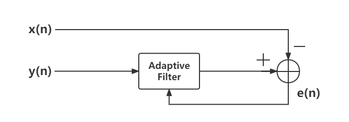

    然而我们发现，如果$e(n)$不为零，那自适应滤波器在进行迭代的时候始终会得到非零的差值，这样不就相当于输出会逐渐逼近$x(n)$了吗？这也是非常匪夷所思的事情，怎么可能用一个滤波器从噪声信号中还原出原信号呢？

    其实，在利用adaptive filter进行noise canceling的时候，有三个**前提条件**必须得到满足：

    1. $E[s(n)y'(n)]=0$，这要求原信号和噪声信号不相关
    2. $E[y(n)y'(n)]\neq0$，即要求用于参考的信号和噪声信号相关，并且相关程度越大越好
    3. $E[s(n)]=0$，希望原信号是一个均值为零的信号

    有了这三个条件，我们再来看前述的内容就好理解了。$ s(n)$的期望为零而又不恒等于零，则在渐进收敛的过程中，$e(n)$在一段时间内为正一段时间为负，这样对于滤波器的参数$\omega$来说，其实是**保持动态静止**或者说于最优值附近**轻微波动**的（当几乎收敛的时候，根据参数的更新公式，当误差为正则向正方向更新一步，误差为负则向反方向更新一步，总的结果是保持不变的，但在还未收敛的时候，总有一个方向上更新的距离会超过另一个方向，这个更新步长较大的方向就是**趋向解的方向**）。

    因此，我们避免了"$\omega$不断更新使得$y(n)$经过滤波器后的输出逼近$x(n)$”这种给谬论。比如语音信号、心电信号、还有其他许多电信号都有这样的性质，把直流值当成零参考点，其震荡信号的均值为零，这就很好地符合了第三条要求。

    笔者也有看到将自适应滤波视为**去相关**操作的解释：若输入和参考信号有关，就能够利用相关性动态计算参数$\omega$使得输出不断逼近参考信号，而对于无关信号（在这里就是$s(n)$，没有被噪声污染的原信号）则不去理会。在此例中参考输入$y(n)$是一个和噪声$y'(n)$高度相关的信号，而原信号即需要被还原出来的信号$s(n)$则于参考输入无关。

    我们也拿典型的AEC应用进行说明，在此场景下，我们希望消除麦克风采集到扬声器中的声音所产生的回声（你应该也有这样的经历，在线上会议或免提通话时，我们的声音在对方的扬声器中播放时又被对方的麦克风采集到，随后这段信号再次由信道传播回我们的扬声器中播放出来，形成回声），那么期望的$e(n)$应该是**麦克风采集到的去除回声之后我们说话的声音**：

    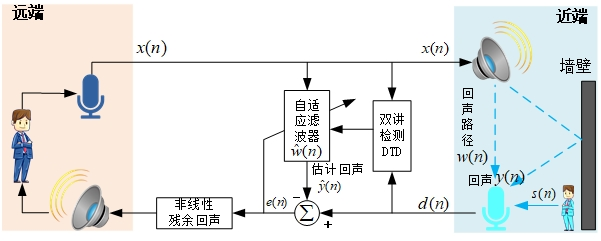

    <center>AEC的应用场景示意图，图源本节末的链接</center>

    我们会发现，这里其实增加了一个DTD（double talk detection）模块，他用于检测当前双方是否在说话。这又有什么用呢？前述进行noise canceling的时候必须满足三个条件，在实际情况中第二条是比较容易实现的，但是1、3满足起来就比较困难了，因此利用DTD，回声消除的模式如下：

    - **远端语音存在，近端语音不存在**：滤波、自适应滤波器系数更新（对方说话我们不说话）
    - **远端语音存在，近端语音存在**：滤波（两方都说话）
    - **远端语音不存在**：什么都不用做（没信号过来，没必要做任何动作）

    很容易就能发现，我们只有在原信号$s(n)$（我们说话的声音）为零的时候即第一种情况，才会对滤波器的参数进行更新，这就避免了原信号和希望消除的噪声信号之间的耦合导致参数更新不准确的问题。在这种情况下，自适应滤波器的作用原理反倒和接下来要介绍的**系统辨识**有些相像了：其实我们在利用自适应滤波器去模拟回声路径，让输入经过自适应滤波器后的输出和输入通过环境反射交杂后产生的输出尽量接近。

    关于AEC更详细的综述，可以参考这篇文章：[声学回声消除原理与实现](https://www.cnblogs.com/LXP-Never/p/11703440.html)

    

  - **系统辨识**（应用于控制等）

    对于系统辨识的应用，我们希望自适应滤波器可以模拟出待估系统的行为。这里，$y(n)=x(n)$，滤波器的输出和原系统的输出作差得到误差信号，将此误差输入自适应算法，经过数次迭代$x(n)$将会逐渐逼近参考信号$y(n)$。也就是说，虽然系统内部结构不同，但是自适应滤波器复刻了$G(s)$的传递函数。

    

    在模型十分复杂的情况下，我们就可以使用adaptive filter去逼近模型的黑箱。用一个直观的低维实例来说，就是在用一条直线去逼近一个复杂的曲线。当然，你可以用更高阶数的自适应滤波器从而达到更好的效果，或是在此之后增加其他的非线性拟合部分。

    

  - **估计**（预测）

    很多读者初看这个应用，会觉得有些无厘头，为什么能够利用过去的值得到当前值呢？请记住，自适应滤波器虽然使用限制相对维纳滤波器放宽了许多，但是仍然要求**信号在短时间内能够保持一致的统计特性或不至于变化太多**，如果是一个剧烈时变的信号显然我们无法通过历史数据序列来预测将来时刻的值的。

    对于已经学习过R循环神经网络的同学来说，我们可以将自适应滤波器看成是单层RNN，滑窗范围就是参与计算的历史序列长度 $n$。不过两者稍有区别，自适应滤波器的参数会一直保持更新，而RNN需要先训练再使用，或者我们将前者看作是一种一直处于学习状态的RNN。

    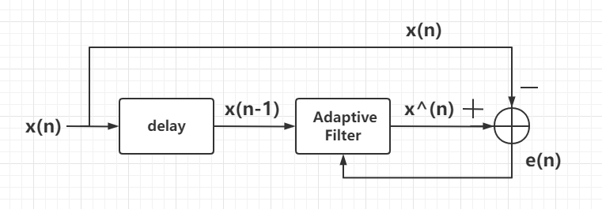

    

---


### 5.3.2.预测方法

运动预测是自瞄击打装甲板的关键一步，如果没能预测目标的移动，那么我们的解算输出用于只会跟在目标的屁股后面，使得打出的弹丸始终落后于目标，~~扑向空气划过一道淡绿色的曲线~~。同时，运动预测和运动学建模也是目标跟踪领域的一个研究方向，利用此技术能够提出精确的区域提议，使得候选区域数目降低，加快处理速度。

我们这里将按照循序渐进的原则，介绍运动预测的发展和方法。

#### 5.3.2.1. 朴素方法：简单物理规律的应用

这种算法就如标题一样简单，我们直接根据物理规律对物体的运动进行预测。假设物体处于匀速直线运动或匀加速直线运动，利用两个时刻物体的位置差求差分得到速度，或进一步对速度求差分得到加速度，用此值乘上需要超前的预测时间（超前量），就可以得到目标物体在这段时间之后所处的位置了。

倘若只使用两帧之间的位置差分，噪声的影响可能会比较大，可以考虑使用多帧的滑窗进行**直接平均**、或EMA（指数加权平均）等**加权平均**方法，尽量降低噪声的影响。

从上面的描述就可以发现，这种模型只对运动状态变化较慢的目标有效，即使我们是算法处理帧率再高计算得到的差分再准确，那也只是基于匀速或匀加速模型得到的结果；虽然对于有任意速度或加速度的物体在短时间内我们都可以将其建模为CV或CA，然而一旦目标的运动状态变化速度超过了可以接受的上限值或预测的时间超过了上限值，准确率都会大幅度下降。（不过话说回来，所有预测方法都是有一定的约束的）


#### 5.3.2.2. KF及其优化

- 使用卡尔曼滤波器或其他观测器，都是为了达到消除噪声从而获取更好的位置估计的目的，这样融合出来的差分和二阶差分等相对前一种方法会更加可靠。

  若采用匀速模型，则在状态变量中加入速度，update步应该分为两部分：

  1. 将用于**更新状态变量**的状态转移矩阵中对应速度的位置的值设为$\Delta t$，即**两帧之间的时间差**
  2. 增加一个**新的状态转移矩阵**，在对应的位置上设置的值为$\Delta T$，这是**需要超前的预测时间**，在RoboMaster视觉任务中，$\Delta T$ 包括算法处理时间、下位机通信时间、电机动作时间、单链移动时间和子弹飞行时间。

  第一步得到的状态变量会一直继续使用下去，这将作为**当前位置和速度的最优估计**并不断保持更新，和前面朴素方法介绍的多帧平均的作用一致；而第二部分计算出来的值，是用来提供超前位置的，每次都根据第一步的结果重新计算。

  对于协方差矩阵的设置，我们从两个**极端**入手考虑：若将预测值的速度协方差设定的非常大，则我们几乎只相信测量值，即两帧之间的差分值，那么这就不是一个匀速直线运动了，得到的融合结果可能会呈现**折线状**，需要稍微进行平滑以获得连贯一些的控制数据；将与预测值的协方差设定的很小的时候，那么我们会更相信预测值，认为其是一个近似的匀速直线运动。

  当然，我们也可以把加速度加入状态变量中，用二阶差分来计算加速度，同样可以采用前面平均速度的方法来平滑加速度。不过二阶差分本身就容易带来较大的噪声，对于帧差的准确度要求更高，尤其是我们使用SolvePnP算法常出现定位点抖动的情况导致帧差出现高频噪声。从观测器的状态反馈权衡的角度考虑，相当于给了一个很大的增益，其**带宽会扩展但是容易被高频噪声所干扰**。

  

- 上述的方法本质上还是基于匀加速或匀速这种较好处理的模型，只不过采用观测器尽量减少噪声，还有一些稍微复杂一些的模型采用了不同的假设和约束，使得预测的效果更好。我们在此简要列出几个供读者进一步参考。

  首先很容易想到的就是其他constant模型：既然有平动那肯定也有转动的匀速模型和匀加速模型吧？这就是Constant Turn和Constant Angular acceleration。那能不能把转动和平动结合起来？肯定能啊，这就有了CTRV、CSAV、CCA，这些模型在自动驾驶的运动学建模中都用得非常广泛。

  再比如将加速度或速度建模为服从一定分布的思想也是很巧妙的。singer模型假设目标的加速度符合一个$[-a_{max},a_{max}]$的均值分布，其服从一阶随机微分方程，可以用**目标机动时间常数**衡量一段时间内加速度的相关性。哈工威的视觉有一场圆桌介绍了他们的singer模型，参考：[哈工大威海hero：神经网络优化与运动预测算法分享](https://www.bilibili.com/video/BV1Yq4y1t7F5?spm_id_from=333.999.0.0)。Matlab中也有一个相关示例：[Singer acceleration motion model](https://ww2.mathworks.cn/help/fusion/ref/singer.singer.html)

  **当前模型**（current model）对singer进行了改进，考虑了加速度的均值，不像前者将加速度均值设为零，其加速度是一个条件分布，将根据一段时间内观测到的加速度均值进行计算更新，因此又被成为均值自适应加速度模型。

  

- 最后就是不同模型的集大成者，可以看作机器学习中的**集成**方法——**IMM**（Interact multi model），它综合了多个单一模型（就是上述的那些），分为四步进行运动预测和更新，相信已经学习过卡尔曼滤波的你应该大概能猜想到他的流程，IMM最大的不同就是增加了第一步，让模型进行交互计算相互转移的概率：

  1. 模型交互，计算目标运动模型从一种模型$i$切换到另一种模型$j$的概率$μ_{ij}$（一会看了后面三步会更加清晰），然后为所有模型两两计算转移概率并乘以每个模型的输出得到新一轮的初始状态。
  2. 以第1步得到的初始状态（1个）作为**每个**单一模型的输入，然后用各自的模型进行预测和量测更新。这一步和KF完全相同，而且实践中大部分单一模型的状态转移和融合都是使用EKF或UKF。
  3. 在第2步更新完之后，利用在更新时每个模型**预测值**和**测量值**的差值，计算每个单一模型的似然函数值进而得到该模型的置信度。也就是说，单一模型的预测值和真值（其实是测量值）差距越大，说明这个模型和实际情况相差的越远。
  4. 根据第3步得到的每个模型的置信度（权重），对所有模型的结果进行加权融合得到输出。

  IMM实际上就像一个超大杯的KF，里面有许多小KF，小KF的输出又再次在大KF中进行融合，从机器学习的角度看应该算是一种**stacking ensemble**，每个小模型的输出再投入一个模型中进行集成。比较巧妙的设计就是IMM的第一步，它没有直接用上一轮迭代中的输出值作为新一轮迭代的初始状态而是添加了一个**模型转移概率**，使得不同单一模型之间的交互更充分。归根到底，IMM也是一种贝叶斯方法，利用先验信息和后验估计来获取极大似然估计。若希望看到详细的数学推导，请自行查找相关的论文。

  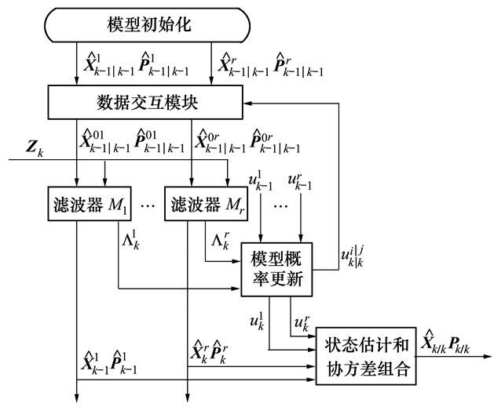

  <center>IMM一轮迭代的流程</center>

#### 5.3.2.3. 基于运动行为和环境交互

- 这种建模方法就是考虑更多的、**约束性更强**的**先验信息**，比如汽车在十字路口要么转弯要么直行，行人过马路会走斑马线（虽然有人不走）；在RoboMaster比赛中的例子也有很多，机器人往公路区走时就有可能要飞坡了；往环形高地走必然是要上坡了；检测到小陀螺状态，那就是处在对方机器人处于自转状态了......（第六部分会介绍反陀螺）

- 对于这些先验信息，我们可以用状态机的方式进行建模，一旦判断进入某种状态，就采用一种应对方式。虽然看起来简单，但如何确定处于哪种特定的状态也是其编程难点。

  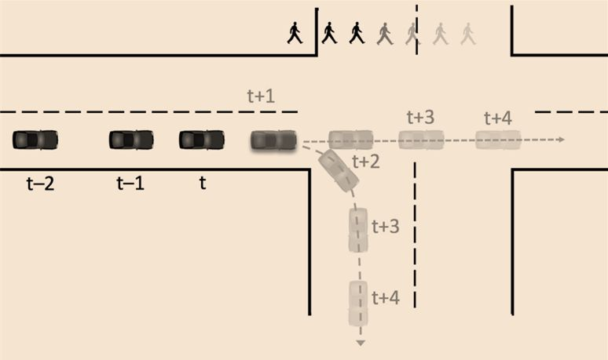

  <center>车辆和行人在十字路口的行为，图源《无人驾驶中的决策规划控制技术》</center>


#### 5.3.2.4. RNN

- 虽然说遇事不决量子力学，但在算法的世界里，要是难以建模怎么办？神经网络呗！将目标的运动离散化，得到的就是在空间位置中的一个序列，那么我们只需要将之前位置的三维向量$[x,y,z]$作为输入（也可以添加其他信息比如速度和加速度，但是笔者认为速度和加速度这么简单的、通过差分运算就能得到的信息，网络很容易就可以学习到），让网络输出一段时间后的位置即可。

- 我们也可以结合上一种方法，让RNN输出当前的运动行为和状态，然后再用模型的方法进行进一步的计算；或是反其道而行之，将可能的运动行为输入RNN中，使得RNN的预测输出更为精确。不过显而易见，想要融合更多信息，代价就是数据集获取和制作难度的上升和运算速度的下降。

- 也可以尝试当下火热的Transformer，由于其不限制序列长度且不需要像LSTM和RNN一样“记住”之前的信息，使得它对序列信息的建模能力更强。添加**时间注意力**能让网络聚焦到关键的运动信息上。

  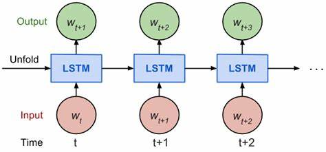


---


### 5.3.3.在图像处理中应用的滤波器：

这部分本来准备在OpenCV中地常用函数部分介绍的，但后来又想到在前面已经稍微涉及到了那些函数的作用，那么在这里就从信号处理的角度对二维信号的分析进行叙述。这一小节概括的内容可以算是真正的**图像处理**，即利用一定的方法增强/提取图像的特征、消除可能的干扰等，也是比赛中传统视觉算法的实现基础。

我们也可以将图像处理、机器视觉和计算机视觉进行简单的对比，图像处理更像是传统的**信号处理**，把图像视为空间上二维的亮度序列信号，通过逐像素操作或卷积操作等，提取图像的基本特征；机器视觉则是着重关注**测量**，需要得到的是严格定量的分析。如某个物体的长宽、面积、角度还有距离相机的位姿和距离等，大部分应用场景是工业自动化生产，一般需要用到图像处理的知识；计算机视觉的抽象层次最高，希望计算机拥有和人一样的理解能力，不单单是进行测量，而要抽取出高级的**语义特征**等。拿一张含有水杯的图片作为这三个任务的输入，图像处理输出的可能是利用canny边缘检测后得到的水杯轮廓，机器视觉算法也许会计算出水杯的真实高度，而计算机视觉程序则能告诉我们，图像中有一个水杯，甚至可以利用目标检测技术将其精确定位出来。

本节就介绍最基本的任务，图像处理。


#### 5.3.3.1. 频域分析

对于学过信号与系统的同学来说，Fourier Transformation已经是我们的老朋友了。既然它能处理一维序列，自然也能处理二维信号，图像就是一个二维信号，我们当然可以用它来对付图像了。我们着重关注的是二维的DFT（离散傅里叶变换），希望傅里叶变换能帮我们提取出图像的频率信息。对于时间序列，频域上的幅值低对应着不同频率正弦波的强度大小，频率越高则说明变化越**剧烈**；那么我们直接将这种关系推广到二维空间信号，频率高低就对应着明暗过渡的缓和程度，对于物体轮廓和边缘，亮度的突变就代表了高频信号，而平缓的区块则对应了低频分量。

下图中展示了三个基本频率分量（还有一种往右边倾斜的分量），频域和空间域仍然保持着**对偶关系**，高频分量在频域中**间隔大**，低频则是**集中**。对于表示信号非常关键的相位信息，也一起保存在频域中。不过由于要完整的表示出频域分量，需要四个维度（时域中的每个维度都对应一个复数，这是一个$C^2$空间），因此一般将相位谱和频率谱分开表示。

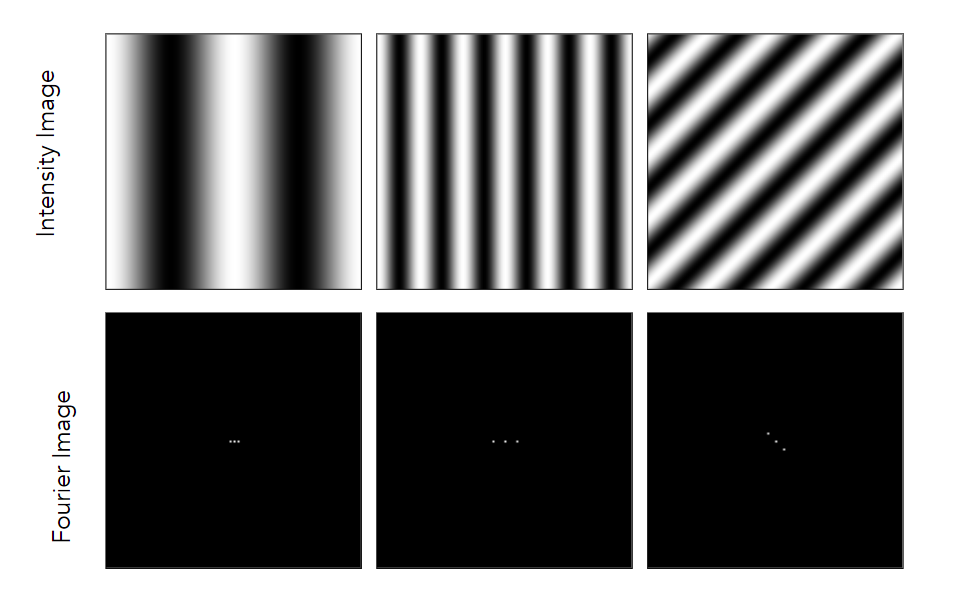

<center>图像的基本频率分量，以及他们在空间域和频域的对应关系</center>

那么，回到最根本的问题，为什么我们需要傅里叶变换？因为我们想要利用变换域的一些优越的性质——比如卷积在频域只是简单的相乘操作。之前我们介绍了Sobel算子和Laplcian算子在频域的实现都非常容易（微分变成了了标量乘法），低通滤波器、高通滤波器、带通滤波器更是手到擒来。线性时不变系统（在这里则是“线性空间不变系统”）的优良性质让我们可以单独处理每个信号分量，再通过可加性结合所有成分。


<center>对一张图片分别应用高通和低通滤波器，图源MIT opencourse 6.819</center>

你可以设计特定的滤波器来提取需要的图像分量，在之前介绍Vision attention的时候，我们就提到一个通道的数据就相当于原图的某个“频率分量“，只不过CNN的卷积核参数是利用反向传播自我学习出来的，而不是用傅里叶变换计算出来的。从这个角度上看，傅里叶变换产生的特征（正弦分量）就要比神经网络训练出的特征更”低级“一些。同样，我们可以取二者之长，比如给予每个正弦分量一个可学习的系数，让网络通过反向传播训练此系数，得到一组组合滤波器，这相对最基本的DFT能更好地提取图像特征，又可以网络降低训练的开销不需要单独学习卷积核上的每一个参数，提高运行速度（DFT的运行速度已经被优化到极致了，打过OI或者玩信号处理的同学一定听说过/掌握了快速傅里叶变换FFT）。

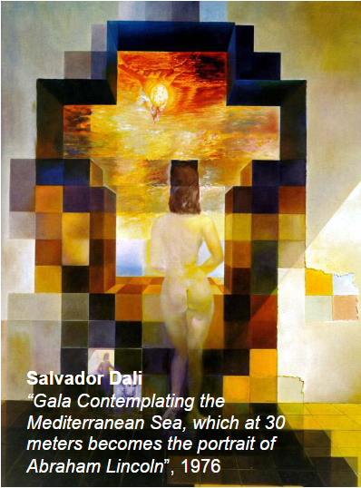

<center>眯起眼睛或取下眼镜，你将获得一个低通滤波器，看到作家的人头画像</center>


#### 5.3.3.2. 空域滤波

在信号与系统、控制理论中我们常常从时域和频域分析对象，那么在图像处理上我们也可以从空间域对图像进行操作。最常见的比如差分算子、二阶差分算子、高斯核等大家应该已经见怪不怪了；对于单一像素的逐个操作如阈值、双阈值、直方图归一化还有对比度增强等，也可以看作是非线性的滤波；还有之前介绍的自适应滤波，同样可以用在图像降噪去雾上。

- 降噪

  因为CMOS损坏、增益过高或是在低曝光、低亮度条件下拍摄照片时画面常常伴随噪点或椒盐噪声，最简单高效的方法就是利用均值滤波、中值滤波、高斯滤波平滑/去除这种噪点。如果是每个像素上都伴随随机噪声，根据其特性可以选用定制的自适应滤波（动态改变窗口大小和参数选择）或其他的相关滤波方法处理。不过，我们需要权衡效果和时间开销，如果前处理就花费了大量的时间，对算法的实时性是非常不利的。

  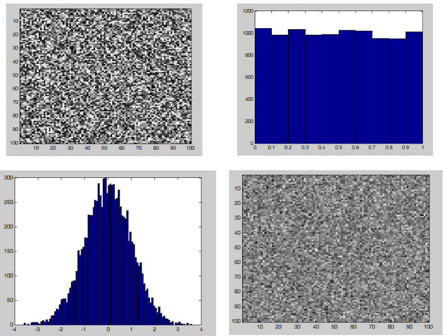

  <center>上图为随机噪声，下图为高斯噪声，图源MIT opencourse 6.819</center>

  

- 特征提取

  用于梯度计算的差分算子已经是老熟人了，提取边缘可用sobel算子和Laplace算子，比较少见的有提取倾斜边缘的roberts、只处理垂直方向的prewitt算子，上述的这些卷积核都是根据不同情况选用的，当然还有增加预处理和后处理的Canny边缘检测。这里列出他们的形状、适用情况及其优缺点。

  - Roberts算子，从核的设计就可以看出，比较适合处理倾斜的边缘，对于本身边缘较为明显的图像，处理效果较好，但是边缘响应较宽而且会受到噪声影响，若要缩小响应宽度可以增加后处理，减小噪声影响则增大卷积核：

  $$
  \begin{bmatrix}
    -1& 0  \\
    0&  1 \\
  \end{bmatrix}\begin{bmatrix}
    0& -1  \\
    1&  0 \\
  \end{bmatrix}
  $$

  - Prewitt算子，专注提取水平和竖直方向的边缘，鲁棒性相比前者更佳，但是提取出的倾斜边缘会呈现锯齿状，对于亮度变化不那么剧烈的图像也比较有效：
    $$
    \begin{bmatrix}
      -1& 0  &1\\
      -1&  0&1 \\
      -1& 0 &1
    \end{bmatrix}
    \begin{bmatrix}
      -1& -1  &-1\\
      0&  0&0 \\
      1& 1 &1
    \end{bmatrix}
    $$

  - Sobel算子，相当于使用了高斯插值的边缘微分算子，对于离中心更远的像素具有更小的权重（很直观，比如下方的核中，左上角对卷积核中心点的贡献应该比正上方小）。由于加入了高斯滤波，噪声容限相对prewitt有所提升，若希望得到更平滑的结果，同样可以扩大卷积核：
    $$
    \begin{bmatrix}
      -1& 0  &1\\
      -2&  0&2 \\
      -1& 0 &1
    \end{bmatrix}
    \begin{bmatrix}
      -1& -2  &-1\\
      0&  0&0 \\
      1& 2 &1
    \end{bmatrix}
    $$

  - Laplacian算子，对于离散的图像信号来说是二阶差分算子，能够更明显的凸出图像边缘：
    $$
    \begin{bmatrix}
      0& -1  &0\\
      -1&  4&-1 \\
      0& -1 &0
    \end{bmatrix}
    $$
    这是四方向的拉普拉斯算子，还有8方向（考虑两个斜45°角）的卷积核如下：
    $$
    \begin{bmatrix}
      -1& -1  &-1\\
      -1&  8&-1 \\
      -1& -1 &-1
    \end{bmatrix}
    $$
    如果想要凸显效果或减弱效果，读者可以自行尝试给边缘和中心设定不同的值，利用OpenCV中的`filter2D()`函数进行测试。

  - Canny边缘检测在各处有非常多的教程，OpenCV documentaion中也有示例，这里就简略过一下：

    1. 高斯滤波，把噪声去除，显然差分运算对冲激噪声是非常敏感的

    2. 用梯度算子求出边缘响应

    3. 非极大值抑制，根据把边缘缩窄/删除误检边缘

    4. 双阈值操作确定响应上下界，把范围内的响应留下

    5. 聚类？强响应附近的弱响应也会加入，而弱响应附近的弱响应直接删除


#### 5.3.3.3. 形态学操作

形态学操作是对**二值图**的轮廓和外形进行变换的运算（其实也可以运用于灰度图像，会有插值效果，但应用最多的还是二值图，直接凸显形态特征）。这部分内容是传统识别算法的老朋友了，我们手动设计一些特征并用形态学操作进行增强，或削弱噪点。

- 膨胀

  将结构元素应用在某个像素时，把当前像素替换成结构元素覆盖位置上的最大值，对于二值图来说，就是变成255，扩张边缘。

- 腐蚀

  和膨胀相反，替换为覆盖位置的最小值，收缩边缘。

- 开运算

  先腐蚀再膨胀，消除高亮度的狭长区域（和你的结构元素设计有关）或高亮噪点。

- 闭运算

  和开运算相反，消除黑色空洞区域，或将断裂的轮廓闭合。

- 顶帽

  原图减去原图的开操作，消除亮度较低区域下的高亮区域。

- 黑帽

  和顶帽操作相似，是原图减去闭运算，可以得到高亮部分的较暗区域。

- 形态学梯度

  一般指的是膨胀和腐蚀图像的差值，前述两种“帽”操作也属于形态学梯度。

- 统一接口

  OpenCV的形态学操作api为`morphologyEX()`，提供了上述所有操作的接口。

- 自定义结构元素

  OpenCV提供了`getStructuringElement()`函数方便我们自定义结构元素，你也可以使用Mat制作更复杂的结构元素。

关于这部分内容，网络上和教材中有大量的介绍，在此不过多赘述。**关键是理解形态学运算的原理**， 知道算法是怎么运行的即可。


---

---


## 5.4.目标跟踪

> 为了简化分析和学习过程，本文所指的目标跟踪皆为单目标跟踪。其任务是在给定某图像序列初始帧中的目标位置和范围（cx，cy，h，w）的情况下，预测后续帧中该目标（cx，cy，h，w）。

### 5.4.1.基本实现方法和原理

目标跟踪的pipline大致如下：

1. 提取初始目标的**特征**
2. 根据输入的初始位置与范围在之后的帧中依据**运动模型**和其他准则生成诸多候选框
3. 根据某种准则由此目标的特征计算候选框的得分
4. 选择一个**得分最高**的候选框或对多个候选框进行**信息融合**进而得到最为下一帧的预测目标

从以上的流程我们可以把目标跟踪划分为几个不同的研究领域：候选区域的提案方式（用什么运动模型？）、初始目标和候选目标的特征提取、候选目标的评分机制、模型更新（如何在运行过程中学习对象的运动模型从而优化后续的跟踪效果）、融合预测值从而获得更好的结果。在现行的几种模型中，我们常根据pipelin中1、3的不同把目标跟踪算法分为**生成式**和**判别式**。

- 生成式的算法通过提取初始目标的特征构建一个**表示模型**用于描述目标的特征，在之后帧中用此表示模型来分析候选框，和初始目标进行对比从而得到得分。其本质上是一种**模板匹配**，在提取初始目标特征的时候得到一个用于匹配的模板，随后在候选区域上应用该模板进行匹配。

- 判别式模型则是将跟踪问题看作**分类/回归**问题，希望习得一个判断函数（映射），将候选框投入此映射得到分类或得分。其本质上是利用初始帧的信息训练一个分类器/回归器，然后在之后的跟踪过程里不断更新分类器/回归器的参数。生成式和判别式的参数更新一般都是递归式地（熟悉的感觉有没有！递归滤波器它又回来了！实际上在早期的跟踪任务中，卡尔曼滤波器和粒子滤波器等常用于生成式模型中特征的匹配和预测框生成）。

在 *5.0* 部分我们已经介绍了为什么要使用目标跟踪算法，其高速的特性使得我们可以降低算力消耗，甚至可以在用目标检测得到第一帧后同时运行目标跟踪和目标检测算法并对两者的结果进行融合（目标检测依赖gpu算力而目标跟踪除cnn方法外主要使用cpu，实测cpu在运行视觉算法的时候占用率大概只有20%-30%，不过这貌似和之后的CNN-Based方法有点套娃了），大大提高置信度。在实际工业应用中，目标跟踪、目标检测和重识别也常常配合使用。

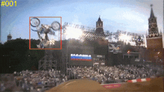

<center>目标跟踪示例，可以看到多种颜色的候选框，左上角是从开始跟踪到当前时刻经过的帧数</center>

本节我们主要介绍几种经典的跟踪方法。


---


### 5.4.2.光流法（Optic Flow）

**光流法是典型的生成式模型**。顾名思义，光流要追踪的就是“光的流动”，即计算或估计两帧连续图像中相同点的移动。稀疏光流将会计算视频流中数个**关键点**在之后帧的移动轨迹；而稠密光流则是对图像上的所有像素都计算移动距离，这将会在二维平面上得到一个**向量场**。

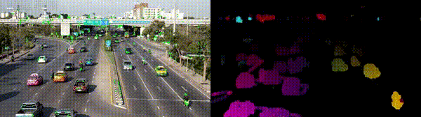

<center>稠密光流和稀疏光流的对比 -图源知乎https://zhuanlan.zhihu.com/p/74460341</center>

- 传统的算法包括**LK**（Luca-Kanade，经典的稀疏光流算法）和**Farneback**（稠密光流，这个算法对数学功底尤其是线性代数的要求比较高，是作者的博士论文，请参考[Two-Frame Motion Estimation Based on Polynomial Expansion](https://link.springer.com/content/pdf/10.1007%2F3-540-45103-X_50.pdf)）以及他们的变种和改进，新兴的算法包括基于深度学习的光流估计和基于运动场能量的算法（最小作用量？）。

  两个传统算法都有一个假设：物体亮度不变。以稀疏光流为例，我们希望特征点在两帧之间的亮度不变，这样才能较好地追踪它们的运动，在当前帧和之后帧的像素点间建立联系。算法的具体流程和推导可以参考这两篇文章，已经解释的非常好了：

  1. [稀疏光流KLT - 知乎 (zhihu.com)](https://zhuanlan.zhihu.com/p/88033287)
  2. 光流估计 - 知乎 (zhihu.com)](https://zhuanlan.zhihu.com/p/74460341)

- 而使用CNN进行光流估计的开山之作是FLowNet，它针对的场景是稠密光流。相信经过之前的学习，你应该已经很熟悉这类算法的流程了：我们希望网络的输出是一个**二维向量场**——那么输出的尺寸和输入相同（这似乎和分割任务完全一致！)，并且每个像素位置上应该有两个值，这样就能代表一个二维向量，表示两帧之间该点的动向。那么网络的结构就呼之欲出了，我们需要一个**全卷积**网络或反卷积网络，形如曾经红极一时的U-Net。其实也可以看作一个**Encoder-Decoder**的结构。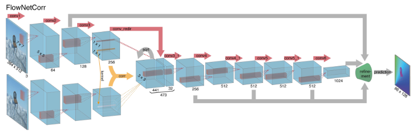不过，应该如何进行标注？难道要人眼逐帧辨别像素的运动？这个工作量有些太吓人了。FlowNet的作者非常有创造力，他将一些其他物体以图层的方式叠加到背景下，作为第一帧图像，随后对这些物体进行“稍稍”的**仿射变换**以形成轻微变形和位移并再叠加到相同的背景下，得到第二张图像：

  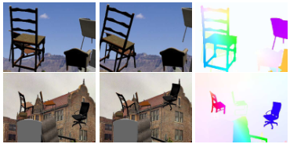

  <center>右侧图像显示了两帧之间移动的像素点，不同颜色表示位移矢量的方向，颜色深浅表示矢量大小</center>

  这样就可以在几乎无人工成本的情况下得到大量的label data，作者还用这种方法制作了一个数据集，就叫“flyingchairs”。

  后续FlowNet还推出了2.0版本，主要是加入了级联结构，实现光流估计的coarse2fine过程，预测得结果变得更加精确并且在速度远超传统算法的情况下精度实现了SOTA。

- 更多关于深度光流估计的论文，可以参考这个系列文章：[2019-2020基于深度学习的光流技术调研 - 知乎 (zhihu.com)](https://zhuanlan.zhihu.com/p/128672851)

对于RoboMaster比赛来说，稠密光流没有很大的用处，我们不需要知道图像上每一个点的运动趋势，这毫无意义（当然RUMA除外，稠密光流是视觉SLAM中一种很好的建图方法）。稀疏光流对于我们来说更有价值，如果对装甲板进行跟踪，我们可以直接跟踪装甲板灯条的四个角点，在之后帧中都不需要进行后处理就可以直接进行PnP解算了。对于雷达系统，我们也可以利用光流来确定运动的物体，进而划分ROI减小识别的压力。


---


### 5.4.3.以KCF为例的相关滤波（kernel correlation fitlering）

KCF是典型的**判别式**方法。而相关滤波方法的始祖是MOSSE（minimum output sum of squared error filter），它首次将信号和通信领域的方法引入目标跟踪。相关滤波是用于衡量两个信号相似程度的方法，因此从名字中就能看出，它通过对初始目标在线训练一个滤波器来检测候选区域和初始目标的相关性，响应最大的即是当前帧要跟踪的目标。相关滤波类算法的最大优点就是其无可比拟的速度（150FPS+），在KCF横空出世之前，跟踪算法要么勉强达到精度需求但是根本无法在线运行，要么准确度低得令人无法接受。

KCF对数学知识的要求较高，如果你认为自己的数学功底还不错，或曾系统地学习过矩阵分析、信号处理、复分析和傅里叶分析，那么你可以挑战一下论文[原文](https://ieeexplore.ieee.org/abstract/document/6870486)的阅读。虽然其背后的知识较为复杂，但是代码实现起来却出奇的简洁清楚，可能这就是数学的魅力吧。

这一小节首先总览一下相关滤波方法，然后按论文的结构，从每一个组成block和总体的pipeline对KCF进行介绍。

#### 5.4.3.1.相关滤波


---


### 5.4.4.NN-Based

这部分内容在我们前面介绍光流法的文章中已经看到了一些端倪，根据前面的知识我们应该可以轻松地得到一种基于CNN的跟踪器：输入前一帧图像和初始的位置还有当前帧图像，输出即为预测的bbox。当然，这只是CNN-based方法其中的一种。聪明的你应该可以分析得到，刚刚提到的pipeline代表了一种**判别式的方法**的**端到端**框架，我们利用深度网络提取深度特征生成滤波器（卷积核），然后再次利用深层的网络作为分类器和回归器对浅层网络滤得的特征进行判别并输出当前帧中的目标框。

>  一定要区分生成式模型和判别式模型的不同，如早期目标检测算法中常用的HOG/SIFT/ORB/LBP/SURF等就是先对模板/原图进行**特征点提取**和并根据特征点周围的特征制作**特征描述子**，随后在后续帧图像中再次运行相同的流程找到特征点及其对应的描述子随后对两帧之间的特征点根据描述子的相似程度进行匹配。因此生成模型的核心是**特征提取+特征匹配**，而判别模型则是对可能的候选目标进行**分类**或**回归**（打分）。在 *5.5* 中我们会以一种经典的特征点匹配算法为中心，详细介绍生成式模型和传统的目标检测以及其他拥有良好的尺度/亮度/旋转/平移不变性的特征。

在前面我们已经见识到网络强大的特征提取和表示以及对非线性映射的拟合能力，下面给出在目标跟踪中能用能用网络替代的模块（包括全网络的架构）：

#### 5.4.4.1.特征提取模块

传统跟踪算法中直接使用像素级特征的大有人在，也有使用HoG、HoColor这些稍稍高级一些的特征。他们的优点就是计算起来非常快，缺点也很明显：表达能力相对较差。而深度特征的表示能力在这几年来的飞跃式提升是大家有目共睹的，自然而然我们可以使用CNN对初始帧进行处理得到feature map。有改进者结合了深度特征和简单的梯度/颜色特征，加入一个置信度模块：对于简单的样本就直接利用速度最快的HOG等特征进行初步筛选，如果一看就是背景直接跳过即可；若出现置信度不高的情况，再进一步使用CNN进行提取。这也是很多**级联**方法的惯用trick，如经典的Haar人脸检测器就是利用这种方法避免让所有输入都通过整个流程。

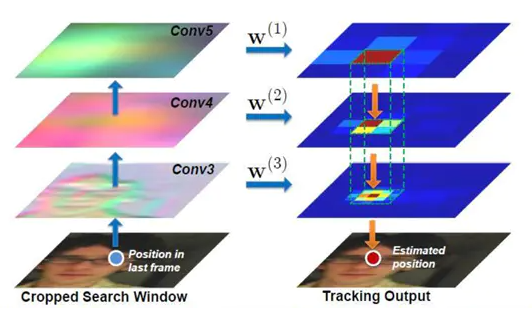

<center>HCF(hierarchical)是典型的CNN特征提取器+correlation filter方法</center>

特征提取器有两种方法，离线和在线。离线的提取器一般就是在ImageNet等训练集上进行预训练，然后直接用于生成深度特征。而在线学习则是和其他传统方法一样，从前一帧的GT附近截取数个ROI并在其上进行在线训练。也可以采取中庸之道，使用pre-train+在线fine-tune的方法。

cnn的卷积操作应当为典型的**空域卷积**，前面介绍KCF的时候我们就知道频域中的许多性质可以帮助我们加速运算——卷积在频域变成了简单的乘法。其中，在线方法可以在频域利用傅里叶变换的性质（复矩阵对角化/循环矩阵对角化/FFT等）加速提取特征和训练。

针对目标尺度和角度的变化，可以采用多尺度训练/FPN等目标检测中常用的技巧来进行针对性优化。至于亮度/对比度等不变性，对于网络来说都是小菜一碟，只需要在训练时装入经过数据增强的样本即可。

#### 5.4.4.2.候选区域生成

不同的跟踪方法有不同的候选区域生成策略，最简单粗暴的方法就是对整张图片都运行（这就没有任何”策略“可言了）。这一个步骤也可以对应到目标检测网络中的**回归器**。

相关滤波方法一般是采样GT周围的ROI（例如KCF就是把GT扩展2.5倍，利用循环矩阵在频域良好的性质进行计算），生成式方法则是寻找数个特征点/群，将那些有**较多成对匹配点的区域**作为ROI。之前在 *5.2.6.6* 中介绍vision attention的时候提到有通道域和空间域的注意力，那么网络可以利用attention机制对ROI中的特定区域进行筛选，减小搜索空间。

再进一步就可以利用 *5.3.2* 中介绍的运动学建模和运动预测方法，利用历史的**时间序列**数据建模物体的运动，KF、PF、IMM等方法在目标跟踪中都是可用的，不过由于深度信息的缺失（仅仅在二维平面上估计运动，丢失了$z$轴的信息），处于复杂运动状态下的物体很难用线性预测器预测。因此可以使用网络替代这些组件中的部分模块，用网络的输出提供协方差/噪声建模等信息，更好的建模非线性因素。

既然是序列信息，RNN/LSTM/Transformer必然也是可用的，并且可以增加**时间注意力机制**（对比通道域和空间域，在RNN中是另一个维度），建模历史不同时刻帧对于当前跟踪的重要性。

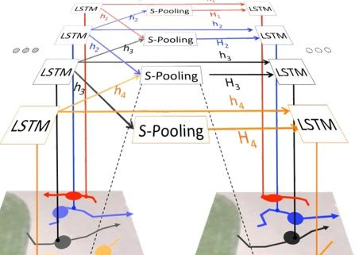

<center>利用LSTM建模物体的运动从而生成ROI</center>

#### 5.4.4.3.分类器/回归器(fine-tune)

之前介绍的判别式算法，其滤波器(可以看作分类器)都是**在线训练**的，而对于由神经网络构造的判别器和回归其，更合适的方法是离线训练。对于分类器，较好的方法是参照人脸识别中常用的**few-shot learning**，设计一个判别函数，利用triplet损失或Siamese网络来进行训练。不了解这两者的同学可以参考[吴恩达深度学习第四章-Siamese网络](https://www.bilibili.com/video/BV1FT4y1E74V?p=142)以及[吴恩达深度学习第四章-Triplet损失](https://www.bilibili.com/video/BV1FT4y1E74V?p=143)。

对于Siamese（一般称作孪生网络），我们可以并行训练两个网络，分别用于**提取**gt和候选区域的特征。

> 一般来说就是在提取模块上再进一步，其实CNN的特征提取和映射很难分清界限，你可以认为前几层是在提取，后基层是在映射，这里我们暂且把他们直接拆分为2个部分即提取+映射。

然后，对cnn输出的最后一层特征进行embedding（再提一嘴，也可以直接当作最后输出的特征就已经是嵌入在某个空间中了），并利用一些尺度度量的手段如**欧式距离**、**海明距离**等等来计算两个向量的距离/估算相似度。最后输出一个分数，高分代表相似，低分代表不确定/不相似。许多时候我们也不需要直接训练两个网络，而是直接训练一个网络并在另一个网络上共享参数，即下图中的”share“所示的虚线。

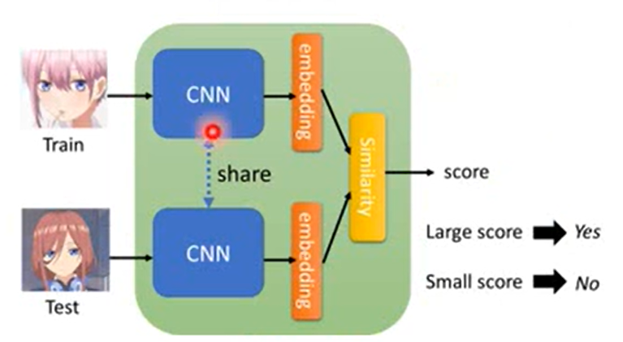

<center>一个孪生网络的示例，图源李宏毅机器学习课程sliding</center>

在triplet loss中，我们期望相同的同类别样本的距离**尽量小**同时希望不同类别样本的距离**尽量大**，因此设计的损失函数如下：

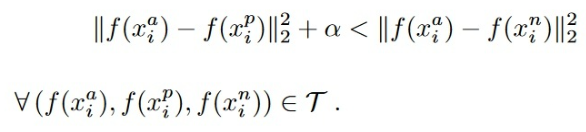

其中$x^a_i$是anchor即参考样本(正类)，$x^p_i$是正样本，$x^n_i$是负样本，$\tau$就是所有成对的训练资料（在训练中可以取任一样本作为anchor，然后取另一和anchor同类的样本作为positive，最后取任意一个其他类的样本作为negative）。加入的$\alpha$是一个极小的值用于正则化，防止网络”走捷径“：在**最小化同类样本距离**的同时却使得**正样本和负样本的距离很接近零**，即前一项损失几乎是零，第二项只要稍稍大于零就完成了训练目标。最后，网络输入两张图像（gt和ROI），输出他们之间的距离，根据这个距离进行判别即可。

 对于回归器而言，其目的是输出当前帧跟踪框的位置。但是上面介绍的分类器都是运行在某个区域（ROI）上的，意思是我们要先确定用于提取特征和匹配的框，然后再运行分类器，然而一般可能的预测区域都是通过 *5.4.2.2* 中介绍的方法得到的。那么在这里，我们则是执行类似目标检测网络中two-stage的方法，候选区域生成作为“RPN”，后面再跟一个回归器用于对候选框的位置进行微调。不过对于**判别式的跟踪**而言，倘若回归器生成的bbox太过于贴合目标，有可能还会**适得其反**：不同于目标检测，目标跟踪中背景信息也是很重要的特征（*特别是对于只提取上一帧 bbox中特征的方法* ），tracker应当很好地分离背景和前景，并且获取他们之间的差异，倘若完全没有提取到背景信息跟踪器将会很难区分下一帧的目标和背景。

#### 5.4.4.4.端到端方法 

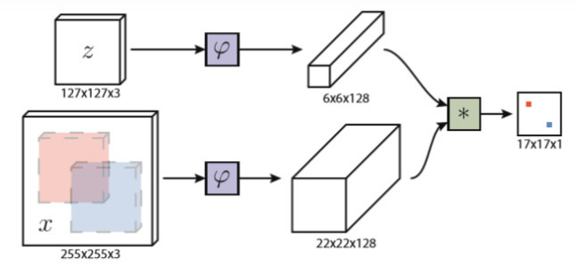

- 学习过之前目标检测的同学应该对这个词语非常熟悉了。我们之所以这么执着于end2end，正是因为其框架和pipeline的简洁性和同一性。上图所示的就是SiamFC，一个端到端的跟踪网络。其实本质上是一个相关滤波的框架，只不过所有模块都使用CNN实现：上方的分支是特征提取器，将前一帧的bbox送入网络$\varphi$进行卷积运算得到6x6x128的**滤波器**，下方则是输入当前帧整张图片，还是通过$\varphi$提取特征（参数共享的思路），得到22x22x128的feature map；最后用第一个分支得到的滤波器对feature map进行卷积（也可以说是相关运算）运算，可以得到一个heat map代表原图上各个位置的响应，自然响应最大的地方就是我们要找的目标了。

  参数共享和第一个分支中利用生成的特征作为判别式算法中的filter的思想是这个网络的最大特点。在SiamFC之后有大量工作顺着其思路进行扩展，但是都是基于相关滤波展开的，比如添加attention、增加响应之间的交互、更好的特征提取方法等。

- 另一种思路是由SORT（simple online and realtime tracking）提出的**tracking by detection**，字如其名，利用目标检测实现跟踪。不过这个方法最开始其实算不上end2end。其框架包括一个用KF实现的预测器、一个目标检测网络和用**匈牙利算法**实现的匹配模块。这其实是为了解决多对多跟踪即MOT而提出的方法，不过其思路很值得借鉴故在此简单介绍，对于单目标跟踪同样可以使用该思路。

  检测过程如下：首先用第一帧的目标初始化KF，随后在第二帧中通过检测网络得到当前帧中的数个目标，这时候就需要用匈牙利算法对检测网络输出的bbox和前一帧的gt基于cost最小的原则进行**一对一匹配**（可以参考*5.2.6.8* 中DETR的相关部分）；完成匹配后利用两帧的差异更新滤波器的参数，至此完成一轮迭代。

  显然，SORT的性能非常依赖检测网络的准确度，若检测框数量多余或少于前一帧，就需要进行特殊处理。而且其预测方法也过于简单，没有增加更多的先验，导致对快速物体的跟踪效果不是特别好。因此后续提出是DeepSORT对SORT进行了改进，引入了当前帧和前一帧的IoU、对物体运动更详细的建模、用于衡量两帧目标相似度的Siamese网络等方法改善SORT的性能。

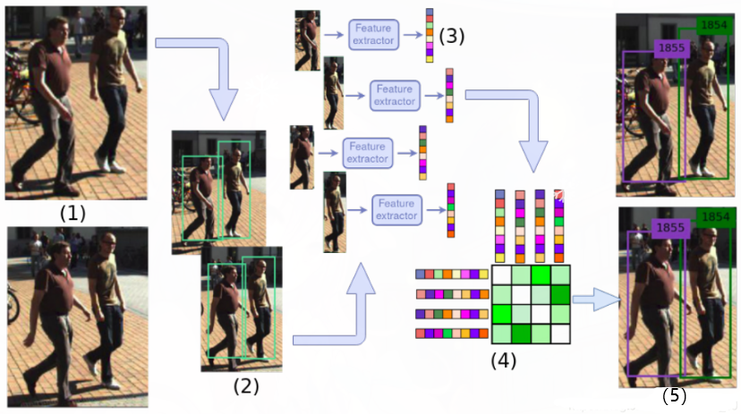

<center>DeepSORT的检测pipeline</center>

当然DeepSORT也还是有很多问题，后续也提出了很多针对性的改进：

1. Re-ID网络（即Siamese+KM）可以直接和检测网络融合，做到真正的端到端
2. 若一个物体在很长一段时间都被很好的catching，应该可以给予其更大的权重
3. 不单单使用tracking by detection的方法，追踪器可以弥补检测器的漏检
4. 使用除KF外更好的运动模型，参见 *5.3.2* 的运动建模部分 

对于RM比赛，由于目标较为稀疏并且我们的相机采样率极高，甚至可以直接使用tracking by IOU的方法，直接使用两帧之间目标的IOU来判断当前检测框内的物体是否是同一物体。


---

---


## 5.5.参数自适应方法和稳健特征

不论是传统的图像增强算法还是神经网络，总有一些**参数**是需要手工调整的，而这些参数得设置是否恰当，往往会影响整个算法的表现。手动设置的参数往往是针对部分情景和特定目标的，若环境或任务发生改变，之前的参数很可能会失效。这也是为什么我们都追求一种能够适应尽可能多的场景的参数设定方法，亦或是尝试**元学习**以指导参数的自动选取，减少人为干预。

> 不过即使再怎么追求hand-crafted free，我们似乎无法逃脱设置参数的魔咒——用于选取参数的算法在另一种角度来看仍然是一种参数，也就是深度学习中常说的**超参数**，而超参数之上亦有参数，这就是meta learning。如果我们希望不要人为设定meta learning的参数呢？那便有了meta-meta learning，我们可以不断增加meta的前缀直至无穷无尽... 即使是下面介绍的自适应方法本身，也算是一种prior knowledge，或者约束。

因此，参数自适应的方法就显得尤为重要了。我们希望能够在分割图像的时候自动选取合适的阈值，希望在分类图像的时候得到错误率最小的置信度阈值，希望在获取图像特征的时候划分得到最富有语义信息的部分······

本节将会介绍**传统的图像处理**中常见的参数自动选取和阈值自适应技术，以及运用了这些方法的特征点检测/目标i检测算法如LBP/FAST/SURF/ORB/SIFT/HOG。此节的内容也会更贴近实际应用，会稍微涉及一些比赛中的实用coding方法。

> 理论上来说，这一部分应该放在神经网络和CNN之前，因为CNN其实算是借鉴传统方法发展起来的，其特征表和提取都算是传统方法的**泛化**结果。

### 5.5.1. 阈值自适应与不变特征

对于黑白图像（彩色图像同理），亮度/像素点的值是最基本的特征。一般的计算机视觉任务都需要对输入进行预处理如标准化、提亮/暗化、锐化/模糊等，所以首先来看看像素级特征和形态学特征。

#### 5.5.1.1. 亮度自适应

由于相机曝光/光圈/外界光线环境的变化，输入的图像常常有着不同的视野亮度。倘若我们希望在预处理中对所有图像进行整体提亮/暗化以**达到相同的亮度水平**，显然设置一两个一成不变的参数是不够的。*不同的* 图像要达到*相同的* 效果，就提醒我们应当使用自适应技术。 最简单的方法是对所有像素值求平均，然后使得所有图像的亮度均值相同，这样在稍后的处理中就可以用一个相同的参数对付所有图像了。

不过增减均值有时候并不是最好的选择，若我们希望在稍后得到图像的**形态学特征**，常常需要进行**二值化**处理，这时候阈值的选取就非常关键了，如果部分图像整张都偏暗或偏亮，阈值稍大可能导致特征被删除，太小又可能留下过多不需要的形状；特别有时候我们希望增大图像的对比图突出边缘和纹路等细节，那可以使用**直方图均衡化**的技巧，其将一张分布不均匀（常常是有大块明暗区域）的图像的直方图变得更接近均匀分布。这能够大大提升图像的对比度，使得明暗的差异增大，让我们更好地分离需要的部分。其基本思想是对在直方图中密度大的区域进行展宽，而对密度小灰度级进行缩减。

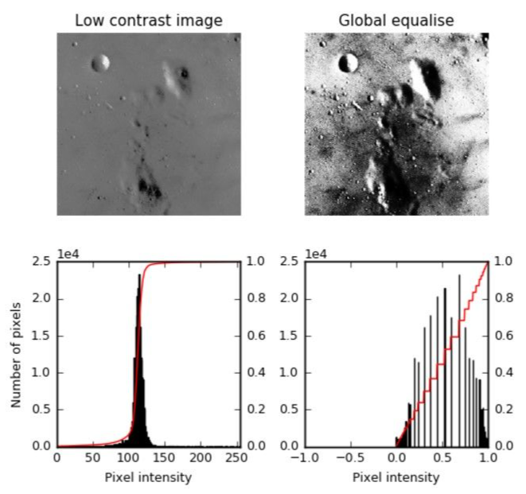

<center>Histogram equalization的例子，图源知乎https://zhuanlan.zhihu.com/p/29772177</center>

经过HE的操作，原本不明显的边缘和纹理也都变得更清晰了，最重要的是现在可以方便的选择阈值进行二值化操作了。

根据预处理目的的不同，我们也可以把没有达到均值部分的像素值与均值的差看作是某种**损失**，若相差越大就要施以更大的”惩罚“，即在稍后将此像素值增大/缩小得更多一些。比如L1 loss或L2 loss都是可用的，也可以采用一些更平滑的曲线。


#### 5.5.1.2. 局部阈值自适应

前述的亮度自适应方法在一定程度上可以解决图像亮度变化造成的影响，但是考虑这种情况：我们分割出一张报纸上的文字（黑色字体），但是报纸的一侧暴露在阳光下，而另一侧则在黑暗中。那么即使进行了直方图均衡化，由于其亮度的”两极分化“，高亮和强暗区域仍然是糊成一团。这时候就应该选用**局部阈值**或**局部直方图**的方法了，其本质是使用比全局统计特征（即直方图）更精细的分类。

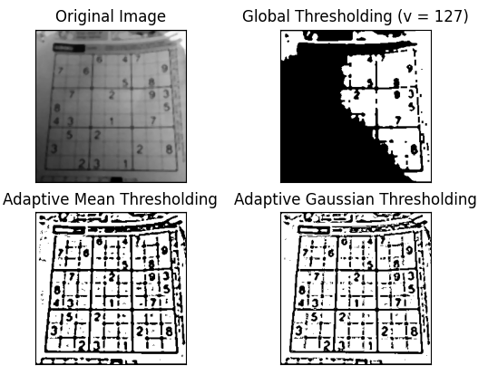

<center>使用局部动态阈值和单一阈值的对比</center>

可以看到，采用动态阈值后很好地解决了这个问题。其实现过程也应该很容易想到：使用一个mean slide window或者gaussian slide Window处理整个图像，对部分区域统计均值/加权均值并由此设置均值的1/5或1/4（这个值仍然是人为设定的，取决于对细节的取舍）作为阈值，便可以得到上面的效果了。

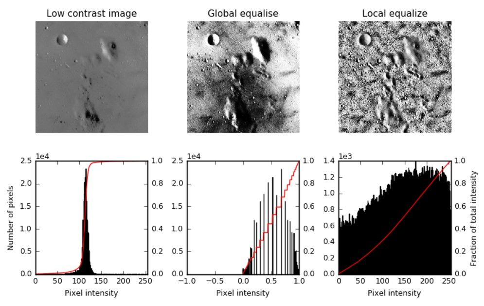

<center>使用局部直方图均衡化对比全局均衡化，中间下方的纹路差别更大了</center>

局部直方图均衡化可以取得的效果和动态阈值相仿，不过和全局直方图均衡化希望得到形态学特征相比其更注重的是**纹理和细节**：对比上图中的global equlize和local equalize的结果就可以看到，若只希望得到外形轮廓即形态学特征，应该使用全局直方图均衡化，中间下方的沙坑轮廓非常明显；而要获取所有纹理特征，则应该选用局部直方图均衡化。

其步骤也同样非常简单，取滑动窗口和一定的步长（你看吧，滑动窗口的大小的步长以及是否加padding仍然是需要人为设定的**超参数**，使用不同的参数可以得到不同的效果，可以自己想想试试看），对滑窗内进行均衡化即可。


#### 5.5.1.3. 形态不变特征

> 注意区别这里介绍的是**形态学特征**（morphology feature，指的是图像中具有一定形状的图形）而非前述的一般特征，不过形态学特征是作为一般特征的**子集**。请结合具体的例子进行理解，如RoboMaster比赛中的装甲板识别任务。

在处理形态学特征的时候，我们可能希望寻找一些由不同区块的轮廓组成的目标，在比赛中常见的即装甲板灯条的匹配，其在正常曝光下从远处看是两个对称的梯形，而我们一般将其视作一个轮廓进行处理。当我们希望匹配处于同一个物体上的两个或多个形态特征（对于装甲板识别就是找到处于同一块装甲板上的灯条），应该寻找对**旋转/尺度/平移**都有不变性的特征。

以灯条匹配为例，装甲板距离相机的距离会导致灯条长度的改变，但是不论距离远近，处于同一块装甲板上的灯条的**长度比**始终应当保持不变（根据 *4.1* 介绍的相机小孔成像模型），这就是一个**尺度不变特征**，显然灯条的宽度比也同样是一个很好的衡量指标。而由长宽相乘得到的面积，也可以作为一个筛选/匹配的准则，不过应该使用面积比而不是面积（面积比和长/宽比似乎在一定程度上有一些耦合，不过可以对筛选顺序进行合理排序，面积比可能更容易清理哪些非灯条的目标，在 *6.1.1* 我们会再进行介绍）。

至于平移不变性，这对于非定位和non-global-based的特征来说都是可以得到保证的，因为要利用形态学特征进行匹配，**首先就应该定位这些轮廓**。

最后是旋转不变性，**角度**是候选的常客，只要是目标在空间中进行的是**刚体变换**，变换后的特征仍然会服从角度一致。但是对于out-of-plane的投影变换（相机成像）来说，**物体的任何性质都不会被保留**。但是对于畸变程度较小的镜头和真实尺度较小的目标，在数倍焦距外的相对角度被投影到2d平面后往往只会产生轻微的形变，因此之间的相对角度仍然可以作为一个筛选的标准，一般只要适当放宽筛选条件即可，这也适合对匹配目标进行初步筛选，删除那些极端值。

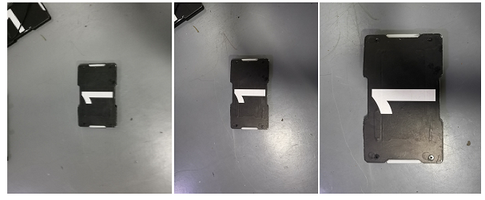

<center> 两个灯条的长宽比等几何性质拥有的尺度不变性特征</center>


---


### 5.5.2. 统计特征和global-based方法

#### 5.5.2.1. 基本模型

早期的计算机视觉任务（即深度网络出现之前）最关键的部分仍然是特征工程，即特征的**提取**和**表示**。以分类任务为例，我们需要找到一个好的特征表示，然后利用分类器（常常是SVM）进行类别区分。下面这张图很好地展现了识别的通用方法：

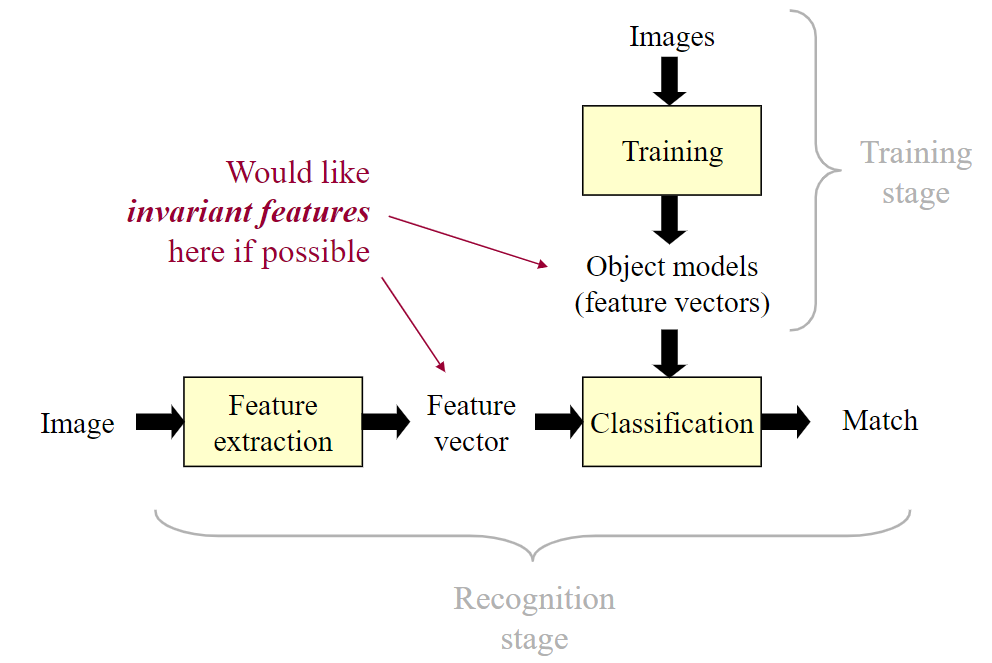

<center>我们常常青睐具有不变性的特征</center>

若能够提取到对于某些变换具有不变性的特征，对于识别的准确度将会大大提升。最常见的不变特征包括**亮度不变、对比度不变、尺度不变、旋转不变**。而对于在 *5.1* 中反复提及的**特征的级别**，我们可以提出以下的关系图：


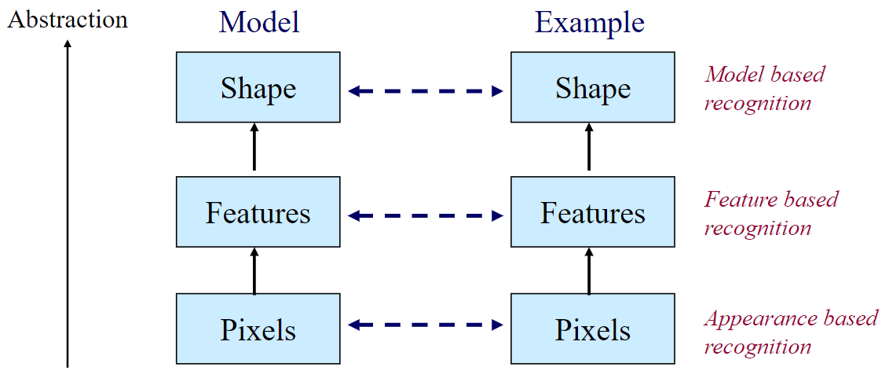

<center>“高级”的特征拥有更好的抽象表示</center>

进一步抽象，我们还可以得到所谓的**语义信息**（semantic info），即用人类的知识描述的可以抽象出某种**概念**（concept）的特征。像素级的显然是最低的特征层级，通过对像素进行操作如卷积、聚类、形态学处理等，我们可以得到稍微高级一些的特征如纹理、边缘（可以回看介绍CNN的部分）；再往上就是形状、轮廓；最后逐渐上升到概念如苹果、汽车等。越高级的特征往往拥有更好的可分性，因为它们只属于少数几个不同的类别，而不像低级特征一样，为许多不同类别的物体所共有。但是高级特征却缺乏细节信息，这也是CNN中常用FPN进行特征融合的原因。

在本节余下的内容就将介绍在CNN和Transformer出现之前我们是如何提取并表示特征然后由此实现各种计算机视觉的任务的。通过这部分的学习相信你也可以找到深度学习方法和传统方法之间的联系，并更好地融会贯通。

最原始的图像识别/分类方法就是对像素级的特征进行匹配，没错，我们说的就是**模板匹配**。首先获得一张目标的图像作为模板，然后将此模板在输入图像上进行滑动，并逐窗口计算相似性。模板匹配利用的就是最低级的像素级特，显然是没有任何的不变性的，即使目标和模板有微小的不同，计算得到的方差都大得惊人。

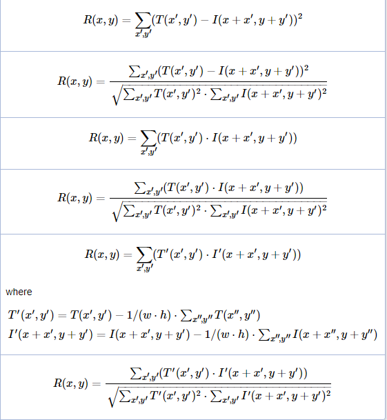

<center>模板匹配中常用的计算匹配误差的算法</center>

#### 5.5.2.2. 直方图特征

那么如果将特征稍微提升一个层级试试呢？这就是下面要说的**直方图描述子**。我们将一幅图像分割为数个网格，并将网格中的像素取平均得到的值进行统计，得到一个直方图。得到的直方图可以看作是一个**离散分布**，亦或是一个**特征向量**：

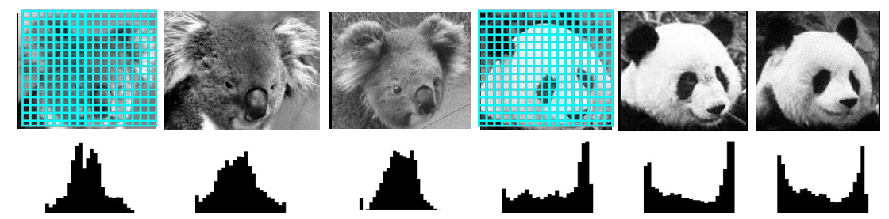

<center>不同的熊猫和考拉对应的直方图统计结果，可以看到它们各自的直方图大体上是一致的</center>

这样，我们就可以利用SVM或与anchor vector（参考向量）的内积来获取衣服图像的分类了。从三张熊猫的图片中我们可以发下，虽然它的头发生了轻微的转动，但是统计直方图总体上保持一致，是中间低两边高的形式，计算两个直方图的KL散度或欧氏距离，显然也不会差太多。稍微想想你就能发现，直方图统计拥有良好的旋转不变性和较小的平移不变性。

若是有颜色的图片，只需要分别统计RGB的直方图，将三者concatenate就得到了其特征向量。若希望拥有光照不变性，最简单的方法就是对直方图进行**归一化/标准化**，因为直方图统计的恰恰是gloabal feature，因此全局的亮度变化对于归一化后的特征不会产生太大的影响。对于不同角度顺逆光拍摄的照片，还可以恰当地使用前面介绍的直方图均衡化方法提高不同图片之间的差异性，防止直方图出现聚集。

不过，这种特征的缺点也很明显：它显然还是太过低级了，并且要求在分类的时候目标恰好占满整个画幅以弥补其不具有尺幅不变性的缺点，若没有占满则会引入大量的无意义的**背景信息**（虽然有时候背景特征是很关键的一个部分，可以提供和前景有关的语义特征和潜在信息，这种低级的统计特征显然无法捕获到两者的关联）。

#### 5.5.2.3. gradient-based feature

顺着直方图的思路，还可以使用什么稍微高级一点的统计特征？联想图像处理中常用于获取边缘和纹理的方法：求梯度——**梯度直方图**（histogram of gradient）的方法就呼之欲出了。我们可以首先提取全图的梯度得到梯度图（一般在此之前先做一次高斯滤波，因为微分算子对噪声非常敏感），然后将梯度的方向划分为若干个bins（如每隔45度一个格点），最后增加该位置梯度位于对应方向上bin的值。

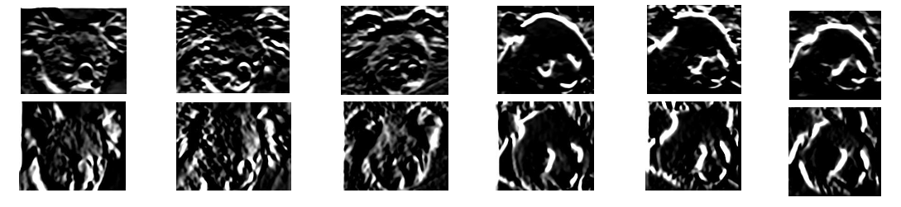

<center>考拉和熊猫的图像用sobel算子卷积后得到的响应</center>

> 梯度直方图和一般的直方图的不同在于，梯度包含**方向**和**模值**，因此无法像像素值直方图一样用一维的向量来表示。当然，可以使用二维直方图进行统计，不过这会带来不同直方图间方差过大的问题。因此，我们采用这样的方法，将梯度的模值累加到属于其方向的bin内，得到梯度直方图。
>
> 例子如下，求梯度后得到方向（左侧）和模值（右侧），如左上角的（10，1），其落在0-40°的区间，故将其值累加到该bin中。
>
> 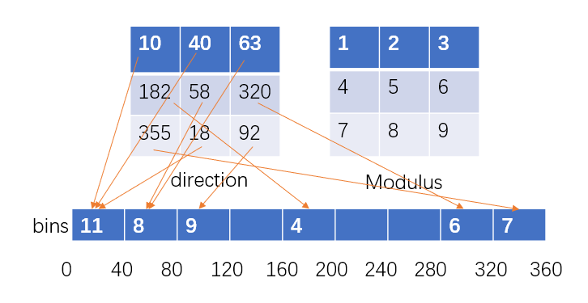

和像素值直方图一样，可以进行归一化，得到的向量就可以作为特征向量用于训练分类器了。虽然使用的特征比原来稍微高级了一些，但是缺少尺度不变性以及容易受到背景影响的缺点还是没有得到改善。那么应该如何区分背景信息和前景信息，提取最重要的特征呢？我们将在下章介绍local-distribution的时候再提。

#### 5.5.2.4. PCA-face

这里再介绍一种经典的全局特征方法，PCA-face。看这个名字大概就能猜出他的过程：利用训练集中的数据进行主成分分析，然后将输入在top-k个分量上进行投影得到特征向量，并用该特征向量和不同的人脸计算内积选取距离最小的那个作为分类输出。不过稍有不同的是，它巧妙地将一张图分解为**均值**和**残差**部分，首先得到整个训练集的协方差矩阵，然后对协方差矩阵进行特征分解并取最大的k个特征向量作为basis，这样就可以把输入减去均值之后在“脸基”上进行投影得到输入图片的特征向量（注意此特征向量和特征分解中的特征向量含义不同）。

> 一张$m*n$的图像本身作为二维输入，首先将其展平成一维的向量，计算所有$t$张图像展开后的向量的均值，再将所有向量减去均值便得到单张图像的残差。随后使用$t$个$m*n$的向量计算$mn*mn$维的协方差矩阵，即$\frac{1}{t}\sum_i^t \mathbf{x_i}\mathbf{x_i^T}$。因此特征向量仍然是一个长为$m*n$的向量，将其切分成原来的形状就得到图像。


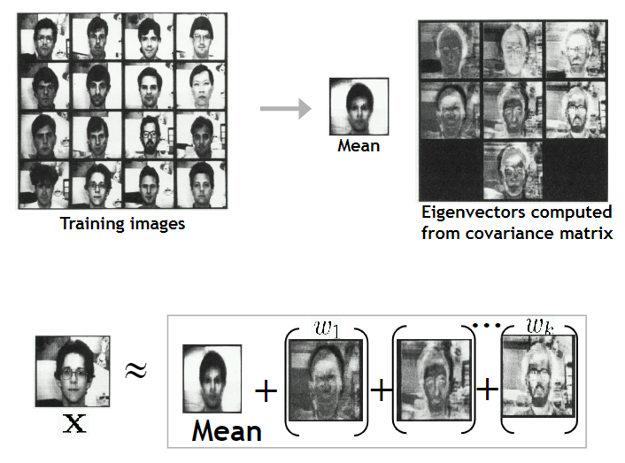

<center>PCA-face的图示</center>

特征分解得到的对应最大的那些特征值的向量就是那些**最能凸显不同样本的特征**，即数据集中的样本在该分量上的**差异最大**。因此选择这些向量作为face basis，使得输入在这些基上的投影有最大的差异程度，从而区分不同的人脸。这是将传统机器学习算法应用到cv的一个典型实例，其中蕴含的特征工程的核心思想非常值得学习。同样，这种方法本质上还是基于像素级特征实现的，其特征也没有什么不变性，只有当人脸的大小一致并且都处于图像的正中央才能取得比较好的效果，这里提到它主要是为了介绍其实现思路。


---


### 5.5.3. local-distribution方法

考虑到global-distribution的缺点如没有局部旋转不变性和平移不变性、对背景信息的处理也做得不够好，那我们就从局部统计入手，图片划分成数个不同的区域进行统计。

#### 5.5.3.1. gradient histogram

一种直观的改进思路将全图划分成数个网格，在网格内分别统计梯度直方图，然后将统计得到的向量**拼接**成高维向量（相当于得到了一个全局描述子/全局特征），或利用集成的方法对每个向量训练一个分类器（boost、stacking、bag都是可用的）。这样就能在获取一些不变性，利用固定位置的**局部信息**组合来替代全局统计信息。当然，网格不宜太细否则容易受到噪声或个体特征的影响，使得分类器过拟合，太粗则和全局统计特征差别不大，也达不到效果：

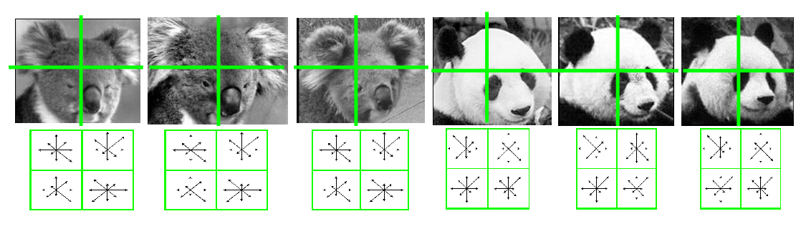

<center>还是前面的例子，每个网格中不同向量的长度代表在该方向bin内的累加值的大小</center>

加入了网格之后，分类器对于局部旋转和位移的敏感性将会降低。既然可以用微分算子作为滤波器提取边缘，自然可以用其他的滤波器模板以产生更丰富的特征响应，下面就介绍使用了多种卷积核的GIST。

> 注意，local-distribution方法虽然使用了局部信息，但是最后生成的特征向量仍然是一个**全局特征**，因为这个特征描述的是**整幅图像**而非图像中的某个物体或目标。

#### 5.5.3.2. GIST

gist意为要旨，要领，原文提出该方法的初衷就是进行场景分类，如森林、沙滩、街道、室内等。这样的方法显然需要一些全局特征对场景进行恰当地表示，同时为了保证特征更加鲁棒，采用局部信息聚合到全局的方式进行处理：


<center>gist的图示</center>

首先生成图像金字塔，原文选择的是4层；然后在每一层上都分别从六个方向应用Gabor滤波器，生成共24张响应图。对于每张相应图，都切割成4x4的网格，将网格内的响应值取平均，最终得到4\*6\*16（尺度\*方向\*网格）个维度的向量。对此向量运行PCA得到80维的全局特征表示。后处理我们都很熟悉了，用此特征训练一个分类器或直接计算和anchor vector的距离进行分类。

> Gabor滤波器是一种**小波**滤波器，小波分析是傅里叶分析的进阶，同样在频域处理信号，在继承Fourier Transform优点的同时，其强大的局部分析建模能力和对非平稳信号的兼容性使得它大放异彩。这方面的内容需要较多的泛函分析、数值分析知识，有兴趣的同学可以自行查找资料。

在这里我们直接将Gabor滤波器视作和常见的卷积核一样即可，只不过它的特殊设计使他具有一些优秀的性质。对应到卷积神经网络，就相当于我们通过FPN生成了4个尺度的输出，并且每个尺度的feature map都有6个通道（使用了6组卷积核）；而取平均的操作也非常的熟悉，这不就是average pooling吗！可见ConvNet的架构设计并非是无中生有从石头里蹦出来的，而是从这些传统的算法中扩展得到的。当然，在聚合特征的时候你也可以使用其他方法，比如之前介绍的直方图统计等，这都是对算法效率和精度的权衡。我们从特征工程的角度思考，采用直方图可以更好地建模局部信息，但稳定性会下降；采用窗口平均则可以拥有更好地抗噪性能，但是对局部信息的保留，就没有前者来得多了。

到这里，CNN似乎已经初具雏形，接下来要介绍的非常经典的HOG算法则更有卷积神经网络的影子（虽然它提出的时间比LeNet-5来得更迟），或者说，cv的发展都是同根同源的吧。

#### 5.5.3.3. HOG

HOG的全称是Histogram of Oriental Gradients，即有向梯度直方图，论文发表时用于进行行人检测，直接上pipeline：


直接按照流程进行介绍。

1. 先对输入进行gamma和RGB通道的归一化，*5.1* 中已经介绍过这种方法了。一方面可以减少噪声的干扰，另一方面提供一定的光照和颜色不变性。

2. 梯度计算，用一种微分算子处理全图得到响应。若要加速可以使用分离的1\*3和3\*1算子。

3. 获取梯度直方图。这里和前面介绍的gradient histogram一样，将图像划分为数个网格，原文选用的是8\*8的像素为一个cell，对每个cell进行梯度直方图统计。这里HOG对梯度直方图进行了一个小的改进，原本是当某个梯度方向落在一个区间内，就将其统计到这个bin里，而HOG则是将直方图划分为9个方向（0-180，分度为20°，不考虑梯度的正负，因为作者发现考虑正负效果更差而且还更慢，就是这么耿直），若梯度落在两个刻度之间，就计算它在两个方向上的**投影**（是不是比之前直接丢到bin里合理多了）。

4. 直方图归一化。以2x2的cell为一个block，对block内的直方图进行归一化，直接看下图：

   

   <center>计算示意图，绿色的为一个cell，蓝色为一个block；图源https://zhuanlan.zhihu.com/p/85829145</center>

   在提取了梯度特征后再次对局部的输出进行标准化，这不就是现在NN架构中常用的**Instance Norm**吗！因为梯度对局部对比度和亮度变化非常敏感，因此我们不仅在输入进行标准化，在得到梯度直方图后选择再进行一次标准化。同时，选取的block大小为2x2的cell（至于为什么选取2x2的cell作为一个block而不是其他值？作者尝试了2x2,3x3,4x4,5x5最后发现2x2的效果最好，有爆调参数那味了~），在一定程度上像是在进行特征聚合或**特征交互**，在此过程中，相邻cell的信息将会相互传递。

   > 其实这个标准化应该叫做”conv instance norm“，常见的BN、LN、GN、IN的图示如下：
   >
   > 
   >
   > H，W这个维度就是一个输入，而上述的标准化又只在一个实例的局部进行，因此笔者个人认为这个名字取得应该还算比较合理。HOG采用的这种方法在AlexNet上被采用，但是由于后续推出的BN效果远超这样的conv instance norm，因此这种方法在今天已经销声匿迹。

5. 收集HOG特征。直接把上一步的normalized slide window后得到的值全部拼接在一起（一个block里面4个cell，一个cell有9个bin，normalized window在滑动的时候不加padding），以上图为例，*将整幅图像划分成cell的个数为 8x16，就是横向有 8个cell，纵向有 16个cell。每个 block有2x2个 cell的话，那么cell的个数为：(16-1)x(8-1)=105。即有 7个水平block和 15个竖直block。再将这 105个block合并，就得到了整个图像的特征描述符，长度为 105×36=3780（斜体来自和图源相同的知乎文章）。*

6. 利用训练集中产生的所有HOG特征向量（如上一步中得到的3780维向量）训练二分类SVM判断是否是行人。

再次利用批判性的思维审视一下HOG，可以发现它的架构比起GIST与ConvNet更加相似，并且还好巧不巧用上了一些后来才提出的trick。它也充分考虑了局部信息，利用gradient这个局部信息采集各个位置的特征逐步聚合，最后得到一个用于分类的向量。不过从第五和第六步就可以发现，要利用SVM进行分类，其窗口大小必须是**一致的**，要检测一幅图像中不同位置和尺度的目标，就要对应地使用不同尺度地滑窗进行逐位置检测，时空开销都非常大。而且，由于采用了微分算子提取特征，其对于前景和背景一视同仁，还是没有办法将他们分离，因此会产生非常多对于我们的分类任务来说是**无用**的特征。

> 有效利用背景信息的例子：
>
> 
>
> <center>通过视角和几何这些上下文/背景缩小搜索空间的大小</center>
>
> 使用概率的方法建模人出现的概率，对于没有任何约束的情况（左上），图中的每一个区域都需要搜索，对于使用了几何信息的情况（右上），因为行人一般拥有固定的宽高比，只需要关注那些呈现一定形状的区域（怎么判断这些“区域”？通过聚合纹理和轮廓可得边缘，或者显示的建模，如KNN进行分割和合并）；加入视角作为约束条件（左下），就可以排除图像上方的检测框，人不可能飞在天上，并且还可以通过街景和道路的方向以及视角效应（在远处收敛）布置近大远小的windows；最后，在使用了视角和几何约束后，可以看见我们只需要布置少量的anchor即可。

在 *5.5.4* 中，我们将会提及解决无用特征的方法，利用**位于物体上的有效局部信息**建模我们要检测的目标，而不是像前面这些方法一样对整张图片或窗口进行建模。

#### 5.5.3.4. ConvNet没有不变性！？

我们已经阐述过使用不变特征的好处，那么AlexNet在ImageNet竞赛上大杀四方的时候，是否就意味着DCNN已经拥有了我们所需要的一切invariant feature？让我们一一揭晓：

##### 5.5.3.4.1. 旋转不变性

从直观上来说，CNN不具有旋转不变性，这是一个显而易见的结论，物体在旋转之后通过卷积核显然会得到不同的响应；之后更深层的卷积也会受到第一层输出的影响，因此最后生成的特征（比如softmax之前的一层，我们可以把最后一层的Fully connect+softmax当作分类器，前层都当作feature extractor）显然和旋转前不同。那么为什么我们的分类器和检测器仍然可以正确地完成分类、进行识别呢？这是因为我们的**训练集**中含有旋转过的数字，或我们使用了**数据增强**中的**旋转**操作。在《深度学习》（花书）中给出了一个数字识别的例子：


<center>中间的一排表示用于匹配不同模式的filter</center>

对于每一层的卷积操作，我们一般都拥有多组卷积核，而对于经过不同角度旋转的输入，对应不同通道的卷积核就能学习到这种旋转。如左上所示，左侧的卷积核对于向右倾斜45°的数字9会产生较大的响应，中间的则是对稍微向左侧倾斜的9有较大的响应；因此，在之后的最大池化操作中，这些响应都会被归结为”这里有一个9“而输出。那么这些不同的filter为什么会对不同的9有响应呢？那不就是训练出来的吗：我们的数据集中有不同转角的数字9，经过数轮反向传播之后不同通道不同组的卷积核自然而然就学习了**某一种旋转模式**。

当然，”旋转不变性“也不一定是从卷积层学到的，很可能是在全连接阶段，拥有不同转角的输入在经过非线性映射后投影到了特征空间中相近的位置也是一种可能的解释。最有力的证明就是进行实验，对每一层的feature map进行可视化，画出heat map。感兴趣的同学可以阅读本章末的paper。

>  但是不管怎么说，神经网络最后的输出应该是相近的，只是在**单个卷积核**提取特征的时候，由于使用的是卷积操作因此并不具有roration invariant特性；那数据增强和filter组合技算不算赋予了CNN以旋转不变性呢？这就是一个智者见智仁者见仁的问题了。

虽然一般我们没有**显式**地对物体的旋转进行建模，但是数据增强的确让网络在最后学习到了旋转不变性（data aug和filter group的组合），倘若我们为网络增加一些先验知识，并且直接建模旋转这一变量，网络是否更容易应对旋转的情况？这就是**Spatial Transformer**。这里的transformer不是自注意力的那个，代表的是**变换**的“那个” transform。


<center>左侧为一般卷积，右侧为加入了ST模块之后的输出</center>

Spatial Transformer会通过反向传播学习一组**仿射变换**的参数（平移+旋转）用于将图像中关键的部分“摆正”，在变换的过程中可能会出现拉伸或压缩，原文选择了双线性插值的方法。同时ST还可以切除没有用的背景信息，这又有一点注意力机制的意味（实际上也确实是一种隐式的注意力）。不过，我们还是需要不同转角的输入以训练ST module，否则单单输入垂直的目标，网络仍然无法学会这种变换。

此外，在 *5.2.5.2* 介绍池化层的时候，提到了pooling会使得当前层提取的特征拥有一定的旋转不变性和平移不变性，能够应对**轻微**的变化。然而有时候pooling反而会破坏这种不变性，我们稍后会介绍其中的缘由。

##### 5.5.3.4.2. 尺度不变性

和旋转不变性一样，神经网络不具备尺度不变性的原因相同，除非使用数据增强。从最早的spatial pyramid pooling到最新的PAN，我们可以FPN的发展轨迹略知一二：如果CNN拥有scale invariant特征，为什么还要费尽心思地进行多尺度特征融合？

对不同尺度特征的感受能力还和卷积核的**感受野**有关，扩大感受野也是膨胀卷积（dilate conv，atrous conv）提出的目的。YOLOF（you only look one-level feature）就另辟蹊径，主张利用不同stride的膨胀卷积提取不同尺度的特征并进行融合，从而抛弃了FPN的设计。不过当下大热的Vision Transformer通常也不需要利用FPN建模不同尺度的特征，似乎自注意力能够自动聚焦到不同大小的目标和特征上，因此也引领了研究的新潮流。


<center>YOLOF在四个res block里的3x3卷积采用了不同dilate rate的空洞卷积</center>

##### 5.5.3.4.4. 光照、对比度、颜色不变性

如果有，为什么还要用数据增强？但是，输入归一化（这也算是现代神经网络的标配了）和BN从原理上来说，似乎可以给CNN提供这些不变性。笔者猜测，之所以继续使用光照、对比度、颜色变化的数据增强，是因为这些变量常常是**协变**的，单单用BN很难解决这种像素级的耦合变化。

##### 5.5.3.4.3. 平移不变性

CNN是否具有平移不变性是这几个问题中最具有争议性的一个。数篇论文尝试通过理论分析、实验的方法解释这个问题，却得到迥异的结果，大家的争论主要集中在以下两点：

1. CNN中的平移不变性到底代表什么？
2. CNN是否具有上述的”那种平移不变性”？


<center>移动轻微移动图像后，classifier输出的置信度变化剧烈</center>
  <center>  图源https://zhuanlan.zhihu.com/p/77543304</center>

- 纯卷积拥有“**平移同变性**”

  卷积作为线性算子，对于图像这个线性输入进行操作显然具有“空间不变”性质（对应于LTI的时不变性质），因此，对于平移后的图像进行卷积，产生的响应只会在空间上平移对应的间隔。因此，若CNN全部由卷积构成而不加入pooling和fc，那么图像发生平移，最后输出的feature map也会**平移相应的距离**，但是响应**大小**仍然不变。

  我们称这种性质为平移同变性，即输入图像的平移只改变响应的位置而不改变大小，但是显然输出特征是和原来不同的，两者相差一个位移。故不是”平移不变性“而是同变性。 那么拥有特征拥有平移同变性有什么好处？那就是更容易被分类器划分（虽然不如平移不变性那么容易，因为还需要平移一个距离，即增加bias）。

  另外，前面在介绍旋转不变性的时候我们提到，pooling可以选择响应最大的特征。如果一组filter对应某个特征（当它遇到特定的边缘区域、角落或颜色斑点时将拥有很大的响应），那不管是该组的哪一个滤波器有激活，我们都可以检测到这个特征的**出现**（presence），一旦数个特征的组合出现并且有较大的响应值，我们就任务图像中存在这些特征的组合所对应的物体。若这种猜想成立，也同样佐证了平移同变性的重要性，并且说明严格的**平移不变性**并不是那么重要的。

  显然，平移同变性只是让网络有能力学习到不同位置的物体特征，我们同样需要使用数据增强的方法让特征出现在feature map的**每一个位置**。

- pooling是同变性消失的罪魁祸首

  pooling确实可以提供一定的平移不变性（注意和同变性的差别），但是处在边界的时候，pooling的境地就很尴尬了：

  

  

    <center>上方为原始”图像”，下方为左移一个单位后的图像</center>

    <center>  图源https://zhuanlan.zhihu.com/p/77543304</center>

  不失一般性，我们使用一维的信号举例。上图中的shift0代表原图，其pooling步长为2，输出为0101；shift1则是信号左移一个单位，但是由于原本的响应恰好处于边缘处，导致输出变成了1111，完全丢失了平移不变性和同变性！当且仅当**移动的距离等于pooling的采样步长**时，平移同变性可以保持（相同的像素移动到了下一个pooling窗口，因此响应的位置改变但是值不改变）。

  可是上面不是提到*只要特征出现分类器就能正确分类* 吗？那么pooling之后特征只是在位置上发生了偏移，并不影响我检测这个物体啊？还是拿上图的例子说明，假设网络认为0101代表一种特征组合的**模式**，即某种物体具有这样的特征组合，那经过shift后组合就变为了1111，很可能就是另一种模式了。不过好在神经网络的参数量较大，同时拥有多个通道用于组合不同的模式，有较强的抗噪能力，即使在一处发生了错位，也不会影响最终的结果（不过其实从本节开始处的动图来看，平移的影响还是比较大的）。

  除了pooling，strid而不等于1的卷积同样会丢失特征的平移同变性，除非位移值和stride相同，原因和pooling相同；更不用说dilate conv、deformable conv这些不规则卷积了。

  上面的解释都是定性的，若要从定量角度分析，则需要一个同变性丢失程度的度量：shiftability。在[Making Convolutional Networks Shift-Invariant Again](https://arxiv.org/abs/1904.11486)这篇论文中，作者采用余弦相似度来衡量平移不等的程度：

  

  上式中的$\tilde F(X)$即卷积操作，$Shift_{\Delta h,\Delta w}$则表示height和width方向上的移位。其实就是对比先移位后卷积和相反操作得到的feature map的相似性。既然有了度量方法，就该思考如何减小pooling带来的影响，请看下面。

- 抗锯齿：anti-aliasing

  喜欢玩游戏的同学可能在游戏设置中看到过这个调节选项，学习过数字图像处理/计算机图形学的同学多少都了解这个概念和采样定律的关系。这篇文章的思路非常有趣，从传统信号处理的角度入手解决pooling带来的问题。它将pooling视作下采样操作，根据Nyquist’s law，倘若采样得到的信号要保有原信号的所有信息，采样频率至少为原信号**最高频的两倍**。空间域的卷积等价于频域的乘法，这也是采样定律应用的核心。但max pooling显然不是卷积操作也不是线性算子，无法在频域被**解析描述**（或者说没有频谱/频谱没有函数式），故丢失了前述的**平移同变性**。

  pooling的size和stride相同，也可以看作是一种欠采样的操作。欠采样会带来**频谱混叠**的问题，再次回到本节初的那张识别小鸟的动图我们会发现，置信度周期性地变大-变小，而离散频谱正是**周期性**的！

  

    <center>不同图像在对角线上移动的时候置信度的变化</center>

  经典的解决频谱混叠的方法就是加入抗混叠滤波器（低通滤波器），average pooling其实就引入了一定的模糊效果（均值滤波器的频率响应是一个低频处增益接近1，高频增益呈小幅度波浪状的图形），但由于max pooling的效果更好因此平均池化在现代CNN已经几乎被弃用。
  
  传统的目标检测或图像分类在进行下采样的时候一般要先进行高斯模糊（高斯金字塔、拉普拉斯金字塔等多尺度特征提取方法）而在CNN中直接对feauture map进行低通滤波再最大池化，会混入过多无用信息和噪声带来的响应效果导致效果很差，因此作者提出一种巧妙的结合MaxBlurPool：
  
  
  
  <center>max pooling的等价表示，由于对stride=1的max响应进行的下采样导致aliasing</center>
  
  
  
  <center>论文提出的MaxBlurPool</center>
  
  首先观察MaxPool的**等价模式**（结果等价但是运算量不等，没被采样到的点其实什么也没做），即使用stride=1的pooling得到输出，并在其上隔点采样得到最终的响应，如Baseline展示的那样，红色的响应直接被丢弃了，这也导致位移在不为stride的整数倍时没有连续性。既然在pooling之前增加抗混叠滤波器的效果不好，作者就尝试在隔点采样前利用一个低通滤波器对中间数据进行卷积进而将未采样到的响应信息聚合到采样点上，也可以看作是一种插值/平滑。经过Anti-aliased pooling后，feature map的cos similarity应该会有显著地提升，因为已经不像之前那样，当响应越过边界后就直接算入另一个像素，而是引入一个平滑的过渡。
  
  通过实验证明，这一通操作确实有效，作者还对VGG-16的输出的平移不变性进行了可视化：
  
  
  
  <center>右键打开原图放大看，由蓝到红表示平移不变性的度量，即前述的cos similarity</center>
  
  > 这一小节没有严格的理论证明，为了做到更通俗易懂，大部分是笔者根据论文的公式/描述以及自己的理解编写的。这其实是关于DNN可解释性的一个非常有趣的话题。后续会从信号与系统/数字图像处理的角度用公式从采样定律和频域分析的角度严谨地推理关于“池化”为什么会丢失平移不变性这一问题，敬请期待。

- 正确使用padding？

  padding会影响网络的平移不变性/同变性是由SiamFC（在*5.4.4.4* 介绍过）提出的。

  > 其实我也没有太理解SiamFC中不使用padding的原因，论文作者认为使用padding会给特征引入位置相关性（位置编码）导致网络会“走捷径”直接根据弱边缘响应而不是特征来确定目标位置。
  >
  > 不过我猜测对于基础的分类任务来说，padding确实会影响平移同变性。从单层padding可能看不出来，但是随着网络的加深，卷积核的感受野不断增大，会将添加的padding（尤其是补零padding）信息聚合过来，那么处在feature map边缘的响应和处在feature map中间的响应受到padding的影响就会有所不同（显然是边缘受到的影响更大），也许这就是SiamFC中想表达的意思？
  >
  > 另外，由于图像不是一个在二维平面上无限伸展的信号，并且不具有周期性，因此使用循环padding虽然似乎可以提供平移同变性，但实际上会导致网络把图像认为是一个上侧/下侧循环连接，左侧/右侧循环连接的圆柱体（球体？立方体？），引入本不存在的相关性（一幅图像的天空和草地不会在相反的方向连接在一起）。
  >
  > 本小节暂不用正文形式，以引用形式作为TODO暂放。待笔者进一步了解后修改，若你有自己的理解欢迎email/评论交流！

最后稍微总结一下，若将CNN的输入到输出视作一个end2end的问题（不看网络中的任何一个module而将其视作一个整体，包括数据增强等trick），考虑输入进行各种变换但是输出的标签保持不变，那么卷积神经网络应该是具有这些我们期望的性质的；但是单独分析网络中的某个结构如卷积层、池化、全连接层，那么就要仔细想想了。另外，再次注意甄别**平移不变性**和**平移同变性**的区别！

>  *一些关于CNN的 invariance性质的 paper：*
>
> [Stride and Translation Invariance in CNNs](https://link.springer.com/chapter/10.1007/978-3-030-66151-9_17)
>
> [CNN: Translation Equivariance and Invariance](https://www.researchgate.net/publication/337933116_ML_CNN_Translation_Equivariance_and_Invariance)
>
> [On Translation Invariance in CNNs: Convolutional Layers Can Exploit Absolute Spatial Location](https://openaccess.thecvf.com/content_CVPR_2020/html/Kayhan_On_Translation_Invariance_in_CNNs_Convolutional_Layers_Can_Exploit_Absolute_CVPR_2020_paper.html#:~:text=In this paper we challenge the common assumption,particular absolute locations by exploiting image boundary effects.)
>
> [Tracking Translation Invariance in CNNs](https://link.springer.com/chapter/10.1007/978-3-030-66151-9_18)
>
> [Why do deep convolutional networks generalize so poorly to small image transformations? ](https://arxiv.org/abs/1805.12177) 
>
> [Quantifying Translation-Invariance in Convolutional Neural Networks ](https://arxiv.org/abs/1801.01450#:~:text=Quantifying Translation-Invariance in Convolutional Neural Networks Eric Kauderer-Abrams,transformations such as translation%2C rotation%2C and small deformations.)
>
> **选出的文章都是不支持CNN拥有平移不变性和平移同变性的**，这里的不支持指的是在***特征层面不具有平移不变性和同变性***，而非最后输出的结果。


### 5.5.4. 特征/关键点选取与特征描述子

和前面的全局统计特征不同，特征点检测+匹配方法则是另辟蹊径，只会选择那些很有“特点”的区域，然后用一些方法描述这个点，也就对应着**特征点选择**和**建立特征描述子**这两步。不论是global-distrubition还是local-distribution最终生成的都是一个全局描述符，而point-based的方法则是得到数个特征描述符，然后在两帧之间匹配特征点或在输入图像上匹配我们要寻找的物体的特征点。前言不必多，我们会一边介绍特征点检测的方法，一边将它与全局特征描述进行对比。

虽然 *5.5.2* 和 *5.5.3* 出现的算法当下都已经被卷积神经网络或者Transformer替代，但本节介绍的方法仍在CV中占用重要的地位，如**图像拼接**（OpenCV提供了stitching库）、**相机标定**以及**双目相机极线匹配**（OpenCV提供了ccalib3d库）、**稠密3D重建**（OpenCV提供了reconstruction库）、视觉SLAM中的**定位路标**等都大量使用了特征点检测技术。


> *5.5.4* 将特征点检测算法拆分为三个部分，分别是：
>
> 1. 寻找特征点 
>
> 2. 对找到的特征点建立特征描述子（特征向量）
>
> 3. 根据特征描述子进行匹配
>
> 因此，以SIFT算法为例，我们将它按照上述步骤拆分为空间极值检测（1），通过极值点(即上一步检测到的特征点)附近的梯度直方图建立特征描述子和描述子的主方向（2），最后将描述子两两进行主方向配对，通过者再计算特征向量的欧氏距离，取最小者为匹配成功（3）

#### 5.5.4.1. 特征点选取

不像传统的方法直接对全局或在划分的网格内**无差别**提取特征，point-based的方法首先要选取一些很特殊的点，并以此作为**参考**进行特征提取（实际上是以点为中心的一小块区域）。这和基于CNN的目标检测中的anchor非常相似，我们只选取那些**可能出现目标**的区域进行特征提取（如Faster R-CNN只在region proposal上进行ROI Align，然后送入回归分支进行bbox精修），那么对于特征点选取来说也是一样的，这可以帮助我们大大减小搜索空间，让算法只提取那些“关键”的区域。

> 虽然这里的特征点和现在常说的人体关键点如17关节、5个面部关键点检测稍有不同。不过两者其实是有一定的相似性的。下面马上会介绍特征点和关键点的差别，以及特征点有何独特之处。
>
> 

通过选取一些很有特点的点，我们就可以避免引入过多的噪声和无用甚至会帮倒忙的背景信息，从而更有效地抽取对于分类/检测来说更有用的特征。

##### 5.5.4.1.1. Harris角点检测

Harris角点检测作为特征点筛选的一种，旨在选取独特的**角点**为后面的检测和匹配作铺垫。由于常常是数条（两条及以上以不同角度相交）线段的交点，角点一般在多个方向上都有剧烈的梯度变化，这便符合我们所要求的**特殊的**、**能够区别于图像中其他区域**的性质。

 

- Kitchen-Rosenfeld 角点检测
- Moravec算子
- Forstner算子
- Shi-Tomasi算法
- KLT角点检测
- SUSAN角点检测


##### 5.5.4.1.2. Laplacian尺度和图像空间极值检测


##### 5.5.4.1.3. 极值检测的改进与积分图


##### 5.5.4.1.4. FAST特征点检测


#### 5.5.4.2. 建立特征描述子


##### 5.5.4.2.1. 梯度直方图


##### 5.5.4.2.2. SURF-liked


##### 5.5.4.2.3. 局部二值模式


##### 5.5.4.2.4. BRIEF


##### 5.5.4.2.5. 提供旋转不变性


##### 5.5.4.2.6. 如何保证尺度不变性？


### 5.5.5. 特征点匹配和align-based


#### 5.5.5.1. transfomation/projection


#### 5.5.5.2. bruteforce


#### 5.5.5.3. KNN/Cross/


#### 5.5.5.4. RANSAC


#### 5.5.5.5. PROSAC


### 5.5.6. 一个完整的特征点检测/匹配算法：以ORB为例


#### 5.5.6.1. 特征点选取：FAST


#### 5.5.6.2. 建立描述子：BRIEF


#### 5.5.6.3. 旋转不变性与尺度不变性：oFAST


#### 5.5.6.4. 改进描述子：rBRIEF


强烈推荐学习斯坦福的计算机视觉课程中关于传统的图像分类和目标检测方法：

这里也给出几个介绍特征点检测、使用统计特征的CV方法的介绍：


---

---

---


# 6.**各算法具体应用流程**

> 在第五部分中介绍了一些简单的OpenCV函数和他们能实现的功能，同时也大致浏览了其他算法的原理。根据视觉主要的开发任务，分为以下要介绍了5个部分，每个部分其实都有交叠，但也有各自面临的难题。现在就让我们把这些算法具象化，应用到实际的检测当中去吧！

## 6.1.装甲板识别

### 6.1.1.传统的灯条匹配+数字识别方法

这是以一种手工设计特征为主的专家方法。仔细观察装甲板，我们会发现其最显著的特征就是两侧发红/蓝色光的**灯条**和装甲板中央的**数字贴纸**（哨兵/前哨战/基地则是图案贴纸）。因此，考虑检测成对的灯条+这对灯条中的数字对装甲板进行识别。大体的流程如下：

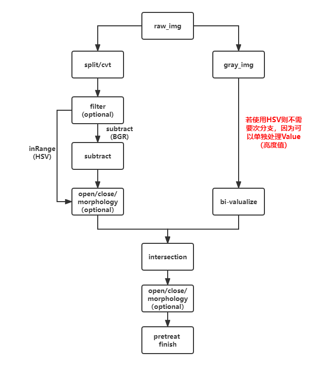

<center>预处理的过程，目的是使灯条特征凸显出来便于之后的轮廓筛选</center>

下面分别介绍预处理的每一个步骤。

#### 6.1.1.1. 预处理

1. **通道分离相减**

   假设我们现在处在红方，则要识别蓝色装甲板。从RGB空间思考，显现蓝色的像素有什么特点？显然它的蓝色分量要比绿色分量和红色分量大。如果用拆分通道后的蓝色通道去其他颜色通道还有比较大的余量，说明该物体在图像中足够“蓝”。白色的物体三个通道分量都很大，显然相减之后会得到接近零的值。再看看场地的等效和光线环境，除了白色的炽光灯就是场地红蓝色灯条。

   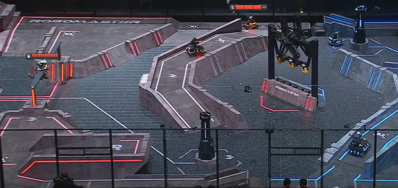

   <center>RoboMaster2021技术交流的场地光线条件</center>

   因此一般选择蓝色通道减去红色通道（识别红色则相反），更保险的做法同时考虑绿色通道，确保B的value是最大的，从而让提取出的灯条足够红/蓝。

   经过此番操作后，会发现原图中的蓝色区域仍然有着较高的亮度，而红色和白色区域几乎已经是灰黑色的了（相减后Mat是一个通道，以灰度图的形式展现）。

   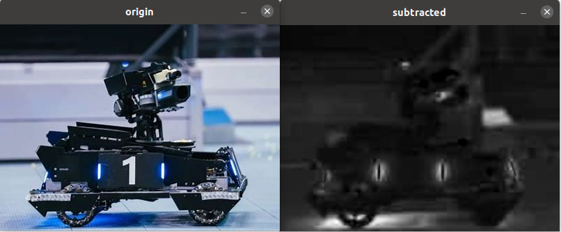

   <center>一张英雄的图片，右边为蓝色通道减去红色通道后的效果</center>

   

2. **二值化并取交集**

   第1步中得到通道相减灰度图必然还要进行处理并得到更明显的特征。因此需要设置一个**合理的阈值**对通道相减后的图片进行二值化。可以根据不同的阈值得到不同效果的图片进行不断地调整最后得到一个最优的阈值。官方已经提供了装甲板发光的RGB参考值（但是请注意不同的相机和镜头拍摄得到的RGB显然不同，我们一般通过在场地矫正参数或使用设定自适应阈值，最好是实现自适应阈值，以防光线条件剧变对处理效果产生影响。我们之前在 *5.5* 也介绍了阈值自适应的基本方法，可以回去看看）。

   由于RGB空间中每个通道既包含了亮度信息又包含了颜色信息，无法将其**解耦**，所以我们一般将蓝色通道减去红色通道并二值化后得到地二值图于蓝减绿并二值化后得到的二值图相与从而在一定程度上降低耦合的影响。

   当然，更好的办法是将图片转换到HSV空间，从而解耦颜色和亮度，就不必进行流程图中右边分支的操作了。从处理的效果来看，**HSV方法要优于RGB**；但是从速度上来看，将RGB转换到HSV空间有额外的消耗，这取决于你使用的运算平台是否支持矩阵并行计算的加速操作（颜色空间转换要对图像中的所有像素点进行遍历）。

   

   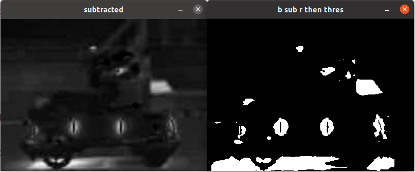

   <center>对第一步生成的图片进行阈值二值化得到的图片</center>

   > 吉林大学TARS-Go战队在他们[开源的代码](https://github.com/QunShanHe/JLURoboVision)中提到可以将 *split()* 和 *subtract()* 合并为一个利用指针遍历整个矩阵的操作。在没有GPU或并行加速优化的情况下，他们重新编写地函数确实提升了性能。但是笔者又找来了一台配置使用ippicv加速地intel NUC，分别运行两种方法发现使用opencv封装好的函数能够利用加速库带来的优化，取得更好的性能。

   细心的同学会发现，为什么灯条明明是蓝色的，但是通道相减后中间却变成黑色的了呢？（说明红蓝分量接近）这是由于拍摄这张图片使用的相机的曝光调节的过高，**感光单元达到饱和**（蓝色分量一下就饱和，红、绿分量虽然小，但是曝光时间长使得这两者颜色的光在采集时也逐渐达到饱和）,灯条就呈现白色了（图1）。所以在使用传统方法的时候，我们都会**降低相机的曝光**，一般拍摄得到的图像如图2。同时，降低曝光还能减少杂光的影响，进一步减*少预处理的时间和复杂度*。

   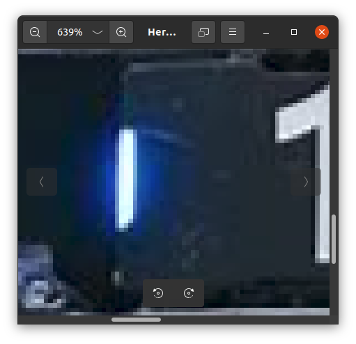

   <center>p1：放大图像查看细节，发现灯条确实呈现白色</center>

   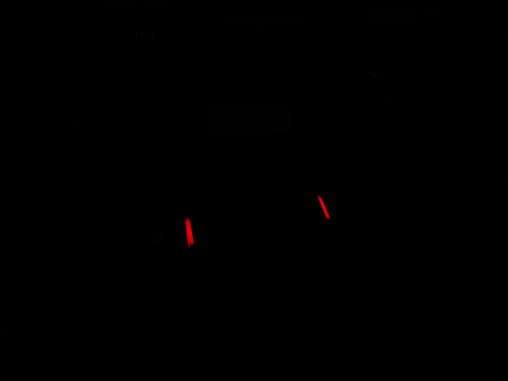

   <center>p2：降低相机曝光后拍摄得到的图像，装甲板灯条显现纯粹的红色，杂光也大大降低了
       我们在下面的步骤中就以这张图片为例简化过程分析，同时也不失一般性</center>

当然，你也可以思考一下，如果我就要使用较高的曝光来拍摄(希望中间的数字特征更为明显)，有没有什么方法能够提取装甲板的特征呢？

> 提示1：灯条外面有一圈明显的背景光晕，包围了灯条，形成了一个闭合的轮廓
>
> 提示2：颜色光晕包围高亮度灰度轮廓

 3. **形态学操作**

    在5.1部分我们已经稍微介绍了一些形态学操作。最常用的是*dilate*()和*erode*，此外还有*open*()、*close()、morphgrade()、tophat()、blackhat()*等。后面五个操作都是膨胀和腐蚀的**组合操作**。希望详细学习这些函数请参考《学习OpenCV3》的形态学操作部分。我们最常用的是*dilate()、erode()、open()、close()*这四个能够很方便地修改二值图轮廓的操作。

    在第1步和第2步的处理结束后，由于拍摄角度、杂光干扰地原因有些灯条可能会发生“断裂”或变得“破碎”，我们肯定希望在查找轮廓地时候能够把完整的灯条筛选出来，因此这一步我们使用dilate来扩张轮廓的边缘使断裂处闭合。同样可以使用**闭操作**：先膨胀再腐蚀（为什么不会又断裂？想想形态学操作的原理）。使用闭操作也可以防止灯条在直接膨胀后的**面积扩张**，这可能会导致之后的解算不够准确。注意结构元素的选择，机器人上的装甲板必然是横向的，即使是上坡中的机器人其装甲板倾斜角度也不会大于30度，因此我们要着重注意灯条**竖直方向可能出现的断裂**（细长的特点致其更容易受光线条件等的影响），一般会选择纵向放置、椭圆形或矩形的结构元素。

    

    <center>膨胀前后对比，因为各种原因(不合适的阈值、突变的曝光等)断裂的灯条恢复了原状</center>

    我们也可以在这一步之前对就直接图像进行滤波以**去除噪点和杂光**（把之后的滤波移到这一步），这也能减小形态学操作的运算量。（同样在未进行二值化的时候就可以进行滤波平滑图像去除噪点，但是这样滤波的运算量也会增大，处处都是trade-off啊～）

    不过最好的方法是**不要使用形态学操作**，由于其逐像素运算的特点导致其典型单线程时间开销可以达到0.6~1ms。并且其对于不同尺度目标产生的误差不同（远处的一个灯条所占像素数本来就少），这将导致后续算法中其他用于筛选灯条的参数设定有比较大的影响。

    如果颜色阈值分离和相机参数（当然和相机本身的性能有关）配合得很好，在很多时候可以**省去形态学操作**。


​        

 4. **与灰度（亮度）二值化图取交集**

    前面讲道RGB空间没有解耦颜色和亮度信息，因此我们在这一步筛选掉那些虽然呈现蓝色但是总体亮度低的物体（如场地等效、反光等）。得到最后图像后，我们再根据情况使用滤波器，得到最终的预处理图片。

    

    <center>预处理得到的最终结果</center>

​        


---


  

#### 6.1.1.2. 寻找轮廓并筛选拟合出的对象

1. **轮廓**

   利用OpenCV封装好的函数 *findContour()* 来寻找二值图中的封闭轮廓，注意若使用 *findContour()* 的重载函数即加入hierarchy参数，则可以将子轮廓以树的结构存储在一个vector当中（这也是较高曝光时灯条在预处理时变成黑色的这种情况的处理方法，寻找有一个子轮廓的轮廓即为灯条）。若预处理能得到较干净的二值图，可以大大降低这一步的时间。其原理大概是遍历所有像素并寻找周围8个像素是否是当前像素的同色像素，和 *floodFill*() 有异曲同工之处。一般选择使用CHAIN_APPROX参数来**降低空间开销**和之后拟合对象的**时间开销**（轮廓中的直线会直接使用两个端点存储而不是保存直线上的所有点），并且使用这个参数后，我们还可以**对轮廓进行筛选**，显然长条形接近梯形/矩形的灯条在使用直线近似时不需要很多点就能够表示，若轮廓点数超过10（此参数需要不断调试），那么几乎可以断定这不是我们需要寻找的灯条。

   

   <center>通过筛选点数可以去除其他光斑和发光物体的干扰</center>

2. **拟合对象与配对筛选**

   虽然得到了描述轮廓的一组像素点，但还是将它们转化成更容易操作的对象方便一些。OpenCV提供了三个函数用于拟合轮廓点：*minAreaRect()、fitEcllicpse()、minEnclosingCircle()*。显然灯条是长条形的，我们一般使用前两个函数。以 *minAreaRect()* 为例，将上一步留下的所有轮廓全部用最小面积拟合并存入一个数组。

   此处需要注意OpenCV中RotatedRect的角度系统，在5.1我们已经提过了这一点。

   拟合出旋转矩形对象后，通过两个嵌套的循环将旋转矩形两两匹配，利用一连串地ifelse筛选长宽比、面积比、高度差、中心距离、倾斜角度等信息，或是给这些信息赋予不同的权重计算得分最后设置**分数阈值**（这种方法大大提高了筛选的连续性，降低了筛选函数的非线性特性，会比硬性的截断有更好的效果，但是有额外的开销，trade-off again！）。和前一步一样，如果**轮廓筛选的干净，匹配的时间会成阶乘级别地降低**！

   特别注意，筛选的时候应该尽量选择**尺度不变的特征**，这样对于不同距离灯条的筛选才能尽量减少出现漏判和误判的情况，这点在 *5.5* 已经介绍过了。

   到这里，我们已经筛选出了可能属于同一块装甲板的、两两配对好的矩形。然而，还是有很大的可能会出现这两个灯条其实并不属于同一块装甲板：

   

   <center>从侧面或斜45～135的角度观察机器人的时候，我们可以看到3-4个的的灯条，但实际上视野范围内只有一个装甲板</center>

   所以，我们还要利用其他信息来把“假”装甲板过滤掉。

   

   ---

   

#### 6.1.1.3. 数字识别

在模板匹配、svm、神经网络方法出现之前就已经有队伍想到直接利用最简单的信息来筛选这些假装甲板。例如深圳大学[开源的传统方案](https://codechina.csdn.net/mirrors/yarkable/RP_Infantry_Plus?utm_source=csdn_github_accelerator)是根据ROI内灯条的大小和角度特点来筛选真正的装甲板：

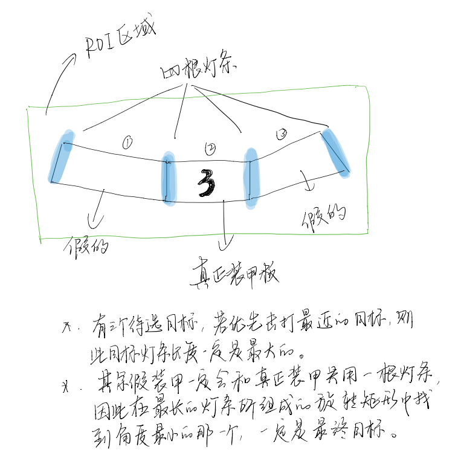

<center>思路如图，截取自SZU的开源仓库README</center>

当然，装甲板的两个灯条之间也不应该有其他的灯条出现。虽然这是一种非常巧妙的方法（奥卡姆剃刀），但是也只是降低了误识别的概率而**无法完全避免该情况**，如上坡的机器人和在平地上的机器人、相机拍摄时产生的畸变导致边缘的物体弯曲、两辆机器人在非常靠近的情况下、小陀螺运动的机器人在正好斜45度正对相机时等都有概率出现误识别。因此我们需要更好的办法提高算法的准确度。我们在前面提到，装甲板另一个非常显著的特征就是**中央的数字或图标贴纸**，那就从这里入手吧。

首先我们需要找到一个处理这个数字/图标的方法。随着装甲板的旋转和平移，显然装甲板大部分时候都**不会正对相机**，这样我们的搜索空间就会变得很大，问题的非线性程度也会上升，因此要设法让它变成正对我们的一个平面（kind of normalization！）。有没有什么方法可以把装甲板变换成一个正对我们的矩形？有！前文提到，OpenCV贴心地提供了获得投影变换矩阵的函数和通过变换矩阵进行投影变换的函数：*getPerspectiveTransform()* 和 *warpPerspective*() 。前文也稍微涉及了一下仿射变换和投影变换的不同，其实我们从相机成像模型（小孔模型）也可以理解，物体都是通过投影的方式在感光单元上成像的。那么要将一个相对相机来说歪斜的装甲板转到垂直，就需要使用投影变换。

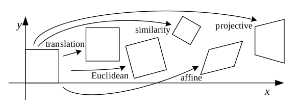

<center>再次通过图示感受一下两者的差别吧，图中还列出了平移、旋转+平移和旋转+相似操作</center>

两点确定一条直线，三点确定一个平面，而投影变换的维度又比同维度的线性变换要多1（垂直于那个平面）因此我们至少需要找到一个平面上的四个点和变换后的四个点组成的**四组匹配点**才能确定整个平面的**投影变换**。线性代数好的同学可以尝试从线性空间的角度理解，4个点可以连结成三条不相干的直线，3个线性无关的向量张成R3空间。当然从3d数学利用坐标矩阵变换也可以直接推导得到结果，网上的资料很多笔者这里就不列举了。随后，我们在得到两两匹配的灯条后，分别选取左灯条的左上、左下角点，右灯条的右上、右下角点，并与一个正方形的四个角点匹配组成点对，将他们投入 *getPerspectiveTransform()* 函数中，得到投影矩阵。随后就可以利用 *warpPerspective*() 来将整个装甲板投影成一个正方形了。由于拉伸或压缩，变换需要对图形进行插值或抽样，我们同样可以传递不同的参数来选择不同的方法，在此不赘述。不过我们会发现，如果以装甲板的两个灯条为矩形的两条边，是无复覆盖整个数字/图案的。因此我们通常会在灯条所在的直线上往两头各延伸2/3～1个灯条的长度，以达到覆盖装甲板的目的。

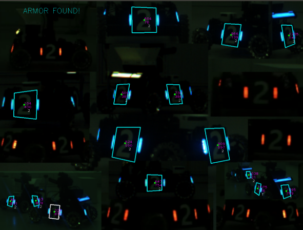

<center>截取自吉林大学开源仓库，JLU的同学的做法是在两个方向上各延伸了2/3个灯条的长度</center>

这里额外提一下，使用广角相机或是装甲板处于视野边缘的话灯条可能会**畸变得很严重**，长宽比例和面积等筛选条件会受到较大的影响。如果想要在此时也取得较好的投影效果则需要利用*undistort()* 函数先对ROI进行校正，再进行投影变换，否则由于畸变带来的非线性因素会让投影得到的图像变形。不过在大多数时候这个影响并不是很明显，也可以选择使用畸变系数小的镜头来从根本上解决这个问题（钞能力是最强的）。

在得到可能装甲板中间的ROI后，我们就可以开始识别上面的数字/图案了。以下介绍几种常用的方法。


- ##### **模板匹配**

  首先需要制作各种数字和图标（哨兵、前哨站）的图像模板。模板匹配实现原理就是将模板图片在待检测图像上滑动，检测、计算覆盖区域的每个像素的相关性，常用的方法有平方误差匹配、标准差匹配、乘法相关匹配、标准相关匹配等。这些都可以通过设置 `matchTemplate()` 函数的不同参数而实现。

  因为我们直接将ROI投影成一个标准的正方形，因此只要准备大小相同的正方形模板即可，且在运行时因为ROI和模板刚好重合这样也不需要我们在窗口上滑动检测。注意小装甲板产生的ROI经过投影后应该会刚好符合模板，因其正面基本就是一个正方形；而大装甲板是长方形的，注意在制作模板的时候要对其**进行*resize()*操作**。

  综上，又根据比赛规则，总共需要制作**8种模板**：1号英雄（需要resize），2号工程，3、4、5号步兵，哨兵机器人、前哨站、基地（图案）。将得到的ROI分别使用不同的模板进行匹配，得分最高的即为对应的兵种。若所有模板的匹配得分都没有超过设置的阈值则说明此装甲板是一个假装甲板（我一眼就看出你不是人！）。根据匹配得到的结果，操作手还能通过按键来选择打击哪一种机器人，比如我们就可以通过设置哨兵忽略2号装甲板（工程机器人）来防止对手利用工程来消耗哨兵子弹的策略。

  模板匹配虽然使用起来最简单，不过也正是由于其简单的机制导致它的精度和准确度不够高，而且数字和图案都是只有黑白两种颜色，在同一个区域往往也有很多重叠，导致模板之间的差异不够大，难以区分。

  

  <center>模板匹配的计算过程</center>

- ##### **手动特征分类**

  这是一个非常朴素的想法，我们将可能的灯条匹配对进行投影变换后，在得到的ROI上划分一组合适大小的网格，然后分别对每个网格内是否有像素块，如数字1在中间的这一排竖直方向上的网格都有像素块。这样我们就能针对不同的数字和图案得到不同的匹配标准，在检测时分别验证这些标准，从而得到分类。要是不符合任何一个分类，则认为是一个伪装甲板。

  

  <center>利用“手动SVM”对数字和图案进行筛选</center>

  这种方法实际上是一种专家规则的分类器，和我们在筛选灯条时的筛选条件非常相似，也可以看作一种低配的、非线性的SVM。其分类准确率和划分的网格密度成正相关，速度则反之。不过这种情况比较容易受到干扰，因此建议不仅要在数字有像素块的地方进行检测，还要在周围的空白处进行判断，这是因为背景类（非装甲板）的像素块往往是**随机分布**的，有数字的情况仅仅是搜索空间内非常非常小的一个子集。

  

- ##### **SVM**（support vector machine）

  支持向量机在线性可分问题上表现的非常好并且对于线性不可分的问题也可以通过**核方法**来实现向高维空间的非线性变换，从而让问题变为线性可分。网络上关于svm的原理和教程也非常丰富故不在此赘述，高等数学的多元微积分部分也有对**拉格朗日乘子法**的介绍，因此推导起来也并不算太复杂（对偶方法的掌握非必须）。

  对于有多个分类的情况，可以选择训练多个简单SVM或一个多分类SVM，关于这两种方法的性能，笔者暂时没有进行测试，如果有同学进行了性能和精度的比较，可以联系我补充这一部分哦。不过从直观角度理解，多个简单的SVM训练起来肯定比一个多分类SVM简单，不论是从原理还是实践角度。SVM要求**输入一个特征向量**，但是我们得到的ROI是一个nxn二维数组，因此要做的第一件事就是将此ROI Mat 通过 ***resize()*** 变成一个一维的1xn^2向量，随后投入SVM进行预测。

  OpenCV中提供了封装好的二分类和多分类SVM，其训练和预测可以参照此教程：[在OpenCV中使用SVM](https://blog.csdn.net/chaipp0607/article/details/68067098)。上交在19年的视觉开源代码中就使用了SVM进行数字标签分类，可以戳他们的[开源仓库](https://github.com/xinyang-go/SJTU-RM-CV-2019)，吉林大学2020年则是使用了一个多分类SVM，并且提供了他们训练好的支持向量参数。

  

  <center>SVM的可视化</center>

  

- ##### **使用CNN的数字分类**

  图像分类当然少不了CNN，CNN的开山之作LeNet-5就是通过一个拥有四层隐藏层和两个全连接层的数字识别网络。根据*5.2*中介绍的CNN基本知识我们可以得到如下的流程：首先制作数字和图标的数据集，给他们打上不同的标签，当然数量越多越好。可以直接使用传统算法对ROI进行裁切，只需要保证视野内只有一块装甲板就可以批量制作数据集了。

  由于我们在前处理中将图像转为正视图，所以不需要采集那些倾斜、歪曲的装甲板作为训练数据，只需要使用正视图（当然你也可以尝试增加非正视的装甲板图片作为训练数据使用，这样可以省下前面的投影变换操作；或是使用数据增强，但这未必能提高效果，因为在这个问题里搜索空间其实并不大）。由于搜索空间和类的数目并不多，预计每个分类100张图片就能得到较好的结果了。同时我们还可以加入**负样本或背景**作为一个分类以提高分类精度。原理已经在前文介绍不在再赘述。

  对于如此一个小规模的网络直接使用cpu推理即可，消耗的时间可以基本也是和前面的处理处于相同或更小数量级（你甚至可以不用torch和tensorflow，直接使用c++编写一个网络！这还能增加你对神经网络的理解和造轮子的能力）。

  

  <center>经典的分类网络LeNet5</center>

  

经过预处理、轮廓寻找与筛选和数字识别，就能够得到最终的**真·装甲板**了！那么应该如何利用这个信息来控制云台转向装甲板呢？如果现在就想知道，请直接跳转到 *6.3* 看看吧。


---


### 6.1.2.基于CNN的目标检测方法

*6.1.1* 中介绍了最后数字识别的CNN方法，更进一步，我们可以将整个pipline都转移到神经网络上来。需要的前置知识已经在 *5.2* 比较详细地展开了，因此我们就从实践的角度以装甲板识别为例讲述大概的流程。

#### 6.1.2.1. 网络选择

首先需要根据运算平台算力、精度与速度的平衡选择一个检测网络。关于计算平台的选型我们已经在 *4.2* 中介绍。因此，你可以根据前文的信息针对网络的参数量、这些网络的benchmark、你的运算平台的cpu算力和gpu算力来筛选你想要使用的网络。显然我们可用的运算平台是无法同时满足大分辨率输入和速度的要求的，当下的最优选择大概是416x416（追求速度）、512x512（权衡）或640x640（精度）。320x320的模型速度虽然快，但是对远处的小目标效果明显下降（除非使用变焦相机或者双相机的策略），mAP也要远低于前述的三个模型。

| Model                                                        | size | mAPval 0.5:0.95 | Params (M) | FLOPs (G) | weights                                                      |
| ------------------------------------------------------------ | ---- | --------------- | ---------- | --------- | ------------------------------------------------------------ |
| [YOLOX-Nano](https://github.com/Megvii-BaseDetection/YOLOX/blob/main/exps/default/nano.py) | 416  | 25.8            | 0.91       | 1.08      | [github](https://github.com/Megvii-BaseDetection/YOLOX/releases/download/0.1.1rc0/yolox_nano.pth) |
| [YOLOX-Tiny](https://github.com/Megvii-BaseDetection/YOLOX/blob/main/exps/default/yolox_tiny.py) | 416  | 32.8            | 5.06       | 6.45      | [github](https://github.com/Megvii-BaseDetection/YOLOX/releases/download/0.1.1rc0/yolox_tiny.pth) |

| Model                                                        | size | mAPval 0.5:0.95 | mAPtest 0.5:0.95 | Speed V100 (ms) | Params (M) | FLOPs (G) | weights                                                      |
| ------------------------------------------------------------ | ---- | --------------- | ---------------- | --------------- | ---------- | --------- | ------------------------------------------------------------ |
| [YOLOX-s](https://github.com/Megvii-BaseDetection/YOLOX/blob/main/exps/default/yolox_s.py) | 640  | 40.5            | 40.5             | 9.8             | 9.0        | 26.8      | [github](https://github.com/Megvii-BaseDetection/YOLOX/releases/download/0.1.1rc0/yolox_s.pth) |
| [YOLOX-m](https://github.com/Megvii-BaseDetection/YOLOX/blob/main/exps/default/yolox_m.py) | 640  | 46.9            | 47.2             | 12.3            | 25.3       | 73.8      | [github](https://github.com/Megvii-BaseDetection/YOLOX/releases/download/0.1.1rc0/yolox_m.pth) |
| [YOLOX-l](https://github.com/Megvii-BaseDetection/YOLOX/blob/main/exps/default/yolox_l.py) | 640  | 49.7            | 50.1             | 14.5            | 54.2       | 155.6     | [github](https://github.com/Megvii-BaseDetection/YOLOX/releases/download/0.1.1rc0/yolox_l.pth) |
| [YOLOX-x](https://github.com/Megvii-BaseDetection/YOLOX/blob/main/exps/default/yolox_x.py) | 640  | 51.1            | **51.5**         | 17.3            | 99.1       | 281.9     | [github](https://github.com/Megvii-BaseDetection/YOLOX/releases/download/0.1.1rc0/yolox_x.pth) |
| [YOLOX-Darknet53](https://github.com/Megvii-BaseDetection/YOLOX/blob/main/exps/default/yolov3.py) | 640  | 47.7            | 48.0             | 11.1            | 63.7       | 185.3     | [github](https://github.com/Megvii-BaseDetection/YOLOX/releases/download/0.1.1rc0/yolox_darknet.pth) |

<center>MegaVision旷视开源-YOLOX的benchmarks</center>
<center>YOLOX是截至本文完成前Objection Detection领域的state-of-the-art</center>

#### 6.1.2.2. 准备数据集

RoboMaster组委会在2019年开源了一组[赛场数据集](https://bbs.robomaster.com/forum.php?mod=viewthread&tid=9678&fromuid=39845)，同时也提供了YOLO-v3利用该数据集的[训练示例](https://github.com/JintuZheng/zisan)。不过官方提供的数据集有一个问题，这些图片都是从赛场直播相机中截取的，大部分是俯视视角（大概比较适合雷达、哨兵和无人机吧），并且亮度都较高。川大&沈航则是搭建了一个[RMCV视觉开源数据站](https://bbs.robomaster.com/forum.php?mod=viewthread&tid=12353) ；云南大学&中国科学院深圳先进技术研究院也建立了自己的数据集并开源：[RM-DATASET](https://github.com/Damon2019/RM-DATASET)。希望最后能有一个统一的数据集平台，提供各种样例与分类的数据供大家选择，也方便大家向此社区贡献自己制作的数据集。

常见的数据集规范有COCO和VOC，也有简单的txt(yolo格式)。打开数据集的标注简单浏览，就会看到类别信息、grond truth的中心坐标和宽高这几个数据，每条数据对应一张图片中的一个对象。有些数据集采用的是绝对坐标，有些采用的是归一化到[0,1]区间的相对坐标，他们各有各的优劣。

官方的数据集还有对机器人的标注如工程车、步兵机器人等，如果我们只是识别装甲板可以把这些多余标注利用一个文本处理脚本去除，通过一些简单的正则表达式知识就可以完成辣。笔者这里有一个写好的脚本，也一起放在文末的链接中了。


#### 6.1.2.3. 开始训练吧

- 配置环境

  根据仓库中的readme走就可以了，一般都会提供一个requirements.txt，直接用pip安装所有环境就完事了。也就是：

  ```shell
  pip/pip3 install -r requirements.txt #有可能需要管理员权限,加上sudo即可
  ```

  建议使用anaconda来管理不同repo的环境防止出现各种软件包版本不兼容的情况。


- **修改训练配置参数**

  此处以笔者队伍上个赛季使用的Nanodet-m为例，为大家介绍“炼丹”的过程。我们实验室用于训练的电脑是一台安装了1080ti的老电脑（3年前3599，现在能卖4599你敢信...来人吶把挖矿的都给我鲨了！！！~~萨日朗~~），显存12G（训练的显存就是要大！这样才能跑更大的batch并且减少访存次数，频率低慢一点没关系，宁要12G的3060也不要6G的3080）。不过不用担心，有独显的笔记本也可以用来训练，实在没办法就在tb上找服务器租用业务。

  > 这部分内容其实是很早就已经写好了，只可惜时过境迁，在发文前nanodet已经更新了plus版本！快去github上点亮🌟吧，我敢保证nanodet是笔者用过的最容易上手部署最简单的检测网络了！这里还有笔者对NanoDet-Plus的完全解析，逐行注释非常详尽：[NanoDet代码逐行精读与修改（零）Architecture_HNU跃鹿战队的博客-CSDN博客](https://blog.csdn.net/NeoZng/article/details/123299419?spm=1001.2014.3001.5501)
  >
  > 若要继续使用之前的verison，在github页面左上方切换tag回之前的版本即可。***请特别注意，本小节内容仅针对 nanodet v0.4.2***，新版本**不再适用**，需要参考上方的链接。

  Nanodet的作者贴心地提供了config文件配置的[详细说明](https://github.com/RangiLyu/nanodet/blob/main/docs/config_file_detail.md)。***我们在此基础上再详细一点，配合前面所学的知识介绍一下各个参数的配置，使得大家对深度学习的部署能有更直观的理解。***

  - saving path

    这个不多说了就是log和模型文件、参数文件的保存地址，不填的话就选用默认缺省值。

    

  - Model

    ```yaml
    model:
        arch:
            name: OneStageDetector
            backbone: xxx
            fpn: xxx
            head: xxx
    ```

    当前几乎所有的检测模型不论是单阶段还是二阶段都可以把网络结构分为3个部分：骨干网络backbone、多尺度特征融合的FPN、检测头detect head。简单复习一下：骨干网络通过叠加卷积层、池化层、归一化层等得到特征图，然后FPN等特征融合neck会从特征图中选择若干并用某种方法来融合不同feature map的信息。单阶段网络直接在FPN处理的基础上回归出类别和bbox，双阶段网络则是先获取bbox提案再在提案得到的proposal区域运行分类和bbox回归从而得到更精确的位置和最后的分类。下面三个config是对backbone、fpn、head的具体配置。

    

  - Backbone

    ````yaml
    backbone:
      name: ShuffleNetV2
      model_size: 1.0x
      out_stages: [2,3,4]
      activation: LeakyReLU
    ````

    nanodet提供了其他backbone如GhostNet、MobileNet-V2等轻量化骨干网络，可以直接更换name中的参数。model_size是模型的倍率，可以把他看成网络的“胖瘦”，增大这个值会扩大每一个stage的feature map大小。out_stage则是和之后的FPN联合使用，指明要用于特征提取的输出stage层数（请看下图）

    

    <center>从backbone输出的每一层feature map中提取特征进行融合，选择默认参数即抽取第2、3、4层的输出</center>

    activation选择的是激活函数的类型，还提供了ReLU、RectifyReLU等激活函数。正确选择合适的激活函数也是一（疯）门（狂）学（炼）问（丹），不过据说**使用LeakyReLU是目前最好的选择**。在其他网络中，笔者找到如下的建议：

    - 用于分类器时，Sigmoid函数及其组合通常效果更好。
    - 由于**梯度消失问题**，有时要避免使用sigmoid和tanh函数（在前一层有较大激活值时变化不敏感）。
    - ReLU函数是一个通用的激活函数，目前在大多数情况下使用。
    - 如果神经网络中出现死神经元（未被激活，权重几乎为零），那么PReLU函数就是最好的选择。
    - **请记住，ReLU函数只能在隐藏层中使用。**

    

  - FPN

    ```yaml
    fpn:
      name: PAN
      in_channels: [116, 232, 464]
      out_channels: 96
      start_level: 0
      num_outs: 3
    ```

    NamoDet使用PAN(Pyramid Attention Network)替代了最简单的FPN，不过这个模块的目的都是为了融合不同特征图的信息。你也可以尝试使用其他的FPN来测试他们的效果。

    第二个参数设置了从backbone中输入特征图的对应通道数，注意和backbone中的out_stage匹配。

    第三个参数设置了输出特征图的通道数。

    另外两个参数份分别是融合开始的层和输出的特征图数（看上方Nanodet的结构图就好理解了）。

    

  - Head

    ```yaml
    head:
      name: NanoDetHead
      num_classes: 2
      input_channel: 96
      feat_channels: 96
      stacked_convs: 2
      share_cls_reg: True
      octave_base_scale: 5
      scales_per_octave: 1
      strides: [8, 16, 32]
      reg_max: 7
      norm_cfg:
        type: BN
      loss:
    ```

    改了检测头就不能叫nanodet了，直接从num_classes看起，这个参数设置了总的类别数。

    input_channel是输入检测头的通道数，注意和FPN中的out_channels匹配（如果你想改的话）。

    feat_channels是经过检测头部卷积后输出的特征通道数。

    stacked_convs检测头部使用的卷积块数量。

    如果把share_cls_reg设为True则表明分类和bbox回归共用conv block，否则会为两个任务分别启用不同的conv block，这就是精度和速度的trade-off了。nanodet原结构是把他们作为两个分支，作为对比，yolov1就是复用了这部分特征。不过根据cnn的可视化研究，似乎回归和分类**利用的是不同特征**，分别训练肯定能得到更好的结果，当然性能必然没有复用ConvNet的快了。

    octave_base_scale应该表示在特征图上的一个像素对应输入图像中的几个像素，或者说（根据比例推算，也许可以看作感受野？如果有你的理解猛戳笔者邮箱！）。

    scales_per_octave只能设置成1（对于anchor-based的检测方法，此参数代表一个网格内有多少种不同尺寸的anchor，在设置此参数后还需要设置anchor的大小和长宽比例），因为nanodet作为anchor-free模型是不使用锚框的。nanodet使用的FCOS头直接把**对应feature map上的每个位置作为训练样本**，而不是用生成的anchor去计算和ground truth的IOU，只要那个grid落入了任意一个ground truth范围就把他认为是正样本，然后进行回归。

    strides是对特征图进行下采样的时候的步长，还是要和之前的参数设置对应（我们使用了三个经融合后的特征）。

    reg_max是和distribution focal loss有关的参数，因为DFL要求回归出框的分布，该参数指定了离散的区间数目，可以参考Generalized Focal Loss文章：[大白话 Generalized Focal Loss ](https://zhuanlan.zhihu.com/p/147691786)

    norm_cfg则是关于归一化层的设置，type中可以选择不同的归一化方法，最长常用的是Batch Norm，也可以使用Group normlization和Layer normlization。

    

  - DataSet

    ```yaml
    data:
      train:
        name: coco
        img_path: YOUR_TRAIN_IMG_PATH
        ann_path: YOUR_TRAIN_ANN_PATH
        input_size: [320,320] #[w,h]
        keep_ratio: True
        pipeline:
          perspective: 0.0
          scale: [0.6, 1.4]
          stretch: [[1, 1], [1, 1]]
          rotation: 0
          shear: 0
          translate: 0.2
          flip: 0.5
          brightness: 0.2
          contrast: [0.8, 1.2]
          saturation: [0.8, 1.2]
          normalize: [[103.53, 116.28, 123.675], [57.375, 57.12, 58.395]]
    ```

    这里就是训练集、测试集的路径设置了。默认支持coco、voc格式的训练集，也可以使用xml格式。当然你也可以使用其他自定格式的，只需要在nanodet/data/dataset中自己制作一个dataset类并提供```__getitem()__```和```__len__```方法即可。

    img_path是训练图像的路径，ann_path是图像标签的路径，注意coco格式是以整个.json文件。inputsize设置输入的图片大小，也就是投入网络的分辨率，勾选keep_ratio则会在resize的时候保持图像的比例而不进行拉伸。

    在pipeline中可以选择是否进行预处理和数据增强。

    启动multi_scale的话将会对图像进行多尺度训练（不同程度的缩放，有利于识别**小目标**和特大目标。系数由参数决定，如这里就是0.6-1.4倍的缩放）。stretch则是水平方向或竖直方向的拉伸和收缩，rotation设置旋转的角度，shear设置裁切，translate是平移，flip翻转。最后三个参数分别可以对图像的亮度、对比度进行增强，范围可以自己设置。

    normalize则是用于输入归一化的参数，不了解的同学可以参考 *5.2.3* 中的**归一化和标准化**。

    测试集val的参数设置和data相同。

    注意在windows训练时上的路径‘/’要改成‘\’或’\\\\'否则提示找不到文件。

    

  - Device

    ```yaml
    device:
      gpu_ids: [0]
      workers_per_gpu: 12
      batchsize_per_gpu: 64
    ```

    这是设置你的设备的参数。

    第一个参数是选用的显卡序号，单卡不需要更改，多卡则传入[0,1,2,3...]。

    第二个参数是每个GPU并行的**dataloader数**，根据显存大小来选，多少G显存就填多大的值。在显存足够的情况下可以让训练速度变得更快，和batchsize不可兼得。

    第三个是每个GPU一个batch运行的数据数，也就是 *5.2* 介绍地mini-batch数量，这可以根据你数据集的大小更改，同时也要注意不能设太大（显存限制，太大了也会影响网络参数收敛）。

    

  - schedule

    ```yaml
    schedule:
    #  resume:
    #  load_model: YOUR_MODEL_PATH
      optimizer:
        name: SGD
        lr: 0.14
        momentum: 0.9
        weight_decay: 0.0001
      warmup:
        name: linear
        steps: 300
        ratio: 0.1
      total_epochs: 200
      lr_schedule:
        name: MultiStepLR
        milestones: [130,160,175,185]
        gamma: 0.1
      val_intervals: 10
    ```

    这是用于训练以及对应优化的一些基本选项。

    第一个参数resume若去除注释则可以继续训练权重文件，写入resume：true即可。

    第二个参数需要和第一个参数配合启用，填入需要继续训练的模型。这两个参数搭配可以让你使用预训练模型（pretrained model）以减少训练开销并获得更好的收敛效果。

     optimizer中的参数是pytorch提供的一个优化器模块。

    第三个参数name是选择优化器，nanodet支持所有pytorch提供的优化器。

    第四个参数是学习率learning rate。

    第五个参数是梯度下降的加权超参数beta，我们在加速神经网络的训练部分介绍了它。

    第六个是权重衰减率，即**正则化**中的超参数，同样在 *5.2.3* 介绍过。

    warmup的参数分别有warmup的类型如linear、exp、constant，steps是warmup迭代的次数，ratio则是热身的学习率，可以看到要比lr小一些并且是不断衰减的（若使用linear和exp，这可以防止在初期出现振荡）。

    total_epoaches就是总的训练次数（遍历整个数据集的次数，不是mini-batch），这个数据过大也会导致显存溢出或内存溢出，因为有一些参数在训练过程中是需要一直保存的。

    lr_schedule可以参照torch的[官方文档](https://pytorch.org/docs/stable/optim.html?highlight=lr_scheduler#torch.optim.lr_scheduler)进行选择。name参数选择优化方法，如MultiStepLR就是选择在某个确定的结点进行学习率衰减，milestones是要选择的epoch时机，一旦到达milestone就按gamma来衰减学习率，前面我们也介绍了可以在学习的后期逐渐降低学习率。

    最后一个参数val_intevals则是选择每多少各epoch评估一次当前模型的性能。评估得到的性能会被存储在训练log里。

    > 如果你是第一次训练网络，这些参数请尽量不要修改，先看一看，然后直接开始训练一轮试试！

    

  - Evaluate

    ```yaml
    evaluator:
      name: CocoDetectionEvaluator
      save_key: mAP
    ```

    用于评估结果的测试集配置。目前只支持coco evaluation。save_keys是用于评估的标准，还可以选择AP50，AP75（当然了这是标准多目标检测的评估集），组委会提供了评估集以测试mAP。当然也可以关闭这个选项，直接在实际中测试。

    

  - class_names

    这就不多说了，是用于可视化输出bbox的标签。


  > *总之，了解这些 configuration有助于你更好的理解神经网络的框架，在模型训练完成后发现了缺陷也可以更有根据的修改这些超参。不过作者其实已经把这些参数调节的比较好了，很多参数也是当前业界从理论和实践角度检验后公认较优的。如果你是初次配置，尽量不要修改对你来说过于复杂的参数哦。*

  

- **开始训练并查看LOG**

  在配置完config.yml后就可以开始训练了。训练在小黑窗中进行，会实时展现当前的batch数、epoch数和当前的loss，还会将在每个interval得到的评估结果展现出来。训练结束后会根据每个interval的评估结果和loss的大小在我们之前指定的路径下生成最佳的参数。当然，训练得到的最终参数也会被保存下来。windows上的训练由于兼容性的问题有时候cmd会卡住不动休眠（训练yolov5也曾经出现这个情况），这时候按一下回车又能继续训练了。如果你的epoch比较大，建议关闭电脑的休眠和睡眠模式，防止训练到一半停止训练，独显直连屏幕也最好不要熄灭屏幕，如果熄屏windows有时候会认为显卡不需要工作了，直接就把显卡的供电降下去让他嗝p了（什么垃圾检测机制..）。不过即使停止训练也没关系，上面介绍过nanodet是能够恢复训练的。long也一并保存在相同的路径中，如果你发现生成的参数不对或者效果不好，你就可以track不同时刻中log的信息来修改你的模型和超参数。

  

  <center>笔者之前训练nanodet保留的截图</center>


#### 6.1.2.4. 评估效果

在训练过程中如果设置了中途评估，那么在log里就可以查看每个interval的结果。当然我们更希望看到直观的结果，那就直接把训练好的权重文件和模型文件替换demo中的相应文件，然后通过相机或者读取一个测试视频来实时查看结果吧。根据你使用的运算平台的不同，我们最后一般会将网络部署在ncnn、tensorrt、openvino等推理框架下。关于如何使用这些推理框架，NanoDet的仓库中提供了大部分的demo（**再次强烈推荐NanoDet作为检测网络进阶的学习对象**！代码编写的非常规范并且训练和部署都很方便），你也可以自己查阅相关的资料来学习对应的推理框架。一般来说我们需要将训练得到的权重文件和模型文件转换成onnx（通用的、标准化的网络描述格式），再进一步转化成其他框架下对应的参数文件。对于这些传播较为广泛的网络，github上一般都有开源的各种框架的部署教程。


<center>装甲板识别demo的运行效果</center>

#### 6.1.2.5. 存在的问题

- 已经了解过距离解算或是提前看过pnp解算的同学会发现，你这个框框没办法刚好框住装甲板鸭，而且bbox始终是一个标准的矩形，不会随着装甲板的倾斜而贴合灯条的四个角点，这可要怎么解算呢？别担心，我们还有特征点检测。前面介绍的网络在检测头部会回归bbox的四个点，那么我们通过修改检测头的结构和用于训练的数据集，让网络直接**回归装甲板灯条的四个角点**不就行了吗！这正是上交2021赛季开源的[解算方案](https://github.com/Harry-hhj/CVRM2021-sjtu)，他们修改了YOLOv5的检测头，并以最小化回归得到的角点和数据集中角点之间距离的**MSE**（mean square error）为优化目标对loss function进行修改，便得到了能检测四个角点的网络。当然，使用这种方法需要你自己制作数据集哦。一些现成的关键点检测网络也可以用于我们的检测任务，只要把关键点个数调整为4个，并把自己的数据集改成对应形式即可。

- 不过，如果你不需要距离信息，只希望得到装甲板中心相对相机光心（图像中心）的偏角，那么到这一步也足够了，关于如何进一步处理，也请看 *6.3* 。

- 利用NanoDet进行扩展以实现四点检测

  笔者这里提供一个由nanodet修改的范例以供参考：[扩展NanoDet以实现关键点检测任务]()。整个模型的思想仍是FCOS式的，我们预测四个角点相对于prior中心的偏移量，即预测每个角点对中心的dx和dy。这样就不用考虑anchor，在进行匹配的时候不需要担心生成的凸包（即四个点）出现相互关系和位置异常的情况。

- 由于装甲板上的不同数字和图案（哨兵，前哨战，基地）在远处看起来非常相似，这对于广角镜头或需要远距离攻击的兵种可能带来不利影响，若网络出现欠拟合或模型容量不足，很可能出现误识别（特别是场地的一些灯效以及定位标签，在网络看来可是和装甲板非常相似的）。对于这种情况，可以考虑和传统算法一样的two-stage方法：先利用网络定位装甲板，再专门设计一个分类网络对装甲板中的数字进行检测确认是否是真实装甲板并分类。

  这样的方法看起来完全是多此一举，然而，只检测一类可以大大提高网络参数的针对性和准确性，原本你让网络根据微小的差异判断不同分类，就相当于在它小小的脑子里塞进了它不该承受的知识。但若先将所有装甲板视为一类，这就大大减轻了它的负担。这也是**小目标检测**、**难例区分**等问题中的常用trick，先把所有小目标当作一个类别检测出来，然后再将ROI送入分类网络进行细分。

> 基于CNN的目标检测方法最显著的特点就是泛化性能好，对于复杂的光线条件能够通过扩充相应数据集的方法来解决，也可以加入负样本防止误识别。其部署也不是什么难事，对于新队伍来说更加友好（直接使用官方训练然后找一个开源的网络）。并且习得特征（训练得到的卷积核和全连接的权重）的表示能力要大大强于人类专家手工设计的特征。在当下的RoboMaster赛场上，神经网络算法已经和传统识别分庭抗礼，之后的事，大家应该也能猜想到结果。

  

---

---


## 6.2.能量机关激活

### 6.2.1.传统方法

和装甲板识别一样，传统方法也需要人类专家来设计特征。那么我们照葫芦画瓢，一起来看看能量机关的特点吧。能量机关的扇叶相比装甲板要复杂一些，未击打过的扇叶中间有一个**箭头型流动的灯条**，末端则是一个**闭合的矩形边框**。已经激活的装甲板的**两侧灯条也会亮起**，并且中间的灯条**停止流动**。到这里，两种状态的区别已经很明显了。能量机关的中心还有一个机甲大师的标志性icon：右下角有个小闪电的**”R“**。


<center>待激活的扇叶（右下）和已经激活的扇叶（正上）</center>

那么，我们可以通过区分两侧灯条灯条是否亮起来分辨已经激活的扇叶和未激活的扇叶。预处理的一种pipeline如下：

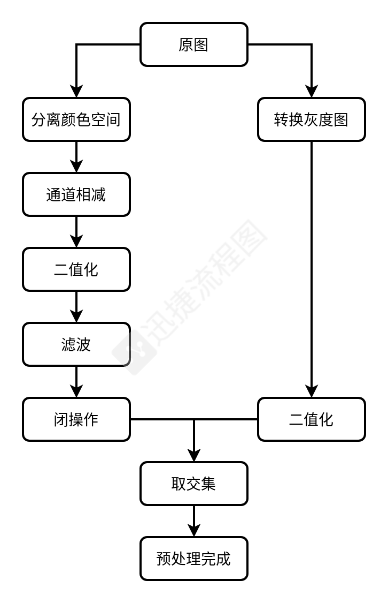

**还有另一种更为巧妙的使用了漫水法 ```floodFill()``` 来区别扇叶，直接将滤波那一步替换为 *开运算* + ```floodFill()``` 函数。**


---


- **预处理**

  和装甲爱板识别类似，我们首先要找到方法来描述这些灯条，因此在滤波之前的操作都相同。

  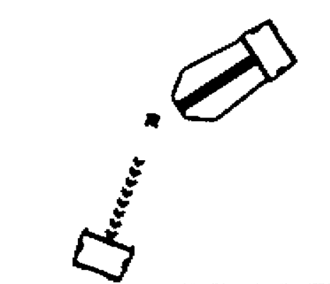

  <center>二值化后的效果</center>

  1. 使用方法一，则在滤波之后，我们考虑使用闭操作让未激活扇叶中间流动的箭头灯效和末端的矩形灯条框**连接成一个整体**（若闭操作还无法实现连接，则可能是结构元素设置的不好或直接加大结构元素的大小、进行多次闭操作），得到一个“锤子”状的图样。在能量机关激活点几乎是正对能量机关的，光线干扰会比较小，有利于我们的预处理。

  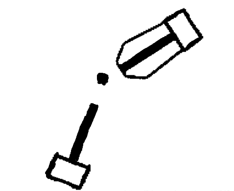

  <center>常规方法预处理完成后得到的效果</center>

  2. 使用方法二（漫水），则在二值化后先使用开元算使得图像中的各个部分分割开来，随后通过漫水法把只有一层轮廓的部分全部变成一种颜色，直接去除了流动的箭头灯效：

  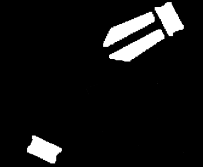

  <center>漫水法的效果，箭头灯效、R标和背景均被化为相同的颜色，截取自csdn：海人007的博客</center>

  显然漫水法得到的图样更有利于我们进行进一步的处理，但是其时间消耗要比方法一大的多（漫水法需要遍历每个像素），不过后处理会更简单，最后的速度还说不定（笔者还没测试过两种方法的速度，那就再挖个坑吧~~大笑~~）因此我们在之后会并行介绍这两种方法，分别标注为1和2。

  

  ---

  

- **选择未被打击的扇叶**

  1. 根据常规方法得到的图案，使用 *findcontours()* 得到轮廓。因为已经激活的扇叶内**有3个子轮廓**，未激活的扇叶**只有一个子轮廓**，通过hierachy中的信息就可以筛选得到待打击的扇叶了。对只有一个子轮廓的那个父轮廓的子轮廓应用 *minAreaRect()* 拟合一个旋转矩形即可。笔者曾经看到使用模板匹配和svm的方法，**那些额外操作都是根本没有必要的**（这里也提醒大家要掌握算法的底层原理，去了解函数的每个参数，对这些常用的方法要有充分的理解）。

     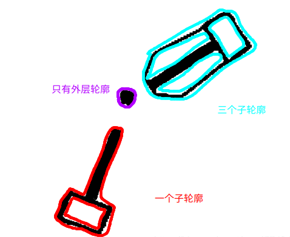

     <center>findcontour后的示意图，遍历hierachy中的子轮廓</center>

  2. 方法二会更简单一些，这里又有两种思路：

     2. 1.先进行闭操作，把结构元素设置的足够大，已经激活扇叶的三块区域就会连成一块，随后使用 *findcontours()* ，并计算轮廓的面积，显然已经激活的扇叶的轮廓面积远大于未激活的扇叶。那么大小合适的便是待击打的扇叶末端的装甲板了。此时对那个面积合适的轮廓使用 *minAreaRect()* 得到一个旋转矩形，就得到了目标。

     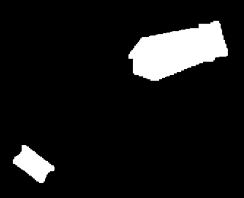

     <center>再次闭操作得到的效果，左下角的轮廓仍然是一个漂亮的矩形</center>

     2. 2.直接使用 *findcontours()* 并对所有轮廓应用 *minAreaRect()* 得到一个旋转矩形数组。对此数组进行遍历寻找那些长宽比例接近2的矩形，这些是扇叶末端的装甲板。再将这些装甲板和扇叶上的长条形轮廓拟合出来的矩形一一匹配，检测装甲板中心到这些长条中心的距离，根据能量机关的特点我们会发现未被激活的扇叶末端的装甲板中心离其他长条中心的距离都要远大于已经激活的末端装甲。因此，根据这个关系我们就能找出待激活的那片扇叶了。

        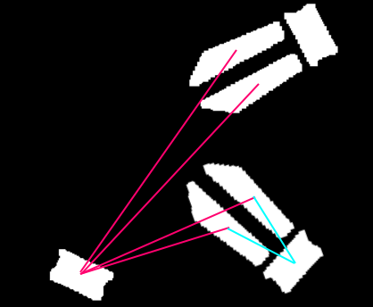

        <center>方法2.2的图示，未激活的扇叶末端装甲板到其他条带的距离至少是已经激活的装甲的2.5倍</center>

  这样，我们就得到最终需要打击的装甲板了。和装甲板识别一样，我们需要把这个信息转换成电机的控制信息发送给电控，现在就想知道的话请看 *6.3* 。不过，能量机关是处在不断运动的状态的，因此还需要对其运动轨迹进行预测和拟合，这是 *6.4* 的内容。

  

----


### 6.2.2.基于CNN的目标检测方法

前面我们已经介绍了基于检测网络的装甲板识别，能量机关的识别和前者的流程基本一致，我们首先根据扇叶的发光特点来选定要识别的范围并制作数据集，然后选择一个网络对其进行训练，得到最终的模型。

这里给出两种基于网络的方法：

- 旋转矩形检测框

  此方法首先识别整个扇叶，再对此ROI运行轮廓检测得到扇叶末端装甲板的信息。常见的目标检测网络只需要四个参数就可以确定一个矩形框，因为他们都是水平放置的，而旋转bbox则需要一个额外的参数angle来确定位置。

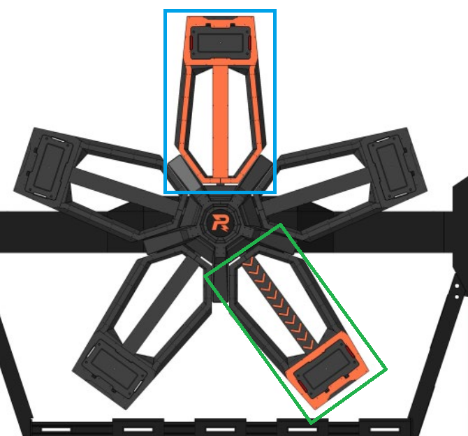

<center>先得到ROI，再使用传统方法解算</center>

- 识别扇叶的特定角点

  此方法和装甲板角点识别相同，得到需要击打的扇叶后直接对末端的四个角点进行解算。不过这里要注意最好不要直接选择扇叶末端的装甲板的四个角点，因为未激活和已经激活的角点的特征差别并不是很大，区别仅在于内侧的两个角点旁是否有灯条。因此应该选择更特殊、特征更丰富的点作为用于回归的特征点，否则遇到场地光线和其他灯光的干扰很容易出现漏检或误检。


<center>直接回归角点，不同颜色的点为不同的选点策略</center>


---


### 6.2.3.圆轨迹的拟合与运动预测

数据过滤与降噪

空间坐标系中拟合圆

傅里叶变换/级数拟合大能量机关的运动函数，寻找频率峰


---

---


## 6.3.测距与深度估计

> 在前面的解算中我们已经知道了装甲板、能量机关等在图像坐标系中的位置，那我们要如何通过相机成像模型中的投影关系把它们还原回世界坐标系中的三维点，得到装甲板相对于相机中心的距离和偏角呢？这就需要测距算法和3维重建算法。

### 6.3.1.传统的定点解算方法

- 单目相机的PnP解算方法

  3点、4点，立体几何解算


---


### 6.3.2.双目视觉和深度相机

- 双目相机


- 深度相机


---


### 6.3.3.激光雷达与相机联标


---


### 6.3.4.深度学习方法

一张depth map很容易让人联想到卷积神经网络生成的feature map，和语义分割任务。而基于卷积神经网络的深度估计方法也已经兴起许久。语义分割是逐像素的分类任务，而深度估计则是逐像素的回归任务，要得到图像上每一个点距离相机光心的距离（再次感慨神经网络真的是万能的）。


数据集较难获取。

速度限制，需要一个单独的网络来解算，不过也可以融合到目标检测网络中于检测头部并行，（是否能共享前面的feature map？怕是不能）


---

----


## 6.4.轨迹预测与跟踪

- **运动学建模**


- 利用观测器


---

---


## 6.5.反陀螺

- #### 识别陀螺的策略


- 


---

---


## 6.6.雷达站检测与小地图


---

---


## 6.7.飞镖电视制导

### 6.7.1.基本思路


---


### 6.7.2.解决方案

- **使用OpenMV的方案**


- **使用勘智k210的方案**


---

---

---


# 7.**视觉组成员需要掌握的知识**

> 在前文当中零散地介绍了一些需要学习的知识。在这个部分，会系统性的列出一张视觉组知识框架供大家参考。当然这只是笔者个人目前接触到的东西，限于个人水平必然有很多欠缺，望读者指正并提供补充建议。

## 7.1 硬件相关

### 7.1.1 计算机组成原理


### 7.1.2 微处理器结构


### 7.1.3 基本外设和硬件


## 7.2 软件相关

### 7.2.1 Linux系统


### 7.2.2 GNU工具链


### 7.2.3 网络和通信


## 7.3 语言相关

### 7.3.1 C++


### 7.3.2 Python


### 


## 7.4 电控和机械

### 7.4.1 伺服驱动单元


### 7.4.2 硬件模块


### 7.4.3 控制方法和IMU


### 7.4.4 悬挂系统


---

---

---


# 8.**视觉组的日常**

> 本部分以笔者个人为例，大致的描述了我自己每一天的工作和生活。每个人也有自己喜爱的生活方式。所以把这个部分当作故事看吧！另外，笔者拍摄了一个关于自己学习和生活的Vlog，水平有限，赏脸观看请戳这里：[A day in RoboMaster Studio -NeoZng]()


---

---

---


# 9.**心得体会和给新人的学习建议**

> 终于来到本文的最后一个部分了,这也算是笔者个人向的一些思考和观点。求同存异哦～


