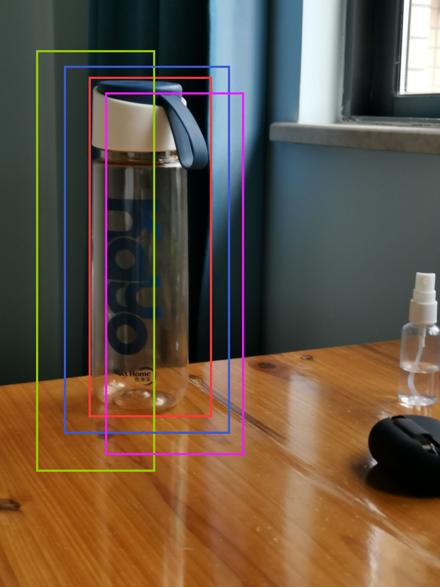

<h1><center>了解CV和RoboMaster视觉组</center></h1>

<h3><center>——你的最后一本计算机视觉入门手册</center></h3>


<h4>
<center><font face="楷体">
    湖南大学 机器人学院 RoboMaster跃鹿战队 2022视觉组 © </font>
<center>    
</h4><h4>
<center><font face="楷体">
   曾庆铖 neozng1@hnu.edu.cn  </font>
<center>    
</h4>


# 版权声明

***Copyrights 湖南大学 RoboMaster跃鹿战队2022视觉组 曾庆铖 All Rights Reserved.*** 

***本文档采用CC协议，要求保留姓名标示（BY）***。***本仓库采用 MIT License，因此你也可以将本文视作 HTML代码或说明文档***。

***==只需要注明引用来源==，就可以任意使用、复制、修改、合并、散布、出版/再版本文的部分或全部内容；本文中引用的第三方内容版权归其著作者所有。***

> 文中的有部分取自网络图片未能识别版权信息，若出现了您的图片被使用却尚未标注出处等的情况，请通过邮箱等方式联系笔者。


# 关注我（们）

GitHub： HNUYueLURM https://github.com/HNUYueLuRM/vision_tutorial ***(本教程仓库，star/watch获取最新动态！)***

CSDN： HNU跃鹿战队 https://blog.csdn.net/NeoZng

知乎：NeoAndrew https://www.zhihu.com/people/zengen-38

Bilibili：湖南大学跃鹿战队 https://space.bilibili.com/522795884

Bilibili： RoboMaster机甲大师官方账号 https://space.bilibili.com/20554233

微博： HNU跃鹿战队的微博 https://weibo.com/u/7503257970

RMCV 视觉开源数据站：https://rmcv.52pika.cn/#/rmcv

RM开源资料汇总：https://bbs.robomaster.com/forum.php?mod=viewthread&tid=6979（代码、教程、RM圆桌、分享会）

RoboMaster机甲大师官方网站：https://www.robomaster.com/zh-CN


<center>湖大RoboMaster公众号</center> 


<center>大疆教育公众号</center>


<center>RM视觉交流群</center>


>  TODO：
>
>  1. KCF（实在有点难，很难讲得通俗易懂）
>  2. 双光相机（还么测试）
>  4. 自适应滤波在控制理论中的解释（某种最优准则下的观测器？）
>  5. 图像金字塔和尺度空间的区别和联系（还在想要怎么写）
>


# *0.Catalogue*

> 推荐使用支持Latex的markdown引擎作为本文的阅读工具，如typora、vscode markdown addons、smark等。由于文中有一些动图，导出的PDF可能无法正常观看，可以到`Image_base`文件夹下寻找对应动图，或打开markdown对应。

[TOC]

---


<center>每个RoboMaster心中应该都有一个冠军梦，和一座金灿灿的奖杯</center>

# 1.摘要

> ***在阅读本文之前，你需要有计算机科学的基本知识并至少掌握一门编程语言，同时对 robomaster比赛规则和过程有大致的了解。***
>
> ***若你是计算机视觉的初学者，并不打算/已经过了参加 RM的年纪，请跳过==第二、第六部分。==***
>
> ==***若只是希望知道视觉组的基本工作，仅需要阅读[第二部分](##2.视觉在各兵种中的作用)、[第五部分的第零节](##5.0.CV的常识性概念)以及[第八部分](#8.视觉组的日常)***。==
>
> ***而你是/打算称为一名RMer，通篇阅读即可***。

> 笔者希望在这篇文章中向大家介绍视觉组的工作的基本概况和进入视觉组需要学习的知识，面向的对象为热爱机器人的朋友、战队中的其他技术组或准备进入视觉组的同学。本文会尽量广泛、全面地向你介绍视觉组的方方面面，同时可能涉及一些技术细节，***提供尽可能直观的认识和必要的公式推导，但又不涉及过多深奥的数学知识***，让其他技术组也能够了解机器人视觉模块的运行机制，以便更好地协作开发，防止出现各自为战的境况。**同时让新人能更快地接触这些知识，明白视觉软件开发的过程，减少踩坑的次数。**==本文***不提供算法对应的代码***，即没有**手把手**的实践环节==。我们力求帮助你尽快扩展视觉开发、机器人开发所需的知识面。因此，看完本教程并不意味着你已经掌握了所有知识，当且仅当你成功把所学应用到实际之中，才可谓成功。

> 本文提供了大量的优质教程的链接，避免重复劳动，并给予读者更多选择。若已有外部优质资源，这里将给出链接并以综述或总览的形式进行介绍。

> 最后也是记录一下笔者一年多来的成长，算是给自己的一个交待。限于笔者的水平，文中难免出现错误和理解不当之处（~~小孩子不懂事写着玩的~~），恳请读者指出错误，多多包涵。可以直接提交issues或者pr、通过邮箱或qq联系我！


- 计算机视觉(computer vision)无疑是当今AI界最火热的研究领域之一，和自然语言处理、强化学习并称三架马车。自然而然，在RoboMaster的赛场，视觉的软硬件开发也占有一席之地，视觉组便和其他技术组一样应运而生了。
- 视觉组负责的机器人模块主要是传感器和数据处理，即通过对相机、激光雷达等传感器采集到的信息进行处理从而让机器人在一定程度上具有”视觉”或“知觉”功能。
- 在比赛中，视觉组能够让机器人自动识别地方装甲板，实现“自瞄外挂”；也能让操作手轻松地击打能量机关，使得全队获得增益；视觉组打造的感知系统更是哨兵机器人、自动步兵上的“大脑”，没有视觉组的工作，这些机器人就完全失去了在场上的作用；视觉组同时还全权负责雷达这个兵种，耳听八方眼观六路，可谓是战场指挥官。

在第二部分，主要介绍了**视觉在每个兵种中的作用**。

第三部分则是视觉组在开发时会使用到的**软件**，如Linux系统、一些IDE和小工具。随后将会简述视觉组会使用的**硬件**如相机、各种运算平台等。

在第五部分是本教程的**重头戏**，介绍了比赛中会用到的算法，第五部分几乎覆盖了计算机视觉的**所有基础内容**；紧接着在第六部分着重叙述比赛中对第五部分算法的工程应用，即如何**让算法落地发挥作用**。这两个部分占据了全篇3/4以上的篇幅。

第七部分简要说明了在视觉组需要的**开发技能和知识**，同时也代表着**你能在视觉组学到什么东西**。==***如果你刚入门，看完第二部分以后一定要先去第七部分的最后面看看视觉组的[学习路线图](##7.6 知识体系和学习路线)和第九部分的[常见Q&A](##9.2.常见Q&A)！***==

第八部分讲了一些故事，关于视觉组同学的日常工作和任务安排，以及赛季的工作进程。

最后一个部分是笔者在视觉组学习一年以来的心得体会，和对新人上手视觉工作的一些建议。

！***另外，在每个部分中都会穿插地介绍一些视觉组在这些方面会接触到的知识***！


<h3><center>RoboMaster算法组和计算机视觉学习之旅马上开始，祝你阅读愉快！</center><h3>


---

---

---


# 2.视觉在各兵种中的作用

看图说话，有图有真相！先看看RM比赛场地”战场“上和视觉组有关的场地道具和交互模块吧。记住这些框框和注释，方便理解接下来出现的一些名词和概念，记不住也没关系，再回来看看。


<center>图源RoboMaster2022超级对抗赛规则手册；有删改</center>


## 2.1.装甲板识别（步兵、英雄、哨兵、无人机）

- 由于机器人上安装的图传模块到操作手看到的第一视角的传输延迟加上操作手反应速度的滞后，操作手几乎很难手动瞄准高速运动的机器人上的装甲板。因此，视觉组在这三个兵种的研发上主要负责**装甲板的识别算法**，通过处理图像**找到相机视野范围内的装甲板**（相机一般安装在云台上，和枪口平行放置并指向同一个方向，类似瞄准镜），进而向下位机（STM32等用于控制的MCU,microcontroller unit,单片机）发送**此装甲板的相对枪口的角度**数据，电控根据此数据**控制电机自动转向目标装甲板**，实现装甲板的自动打击。

  

  <center>自动跟随装甲板效果</center>

- 因为图像处理、上位机和下位机的通信、电机的动作（即转向目标）、发射机构的动作（拨弹机构旋转将弹丸推向摩擦轮+弹丸链路空隙），以及最耗时的弹丸在空中飞行，都会带来延迟，它们的总时长最高可以达到**0.5~0.7s**。倘若将当前时刻识别到的装甲板相对于云台的位置原原本本地发送给下位机进行控制，在识别到装甲板时刻之后的这段时间，对方机器人很可能已经移动到其他位置了（以步兵机器人为例，最快移动速度甚至可以达到6m/s，平均移动速度也有2~3m/s），我们打出的弹丸只会和目标装甲板擦身而过。因此，视觉算法还需要根据对方机器人在**过去一段时间的运动状态**或掌握其他的先验知识，预测对手在当前时刻后一段时间的运动趋势（即上述所有会带来迟滞的环节的时间总和），从而提前将云台转向对应位置，实现对目标运动的预测。玩过空战游戏的同学可能很清楚，开火的时候都要给出一个提前量。通过理论来预测物体运动趋势最早可以追溯到二战期间，控制论（cybernetics）之父维纳博士曾在美国空军基地研究自行防空火炮预测敌机运动轨迹的问题，维纳滤波器（最小方差滤波器）也是在那时候被提出的。


- 随着自瞄算法的不断升级进步，RoboMaster的赛场上也出现了“反自瞄”，其中的代表之一就是**“小陀螺”**。机器人在小陀螺模式下，云台和底盘处于分离状态，在底盘绕运动中心高速自旋的同时云台保持稳定不动。在这种情况下，视觉识别的难度会大大上升，一是自瞄很难跟上装甲板的高速转动，基本上我方机器人的云台运动会滞后于装甲板的运动；即使使用了前述的预测算法，由于装甲板在很短的时间内就会在车身的一侧“消失“，这往往会导致预测失误，给出的提前量过大使得**预测值超出车身范围**（瞄到空气）；二是即使跟随到一个装甲板后，那个装甲板随着底盘的转动很快消失在视野中，此时就要锁定另一块装甲板，使得云台在切换目标的过程中会来回转动，无法稳定，导致弹丸命中率下降，且从操作手的第一界面看来，整个画面不断晃动带来晕眩感，体验极差（更有甚者直接”晕车“）。其他单位尚且可以通过”火力覆盖“的方法凭借运气击中”小陀螺“，而开火冷却时间长、弹丸价格高昂的英雄机器人可不敢随随便便对着小陀螺开火。

  因此，**反“小陀螺”**算法出现了：通过设计合适的策略，识别对手的机器人处于小陀螺状态，然后让云台对准敌方机器人的中心位置而不再跟随装甲板移动。由于机器人处于“小陀螺”状态时基本上是匀速转动，这样就可在适当的时机开火（可以采用一些预测算法预测装甲板何时运动到云台所对准的位置），提高命中率。也可以通过一段时间的检测，计算出对方机器人地盘转动的速度，从而预测出每一块装甲板出现和消失的时刻，进行打击。

  当然，随着反”小陀螺“算法的出现，赛场上又开始出现反‘反“小陀螺“ ’算法如变速小陀螺、超快小陀螺（舵轮步兵）、随机转动等。哈尔滨理工大学（荣成校区）还研发出了偏心小陀螺，它的云台有额外的平动自由度，使得转动的中心不在底盘的中心，[戳这里看](https://www.bilibili.com/video/BV1Fp4y1t7Vc?t=93.3)(精准空降)。~~快进到反反反反反小陀螺~~（禁止套娃）因此，今后必定需要研发出鲁棒性（健壮性）和泛化性能更好的算法，才能应对愈发“卷”的比赛啊～

  

  <center>处于小陀螺运动下的步兵机器人</center>

  

- 英雄**狙击点机制**的加入让三维视觉又有了用武之地。英雄机器人在狙击点发射大弹丸将会**返还**10个金币，并且狙击点处发射的大弹丸若击中对方的基地会获得2.5倍的攻击力增益！而传统英雄吊射（狙击）都是采用**量测射表**的方式进行的：通过云台不同仰角的弹丸发射测试，获取不同距离的落点信息，得到一张**射表**；然后在操作界面上利用自定义UI画出不同距离时需要对准的位置，从而实现瞄准。

  

  <center>类似狙击枪/火炮的瞄准镜</center>

  这种方法一方面对发射机构和云台的机械精度要求很高，另一方面还要保证摩擦轮的状态始终保持一致（如果摩擦轮的硬度/磨损程度发生改变都会使得弹速变化），同时，操作手还得是“写轮眼”，要能够精确对准对应距离的瞄准线。实际上算是一种**半开环**的控制过程，操作手只能根据每一发弹丸的落点对云台姿态进行修正。诸多约束条件的限制使得英雄狙击难上加难，狙击成功率基本靠“抽奖”

  那么应该如何定量的确定狙击时需要的云台仰角，并准确地将炮口方向对准目标呢？假如我们能精确定位英雄机器人的位置就好了！通过**雷达系统**，我们用某种方式计算出雷达相对英雄机器人的距离，而雷达在绝对系下的坐标又是可知的，整个战场的各种尺寸也在规则中给出，由此以来就可以利用准确的公式计算英雄机器人狙击时需要的瞄准参数了！

  

  <center>哈工大I HITer战队的英雄机器人头顶一个ArUco定位标签，笔者猜测就是用于雷达定位的</center>


---


## 2.2.能量机关（步兵）

- 在比赛场地的中央有一个风车形状的场地道具，就是能量机关。它也被称作”风车“、”神符系统“或”大符“（大能量机关）”小符“（小能量机关）。能量机关的**激活点**是我方高地处的一个高台，距能量机关7m。我们需要用小弹丸按顺序连续击中五片随机亮起的扇叶的末端装甲板才可以激活能量机关。激活小能量机关能够为队伍带来50%的攻击力增益，大能量机关能为队伍提供**100%的攻击力增益和50%的防御增益**。由于图传模块使用的是广角镜头，因此从操作手的第一视角看来五片扇叶的**间距非常小**，再加上遥控的延迟，难以通过鼠标移动来进行打击，并且小能量机关处于**匀速旋转**的状态，大能量机关更是**以 *0.785sin(1.884t)+1.305* 的角速度旋转**（在2022赛季其旋转角速度已经修改为$Asin(wt+\theta)+B$，上式的四个参数都是在一定范围内**随机初始化**的），操作手**很难预测其运动轨迹**。两片扇叶之间的**击打间隔必须小于2s**，否则能量机关将会重置回到初始状态，之前已经击打成功亮起的扇叶会直接熄灭。这便需要视觉组设计算法来识别未被击打过的末端装甲板并对其实现自动瞄准，找准时机控制子弹的发射从而实现自动击打能量机关。


- 能量机关任务对视觉来说可以分为两个部分：**扇叶识别**和**运动状态拟合**。首先需要识别出待击打的扇叶，然后利用包括能量机关的旋转速度、能量机关的几何尺寸等已知信息预测出一段时间后的目标位置，进而发送给下位机实现击打。对于大能量机关，我们还需要辨识出被随机初始化的四个用于确定旋转角速度的参数：幅值、角频率、初相和角速度常数。扇叶识别的任务和装甲板识别非常相似，难度更是有过之而无不及，因为在激活点看向能量机关，背景处常有形式复杂多样的光线干扰。运动状态拟合则需要综合信号处理、傅里叶分析、非线性优化等知识。


- 除了激活我方的能量机关，我们还可以在对手激活能量机关的过程中干扰对手。在能量机关的激活的规则中规定：倘若击打了错误的扇叶（如已经击打过的扇叶或尚未亮起的扇叶），能量机关会将进行重置，因此，我们可以进入敌方半场，通过识别对手已经激活的扇叶并自动瞄准它，发射子弹击中错误的装甲板进而触发重置以干扰对手的激活过程。

  

  <center>正在激活小能量机关的步兵机器人；图源RoboMaster2021内部技术交流</center>

  

  ---


## 2.3.哨兵

- 哨兵机器人被悬挂在基地前方的导轨上往复运动，是场上的一个**全自动机器人**，其移动、目标搜索、打击敌人的行为都依赖于其**自主决策**。它相当于基地的防御塔。编写一个优秀的感知程序和决策程序，是发挥哨兵机器人威力的关键。哨兵机器人的云台会不断地转动使得上方安装的相机能够扫描到它附近的每一个角落，一旦识别到敌方的机器人便能立即锁定对手，随后根据其决策算法判断是否开火。也可以安装其他的传感器如激光雷达等，融合更多来源的数据以帮助更好地进行决策。

- 我们还可以让在哨兵机器人遭到攻击时进入快速机动的规避状态，在导轨上进行随机地不规则动作以躲避敌方的弹丸并干扰敌方机器人搭载的预测算法。

- 在前哨站尚未被击毁时，哨兵机器人处于无敌状态，这时我们可以让哨兵机器人保持固定以提高自己的命中率，一旦前哨战被摧毁，立即启动哨兵机器人的底盘，进入巡逻状态。

- 规则中允许机器人间通过裁判系统进行通信，因此操作手可以通过官方规定的串行接口向哨兵发送指令，以改变哨兵的状态或完成简单的控制。

  

  <center>巡逻中的哨兵机器人；图源RoboMaster2021内部技术交流</center>

  

  ---


## 2.4.工程

- 工程机器人在本赛季的任务主要有：**抓取矿石**、**兑换矿石**、**移动障碍块**以及**救援阵亡机器人**。这里的每一步都可以利用视觉识别以完成自动化。

- 在抓取矿石的时候，可以在工程机器人的机械爪上安装可见光相机、测距传感器等，再编写相关的算法来识别矿石，实现自动对位和自动夹取。在技术交流中，上交、东大等惊艳全场的“空接矿石”依赖的就是自动识别矿石的算法。

  

  <center>金矿和银矿</center>

- 在兑换矿石时，当且仅当矿石下方二维码处的RFID被兑换站扫描到之后再推入，才视为兑换成功。而工程机器人在抓取矿石的时候无法保证矿石的朝向始终正确，因此可以通过识别矿石的姿态来自动翻转矿石。同时，根据兑换站上的一些图像特征，还可以定位扫描矿石窗口的位置，来快速地完成自动化兑换，不需要操作手手动控制机器人以提高效率。

  

  <center>矿石下方的二维码，内嵌一个射频模组；二维码一样能够当作特征作为检测对象</center>

- 障碍块夹取算法的设计与矿石识别算法如出一辙。通过移动障碍块，我们可以改变战场的地形来阻挡对手的推进或保护我方机器人。

  

  <center>障碍块；其定位标签和矿石相似，因此识别算法基本可以复用</center>

- 在我方机器人阵亡后，可以通过两种方式复活阵亡机器人：工程机器人将其拖回基地旁的补血点（被称作”回家复活“）或是让工程机器人所携带的复活卡（RFID射频卡）和其他机器人上的场地交互模块接触（被称作“刷卡复活”）。在这两种情况下，都可以通过编写视觉算法来实现快速准确地救援。可以在工程机器人的救援机构（夹爪、电磁铁）旁安装相机，并在其他机器人上黏贴二维码、ArUco等或利用已有的特征，通过算法识别对应特征从而进行对位，将工程车的救援机构（夹爪、电磁铁等）对准待施救的阵亡机器人上的救援结构（如环、柱、磁铁等），让工程机器人自动套牢阵亡的机器人，随后就可以把阵亡机器人抬走了（或者原地刷卡复活）。

  

  <center>正在夹取矿石的工程机器人(哈工大 I HITer战队)；图源RoboMaster2021内部技术交流</center>

  

  ---


## 2.5.雷达

- 雷达是本赛季新增的兵种，被放置在场边的一处高地上，拥有**全局视野**。利用目标检测算法和三维重建、反向投影等，可以定位敌方机器人在场上的位置。随后，我们能利用这些信息为我方制作一张实时更新的“小地图”，掌握对方机器人的动向，以帮助我方操作手进行战术决策，做到知己知彼而百战不殆。

- 雷达在将全局数据处理后，还能**通过多机通信功能和己方的自动机器人如哨兵、自动步兵进行通信**，相当于为它们开了一双“天眼”。这无疑是极大地增强了这些自动单位的感知能力和决策能力(我愿称之为云计算!)，通过机间通信使得机器人不再受到边缘计算平台计算能力潺弱的限制，让算法火力全开，~~也让我们离全自动机器人战队又更近了一步。~~

- 可以参考[上海交通大学的雷达站](https://www.bilibili.com/video/BV1FM4y1579H)，基本功能都已经实现，API封装的很好，通信功能也很完善，适合在其上进一步开发。

  

  <center>两侧各有一枚相机，中间被罩子盖住的是激光雷达；图源沈航-TUP战队</center>
  
  
  

---


## 2.6.飞镖系统

- 飞镖系统也是2020赛季新增的兵种，相当于战争中的”导弹“。其目标是且仅是比赛中的建筑物：前哨战和基地。云台手可以控制飞镖闸门的开启，每局最多能开启两次，每局最多发射四枚。一旦命中，可以造成巨量伤害（前哨站750点，基地1000点），以及对**对方全体机器人长达5秒的视障效果**（遮挡操作界面，相当于fps游戏中的“闪光弹”，~~A1高闪来1个！~~）。最关键的是，发射飞镖不需要消耗金币！

  

  <center>飞镖的本体，前方带“R“标的是击打触发装置，前哨战和基地可以检测其上发出的红外光以确认是否击中</center>

  

  <center>飞镖发射架；以通过包胶轮摩擦、挤压飞镖以提供动力</center>

- 高收益却不意味着高成本，那就意味着高技术难度。对于机械和控制组的同学来说，空气动力学在本科阶段是较为复杂的领域，镖体设计、发射方式等都需要经过精心地设计，由于依赖经验和试错，大量的实验是不可避免的。对于视觉组的同学来说，为了实现主动制导，我们需要给飞镖一个打击的目标。前哨战和基地顶部各有一个特殊的装甲板以及一枚绿色引导灯，这可以作为我们的参考对象。由于规则（制作规范手册）对飞镖镖体的体积和重量都有限制，我们只能选用一些片上系统作为运算平台，并且尽可能地精简算法以提高识别帧率，毕竟飞镖的速度最快可以达到18m/s，而发射站距离前哨战只有16.3m左右的距离！

  

  <center>前哨站和基地顶部的装甲板和飞镖引导灯</center>

- 现阶段大部分学校采用的都是惯性开环方案，通过反复实验，开环确实可以达到相当的精度，如四川大学和广州城市理工（原华南理工广州学院）的飞镖就非常的精准（命中集锦戳[这里](https://www.bilibili.com/video/BV19g41177HC)和[这里](https://www.bilibili.com/video/BV13t4y1h7GR?t=16.6)）。但是，如果能添加闭环，则会大大提高其灵活性和对扰动、误差的容忍性，这将极大程度地减低对飞镖发射架机械精度的要求和对镖体的一致性以及两者的时不变性的严苛限制。更何况，我们又怎么能保证不会出现**反导系统**呢？（近防炮，开火！~~ARMA3玩家集结~~）据笔者所知，由学校已经正在开发哨兵反导功能了。

  


---


## 2.7.自动步兵

- 自动步兵同样是本赛季新增的兵种。当不为某台步兵机器人配备操作手时，可以将此机器人配置为自动步兵。自动步兵的**所有属性**都高于普通步兵机器人，其底盘功率、枪口热量上限、冷却速度、血量上限、弹丸射速都相当于同级的步兵机器人选择了所有类型的升级加点，甚至还要更多，是当之无愧的“**六边形战士**”。

  

  <center>自动步兵机器人的属性</center>

- 超高的属性值便意味着极大的开发难度。由于没有操作手，机器人进行的所有移动、攻击等动作都需要自主决策。虽然弱AI（在一个特定的问题上能够取得比人类更好的成绩）在特定领域已经击败人类，但是强AI（拥有各方面的智能）的诞生也许还为之过早。自动步兵便算是**向强AI探索的一个尝试**。

- 为了知道自己“在哪里”，自动步兵需要搭载**SLAM**系统（Simultaneous Localization And Mapping)以帮助自己构建整个地图的信息；为了知道要“往哪走”，自动步兵要能够进行**路径规划**；为了能够自己决定“怎么做”，自动步兵要配备**自主决策**系统以确定当下应该执行的动作...... 总之，这是一个大有可为，上限极高的研发方向。

  > 由DJI承办的RMUA（RoboMaster Uniersity AI Challenge)赛事便是一项关于全自动机器人对抗的比赛，自动步兵的规则引入也是由此而来的。若要了解更多，请访问[RoboMaster ICRA RMUA](https://www.robomaster.com/en-US/robo/icra)。RMUA2021年决赛视频请看[这里](https://www.bilibili.com/video/BV1M64y1S77b)，2022在[这里](https://www.robomaster.com/zh-CN/robo/icra?djifrom=nav)。哈尔滨工业大学（深圳）在今年5月卫冕成功。


---

---

---


# **3.视觉组接触的软件**

> 进行视觉开发会用到各种各样的软件、开发环境、辅助工具等，所以很有必要了解一些相关的快捷键、命令、使用技巧。选择一款适合自己的IDE能够提高开发效率，方便版本管理。

## 3.1.Ubuntu

- 为什么使用Ubuntu

  - Ubuntu是一个Debian系分支的第一大系统，是当前**用户量最大的linux发行版**。因此，遇到任何问题一般都能够在用户社区[askubuntu](https://askubuntu.com/)中得到解答。它的安装也非常的方便，并且在更新到20.04后，ubuntu的桌面美观性也有提升。同时，ROS是在Ubuntu之下开发的。如果要使用ROS，Ubuntu是你的不二之选。

  - Linux下开发C++程序相比Windows有无与伦比的优势，可以方便的配置各种第三方库和依赖。常言道python好用是因为有大量开箱即用的第三方库，可以轻松通过pip安装，而Linux下通过yum/apt/pacman等包安装软件管理的软件包，实际上就是C/C++隐藏的库安装/管理利器！apt是Debian系发行版用于管理第三方库的一个软件，负责管理系统中安装的各类软件包，开发包，依赖库。可以通过apt轻松地安装各种软件（可执行文件）、开发库（头文件headers，.so动态链接库等。如果你曾经在Visual Studio中为项目配置繁杂的头文件、链接库路径等依赖，你一定会爱上Linux下用cmake管理c++环境的开发方式。

  - Linux的内核和上层系统都比Windows更加精简，故在**运行时占用的各类资源都要小于Windows**。在不打开任何应用的情况下，笔者的电脑在运行Windows10时占用的内存为4.2G，cpu占用率在10-20%左右，而运行Ubuntu20.04LTS的时候，只使用了2.2G的内存，cpu占用率只有10%不到。这样，在运行我们的视觉算法程序时，可以更充分地利用系统资源，最大程度压榨电脑的性能。（甚至可以在测试结束后实际运行时关闭图形界面，只保留终端！这样，系统内核作为唯一需要运行的基础程序，大概能将cpu占用率缩小到1-2%）

  - Linux对于深度学习的支持比Widnows更加友好，经常有sh脚本能够一键配置开发环境。此外Linux对一些设备驱动的支持也更完善，我们可以选择挂载自己需要的驱动和IO，并且精简属于自己的内核。

    

    <center>截止本文编写到此处，Ubuntu已经发布22.04 LTS</center>

- 想要安装Ubutnu，可以参阅这篇教程：[Ubutnu/Windows双系统的安装-排除各种问题！-NeoZng](https://blog.csdn.net/NeoZng/article/details/122779035)，当然，学习时使用虚拟机也是不错的选择，这能给你更大的试错空间，不用担心把系统搞奔溃。

- 提到Linux就不得不提到**命令行的使用**，在Linux上进行开发常会使用到命令行，有些软件甚至只有命令行界面的版本。在一些时候，直接在命令行中用键盘操作可能要比数不清的鼠标点击快得多。你需要学习：

  - cd、ls 、pwd、mv、cp、touch、diff、rm、cat、mkdir、rmdir、echo、tar等文件系统的基本操作，grep、find 查找文件和目录
  - 帮助手册man和-help参数。
  - sudo、su、chmod等权限相关的操作。
  - ping、ifconfig、wget等网络相关的操作。
  - ***一定要亲手熟悉命令行的基本命令，切忌只看不动手！***学习以上命令，戳这里[Linux Commands](https://linuxconfig.org/linux-commands)，简版的教程推荐这个：[Linux Commands | Harry's Blog ](https://harry-hhj.github.io/posts/Linux-Commands/)

- **至少掌握一个**无GUI的文本编辑器的基本使用，如vi，vim，nano等。这能够帮助你在系统出现问题的时候快速修改一些配置文件，或是在使用ssh连接的时候简单地编写一些程序。当然，笔者**不推荐**你将这些文本编辑器作为主力IDE使用（即使是安装了各种各样的插件！）虽然一个熟练使用vim的程序员和一个熟练使用eclipse的程序员拥有相同的开发效率，但是vim的学习成本可不知道比eclipse高多少！

- Linux的设计哲学是**“一切皆文件”**。它将所有的IO设备如网络接口、usb接口、显示屏、相机、键盘鼠标、应用都视为文件，和这些“文件”的交互就是以规定的方式进行读写。因此，有必要了解Linux下的基本目录和文件组织方式，其目录结构请参考：[Linux文件目录结构一览表](http://c.biancheng.net/view/2833.html#:~:text=%E4%BD%BF%E7%94%A8%20Linux%20%E6%97%B6%EF%BC%8C%E9%80%9A%E8%BF%87%E5%91%BD%E4%BB%A4%E8%A1%8C%E8%BE%93%E5%85%A5%20ls%20-l%20%2F%20%E5%8F%AF%E4%BB%A5%E7%9C%8B%E5%88%B0%EF%BC%8C%E5%9C%A8%20Linux,%E5%90%8C%E6%97%B6%EF%BC%8C%E5%90%84%E4%B8%80%E7%BA%A7%E7%9B%AE%E5%BD%95%E4%B8%8B%E8%BF%98%E5%90%AB%E6%9C%89%E5%BE%88%E5%A4%9A%E5%AD%90%E7%9B%AE%E5%BD%95%EF%BC%88%E7%A7%B0%E4%B8%BA%20%E4%BA%8C%E7%BA%A7%E7%9B%AE%E5%BD%95%20%EF%BC%89%EF%BC%8C%E6%AF%94%E5%A6%82%20%2Fbin%2Fbash%E3%80%81%2Fbin%2Fed%20%E7%AD%89%E3%80%82%20Linux%20%E6%96%87%E4%BB%B6%E7%B3%BB%E7%BB%9F%E7%9B%AE%E5%BD%95%E6%80%BB%E4%BD%93%E5%91%88%E7%8E%B0%E6%A0%91%E5%BD%A2%E7%BB%93%E6%9E%84%EF%BC%8C%2F%20%E6%A0%B9%E7%9B%AE%E5%BD%95%E5%B0%B1%E7%9B%B8%E5%BD%93%E4%BA%8E%E6%A0%91%E6%A0%B9%E3%80%82)。对于文件**读写权限**的管理也非常重要的，这决定了用户/程序对某些文件是否有访问权限。要是对文件系统有一些了解，那便更好不过了。

- 在使用系统的时候，建议大家有良好的文件分类习惯，把代码库、软件、开发环境分开存放，避免出现home目录乱糟糟的情况。

  

<center>这篇文章就是在Ubutnu下使用markdown编辑器完成的</center>


---

---


## 3.2.IDE

想要编写代码，光靠文本编辑器+gcc+gdb可不行，我们要充分利用技术进步带来的便利，谁不喜欢做懒人呢。这里推荐几款Linux下编写C++程序使用的IDE：

- [**VSCode**](https://code.visualstudio.com/Download)：微软的小儿子，啥系统都能用。丰富的插件生态只有你想不到没有你找不到，配置完之后使用起来非常方便，比如C++就有一个**C++ extensions pack**。官方文档也很详细，毕竟是微软主推的下一代编辑器。关键是好看啊！在使用了snippets和Visual Sutdio Intellicode这两个插件之后，智能提示也足够智能。想要写其他的语言也能够一条龙配齐，总之，上手容易且可定制化程度极高。

  

- [**Clion**](https://www.jetbrains.com/clion/download/#section=linux)：JetBrain家的IDE，界面很美观，智能提示也很智能。以前用过PyCharm或者其他jb系的IDE的同学可以继续使用。统一用cmake管理项目，对cmake扩展的支持非常到位。也提供了大量的可选插件。用.edu后缀的学校邮箱可以免费申请[教育资格](https://www.jetbrains.com/community/education/)，就可以免费用了。

  

- [**Qt**](https://wiki.qt.io/Install_Qt_5_on_Ubuntu#:~:text=Installation%20Guide%20%28Ubuntu%20package%29%20Open%20a%20terminal.%20Type,or%2064-bit%20Linux%20installationdepending%20your%20version%20of%20Ubuntu.)：Qt也是一款跨平台的C/C++ IDE，在Qt上编写的GUI程序能够在所有平台上运行。用Qt可以方便地编写一些图形化的程序，比如串口调试助手、调参助手等。他的整体界面也算是比较清爽。

  

- **这里需要特别提及的是CMakeLists的编写。**Linux没有Visual Studio这样保姆级的IDE，并不存在一款能够自动为你生成makefile的软件。所以至少要学习qmake和cmake中的一种工具。这里推荐cmake，虽然比qmake的语法稍微复杂一些，但是cmake的功能非常强大，拥有非常优良的跨平台支持。学习cmake还能帮助你进一步了解程序的编译、链接过程。关于程序是怎么从源代码到机器代码最后在电脑上运行起来和cmake的基本使用，请参考[《程序的生前死后-Cmake-noob-comein》-NeoZng]()这篇文章。

  

萝卜青菜各有所爱。虽然IDE把工具链都集成在了一起，极大地方便了我们的使用，但笔者还是推荐你学习一下**GNU工具链的使用**，至少熟悉编译、汇编、链接的过程。这样可以更深入的了解软件的运行，以便在开发过程中出现问题的时候，快速定位问题所在并找到解决方法。


---

---


## 3.3.Git

团队协作开发需要一款优秀的代码管理工具，那**Git就是不二之选**，大家肯定都听过GitHub这个最大的提供gitlab服务的~~同性交友~~平台，它便是一个基于Git的代码托管平台。这里有个小故事，Git是Linux的元老Linus因为Linux社区被禁止使用BitKeepter这款版本控制软件后，一怒之下在一周之内用C写出来的程序哦。

我们实验室开始的时候都是用u盘拷贝程序，有时候在某个人的电脑上写一点有时候又在minipc上写一点，虽然在文件夹上标准了时间和版本号，然而这并没有什么用，这导致一次合并代码的时候有十多个版本的代码，根本不知道哪个能用哪个不能用，那时候又还不知道diff这个工具，弄得眼睛都快无了。

要学习Git，推荐这几个网站：[廖雪峰的git教程](https://www.liaoxuefeng.com/wiki/896043488029600)   [git简易指南-no deep shits!](https://www.bootcss.com/p/git-guide/)   [GitHub Guides](https://guides.github.com/)

在学习Git的时候，**一定要动手跟着一起实践，切忌光看不动！**俗话说熟能生巧。


<center>git的标志性图标，分岔的icon表示强大的分支功能</center>

只要学会创建分支、合并冲突、建立远端仓库、合并分支和版本回退等基本操作即可，过于复杂的功能需要时查阅man和help，没必要强行记忆。


---

---


## 3.5.其他常用软件和小工具

- [Microsoft Edge DEV for Linux](https://www.microsoftedgeinsider.com/en-us/download/?platform=linux) ：Edge浏览器Linux版，可以方便同步windows下的收藏夹、设置、插件等。集锦的功能非常好用。

  

- [SimpleScreenRecorder](https://www.maartenbaert.be/simplescreenrecorder/#download) ：一款录制屏幕的软件

  

- VLC：一款多媒体播放器，方便录制调试视频后进行观看。若安装系统的时候选择最小安装，则不会预装媒体软件，因此需要自己安装。

  

- qv4l2：linux下相机驱动的图形界面，在Ubuntu软件商店可以找到，方便调节普通USB相机的参数。

  

- Meld：一款diff软件的图形界面，方便对比文件的不同，在Git使用merge或pull的时候可能会用上,在Ubuntu软件商店可以找到。虽然vscode也预置了此功能（只需要安装git便会激活），但是只能在被git管理的repo文件夹里面启用。

  

- [Fsearch](http://cboxdoerfer.github.io/fsearch/)：和Windows下的everything类似，提供超快速的文件检索功能。

  

- [Typora](https://typora.io/#linux)：好看好用的markdown编辑器，本文就是使用typora编写的。**使用markdown编写代码的说明文档是一个很好的习惯**，这可以降低其他人阅读你编写的代码的难度，也有利于代码分享和代码的传承。同时，你的也可以使用markdown来记录自己的学习历程、一次艰难的问题解决之路。使用markdown可以提高你的记录效率。vscode内也有相关插件提供对markdown支持。现在似乎要收费了，可以在官网下载beta history版本，版本号为0.x的公测版仍然免费。

  

- TigerVNC：一款局域网内可用的远程桌面软件，VNCViewer也可以作为替代。***强烈推荐使用远程桌面调车！***电控都有无线调试器，我们怎么能跪在地上呢（气抖冷）。在把运算平台安装到机器人上之后，我也曾经拿着一块小屏幕和键鼠，蹲在地上和机器人进行亲密交流，这不仅加深了我和机器人的感情，~~也加重了我的颈椎病和腰椎键盘突出。~~（最恐怖的是车车的云台或者底盘疯了的时候，线全部缠到机器人上**！！机器人甚至有可能对你造成伤害！！**~~都是电控的锅，你云台怎么又疯了~~）使用了vnc后，只要将minipc和你的笔记本连接到同一个局域网，你就可以优雅地拿着笔记本调车了。如果校园网的带宽不够，建议买一个路由器，或者和搭建裁判系统的路由器公用也可以。

  

  其他远程桌面如Xrdp（分辨率和画质最好）、**NoMachine**（最流畅，画质次之，可以实现局域网内IP自动搜索，强烈推荐！）也是很好的选择。
  
  > 配置Xrdp的步骤稍微有一点多，参考：[Ubuntu利用xrdp实现远程桌面连接](https://blog.csdn.net/NeoZng/article/details/123505127)；在此过程中可以熟悉linux系统的环境变量配置以及简单的计算机网络知识。
  
  >  上交的同学更是把这件事做到了极致，他们直接通过网页来修改机器人的各种参数并得到反馈信息，能做到不需要任何远程桌面就能实时调参，此想法以为妙绝！华南师范大学使用ROS会话进行网页可视化，也是一种选择。不过这些都需要了解包括动态网页的构建在内的一些基本前端知识。
  
- SSH：在外面不需要图形界面的时候，能够直接连接终端就是一件很方便的事情。并且在代码真正部署上车时通常我们为了最大程度降低额外开销会选择关闭图形界面，终端连接就成了不二之选。使用过SSH连接服务器的同学应该对此不陌生了，有兴趣的同学可以了解一下**非对称加密**的原理。linux下可以直接使用终端作为ssh的客户端，windows下Microsoft全新推出的windows terminal也十分美观。其他的如PuTTy等也可以尝试。

  VScode也有SSH connection插件，可以将连接端的文件夹映射到本地，同时还可以直接在code里**重用端口开启多个终端**！关于SSH的原理及其在windows/linxu下的简单配置，[戳这里]()。
  
  

- Docker：标志性的小蓝鲸logo。Docker可以把开发环境和依赖打包在一起并于Docker engine上运行，运行时完全和系统的环境隔离。就像一个**轻量级**的虚拟机。Docker能够将应用程序与基础架构（操作系统、开发环境、依赖等）分开，使用docker engine提供的抽象大大提高兼容性，不需要关心底层和外部复杂的关联从而专注于软件开发。相信很多同学都遇到开发的时候配环境时醉生梦死的情况，使用Docker镜像则可以免除这一切烦恼！华南师范大学PIONEER战队的[开源代码](https://github.com/chenjunnn/rm_vision)就提供了Docker的部署方案。

  
  
  
  
  <center>Docker的架构</center>
  
  

---

---

---


# **4.视觉组接触的硬件**

> 虽然别人总觉得视觉组就是整天对着屏幕臭敲代码的程序员，实际上我们也会接触很多的底层硬件与传感器，在使用硬件的同时很可能还需要综合运用其他学科的知识。

## 4.1.相机

相机是机器人的眼睛。和人眼的成像原理一样，相机通过镜头汇聚光束使他们聚集在一块半导体感光元件上（相当于视网膜）从而产生可供读取的数据。随后图像随着数据线传如miniPC等运算平台（视网膜刺激视神经传到神经冲动到大脑）。时下的感光单元主要分为两种：**CMOS和CCD**。电类的工科生或是摄影爱好者对此应该不会感到陌生。

- CMOS(complementary metal-oxide semiconductor)传感器是由金属氧化物半导体排成的阵列，和发光半导体相反，其上的pn结受光照时会产生电荷存储在电容中，通过和内存一样的结构采用行选和列选开关，为每一行/每个像素点配备**放大器和AD**（Analog-to-Digital converter,模拟-数字信号转换器），选中位置的信号会通过OP和AD，从而将电荷转换为数字信号，最后生成图像。优点是**成本低，图像帧率高**，但是固有不可消除的采集噪声（每个采集单元的参数不可能完全一致）会影响成像的质量。

- CCD(charged couple device)传感器是由最简单的MOS电容器阵列构成的，与CMOS不同，CCD的**每一行像素只配有一个信号处理器**，利用时钟脉冲驱动产生的差压，这一行电容器采集到的电荷会以串行的方式依次通过每一行末端的信号处理器从而产生图像。因此CCD能达到**更高的像素密度**（CMOS上的op和ad都要占用空间），其优点是**成像的一致性好，噪声很小**，由于不能同时处理所有信号，其帧率一般不高。

- 想要获得关于感光单元的更多信息，请参阅[cmos和ccd](https://zhuanlan.zhihu.com/p/139394687)。

- 系统地学习成像原理，参见国防科技大学的MOOC：[《第十五讲：CCD图像传感器》]([传感器与测试技术_中国大学MOOC(慕课) (icourse163.org)](https://www.icourse163.org/learn/NUDT-1003089003?tid=1466987457#/learn/content?type=detail&id=1247289367&sm=1))

  

  <center>这是我们实验室的一枚MV工业相机，可以看到正中间有一块小小的CMOS传感器晶片</center>

相机的快门还有**全局曝光**和**卷帘曝光**之分。全局曝光时一次性采集所有感光单元的信息或为每个感光单元配备一个寄存器暂存电荷，而卷帘曝光则是分时逐行采集信息（根据其名“卷帘”就能看出是一排一排地采集数据）。若经费充足建议购买全局曝光的相机，其所有单元在同一时刻采样，曝光时间和我们设置的曝光时间才是真正一致的。而卷帘曝光的相机第一行首先完成曝光，接着是第二行、第三行...到最后一行完成曝光时，中间大概有数百ns甚至ms级的时间，这就导致整个画面其实不是在同一时间采样的，在面对**高速运动**的物体是会出现**“果冻效应”**，即图像的不同部分出现倾斜、断层等现象，极大地影响了成像质量和识别的效果。CCD相机一般使用全局快门，而CMOS相机使用全局快门的制造成本很高，需要为每个感光单元配置一个寄存器。


<center>这两幅风扇的图像是在相同时刻分别用全局快门和卷帘快门的相机拍摄的</center>


---


### 4.1.1. 镜头

就像人的晶状体，不同的是，人的晶状体是可以改变焦距但像距固定，而一般使用的工业相机和USB相机配套的镜头**是定焦但可以调节像距的**。不过在小孔成像模型中，我们把透镜看作被压缩成一个点的大小，因此在这种情况下我们认为**焦距和像距等同**。


<center>从透镜到小孔的近似过程，截取自知乎-龚健男的回答-凸透镜和小孔成像的原理与联系</center>

- 我们都知道镜头是一块凸透镜，在他的两边各有一个焦点，焦点即所有平行进入透镜的光线的汇聚点。不同焦距的镜头其视距和视野范围不同，一般来说，**视距大（看的远）的镜头，其视野范围小（可视角小）**；**而视距短（看的近些）的镜头，视野范围大**，典型的例子是广角镜头。拿生活中的例子来说，现在的手机的摄影系统都是由多个镜头组成的，每个镜头的焦距一般不同，从而适应不同焦段和视野的摄影需求。高级的镜头通常可以调节光圈大小，从而改变镜头的进光量。

- 在比赛中，我们一般给步兵机器人配置广角镜头（适用**近战**，可视角广）或是6mm的镜头（中庸的选择，**兼顾长短**）。打击能量机关的步兵机器人会选择8mm、12mm的**长焦镜头**来获得更好的远距离成像效果。哨兵机器人可能会配置两个相机，分别搭载广角镜头和中短焦镜头，广角用于“广撒网”，对敌方目标进行大致的定位，之后交由另外一个相机进行精确的定位。有些打得准（弹道精度高）的队伍甚至为所有机器人都搭载了两枚镜头或选用**变焦镜头**，让机器人成为各个距离都能实施自动打击的多面手。海康机器人的官网提供了一个镜头选型工具：[海康机器人-镜头选型工具](https://www.hikrobotics.com/cn/machinevision/visionproduct?typeId=40&id=247)，输入参数后可以自动计算需要的视场角和靶面尺寸、焦距等，不过它推荐的肯定是自家的产品，只需要拿着相应的参数自行联系经销商或去tb上找平替款即可。

  *若想要更有针对性地选择镜头的焦距，可以根据相机成像模型进行视野要求和焦距之间相关关系的计算。*

- 由于凸透镜**本身的性质**和镜头制造的**工艺**问题，使得光线在通过镜头时无法保持物体在空间中原本的位置关系而发生**畸变**，好在这些畸变都能够通过数学建模并由反向解算而得到还原。这需要我们通过**相机标定**来去除这种畸变以便还原图像中物体的真实位置。畸变主要分为切向畸变和桶型畸变，我们可以利用标定板和畸变的数学关系来进行相机标定，OpenCV中也有相关的函数可供调用。关于成像模型、畸变和标定，可以参阅[相机标定](https://zhuanlan.zhihu.com/p/30813733)和OpenCV官方文档中的[CameraCaliberation](https://docs.opencv.org/4.5.2/dc/dbb/tutorial_py_calibration.html)。在 *5.1、6.*3 中我们还会提到这一点，并且给出了提供标定流程的参考文章。

  

  <center>USB工业相机上几种不同焦距的M12镜头,依次是超广角,4mm,6mm,8mm,12mm</center>

  <center>M12镜头的12指的是相机上的接口直径为12mm</center>
  
- **光圈**就是镜头前面可以开闭的小扇叶（M12镜头一般不可以调节光圈，但板级工业相机一般有一个“auto aperture”的选项，可以根据环境亮度调节“虚拟光圈”，毕竟上面没有机械光圈）。不同光圈大小代表不同的镜头开度，其影响的是镜头的进光量。一般用**f值**刻画光圈的开合程度：

  

  <center>f/x，x代表的是开合程度，镜头上此数值越小说明通光孔的直径越大</center>

  光圈还和成像的景深有关系，越大的光圈得到的景深越小，即成清晰像的范围越小：

  

  <center>光圈越大，景深越小，反之景深更大</center>

  因此，在调大光圈提高进光量的同时，能够成清晰像的距离范围就缩小了，我们需要在两者之间进行权衡。不过没有关系，为了提高画面的亮度和可视性，我们还可以调节一些其他参数：在下一个小节会介绍曝光时间和增益，以及gamma这三个参数。

  此外，不可追求景深而将光圈缩得太小。一方面是进光量大大下降（平方反比级），另一方面是光在通过小孔的时候会有强烈的**衍射**现象，导致像的边缘模糊，边界不够锐利。

  

---


### 4.1.2. 相机参数调节

相机在使用过程中，除了硬件参数我们还可以调节许多采集参数，之所以很多队伍（可以说是大部分队伍）会选用工业相机，就是因为其参数调节是高度定制化的，厂商提供了SDK以方便我们进行二次发开。这里列出一些相机的主要的可调参数：

- **曝光**：每一帧图像的感光时间，其值愈大则画面的整体亮度越大，曝光时间过长过短都可能会出现宽容度不够的情况（一片雪白或是漆黑无比），**选择正确的曝光是算法能否奏效的关键**。如传统的灯条特征选取算法就要求恰当的低曝光以保证灯条**不会出现过曝而显现白色**但同时又要能够**看清装甲板中间的数字**以便进行模板匹配、svm分类或其他数字识别；运用卷积神经网络的目标检测算法则需要相机采集到的画面能尽量接近数据集中图片的情况，一般来说需要高一些的曝光。

- **帧率**：相机每秒钟能够获取的图像数。一般来说，如果你的图像处理算法的速度够快，那么帧率越高越好，这能够保证你处理结果的**实时性**。一些相机提供了***硬件触发*** 功能，这样能够让相机以固定的时间间隔触发采样，保证两帧之间的时间相同，以便于和机器人的控制进行时间线同步。视觉算法处理、数据传输、电控算法处理、再到控制执行机构动作，最后子弹在空中飞行——这几个过程中都有时间延迟，累加之后算是非常可观。***高速的算法和确定的延迟时间是打造预测算法的基础。***

- **白平衡**：设定白色是怎么样的“白”，本意是不管在任何光源下都让原本呈现白色的物体通过增加偏置而还原为白色。涉及到色温和颜色空间的概念，调节此参数即调整RGB三原色的混合比例。

- **图像保存格式**：图像的编码方法，如JPEG, RGB, YUYV, YUY2等，不同的编码格式保存的信息量可能有差别。我们会在 *5.0* 节进一步了解相关信息。

- **分辨率**：一张图像的像素数，常见的有1920x1080，1280x720，640x480，一般来说，分辨率越高则图像保留的细节就越多，但同时相机处理的数据量变大，会降低采集帧率和每秒传输的图像数量。在之后的图像处理中，同样意味着更大的开销和处理速度下降。

- **增益**：调节感光单元在**进行电荷信号放大时的增益**（gain,一般是用dB表示的,这需要你注意数量级），对于图像的亮度和各颜色信息的保存都有影响。在低曝光的时候可以有效提高成像质量，但同时也可能提高噪声（不规则噪声信号也会被放大）。

- **对比度**：图像中明暗区域最亮的白和最暗的黑之间不同亮度层级的测量，差异范围越大代表对比越大,在高动态范围和高宽容度的时候，提高对比度可以凸显图像中亮度不同部分的区别，相当于用一把刻度更精细的尺子去测量物体能够得到更精细度量信息。某些情况下，提高对比度所指的则是直接增加亮暗之间的差别，**让亮部更亮，暗部更暗。**

- **饱和度**：是[HSV色彩空间](https://baike.baidu.com/item/%E9%A5%B1%E5%92%8C%E5%BA%A6/3430026)中的概念，代表了一种颜色的纯度（Saturation）。

  *这里推荐使用qv4l2这款软件，可以方便的给相机调参并实时显示效果。*

  

  

<center>这是软件qv4l2的截图,v4l2是linux自带的相机驱动程序,可以看到有许多可供我们调整的设置</center>

<center>工业相机的配置则需要使用厂商提供的sdk,OpenCV也提供了一些修改相机参数的函数</center>


---


### 4.1.3. 硬件参数

这些参数都是在选型的时候需要注意的，衡量了一个相机在可调参数上有多大的调节空间。

- **靶面尺寸**：该参数即感光元件的面积大小，值越大表明面积越大，面积越大进光量就越大，信噪比自然会相应提高，对于暗光环境会有更好的成像效果，还有其他种种优势，这也是所谓的**底大一级压死人**。使用靶面尺寸这个看起来无厘头的metric其实是有历史渊源的。

  > 在CCD出现之前，摄像机是一直使用光导摄像管的成像器件感光成像的，其直径的大小，直接决定了其成像面积的大小。因此，后来大家就用光导摄像管的直径尺寸来表示不同感光面积的产品型号。直到CCD出现之后，也就自然而然沿用了光导摄像管的尺寸表示方法，进而扩展到所有类型的图像传感器的尺寸表示方法上。
  >
  > 例如，型号为“1/1.8”的CCD或CMOS，就表示其成像面积与一根直径为1/1.8英寸的光导摄像管的成像靶面面积近似。光导摄像管的直径与CCD/CMOS成像靶面面积之间没有固定的换算公式，从实际情况来说，CCD/CMOS成像靶面的对角线长度大约相当于光导摄像管直径长度的2/3。

  常见的靶面尺寸其和实际面积的对应关系如下：

  

  

- **宽容度/动态范围**：大家常常会问一个问题：为什么我的相机拍出来的画面很暗，但是灯条中间仍然发白？这是相机的硬件特性**动态范围**或**宽容度**（这两个词汇在摄影领域常常被混淆，但是对于数字相机而言这两个词汇代表的意思几乎一致）所决定的。动态范围即感光元件能够记录的光强从最低到最高亮度的范围。最低即感光元件刚好有输出(或是当没有任何光线进入时产生的响应，即暗电流)，会根据光线变化而产生电荷变化的**阈值**；最高亮度范围则是相机能够捕捉的最大累积光强，就像放大器一样，超过了其输出上限就会产生**截断**，此时即使继续提高曝光时间或外界光强增大，转换原件的输出也不会变得更大。因此上面的问题就出在相机的宽容度不足上。以高级的摄影器材为例，它们通常拥有超高的宽容度，下方是RM官方制作的数据集ROCO中的一张图片，可以发现画面整体明亮，但是红色装甲板表现地非常“红”，蓝色也很“蓝”，没有出现“过曝”的情况。

  

  <center>图源ROCO数据集，建议在新标签页中打开放大观看</center>

  动态范围在硬件实现上体现为单个CMOS/CCD单元能够容纳电荷的数量，光电耦合单元的容量越大就能保证曝光时间增大时不会发生“溢出”。摄影技术中常用的一种从软件层面提高动态范围的方法称作HDR（high dynamic range），这是一种一次性拍摄多张不同曝光的图片并利用算法对多帧图像进行对齐以及融合的技术。例如在逆光拍摄的时候光线来源区域往往会过曝，而背光处的物体常常“黑成一团”，这时候开启HDR，相机会采用两种曝光参数分别采样数次，高曝光图像能够捕获更多背光区域的细节，低曝光图像能够防止光线来源区域的感光单元溢出。通过自适应阈值技术自动为不同区域选择合适的图像进行填充即可得到一张完美的图像。

  

  <center>上方图片采用了6种曝光下采样的数据进行融合，左下角是融合的最终结果；图源http://bbs.a9vg.com/thread-5113593-1-1.html</center>

  因此在选购相机的时候，特别是对于传统算法，应该选择动态范围大的相机。动态范围一般以dB为单位，表明最大输入和最小输入之间的倍率关系。

  

- **像元尺寸**：顾名思义就是一个像素的实际面积有多大。在靶面尺寸相同的情况下，自然是拥有更大像元尺寸的传感器的感光能力更强了（合并后的像素可以采集更多的光线）。不过相应的，这自然会造成分辨率的下降。而相反，较小体积更小的像元尺寸可以做到更大的分辨率，不过由于单个像素的面积减小，CMOS/CCD单元保存电荷的能力也会下降导致动态范围无法提高，安放AD的位置也会缩小。

  一般工业相机的SDK都支持**合并数个像元**（通常是*水平合并* 以及*竖直合并* ，或者叫**Binning**），让用户可以合并相邻像素获得更高的画面亮度（binning也分为模拟binning[硬件支持？]和数字binning[利用算法进行插值]，模拟binning由于DSP需要处理的数据变少了/CMOS转换的行列帧数减少，可以提高采集帧率）。还有另外一种降低分辨率（一般是为了提高采样速度）的方法是下采样，这种方法和像素合并不同，直接看下图就很好理解：

  
  
  <center>只选择深色的像素进行成像，白色像素不工作</center>
  
  特别注意，若选用相机的ROI模式或者直接修改分辨率，则会在cmos上裁剪一块区域用于成像，剩下的区域不会工作。这会提高相机的工作帧率，**但是显然会减小成像的视场角**，因为有效成像面积下降了。下采样则在分辨率下降的时候保持相同的视场角。
  
- **信噪比**：SNR（signal noise ratio）是真正的由光线引起的动作信号和噪声（电磁干扰、杂光、暗电流和散射光等）的比值，一般也是用dB来衡量。注意区分此参数和动态范围此参数越大，在增大增益的时候，噪点引起的干扰会越小。

  

  <center>信噪比和动态范围的对比，图源https://www.znjtech.cn</center>

- **像素格式**：或者叫图像保存的格式/采样格式。常见的有这些：

  - Mono 8/10/12，黑白
  - Bayer RG 8/10/10Packed/12/12Packed
  - YUV422Packed，YUV422_YUYV_Packed
  - RGB 8，BGR 8 ；BGR 8是最友好的，采集后可以直接用`cv::Mat`处理，不需要额外的转换开销

  对于工业相机采集得到的原始数据，OpenCV可以直接处理第一种和第四种，而Bayer格式和YUV系列的则需要经过手动转换或者使用相机自带的SDK进行格式转换，才能为OpenCV所处理（OpenCV似乎也提供了转换的API）。实际上大部分相机在拍摄时的格式都是**Bayer RG**，这是因为像素的实际排列并不是规则的RGB三种像素（一个像素单元实际上只能感受一种波长的光）：

  

  <center>最常见的RGGB排列方式</center>

  既然绿色像素比红蓝像素多，其转换的时候必然要进行权重的矫正。对于没有对应颜色像素存在的地方，转换的时候肯定要进行插值，选择的插值方式（线性、双线性、泰勒）对于**转换速度/转换质量**的影响是比较大的。

  > 当初华为手机在宣传其摄影功能的时候就提到它使用的是RYYB的排列以最大程度提高感光能力，不过缺少绿色像素，其成像即使经过算法矫正也通常偏黄。

- **链接方式**：即相机连接到运算平台使用的硬件定义和通信协议。对于工业相机而言，我们会用到的、最常见的有USB3和工业网口GigE，工业场合历史遗留或标准遗留的包括CamerLink和IEEE1394，由于通用性和可扩展性不佳正在被逐渐淘汰。CoaXPress这种超高速的接口，由于通用性受限、价格昂贵，我们一般用不到。现代工业相机一般还支持自定义的可编程数字IO接口，即下图中的圆形6-pin数字IO：

  

  <center>上方为USB3.0，左下方为数字IO</center>

  6-pin接口一般包括光耦输入和输出以及光耦地（这两路信号都通过光耦二极管进行电气隔离形成保护），电源和电源地，还有一路可配置GPIO（可以配置成输入或输出）。额外电源一般在USB接口供电能力不足或高负载工作的时候才需要连接，GPIO以及光耦输入输出三条线可以用于硬件触发、采集触发等功能，对于与其他设备同步采集时间戳是一个非常有效的解决方案。

  **USB连接线在相机一端一定要选用有固定装置的接头**（相机上都有由于固定的螺孔），防止松动导致连接异常，损坏接口甚至由于不明原因的异常导致相机内部DSP损坏。USB和GigE虽然都支持热拔插，但还是**尽量停止取流并断开相机后**再行拔插，笔者使用海康威视工业相机的时候就常因为连接不稳数次后相机亮红灯，而一些机械结构的设计又让重新拔插分外困难。连接到运算平台的一侧，在确认机械结构不再改动后可以打上热熔胶或使用3D打印件进行固定防止松动。

  

---

---


## 4.2.运算平台

常见的运算平台有这几种：定制的minipc、Intel NUC、jetson系列、DJI manifold2（有cpu版本和gpu版本，分别相当于同配置的i7-8265u的minipc和jetson tx2，不过manifold的体积很小）、工控主板/工控机、OpenMV、k210、k510等。其实选型的空间并不大，不过需要大家根据预算平衡一下性能和价格。

### 4.2.1. 运算平台的性能指标

那么如何评价一个运算平台的性能呢，这里要提一下CPU和GPU运行的概念。CPU的**时钟频率高**，但是内部的运算单元（ALU、FPU等）**数量有限**，是为**通用**计算和程序控制所设计的，其实并不擅长进行大规模的并行运算，比较擅长单线程的流水线处理。GPU则相反，GPU有**大量的低速运算单元**，但是能够一次性处理巨量并行数据，因此尤其适合**图形计算**（相当于每一个运算单元计算一个像素的相关数据）。视频解码、单线进行的程序适合在CPU上运行；图形处理、显示渲染则适合用GPU进行。这也是为什么大家都说玩3A大作这些大型游戏需要一张好的显卡（GPU）。


<center> GPU和CPU的对比;图源https://zhuanlan.zhihu.com/p/156171120 </center>

当然，也有专门用于各种运算的TPU、NPU、APU等等等等，他们都属于ASIC（application specific integrated circuit），直接将一些特殊运算（比如神经网络中的激活函数、矩阵乘法、非线性运算）或者软件功能**固化在硬件**中，以提高处理速度。

>  常听说的DSP（digital signal processor ）其实也可以看作一种ASIC，如相机中用于采集cmos信号或专能于图像处理的芯片。

---

- 一般用于评价性能的算力指标有GOPS（Giga Operations Per Second），MOPS（Million Operation Per Second），**TOPS（Tera Operations Per Second）**。若有F如TFLOPS，则是衡量**浮点运算能力**。英伟达官方也有一套衡量N家显卡机器学习算力的标准，参见[CUDA GPU | NVIDIA Developer](https://developer.nvidia.com/zh-cn/cuda-gpus)。若显卡的compute ability大于5，一般来说就比较适合进行机器学习的训练。（但是貌似官方没有给出定量的计算方法，可能是根据自家cuda内核数、tensor单元数和主频等参数通过一些加权方法得到的分数）

  注意，不同类型的数据运算速度也不同，因为CPU、GPU等有专门的ALU或针对某些运算优化的指令集。常见的类型有INT8/16/32（8/16/32位整型）和FP16/32（16和32位浮点），也有较为少见的FP8以及一些”奇怪“的混合精度计算。

- 在RM比赛中的识别算法中，**传统的灯条匹配算法是更依赖CPU的**，但是因为涉及到矩阵运算，OpenCV支持的一些图形库能够利用电脑GPU的能力进行加速（intel自家的ippcv以及OpenCV Contrib的cuda库）。而新兴的基于卷积神经网络的**目标检测算法则是非常依赖电脑的GPU性能**。不过，Intel推出的OpenVINO部署平台（仅仅支持Intel的cpu）和腾讯优图开源的NCNN（适合arm架构）推理框架都能够通过优化CPU的运算来提高神经网络的性能。英伟达的TensorRT推理框架则是只支持自家的GPU（jetson平台上也可以部署），能进一步提高神经网络的推理速度。


### 4.2.2. 设备介绍以及benchmark

为了提供性能的大致参考指标，这里介绍一下下文所说的[Nanodet](https://github.com/RangiLyu/nanodet)（我们使用的是Nanodet-m，320x320的输入，backbone使用的是shuffleNet V2）和传统算法。Nanodet是一款超轻量化的目标检测模型，是基于卷积神经网络的目标检测算法的代表之一，可以以此作为其他目标检测算法的基准（benchmark）；下文提到的传统算法则是基于特征提取和灯条匹配完成的。我们在第五部分、第六部分会分别详尽地介绍这两个算法。至于传统算法，以i7-8265为例，按照一般的处理流程可以运行150+fps，若加入ROI则可以跑到300fps以上。而i7-1165G7则能实现1ms左右波动的单帧处理时间。

*以下分别介绍一下各个运算平台：*

- **minipc**：搭载i7-8265u, i7-8565u的minipc较为常见，在tb上能够找到各种大小的minipc，至于那些搭载intel **J系列**和**N系列**的Genimi Lake架构的工控机、软路由、电脑棒、计算卡之类的玩意，**是根本带不动神经网络的**，如果是J1900甚至解码视频流都会出现卡顿。我们实验室曾经为了缩小体积购买了一台40x40x40大小的N4100 cpu的minipc，结果就是神经网络的目标检测大约10-12fps，传统的灯条匹配在不进行数字识别、环境光线简单的情况下也只有50-60fps。所以，从性能的角度考虑，**至少是标准架构的i5-7代之后的cpu**才能胜任RoboMaster赛场的视觉任务。

  > 更新：现在有AMD锐龙的minipc下场了，参考配置为R7-4800H和R5-5600U，性价比都还可以，不过外壳都做的比较大，参考价格2000RMB。关键的是，Zen2+在完善了AVX512指令集后似乎也兼容OpenVINO，笔者的电脑（amd r5-5600H）可以正常使用OpenVINO 21.04LTS。

  

- **Intel NUC**：8代和9代的nuc和上面提到的miniPC并没有什么区别，价格还要贵一些。而nuc10在nuc11登场后就成为了一个性价比比较高的选择，最近NUC11的价格也非常的不错。nuc11建议购买i5以上的配置，intel在第十一代cpu中挤了很多牙膏，用锐炬Xe显卡替代了万年不变的UHD630，这让nuc上运行神经网络成为可能。我们实验室同样配置了一台nuc11猎豹峡谷，cpu为i5-1135G7，运行传统算法能够达到250-350fps（全图检测），加入ROI检测后甚至处理一张图片只需要1ms左右的时间，速度不可谓不快。并且配合Intel OpenVINO推理框架，即使使用OpenVINO推理神经网络也能达到很好的效果。我们实测运行nanodet网络，使用Vulkan+NCNN/MNN/LibTorch对Xe显卡加速后能够达到50-60fps的速度，若运行OpenVINO推理框架则**拥有约150fps的速度**。选择i7系列的nuc11，并且配置更高频率的内存条（核显没有显存使用的是内存因此需要更高频的内存来提供访存带宽），应该能够有进一步的提升。11代最高支持3200MHz的内存。

  参考算力：i7-1185G7的核显拥有1.9FLOPS的fp32算力。FP32推理YOLOX-n拥有50fps的速度。

  *推荐购买薄款，厚款其实就是增加了一个2.5inch的机械硬盘位，当然也可以购买厚款然后把外壳拆了让机械组的同学帮忙设计一个亚克力外壳或3d打印一个外壳。*

  

- **工控主板**：现有派勤intel 11代的工控主板，相当于NUC的翻版，只不过砍掉了雷电接口和无线网卡，但是价格同样直接腰斩！（单单主板2000以内）散热能力稍逊于NUC11，其他方面持平。而且拥有板载串口、USBo1/2，自带2个网口，非常方便扩展。只需要自己用3d打印或板材拼接制作外壳即可，是替代NUC的不二之选。若后续推出AMD的工控主板，性价比应该更高。其他品牌也有推出NUC的平替，体积一般和NUC的厚款相似，可以拆卸外壳制作亚克力，tb上搜索有一大把，不再赘述。

  

- **Jetson系列**：使用jetson系列主要是看重其GPU性能。目前能够使用神经网络检测达到实时性要求的设备，应该只有jetson tx 2（有些吃力）、jetson Xavier NX和jetson Xavier AGX。若使用Tensorrt框架部署后，Xavier AGX的int8算力接近1080ti，浮点算力和1070持平，是当下**最强力**的边缘运算平台。Xavier NX的算力是AGX的2/3～3/5左右，tx2就要更劣一筹。其大小相对minipc和NUC来说有比较大的优势，哈工深的同学自己定制了一块[Xavier NX载板](https://bbs.robomaster.com/forum.php?mod=viewthread&tid=12232)，进一步缩小了运算平台的体积。不过由于jetson搭载的是ARM64架构的cpu，可能在某些软件的兼容性上有一些问题，如conda等，好在大多数可以在网上找到解决方案或替代方案。GPU类型设备适合推理**标准卷积架构**。不过Jetson系列的CPU稍显孱弱（相比x86大核）。

  ***不推荐使用 jetson nano、jetson tx1。***

  > 更新：Jetson nx以下的开发板现在应该是非常吃力！！Nano和TX2强烈不推荐，而且现在溢价非常严重。
  >
  > 更新：新版的Jetson NX orin和Jetson Xavier orin在2022的第三和第四季度马上要推出了，算力爆炸（当然价格也可能爆炸）。
  >
  > 更新：Jetson Xavier orin已经上市，int8算力是Jetson Xavier的八倍...... 目前经销商能拿到的价格是16999。

  

- **DJI Manifold**：主要优势就是体积和重量，若不差钱且机械对体积重量要求高则可以选择这款。但是使用改造载板的Jetson Xavier NX应该在价格体积重量性能上完胜Manifold G系列了（没有催更DJI的意思，~~反正就算更新了也买不起~~）。

  *极度不推荐使用 Manifold1*

  > 更新：不再推荐使用DJI Manifold，刷机过于复杂，而且串口外设容易出现一些奇怪的bug。求求快出Manifold3吧。

  

- **OpenMV**：32位架构的处理器算力在复杂的视觉处理场景明显不足，这里提到openmv主要是在飞镖系统上可能会用到这款运算平台，其扩展能力可以同时兼顾运动控制。openmv相对其他的运算平台优点就是体积非常小非常轻，并且编写其程序使用micropython，开发的速度很快。openmv也可以为机器人增加*辅助视觉功能*，提供一些不那么复杂的算法处理工作。

  

- **k210/k510**：勘智科技推出的人工智能处理芯片。特点是体积小，非常小！现在市面上能买到用micro-python开发的maixpy出品的k210芯片。AI算算力在同价位和大小属于独一档。特别提一下最新推出的k510芯片，算力到达了**2.5TFOPS**，超过了jetson tx 2的2.1 TFPLOS！如果队伍内的电控组或硬件组有能力的话，可以让组内的同学根据datasheet制作pcb板，进一步缩小运算平台的体积。nihui大神已经成功[把ncnn移植到RISC-V](https://zhuanlan.zhihu.com/p/160249065)上（即k210和k510的处理器架构），如果后续能移植linux mint等**微型linux系统**到k510上（机械狂喜ohhhhhhhhh），将会大大便利在这些soc上的开发。并且这些芯片同时提供了低速IO外设，从这里也可以看出它们是专为嵌入式边缘应用打造的。k210适合做飞镖制导，或作为机器人的辅助视觉单元，而k510的超强算力（同体积重量来说）甚至能够胜任整个机器人的控制！不过由于其cpu相比其他平台还是稍显孱弱，除非能在视频解码上进行优化，否则帧率可能会受限。

  > 更新：K510已经上市，参考价格为999RMB，目前只有勘智官方自己做的开发板，体积比较大。

  

- **FPGA**：全称为Field Programmable Gate Array，是可编程逻辑器件（PLD）的进化产物。要通过CPU这种固化的数字逻辑电路实现不同功能，就产生了**编程语言**和代码，利用复杂的软件实现对单一硬件的多功能扩展（ALU只支持那些在设计之初被固化在硬件中的操作，如加法器，乘法器等）。而FPGA则是让你拥有直接**对硬件编程**的能力，你需要什么样的运算，就能使用硬件描述语言（HDL，hardware description language）直接构建对应的运算逻辑器件。使用FPGA的时候，你就是芯片的设计师！当然，现代FPGA为了方便使用，常常在外部挂载一些通用性非常强的外设如串口、CAN、SPI等。FPGA相比CPU、GPU等通用运算芯片，最凸出的优势就是硬件级的大规模并行和几乎零额外开销的算法实现。HDL的编程范式也和软件编程语言有很大的不同。

  > 笔者没用过FPGA，之前的课设都是找同学帮忙做的。如果你对FPGA比较了解，可以为本小节贡献内容，提出一些选型建议！沈阳理工大学开源了一种飞镖视觉制导的FPGA方案，参见：[飞镖视觉1.0开源基于FPGA和传统视觉的光点追踪](https://bbs.robomaster.com/forum.php?mod=viewthread&tid=22053)。（笔者的FPGA课设仿真激励文件就是这位大佬帮忙写的，感谢万能的群友哈哈哈~）


- 各种Linux/Android开发板：例如全志和瑞芯推出的各类arm64架构的开发板。arm64对于ncnn、mnn等推理框架的支持较好，适合推理深度可分离卷积的模型。不过目前似乎没有队伍尝试使用此类运算平台。

  

  

  <center>各个运算平台大小的对比，从左起依次是k210、openmv、某intel N4100的minipc、Jetson nano、jetson Xavier NX、i7-8265u的minipc、intel NUC11猎豹峡谷、intel NUC7 Bean canyon(豆子峡谷)</center>

  

- 有些经费比较宽裕的队伍可能会专门搭建一台用于队伍网络服务的服务器+深度学习训练机+雷达站运算端。若预算不足，则可以选择在一些提供云服务器训练的商家购买GPU核时进行训练，价格也不算太贵。现在的显卡价格实在过高，不适合自己额外购置显卡，如果有钱当我没说。（~~挖矿的都给爷爬~~）

  若要搭建雷达站又苦于显卡太贵，这里推荐雷达可以使用搭载较好显卡的游戏本或者intel NUC 11幻影峡谷：i7-1185G7+RTX2060的配置进行前向推理还是没有任何问题的，平时若有需要还可以用于训练小模型。

  > 22/Aug更新：30系显卡已经跌破发售价，刚需的小伙伴可以入手了，从此炼丹再也不用求人了（~~没事的时候还可以试试RTX ON~~）。

  > 之前在***RM视觉交流群*** 就有小伙伴提出大家可以利用各自手里有的运算平台测试各种网络和传统算法，制作一个modle-zoo，如果有想法的同学或者已经测得数据的小伙伴可以戳我，让我们一起完善这个表格哦！
  
  

---

---


## 4.3.IMU

> IMU对于RoboMaster比赛十分重要，是电控实现“小陀螺”、控制平衡车的基础，也是视觉算法预测是否准确的根基。

全称为Inertia measurement unit，惯性测量单元。一般包括加速度计和陀螺仪，气压计、磁力计等也可能被一起集成。这里主要介绍MEMS IMU的原理和对其输出数据的处理。

> MEMS：micro-electronic-machine system，微机电系统。它是集微传感器、微执行器、微机械结构、微电源微能源、信号处理和控制电路、高性能电子集成器件、接口、通信等于一体的微型器件或系统。下面随笔者一起看看介绍MEMS IMU的结构，你就能理解上述定义了。

- **工作原理**

先看看微机电陀螺仪的实现。我们知道加速度的来源是力，因此需要通过某种物理效应将力转化为方便测量的量，对于现代传感器来说，大部分选用电作为信号载体，因为相关的信号处理技术已经非常成熟（而新的发展方向是利用光，其功率更低载波频率更高）。考虑下面的一个质量块弹簧阻尼系统：


质量块M在受到力F的作用的时候，将发生运动；由于阻尼器的存在，质量块最终会在新的位置停下来：这个位置满足$\Delta xK=F$。学习过自动控制原理/电路的你应该知道，可以用微分方程/传递函数描述这个**标准的二阶系统**。只要K是已知的，我们就能根据位移量x确定力的大小。相信此时你已经有了不少方案，最简单的一种也许是在质量块上搭载滑动变阻器抽头根据电阻分压确定位移。不过，为了让我们的传感器足够小，小到能够放进一块芯片当中，并且对外部的加速度有足够的敏感性，我们采用如下的方案：


<center>MEMS加速度计的原理，实际上有3组这样的器件，分别置于三个两两垂直的方向；图源HowToMechatronics.com</center>

绿色的小条是电容的极，一个质量块被固定在两个微小的弹簧上。当受到加速度的时候，质量块由于惯性将会受到反向的“惯性力”，此力的大小就等于加速度乘上它的质量；在短暂的过渡过程结束后，质量块将停止在某个位置上，此时其位移就满足我们前面得到的公式。我们选用**检测电容**的方式确定质量块的位移，质量块两边延伸出的长条是导体材质的，将和绿色小条形成电容。根据电容和极板距离的关系：$C=\frac{S\epsilon}{x}$求得距离的变化量，再根据$\Delta xK=F$得到力的大小，最后由$F=ma$求得加速度大小。

> 之所以要“两片夹一片”的电容构造，是因为使用了传感器中常用的提高灵敏度、减小非线性误差的方法：差分感知。学习过传感器相关课程的同学肯定不陌生。实际上MEMS加速度计中包含了数十组这样的差分电容片，通过求平均的方法降低随机误差。

再看看MEMS陀螺仪，高中的时候就学过物体在旋转时会受到向心加速度，可以据此原理进行检测。但是在设计上太难实现，而且很难区分旋转产生的向心力和物体受到的其它力。因此，我们通过间接的方式对旋转进行测量：**科里奥利力**。如下图所示，考虑一个光滑的竖直圆盘和一个自由下落的小球，由于参考系的选取问题，若一个物体在转动参考系上发生径向运动，转动参考系上的观察者会发现物体实际上走过一道弧形。因此在旋转系下看，物体受到了某种虚拟的惯性力作用。我们就可以利用这个虚拟的力对旋转进行检测。由公式推导可以得到这个惯性力的大小为$F_c=2wmV$,$\omega$为旋转系的角速度，m是物体质量，V则是物体在绝对系的速度。


<center>上方为惯性系视角，下方为旋转系视角（红点不动）</center>

那我们的设计思路就是，让一个质量已知的质量块以某个速度运动，并以适当的方式检测出惯性力的大小，从而推得旋转速度。像上图小球那样一去不返的运动显然是不可取的，我们通过对质量块施以周期性的力使其在限定范围内往复运动，它的速度是可以获知的。然后，在其内部再添加一组运动方向和前者垂直的质量块（内部的结构和加速度计相同，即让惯性力$F_c$反映为位移大小），一旦发生旋转，内部的质量块就会受到科氏力从而发生位移，通过电容的变化将检测出位移大小，从而推算惯性力的大小，再由$\omega=F_c/2mV$得到物体旋转的角速度。


<center>MEMS陀螺仪的原理，这里同样只展示了一个轴；图源亚诺德半导体</center>

可以发现，上图中内部用于检测科氏力的加速度计装置和外层框通过弹簧进行了隔离，这就能在很大程度上防止装置在受到纵向的加速度时产生误动作。


<center>这是MPU-6050的晶片显微镜视图，依稀可以看见两个传感器的排布</center>

> 关于两个传感器工作原理的详细介绍，可以参考[MEMS 陀螺仪工作原理](https://www.analog.com/cn/education/education-library/videos/5996766351001.html)和[MEMS 加速度计工作原理](https://www.analog.com/cn/education/education-library/videos/5996757589001.html)，都是Analog公司的科普作品，非常详细。

若集成了气压计，IMU还可以检测海拔高度从而与加速度计在z轴方向上的数据融合，提高精度。引入磁力计则可以通过检测地磁的方向以确定IMU的位姿，与陀螺仪融合。

RoboMaster 开发板C型（C板）上集成了一颗博世生产的六轴IMU（即三轴加速度，三周角速度）BMI 088传感器，并内置了恒温加热电路和减震海绵垫。同时，C板旁还有一块iSentek生成的三轴磁力计芯片IST8310。


- **数据处理**

温度常常是影响各种传感器精度的一大因素，因为材料的物理化学性质基本都会随着温度发生变化。C板上集成的加热电阻可以很好地控制温度保证温差的影响被降到最低。可以使用PWM+PID对电阻发热进行控制。虽然陀螺仪通过科氏力检测角速度已经最大程度降低了加速度对检测结果的影响，但难免还是会有检测误差。陀螺仪最常见的误差类型就是**零漂**，即IMU在禁止状态下仍然会产生一个很小的角速度输出。因为我们一般通过对陀螺仪的输出进行积分以获取位姿，因此零漂将持续引入误差，最终累计到不可接受的程度。加速度计也有量程的限制，并且对阶跃输入、撞击很敏感，在外力频率极高或幅值大的情况下会输出奇怪的数据，同样也需要利用某些手段进行矫正。

> 这里我们暂时不考虑磁力计和气压计，这是因为机器人附近的电磁干扰太大：电机、超级电容等都会产生较强的磁场，导致引入磁力计后姿态解算效果反而更差。对于地面上工作的机器人，高度几乎不怎么改变，气压计谓之鸡肋。

对于六轴姿态融合解算，一些经典的算法包括Complementary（互补滤波）、Mahony、Madgwick。它们都利用加速度计的数据对陀螺仪的数据进行修正（因为总有一个重力加速度，因此加速度计能较好地估计静止状态下的姿态）。要学习位姿解算，你首先要拥有坐标变换和旋转描述的知识，我们在[5.6.1](###5.6.1. 坐标系变换)提供了最基础的必要工具，并在[5.6.5](###5.6.5. 旋转描述和四元数)增加了四元数和欧拉角相关的扩展以供选用。

当然，有很多开源库已经实现了大量方法。[AHRS](https://ahrs.readthedocs.io/en/latest/)库包含了常用了各种位姿解算算法，可以轻松通过pip安装[Attitude and Heading Reference Systems](https://github.com/Mayitzin/ahrs)，它的文档非常详细，对于算法原理的介绍与模型调用、接口定义等的描述一应俱全（遗憾的一点是只有python的实现，不过理解原理之后你就可以用高性能的语言对其进行转写了）。[Fusion](https://github.com/xioTechnologies/Fusion)是Mahony解算的官方实现，加入了磁力计（你也可以选择去除）融合，提供了C/C++的接口，不过也可以使用python调用。RoboMaster C型开发板的姿态计算例程，使用的就是Mahony算法（但听说好像有些地方存在小bug？）。

[状态估计/控制算法实践](https://www.zhihu.com/column/c_1296379521394929664)这个专栏较为详细地介绍了姿态解算中用到的知识和Mahony解算，以及作者自己实现的EKF四元数融合算法，在有了卡尔曼滤波器、PID算法和四元数的基础之后，推荐阅读。


---

---


## 4.4.激光雷达

雷达（Radar，RAdio Detection And Ranging）是一种通过发射电磁波并根据回波强度和时间判断物体距离的一种传感器。那么激光雷达的工作媒介就是激光（故称LIDar，LIght，实际上激光也是电磁波）。在自动驾驶大热的今天，激光雷达、毫米波雷达、IMU、可见光相机可以算是Auto-driving界的四大金刚（有时候还包括超声雷达）。根据工作原理的不同，可以将雷达分为**TOF**（time of flight，飞行时间法）和**FMCW**（frequency modulated continuous wave，调频连续波）两种；根据工作范围也分为点式、线阵和面阵三种。还有其他的分类方法如根据扫描方式和发射/接受方式分为机械旋转、MEMS、转镜、棱镜、Flash等...... 我们主要介绍工作原理的分类，并分析在RM比赛场景下激光雷达可能的用途。


<center>Livox MID-70激光雷达；参赛队伍可以以优惠价格购买供开发使用</center>

- **工作原理**

TOF的原理非常简单，雷达发出光脉冲并检测反射受到脉冲所用的时间，乘以光速便得到距离。为了保证收到的反射是自身发出的，一般激光雷达会发出特定编码的脉冲序列（相当于某种“通信协议”），接收时要检测到该序列才视为对准。（这也是不同厂家、不同批次的雷达防止“串号”的原理）

FMCW的原理稍微复杂一些，雷达通过发送和接收连续某种频段激光束，让回光和本地光发生干涉，并利用混频探测技术来测量发送和接收的频率差异，由发送和接收波的频率差得到距离。此外，FMCW雷达还可以测速：利用**多普勒**原理，激光束击中目标物后被反射，而反射会影响光的频率——如果目标物向车辆走来，频率会升高；如果目标物和车辆同方向行走，则频率会降低。当反射光返回到探测器，与发射时的频率相比，就能测量两种频率之间的差值，从而计算出物体的距离信息。更详细的介绍参见：[详细分析FMCW雷达测距/测速原理](https://zhuanlan.zhihu.com/p/75648749)，需要有信号与系统/数字信号处理的基础，或者了解调频和调幅的原理。

- **参数**

这里以Livox MID-70（棱镜扫描式）为例激光雷达的一些关键参数包括量程、近处盲区、FOV（field of view）、测量误差、光束差角等。量程一般以回波强度至少为100klx记，对于不同反射率的物体有着不同的量程。由于当激光脉冲出射的时，碰到镜头将发生反射，这时候回光接收器将检测到此反射波从而出现误动作。为了避免误动作，一般加入一个不响应的**死区时间**。如果障碍物距离太近，接收器仍处在死区内就会使得近距离物体的脉冲回波无法被探测到。激光雷达的盲区范围基本都小于0.4m，因此对于大部分应用不用太过担心。FOV是面阵雷达的常用参数，和相机一样表示可视范围。测量误差主要是随机误差，一般小于5cm。光束差角则是衡量雷达的(角)分辨率的参数，即发出的光线的致密程度。Livox官方对其雷达的具体原理和所用技术进行了科普性的说明，讲得很不错，戳这里：[解密Livox激光雷达原理系列](https://zhuanlan.zhihu.com/p/190020569)（~~高低要吹吹牛对吧~~）

- **数据处理**

从激光雷达的工作原理我们很容易得知，采集得到的结果一定是一堆点，每个点都记载着和传感器的距离和角度（回忆FOV的概念，接收器会接收不同角度射入的回波），而在实际中为了方便处理一般转换成以雷达为原点的笛卡尔坐标。数量众多的点就形成了点云，因此数据处理方法主要式点云处理算法。我们在[5.6.6](###5.6.6. 点云处理和PCL)会大致介绍一下点云处理，前提是有二维图像处理的知识（或你已经有相关背景）。Livox官方也提供了开发SDK和一些开源的算法实现，包括点云去畸、配准、雷达自动标定、相机联合标定、车道检测、点云目标检测等，戳这里：[Livox-SDK](https://github.com/Livox-SDK)。


<center>配合IMU，激光雷达在城市道路上生成的点云图；不同的颜色代表采集该点云时与激光雷达的距离</center>

- **赛场应用**

和IMU配合工作，激光雷达可以搭载在机器人、汽车上移动并实时获取点云信息，根据位姿的变换将测量结果投影至三维地图中，完成三维重建、同步定位与见图（SLAM）等。和相机配合工作，激光雷达与相机进行联标后，可以确定RGB图像上每个像素在点云中的对应点，从而获取其深度信息以进行精准测量。因此，对于自动步兵来说，激光雷达肯定是不可缺少的部分了，若将面阵雷达置于云台上，则可以替代线阵雷达并且可以建立三维地图；同时，还可以将激光雷达和云台相机联合标定，又能够实现距离测算以进行枪口补偿，一举三得！而雷达系统（此处指的是兵种）中使用激光雷达也是非常不错的选择，毕竟LiDAr可以提供相机视觉系统无可比拟的测量精度。另外，哨兵也可以尝试安装雷达以进行反导任务。

> 大赛组委会还为激光雷达专门设立了创新开源奖，如果你能想出更多有趣的应用，在取得出色效果的同时，说不定还能拿下额外的奖金！


---

---


## 4.5.特殊相机

- 双目相机

  双目相机应该是最早出现的也是最成熟的立体视觉方案。利用两个相机的**视差**和他们固定的**相对位置**信息，通过3d数学的几何解算方法计算对应点之间的位置偏差，得到物体的深度信息。关于双目相机的测距原理，请参考《机器人视觉测量与控制》这本书。这篇[教程](https://cloud.tencent.com/developer/article/1824593)较为详细地讲述了双目相机测距的基本原理和用法。

  

  <center>双目相机</center>

  OpenCV也提供了双目标定的例程和大致的原理说明。同步双目相机（两个相机在一块pcb上，共用一个相机号，在Linux系统下只有一个文件描述符）的标定要比两个单独的相机更容易标定，若使用两个单独相机也需要尽量让参数保持一致以便得到更简单的解算模型。

  双目相机通过视差由相似三角形得到的测距精度显然是要比单目高的，不过解算的开销要远大于单目。但是提升的精度对于我们补偿算法的影响其实并不大，而且高精度也带来对误差敏感性的提升。单目相机在目前的RMUC赛场是应该是足够满足我们的需求了。不过，了解双目标定和解算的原理对于理解3维重建、学习3d数学与线性代数是有很大的帮助的。我们会在 *6.3* 中详细介绍距离解算和三维重建的内容。

  > 西北工业大学WMJ战队在2021赛季采用了双目视觉，可以看到他们的哨兵云台拥有一个像《机器人总动员》中WALL·E一样的长条形大脑袋。不知道他们会不会开源他们的双目视觉解算方案呢～
  
  
  
- 双光相机

  可以采用NIR（近红外）+RGB的双目相机组合，这在目标检测领域这是一个新兴的方向。红外成像可以弥补低可见光照条件下的噪声影响和细节信息的丢失，若采用这种组合则可以进行优势互补。笔者正在测试一款双目双光相机，测试结束后会更新。

  

- 深度相机

  生产深度相机的规模化厂家目前主要有4个：ZED、intel Realsense、奥比中光、Kinect。大部分厂商采用的解决方案都是**双目➕TOF/结构光**的方案，相机内部的DSP芯片会融合多个信息来源的图像进而结算得到深度图。使用深度相机的时候，厂家一般都是对其进行了彻底的封装，我们对于其原理只需要有大致的了解即可。

  

  <center>intel深度相机拍摄得到的深度图像,像素的不同颜色表示距相机的距离不同</center>

  在上图中由紫色到红色表示距离的远近，黑色则是因为遮挡或相差导致双目相机无法解算生成的**深度空洞**，深度相机一般也有一个**空洞率**的参数，越低越好。

  相机提供了相应的SDK供我们进行二次开发，调用对应的函数接口就可以得到一幅深度图，每个像素的value即为相机视野范围内对应点和相机的距离。不过商用产品的闭源特性让我们很难进行深度DIY（深度相机还是不够有深度呀~）。由于需要内置DSP对图像信息进行实时解算，限于体积和功耗，目前市面上的深度相机帧率多少都有些不足，最高的为intel D435，能够在800x640的分辨率下达到90fps的速度（深度图90Hz，而RGB光学相机的采样频率是60Hz故同步时也仅有60Hz）。

  

  <center>Intel D435深感相机，采用usb3.0-typec连接</center>

  

  <center>笔者所在学校的实验室居然还有一个kinect Xbox360体感相机，确定不是买来玩游戏的吗...</center>
  
  在RMUA赛场上，深度相机由于开发方便，赛场场地小，经常被用作视觉SLAM中的一环，有些深度相机同时集成了IMU（惯性测量单元），使得机器人的位姿估计可以轻松进行。期待有学校能够扬长避短，将深度相机部署到RMUC赛场上。


---

---


## 4.6.低速IO外设

在处理完图像并得到装甲板、能量机关扇叶相对相机中心的角度或找到救援目标和矿石之后，我们要设法和电控通信，让下位机能够接收到数据，告诉机器人目标在哪个方向、敌人处于什么状态，进而控制电机、气缸等来执行我们的任务。同时我们也需要从电控获取一些信息，如敌我的颜色、当前工作模式（自瞄、激活能量机关还是手动）、裁判系统读取到的各种状态等。以下介绍两种通信方法和对应的协议。CS专业、了解过计算机网络或学习过嵌入式开发的同学对此应该不陌生。

### 4.5.1. 串行通信

常用下位机通信方法之一串口（Serial Port）。为了方便简单起见，我们使用的都是异步串行通信，通过一个usb转串口芯片将解算好的数据发送给电控，电控经过一定处理后再控制电机动作。

- 串口通信的基本知识：在最简单的串口使用中，通信需要两条线路，一条用于发送，一条用于接收（其实还需要一根共地连接线）。顾名思义，串口通信就是将数据像“串”一样一位一位的顺着一条线发送出去。任何通信方法都需要制定通信协议，串口通信也不例外。异步串口通信中需要通信的双方提前约定好**波特率**、**数据位**、**停止位**、**奇偶校验位**。因为使用的是最简单的两线通信，需要关闭**硬件流控制**。关于串口通信的更多基本信息，请参考[What is Serial Communication and How it works?](https://www.codrey.com/embedded-systems/serial-communication-basics/)

- 串口在Linux上作为一个设备，同样会以文件的形式挂载在 */dev* 分区，使用时需要赋予串口权限：

  ```bash
  sudo chmod 777 /dev/ttyUSB0 
  #当电脑只连接了一个串口时，将挂载为ttyUSB0，对于一切皆文件的LINUX，其实和赋予文件的读写权限差不多
  ```

  若不想每次使用都输入一次，希望永久赋予串口权限，参考这个教程：[永久打开串口权限](https://blog.csdn.net/qq_39779233/article/details/111400187)

- 串口通信协议：通信发送开始时，先发送一位0表示开始发送，紧接着是8位的数据（相当于一次发送一个byte，低位在前），然后是一位奇偶校验位（如果开启此功能），最后是一位停止位1（可以设置不同的位数1.5、2）。以上便是串口通信的一个数据包。显然单单通过这样简单的协议（一个数据包传送8位数据，最多可以表示256种状态），我们无法完成复杂的通信功能。因此，在此基础上我们定制一套自己的通信协议以完成数据包更大、数据类型更复杂的通信，形成一个简单的协议栈。

  - 一个简单的协议需要包含**帧头**（标明数据包的开始）、数据内容（需要传送的数据）和**帧尾**（表明一个数据包结束）。
  - 在数据包中可以增加用于数据校验的校验码，通信中常使用的有CRC（cyclic redundant check）、奇偶校验、和校验、哈希校验等。
  - 高层的通信协议（在这里为我们自己制定的通信协议）是以底层协议为基础（这里为串行通信协议），如典型的、当下最复杂的网络——计算机网络，就采用了5层通信协议栈（也有7层的说法）。

- 刚刚入门没有看懂或是想要更具体的实例，请参考这篇文章：[在串口通信的基础上定制一个简单的通信协议-NeoZng]()

  

  <center>这是一个USB转TTL串口的芯片，由seasky-lw设计</center>

  

  ---


### 4.5.2. CAN

另一种被广泛使用的方法是CAN（Controller Area Network）通信，CAN是一种由博 世开发的通信规范和协议，是一种应用广泛的现场总线，在工业测控和工业自动化等领域有很大的应用。其最大的特点就是稳定性（使用了**差分通信**的方法）和灵活性（设备只要挂载在总线上就可以使用，不需要额外的连接）。我们在比赛中大量使用了DJI生产的电机，这些电机都非常的智能，通过集成了mcu的电子调速器，我们可以跳过下位机器，直接通过CAN与电调上的微控制器进行通信，将控制信息直接发送给电调从而控制电机的转动。当然也可以把信息通过can发送给电控再由下位机对执行单元进行控制。

- 想要让运算平台支持CAN通信，有两种方法：

  - Jetson（nano除外）、树莓派等主板上自带 40 pin接口，只需要一个CAN收发器即可实现CAN通信。
  - 购买一个USB转CAN转接器，也可以实现CAN通信。

  希望学习具体的例子，在Linux上利用CAN进行通信，请看这里：[在Jetson Xavier NX上实现CAN通信并控制3508电机-NeoZng]()

- CAN通信的基本知识：和串口一样，必然也需要一个通信协议。不同的是，其信号是通过其总线上电平的差值来表示的，这样能够有效抑制共模信号（因为噪声对两条线的影响通常是一样的，相减之后噪声的影响便被消除了），因此一般采用两条通信线。不过也最好连接地线，共地可以最大程度降低干扰。还有4-pin的CAN线，额外的一条线用于独立供电，适用于对信号质量特别高的场合，此电源专门为CAN收发器和信号电平供电。

- 由于采用了总线结构，数据的传输只能是分时复用地，其通信机制更为复杂一些，故不在此赘述，想要详细了解其硬件构成和通信协议，请参阅[一篇易懂的CAN通讯协议指南](https://blog.csdn.net/qq_39779233/article/details/111400187)。

- 注意CAN的带宽有限，常用的有250k、500k和高速的1M，**不要在一条总线上挂载过多的大流量设备**，否则会出现丢帧、乱码等情况。

- 每个结点的ID必须独立，CAN协议中的仲裁顺序和send-ack机制就决定了总线上的不同设备需要设定不同的id。新人很容易犯这样的**错误**：两个结点（常常是想要同步转动的电机）设置相同id，这样就能发一次信息让两者同时接收。


<center>一个CAN收发器<center>


- 对于其他的通信方法如SPI、I2C等，其实都大同小异**，**只要了解了通信的基本原理，都能够很快上手对应的API。感兴趣的同学可以自行搜索学习具体的软硬件实现。

> 说到和电控方面的通信，这里不得不提一下广东工业大学的视觉控制一体解决方案：[rm-control](https://rm-controls.github.io/)，他们机器人只使用了一个运算平台，将上位机下位机合二为一，通过CAN控制电机。这消除了minipc到单片机通信产生的延迟，并且有良好的兼容性和复用性，维护起来也很方便。并且他们还研发了一款应该是市面上体积最小的usb转can模块。很佩服第一个有这样的想法同时又将其付诸实践的同学(廖佬nb！)。


---

---

---


# **5.比赛中的CV算法**

> 讲了这么多，视觉组的重头戏——算法终于来了。
>
> 在大部分时候我们都不需要设计底层的算法，而是直接调用封装好的API，设计更具体的应用于特定问题的算法。当然，**有必要了解一下造轮子（底层算法的实现）的过程**，这能够让我们深入理解算法内部的构造，从而更好地使用这些算法，出错的时候也能更快定位问题。如果只是调用API而不了解原理，那么只是简单的缝合+搭积木，对于提升自我的思考能力和逻辑思维没有任何帮助。应当要有*“使用科技的黑箱会使我惶惶不安”* 的觉悟。
>
> 我们最常用的OpenCV和一些神经网络模型都是开源的，它们都有优秀的注释和说明文档，尤其是OpenCV的Documentation和Tutorial十分详细，全是使用doxygen生成的标准文档系统。通过阅读这些材料，很快就能上手。在GitHub社区你可以提出Issues，和其他开发者一起讨论问题。

## 5.0.CV的常识性概念

计算机视觉是让机器拥有视觉同时让机器能够理解所看到的东西并对其进行一定的分析和处理的研究领域。目前主要分为*图像识别、图像分割、图像生成、目标检测、目标追踪、视频处理* 等，因为有着共通的根基和大量知识交叠，其实很难将他们分得太开。此部分就主要介绍最基本的概念：

- **图像的构成**

  - **像素**：像素是构成图像的基本单元，像素通过行列组合成矩阵就形成了图像。在计算机中一般都以矩阵的形式存储图像。若仔细观察你的手机或电脑屏幕，应该能看到微小的由红绿蓝三色组成的发光单元。当像素密度足够高，人眼就会认为一张图片是连续的了。在图像处理的过程中，我们常把图像视作一个二元函数（如果是灰度图的话），在两个坐标轴上，亮度随坐标而变化。当图片是彩图时，下面会介绍颜色空间的概念。

    

    <center>一张皮卡丘的图片，由一个个像素点构成。</center>

    

  - **像素深度**：自然届中的颜色固然是连续的，但是在计算机中存储的数据是离散的。存储一个像素所使用的位(bit)数叫做像素深度，可以看作图像在某一点取值的值域。常听说的8位宽颜色就是用8位数据表示一种颜色，存储一个像素使用的位数越多，其能保存的信息就越丰富，主要表现在能显示的色彩的数量和对比度上。

    

    

    <center>各中位深度图像的对比，显然24位深度的图像最能还原真实的场景，逼近连续的情况</center>						

    <center>图片源自csdn-[丁香树下丁香花开](https://blog.csdn.net/csdn66_2016)，侵删</center>

    

  - **通道数和颜色空间**：当一张图像只有一个通道的时候，他只能表示一个维度的信息，比如这张灰度图，在唯一的一个亮度（灰度）通道中保存。

    

    <center>一张以灰度图形式展现的英雄机器人</center>

    当一张图片想要以彩图的形式保存，它至少需要三个通道，即Red Green Blue（RGB），每个通道都是一个矩阵，矩阵中的每一个元素保存着0～255的值，对应不同的颜色分量。仔细观察下图就会发现，原图中呈现蓝色的部分在蓝色通道中比其他通道要更亮，比如机器人后轮下方的一片蓝光，在红色通道中就几乎没有分量存在。

    

    <center>图片被拆分为三个通道</center>

    除了RGB空间，还有其他不同的颜色空间如HSV、YUV、LAB等，他们都是把图片投影到不同的空间中，图片在这些空间中的每一个坐标轴的投影，就是它在这个方向上的分量（和线性代数中概念的具象）。

    

    <center>RGB空间的坐标轴-来自百度百科</center>

    

    <center>HSV空间的坐标轴（柱坐标系）</center>

  - **图像的压缩编码方式**：为了达到减少空间占用的目的，我们会通过某种算法将图像进行压缩。存储图片时格式一般有bmp,jpg,png,tif,gif等。不同格式图片的解码速度和占用空间大小不同，有时候甚至是算法时间占用中的关键一环。

    

  ---


- **视频**

  视频就是连续的图像集合，从另一个角度来看，可以把时间当作除x、y外的另一个坐标轴，看作是一个三维的函数。如果选取一个确定时间，则视频退化为图片。最简单的视频保存格式和图像的压缩编码相同，而高级一些的压缩算法会根据两帧或多帧内容的相关性，找到关键帧和相似相同部分，进一步压缩空间。

  

- **典型的任务**

  

  - **图像识别**：给定一张图片，通过算法确定这张图像的分类，又叫图像分类。比如提供一张含有猫的图片给计算机，计算机应当认出：这张图里有一只猫咪。图像识别的输出是**整张图片的标记**，是图片（若把一张宽高分别为w、h的图片看成一个长度为w\*h的向量，则图像识别是找到一个从w\*h的空间到图像分类标记的映射（函数）。

    

    <center>图像分类的例子</center>

    与图像识别相近的任务还有单帧场景理解、描述生成等，这些任务的输入仍然是一幅图片，而输出是若干个描述图像内容的句子或单词，也可以是图像中物体之间的关系。

    

  - **图像生成**：这部分的内容比较复杂，现在一般是通过神经网络训练一个生成模型，它可以根据你给予的标签（如猫咪），根据学习的数据生成一张对应的图片，因此又被成为“画家AI”。VAE、flow model、自回归模型和GAN是生成模型领域的始祖。若感兴趣可以参考[生成模型之PixelRNN、VAE与GAN三种算法浅解](https://zhuanlan.zhihu.com/p/342136778)。

    > 生成模型和判别模型的差别就在于一个是学习联合分布然后由贝叶斯公式求后验分布，即学习$P(X,Y)$，给定一个$P(X)$，由$P(Y|X)=\frac{P(X,Y)}{P(X)}$求出给定$X$时最有可能的$Y$；一个是直接拟合条件分布$P(Y|X)$，输入一个$X$就给出最有可能的标签$Y$。
    >
    > GPT作为第一个超大的语言模型带给人们无限的遐想，其后继者GPT2、GPT3以及Google为了对标OpenAI退出的BETR等更是在训练参数量上翻了几番，Transformer在多模态学习中展现威力后，MoCo、CLIP、DALL-E等直接把语言-图像模型推向新的高度，对超大预训练模型的进化和细节感兴趣的同学可以参考[跟李沐学AI：论文精读](https://space.bilibili.com/1567748478/channel/collectiondetail?sid=32744)系列的相关视频。

    下面的这几张图片是由DALL-E2生成的，给定的输入是Bitter Cocoa Brioche And butter，模型就真的输出了栩栩如生的奶油可可卷和黄油，光影效果处理的非常好甚至对背景进行了虚化！更多由它生成的图片可以在[Dalle-2 | Image Database (dalle2.app)](https://www.dalle2.app/)浏览，你也可以申请模型使用权（虽然几乎没法排上队）创建一些有趣的作品。

    

    <center>生成模型一般会一次性生成大量输出，上图展示的是概率最高的几张</center>

    在RM比赛中，我们可以利用生成模型创造出一个会让对手的自瞄算法认为是装甲板的图片，用它来作为机器人的涂装，以此干扰敌方的识别（一般对特定的神经网络有效，对传统算法无效）。这样的涂装看起来和装甲板毫不相干，但是检测算法却会认为它是一个装甲板！这种方法叫做**对抗样本生成**，下图给出了示例。

    

    <center>通过对抗学习，给一张熊猫的图片增加了一些噪声</center>

    虽然在和一张噪声图片叠加之后的熊猫看起来和原来别无二致，但是**目标检测算法却将它认作一只黑猩猩**！当然，我们不能直接在装甲板上添加这样的噪声，这显然无法实现，但我们可以在周围的涂装上使用对抗样本，让神经网络认为贴在涂装上的喷涂样式是一个装甲板。是不是觉得这和迷彩服、隐身战斗机有相似之处呢？

    

    

  - **目标检测**：**这是Robomater赛场上最常用的算法。**目标检测和图像识别在一些方面有些类似，图像识别主要是对图像进行分类，让计算机判断这张图“有什么”或者”是什么“，而目标检测不仅要判断图片中是否有对应的物体，还要输出关于这些物体”在哪儿“的信息。和目标检测相似的“目标定位”的任务则是对图像中的**一个特定物体**进行定位，而目标检测算法中，图像内含有的对象种类和数量都是**未知的**。*目标检测的输出是目标物体的位置和类别。*

    

    <center>目标检测算法不仅对图像中的对象给出了分类，还用一个Box把他们框出</center>

    上图展示的是多目标检测算法的检测结果，基于神经网络的目标检测算法能将**一套框架**运用到**所有**目标对象的检测问题上，在训练过程中习得待检测对象的特征。而基于灯条匹配、扇叶识别的算法则是专门针对装甲板识别和能量机关识别的，相当于我们手动设计需要检测对象的特征。他们各有优劣，我们会在 *5.2、6.1、6.2* 中对他们进行更详细的介绍。

    时下效果好、速度快的目标检测算法几乎都是基于神经网络构建的，常见的有R-CNN系列、YOLO、SSD等，我们也会在 *5.2* 中分别解读这几个算法。可以参阅这个系列的文章来进一步了解目标检测：[目标检测入门](https://zhuanlan.zhihu.com/p/34142321)。

    

  - **图像分割**：根据图像的特征把图片分为几个有确定性质的区域，并寻找我们感兴趣的区域。图像分割算法可以目标检测的基础上进一步解析图像，*其输出可以是对每个像素的像素级别的描述*，如下图中灰粉色的区域就代表“运动员”。常见的算法有阈值分割、边缘分割、聚类、基于神经网络的语义分割等。想要了解更多可以参考[图像分割传统方法整理](https://zhuanlan.zhihu.com/p/30732385)。同样，最新的效果最好速度最快的算法也是基于神经网络的。这类算法目前在雷达站、自动步兵上可能会使用到。
  
    
  
    <center>图中的运动员和他的自行车被算法从背景中提取了出来</center>
  
    <center>图源知乎-芝芝-https://zhuanlan.zhihu.com/p/143261645 ，侵删</center>
  
    
  
    <center>上文所述的几种任务的直观区别，a为图像分类，b为目标检测，c为语义分割，d为实例分割
  
  
    ​        
  
  - **目标跟踪**：视觉目标（单目标）跟踪任务就是在给定某视频序列初始帧的目标大小与位置的情况下，预测后续帧中该目标的大小与位置。有同学可能会疑问，明明目标检测算法能对每一帧图像进行处理确定出目标的位置，为什么还需要目标跟踪？这是因为目标检测算法需要对整张图片进行处理，其消耗的运算资源很大，而目标跟踪不仅运算量以数量级的优势比前者小，还有简单准确，适用面广，抗噪性好的特点。因此在检测出目标之后，可以使用目标跟踪算法来进行后续的处理，同样能识别到装甲板等物体。在 *5.3* 中我们会更具体地介绍这个算法。
  
    
  
  - **视频理解**：在以上的几个任务中，大多以单张图片作为任务对象，视频处理则是将一段时间内的所有帧都作为任务输入。一个RM赛场的例子就是，我们可以保存在一秒钟内相机拍摄的所有图片，将它们**堆叠成一个张量**，送入卷积神经网络的输入层（卷核的维度也要进行相应的改变）。此时，我们便不单单可以处理定格在图像中的信息了，还能够对包含时间的数据如**机器人处于小陀螺运动**这个状态进行检测，以启用反小陀螺算法。利用了历史数据的图像处理算法都可以看作是视频处理算法。
  
    
  

---

---


## 5.1.OpenCV常用算法

> OpenCV 是一个软件工具包，用于处理实时图像和视频，并提供分析和机器学习功能。使用这些标准化的软件包可以极大提高我们的开发效率，并且这些工具包对算法运行速度有特别的优化，能够使得这些算法在拥有GPU或支持多线程的电脑上得到加速。掌握OpenCV中的基本数据类型和常用函数是视觉组迈出开发的第一步，同时也能学习大量的相关知识。
>
> 这是[OpenCV](https://opencv.org/)的官方网站，可以在这里的社区和其他开发者交流或查阅说明文档和例程。

*首先你需要安装OpenCV，可以参考[Ubuntu下OpenCV+contirb模块完全安装指南-NeoZng]()。*

- **基本数据类型**

  - Mat：矩阵类型，能够保存图像。
  - Point：一个像素点，或者任何类型的“点”。
  - Scalar：一个四维点类，是许多函数的参数。
  - Size：同样是一对数据构成的组，一般表示一块区域或图像的宽高，有些时候可以和point互换。
  - Rect：rectangle，矩形类，拥有Point和Size成员，用于表示一块矩形的区域。
  - RotatedRect：同上，不过有额外的成员angle用于表示角度。注意这个类的角度系统有些独特，**务必阅读**：[OpenCV中旋转矩形的角度](https://blog.csdn.net/heroacool/article/details/105410202)。

  *具体的说明请参阅OpenCV的说明文档，或在IDE内选择switch to declaration，便能转到注释处。*

  

### 5.1.1. [imgproc ](https://docs.opencv.org/4.1.1/d7/da8/tutorial_table_of_content_imgproc.html)模块（image process）

  **是我们使用OpenCV时最重要的模块之一。**主要是一些像素级的操作，通过图像滤波、形态学操作、阈值操作、通道处理、图像变换、轮廓查找等功能来凸显图像特征或滤除噪声。还可以通过一些简单的绘图函数在图片上作画、输出文本。下面列出一些常用函数：

  - 画图

   ```C++
circle()   //画出一个颜色、大小、粗细可调的圆，一般用于标记角点等特殊位置
line()     //在两点之间画出一条直线，用于框出目标或作为参考。
//用于标记装甲板、能量机关的角点，框出候选的目标
   ```

  - 颜色空间转换

  ```c++
cvtColor()		//将图片从一个颜色空间转换到另一个颜色空间
split()		//把图片的不同通道进行拆分，放入不同的Mat
subtract()		//将两张矩阵的每个元素相减
//这在自瞄中将用于RGB到GRAY和HSV等空间的转换和颜色通道的分离。
  ```

  - 阈值

  ```c++
threshold()		//阈值操作，对一个特定的分量与阈值进行比较，大于阈值则全部设为某个值，小于阈值设为另一个值
inRange()			//进阶版本，可以确定一个分量是否在一个区间内
//我们使用这两个函数来筛选特征，对拆分后的颜色空间进行操作以屏蔽不感兴趣的部分
  ```

  - 滤波与平滑

   ```c++
blur()				 	//加权模糊图像
GaussianBlur()		 	//高斯加权模糊
medianBlur()		    //中值滤波
bilateralFilter()	 	//双边滤波
//用于对图像进行降噪处理，或是抹去小光斑等
   ```

  - 形态学操作

  ```c++
 erode()				   //腐蚀操作，二值图的边缘或收缩
 dilate()			 	   //膨胀操作，二值图的边缘会扩张
 getStructuringElement()   //获得结构元素（核）
 morphologyEx()     	   //更多的形态学操作，包括Opening,Closing,Morphological Gradient,Top Hat,Black Hat等
//用于增强图像的某些特征
  ```

  - 其他图像算子

  ```c++
 Sobel() 	  //微分运算，检测边缘，微分会使得图像中像素强度（某个分量）变化最大的部分为极值
 Laplacian()  //二阶微分，检测边缘，二阶微分会使得图像中像素强度变化最剧烈的部分为零
//寻找图像中的边缘
  ```

  **滤波、平滑、形态学操作等都属于使用图像算子对图片进行卷积操作**，学习过数字图像处理或信号与系统的同学应该对此熟悉。在OpenCV中，你可以使用 *getStructuringElement()* 来构建独特的卷积核，随后使用 *filer2D()* 来对图像进行卷积运算。

  - 寻找/画出轮廓 + 矩形/椭圆拟合

  ```c++
 floodFill()    //漫水法，常用于寻找轮廓的预处理操作，和“画图”软件中“油漆桶”工具有相同的效果
 findContour()	//寻找二值图中的轮廓，并保存为一组点，算法类似于漫水法，遍历所有像素并查找相邻像素
 drawContour()  //根据一组点画出轮廓
//承接上面的各种预处理，用于找出图像中的轮廓并进行下一步操作
     
 minAreaRect()	 //通过轮廓点，拟合出最小面积的RotatedRect
 boundingRect()	 //通过轮廓点，找到其外接矩形Rect(水平)
 fitEcllipse()	 //通过轮廓点，用最小二乘法拟合出一个外接椭圆，函数会返回椭圆的内接旋转矩形RotatedRect
 minEnclosingCircle() 	//通过轮廓点，找到最小面积的包含圆（注意不是外接圆）
//将轮廓点转换为更容易处理的形状对象
  ```

  - 仿射、投影变换

  ```c++
 remap()					//根据给定的映射（函数）改变图像中每个像素点的位置        
 warpPerspective()			//进行透视变换  
 getPerspectiveTransform() 	//获得透视变换所需的矩阵（4个点）  
 warpAffine()				//进行仿射变换  
 getAffineTransform() 		//获得仿射变换所需的矩阵（3个点，为什么比透视少一个点？）
 //一般用于把图像根据变换关系转化成正视图以便进行模板匹配、SVM匹配等操作
  ```

  要区分仿射变换和投影变换，请记住仿射变换是**线性变换**，而投影变换不单单是线性变换。仿射变换会保持对象的相似关系和平行关系，而投影变换可能会改变这种关系，添加了非线性的因素（仿射变换的维度比投影少1，投影是一个商空间）。


### 5.1.2. [imgcodecs ](https://docs.opencv.org/4.1.1/d4/da8/group__imgcodecs.html)模块（image reading and writing）

```c++
imread()		//根据路径读取一张图片
imwrite()   	//向对应路径写入一张图像
imreadmulti()	//一次读取多张图片	
//读取、保存测试用的图片或者自己制作的卷积核、用作模板匹配的图片模板等```
```

### 5.1.3. [videoio](https://docs.opencv.org/4.1.1/dd/de7/group__videoio.html)模块 （video input and output）

```c++
class VideoCapture()	    //构建一个视频捕获类，捕获的视频可以以每一帧图像的形式保存到Mat中    
//VideoCapture cap(0);
//Mat frame; 
//cap>>frame; //这样就把一帧图片保存到frame内部了     
//这个类能够通过get(),set()方法获取和设置一些相机参数    
    
class VideoWriter()		    //构建一个视频保存类，能够方便地保存视频，并且提供各种格式    		    
//在实验室时无法模拟赛场的光线环境，常常在比赛时录制相机第一视角的视频，以供之后测试使用                 
//也可以把检测完的每一帧图片连成视频，保存下来，之后根据这个视频来查找问题、改进算法
```

### 5.1.4. [highgui]([OpenCV: High-level GUI](https://docs.opencv.org/4.5.3/d7/dfc/group__highgui.html))模块（high level graphis user interface）

``` c++
imshow()/*在指定名称的窗口中显示一张图片，注意和waitKey()配合使用否则可能导致异常，用于查看一些算法处理后的结果，waitKey()的参数为图片显示的时间*/   
    
//以下这个组合可以极大地方便参数调试，在程序运行的过程中通过回调函数，可以实时修改参数值
//这种根据用户或客户端的请求进行动作的编程范式被称为“响应式编程”，在GUI、OS和应答服务中很常用
nameWindow() 		//新建一个空窗口  
createTrackBar()	//创建一个拖条，传入相关的参数可以实现参数调节  
getTrackBarPos()	//返回拖条所在的位置     
    
//这个组合能够通过键盘和鼠标向程序传递参数，改变程序的状态，调试的时候非常好用  
setMouseCallback() //设置鼠标的回调函数  
waitKeyEx() 	   //从键盘读取输入
```

除了第一个 *imshow()*，在使用highgui模块时需要你了解一些**响应式编程**的方法（有些类似于中断编程），不同于以往的的控制流命令式（面向过程）编程，响应式的程序在运行的时候会监听并响应异步数据流(Event Stream)，可以时时和用户交互。我们使用的操作系统图形界面几乎都采用了响应式编程。


### 5.1.5. 其他模块

- **ML**：machine learning模块，内有封装完全的多层感知机、基于Dtree决策树的boost集成算法、EM（expectation Maximization）、逻辑回归、朴素贝叶斯分类器、模拟退火优化、支持向量机等经典的机器学习算法和一个能够提供各种功能的内置的数据集包。对于自动步兵、哨兵和雷达的开发有很大的帮助，可能也能帮助我们构建其他需要这些算法的模块如：**装甲板分类**（Bayes或SVM）。
- **DNN**：deep neural network模块，随着深度网络的流行OpenCV自然也提供了对包括onnx、tensorflow、pytorhc、caffe等模型**推理**的支持（不支持训练）。基本的api封装的非常简洁，以分类网络为例，分别运行`readnet()`，`blobFromImage()`，`setInput()`，`forward()`就可以得到结果。对于检测网络和分割网络，还要进行后处理，不过`cv::DNN`也提供包括`NMS()`等简单的后处理。如果要在程序中嵌入一些轻量的网络，使用DNN模块足堪使用。若有复杂的pipeline和前后处理，建议还使用特定的推理框架（OpenVINO、TensorRT、NCNN、MNN等）。

- **calib3d**：Camera Calibration and 3D Reconstruction模块，包含了**相机标定的算法**和一些三维重建方法。我们在得到装甲板的位置后，需要解算装甲板到相机的距离，这就会用到这个模块内的 *solvePnP()*函数。在前面提到过，为了正确的反映物体在原本的位置关系，我们需要对相机进行标定，也是利用这个模块中的函数，幸好OpenCV官方已经为我们编写了一个标定例程，我们可以在OpenCV编译目录下的 */opencv/samples/cpp/tutorial_code/calib3d* 处找到它，在修改 *in_VID5.xml* 和*VID5.xml* 内的参数后就可以开始标定了。

  *如果你想要更具体的实例和操作，请参考[在OpenCV中用例程标定相机-NeoZng](https://blog.csdn.net/NeoZng/article/details/122736567)这篇文章。*

- **video analysis**：包括各种版本的Kalman Filter、光流估计等。OpenCV提供了封装好的标准KF，我们可以通过修改状态转移矩阵、控制矩阵和测量矩阵从而将其升级为Extended版本（扩展卡尔曼滤波，4.5之后似乎自带EKF和UKF以及AUKF）。可以方便地调用此模块完成基础的**运动轨迹预测**功能，同时减少噪声。

- **extra_module**

  - **ccalib**：Custom Calibration Pattern for 3D reconstruction，**双目相机**的标定和双目测距可以利用这里的函数进行。
  - **tracking**：目标追踪模块，内有几个经典的跟踪器如KCF、HAAR、HOG、GOTURN等。可以用于装甲板追踪和雷达站的目标跟踪。
  - **videostab**：视频稳定模块，提供了一些提升视频稳定性的工具，如防抖、插帧、消除模糊等。但由于处理速度稍慢，缺乏实时性，难以用于自动瞄准算法。在雷达站上可以运用，也可以用于分析制作测试视频。
  - **cudaXXX**：以cuda开头的这些模块都是可以利用英伟达的通用并行计算平台（CUDA）进行加速的（如果你的显卡是英伟达生产的）。

  *若要使用extra_module中的模块，需要和opencv-contrib交叉编译，前文的安装教程中提及了这一点*。


> 这篇博客：[RM 教程3-OpenCV 传统视觉](https://harry-hhj.github.io/posts/RM-Tutorial-3-Getting-Started-with-OpenCV/)介绍了OpenCV中基本数据类型、基本api的简单使用并辅以代码示例，推荐阅读。对应的视频教程推荐东南大学的[OpenCV入门教程](https://www.bilibili.com/video/BV1uF411K77F)。学完上述内容你就基本具备了完成传统装甲板识别算法的能力。


---

---


*attention：*5.2、5.3、5.4对于新人来说可能有一定难度。

***若是新人或刚入门的 RMer，可以由此直接跳转道第六部分继续阅读，第六部分看完后再回来这里继续 ~~***

## 5.2.目标检测

> 时下RM赛场上的自瞄算法分为两个流派：传统特征提取和神经网络。前一个部分已经介绍了和比赛相关的OpenCV函数，因此为了保证行文的连贯性和整体性又不重复叙述，这个部分主要介绍新兴的**基于神经网络的目标检测算法**。在第六部分当中则会介绍传统算法的全部流程。
>
> 神经网络是时下最火热的ML的子领域，也就是我们常听说的“深度学习”、“深度神经网络”。而基于卷及神经网络的目标检测算法又是这个领域的超级明星。基于机器人学习的目标检测**几乎在各方面都替代了传统算法**：传统算法需要手工设计检测目标特征，并且很难分离前景和背景。而前者则是通过学习算法来习得检测目标的特征，并且在速度上随着各种trick的加入已经对算本身的改进，已经达到了实时性。虽然缺乏一些可解释性，但也不能阻止其在CV方面大放异彩、在各种顶会顶刊上乱杀的势头。这个部分会介绍卷积神经网络的基本原理和几个热门的目标检测算法的相关知识。检测装甲板、机器人、能量机关这些都只是冰山一角，这些目标检测算法的检测对象几乎是没有限制的，因此基本只需要更改训练集和很少的超参数就可以将算法部署到其他问题上。

### 5.2.0. 目标检测基础

- 目标检测算法经过近十年的发展已经成长为一颗参天大树，基于CNN的目标检测现在大致可以分为两类：**1-stage**和**2-stage**。也可以分为**anchor-based**和**anchor-free**，再加上使用**transformer**的后起之秀这三类。
- 若要入门深度学习（神经网络），首先要学习机器学习的基础知识（神经网络算是机器学习的一个分支）这里推荐斯坦福大学吴恩达教授的系列课程[机器学习经典名课](https://www.bilibili.com/video/BV164411S78V/?spm_id_from=333.788.videocard.4)，深受大家欢迎，一般在看深度学习课程之前将此课程学完会有更好的理解，当然最好是能先看完。而机器学习又是以多元微积分、概率论和线性代数为基础的，这三门基础课一般会在大二上学期之前结束。额外学习一些凸优化的内容将有助于机器学习的理解。高数相关的内容推荐国防科技大学朱建民教授的一系列mooc，线性代数推荐MIT Gilbert Strang教授的18.06。
- 吴恩达教授的**[深度学习系列课程](https://www.bilibili.com/video/BV164411m79z?spm_id_from=333.999.0.0)**相信是不少同学入门DL的选择，深入浅出贴近实践并且在coursera上有相关的练习。务必至少看完这个系列的前四部分视频再学习目标检测的相关内容（第五部分序列模型是Transformer的基础，但是我们暂时不需要，有时间的同学可以一并学完）。若能学完这两个系列的课程，在AI方面就算是入门啦。

- 深度学习方面广为流传的教程还包括李沐的《动手学深度学习》和台大李宏毅的深度学习课程。《动手学深度学习》在任意搜索引擎搜索d2l即可，拥有配套的jupyter notebook，非常方便，bilibili上有作者本人的[教学视频](https://space.bilibili.com/1567748478/channel/seriesdetail?sid=358497)，他出品的面向真实应用场景的[实用机器学习](https://space.bilibili.com/1567748478/channel/collectiondetail?sid=28144)也非常受欢迎。台湾大学李宏毅教授的[深度学习课程](https://www.bilibili.com/video/BV1Wv411h7kN)也是广为流传，上课的时候很多梗也很多二次元，PPT精美可视化很多，寓教于乐且紧跟学术前沿。


我们首先介绍目标检测的基础——**神经网络**。

> 当开始阅读 *5.2* 之后，笔者默认读者已经拥有了微积分、线性代数、机器学习的基础。

### 5.2.1. 神经网络

- 和传统的统计学习方法如SVM、PCA、LDA等都是需要经过训练的。以最简单的单层感知机为例，其实我们可以将所有的神经网络看作是一个多维特征空间到另一个我们需要的得到的属性的映射。对神经网络的训练，就是用一对对标记好的数据（已知输入的特征向量和输出的属性，即数据标签）对这个“函数黑箱”的建模过程。其中的每个神经元的w、b即是我们需要得到函数的许多构成参数之一。然后我们根据**BP（back propagation）**算法等对网络进行**最优化**（让网络学会这个我们需要的函数，即学习过程），使得这个函数能够逼近我们需要的理想的映射。

  分类问题就是在回归问题的基础上增加后处理，如加入SVM和softmax函数等。对于基于卷积神经网络的猫狗图像分类器，假设其输入是320x320的图像，那么就是有320x320=**102400**个特征（每个像素作为一个特征，单通道位图），其输出是一个**三维向量**[cat dog none]，每个元素智能取0和1并且最多只能有一个元素为1。那么，某个元素的值为1时说明此图像是对应的那种物体，none为1则为说明图像中没有猫也没有狗。那么，训练出来的函数就是一个102400元函数，其输出为3维的离散序列，此函数通过映射将一张图片映射到上述的三维离散空间中。

  在此网站：[A visual proof that neural nets can compute any function](http://neuralnetworksanddeeplearning.com/chap4)，有对神经网络是如何拟合出任意函数的形象的、直观的解释。手机上还有一款就叫做[**神经网络**](https://github.com/jerryjee120/Neural-Network)的App，你可以手动设置隐藏层的数量、各个神经元的w、b和激活函数等，然后得到一张清晰的拟合出的函数的图片（当然只有3维空间以下的结果能够被可视化地输出）。


<center>app神经网络的截图，内部还提供了著名的网络如shuffleNet、语言模型、TextCNN、自编码器等</center>

- 对于深度学习或机器学习模型而言，我们不仅要求它对训练数据集有很好的拟合（训练误差小），同时也希望它可以对未知数据集（评价集、测试集、实际应用）有很好的拟合结果（泛化能力强，即训练生成的函数可以很好的根据输入预测输出且基本没有错误），所产生的测试误差被称为泛化误差。度量泛化能力的好坏，最直观的表现就是模型的**过拟合**（overfitting）和**欠拟合**（underfitting）。过拟合和欠拟合是用于描述模型在训练过程中的两种状态。这两个问题的都会导致神经网络的泛化能力下降，欠拟合一般是通过增大训练数据量和模型复杂度解决，而过拟合则是当前科研面临的主要问题，解决方法也多种多样。

  

  <center>训练模型得到的几种状态的图解，以回归分析为例</center>

- 因此，在训练神经网络时，我们需要用一些trick来改善它的性能或加速训练过程，在此过程中就涉及到需要人为确定的许多“超参数”。这些超参数设定的数学依据较少甚至没有，很大部分都是启发式的（拍脑袋想出来的），而不是有一套严密优雅的数学方法来对神经网络的表达能力和学习有效性进行分析。这也是神经网络被传统的统计学习学派诟病为**“炼丹”**的原因：**需要在实践中不断调整超参数的值和网络结构，根据训练结果才能改进网络的结构和超参数的值**（就如控制领域的pid算法一样，虽然三板斧调参用起来猛，你却很难说出个所以然来）。

  不过它们确实有效，所以我们还是来看看他们的作用吧.

  

### 5.2.2. 防止过拟合


  - **正则化**（Regularization）

    个人认为这种翻译的有些生硬也不够直观，按照笔者的理解，应该被称做“规范化”或“约束化”。通过对损失函数加入额外的先验知识，防止w在训练中变化过于剧烈，进而在很大的程度上改善过拟合的问题。在一些教程中，常常用一个两参数的单元来可视化这种方法：

    

    <center>摘自周志华教授的《机器学习》，L1正则化和L2正则化的形象图解</center>

    通过对w添加额外的限制，倘若w在训练过程中**变化过于迅速**（这是过拟合的一个主要原因，对训练集数据过于“亲近”，以至于学习到了部分分布当中的一些偏差与噪声，而不是整体分布的信息），额外的惩罚项会约束w的增减，降低其变化速度。详细的解释，在Andrew Ng的深度学习课程第二部分p5.

  

  - **数据增强**（Data Augmentation）

    以图像分类为例，通过将训练集中的图像进行翻转、反转、裁切、旋转、变形和添加色彩偏差等方法来扩充数据集，是最廉价最简单的防止overfit的方法。虽然其效果不如收集更多的图片来的得好，可架不住成本低、几乎无开销的特点。在小规模训集上，数据增强是最有效的方法之一。

    高级一些的数据增强如MixUp、Mosaic等复合了以上几种中的若干种，有兴趣的同学可以自行查阅资料。别小看数据增强的方法，一个优秀的DA甚至能提高几个点（mAP）。

    

    <center>通过翻转和旋转、裁切等操作，扩充了猫咪数据集</center>

  - **Dropout**正则化（随机丢弃）

    初看dropout方法的同学一般都会认为它深度学习中显得更加玄乎。其原理大概是在某个隐藏层中随机使某个神经元失活（使其输出为零），这样拟合出来的函数参数量下降，不容易拟合复杂的函数，就更不容易出现过拟合的现象。然而dropout会在反向传播中出现难以解决的问题，由于其丢弃的结点是随机的，无法在每一轮反向传播中确定要更新的参数，因而无法明确的定义损失函数，除非每一轮训练只使用一个样本（想想为什么？）。

    从数学角度理解，似乎dropout能够**产生L2正则化的效果**，随机丢弃某一层中的一个结点，其结果就是该结点不会在本次反向传播对损失函数的计算产生影响。若该结点在之前的训练中变化过于剧烈，那么使其失活就有机会让其他结点的参数得到训练从而获得变化，而非将所有的赌注放在那个结点上（put all of its bets on）。因为每个结点失活的概率是相同的，那么**他们应该会得到均等的训练机会**。详细的解释参见深度学习课程第二部分*p7*。

    

    <center>dropout图示，使神经元失活即置零其输出</center>

  - **Eearly Stopping**（提前停止、早停法）

    非常容易极致简约的方法，如果训练的轮数过多导致模型过拟合了训练数据，那就减少训练轮数。不过我们不用真的用不同的轮数训练多次，而是如一次训练300个epouch（将所有样本都循环300次），然后根据其在测试集上的表现，选取测试误差最小的那一轮，保存其权重作为最后使用的模型。

    

    <center></center>

### 5.2.3. 让你的网络学习得更好

  - **归一化和标准化**（Normalization and Standalization）

    这两个操作常常被混淆，在一些文献中也表示相同的意思，他们都是特征缩放的方法。因此本文将他们视作同一种类的不同操作。常见的归一化操作有minmax缩放、零均值化、方差归一化等。也可以把归一化理解成“单位化”、“统一化”。**minmax缩放**将所有数据通过**线性映射**把值投影到一个区间内。**零均值归一化**操作会将数据特征的均值化为零，**方差归一化**则是将特征的方差变为1。后二者常结合在一起使用。

    

    <center>使用了零均值化和方差归一化后的数据，截取自深度学习系列课程</center>

    通过这些尺度缩放的操作，可以缩小存储数据需要的空间，同时可以让损失函数变得更加“圆润”。下图给出了未归一化和归一化后的损失函数的对比。显然通下降法，归一化后的数据能够更快地使网络收敛，因为在圆周上的任意一点**梯度方向**都是垂直于“等高线“的，梯度是函数变化最快的方向（多元微积分知识）。

    

    <center>使用前后的损失函数对比，下方为损失函数的等梯度线（标量）</center>

    

  - **防止陷入局部最优解**

    当损失函数可能不是一个凸函数，或者它有多个极值点（大多数情况下都是这样），那么，使用梯度下降方法可能会使神经网络拟合出来的函数陷入局部最优解（向着不是最小/大的极值点不断迭代）

    - 多种初始化值（从头训练）

      在初始化网络参数权重时，一次选取多组参数，相当于一次训练多个有相同结构的网络。这样，我们能够从参数空间中的不同位置开始运行梯度下降。即使部分解陷入了局部最优，我们还有其他的解。可以把这种方法看成”**广撒网**“式的训练。最后我们会测试这多个网络的性能，选取其中最好的一个。虽然这种方法的效果最好，但是其缺点也十分明显：极大的**训练开销**。

      

      <center>从参数空间的不同位置(蓝色点)开始梯度下降，即使有部分陷入了局部最优解，也可能有一些会收敛到全局最优，至少也是比较好的极值</center>

    - 局部扰动

      使用局部扰动有一定的概率跳出局部最优解：在网络的Loss function不再减小或缓慢振荡的时候（也许此时陷入了局部最优解），随机地给网络参数进行微小的扰动。若在**有限步迭代**（人为设置地超参数）内能够往其他方向移动并且进一步缩小了Loss function，那么说明我们找到了一个比原来的解更好的解，此时再继续运行梯度下降。若迭代次数超出了我们设置地扰动次数上限，则返回原来的位置，认为函数已经收敛到比较好的极值点了，得到了较优的结果。如此，就有概率跳出局部最优解。

      局部扰动和**模拟退火**算法在有某些相似之处。也有研究人员提出，可以利用模拟退火算法来在小规模网络上进行训练，收敛速度十分迅速。

      

      <center>对局部最优解加入扰动后，成功找到了更好的解</center>

      

  - **mini-batch**（小批量训练）

    不需要遍历整个数据集就进行一次剃度下降，选取部分样本作为一个批次来计算其loss。从另一个角度来理解，就是加快了迈步的频率。朴素的梯度下降是遍历整个数据集后再计算loss，对参数进行一次更新。minibatch则是把数据集分为32/64/128/256...这样的“小训练集“，在一个小训练集遍历后就进行更新。其优点很明显，就是可以提高训练速度。但它也同样存在一个小缺点：只使用部分训练集进行训练可能产生局部的过拟合或是欠拟合（小部分的数据集无法反映整体数据分布），还好在实践中对模型的影响似乎并不是很大。在数据集稍大的情况下，我们一般都会选择使用minibatch进行训练，否则收敛速度过慢且**空间开销过大**。

    mini-batch的极端就是每个batch只有一个样本，即SGD（stochastic gradient descend）。经过调优后的SGD在训练的时候也有很好的效果，这一般需要有经验的炼丹师对学习率、lr schedule和初始化参数等进行调节，新手还是乖乖用Adam吧（这些名词在下面都会进行介绍）。

    

  - **Batch-Norm**（批量归一化）

    - batch-norm字如其名，对每一小批数据进行标准化。它会将一批数据的每一个隐藏层的输出（可以看作**编码后的特征**）都进行归一化。我们在前面已经了解到了Normalization的好处，于是，有研究人员就想到为什么不能对神经网络中的**每一层输出**都进行类似的操作呢？于是，我们采用的Batch-Norm会**将数据集的数据划分为一个个batch**，并对每个batch中的数据在每一层的输出都进行归一化。（思考：那为什么不对**所有**数据即整个训练集的数据在每一个输出层都进行normalization？）

    - 在训练结束后进行推理时，一般都是单个数据的输入（特别是实时视频序列的处理），这时候要注意的问题就是每一个输出层的归一化使用的均值与方差的确定，显然对单个数据没有均值和方差可言。因此在训练过程中，我们会用指数加权平均的方式记录每一批norm的均值和方差，并以此作为推理时的参数（根据大数定律，这个值最终会近似实际的分布）。

    - Batch-Norm为什么奏效呢？在前面的归一化中我们已经了解过，这些操作能够让参数搜索空间中的loss function改变成“碗状”从而获得更好的梯度下降效果。但是既然数据分布已经完成了这件事，在中间的隐藏层为何还要继续使用normalization？这里就要涉及到一个叫做covariate shift的问题。想要理解covariate shift，请看下面这张图：

      

      <center>从第三层开始，可以将其看作整个网络的”子“网络。每一层的参数都试图从前一层的输出中习得这些数据到训练标签y的一个映射</center>

      这里只是以第三层为例，其实可以没去掉一层（计算一层）就把它看作是一组数据到y hat的映射。那么自然**每一层的输出向量都可以看作是一个特征向量**，则我们就对这一批“特征向量”进行归一化。Covariate Shift就是一个向量经过前层的计算，数据原来的分布已经改变了（每一层网络都是非线性映射，从极端的角度来看每一个隐藏层都是一个网络，单层感知机）。那么显然，如果数据的分布一直在改变，网络是**很难习得一个映射**的（数据分布随着参数更新始终发生变化，就像解方程我们需要一些确定的信心，而在这里这个信息却会一直发生变换表现得像未知数）。使用batch-norm则可以把每一层的输出都标准化为方差为1均值为0的分布，虽然它的具体形式还是未知，但至少我们可以线只它的均值和方差达到**限制前层参数的更新对输出数据分布影响的目的**。

    - 同时由于batch-norm只对每一个batch的数据作用，显然一个batch不能体现整体数据的分布，因此会引入统计偏差和噪声，有时候这反而是有利的，其效果类似dropout，能够产生一定的正则化效果，避免网络拟合出来的映射过分依赖于某个神经元。

    *关于Batch-Norm的更多信息，可以参阅论文原文。文章：[re-thinking batch in batchNorm](https://arxiv.org/pdf/2105.07576v1.pdf) 也是一篇很好的参考文章，介绍了更多关于统计和数学原理的知识*

    

  - **学习率衰减**

    学习率作为最重要的超参数之一，于我们来说有很大的操作空间。训练的开始阶段加速学习迈大脚步，采用较大的学习率；在接近最优解时、Loss function下降减慢时减小学习率，防止超调和振荡。

    

    <center>不同学习率对网络收敛的影响，对比蓝色曲线和绿色曲线，我们可以取二者的精华</center>

    有些训练策略还会在初始阶段进行warmup，先选择较小的学习率防止随机初始化的权重使得模型大幅振荡。Warmup也有两种：一种是常量warmup，在热身时选择一个固定的学习率。它的不足之处在于从一个很小的学习率一下变为比较大的学习率可能会导致训练误差突然增大。另一种是渐进warmup，即从最初的小学习率开始，每个step增大一点点，直到达到最初设置的比较大的学习率，再在之后的学习中逐渐减小学习率。还有warmup-restart、cycling、cosine，每隔若干epoch就会重新启动一次warmup、让学习率从大到小以正弦规律往复变化等等learning rate schedule方法。需要更深入的了解可以自行查阅相关资料。

    

---

  

### 5.2.4. 梯度下降的进化

#### 5.2.4.1. 进击的mini-batch

- **GDM**（Gradient Descent with Momentum）

  动量梯度下降法的收敛速度总是要快于普通的梯度下降法，这得益于它的”动量累积“思想（Andrew Ng说物理好的人容易理解这个算法）。假设在一个网络的训练中你遇到的参数搜索空间如下图所示，其等梯度线呈椭圆排布，那么在训练的过程中就会遇到比较大的振荡（梯度总是沿着等梯度线的切线的径向），即蓝线所示的学习路线。一旦你增大学习率，就会得到紫色的学习轨迹，产生过大的振荡甚至出现不能收敛的问题。我们希望在这个学习问题中能够让竖直方向的学习速度下降，水平方向上的学习速度增加（蓝字所示）。

  

  <center>一个二维的搜索空间，红点表示Loss的最小值</center>

  观察蓝线会发现其竖直方向上的**振荡均值始终为零**，走了很多没必要的路，是否可以通过某种方式让竖直方向上的学习率降低？（注意此处说的竖直方向和水平方向的都是以二维情形为例，显然我们的搜索空间没有这么小，在高维空间里就对应多个方向）GDM就是通过观察学习的特点得到的一种优化方法。

  在每一个batch的迭代中，会记录下当前的dw和db，并且以指数加权平均的方式对dw、db进行累积，把得到的累积值用来更新参数。这样，GDM就会记录那些振荡项并把方向不同的dw、db分量抵消，而那些方向相同的分量则会随着迭代的进行不断增大，就好似GDM能够聪明地找到最快下降的方向，顺着“山坡”（最速降线）不断累积“动量”，迅速到达最小值点。

  

  <center>竖直方向上的分量随着迭代减小，水平方向不断增大</center>

  如果拿具象的例子类比，就是将一个小球置于碗中，并且给它一个切向的初速度（相当于一步迭代）。对于普通的GD，每次小球的切向速度为零时就让小球停下（把径向速度也归零，即重新计算dw），然后再次释放小球；而对于GMD，就只给小球一个切向速度，之后不去干扰小球（每次计算完成之后，dw都会加权累积），那么切向速度会随着往复运动而逐渐减小（dw的反方向分量会抵消缩小），径向由于有重力加速度（方向相同，累积后不断增大），动量会持续累积，以更快的速度到达碗底。

  

- **RMprop** (Root Mean propagation)

  RMprop和GDM异曲同工之处，同样会在迭代中保存每一次的dw值并对其进行均方加权平均。在更新参数的时候会使用当前一次迭代的dw除以前述得到的值即前几次迭代中dw的平方的加权均值（想想为什么用平方），这样，当dw变化很大的时候，该累计值也会很大，经过相除这个值就会相对变小；而dw小的时候，累计值也相对小，那么相除后用于用于更新的参数将会相对变大。这样的操作让每次更新都更加保守，不会像GDM一样速度越来越快而是始终**稳步前进**（此速度可以通过加权平均的系数修改）。这种特性也允许在训练时使用更大的学习率。

  

  <center>绿色的箭头就是是用了RMprop后的效果，可以看到学习的步伐非常稳健</center>


- **Adam** (Adaptive Moment Estimatation)

  Adams融合了上面两种方法，最后得到的参数更新公式如下：
  

  <center>Adam方法“稳中求进”</center>

  Vdw是GDM的累计项，Sdw是RMprop的累积项，在计算结束后对Vdw和Sdw都进行了指数平均修正，确保在刚开始的时候指数加权平均不至于过小。$\epsilon$是一个很小的数（一般为10e-6）防止出现除零得到NAN的情况，这也是在设计网络中，若出现除法操作常用的训练技巧。

#### 5.2.4.2. 尝试更高的阶数

这部分内容主要是作为了解，因为pytorch、tensorflow、mindspore等流行的框架都只支持自动微分，并不支持更高阶的优化方法。当然，如果你要为自己的某个项目的优化问题编写求解方法，可能会用得上。

- **牛顿迭代法**


- **拟牛顿法和其他高阶方法**


了解了神经网络的构成和基本原理后就可以开始进一步学习卷积神经网络了。这里也再次提醒读者应该至少至少先学习Andrew Ng的第一个和第四个视频再来了解相关方面的知识。拥有基本的了解和学习背景对于探索新领域是非常有必要的，否则你只会在n个不同的超链接里面反复横跳（~~这是啥？查一下，诶，这又是啥？再查一下......wft？怎么又回来了？？~~)。若有信号与系统或数字信号处理的前置知识，对于CNN的学习大有脾益。


---


### 5.2.5. 卷积神经网络

> 在5.2.1中我们提到，可以把图像resize成一个1xn的特征向量当作输入投入一个网络当中进行训练和预测，但是这样做会出现很多的问题：首先是参数量过大，拿一张320x320的rgb图像举例，它是一个拥有320x320x3个维度的向量，若隐藏层也采用这样巨大的神经元规模，其参数量是不可想象的（利用你的排列组合知识计算一下）。另外，将图像resize成一维向量，在一定程度上丢失了两个维度之间的相关性（在映射的过程中有信息被压缩到原向量空间的零空间中了）因此，卷积神经网络就诞生了（LeNet5，1994）。但是由于算力的限制，直到到近年GPU的快速发展才得到广泛的应用。
>
> ***卷积神经网络的设计思想是参数共享、空间信息的保存与合理的参数量下降。***

如何用网络设计一个图片分类器？根据前面学习的知识，可以把图像看成一个width\*height维的特征向量并把它输入到一个超大规模的神经网络中。在引言中提到这样做的参数量是随着分辨率的上升以阶乘级上涨的，我们显然无法处理这种规模的参数，并且在 *5.2.1* 也提到了过大的参数量容易让模型在训练过程中过拟合。

那还是看看造物主的杰作吧：计算机科学家从人类的视觉机制出发设计出了卷积神经网络。从认知心理学的角度来分析，人类的**并不是一眼**就能判断物体是什么，而是从其**纹理**、**形状**与**轮廓**这种**低级特征**开始鉴别一个物体，再上升到**局部特征**，最后通过**组合局部特征**得到对**整体的判断**。***也就是说，我们没必要在“第一眼 ”就关注所有像素***。

根据这个思想，我们改进了神经网络的运算方法、参数传递和激活方式：利用卷积运算替代全连接。即不必对每一层都进行全连接，全连接代表每个像素对之后的每一个神经元都有贡献，然而左上角的像素和右下角的像素可以说几乎没有任何相关性（其他大部分像素也是这样）。因此我们在刚开始只需要关注纹理和边缘，然后是纹理和边缘组成的局部特征，最后才是整体。这样，我们可以依据某种规则只让神经元之间进行部分连接，最后部分再进行全连接以充分利用高层次特征。

那要怎么样确定这种规则呢？接下来分别介绍CNN中最常见的三个构成模块：***卷积层、池化层、全连接层***。


#### 5.2.5.1. 卷积层

引子部分提到，如果把图像resize成一个一维向量，我们很可能就在此映射过程中把原来处于相邻像素之间的相关性给丢失了。想要保存这种相关性怎么办？这就要利用到“卷积”操作了。


<center>一个3x3的图片，每个像素和周围的像素显然是有位置的相关关系的</center>


<center>把上图resize成1x9的向量，可以看到这里就丢失了原来的位置关系</center>

学过信号与系统的同学应该已经对一维卷积熟悉，时域的卷积操作可以得到系统**某个时刻由连续输入叠加**产生地相应（一维情形），那对于图像信号该怎么做？显然图像在两个方向上延伸，图像信号就是坐标的函数（二元函数），我们直接把卷积的积分变量由时间改为坐标分量并进行离散化，那么二维卷积操作的结果就是系统在卷积核范围内的输出响应（即计算这个位置是否有相应的特征）。因为只需要采集局部的信息，我们不用把卷积核设置的太大（如果考虑最极端的情况，把卷积核半径设置得和图像一样大，那么就相当于采集了整幅图像的信息，和全连接无异了，只不过保留了位置信息）。来看几个动图：


<center>二维卷积</center>


如果没学过信号与系统或者还是不怎么理解卷积,可以参考知乎的这个问题:[如何通俗易懂地解释卷积](https://www.zhihu.com/question/22298352) 。

> 若你学习过信号与系统，可以用我们所熟悉的一维卷积作为类比，二维情形一个大小有限的卷积核就相当于一个一维的只在某个区间有定义的、在其他地方的值为零的卷积函数（脉冲响应函数）。增大卷积核即增加感受野（在 *5.2.3* 中介绍），对比一维卷积函数来说就是扩大了使函数不为零的定义域定义域。
>
> 
>
> <center>大小有限的卷积核与一维情形卷积函数的对比</center>
>
> 
>
> 
>
> <center>对一维离散序列的卷积</center>
>
> <center>图源知乎-palet</center>
>
> *未学过信号与系统的同学可以忽略这个类比理解。*

那么卷积又是如何得到这些纹理等特征的？让我们看看提取图像中垂直边缘的例子就好了。以提取竖直边缘的特征为例，我们需要一个这样的卷积核：


<center>用于提取垂直边缘的卷积核，当某处出现下图所示垂直边缘的时候，卷积操作会在对应位置得到较大的值</center>


<center>一张图片的像素表示，和他的显示效果（下图）</center>


再回想一下卷积的含义，是某个系统在受到连续输入时响应的叠加，这里的“连续输入”指的是随着时间变化的输入信号。很显然图像信号是坐标的函数，那么在拍摄的那一刻所有信息就定格下来，这里的连续输入就变成了**不同坐标的像素输入**（x,y两个维度）。显然，在有垂直特征出现的时候，该区域的卷积结果就会很大，如果没有相应的特征出现，那么结果显然就会比较小。想要提取其他特征同理，这里给出提取水平边缘、角点的卷积核：


<center>提取水平边缘的卷积核其实就是竖直边缘旋转90度，角点则是两个边缘的交点</center>

因此，有怎么样的卷积核就会提取出怎么样的特征，不过到现在为止，我们还只是**手动设计**了物体的特征，比如上面提到的几个特征提取器（垂直、水平、角点），如何让机器**自己学习特征**？和标准的神经网络对比，这里的卷积核参数（即应该要学习到的特征，卷积核上每一个位置对应的参数值）其实也就是神经网络的**权重参数w和b**（隐藏层变成了卷积层）。这样，我们不必再自己设计特征（自己设计的特征不能涵盖所有情况并且特异性也不够好，学习得到的特征更能反映物体的本质），而是通过反向传播来让网络自己学习特征。


<center>全连接神经网络和卷积神经网络参数（特征）的对比</center>

现在，我们便有能**替代全连接**并且**保持图像中像素的位置关系**的同时还能提取特征的数学工具：卷积操作。通过网络的反向传播和梯度下降，我们便可以提取各种各样的特征。

此外我们还可以修改卷积的**步长step**（上面的例子中都是每隔一个像素都进行一次卷积计算），修改step就会改变每次卷积核移动的像素数，这样能够降低计算量、扩大感受野，对于大物体和高分辨率的图像常常使用3、5、7等大小的步长。


<center>步长为2的卷积示例</center>

对于图像的边缘，常使用“**Padding**”的技术来充分利用角落和边缘的像素（上面的例子中我们可以发现，每次卷积操作[step=1]得到的feature map都会比原图更小，那么我们可以通过在图像周围填充0或是对图像进行简单的复制，使得卷积核在运算时可以让中心保持对齐，这样在一些有特定需求的场景（比如对精度要求高、希望提升准确度）就可以生成和原图大小相同的feature map从而充分保留、突出图像的特征了。还有一些后面会介绍到的特殊的结构如残差连接、密集连接等（其实在现代神经网络也属于标准设计了），也要求输入输出前后的feature map大小相同。


<center>padding示例</center>


<center>补零padding示例，复制padding则是通过一定的规则例如取边缘平均等方法填充外面一圈的值</center>


是不是已经迫不及待想要训练一个CNN了呢？那么卷积神经网路的反向传播和普通神经网络有什么区别？我们在讲完池化层和全连接层后再来细说，先把前向传播的过程看完吧！


---


#### 5.2.5.2. 池化层

现在我们已经通过了一层卷积并且使用的是竖直边缘提取核，把有竖直特征的区域都保存了下来，那么这张特征图（feature map）里面数值大的点就代表着此区域很有可能有竖直的边缘存在。聪明的你大概已经想到我们可以通过**设置阈值**的方式来筛选这些特征，得到竖直边缘的强度大的区域（“够不够竖”）。不过这里有另一种方法，既能得到最“竖”的那一个特征，又能减少参数量——**Pooling**。

池化其实也是一种降采样的过程，早期对其的翻译也是只表意不表义非常生涩，笔者个人认为叫“汇集层”或“采集层”会更好理解一些，池化操作会提取feature map上最重要和显著的特征。常用的池化操作有最大池化和平均池化（平均池化其实用得非常少了），下图直观地展示了池化操作的过程：


<center>最大池化操作会保留feature map上最显著的特征
</center>


  <center>平均池化则是更加中庸，对一个区域内的特征进行加权平均，一般加权系数相同</center>

  显然我们可以继续用卷积操作来提取feature map上的特征，但是池化不需要进行乘法和加法（最大池化不需要），在速度上远远超过了卷积。并且在用卷积提取了图像的特征之后，利用池化可以让被提取出的特征更有**显著性、更凸出**，以便之后的卷积操作会更有**针对性**，**并且大大减少计算量**。

  使用池化相对于卷积来说还能提供额外的一些好处（当然是必须要配合卷积使用，只有卷积能提取特征，池化是让特征更明显，或者说是卷积+池化操作对比单纯卷积的好处）：

  - 抑制特征噪声，降低重复信息

    当以两个邻近的像素为中心分别进行卷积操作的时候，得到的结果很可能非常接近，这样就带来了信息地冗余并且在之后的对此feature map进行的卷积操作（卷积核必然会同时覆盖到这两个像素）可能会产生不利的影响（过大或过小的结果）。利用最大池化或平均池化，就会把当前特征图上邻近的特征进行融合、取极值以**降低冗余度**。

  - 提升模型的**尺度不变性、旋转不变形、平移不变性**

    当一张图像发生轻微的旋转、平移和尺度缩放，池化操作对这些变化并不敏感，即使部分特征变换了位置或大小，也不会影响池化提取的结果或影响很小（从池化操作是如何进行的来理解）。

  - 一定程度上防止过拟合

    其实和第一个特点有相似之处，因为在进行池化操作的时候，随机噪声会被抑制，而局部样本不太明显的特征显然不如数据分布的相同特征那么显著，**池化更加关注全局的特征而不是局部出现的特征**，这在另一方面来说是对参数空间的降维，以防模型学习到一些不重要的特征维度上的信息。因此能够防止网络的过拟合。

  所以，我们构建CNN的时候一般都是用1～3个卷积层+1个池化层作为一个**基本的block**（conv-pooling-block，CPB），然后用多个block进行串联得到网络的基本结构，最后加上全连接层完成整个网络的构建。

  

---

  

#### 5.2.5.3. 全连接层

在经过数个基本的block（conv+pooling）后，是不是感觉特征提取的差不多，网络已经知道这些特征对应的标签是什么了呢？这时候我们会选择把最后的feature map，resize成一个一维向量（最后的feature map上不同点的相关性其实**已经很差**，并且每一个点在此时都代表着**某种局部特征**，对于图像识别任务来说即使丢失位置信息了也不会对最终的结果产生太大的影）或是使用一个和特征图一样大的卷积核进行卷积或**1x1卷积**（也就是第二种方法，一些情况下也被称作**全卷积**Full Convolution Network），这样便会得到一个1xn的张量，本质上就是一个一维向量了(和resize得到的结果相同了）。一般在最后添加1～3个全连接的隐藏层并在输出时连接到一个神经元，对其使用**softmax分类**（二分类的推广），就可以得到一张图像的类别了。


<center>以LeNet-5的结构为例，在数个Conv-Pooling Block（CPB）后增加了最后的全连接后，得到一个最简单的网络结构
</center>


  > 刚刚说到全连接层会损失位置相关性，指的是多个FC串联会造成这种结果。但是一个有趣同时似乎也比较明显的结果的是：在CPB后直接跟上**单层**FC连接反而不会丢失像素间的位置关系并能够充分利用位置信息输出位置敏感的数据，有兴趣的读者可以思考一下两种连接方式的差异和造成这样结果的原因。在 *5.2.6* 中将要介绍的目标检测网络的**回归分支**就常选用全连接层放在最后用于输出检测框。

  至此，一个完整的CNN就搭建好了，假设这是一个已经训练好的网络，这时候我们只需要投入一张图片，它就能够输出对应的分类了！~~可惜它还没训练好~~

  下面让我们看一下CNN和标准的全连接神经网络的训练有什么差别。

  


---

  

#### 5.2.5.4. CNN的反向传播

很多教程在这部分讲得非常模糊甚至根本没有提及这个过程，其实它的原理和普通神经网络是几乎一样的，只不过由于我们更应该去打破这种简单的黑箱子。

CNN在前向传播的时候，计算似乎比全连接网络要复杂，然而其本质都是**线性组合+非线性化**，即用上一层的输出向量通过分量乘以不同权重相加再投入一个激活函数（非线性过程）得到这一层的输出：


<center>计算过程完全一致，只不过，有没有什么办法可以将CNN的前向传播也写成FC一样的矩阵运算？</center>

为了能够方便的计算出CNN的前向传播结果，充分利用矩阵运算加速库（如numpy等）并发挥GPU的威力，我们只需要将CNN的forward Propogation转化成矩阵形式：


<center>只需要把上方的原图通过一点小trick转换成下方的矩阵，轻松的用矩阵相乘来得到输出了</center>

<center>图源深度之眼-Deepshare.net</center>

这里我们只不过是把原来的一个正方形resize成一个一维向量，观察一下转换后feature map的下标很容易找到resize的规律。这里也回答了前面提出的“为什么单层FC能够保留位置信息”的问题。在此之后，我们也很容易写出反向传播的偏微分方程了。

当然，这里只是对一张单通道图片进行运算，那如果有多张图片，或者一个图片有多个通道该怎么做？小问题，把这些通道或图片全部resize成一个如上图所示的matrix，随后在行的方向上，把它们堆叠起来形成一个长长的矩阵（显然其列数还是保持不变，为卷积核的大小，故满足矩阵相乘的定义），再进行相同的运算即可。

卷积搞定再来想想池化操作，有了上面了例子是不是感觉也简单了不少？平均池化其实就相当于卷积核的参数固定为（1/卷积核大小）的卷积操作，这里不再展开说，直接上图看看最大池化吧：


<center>用同样的方式根据卷积核的大小，把原feature map resize成x hat，再取每一行的最大值</center>

池化层只会提取前层最大的特征，显然没有被提取到的特征点在反向传播中不会得到训练，分配到的误差为零，梯度为零：


<center>图源深度之眼-Deepshare.net</center>

至此，反向传播的基本介绍就到此结束。当然我们没有讲解使用batchnorm、layernorm的时候反向传播应该如何进行，不过原理都是完全一样的！最简单的办法就是先按照规律resize成一维向量，随后就和标准网络的FC层如出一辙！现在，你应该能够使用pytroch、caffe等网络框架搭建属于你自己的CNN图像识别网络了，快动手试试吧，马上复现一个LeNet-5问题应该不大。


---


### 5.2.6. 目标检测

> 利用CNN我们已经可以完成对图像的识别和分类。但是这样是远远不够的，为了能准确定位图像中的物体，我们需要对图像中所有目标进行定位（找出框住目标的bounding box外接矩形框，即[cx,cy,w,h]四个参数，分别表示目标中心在图像中的坐标和bbox的长宽）。此部分会介绍几个经典的目标检测网络实现的原理和方法。

有同学可能会想，那我直接让网络在全连接层后输出一个向量而不是标量（分类），即多输出四个坐标也就是8个值，分别代表图像中目标的四个角点不就行了吗？确实，对于只有一个目标的图像我们可以这么做，可惜倘若图像中有多个目标的话，网络的输出就变成不确定的了（需要一次性输出不确定长度，分别表示每个目标框中心、长宽和其对应的分类），我们是无法训练一个没有确定输出的网络的。


<center>目标定位方法，得到一个WxH到1x9向量的映射</center>

<center>1代表有目标在图像中，随后四个数代表中心坐标和目标框的长宽，最后四个数表示目标分类</center>

因为图像分类是对整张图像进行的，是一个WxH维到一个**确定**的标量或向量（如上面说的同时进行分类和回归）的映射，标准的CNN方法显然无法完成一张图片中多个对象的分类和定位操作。不过机智的你应该已经想到，我们可以把图片**拆成很多的部分**，然后将这些子图分别投入CNN从而得到它们对应的分类，不就把里面的对象定位出来了么。

没错，这就是密集采样的定位思想，也是最早的目标检测方法。使用**滑动窗口**来检测目标位置的方法和模板匹配有些类似。还有一种方法是将图像用不同的长度划分格点，在每个格点中进行图像分类（这其实是一种特殊的滑动窗口方法，即设定滑动步长大小使其与窗口的大小相同）。


<center>采用不同大小的滑动窗口，裁取图像的一部分投入CNN得到分类（图中只使用了一种大小）</center>

显然，这种方法的缺点也非常明显：**超高的计算开销**。步长设置的过大可能会发生漏检，而为了检测大小不同的目标，我们又需要采用各种大小的窗口来运行CNN，同时还可能需要使用不同长宽比的窗口来应对物体长宽比不同的情况（例如汽车在侧面看是细长的矩形，正面又比较接近正方形，如果仅使用一种类型的窗口，则可能会出现定位不精确的问题，得到的定位框包含了大量的背景）。


<center>使用滑动窗口方法可能出现的问题，没有一个滑窗能够和汽车整体匹配</center>

仔细观察，我们就会发现，在目标检测问题中，我们面临的最大困难就是候选区域太多且目标大小的尺度不一，问题的搜索空间过于庞大，我们难以用暴力搜索穷举全部解。于是**two-stage**方法的代表作R-CNN（region proposal-CNN）横空出世。不过，再介绍R-CNN之前，先让我们看看目标检测中常用的术语和概念吧。


---


#### 5.2.6.1. 目标检测中的常用术语

1. **GT(ground truth)**

   GT可以理解为真实值、有效值、正确的答案、正确的标注信息。对于目标检测来说，标记的坐标点和标记分类就被称作ground truth。

   

   <center>训练标记的bbox区域（蓝色区域）就是ground truth</center>

   在目标检测网络的推理过程中，如何为预测框分配标签（训练的label即GT的属于的分类）会极大地影响训练的效率和推理的准确度，这也是当前目标检测研究的热点和难点。

2. **IOU(intersection of Union)**

   字面意思。两个bbox的交集和并集的比例，详见上方GT的插图，灰色区域为交集面积，除以两个bbox的并集就得到交并比。交并比是衡量检测生成bbox的准确性的一个指标。现在也出现了一些其他用于衡量预测框质量的指标。

3. **正/负样本(positive/negative sample)**

   在目标检测中，包含了目标的bbox就是正样本，而没有包含目标即bbox内是背景的将被作为负样本。当然一些网络会对正负样本进行特殊定义。特别注意，我们是**根据训练标注来生成正负样本**的，并不是说训练标注中地GT就是正样本，其他区域都是负样本。我们会依据某种准则如与GT的IOU或置信度进而由得到正负样本。

   

   <center>我们的检测目标是杯子，假设网络生成了4个检测框，认为这里面有杯子，那么根据特定的IOU阈值如0.5，我们将生成的4个检测框分别作为正负样本对待；在这里红色框是GT，紫色和蓝色框因为和GT的IOU超过50%被记为正样本，绿色框则被判定为负样本（背景）</center>

   在阅读了低下的几个经典网络后再回来看看，你应该会对正负样本有新的理解。并且目标检测中有一个很大的、亟待解决的问题就是**正负样本**、**难易样本**的**失衡**。（在一张图片中，没有目标存在的区域占了全图的绝大部分，负样本即背景类占了所有样本的大多数，大量负样本在训练时会淹没正样本，导致神经网络失去鉴别能力对负样本产生过拟合）

   正负样本的划分策略（用IOU来划分正负样本是一个合适的准则么？）和不平衡问题同样是目标检测的难点。

4. **ConvNet和特征图**

   ConvNet一般值的是神经网络的backbone（骨干网络），也就是负责提取图像特征的部分，即我们在上面讲解CNN的时候由卷积层和池化层堆叠起来的block。特征图就是经过n个block之后产生的“图片”，因为原图的特征被提取到这些小”图片“上所以我们称之为特征图。简言之经过卷积或池化处理的图片或特征都可以被称作特征图，上面记录着原图的某些特征。

5. **感受野**（receptive field）

   从这个术语的名字应该可以略知一二。receptive field是高层feature map上的一个点的信息是由原图或之前的feature map中多大的范围/面积的像素所贡献的度量。换个简单句：原图上的某个像素或低层次的feature map是否和高层中的feature map上的某个点有关联/间接连接？再或者直接看图：

   

   <center>绿色区域是l2中左上角像素的感受野，而黄色区域是l3中间像素的感受野</center>

   有许多扩大感受野的方法如变步长卷积、空洞卷积、膨胀卷积、focus层等我们稍后介绍。其实这个概念应该在CNN部分就进行介绍，但是由于图像分类对此并不敏感所以将介绍移到了此处。

6. **NMS（非极大值抑制）**

   在生成检测框的时候，可能会出现下图这种情况，这时候我们要根据框的置信度或定位精度等信息筛去一些重叠区域很大的目标框，防止出现重复检测的情况。这里给出了NMS的大致介绍和实现源码：[NMS 在目标检测中的应用](https://www.cnblogs.com/makefile/p/nms.html)。

   

7. **性能指标与mAP（mean average precision）**

   mAP是目标检测中最常见的测试检测器性能的指标。在次之前先让我们看看混淆矩阵，这是机器学习中所有分类器都要确定的一个参数：

   <center>混淆矩阵和对应的概念含义</center>

   由混淆矩阵中的数据，我们可以通过各种运算来得到千奇百怪的指标，常见的如正确率、真阳性率、特异度、假阴性率（漏诊率）、Youden指数等。我们则选择mAP来指示一个目标检测算法的性能，mAP的计算需要**查准率**（true positive rate,precision： **TP/(TP+FP)**  ）和**查全率**（又叫召回率recall，计算通过TPR：true positive rate，**TP/(TP+FP)**  ）两个信息。这两个指标是一对矛盾指标，当查准率高的时候，说明分类器很少把负类分为正类，只遴选那些最优把握、正类置信度高的样本，显然分类为正类的样本TP+FP将会下降（置信度上升，分类器把更少的样本分为正类），同时查全率必然跟着下降，很多正样本将会成为漏网之鱼而被分类为负样本。当降低阈值希望尽可能多地把所有的正类的查出来，那么很多置信度较高的负类同样容易被分为正类，导致查准度下降。

   

   <center>找到曲线上的平衡点，即边际效用最大的点，当继续往曲线的右侧移动，查全率上升的速度将会低于查准率下降的速度</center>

   目标检测任务中判断预测框的正负样本一般以IOU是否>0.5为准则（这里的分类是说预测框里有没有物体，而对预测框中物体进行的分类则是**直接通过置信度进行**）。那么如何绘制处pr曲线？只需根据不同的分类阈值分别设定分类器并对样本进行分类即可得到PR空间上的一个点（一组测试对应**一个查全率和一个查准率**，也就是PR空间中的两个坐标），改变阈值就能在pr图上画出一些列的点，平滑地连接它们即可得到pr曲线。一般的测试方法是改变阈值每级递增0.05直到0.95，称为IOU=[0.5：0.95]。**AP就是PR曲线下方的面积**（为什么用曲线下的面积，而不用平衡点处的分类器性能作为指标？），称作average precision平均精度。而mAP是把每个类的AP曲线进行求平均，即可算出多分类的平均精确度。

   但是mAP也有一个问题，就是正负样本的数量不同的时候会导致PR曲线严重失衡（从precision和recall计算方法想想为什么），而ROC和AUC就不会出现这个问题，因此这两个指标在分类器性能测试中也很常用。

   得到ROC曲线需要查全率和误诊率两个指标。查全率TPR在上面已经介绍过，这里再介绍**false positive rate**：它被称做假阳性率、误诊率和伪正类率，表示所有被分类器判别为负类的样本有多少实际上是正类（假正类在所有判别为负类的样本中的占比，FPR=FP/(TN+FP)  ），同样会反映分类的精确程度（同样你可以思考一下为什么在正负样本比例失衡的时候ROC曲线不会变形？）。

   和PR曲线的绘制相同，我们需要设置不同阈值来作出一系列的点随后连接绘制ROC曲线。ROC曲线下方的面积AUC即area under curve同样也有一些含义。使用AUC值作为评价标准是因为很多时候ROC曲线并不能清晰的说明哪个分类器的效果更好（阈值不同且指标不同），而作为一个数值，对应AUC更大的分类器效果更好，其具体含义为：当随机挑选一个正样本和一个负样本，根据当前的分类器计算得到的score（置信度）将这个正样本排在负样本前面的**概率**。

   下图中的（b）可以帮助你更好、更直观地理解ROC曲线的含义，竖线处theta即设置的分类置信度。

   

   <center>看此图理解起来没问题/有新的启发就说明你大概掌握了这些概念</center>

   *如果还是没懂也没关系，就把它们当作衡量训练得到的预测器的好坏的指标即可，这个指标越大越好！*

   

8. **公开数据集**

   列出几个最常用的目标检测公开/比赛数据集：

   - VOC（visual object classes chanllenges）2005-2012

     经典的计算机视觉竞赛，任务包括图像分类、目标检测、语义分割和动作检测。20个种类。 VOC07和VOC12最为常用。近年来被更大的数据集像ILSVRC和MS-COCO逐渐取代。

   - ImageNet 2010-2017

     训练数据集包含500,000张图片，属于200类物体。由于数据集太大，训练所需计算量很大，因而很少使用。同时，由于类别数也比较多，目标检测的难度也相当大。一般不会用作检测网络的性能，二是作为训练使用。

   - MS-COCO（Microsoft common objects in context）2015-now

     看名字就知道是巨硬家的。最大的特点是除了bounding box 注释，还给了segmentation标注。MS-COCO也包含更多的小目标（面积小于图像大小的百分之一）和稠密的目标。这些特征使得MS-COCO更接近于现实生活。MS-COCO已经成了目标检测家族中的实际标准。


---


>  了解了基本概念,开始上手目标检测吧。在接下来这三个经典网络的介绍中，我们尽量忽略细节上的推导如卷积的通道数和维度，特征图的大小等，而专注于介绍网络实现的思想和总体方法。因此笔者默认你已经了解卷积神经网络的原理和目标检测的基本概念。***如果要深入了解并运用obj detection还是要仔细阅读这些经典网络的论文，精读它们的源码实现！***

#### 5.2.6.2. 经典检测网络之R-CNN家族

##### 5.2.6.2.1. R-CNN

> [Rich feature hierarchies for accurate object detection and semantic segmentation](https://arxiv.org/pdf/1311.2524.pdf)

R-CNN为了减少候选区域的数量，在原图上根据不同的比例、颜色、纹理和形状划分出许多区域（例如使用k-means等**聚类算法**），随后再根据区域之间的相似性对这些区域进行合并，这一步被称作**selective search**，会得到大约2000个候选区域即**ROI**（2000是人为确定的让合并算法终止的值，也可以选择其他值，过大的值会导致很大的运算开销；太小的值又容易将小目标区域被合并而使得漏识别或定位不准）；然后对这些区域通过取**外接矩形**的方法得到一个个可能存在**目标的候选框**，把这些候选框全部拉伸成正方形（保证cnn的输入相同方便投入相同的网络中）；接着在这些区域上运行CNN得到特征图，将特征依次投入到多个的二分类SVM（为每个类训练一个SVM，输出只有是和不是）和**角点回归网络**中（一幅图像到4个坐标/8个点的映射，看作一个回归问题），得到每个区域的分类与目标框角点的坐标；最后再运行NMS（non-maximum suppression）后处理（Postprocessor）去除一些重叠的目标框，得到分类结果与预测框。


<center>通过selective search得到的区域图示，对这些连续的色块求出外接矩形即可得到预测框</center>

整个算法的pipeline如下：


R-CNN相比最原始的滑动窗口法，采用selective search的方法大大缩小了搜索空间，只在那些有可能有目标的地方运行CNN，使得基于神经网络的目标检测算法变得可用（原来的算法复杂度根本不是多项式时间内可以解出结果的），虽然处理一帧图像的时间为50s量级（怎么还是那么长啊喂），不过相对之前的滑窗方法已经有了极大的提升，R-CNN的成果也让很多目标检测研究人员把目光从传统特征匹配转向了深度学习。

R-CNN也是首个提出用训练好的图像分类网络（R-CNN使用的是pre-trained的ImageNet）作为检测网络的Backbone再在之后的训练中进行微调（fine-tuning）方法的paper。预训练+微调的方法也一直沿用至今。


> 虽然R-CNN已经大大降低了目标检测的工作量，但是其动辄百秒的检测时间还是令人难以接受。其痛点不仅在与速度，在特征获取和复用上也有很大的问题：
>
> 1. 没有复用特征，直接在原图上裁切子图，会出现大量的区域重叠，而R-CNN又对每一个ROI都运行了一次CNN，从而造成了非常多的重复计算，还是过于暴力了。
> 2. 直接对ROI生成的外接矩形进行拉伸使其变成正方形，目标的特征可能会有损失、变形。


---


既然已经有人开了先河我们也分析了优缺点，那么，有请下一位选手Fast R-CNN登场（名字也够直接的哈，我R-CNN不要面子的吗）！

##### 5.2.6.2.2. Fast R-CNN

> 论文戳这里：[Fast R-CNN](https://arxiv.org/abs/1504.08083?context=cs.CV)

废话不多说，直接上pipeline：


既然还是叫R-CNN，那么我们就对比着R-CNN来看看这个Fast到底有什么能耐吧。它仍然使用了selective search的方法来生成候选区域，不过它不再把每个ROI区域都投入相同的CNN中，而是先直接对图片运行CNN，得到整张图片的feature map，然后把由原图经过selective search得到的ROI根据映射关系（图像在经过ConvNet后会按一定比例缩小）对应到feature map上，也就是上图的ROIs from a proposal method。以上的操作便改进了R-CNN的第一个缺点，避免了大量重复的卷积运算，让所有可能存在目标的预测框共享了很多特征。

紧接着使用对这些ROI使用ROI Pooling的技术，把所有的ROI通过这种特殊的Pooling缩放成相同大小以便投入之后的全连接层，这种技术也尽量避免了强行缩放带来的特征变形、损失（虽然还是在一定程度上有影响，之后版本的[Mask R-CNN](https://arxiv.org/abs/1703.06870)所采用的ROI Align通过双线性插值进一步改善了这一步特征提取）。

- *此处mark，我们会发现进行检测的时候只使用了对应ROI的feature，feature map的其他部分不会被检测头使用，因此Fast R-CNN和之后的Faster R-CNN只提取了前景信息而忽略了和目标一同出现的背景，在之后的 yolo 算法的误差分析和优缺点整理中我们会对这个mark进行分析。*


<center>ROI Pooling图示，例如这里想要采集2x2的特征，就把对应区域的特征图（这里是5x7）尽量平均地分为四个区域（3+2=5，4+3=7，如果需要得到特征的长宽刚好是feature map的长宽的公约数就能平均分了）</center>

最后就是对FC后得到的特征进行分类和bbox回归了，Fast R-CNN使用线性回归+softmax的方法替代了原来的多个二分类SVM进行目标分类，这样能引入类间的训练竞争；bbox回归还是和原来保持一致（毕竟当时没啥可以优化的），这两部分工作是并行的。

> 经过这一通操作，不仅提升了识别的准确率，还直接把平均单帧处理时间干到了2s！几十倍的速度提升已经非常可观了 。但是还是达不到实时性的要求，怎么办呢，我们仔细分析一波Fast R-CNN存在的问题：
>
> 1. 仍然使用selective search，这部分工作在整个算法中占了大概七八成的时间，对上千个的区域进行运算、合并的开销还是挺大的。
> 2. ROI pooling这部分会损失精度，还有提升空间。


---


因为我们的精神是更高更快更强(~~卷就完事了！~~)，所以请出下一位选手Faster R-CNN！

##### 5.2.6.2.3. Faster R-CNN

> [Faster R-CNN: Towards Real-Time Object Detection with Region Proposal Networks](https://ieeexplore.ieee.org/document/7485869)

这个网络相对于Fast R-CNN的改动就比较大了，最重要的贡献是提出了RPN（region proposal network）替代selective search，用于提出候选区域，大大降低了时间开销并且提高了识别精度。同时由于不再使用selective search，为了保证对不同尺度（大小）的目标的检测效果，加入了anchor作为目标尺度的先验信息。听不懂？先看看pipeline：


和Fast R-CNN一样，先通过ConvNet得到整张图片的特征图，随后将此特征图投入RPN中，而RPN的输出是可能存在目标的候选区域，既然是网络那么还一是一种映射：特征图到候选区域的映射。这里得到的候选区域数量就是可能存在目标概率最大的k个区域，至于如何得到请看之后的讲解。得到候选区域后，还是对这些ROI进行特征提取（ROI pooling），之后的流程就和Fast R-CNN一模一样了，我们重点说说RPN。

为了理解RPN的工作原理，就必须先了解**anchor**。前文中的滑动窗口检测我们提到用大小不同的滑窗来遍历整个图像，分别投入CNN进行检测。使用大小不同的滑窗就是为了对应不同尺度的目标，而遍历图像则是在搜索空间中寻找可能的目标。Selective Search是通过合并相似的区域来进行区域提议（生成候选的ROI）。显然在这个过程中我们都加入了先验的知识来确定目标，seletive search就认为属于一个目标的区域的纹理和颜色等特征应该是相似的，由此**减少搜索空间的大小**，即使是滑动窗口法也加入了一些假设如目标的大小。这些先验信息都以**超参数**的形式加入检测网络（也就是“炼丹”中需要认为修改的参数）。那么RPN就是利用anchor引入先验信息从而缩小搜索空间。首先我们把图像划分为一定数量的格点，然后以每个格点为中心，生成一组比例和长宽各不相同的候选目标框（有同学会想，这还不是在抓瞎吗，这要怎么知道候选框里有没有目标？让我们先保留这个问题）下图是anchor的形象解释。


<center>anchor就是在图像上预置的一堆大小长宽形状不同的候选框，图源知乎-emiya-目标检测算法设计思想</center>


<center>在Faster R-CNN的RPN中，我们使用9种anchor，在每个格点上生成这样一组anchor</center>

Faster R-CNN在每个格点上采用了三组不同尺寸的anchor，每种尺寸又拥有不同的长宽比例，即上图所示的绿色红色蓝色三组。


<center>在进入RPN前，由ConvNet得到的feature map为50x38，于是我们对此feature map的每一个点都设置三组共9个anchor（注意要映射回原图，既然是ROI提议，那么anchor肯定是设置在原图上的，因此要进行一个比例缩放）</center>

上图中右边密密麻麻的就是生成的anchor了，好家伙算一下总共有17100个ROI！到这里为止，采取的方法看起来仍然是“瞎猜”并且候选位置还是太多；而且即使是使用了这么多的anchor，有些物体还是没办法被很好的框住，有可能没完全框住，也有可能是框太大。下面就进入筛选anchor和修正anchor环节。以下给出RPN的结构：


<center>RPN网络的结构，图源知乎-白裳-https://zhuanlan.zhihu.com/p/31426458</center>

<center>进入红色框之前的是ConvNet得到的feature map</center>

首先从对ConvNet得到的特征图再进行一次3x3卷积降低参数量，然后分别投入到两个并行的网络分支。上面的分支通过一个1x1卷积再经过softmax函数，判断**每个anchor存在物体的概率**（不管是哪一种目标，只要有目标在里面就行，即只做有/无目标的二分类）。那么第一个问题解决了，我们可以通过物体存在的概率来对anchor进行初步筛选。但是你可能还会想，为什么就得到了每个anchor区域存在物体的概率了？关键就在于3x3卷积和1x1卷积构成的这个小网络，我们会通过训练，让这个网络成为一个**回归器**，之后再通过softmax函数得到每一个anchor包含物体的概率。（映射！还是映射！***网络结构中的 `reshape`暂时不用管他，这个是代码实现的时候需要关心的问题***，reshape后可以方便softmax函数的计算，算完后再reshape回去罢了）

接下来看第二条分支是怎么解决anchor对物体的贴合度不够的问题的。这个分支会习得一个**修正的**anchor使得anchor能够更接近物体边框的映射，也可以说是原anchor和ground truth的offset。以下面这架飞机的检测为例，绿色的框是训练标记，红色框是RPN生成的anchor中最接近标记的那一个，显然此anchor还是只能覆盖飞机的主体步部分，机翼没有被包含进来。


如果要通过变换来使得生成的红色预测框贴近绿色框（GT），最简单的办法是什么？那肯定是先平移到合适的位置，然后再进行一定比例的缩放。如果anchor和gt差距不大，那么这种变换很显然是可以被**近似成线性变换**的，因此我们假设生成的anchor中最接近gt的那个已经和gt框**很相似**了，只需要用一个平移+缩放来进一步贴近它。所以我们会通过第二个分支中的1x1卷积来学习这种变换关系，即对bbox中心的平移$[dx，dy]$和横向纵向的拉伸比例$[kx，ky]$（当然，也可以直接学习ancho的四个角点和GT的四个角点的偏移量$[dx_i,dy_i],i\in\{1,2,3,4\}$即四个角点）。那么经过训练，这部分网络就会学习到一个对anchor进行修正的映射关系了。网络会为每个anchor都输出一个$[dx，dy，kx，ky]$数组（属于是量身定制了）。

ok，两步分支结束，接下来我们就要把对anchor的筛选和对anchor的修正给综合起来，为下一步的bbox四角点位置回归和分类提供候选区域。请看RPN结构中的Proposal层，它大概有如下几个步骤：

1. 根据所有anchor包含物体的概率，对anchor进行筛选，得到概率最大的n个候选框（n还是一个自选数）。
2. 利用第二个分支得到的[dx，dy，kx，ky]对这些筛选得到的anchor box进行修正。
3. 对超出图像边界的anchor进行裁切使得它其中一条或两条边变成图像的边界（在生成anchor阶段，处在边缘的格点生成的较大的anchor必然会超出图像边界；同时在进行anchor box的修正时，也有一部分anchor会因为变换而出界）。
4. 去除特别小、比例异常的anchor（经过变换后可能会出现这样的问题）。
5. 对剩下的anchor进行非极大值抑制。
6. 从剩余的anchor中随机选取128个作为正样本，再在被筛选调的anchor中选128个作为负样本，把这些anchor作为候选区域，交给Faster R-CNN的下一个部分。至此，RPN网络即候选区域提议的工作结束。

下一步就是和Fast R-CNN一样,通过ROI Pooling提取候选区域对应的feature map上的特征，把特征连接到FC层，再分别投入bbox角点回归网络和分类网络，得到更精确的目标框和目标类别。可以看到，相比于Fast R-CNN变动最大的就是利用RPN替代Selective Search这一步，**利用网络来提取深度特征**（用于生成候选框的特征），大大提高了提议区域的精确度；同时也避免了逐像素、逐区域的合并工作，提高了速度，平均单帧处理速度来到了0.2～0.4S！

Faster R-CNN也首次完成了目标检测任务的“**深度化**”，即整个检测流程都使用神经网络连接完成；在高速的同时成为了当时的state of the art（检测任务竞赛的第一名）；这项工作基本奠定了区域提议+ROI-CNN（区域分类网络）的two-stage检测网络结构，从此全面开启了基于CNN的目标检测。两阶段的网络也让监督信息（设计的loss function和训练数学）能够在不同层次更有针对性地对网络参数的学习进行“指导”。

> Faster R-CNN的成果在当时是振奋人心的，终于让大伙儿看到了基于网络方法的实时检测的希望！不过一秒3、4帧的速度在实时场景还是难堪大用，并且Faster R-CNN也存在一些问题:
>
> 1. 和Fast R-CNN一样使用ROI Pooling丢失了一些特征。
> 2. 属于two-stage，分为区域提议和分类+回归两个阶段而不是**端到端**（end-to-end）的方法。RPN的速度还是不够快。
> 3. 只从ConvNet的最后一个特征图上提取特征，分辨率较小因此对于**多尺度**、**小目标**的检测问题没办法很好地解决。
> 4. 筛选候选框使用NMS而分类时使用softmax，这样可能会把有部分重叠的目标或是大目标框内的小目标给筛除。


---


#### 5.2.6.3. 经典检测网络之YOLO

> [You Only Look Once: Unified, Real-Time Object Detection](https://arxiv.org/abs/1506.02640v3)

此时此刻恰如彼时彼刻，一位大佬在阅读了Faster R-CNN 中PRN设计的思想后直接拍桌怒起：既然RPN能直接根据深度特征提取出可能存在物体的ROI，生成提议区域，那我干脆直接就用网络**直接回归出bbox的坐标**不就得了，一步到位岂不是美滋滋？（两阶段的方法相当于先通过RPN大致定位bbox，再在后续的bbox回归中获取更精准的定位框，one-stage的方法直接在特征图上进行bbox的回归）这就是YOLO的设计思想。YOLO是you only look once的缩写，“只看一眼”也昭示着这是一个一阶段的端到端网络，不需要中间的区域提议阶段！

- **YOLO**

  作为one-stage模型的开山之作，yolo直接砍掉了RPN，通过连续的几个卷积层直接回归出bbox坐标和对应的分类。首先一起看看yolo的pipeline：

  

  相比之前介绍的R-CNN家族，是不是感觉一下清爽了不少？从设计结构来说，整个算法的运行就只有3步：

  1. 缩放图片至ConvNet的输入大小
  2. 卷卷卷...
  3. 得到每个框的分类和置信度
  4. 运行NMS去除重复的目标框

  有些同学肯定会疑惑，怎么就得到了回归坐标和分类呢？请牢记一点：网络只不过是会在训练过程中会学会一个映射！那么关键就在于我们应该**如何提供“监督”来让网络学习这个映射**。不过，还是要称赞一下如此简单明了的设计简直满足了所有美好的想像，如此的Unified、elegant！

  请看YOLO的设计思想：

  

  <center>1.划分格点   2.得到预测框和置信度/得到每个格点的分类概率   3.综合2上一步的两个数据得到检测结果</center>

  1. 首先还是通过密集采样的思想，把图像分成SxS大小的一堆格点，训练时每个单元格将会负责检测那些中心落在对应格点中的目标，即GT的中心落在哪个格子，那个格子就负责预测（初看yolo的教程的同学都很有可能有这样的问题，训练的时候你有训练标记，能够知道每个目标的中心在哪里；可是在推理预测的时候怎么目标中心在哪呢？答案是不用官管！**我们会把每个格点都当作目标中心**，一会还会提到这个问题）。

  2. 由前面简介所述，yolo直接回归得到bbox角点和分类，那么对于bbox的预测，假设每个格点会预测N个检测框（不同的规格和尺度，类似于之前介绍的anchor的概念，也是先验的、用于**缩小搜索空间**的方法），还会得到这个框的置信度（定位是否准确？框内存在物体的概率？总之是这两者的**加权值**），此置信度在训练时通过生成的边界框与GT的**IOU**来表示，如果预测得到的边界框不存在物体则**此项为零**（网络认为这里没有目标那么也没必要计算IOU了）。这一步骤中得到也就是上图中的Bounding boxes+confidence。

  3. 我们还需要为每个格点生成的检测框预测其属于C个类别的概率值（当然也可以训练一个**softmax分类器**来计算每个类的概率，不过既然网络可以直接学会一个图像到分类概率的映射，我们干脆就直接让网络输出对应预测框**属于每个类的概率**吧！读者也可以思考对比一下两者的优劣），有些网络会分为C+1个类因为它们把背景也作为一种分类，不过我们前面已经在bbox的预测中增加了置信度这个指标，那么当预测框中没有目标的时候此项为0，这样就不需要一个额外的分类了。这步对应上图2中的生成class probability map。

  那么，根据上面的介绍，我们最后总共需要网络输出SxSx(5\*N+C)个值，yolo的paper选择的值是s=7，n=2，C=20，即把原图划分为7x7的网格，每个格点预测两种不同大小的预测框，总共检测20种目标，5是框的置信度和中心坐标、框的长宽。因此网络最后会输出7x7x(5\*2+20)个值。*此处mark*，稍后再提如何进行后处理。*

  讲完了整体设计思想，你应该能明白为什么我们把每个格点都作为可能的目标中心了：因为每个格点最后都会产生5*N+C个值！即使在实际推理的时候这个格点里面没有目标存在也没事，**算就完事了！**最后在得到预测值的时候，没有目标存在的格点要么bbox的置信度会**很低**或者**为零**（表示这个框里啥也没有），要么就是这个bbox**属于每个类的概率都很低，在之后的NMS阶段将会被删去**。因此注意训练和推理时的区别，我们只是假设每个格点都有物体，最后是否真的有物体，就看输出得到的置信度和分类分数有多高了，笔者称之为”将计就计“！

  看完了网络的设计思想，终于可以看看网络的结构了：

  

  前面就是一堆卷积层+池化层构成的block，不断地缩小feature map的尺寸（细心的你会发现，虽然feature map横向尺寸变小但是通道数是在增加的，think about it）。倒数第三个block结束后，这里的特征已经非常“高级”了，与是把它们接入全连接层充分利用特征之间的关系，随后连接到一个7x7x30的张量，每个值就代表着我们的需要的那些输出。

  ok，*此处呼应上面忽略的后处理mark*，来讲讲后处理：首先从对所有预测框进行筛选，设定一个阈值把那些“假”预测框筛选掉（也就是对我们假定有目标中心的那些格点进行筛选，具体怎么做？用得到的**bbox置信度**乘以那个bbox**对应的C个类别概率**！）；剩下的就是预测的比较准、类别置信度高的bbox了，再对这些bbox运行NMS，得到最后的预测结果。

  一顿操作猛如虎，YOLO将bbox回归和分类任务并行完成且一步到位，将Faster R-CNN中的RPN也直接给“融合”进来，进一步减小了时间开销，在Pascal VOC2007和2012上得到了63.4的mAP和45FPS的速度，成功实现了**实时检测**！不用想也知道之后one-stage的模型就开始井喷了。

  YOLO的作者还对比Faster R-CNN进行了非常严谨的误差分析：

  

  对比可以发现，YOLO出错的地方大多是Localization错误，即bbox的回归框不准确，每个格点只生成了两个b预测框并且两个预测框预测的是同一个种类；而Faster R-CNN在这方面要好很多，毕竟它有两次修正回归框的机会，先提出候选区域再在其上进行bbox回归。

  - ***此处呼应前文 Fast R-CNN处的前景背景分析mark***

  不过有得必有失，Faster R-CNN在背景分类上出现了很多错误，而YOLO将背景错判为目标的概率只有4.75%，这就很有意思了。从它们俩的结构差别我们应该也能推断处一些端倪：Faster R-CNN在进行分类的时候**只利用了RPN生成的ROI上的特征**，而YOLO从头到尾都是ConvNet的结构，在高层feature map上接近全局的连接获得了更大的感受野，因此也充分利用了**全局的特征**，不容易将背景分为目标。

  由于YOLO没有resion proposal阶段，因此基本没有机会修正正负样本不均衡的问题只能通过一些启发式的技巧最大程度降低负样本过量的影响，而Faster R-CNN在RPN提出候选区域后就能根据生成的候选框与GT的IOU来筛选正负样本使得正负比例约为1：3（作者经过测验发现这是一个比较好的值）。

  YOLO还有一个缺点就是对于小物体的检测很容易忽略，7x7的格点对于小目标来说还是太大并且YOLO没有机会修正检测框。

  


---


#### 5.2.6.4. 目标检测小结

> 至此我们已经介绍了4个检测网络，分别是two-stage的代表R-CNN家族和one-stage的开创者yolo，现在可以先小小地来总结一下目标检测网络的设计思想和改进方向了。不过细心的你应该已经发现，我们没有介绍如何训练网络（即loss function的设计思想和具体实现，如何在训练过程中给网络的不同部分提供监督信息？），这其实也是很重要的一部分，我们将在总结完以后大致介绍一下loss funciton和网络pipeline的对应关系。

首先笔者想要再强调一下神经网络作为一个万能的**函数拟合器**的作用：只要合理的设计网络的任务和其损失函数并且提供对应的训练数据，它就能够完成你想做的事！从Faster-RCNN和YOLO的实现结构我们就可以看出，这些block难道有哪个是有实际物理意义的吗？显然没有，即使使用相同的架构，***我也可以通过修改 loss functoin和任务需求来决定最后网络的输出是什么、具有什么意义***。因此在设计网络的时候，最需要关注的问题是我们要***如何把检测任务拆解成合适的几个子任务和模块、怎么样设计最有效的 loss、使用怎样的策略来减小搜索空间、如何去根据检测任务的特点来有针对性地给网络各个部分赋予实际意义。***上面说的这些都是在给网络加入**先验**知识，告诉网络应该如何更好地去学习目标的特征、完成学习。

R-CNN和YOLO实际上就确定了以CNN为核心算子的目标检测的发展路线：anchor-free和anchor-based，two-stage和one-stage，后续有大量改进都是针对这两组四种方法展开的。

很多人说神经网络只不过是在**搭积木、炼丹**，此言差矣。诚然大部分时候我们需要花大功夫去调试去改参数，但是怎样设计一个网络还是有很大的学问的。现在也有很多科研人员、很多学者尝试让神经网络的设计更具有逻辑性，通过数学的语言更科学地去建模问题、用更成体系的理论去分析网络结构和模型，减少启发式的设计而更多地去基于模型来调参等等......  和存在已久的传统医学现代医学之争一样，联结主义也一直为人们诟病缺少解释性，被符号主义和行为主义打压（虽然一直被打压但是神经网络还是以不可阻挡之势统治了当前AI的发展，唉呀妈呀真香～），笔者相信随着科研人员在可解释性这条道路越走越远（比如现在火热的可视化），神经网络最终会拥抱科学，完成华丽的蜕变（我们这些小noob就乖乖炼丹把evolution的事情都交给大佬们吧，不过也许你就是将来的大佬！）。


最后笔者想要再次强调强调强调：***神经网络是一个万能的函数拟合器，拟合成什么样关键看你的设计！***这里所说的设计也就是loss function的设计，LF能够用于衡量网络学习效果的好坏，又作为学习的**优化目标**，因此我们依据最小化LF的原则使用梯度下降+反向传播对网络的权重进行训练。

所以接下来让我们把网络需要实现的任务的设计思想具体化，看看其中最重要最关键的一环：**loss function是如何设计的**，并介绍一些对loss的优化方法。这里将会介绍MSE、交叉熵、FL、FCOS、IOU loss等经典方法。


---


#### 5.2.6.5. 损失函数的设计与改进

##### 5.2.6.5.1. MAE （mean average error）和RMSE（root mean square error）

- MAE即平均绝对值误差，计算得到的是各个样本输入得到的结果相对于对应的标签的差的绝对值，这也是计算误差**最直观最简单**的方法，输出结果和标签差了多少，我们就记多少误差。

  

  从数学计算角度看，MAE的结果就是**残差的平均值**。例如有3个西瓜样本的数据x1，x2，x3，每个样本都是一个5维的数据，即：[大小，花纹宽度，重量，颜色深度，拍击是否有回响] ，标签分别为30%，60%，90%将他们输入一个神经网络，希望该神经网络输出的信息为西瓜的甜度；那么，假设该网络对应三个输入的输出值分别为25%，55%，96%，计算其MAE就得到损失值为16/3=5.33。从损失函数这个取名我们也可以看出，其含义就是对于每一个和标签不同的输出，将会产生多少的误差（损失）。

  对于目标检测网络，我们要输出目标框的位置（x,y,w,h）和分类，因此标签也需要有对应的5个值。若采用MAE来计算损失函数，那么就是在一个batch结束后，分别统计每个待估值（需要得到的预测值）对于该batch各个样本的平均绝对误差，让损失函数对xi求偏导再将得到的结果作为反向传播的初始值，进行BP训练。分类只有是和不是，因此是一个二元的损失，但你仍然可以使用MAE作为分类损失函数，虽然它不是太好用。MAE还有一个缺点，就是在原点处不可导。

- RMSE和MAE的区别就在于，他会将误差求平方之后再求平均并在最后开方。

  

  我们之前已经提到过，设计不同的、有针对性的损失函数是神经网络改进的关键，那么RMAE相对MAE又有什么改进呢？可以看到，MAE对于不同的样本的损失采取的策略是“一视同仁”，即不论单个样本产生的损失值有多大，最后都是获得相同的权重。对于那些损失小的样本，我们会认为该样本网络已经学习得比较好，不需要在这些样本上花费过多的精力；而对于损失值较大的样本，更应该“照顾有加”。那么有没有什么办法实现这种操作？铺垫了这么多，RMAE肯定就是一种能实现该需求的损失函数。每个样本在最终损失中的贡献会随着该样本损失的增大而增大（取了平方，不再是线性关系，相当于y=x^2和y=x比较）。因此RMAE会对训练得不好得样本施以更大的惩罚。但是同样，对于**离群值**（在这里是特别大的异常值）将会有一个**巨大的损失**，这将会误导模型的训练，MAE就没有这个问题。

  > 此处**特别注意**，***并不是 Loss越大，回传的梯度就越大，梯度只和 Loss function的导数（梯度）有关！***网上有很多教程都出现了这个讹误，显然我们从梯度下降法的原理出发就会发现，我们把LF看作是权重ω和b的函数，分别对它们求偏导以得到当前的梯度值并根据往梯度方向更新权重，而LF在参数空间中某一点的大小和梯度是完全无关的！在下面介绍focal loss的时候我们还会再提到这一点。
  >
  > *此处mark*。

  不过不加开方也是可以的，这时候得到的值为MAE（mean square error），公式类似于我们常说的方差（不过方差计算时的yi是这组数据的平均值，MAE的意义显然不是数据的分散程度）。RMSE相对于MAE，由于在最后进行了开平方的操作，就不那么容易产生梯度爆炸的问题了。

  聪明的你应该想到，如果我想让大的更大小的更小，或者让大的不要那么大小的不要那么小，只需要改动误差上的次幂数就行：若选择损失的绝对值的三次方，那么误差大的样本的权重将进一步上升；而选择1.5次方，得到的结果将会比平方更缓和。（那么次幂小于1大于0又是什么情况？）

  此外，RMAE/MSE还有一个较大的缺点，在使用sigmoid作为激活函数配合使用时**（即用于分类）**，收敛速度会非常慢。sigmoid激活函数在特别大或接近零时的**导数几乎为零**，这就导致当预测值落在这些区间时产生的误差非常小，而RMSE又刚好进一步减小了本就很小的梯度（列式计算一下L对xi的i偏导即可，如下图），因此在输出层，神经元的学习速度会非常缓慢。不过好在除了这种方法，还有一些更佳的分类损失函数设计策略（也就是下面要介绍的交叉熵，另外，ReLU系的激活函数几乎已经完全取代了sigmoid，这样在输入激活函数的值大于零的时候会有一个稳定的导数值，不过还是不推荐使用MSE作为分类损失函数）。

  

  

  <center>使用MSE作为分类损失函数时求导得到的结果,激活值为0/1或接近0/1时梯度会非常小</center>

  

  <center>sigmoid的导数</center>

  从上面的分析中我们可以得出，这三者在目标检测中一般用于设计**距离损失函数**，用于计算预测得到的bbox和groundtruth的差别，也就是常说的**回归问题**。对于**分类问题**就要使用其他的损失函数了。

  

---


##### 5.2.6.5.2. CE/BCE（cross entropy/ binary cross entropy）

既然已经有了距离损失函数，那我们就来看看交叉熵在分类应用的效果如何吧。这篇文章：[损失函数：交叉熵详解](https://zhuanlan.zhihu.com/p/115277553) 从信息熵的前世今生介绍了交叉熵损失函数的由来，强烈推荐。BCE和CE的区别在于一个用于二分类，一个用于多分类，CE就是BCE的多分类推广形式。上面介绍MSE的时候已经提到，我们希望在样本预测值偏离标签大的时候拥有更大的损失值，而RMSE或MSE恰恰在分类任务上对于这点做的不好，因为分类只有错误和正确（0，1），这两者在这些区间的产生的损失值太小不利于网络的训练。

详细的推导的上方的教程里有，不在此赘述，直接看看BCE的形式：


此处时σ(xi)就是将网络最后一层的输出值送入sigmoid函数得到的（将输出归一化为概率，区间为[0,1] )。**L**由两项构成并且总有一项是零。

求L对xi的偏导，就能算出其结果恰正比于预测值和标签值GT的差。这样就解决了MSE存在的问题。不过前面提到，我们希望让误差大（分类分得不好）的样本拥有**更大的权重**，CE就无法做到这一点了，欲知如何解决请看**Focal Loss**。

多分类问题只需要对BCE进行简单的推广，在此直接给出其形式：


其中


即为softmax函数。

对比BCE的损失函数，细心的你会发现(1-yi)不见了，比如要分为 (apple,banana,pear) 这三个类，最后得到的向量为 [0.2 , 0.5 , 0.3] ，而标签为 [0，1，0] 即最后的分类为banana，apple和pear虽然分别有0.2和0.3的置信度但产生的误差即-0.2和-0.3却不会计入总损失！这样岂不是没办法改善假阳性的问题吗？别担心，我们使用的是softmax函数，由于归一化（除以各个分量的综合），它会让输出的向量各个分量的合即概率合为1，因此提升对yi=1的概率自然就会降低其他分类的预测概率了。


---


##### 5.2.6.5.3. FL（focal loss）

> [Focal Loss for Dense Object Detection](https://arxiv.org/abs/1708.02002v2)

在介绍交叉熵损失的时候我们知道虽然它改善了输出层梯度消失的问题，却无法赋予不同的样本以不同的损失权重。这个问题在one-stage检测器中**尤为严重**，如前文的基本概念中介绍的那样，目标检测的**正负样本严重失衡**，存在大量的背景（负类），而有目标存在的正样本区域则是少之又少。two-stage检测器如Faster R-CNN等可以在区域提议阶段（RPN，因为提议网络实际上已经把那些简单的易分样本给筛选掉了，尤其是背景类）之后对正负样本进行筛选使他们的比例保持在**1：3**左右（经验值），而one-stage由于没有类似RPN的结构因此无法调整正负样本的比例。

并且，负样本又常为易分样本（背景的提取出来的特征和目标特征通常差异很大），正样本由于数量特别少而无法主导损失和梯度，因此模型会往我们不期望的方向发展。在得到MSE的启发后，自然而然，我们需要为此设计一种损失函数，能够提高正样本和难样本的权重，降低简单样本对损失的贡献从而修正这个问题。

Focal Loss将损失函数设计成如下的样子：


令：


得到统一的表达式：


在这里，$p_t$描述了预测值和标签的接近程度，$p_t$越大说明分类越容易（准确度越高）。经过$(1-p_t)^γ$的调制，容易分类的样本的损失贡献将会下降很多，而难分类样本的权重同样会降低（但是降低得不如简单样本那样多），最后的效果就是loss将会**倾向**难分类样本。


<center>论文原文中不同γ取值的Focal Loss对比CE Loss</center>

*此处回应 RMSE中的 mark*：可是上面我们强调，损失的大小和回传的梯度是无关的，那即使增大了难样本/正样本的损失值，又有什么用？损失函数的梯度和后者无关，**这就说明即使LF的值很大梯度的模还是可能很小**啊，因此可能会出现loss大然而梯度很小甚至为零的情况，那么权重就不会更新，难样本就无法影响学习的过程。这里就需要仔细分析计算一下了，我们分别算出CE和FL的梯度，得到结果如下：


怎么比价两者的大小？光看函数似乎很难得出比较的关系，~~彷佛又想起了高中数学求导比大小的恐惧...~~ 没事我用matlab帮你画好了：


<center>可以发现，在pt小于0.3的时候，FL相比CE将有更大的梯度，而在大于0.3的时候，就更小了</center>

一顿分析猛如虎，我们得到使用FL对于难样本确实可以产生比CE更大的回传梯度，那前面说的”对loss有更大的贡献“到底有没有用？这里我们从两个角度入手考虑这个问题：

1. 特定于Focal Loss的设计，从前面”论文原文中不同γ取值的Focal Loss对比CE Loss“的图上就可以看出，当loss越大的时候，FL的曲线是要比CE**更陡峭**的，这就说明了FL在$p_t$值小的时候会比CE拥有**更大的梯度值**，而在$p_t$大的时候前者的变化趋势会比后者更平缓，也就对应了我们刚刚对其梯度的分析。

   

   <center>这里只放了γ=2时的FL和CE，比前面的图更清楚一些</center>

   这是一种巧合吗？似乎也不是。当$p_t$等于1时，我们必然要求loss=0（预测值和标签完全相同，说明很好的拟合了需要的函数），那么，如果我们要求在$p_t$小的时候拥有较大的梯度，在$p_t$大的时候梯度必然会相对更小。举一个实例更直观地理解：让汽车从静止开始在**固定时间**内加速到10m/s，起始的加速度越大，你在后程就必须松更多的油门（减小加速度），对应loss就是一开始有很大的梯度（斜率大），而在$p_t=1$的时候loss必须为零，那后程的斜率就会相对减小了。

   从这里的分析我们也会发现，其实log本身就对$p_t$有一定的”focus“效果，CE曲线对应的损失和梯度也是在$p_t$小时更大，$p_t$大时更小，只不过效果没有FL那么明显罢了。

   > 要从数学上严谨的证明也不是什么难事，若该函数是***单调*** 的，在loss-pt平面上取（0，loss0）和（1，0）两点的连线，若开始时函数的斜率大于此直线的斜率，后面就一定会小于此直线的斜率（凸？凹函数？）。直线对应的就是CE的梯度。

2. 抛开FL的函数形式分析，难样本的贡献大是否有助于网络对难样本的分类？

   这部分主要是笔者的一些感性的、直觉性的想法，请戳：[样本对Loss贡献越大，网络会对它”多多关照“吗？]()。并没有严谨的数学分析，仅作参考！
   
   


---


##### 5.2.6.5.4. GHM

> [Gradient Harmonized mechanism for balancing different examples](https://arxiv.org/pdf/1811.05181.pdf)

上面介绍的Focla loss为难易样本施以不同的权重从而让网络倾向难样本分类的训练，一定程度上解决了样本分布不均衡的问题。而GHM（Gradient Harmonized mechanism）则直接从样本产生的**梯度分布**入手，从这个角度看待样本数量和难易程度的不均匀问题。

>  笔者私以为FL其实颇有一点“瞎打误撞”的感觉，原文虽然在最后分析了CE和FL的梯度对比，但是却是从样本产生的loss引入的。很多博客和教程、视频都认为**难样本loss越大则模型权重会往相应的方向更新**，但其实这种说法是知其然不知其所以然，从原理上是**绝对错误**的。对网络的训练过程不甚了解。相信你看完了这一小节，会对loss的设计有更深的理解。

以分类任务为例，希望难样本能够主导网络权重的更新，而不能让简单样本淹没了不容易分类的样本。我们在focal loss已经分析得到，难样本将拥有更大loss贡献，同时也会有更大的梯度，而后者则是问题的**关键**：难样本虽然会产生对应方向上更大的梯度，但是巨量的简单样本产生的梯度叠加起来就会导致网络向简单样本倾斜。


第一幅图中,显示了作者统计的所有样本的梯度范数的，注意纵坐标是对数坐标。梯度范数的就是这个样本在loss function上产生**回传梯度的模值**。不出所料易分样本（左侧Gradient norm很小的样本）的数量比其他都高出了几个数量级，积少成多，简单样本的总梯度共贡献会超过难样本。并且，经过统计还发现，部分特别难的样本（gradient norm右侧，那些在分类中近乎完全错误的样本），也会产生异常的梯度，作者认为这些样本是**outlier**（离群点，标记错误或由于噪声产生的异常值），所以同时也要修正这个问题。

那有什么办法在这种先天不公平的情况下把一碗水端平？只需要选择一个合适的权重，让他们有相同的梯度贡献，那么问题的答案也就呼之欲出了：用该样本的梯度除以**拥有相同梯度样本的数量**，最终得到的统计曲线就如中间的图像所示。那么，我们只需要将原来的样本分布乘以得到的调制系数，便获得了右侧的调制后的梯度。用GHM对比CE和FL，显然GHM在易分样本上有很好的抑制效果，同时对于异常多的难分样本（outlier）也同样有抑制效果。

那么应该如何计算样本的密度分布（也就是拥有相同或类似梯度样本的数量，这可以用一个分布函数来表示，但由于现实世界中的采样是离散的，要进行一些处理）？请看论文原文：[1811.05181 Gradient Harmonized Single-stage Detector (arxiv.org)](https://arxiv.org/abs/1811.05181)。原文中还提出了一种对于bbox回归的梯度均衡化损失函数，并且对梯度密度函数的计算进行了简化和近似，以降低复杂度加快训练速度。


---


##### 5.2.6.5.5. OHEM系列

- OHEM

全称为[On-line Hard Example Mining](https://arxiv.org/abs/1604.03540)，即在线难样本挖掘。此方法一般用在两阶段网络上，通过选择当前网络预测效果差的样本进行反向传播，以提高网络的性能。

> 实际上，虽然想要解决的问题不尽相同，但笔者认为OHEM应该算是**标签分配**（label assignment）问题的始祖。

在OHEM被引入之前，传统的机器学习中就有用到改变样本权重的采样方法，最典型的就是Adaboost，不过其建立的是级联检测器。在SVM的训练中，一些简单样本往往离分类超平面很远，这些数据点对于优化目标的作用几乎为零，甚至可能起到反作用。因此，HNM（hard negative mining）被提出用于加速SVM的训练，同时提高性能：经过一段时间的训练之后，只采用那些被错分的、离超平面距离近的样本进行训练；每迭代一次都更新超平面参数（更新模型），然后在新的模型下重新运行HNM，挑选出新的负样本。如此往复直到模型收敛。

然而，倘若对深度神经网络也是用HNM，开销就太大了：我们不能等到把所有样本都计算一遍之后再区分难易样本，不仅训练速度慢，就连区分样本都要花很多时间。因此，结合随机梯度下降和mini-batch法，直接让网络在每一个batch中都挑选出难易样本，并在线更新模型（这是相对HNM而言的“在线“）。实际上，前面介绍的Focal Loss就是这么做的（这也可以看作使用mini-batch训练的必然结果）。现在来看看OHEM的结构：


<center>OHME以Faster R-CNN为baseline；上方是一个read-only head，下方模型的参数会正常更新</center>

选取难易样本并进行更新的pipeline如下：

1. 对于Backbone输出的特征图，使用RPN获取一定数量的区域提议（即ROI，假设这里取Top-2000个）
2. 将所有ROI经过ROI Pooling后投入（a）head中，计算每一个ROI的损失；注意（a）在此过程中不会保留梯度信息（`Tensor.requires_grad=Flase`）
3. 对这些ROI在（a）中的损失进行排序，取前300个ROI并进行NMS（防止单个目标的损失被反复计算，因为相邻位置的ROI经过pooling后生成的特征几乎先沟通，故网络后会输出相近的损失，从而出现梯度重复），然后将处理后的ROI输入（b）中计算损失并完成反向传播
4. 把（b）中每一层的参数都复制给（a）
5. 完成一轮迭代，回到1.

经过这样一番操作，我们就成功选出了那些丰富信息或者对网络来说困难的样本了（也就是上图中的diverse & hard roi sampler）。有些同学可能会问，既然上方的网络已经把所有ROI的损失都计算出来了，并且（a）和（b）的结构是完全一样的，那为什么还要复制出一个（b）来重复执行那些Hard ROI的前向推理操作呢？这是因为网络中的每一个参数在前向推理的时候，在backward propagation之前，**梯度都是以累加的形式进行保存**。如果希望在对loss排序之后再选出那top-k个损失最大的ROI，你就需要为所有的ROI都保存它们在前向过程中产生的参数（这些参数用于计算反向传播的梯度）。而保存这些ROI和它们相关的数据，空间代价是很昂贵的。另外，还是由于每个参数对梯度都是累加保存这个问题，虽然我们在（a）中已经计算过所有hard example了，但是由于相关参数没有保存，因此在选出ROI后还需要在（b）中再次推理。相比于保存所有ROI和它们对应的信息，直接将网络参数复制一份是更好的选择，这也是一种**时间换空间**的做法，并且作者在论文中通过消融实验验证，由于要反向传播的ROI数减少了，实际时间不增反降。

RPN实际上已经将那些不太可能包含物体的区域去除掉了，生成的区域提议ROI都是有较大概率存在目标的。因此在第一阶段，大部分简单样本和背景类都被去除。而OHEM则是进一步对ROI进行筛选，去除那些简单样本（作者也通过消融实验验证，简单样本对网络的改变非常非常小可以忽略不记），使得网络能够更专注于“错题”。

对比Focal Loss，OHEM相当于在two-stage的两个阶段都进行的难易样本筛选，最终获得用于计算梯度的那些难样本；而Focal Loss由于没有第一个区域提议阶段，它无法提前确定样本的难易程度，只能直接根据最后的损失大小，赋予不同样本以不同的权重。那么Focal Loss是否可以应用到两阶段网络？答案是**没有必要**。因为RPN已经将简单样本排除出去，剩下的ROI都是可能存在物体的区域，根据经验一般让这些ROI中的正样本和负样本的比例为1：3，就可以得到较好的结果，正负样本不会出现**失衡**的情况。一阶段网络没有RPN，导致其必须通过**密集检测**的方法尽可能地涵盖目标的搜索空间，不能放过任何一个角落以保证预测的**召回率**，因此导致会有非常非常多低质量的、简单的背景框出现。

> 本小节开篇提到OHEM像是标签分配的始祖。由于现在还没有讲到更多的anchor-free模型和标签分配问题，我们把**标签分配**和正负样本不均衡两者的对比放到[5.2.6.7](####5.2.6.7. Anchor-Free模型崛起)，若你已经对此有所了解，可以先跳转前往阅读。


- [s-OHEM](https://arxiv.org/abs/1705.02233)

s=stratify，意为分层在线难例挖掘。OHEM提出后效果确实不错，但是它将所有的难样本都一视同仁，并且在整个训练的过程中始终为分类损失和回归损失赋予相同的权重，只按照总loss对ROI进行排序。于是，s-OHEM的作者就从这里入手，进一步探讨细化的问题，提出了分层的样本选择方案。


s-OHEM的基本架构和OHEM是一样的，都是用一个只读网络用于对ROI损失排序，外加一个常规的head用于对只读head排序生成的Top-k的损失最大的ROI进行训练，一轮迭代后将参数复制给只读网络。s-OHEM将网络的训练分为四个阶段，即上图中的s1~s4。实际上分类任务和回归任务的难度是不一样的，产生的损失也不能一视同仁。因此它单独考虑类别损失$L_{cls}$和定位（回归）损失$L_{loc}$，在网络学习的初期，两类损失都较大；而经过一段时间的学习，分类损失会较快的下降，此时应该逐渐重视回归损失，以达到更高的定位精度。因此在选择难例的时候，s-OHEM实际上通过下式，在不同的训练阶段选择不同的调制系数$\alpha,\beta$（一般在具体实现上令$\beta=1-\alpha$以保证总权重为1）：
$$
L_{\text {select }}=\alpha L_{\text {cls }}+\beta L_{l o c}
$$
那么怎么样确认某个任务已经学习得较好了呢？可以利用生成的难例产生的损失分布来进行判别，当loss趋于稳定的时候，就认为一个阶段的学习结束；此时改变抽样策略，修改系数使得网络进入下一个阶段的学习。为了让训练过程更加地平滑，我们可以让两种损失的系数连续地变化，而不是强行分割成4个阶段，这样应该能做到更细致的分类和更流畅的阶段过渡。

s-OHEM应该算是较早提出应当在训练的不同阶段对不同训练任务”因材施教“的方法。它也启发了后续一系列的动态Loss计算策略，以及前面提到的动态标签分配。在s-OHEM之后，loss的不同部分（一般是分类和回归）常常被赋予不同的权重以影响网络的训练。这些关于dynamic和static的讨论，也在一定程度上体现了神经网络设计的进步方向：减少超参数，降低调参难度，在真正意义上让网络自己学，多给模型以自主决定权。


---


##### 5.2.6.5.6. IOU loss family

在之前训练bbox regression分支的时候，我们只利用了回归得到的角点与GT角点坐标差的模值即L1 loss（若是利用中心点和长宽也类似，用MAE、RMSE、Smooth L1等loss function），仔细思考一下就会发现这存在一些问题：实际评价检测效果的时候使用的指标是IOU，但显然我们loss的设计目标和评价指标**不等价**，多个检测框可能有相同的Loss但IOU的差异可以特别大，为了解决这个问题IOU loss就自然而然诞生了。


<center>截取自论文原文，这里对比了L2 loss 和IoU loss</center>

[IOU loss](https://arxiv.org/pdf/1608.01471.pdf)用IOU来评价bbox回归的好坏，这样就统一了评价指标和训练指标，同时还让bbox regression拥有了**尺度不变性**（原来的距离loss对于不同大小的样本不具有这个特性！）。

欸那有人肯定又会说了，即使IOU相同，回归效果的好坏也会有差啊，不信你看这个：


<center>以上三种情况虽然predict和GT的IOU相同，但是他们的回归效果肯定不同</center>

而且在刚开始训练的时候，万一预测的框离GT很远，根本没有产生交集那IOU不就一直是零吗？那么有没有什么办法可以改进IOU loss让他可以区分相同IOU情况下回归效果的好坏并解决预测bbox和GT交集为零时如何训练的问题？[GIOU](https://arxiv.org/pdf/1608.01471.pdf)给出了答案。首先找到一个能够包住GT和预测框的最外界矩形Ｃ。然后计算C的面积减去(GT ∪ bbox) 的面积的差与Ｃ的面积的比值，再用GT和bbox的IoU值减去这个比值得到GIoU。


<center>\符号表示集合运算中的减法，定义为C\(A∪B)定义为C中有而AB并集中没有的部分</center>

略加思考你就会发现，GIOU loss会使得IOU尽量大，而C\\(A∪B)尽量的小，那么在bbox和GT尽量对齐的时候，GIOU值会更大，这就在很大程度上解决了前一张图片中出现的无法区分的问题。下面这张图展示了不同情况下L2 损失、IOU loss和GIOU loss的大小：


<center>对比下来，GIOU拥有最好的评价效果</center>

既然IOU loss已经在这里开了个大坑，大伙就都在想能不能再这些个loss的基础上再挑挑刺，进一步细化评价标准？还真有，CIOU这不就来了，而且这帮作者还直接一下提了俩，除了CIOU还搞了个DIOU，~~还给不给人活路了,分我也发俩篇撒~~。

论文作者着重考虑了bbox回顾的三个要素：**重叠区域**，**中心点距离**和**长宽比**。从这里入手首先提出[DIOU](https://arxiv.org/pdf/1911.08287.pdf)：在IOU loss的基础上添加了一个bbox和GT中心距离的惩罚项，以此为目标进行训练将会逐渐把两个框拉在一起。但是能保证他们对齐程度一定提高吗？CIOU紧随其后，又在DIOU的基础上额外增加了一个bbox的长宽比的约束，让loss能够更快地收敛。对比GIOU，GIOU的损失函数似乎也在做类似的事情，不过它把这两个工作给糅合在了一起而没有在两个方向上分别发力，颇有些”不偏科也没强项“的感觉。CIOU则把中心点距离和长宽比分开考虑，认为他们的作用是正交的，并对两个因素进行专门的优化，从而获得了更好的效果和更快的训练速度。

> 这就像线性代数中的特征值分解/正交分解，把原本糅合在一起的特征或属性在不同的维度/基底上分开考虑，最后再叠加到一起。这也是信号处理的惯用”伎俩“了（fourier、laplace等等）。

同时作者指出在NMS的时候使用DIOU可以获得比简单的IOU更好效果，论文还对GIOU的drawbacks进行了~~鞭尸~~分析，通过实验指出了IOU family前任们的局限性，感兴趣可以点击上方论文链接进一步了解。后续还有更多的IOU loss，考虑了更精细的情况，请自行搜索。


---


##### 5.2.6.5.7. GFL

GFL的全称是generalized focal loss，看名字就知道，extend、generalize、complete啊这类的基本都是在原有论文的基础上得到启发进一步得到的结果（~~这说明多看论文就能发paper~~）。

观察IOU family的实现方法，我们发现IOU分支是和分类分支独立的两个分支，特别是使用**解耦head**的结构，训练的时候各玩各。而且前人的ablavation也已经证明**定位框的准确性和分类准确度并没有很大的关联**，因此在训练和预测的时候，两者输出的结果存在一个gap，一个分类置信度很低的bbox却很有可能在IOU分支中获得很高的分数，最后在计算得分的时候将两者相乘就会得到异常的结果。那GFL的解决方法就是，在训练的时候联合两者的表示（representation，定位质量表示框准不准，也就是前述iou family解决的问题，分类表示如one-hot或者softmax的输出，还有用分布来衡量的方法）。


这样，在训练的时候，把原来的one-hot label转换成**分类与质量估计联合**的**连续**label（即one-hot label乘上该预测框和GT的iou作为新的训练标记），将这个label作为分类和质量估计的指导，从而消除训练和推理时的gap（似乎显而易见！但是之前却没有人想到）。


因此对于FL的第一步修改，得到了如下的表达式：


<center>σ就是添加了框质量预测的分类估计值，y是乘上了iou的标签</center>

第二个问题是框的表示，在以往的传统框回归中，实际上是让网络学习一个**狄拉克分布**（冲激函数），即对一个以图像长宽为横纵坐标，框位置为输出的一个函数；也有一些方法尝试为框的回归简历一个高斯分布，即训练目标是得到以训练label为中心的一个尽量集中的高斯分布。GFL的想法则是不去人为指定或设计一个框的分布，而是**让网络自己学习这个任意分布**（颇有一种粒子滤波器的感觉）。

想要得到预测输出，根据概率分布函数的定义，就对整个区间进行积分：


因为图像是一个二维离散平面每一个坐标轴是离散的，所以我们把区间划分成n个小区间，将其离散化：


若要回归的更精确,就将区间间隔变得更小,反之增大,极限情况就是一个像素一个区间. 根据概率分布函数的特点，我们希望在积分区间内积分得到1，聪明的你肯定已经想到我们可以用softmax来输出整个离散分布！不过这里还存在一个问题，一个积分值可以对应**无穷种分布函数**，这就会大大降低学习的效率，使得框的分布不能很快地收敛（每个label都大概率会导向不同的分布，虽然他们的总体收敛方向相同，但是中间有很多个step都相互抵消了）。从直观上考虑，下图(3)是比(1)和(2)更好的分布，因此作者对损失函数稍加约束，提高离label最近的两个位置的权重使得分布能够更快的收敛，否则增加的权重可能被放在距离label处更远的地方，如下图（1）。


<center>不同中分布积分得到相同值（横轴竖线）</center>

最后得到的DFL（distance focal loss）就是如下的形式：

$$
\mathbf{D F L}\left(\mathcal{S}_{i}, \mathcal{S}_{i+1}\right)=-\left(\left(y_{i+1}-y\right) \log \left(\mathcal{S}_{i}\right)+\left(y-y_{i}\right) \log \left(\mathcal{S}_{i+1}\right)\right)
$$
其中yi和yi+1是第i和i+1个位置（这两项看起来和cross entropy也有些相似，其实是在计算预测分布输出和标签的差异），y是标注的Dirac函数（即标注框的位置）Si和Si+1是分布函数在yi和yi+1处的值（也就是前文公式中的P(yi)）。那么每次计算两个位置，若长宽都为100像素则需要计算99+99=198次。

不得不惊叹作者的loss function设计之巧妙，最后还将QFL和DFL进行统一，得到了一个GFL的表达式，有兴趣的同学可以自行参阅原文：[Generalized Focal Loss ](https://arxiv.org/pdf/2006.04388.pdf) 。作者在知乎上也有一篇讲解的文章，戳这里：[大白话 Generalized Focal Loss - 知乎 (zhihu.com)](https://zhuanlan.zhihu.com/p/147691786)

> ***强烈推荐下载原文并且精读***，它对于之前的预测框几种表示的洞察十分深刻，且这篇文章的数学方法并不算难而且对FL和IOU loss 提出的针对性的优化思路**非常清晰明了**，很适合入门后的进阶。随后作者还推出了GFLv2的版本，感兴趣自行搜索阅读。


---


#### 5.2.6.5. 多尺度特征融合

稍作总结后，笔者在这里再介绍一些目标检测领域的trick和改进方法(其实现在已经不新了)，其中的很多已经成为了现代检测网络的标准设计。前一部分主要是关于LF的设计，而这一部分主要是关于关于模型的改进的经典方法与训练技巧，还有一些有启发性的机制。

##### 5.2.6.5.1. SPPNet

由于CNN基本构建模块的特点，在最后输出的feature map往往是浓缩了大量的语义信息（“高级的特征”）但分辨率较低、对细节的保留较少，因此对于小目标的检测效果不尽如人意，且模型对检测对象的尺度不变性大部分也只能来自于训练数据。

SPPNet提出的空间金字塔池化通过对最后一层feature map执行stride大小不同的池化后再进行concatenate，能在一定程度上解决不同尺度物体的检测问题。但是仅仅使用了高级特征（或者说特征其实还是来自同一层），对于不同尺度的融合还是不太好。


<center>spp的结构，用不同大小的grid分割后进行max pooling操作，最后concatenate并投入下一层</center>

##### 5.2.6.5.2. FPN

SSD首先提出在Backbone的不同层输出进行检测，就是希望能同时利用**不同层次**的信息。但是对于多个feature map的检测也导致了效率的低下，并且低层feature map能够提供的信息太少而直接检测的计算量又大（分辨率高），虽然对于不同尺度的物体检测能力略有提升，但是速度相对YOLO下降的比较多。


<center>几种检测的方法</center>
<center>(a).传统差分图像金字塔,抽值实现降采样</center>
<center>(b).深度学习经典做法,使用顶层feature map检测</center>
<center>(c).SSD的做法,利用深度网络提取feature并在每一层map上检测</center>
<center>(d).FPN做法,top-down融合并在不同的map上检测</center>

那么很自然的我们就会想到，有没有什么方法可以**综合底层的细节和高层语义信息**，随后利用融合后的信息进行检测，将各种尺度的目标一网打尽？于是便有人提出了特征金字塔网络**Feature Pyramid Netwok**。和以往的图像金子塔不同，FPN的金字塔由深度网络提取的不同层级特征堆叠而成，并在堆叠的基础上通过top-down的element-wise add实现特征的融合，从而实现对不同尺度物体的检测。


<center>FPN金字塔中的下采样方式，最顶层的特征会经过x2的上采样插值后和底层feature map相加</center>

为了更好的融合特征，也可以把简单的相加替换成一组卷积。

##### 5.2.6.5.3. PAN

注意到FPN只有top-down的融合路径，金字塔顶层无法享受到底层的更多细节，那直接添加down-top的融合不就完事了？**PANet**的作者直呼有手就行，提出了这个路径聚合网络用于更充分的特征融合（PANet首先被用在语义分割上，分割其实相当于像素级的分类，因此对于细节的要求更加严苛和敏感，特别是边缘和纹理）。

PANet的整体结构如下，红色虚线表示原始图像经过数十甚至近百层的卷积（即原图经过backbone到最后顶部的feature map）得到的P5已经没有什么细节信息了。那么它相比FPN的不同就是（b）部分的down-top连接将底层细节通过较短的路径融合到上层，即绿色虚线所示的路径（P2->N2->N3->N4->N5)。而这里的Top-down连接通过3x3，stride=1的卷积后再相加来实现而不是简单的element-wise add，**让网络自己去学习如何进行特征融合**（当然如果为了追求速度将卷积换成和FPN中一样的element-wise add也是可以的，或多轻量化网络都是这么做的）。通过绿色虚线路径的特征大概只需要十层不到的conv就能达到N5处，这样的两个部分（top-down和down-top）就很好地解决了利用顶层feature map检测时缺少细节和纹理的问题。


<center>PANet的结构</center>


<center>PANet中down-top连接的结构</center>

##### 5.2.6.5.4. Bi-FPN

不过人们对于极致的追求是永不止步的，在进行了大量实验后，EfficientNet将Neck（一般把检测框架中的特征融合/选择部分称作neck）进行了进一步优化，提出了**Bi-FPN**（双向特征金字塔）。


<center>左侧白色单元backbone中不同层次的feature map输出，虚线框内是BiFPN的结构；右侧是PAN的结构</center>

Bi-FPN的总体结构和PAN相同，都是top-down和down-top的排列，我们主要关注他们的不同之处。首先是feature map跨过top-down下采样融合部分直接到bottom-up部分的**远跳连接**，这和ResNet中的结构几乎是一致的， 作用也是相同的，可以分散梯度并防止退化。另一个改变是删除了PANet中红色框的单元直接连接到下一层，作者认为这种单边的连接没有必要添加额外的卷积，因为没有融合的对象，如果进行卷积反而会引入不同层次的特征并增加梯度回传的难度。若有必要，可以通过堆叠Bi-FPN的block实现更多的融合并方便地控制网络规模和深度（g家惯用套路了，比如inception）。

>  还有其他的思路如把接下来要介绍的注意力机制引入特征金字塔中,为不同的连接路径设置不同的可学习权重、通过GAN由高层语义信息还原底层细节（类似超分辨率）等，感兴趣的同学可以自己探索。


---


#### 5.2.6.6. CV中的注意力机制

注意力机制最早被使用在机器翻译（或自然语言处理）上中的Encoder-Decoder模型上，让网络在处理不同部分语句时能够**聚焦**到特定的已经编码的语义向量或输入上。

> 若想要理解上述注意力机制的来源，请学习和NLP和RNN相关的知识：[吴恩达深度学习-序列模型](https://www.bilibili.com/video/BV1F4411y7BA?spm_id_from=333.999.0.0)，这是因为在计算机视觉中的注意力和机器翻译可以从不同角度理解。尤其是自注意力机制，强烈推荐李宏毅老师的讲解：[李宏毅机器学习课程-self attention](https://www.bilibili.com/video/BV1Wv411h7kN?p=23)
>
> ***在阅读空间域的QKV模型时，务必先掌握自注意力模型。***

而在计算机视觉中，我们不大需要用Query/Key/Value的模型来解释，笔者更倾向于使用特征分解这个词，从特征空间的角度解析cv中的注意力机制。用于计算机视觉的注意力机制一般分为三种：通道域、空间域和混合域。其原理是赋予空间中不同通道或区域以不同的权重，而不是像以往一样进行卷积/池化操作时将空间中的**一个位置**（空间中的一个位置，对应所有CxWxH中长度为C的狭长的一列）或**所有通道**视为拥有一样的权重，从而使得网络专注与更重要的信息的提取。

这里会有一个误区，很多同学会认为，网络在训练的时候，只要往正确的方向迭代，不就自然会赋予卷积核中的参数以不同的值，这样难道不会在通道域或空间域产生不同的权重吗？为什么还需要注意力机制？

这里需要特别注意，卷积核上的不同权重参数是**定域**的，即其只能在其**感受野**内形成”小注意力“，虽然随着深度的加深感受野逐渐变大，但是其对于浅层和中层的参数更新也是间接的、微弱的。而注意力机制则会关注所有通道/整个WxH的空间的信息，从而选择最重要的部分。因此，也有”卷积是一种特殊的注意力模块“的说法，这么看来也不无道理。

视觉注意力一般分为三种，即**通道域、空间域和混合域**（前两者都使用）。在分割中还有使用类别注意力（分类特征对于图像分割额外重要），视频分析中也有使用时间注意力来建模目标在时间序列中的关系。

##### 5.2.6.6.1. 通道域注意力

通道域注意力的代表作是SENet，其实现思想和过程都非常简单，仅仅加入了一个即插即用的SE模块分支用于建模不同channel之间的相关性就大幅度地提升了模型性能（最后一届ImageNet图像识别的冠军，超过去年冠军25%）。


<center>SENet的结构</center>

- SE module通过将上图中的c2xhxw的block利用**全局平均池化操作**Fsq（取每一个channel的平均值）得到一个1x1xc2的相关向量，再将其投入一个两层的全连接层Fex后得到一个注意力得分，随后让此得分向量和原feature maps进行简单的标量乘法操作，就得到输出。注意力得分即代表了每个通道的重要性（权重）。由于SE modeul的轻量化设计使得其在几乎没有增加什么运算量的情况下大大提升了网络的性能。

> 若没有学习过积分变换或信号与系统，可以跳过下面这一段。

从本节开始谈到的特征空间分解的角度来看通道域的注意力机制，我们可以类比积分变换的思想：多通道卷积相当于把多个二维卷积核堆叠在一起，将他们拆分来看，**每一个二维卷积核其实代表了一种特征空间或像素空间的基**，可以对应傅里叶变换中不同频率的正弦分量（如下图），只不过这些分量的选取不是固定的，同时大概率不是正交的，也几乎不可能是完备的（学过信号与系统的同学可以思考一下这个问题）。那么对于检测一个物体来说，这些在不同特征分量上的**投影**（就是前级feature map经卷积操作产生的不同通道），其重要性也肯定不同。举例来说，如果我们要识别小猫，那么它身上的花纹肯定是一种重要的特征，对应傅里叶变换则应该是一种/多种频率较高的分量（花纹周期性出现），而低频分量就不是我们所关心的。同样对应通道域注意力，虽然我们不知道网络到底学习到了哪些特征（卷积核最终会代表哪一种特征分量），但是不同分量的重要性肯定不是等同的。如SENet这种通道域的注意力，就是让不同通道有不同权重，从而聚焦到那些对于识别特定物体更关键的通道上。


<center>傅里叶变换将图像变为不同权重的不同分量叠加</center>

其实在SENet之前，就有paper认为图像中不同频率分量对检测的重要性不同，因此直接对原图进行傅里叶变换，然后将每个分量分别投入不同的网络，最后再用add或multi的方式聚合特征进行检测。其检测效果也还不错，说不定SENet就是借鉴了这类传统方法。

> 其实已经在可解释性方面的工作尝试发现频域和CNN网络之间的关系，传统图像处理仍然在发挥其优势，想进一步了解相关工作的同学可以参考这篇文章：[频域（DCT,小波变换）与CNN结合](https://zhuanlan.zhihu.com/p/342991714)，这需要一些信号处理的数学知识。

- 由于SENet仅仅利用简单的global average pooling和两层perceptron建模了不同通道的重要性，对于容量大的网络肯定是不够的。因此，后续作者又对其进行了改进得到SKNet（Selective Kernel，如下图），字如其名，这是一种能够**自己选择合适大小的卷积核**的网络。作者通过实验发现卷积核的结构和待检测物体的尺度有一定的关联，因此希望利用SK module让网络建模这种关联。

  有人会说啊，google的Inception不是已经做到了让网络自适应选择卷积核了嘛，我们要注意的是虽然Inception同时并行使用了1x1，3x3和5x5的卷积，但是在concatenate之后，这些通道之间的重要性是等同的，而且卷积核的参数在训练结束后也是静态的。


<center>sknet结构</center>

上图中U~和U^分别是经过不同大小卷积核卷积后得到的feature maps，直接按元素相加得到U，随后进行global average pooling和fc（还是SENet的味道），再投入softmax得到注意力得分a、b分别和U~，U^对应通道相乘，选出在对应尺寸卷积核下最重要的通道，最后将上述结果进行按元素相加得到输出V。


---


##### 5.2.6.6.2. 空间域+混合域

空间域的注意力相对比较直观，人类的视觉系统就有这种聚焦与视野内某个区域的特点，帮助我们快速捕捉最重要的信息。在下图里，我们肯定不会去观察海报的白色部分，因为那里没有任何有意义的信息。


<center>阅读海报时人类感知系统的注意力分布</center>

经过这么长时间的熏陶，相信你应该已经想到如何构建一个空间注意力模块了：先利用池化或卷积从前层的feature maps中提取一个用于生成注意力分数的相关向量，紧接着将此它投入一个轻量化的fc层或conv层，得到注意力分数后和原feature maps相乘即可。不过需要注意的是，空间注意力需要为大小为WxH中的每个点都分配一个权重，因此生成的是一个注意力分数的矩阵。

很好！我们已经有了建空间中不同点间相关性的方法，这其实也是**CBAM**（Convolutional block attention module）的做法。CBAM是SENet的改进，在原有的通道注意力基础上增加了空间注意力模块，它其实是一种混合域的做法，只不过我们在这里介绍它的SAM模块以引入空间域。


<center>绿色的是通道注意力模块，实现和SENet基本相同</center>


<center>SAM结构，同时使用最大池化和平均池化提取用于注意力的feature map</center>

##### 5.2.6.6.3. Transformer-liker

而空间域注意力还有另一种结构，是继承自NLP中的**QKV自注意力模型**的：利用原feature maps分别生成Query、Key、Value三个矩阵，然后Q*K得到不同像素的相关性，最后把相关性矩阵和V相乘得到输出。由于直接计算了每个像素之间的关联，所以一般认为其对空间中不同部分特征相关性的建模能力更强。None-local NN是第一个将这种机制引入cv的，在此领域的代表作还有DA-Net，相当于是CBAM的自注意力版，有兴趣的同学可以阅读一下原文：[Dual Attention Network for Scene Segmentation](https://arxiv.org/pdf/1809.02983.pdf).


<center>自注意力的Spatial Attention的结构，其中N=WxH</center>


<center>DA-Net的结构，通过并行的SA和CA模块建模相关性</center>

##### 5.6.6.4. 降低注意力时间开销

但是它们都存在一个比较大的问题：巨大的时间开销。源自计算像素之间相关性的矩阵乘法（Q\*K）时间复杂度至少是O（W^2*H^2），这对于实时性是不可接受的。于是就出现了ANN、CCNet和GCnet。

- ANN（Asymmetric Non-local Neural Network）的思想很简单，一个局部区域内的像素或提取出来的特征和另外一个区域的相关性，应该是比较相近的，除了非常精细的边缘，总不可能每隔一个像素相关性就发生巨大的变化吧？并且检测比分割对于边缘的要求更低。因此它对Key和value矩阵进行了下采样的操作，实际上采用的就是**局部线性化**的思想：在feature map上选取稀疏的采样点（锚点），利用这些点替代周围的像素。


<center>ANN的思想：Key和Value分别通过采样缩小尺寸，使得时间复杂度获得较为可观的减小</center>

线性化的具体的操作就是利用**SPP**生成θP和γP(最大池化和平均池化均可，或两者都使用让网络自己学习合适的权重)，SPP产生的不同层次特征还有助于多尺度分割和检测。根据上图的结构，作者提出了AFNB和APNB两个模块。APNB**共享**了Key和Value的参数（类似检测头的参数共享），尽可能在不降低建模能力的情况下减少参数量。而AFNB则是继承了APNB的思想，我们从上图中可以看出θP和γP只要分别保证一个维度为C，S的大小是可以根据锚点的数量而变化的，只需要**保持对齐**即可（取点多则S大，反之少）。既然这样，用于生成QKV的输入也不一定要从同一层feature map中产生，即下图中AFNB模块中的Xh和Xl分别来自不同backbone中的不同层，只需要让生成的θP和γP拥有和Query匹配的维度即可。作者通过实验验证这种做法可以更好地融合不同尺度的特征，因此让backbone的后两个stage分别作为AFNB的输入。


<center>ANN的架构</center>

从另一个角度理解，也可以将APNB视作Xh和Xl都来自同一个stage的并共享了Key和Value参数的例子。


- 虽然ANN已经在极大地降低了相关矩阵和注意力分布计算的开销，但是毕竟还是多项式级别的复杂度，有没有什么办法可以进一步减小注意力模块的规模？**GCNet**（global context）的作者通过实验发现，在backbone的后几个stage，将其feature map上任意一个位置的像素作为query，生成的注意力分布图非常相似，也就是说这种non-local的注意力模块学习到了**位置无关**的注意力分布。下图是对注意力的可视化结果，蓝->黄->红表示“聚焦程度”。

  

  <center>作者从coco上随机选取了6张图片，发现Non-Local模块对于不同的query point生成了几乎相同的注意力分布</center>

  这里需要特别注意的是，某点注意力分数越高表示该点和query的相关程度越高。这也就是说，**图像上的任意不同点，对于另外一点计算相关性，他们得到的结果是大体相同的**（听起来似乎有些匪夷所思！不过注意这是在backbone的后几个stage，由于卷积的感受野越来越大，feature map上不同点之间的关联也应该随着网络深度的加深而变大）。作者在原文还计算了经过注意力权重加和后的特征向量之间的各种度量距离，发现他们的差距都很小。

  那么结果很明显了，原来要计算WxH个注意力分布，现在我们从输入上随机选一个query point（或者说不需要query了）来计算它和其他像素的相关性，然后把这个注意力分布应用到其他所有位置即可：

  

  <center>（b）为简化版本，直接丢弃了Wq矩阵，从计算上来看相当于不关心到底选取了哪一个位置作为query</center>

  这时候输出可以写为：

  

  其中zi为第i个位置的输出，Np=HxW，xi为第i个位置的值，xj为其他位置的值，Σ后的是softmax操作，为了让总得分和为1。如果把Wv提取到求和前面（利用交换律），复杂度可以继续降低：

  

  <center>（b）为简化版本，（d）又加入了通道注意力</center>

  对边之前的版本，Wv的1x1卷积复杂度从原来的O(C^2HW)变成了现在的O(C^2)。作者又在上图中（b）的基础上加入通道注意力（使用降维的1x1卷积 [ **bottle neck**,熟悉inception的同学应该知道这个操作，用于降低参数量 ] 并使用layer normal，ization进一步简化原本的SE模块），得到了最终的GC block，如上图(d)所示。因此GCnet也属于混合域的注意力模型。

  关于位置无关的注意力分布和模型简化、加入通道注意力与ablation还有更多的细节，若感兴趣可以参阅原文：[GCnet](https://arxiv.org/abs/1904.11492)

  

- 最后一个有趣的很有创意的空间注意力网络是**CCnet**（Criss-Cross Attention [criss : 纵横交错的] ）。CCnet聚焦于相关矩阵计算时的高复杂度，提出的模块结构如下：

  

  <center>一个交叉注意力block需要使用两次基本的交叉注意力module</center>

  criss-cross module在计算不同位置相关性的时候只考虑和当前query处于同一行和同一列的像素，单次计算的复杂度变为（H+W）*HW，紧接着还是和V矩阵进行element-wise multiply得到输出。随后再一次进入另一个cc module得到最终结果。

  

  <center>criss-cross module的结构，总体和non-local自注意力相同</center>

  聪明的你应该已经想到，使用两次计算就可以间接接触到全局的信息了！第一次相关性计算会将当前像素的信息传递到同行同列的所有位置，第二次计算时之前接受到信息的每个像素又会将再次将信息传递到自己的同行同列。更为形象的例子就是，**象棋中的“车”在经过两次移动可以到达棋盘上的任意位置**（在没有遮挡的情况下）。

  

  <center>不在同一行的两个像素经过两次注意力计算产生关联</center>

  

---


#### 5.2.6.7. Anchor-Free模型崛起

我们在学习Faster R-CNN的时候第一次遇到anchor的概念，它利用anchor匹配正负样本，从而**缩小搜索空间**，更准确、简单地进行梯度回传，训练网络。但是anchor也会对网络的性能带来影响，如巡训练匹配时较高的开销、有许多超参数需要人为尝试调节等。而anchor-free模型则摒弃或是绕开了锚的概念，用更加精简的方式来确定正负样本，同时达到甚至超越了两阶段anchor-based的模型精度，并拥有更快的速度。这也让one-stage和two-stage的边缘更加模糊。接下来就让我们介绍几个非常经典的anchor-free模型：

##### 5.2.6.7.1. FCOS

FCOS的全称是fully convulsion one-stage object detector。全卷积网络常用在目标分割任务，最早由FCN引入检测领域。FCOS匹配正负样本的方法别具一格，它直接将backbone输出的feature map上的每一个像素当作预测起点（当然输出的feature map和原图有一个映射的对应关系，本质上并没有将图像上的每一个点当成参考点，而是类似yolo，散布了一组格点），**即把每一个位置都当作训练样本，只要该位置落入某一个GT框，就将其当作正样本进行训练**。同时为了让一个目标不在多个feature map上被重复输出（推理时），FCOS人为限制了每一层回归目标的尺度大小，超过该限制的目标，这一层就不检测。


<center>FCOS的结构</center>

为了删去低质量的预测框，FCOS还在检测头增加另一个**中心度**分支，保证回归框的中心和GT较为接近。同时和FPN结合，在每一层上只回归特定大小的目标，从而将不同尺度的目标分配到对应层级上。


<center>centerness的计算公式，设置中心度阈值从而保证生成的预测框中心接近GT</center>

可以发现，虽然不再显式的使用anchor对正负样本进行匹配，但是仍然加入了一些预定规则来给参考点分配标签，之前的anchor是**anchor box**，在某种程度上我们可以将FCOS中的回归位置看作是**anchor point**，或者**步长和边长相等**的一组正方形anchor box。


---


##### 5.2.6.7.2. CenterNet

CenterNet比FCOS更近一步，其论文的名字就叫做Object as points：**将目标看作点**。它直接在BackBone后接Conv层，输出一个代表物体中心点的Heatmap，在预测时取该Heatmp的topk作为可能的物体中心，再进入接下来的回归和分类分支，回归分支输出的是预测框相对于中心的offsets（width、height两个值或left、right、bottom、top四个值）。


<center>CenterNet的预测示意图</center>

其匹配正负样本的方法自然和预测一样，取GT的中点作为正样本。不过仅仅去中点一个点那是在是太少了，网络可能都不会收敛或是被负样本的梯度淹没。因此以GT中点为Gaussian中心，生成一个“**正样本分布**”，在此分布范围内的points都会得到正样本的监督信号，只不过离中点越近，one-hot label的值越大（就是将GT的标签乘上一个gaussian权重，也可以看作距离衰减因子）。


<center>来自论文原文，GT中点附近会有一个衰减的惩罚，从而间接地增加正样本数量</center>

虽然CenterNet的论文提到这是一个真正无anchor的网络，然而，我们鸡蛋里挑骨头看看，生成的中心点heatmap在位置上其实和原图也有对应关系，和FCOS一样是原图上的密集网格（网格密度由center heatmap的大小决定）。


---


##### 5.2.6.7.3. CornerNet

CornerNet和CenterNet有异曲同工之妙，两兄弟的论文题目也稍稍互动了一下，这篇叫：Objects as paired points。


<center>CornerNet的pipline，通过预测top-left和bottom-right角点得到检测框</center>

CornerNet通过预测物体的左上和右下角点的heatmap得到预测框。这里其实有两种方式，一种是只预测检测框，不管里面是社么物体，随后再在每一个检测框上运行分类网络；另一种则是直接为每个分类预测左上和右下两组heatmap，直接得到类别和定位，这也是CornerNet的做法（~~说不定你用第一种方法试试，也能发篇paper~~）


<center>CornerNet的架构</center>

CornerNet使用Hourglass作为backbone（是一个常用于姿态估计和关键点检测的backbone），在其后接上两组角点的预测分支，其中每一个分支内又分为三个分支，分别是角点heatmap、角点embedding和角点offset分支。

前述cornerNet为**每一个类别预测两组heatmap**，因此总共需要预测c组热图，开销还是比较大的。论文还提出了一种用于聚合特征的CornerPooling：


<center>Corner Pooling的示意图</center>

corner pooling将会对topleft角点的同一列的下方和同一行的右侧进行channel-wise的max pooling操作，对于bottom-right角点则是同列上方和同行左侧。从直觉上理解，一个物体的外接矩形必然在边框上和物体有相接的地方，从这些地方提取出的特征就能被Corner Pooling很好地捕捉到：


字如其名，角点embedding将计算**每个角点的嵌入**，以得到最小距离为目标进行训练就能匹配成对的左上和右下角点。

offsets则输出角点的**偏移量**，用于获取更精确的定位（heamap的分辨率没有原图高，因此需要offset分支来修正角点位置，可以看作一种插值手段）。


---


##### 5.2.6.7.4. ExtremeNet

ExtremeNet师从前两个检测网络，同样是通过**预测特征极值点**的方式来检测物体。通过预测五组极值点的heatmap并使用center grouping的方式将这些极值点分组从而形成检测框。下面这张图阐释了ExtremeNet的检测思路：


<center>也可以称这些极值点为极大的边缘响应</center>

ExtremeNet匹配四个极值点一组的方法是**暴力搜索**（复杂度为O(n^4)，原文提到有方法可以将复杂度降低到O(n^2)，其中n为生成的heatmap的WxH），取每个heatmap的topk，四个一组进行遍历组合，若这一组极值点生成的检测框的中心附近恰好对应着预测的center heatmap上的一个极值点，就把他们作为一个检测目标输出。

整个网络的架构如下图所示，同样使用了特征点检测常用的backbone hourglass：


在骨干网路后紧跟着9个分支，分别检测上下左右和他们对应的修正偏移量，以及物体中心的heatmap。可想而知，这个检测网络的速度不会太快。由于物体的外界矩形边界上可能存在多个极值点，或者这一条边恰好和物体的一条边重合，那极值点就可能会出现连成一条线的情况，因此论文中提出了一种**Edge aggregation**的方法。其实和soft-NMS差不多（NMS则是直接去除分数不是最高的检测框），又和CornerNet的corner pooling有相似之处，它会对每一行列都进行aggregation，若一个极值点附近有其他极值点，直接降低其附近极值点的score。当然，你也可以在检测框生成以后进行NMS，两者的开销比较如何，需要自己计算一下。

和前面两个网络一样，训练的时候用L1 smooth来作为损失函数计算预测框的损失即可。

经过一些修改，这个网路可以比较轻松地扩展到分割任务上，方法就是多预测几个极值点，然后用这些点连接成地多边形来近似一个分割mask,以下不同颜色的多边形是用于分割的结果，白色半透明的bbox是外接检测框：


那么这回，你觉得ExtremeNet是否是真正的anchor-free？似乎它也只是换了一种方式回归bbox，却巧妙地避开了anchor匹配的问题，其实换一种思路，生成四个角点的heatmap然后匹配bbox，这不就是最常见的anchor-based方法嘛。


---


##### 5.2.6.7.5. FSAF

FSAF（feature select anchor-free ）则是的思想也非常的巧妙，可以看作是一个anchor-free和anchor-based网络的结合，其整体架构如下：


<center>图中省略了backbone，原文选用的是ResNet-50</center>

之前的FPN的每一层输出都会接到一个检测头上，常规的检测头都有两个分支：分类和回归。传统的网络为GT选择特征层对进行回归的方法是根据GT box的大小，大目标会被分配到高层，小目标则分配到底层，“大”和“小”的定义都是需要**人为设定的超参数**，人为设计的规则一定是最好的吗？要怎么样分配最合适的特征层去检测对应的目标？

基于这个问题，在训练时，FSAF让FPN中输出的不同特征层上的anchor-free分支先进行检测，然后输出得到loss，再使用loss最小的那个特征层的anchor-based分支进行回归和分类。这样就做到了**自适应的尺度大小分配**。


---


##### 5.2.6.7.6. ATSS

这个方法的全称是Adaptive training sample selection，基本可以说是一统anchor江湖的天下，人家直接通过严密的消融实验告诉你，anchor不anchor无所谓，**关键是怎么分配正负样本**并采用最好的特征图检测目标！前者也就是后来所说的**标签分配问题**。

原文对比了两个one-stage检测器，分别是上面介绍的FCOS（anchor-free）和RetinaNet（anchor-based，focal loss），通过控制变量法在MS COCO上验证，得出了不论从从**reference point**（FCOS）还是**anchor box**（RetinaNet）开始检测和回归，产生的差异都不大的结论。


<center>RetinaNet在把FCOS用到的buff都叠完了以后，就只有0.8AP的差距了</center>

他们的差异只在于**如何定义正负样本**：FCOS把落入GT内的参考点都当作正样本并限制不同层回归最大目标的尺度，而RetinaNet还是采用的IOU方法：


<center>两者确定正样本的方法的图示</center>

对于（a），FPN2上布置的一个anchor和GT有**最大的IOU**因此选择pyramid level2上中心位置的anchor作为正样本；对于（b），每一层上都有数个点（grid）落入GT中，但是FCOS对每一层检测的目标尺度大小有限制，level 1超出了尺寸限制故最终选择Pyramid level 2 来学习此GT。


<center>RetinaNet从anchor box开始回归，预测值是四个offsets；FCOS从点开始回归，预测的是点到四边的距离</center>

因此，作者认为定义更合适的正负样本，如何让对应的拥有最好特征的特征层后接的检测头进行其检测才是问题所在。

前述的FSAF在一定程度上解决了不同尺度目标检测的问题，但是同层的不同的anchor box的长宽比和大小、数量全部是需要设置的超参数，即使用聚类、差分进化或dynamic anchor，也只是尽量取平均值，不能达到最好的效果。

在经过了前面一大段的铺垫后，作者提出自适应的样本选择方法ATSS，对于每个GT，在FPN的**每一层**上选择距离GT中心距离最小topk个anchor boxes（有几层就有几\*k个，而且前面的实验已经得出了anchor不anchor无所谓作者为了方便说明就沿用了anchor的概念）。计算这些anchors与GT的IOU**均值 μ** 和 **标准差 σ**，然后选定那些和GT的IOU**大于 μ+σ 的anchor**（高子里面再拔高子！）作为正样本（同时保证这些点是在GT框内的），剩下的都是负样本。如果一个anchor在上述计算下被划入多个GT，就选择IOU最高的那个。

通过这种方法，就不用设置各种超参数，唯一的参数就是topk的k。经过实验确定，在大于7的情况下也是鲁棒的（用大数定律就能很好地解释，太小的值不能反映其分布特性）。对于不同的anchor大小（其实也就是分割网格的大小），经过实验验证也是稳定的，而且发现即使使用多组不同形状和大小的anchor对于回归和分类也没有帮助。

都说这篇文章的ablation做的特别扎实，行文流畅条理清晰，颇有终结anchor之争的意味。强烈推荐阅读：[ Bridging the Gap Between Anchor-based and Anchor-free Detection via Adaptive Training Sample Selection (arxiv.org)](https://arxiv.org/abs/1912.02424)


---


##### 5.2.6.7.7. 到底应该怎么确定正负样本


这里区别一下标签分配和样本不均衡问题。Focal Loss、GHM、OHEM都是从**Loss**入手，让网络关注那些Loss很大的样本（有可能是正样本也有可能是负样本），loss越大通常该样本包含的信息就越丰富（loss小的可以看作网络已经学得很好了，预测结果八九不离十）；而标签分配要解决的问题则是**谁应该被分配到正/负样本**，这里的谁指的是anchor（anchor-based的模型）或者某个位置/参考点（anchor-free的模型）


---


#### 5.2.6.8. ViT（Vision Transformer）

Transformer是NLP领域的基础架构，也即前述的自注意力机制加上Encoder-Decorder的结构，这相当于CV领域的CNN架构。这里我们不会从最原始的ViT开始，而是直接介绍FAIR退出的**DERT**模型和其改进版的可形变注意力版本，因为这是在公开数据集上基于transformer的模型第一次拥有了获得超过CNN-based的模型的表现。

不过由于自注意力模块的架构不同于CNN，这导致基本无法使用现有的硬件(如google的npu和nvidia的nn-core与部分cuda-core)和软件（针对3x3conv优化的**winograd**加速算法）对其性能进行优化。而且拥有相同精度的transformer模型的**参数量和计算量往往远超CNN**，因此目前对于我们而言，很难将其部署在边缘平台上，在RoboMaster中也没有太大的舞台，故这里对ViT只是进行尽量完整的介绍以便读者能够了解学术界的前沿。

> 请注意，学习ViT需要一些auto-encoder和自注意力模块的基本知识，这在之前介绍vision attention机制的时候已经提到这一点，有了前述基础，相信你理解ViT也并不会遇到太多的困难，我们可以将vision transformer看作将所有的CNN都替换为自注意力，卷积是一种特殊的自注意力操作（局部），而自注意力又可以看成广义的卷积（kernel和padding都等于图像大小的卷积，并且使用循环padding，即将图像复制并平铺在原图的四周）。

> 笔者的另一篇文章详细介绍了**transformer模型**（也就是增强的自注意力）：[]()，还有一篇介绍auto Encoder-Decoder模型的总览性的文章：[]()

- **DETR**（**DE**tection **TR**sformer）

  DETR是facebook AI research lab（现在已经叫MetaAI了）发布的一个**端到端**的检测器，它将目标检测作为一个集合预测的问题，因为它限定了transformer的输出个数和Decoder的输入。端到端的设计使DETR也实现了真正的**nms-free**，它只会输出限定数量的预测框和其对应的类别。

  

  <center>DETR的检测pipeline</center>

  DETR没有太过极端（同时也是为了减小运算量），它仍然采用CNN作为backbone提取特征，之后将其输出序列化并加上位置编码，投入标准的transformer encoder-decoder架构中，最后输出100个prediction box和class（固定100个输出，若途中没有那么多目标就输出no object，即空集）。在CNN之后的结构和最早的ViT并没有什么不同，关键是DETR优化了损失函数和正样本匹配方法，将正样本和预测框进行**全局二分匹配**以找到最优的标签分配，从而实现上述的端到端方法。

  我们直接顺着pipeline，按照结构顺序来分析DETR：

  

  <center>DETR的结构和数据流</center>

  1. 首先是backbone部分，文中提到采用了传统的卷网络但也没有说具体是用的哪一个网络，具体可以看看它的[代码](https://github.com/facebookresearch/detr)。同时我们需要为生成的feature map添加**位置编码**，因为自注意力计算是位置无关的，导致无法充分利用位置关系，故为每个位置添加位置编码使得transfomer捕捉到这种信息。关于位置编码原文也给出了参考文献和使用不同位置编码得到效果的ablation，将其看作为每个位置的feature map附上其坐标信息即可（可以是element-wise add、scalar mutiply或者concatenate）。

     加上了位置编码之后我们就可以把图片拆分成一个个小块（把三维的dxWxH的feature map变成一维的即序列化，因为feature map上的一个像素对应着原图的一块区域，所以这里说是原图上的一个块，一般称为**patch**），投入transformer中。

  2. 这里使用的transformer结构如下图所示，Encoder中堆叠数个多头自注意力、前向网络和跳连接+归一化组成的基本结构，然后选择一些层的输出作为**Query**和**Key**添加到Decoder的输入中（这些mutil-head attention的输入并没有**特定的要求**，可以是任意打乱顺序的层，类似于FPN中的多尺度特征连接，融合不同尺度的特征）。

     

     <center>DETR中的transformer结构</center>

     Decoder不同于Encoder的就是上述的Mutil-Head Attention结构，不仅会用到前层输入还会使用Encoder的中间层或末层输出。同时最重要的是Decoder的第一层输入是一个**可学习**的Obejct Queries，他和FFN、自注意力中的QKV权重一样会随着网络的训练而改变。它在Transformer架构中的地位，相当于CNN架构中的**anchor**，并且这是一个动态的、可变的自适应anchor，只不过换了一种形式出现而已。经过学习后，object queries中的每一个单元都会对应到一些特定的目标，论文也给出了预测框中的top 20（限定transformer的decoder输出100个检测结果）的可视化图表。其在MS COCO上检测的结果显示，每一个slot（可以看成是一个object querie的单元，或是预测集合中的一个元素）都会对应到一些**特定大小**和**比例**的目标，这就和anchor非常非常类似了。

     

     <center>预测可视化结果，每个结果由一个点表示一个检测框。其中绿色代表小目标，红色代表横向的大目标，蓝色代表纵向大目标</center>

  3. 最后就是head部分，几个FFN（feedforward network，其实就是全连接）后输出预测框位置和分类。这里主要介绍一下训练时的标签匹配方法。这部分匹配和anchor-based的方法相似，要将GT分配给最合适的anchor进行训练，但是由于使用的时end-to-end的策略，在标签分配时自然只能将预测结果和GT进行**一对一匹配**，而DETR设置的100个框显然远远多于一张图片中含有的GT个数（除了个别小样本数据集，如果要扩展到这些数据集上，修改框个数即可），因此没有匹配到GT的预测会被设为空，不对应任何目标。

     

- **Deformable DETR**

  和其他的ViT一样，DETR最大的问题就是transformer模块计算的巨大开销，自注意力（**全局+密集**）计算的复杂度是$W^2H^2$，更何况是多头自注意力。我想作者的灵感应该来自deformable conv和pooling，既然卷积可以形变并且可以看作一个局部的注意力模块，那为什么不能让自注意力稍稍不那么“全局”，并且可以自适应的选择需要需要**特别注意**的那些像素呢？并且之前我们在介绍Vision Attention的时候，GCNet就提出高层次的特征生成的注意力几乎是位置无关的，所以我们并不需要计算所有像素两两的相关性。于是Deformable DETR就自然而然地诞生了。

  

  <center>DDETR的架构</center>

  DDETR的整体和思想架构和DETR的区别不算太大，最关键的就是将自注意力替换成了**可形变注意力**，因此同时需要学习一组用于计算注意力偏移量的参数。可形变注意力不再计算query和其他所有点的相关性而是只计算部分点，那么怎样知道是哪些部分？这就交给offsets进行学习，经过训练offsets能得到对当前query最重要的那些位置。

  

  <center>Deformable Attention模块</center>

  feature map通过简单的线性变换生成Value，Query feature同样经过线性变换生成数个头的注意力偏移量和每个位置注意力的权重，最后将那些位置的feature采集起来并乘以权重得到最后的输出。可以看到上图中Reference Point  $p_q$在Input Feathre Map上的位置已经用相同的粉色标记了出来。

  通过替换全局的自注意力，时间复杂度下降到$WH*k$，其中k为偏移量的个数，也就是用于和query point计算相关性的点的个数。此时，虽然自注意力是”局部“的，但是deformable attention仍然可以通过学习大的offsets从而计算两个相离很远的像素的相关性，这里的”局部“应该作”**部分**“或者”稀疏“来理解，而不是像卷积一样**定域**的。

  由于encoder不再是transfomer一样处理序列化的数据的结构，这里的编码器反倒和Vision Attention的计算非常相似，颇有折衷的感觉，这也说明CNN和Transformer架构处在不断地相互学习和融合的过程中。从他的架构上我们还可以看出DDETR在Encoder结构上**显式地**建模了多尺度特征的融合，而不像DETR一样只使用的CNN backbone的最后一层输出。至于Decoder，还是使用传统的全局自注意力，将Encoder的最后一层输出序列化后融入自己每一层的V和K矩阵中（同样是element-wise add），第一层的输入同样是一个需要训练的Object Query。这里的特征数量已经没有原来这么多，因此处理速度还可以接受。

  关于具体的实现细节，作者开源了代码，请参考：[GitHub - fundamentalvision/Deformable-DETR: Deformable DETR: Deformable Transformers for End-to-End Object Detection.](https://github.com/fundamentalvision/Deformable-DETR#:~:text=Deformable DETR is an efficient and fast-converging end-to-end,DETR via a novel sampling-based efficient attention mechanism.)

  

---


最后的最后，大家可以参照这篇文章：[***目标检测模型的评测与训练技巧***](https://zhuanlan.zhihu.com/p/34179420)，总结的非常好强烈推荐（虽然是两年多前的文章了但是还是非常棒，不过没怎么涉及到细节而是从宏观的角度上复盘了几年来目标检测的发展。建议作为复习或者扩展再自己详细查找相关资料）。如果能看懂/概览里面的内容并且没有任何压力说明你已经悄悄入门目标检测了。而这两年来的发展，主要是对于标签分配、anchor的思考和backbone的优化与训练调优等，单阶段和两阶段网络的差异被进一步模糊，Transfomer架构也在CV领域大放异彩，更多的细节和内容就需要读者自己查阅资料了解了。

此处还推荐一个收集了各种检测网络论文、代码和对应讲解（如果有的话）的合辑：[awesome-object-detection](https://handong1587.github.io/deep_learning/2015/10/09/object-detection.html#densebox)。大家也可以阅读一些综述，进行知识点的查缺补漏并探索自己的兴趣所在。

神经网络-卷积网络-检测网络部分至此在已经编写的内容中占了整个教程至少三分之一的篇幅，希望读者有所收获有所创作。至于分割任务和视频分析等其他任务，在比赛中用的比较少，在此不过多赘述。不过目标检测和图像分类作为CV的基石，许多trick和模块都是和其他任务相似的。有了目标检测的基础，相信你在其他任务的学习上也不会遇到什么困难。

[paperwithcode](https://paperswithcode.com/)这个网站收集了所有发表在顶会和期刊上CV任务相关的模型和算法以及开源（如果有的话），并且给出了每个算法在对应的一些数据集上的精度指标，也提供了数据集下载的功能，对于做CV和SLAM的同学来说非常方便。

理论部分到此结束，检测网络的实践将在第六章再次展开！


---

---


## 5.3.滤波器、观测器、估计器和预测方法

> 这些装置之间的区别在于面对不同场景时候的不同解释（是否考虑信号的统计学特性、随机特点、参数是否变化等）。滤波器在信号与系统中的定义为“只让特定频率的信号的通过的系统”，而在时域处理时则可以指滤除我们不想要的信号的装置，只有一个“前向传播”的过程，信号的流向是单向的。观测器一般在控制系统中是带有反馈通路的，会根据输出和目标的差值修正系统或是更新滤波器参数，因此观测器其是参与到反馈环节当中的模块甚至其本身就是一个带反馈的系统，其输入是信号来源和/或系统处理后的输出（此输出常被作为一个**增广变量**，将被观测器用于下一次迭代）。最常见的观测器是在**状态空间**方法中使用的状态观测器，用于估计一些无法直接测量的状态变量。估计器的概念和观测器类似，一般是用于对扰动的估计和在不能准确得到系统状态时对其进行估计的装置。***但很多时候，我们对这几种装置都是不加区分的。***

> 此部分分为两个方面介绍，一方面是传感器数据的处理（如解算得到的装甲板位置信息和从电控得到的信息，一般为时域信号（也可以转化到频域处理）；另一部分是对图像数据的处理（二维信号，空间域）。

> *当开始阅读 5.3 ，笔者默认读者拥有积分变换、概率论、线性代数、微积分和部分信号处理的前置知识。请务必仔细阅读推荐的教程。*

基于时域的滤波器是控制理论的核心内容之一，状态估计其实也是机器人学中的一个重要部分，自动驾驶中的SLAM就是它大显身手的领域之一。放眼RM赛场，比赛相关的技术无不和以上提到的内容有关，因此有必要学习这个重要的内容。在自瞄算法帧率逐渐上升、稳定性逐渐提高的今天，状态估计和轨迹预测将会成为兵家必争之地，是下一个强队之间对抗的隘口。谁能获得更好的**预测和估计**，谁就能实现更精确地打击。关于这些算法的具体应用我们将会在 *6.4* 中介绍，这里先不谈实践，着重看看原理和前置知识。

学习过信号与系统和自动控制原理等电类工科同学应该对此部分比较熟悉。这部分算法和代码的理解与设计是运动预测和估计非常重要的基础。这里推荐一个做机器人控制的工程师up:[DR_CAN](https://space.bilibili.com/230105574/channel/index)，他的几个系列视频都非常适合了解控制理论和学习。若仅是刚入门RMVisioner，请直接看图像处理部分。

### 5.3.1. 常用的几种信号滤波器

#### 5.3.1.1 x通滤波器（频域）

一般在处理传感器数据（IMU、测距传感器等）和控制数据序列的时候会使用。我们这里以低通滤波器为例（显然我们的控制数据序列一般是稳定变化而不是突变，当然部分极端、特殊数据除外）。低通滤波器只会允许低频信号通过，从时域角度来看，就是**变化平缓**的信号量。比如我们从IMU采集的速度序列{5.6，5.2，5，5.5，6，5.7，110，6，5，5.6，5.3，6.1}，突然出现的110这个值是较为平缓序列中的一个突变：若对此序列进行傅里叶变换就会高频处有一个尖峰，即代表着**剧烈变化**的信号。显然这对于IMU来说是一个异常信号，即使是突然启动也不可能有这么大的速度，除非遭到撞击（显然这时候的数据也没有任何用处），那么将此数据序列通过一个低通滤波器，就能够滤除这个异常值。当然我们在实际使用的时候，一般不会将一段时间内的信号序列投入傅里叶变换，而是直接设置一个跳变阈值来筛选这些信号。如果直接把此信号剔除，会出现一个数据为零的空档。一般选择通过插值（顺序平均、指数加权平均等）或者延续上一时刻的信号值来修复这个问题。


<center>对短序列信号进行筛选我们可以得到一个理想的低通滤波器，这是它在频域的表示</center>

#### 5.3.1.2. 中值滤波器（时域）

和低通滤波器类似，用于消除异常数据的影响，这是一种非线性且有损的滤波器。而且由于其加权计算一段时间内的信号数据之和，通过中值滤波器后的数据一般会变得**更平滑**，有利于消除**突变信号对系统的扰动**。不过也要考虑有时候确实会有跳变信号的出现（比如当前帧的装甲板消失，在视野边缘出现了新的装甲板），要根据这种情况设计特殊的处理，通过调试设置阈值防止正常数据被清扫。


<center>窗口大小为5和14；可以看到两者在幅值低频处有明显衰减，随后在高频呈现波浪状；相频也呈现一定的“周期性”</center>

还可以采用**投票平均法**，仍然选取滑动窗口，不过去掉窗口内的最大值和最小值，然后对剩下的数据取平均。另有其他改进的方法如高斯平滑、指数加权平均、权重衰减平均等方法，能够适应更多的情况、更快的应对数据的变化等。

显然，这两种滤波器都需要采集一段时间的序列数据并进行相应计算和筛选，这是有时间滞后性和开销的，本质上都是低通滤波器，因此一定程度上会牺牲数据的实时性。从控制系统的角度考虑此问题，实际上就是反馈装置（传感器）的带宽设计，若带宽高的确可以提高系统的快速性但却会对高频噪声过于敏感导致高频误动作（电机抖动）；若减小带宽则以损失响应速度为代价提高对异常数据的抗性。

> 我们常说，控制系统实际上是在以某个选定条件约束下的最优化问题，需要在数种性能和参数中取得权衡。这似乎也是机器学习中非常经典的“**天下没有免费的午餐**”定律？


---


#### 5.3.1.3. Kalman Filter（卡尔曼滤波器，时域）

KF家族从被提出以来可谓是运用的**最多最广**的滤波器了，并且其发明者Kalman教授以他的一己之力将控制领域的研究从频域转换到时域（以状态空间设计为基础的现代控制理论）上来，虽然他在后半生一直热衷于频域分析的研究。Kalman滤波器最出名的轶事就是在Kalman博士访问NASA后，那里的工程师认为这是一个极佳的时域修正方法，并且直接在阿波罗6登月飞行器的轨道矫正系统上使用了扩展卡尔曼滤波器。

相比于传统的时域滤波器和频域滤波器，KF运用**马尔卡夫假设**（从概率和信息观测的角度），只需要保留前一个状态的信息，占用内存小且速度非常快。

这一小节主要推荐一些非常棒的教程。关于KF的工程应用和直观理解，Matlab官方出品的这个系列视频很好地讲解了运用过程：[Kalman Filter](https://www.zhihu.com/question/23971601/answer/839664224)。另外若想从概率统计和数学角度初步理解KF，可以进一步参照这篇~~可可爱爱~~的教程：[How a Kalman Filter works](http://www.bzarg.com/p/how-a-kalman-filter-works-in-pictures/#mathybits)。

若是结合控制和概率论解释，并且**完整地进行数学推导**，请看bilibili up主 DR_CAN的：[卡尔曼滤波器系列视频](https://www.bilibili.com/medialist/play/230105574?from=space&business=space_collection&business_id=6939&desc=0)。另外，他从工程的角度讲解了状态空间法中的观测器设计，这能让你更好地从控制角度理解KF，请戳：[龙伯格状态观测器的设计](https://www.bilibili.com/video/BV1bW411i77w?spm_id_from=333.999.0.0)。

若你学习过自动控制原理（准确的说是现代控制理论，主要用到的是关于稳定性分析和线性代数的知识），想从李雅普诺夫稳定性角度分析为什么KF是高斯噪声影响下的最优线性滤波器和其收敛性、抗扰能力，请戳[卡尔曼滤波器原理介绍](https://zhuanlan.zhihu.com/p/42390886)。

如果想进一步了解状态估计和机器人学中的概率论相关知识，可以参阅[《state esstimation of robotics》](http://asrl.utias.utoronto.ca/~tdb/bib/barfoot_ser17.pdf)和[《probabilitics robotics》](https://cs.pomona.edu/~ajc/other/Thrun%20et%20al_2005_Probabilistic%20robotics.pdf )这两本经典的作品中相关的内容，里面详尽地介绍了KF为什么是高斯意义下地最优滤波器以及作为一个贝叶斯估计器的扩展，KF是怎样演化成这种形式的。


<center>KF从多个信息来源获取数据后的融合过程图示</center>

- 由KF的构成我们可以发现，它能够综合多个数据来源(观测模型)和系统状态转移的模型并根据他们置信度（由协方差的大小来表示）来对各个信息来源赋予不同的权重最终融合得到预测结果。而EKF、UKF都是对非线性系统作近似线性化而产生的滤波器，对于工作点附近非线性程度较小、容易线性化近似的系统（容易指的是求导生成的**Jacobian**矩阵较好计算，不会包含很多非线性函数）有着很好的效果。显然在比赛中大部分的控制数据和传感器数据都是能够比较好地用近似线性化来拟合的，比如在传感器帧率高、处理速度快的时候我们常常假设对手机器人的运动是匀速直线运动，因此KF系列便顺利成章地作为我们使用滤波器的首选。

- 若我们想用KF来**修正**之前的数据（如t-1，t-2时刻），那么卡尔曼滤波器相当于一个插值或平滑数据的装置；若想通过KF来融合**当前**采集的 数据并且消除噪声，那么它是一个估计器，和前者一样都是贝叶斯方法，即利用后验信息来修正概率模型；若想通过它来**预测t+1时刻**的值即通过修改状态转移矩阵用历史数据来推测将来值，这时候就是一个**预测器**（单纯从名词直译来理解）。

- 有了以上教程的铺垫，我们就可以通过修改KF的**状态转移矩阵**来预测将来的数据了：以装甲板的运动为例，我们一般对解算得到的装甲板的中点进行运动学建模并假设装甲板的运动模型（一般假设为匀速直线或匀加速直线）和观测模型（也就是相机的成像模型，可以使用小孔成像）的**非线性程度较小**。这样我们便能选用EKF来对其进行线性化。我们可以把当前帧和之前若干帧的装甲板位置的世界坐标系坐标相减并除以相机的帧率的倒数得到其运动速度，或者进一步求差分以得到加速度信息。在得到这些信息后，把他们填入状态转移矩阵并设置一个**合理的时间间隔**（曝光时间+单帧处理时间+数据发送到电控的通信时间+电机响应时间+子弹飞行时间等，一般需要实车调试进行修改），EKF便能根据转移矩阵和置信度计算出此确定的时间间隔后装甲板的位置了。我们会在 *5.3.2* 进一步介绍运动预测方法，在 *6.4* 也会详细讲解如何利用KF对装甲板的运动进行预测。

- UKF则是EKF的改进版，全称为Unscented KF。当系统模型的非线性程度较大的时候，我们就很难用局部线性化的方法去得到贴近实际的近似分布，因此我们会在参数未进入系统前随机生成**服从高斯分布**的一组点同时给它们**赋予不同的权重**（为什么要这么做？），然后将他们一起投入到此非线性变换模型中，并在变换结束后统计这些点的均值和方差，利用这些数据**重建一个高斯分布**（点参数估计）用于近似此模型的分布。显然，使用的随机点越多则近似越准确（大数定律），但是消耗的资源也越大，这点和下一个要介绍的PF是完全一样的。不过，在实践中的经验来看，UKF对高维模型的近似并不是很好，一来是高维空间的分布更加复杂难以通过线性系统（在这里我们使用高斯分布）近似，另一方面是计算开销也随着维度增加而迅速上涨，维度爆炸是这两种方法（UKF和PF）共同的、最大的问题。

  好在我们的系统并不复杂，最多只有速度、位置、加速度三个维度（加上加加速度和加加加速度也是没有任何问题的，如果你觉得者能够提升你模型的精确度并且这些数值的噪声足够小的话，或者你能够找到其他能够**增加置信度的先验信息**和其他可用传感器数据）。

  

  <center>UKF的流程图解</center>

  

  <center>图源知乎-"fishmarch"的专栏'概率机器人'</center>

  根据上图我们可以把UKF的迭代过程分为以下四步：

  1. 选取服从Gauss分布的随机点 

  2. 和数据一起投入变换 

  3. 根据权重和新的均值方差得到新的Gauss分布，并假设此高斯分布就是经过变换后状态的近似分布

     

- 此外，卡尔曼滤波器还有各式各样的变种，如**SCKF**（状态约束）、**ESKF**（误差状态）、**AUKF**（增强无迹）等，有兴趣的读者可以自行了解相关的内容，无非是从不同状态变量的关系之间入手增加额外信息或约束以进一步逼近真值，或是通过更合理的方法来近似非线性部分。

  

---


#### 5.3.1.4. Particle Filter（粒子滤波器，时域）

PF可以看作是UKF的进化版。UKF要求用服从高斯分布的一组点经过转换之后去通过采样来得到**新的高斯分布**进而近似真实的状态分布；而PF则是不再追求用高斯分布去近似真实分布，直接用一组点经过模型转换后再采样，用此后验数据来**近似任意分布**。它们的区别在于UKF是通过一组假设在通过系统的转换后仍然服从高斯分布的采样点来求其**参数μ和σ**，是一种参数估计方法；PF是用已知的采样点数据去**求未知的任意分布**，或者从另一个角度来说，就是干脆不给出后验分布函数（不用分布来描述，就是一堆离散化的点），直接根据粒子的权重进行融合得到**状态的一种可能假设**。根据大数定律（又是它！），想要通过采样近似一个分布，样本越多则结果越接近真实分布，因此PF在“撒豆子”时会使用比UKF多得多的样本点，所以它本质上是一种非参数化的蒙特卡洛方法。


<center>UKF(上)和PF(下)最直观的区别：UKF用根据一组点的权重进行极大似然估计，重建高斯分布；PF直接给采样点分配权重，即图中竖线的密度，之后越密集的点附近被重新采样到的概率会越大</center>

在PF的初始化过程中生成的这些样本点经过观测矩阵、状态转移矩阵变换后，输出一组经过非线性变换得到的“畸形”的分布点。现在，我们要对这些“畸形”的分布点进行重新采样以估计系统的状态，不过，我们不再像EKF、UKF一样去用这些采样得到的点来**还原分布**了，我们直接把这些采样得到的点作为后验信息（通过对这些点进行加权，得到关于系统的状态信息，这时候不再讨论“分布”，上面提到用后验数据来近似任意分布，既然是**任意**的分布，那么也不存在一个既定的模型需要通过这些点来计算其参数即进行参数估计，这些点的信息本身就代表着一种分布）。

那么应该如何赋予权重并重新采样？这一步就对应着KF中的**观测**，我们会根据观测得到的数据为上面的粒子赋予权重（通过观测来得到各个粒子所处对应状态的概率），接着把那些概率小的粒子排除出去（这些概率小的粒子附近位置被重新采样的概率更小），在权重高的粒子附近根据权重重新采样。这样就完成了PF的一次迭代更新，pipeline自然就重新回到第一步。如此往复循环，滤波器输出就能收敛到最“贴近”实际状态的分布了。

这里有一个关于粒子滤波器的简短视频，能够帮助你从直观上理解PF：[Uppsala University:Particle Filter Course](https://zhuanlan.zhihu.com/p/81274229)。上面的介绍都是倾向于通过直观的解释帮助你理解，如果需要采用严谨的数学推导从概率统计、贝叶斯估计的视角入手，也请参阅相关的教材。笔者还没有见到从控制和观测器的角度解释这样的非线性滤波器（主要是笔者的对这方面的知之甚少），若你知道一些相关的材料，请联系我！


---


*接下来两个滤波器对数学和信号处理的知识要求较高，没有相关基础的萌新 RMer可以跳过这两个滤波器的介绍直接看结论。*

#### 5.3.1.5. Least Mean Square Error Filter（最小均方误差滤波器，时域）

经典的频域滤波器要求对信号与噪声的频谱完全得知，并且两者不能有交叠，否则会造成滤除不干净或是影响原有信号的问题。而估计器则是通过已知信息求在某种标准下的原信号的最优估计。LMSEF是维纳博士提出的以最小均方误差为最优准则的一种线性滤波器，奠定了最优滤波器设计的基础。其对于参考信号（或目标信号，即我们希望得到的信号）和噪声信号的要求是**平稳随机信号**并且**统计特性已知**（如果统计特性未知或是会改变，请看下面的自适应滤波器）。维纳滤波的最佳适用场景是处理已经被记录下来的信号，或是能够长时间观测的信号。

假设参考信号为$y(n)$,我们采集到的信号序列为$ x(n) $（可以将其看成一个向量），噪声为$v(n)$（也看作向量）。我们设经过滤波器后的估计值为$\hat{y}(n)$,对于信号**卷积形式**是
$$
\hat{y}(n)=\sum_{k=0}^nh(k)x(n-k)
$$
这里的$h(k)$就是对于采样的输入信号的**冲激响应**；如果将估计值写成$ x(n) $的**线性组合形式**则有：
$$
\hat{y(n)}=\omega^Tx(n)
$$
这里$\omega^T$就是$h(k)$在不同时间点的值，也就是对 $x(n) $序列不同值的加权系数。进一步的，设误差序列为:
$$
e(n)=y(n)-\hat{y}(n)
$$
 则均方误差为：
$$
L=E(e(n)^2)
$$


使得均方误差有最小值,将$L$的表达式展开,我们将得到一个**半正定的二次型**：
$$
E\{y(n)^2-2y(n)\omega^Tx(n)+\omega^Tx(n)x(n)^T\omega\}
$$
,因此通过取一特定的w会有一个全局最小解,我们的目的就是利用已知的信息求取一个$\omega$.

接下来的想法就很简单也很直观了，我们直接对误差函数**求导**，并让其**导数为零**，解出的$\omega$就可以让误差函数最小了：
$$
\nabla=\frac{\partial{L}}{\partial{\omega^T}}=E\{-2y(n)x(n)+2x(n)^Tx(n)\omega\}
$$
令上式等于零，解得$\omega_o$：
$$
\omega_o={\{E(x(n)x(n)^T)\}}^{-1}\cdot{E(y(n)x(n))}
$$
式中的两个期望，就分别是**采样信号的自相关**和**原信号和我们采集到信号**的互相关。如果已经得知这些信息，那么就可以求取全局最小解了。从前述的推导就可以发现，我们实际上是在采集到一个序列信号：
$$
x[0],x[1],x[2]\cdots x[n-1],x[n]
$$
之后，再对输入信号进行滤波从而获取原信号的最优估计。因此，当我们面对已经完成采集的图像（相当于在拍摄瞬间完成所有光强信号的定格，序列是一个空间序列，又叫空间域）、音频（扬声器产生了失真，需要进行还原）、dian等，就可以使用wiener filter对其进行处理。**这是因为我们已经获取的关于这些信号的所有可知信息，只需要假设噪声形式就可以直接计算相关矩阵**（虽然不是无限区间）。

不过实际上我们无法得到一个信号序列的这些理想参数，因此通常利用实际输入信号的采样对自相关系数矩阵（一个对称方阵，元素分别为$x[0],x[1],x[2]\cdots x[n-1],x[n]$,之间两两的相关系数）和互相关系数矩阵进行**无偏估计**（指被估量的期望和实际值的期望相同），用此**统计量**来代替真值。该公式也称为维纳-霍夫方程，是最小均方误差准则下的滤波器系数最优解。利用部分信号的统计信息来进行滤波也启发了**自适应滤波**，稍后我们会进行介绍。

显然，对于一个**动态**的任意信号而言，若需要**实时进行处理**，我们获取该信号与输入的互相关还有输入信号的自相关这些**先验信息**难度又更大了，我们只能获取部分的数据并且得到的估计基本上有较大的偏差。由于输入过程取决于外界的信号、干扰环境，这种环境的统计特性常常是**未知的、变化的**，导致我们无法在获取信号的过程中实时求取$\omega_o$. 

如果不知道被估计量的任何信息则**无法**使用LMSEF。但可以对这些先验**进行假设**使其符合一定的形式，和实际情况越贴近则滤波效果越好。

同样，以其他准则为最优的滤波器或多或少也会受到需要统计特性已知或平稳信号的**限制**，这也促使人们开发出了自适应滤波器。此外，由于要进行矩阵的求逆运算，若序列数据的长度很大或是数据的维度和规模很大，我们会遇到“**维数灾难**”，求解的难度乘指数级上升。


<center>wiener filter和linear filter的对比</center>

相对于一般的线性滤波器（由虚线BC表示的理想滤波器），维纳滤波的响应（上图中的斜线）在噪声和信号的**重叠处**就开始衰减，使得噪声对原信号的影响减小。其倾斜程度和曲率取决于原信号和噪声的**强度比**。


#### 5.3.1.6. 自适应滤波

自适应滤波以前述的wiener filter为基础，这里我们也从统计与优化和控制理论两个角度来介绍它，顺着上一篇介绍维纳滤波器的文章的思路继续进行推导。

- **统计与优化**

  前述的wiener filter在求取最优解的时候受到的限制很多，不仅要求噪声和目标信号的统计特性已知，还需要采集无限时间的信号序列（从零到正无穷）后以得到最优解，而在实际情况下我们一般利用一段时间内的信号序列对$\omega_o$做出无偏估计。不过，这也只是权宜之计。首先倘若要对序列信号进行实时处理，采集一段时间这个要求就无法满足。其次若对信号和噪声的统计特性完全未知甚至它们是非平稳态的，那么问题相当于无解。

  不过，我们可以从维纳滤波器的近似求解中看出一些蛛丝马迹：利用一小段时间内的信号对误差的期望进行最小化，如果再对这个结果进行推广，缩小这个“一小段时间”的长度进行估计并保存这次的结果，认为是当前最佳同时在稍后进行迭代，不再追求最优解而是尽量消除噪声并尽可能**快速**的收敛，不也是一种很好的方法吗？

  那要怎么才能知道$\omega$要如何更新呢？对于全局最优解，我们要求一个$\omega$使得下式为零：
  $$
  \nabla=\frac{\partial{L}}{\partial{\omega^T}}=E\{-2y(n)x(n)+2x(n)^Tx(n)\omega\} \tag{1}
  $$
  并且之前我们已经得到，我们要优化的误差函数拥有很好的性质：它是一个凸函数，其上没一点的梯度都指向最优解！很直觉的想法就是，我们让$\omega$每次往最优解迭代若干步，即$\omega_{t+1}=\omega_t-k\frac{\partial{L}}{\partial{\omega_t}}$，其中k为调制因子（学习率），这不就是**梯度下降法**吗！如果在每一次采集完成后都进行数据更新，就成为了**随机梯度下降法**。很多的优化问题如果无法一次性求解，往往会诉诸迭代的解法，逐步逼近最终的解。对于极限情况，我们每采集一次数据就进行一次参数估计，即每一步都更新$\omega$ 。

  不过这里还有一个问题亟待解决，要计算处代价函数上某一点的梯度，还是需要输入信号和原信号的一些统计特性，因此我们让代价函数就等于误差向量，认为当前的样本的损失可以替代总损失。学习过优化或者神经网络的朋友应该对此应该不陌生了，那么求梯度就有：
  $$
  \nabla\hat{ J}=\frac{\partial{e(n)^2}}{\partial\omega(n)}=\frac{\partial[{y(n)-\hat{y}(n)}]^2}{\partial\omega(n)}=-2[{y(n)-\hat{y}(n)}]\cdot\frac{\partial{\hat{y(n)}}}{\partial\omega(n)}=-2e(n)x(n)\tag{2}
  $$
  其实也就是把式(1)中的后半部分用$\hat{y}(n)x(n)$代替然后用结合律和前半部分相消（当然这种视角不太严谨，比较直觉，因为矩阵乘法没对齐,时间戳也不是对应的）。

  所以我们只需要之前的$\omega$加上当前梯度乘上一个系数就可以达到参数更新的目的了。对于稳态信号，逐渐迭代就能够收敛到最优解附近（根据推导可以发现每次的误差一定会比上次来的小）；而对于非平稳信号，也可在数十步之内逐渐跟上，但不可避免的有相较于稳态信号稍大的误差。

  对于k值的选取，经过稳定性计算可以得出以下条件：
  $$
  0<μ<\frac{1}{\lambda_{max}}
  $$
  其中λ为输入信号自相关矩阵的最大特征值，感兴趣的同学可以自行查找资料，大概证明过程是为了保证代价函数会随着$\omega$的迭代递降，根据递推公式，只需要保证特征值小于1就会让滤波器的输出值收敛。$ \mu$越大收敛得越快，但也容易跑飞或者使得累积误差变得的不可接受。不熟悉特征矩阵、对角化以及幂矩阵运算，请戳这里：[MIT 18.06 linear algebra P23](https://www.bilibili.com/video/BV1bb411H7JN?p=23) 

  所以最终权重更新的公式为：
  $$
  \omega_{t+1}=\omega_t+2μe(n)x(n)
  $$

  > 搜索关键词：自适应滤波、泰勒展开、特征分解、学习率。

  虽然已经找到了求解的方法，但它肯定还是有不足之处，比如收敛速度慢、震荡比较剧烈等。针对这些缺点人们又提出了NLMS、AP、RLS优化等，有些是针对梯度下降的（可以参考之前神经网络部分的adam和momentum）；有些是针对噪声和误差统计特性的；感兴趣的同学可以自己搜索。

  几个参考资料：[adaptic noise canceling](https://www.cs.cmu.edu/~aarti/pubs/ANC.pdf)、

  

- **控制理论**

  待更新。笔者还需要进一步查找相关资料。


- **应用举例**

  - **降噪**

    > 网络上能找到非常多**自适应滤波器用于降噪**的例子，尤其是AEC（自适应回声消除）常常被作为样例，***但是却存在大量的缺解、讹误和疏漏，甚至在根本没有弄清楚原理的情况下就大肆复制粘贴添油加醋***。笔者在初看的时候就是一头雾水满是疑惑，在中文网络上越查便越发头大。经过长达三天的查证和学习，在此归纳总结。

    如下图所示，$x(n)=y'(n)+s(n)$为带有噪声的输入，$y(n)$为和噪声相关的参考信号，那么我们的目的是将$y(n)$作为自适应滤波器的输入，其输出能尽量逼近$y'(n)$。那么经过一段时间的迭代后,$e(n)$就会逼近我们想要的原信号$s(n)$.

    > 注意不要把这里的$x(n),y(n)$和前文的符号记法混淆。

    

    然而我们发现，如果$e(n)$不为零，那自适应滤波器在进行迭代的时候始终会得到非零的差值，这样不就相当于输出会逐渐逼近$x(n)$了吗？这也是非常匪夷所思的事情，怎么可能用一个滤波器从噪声信号中还原出原信号呢？

    其实，在利用adaptive filter进行noise canceling的时候，有三个**前提条件**必须得到满足：

    1. $E[s(n)y'(n)]=0$，这要求原信号和噪声信号不相关
    2. $E[y(n)y'(n)]\neq0$，即要求用于参考的信号和噪声信号相关，并且相关程度越大越好
    3. $E[s(n)]=0$，希望原信号是一个均值为零的信号

    有了这三个条件，我们再来看前述的内容就好理解了。$ s(n)$的期望为零而又不恒等于零，则在渐进收敛的过程中，$e(n)$在一段时间内为正一段时间为负，这样对于滤波器的参数$\omega$来说，其实是**保持动态静止**或者说于最优值附近**轻微波动**的（当几乎收敛的时候，根据参数的更新公式，当误差为正则向正方向更新一步，误差为负则向反方向更新一步，总的结果是保持不变的，但在还未收敛的时候，总有一个方向上更新的距离会超过另一个方向，这个更新步长较大的方向就是**趋向解的方向**）。

    因此，我们避免了"$\omega$不断更新使得$y(n)$经过滤波器后的输出逼近$x(n)$”这种给谬论。比如语音信号、心电信号、还有其他许多电信号都有这样的性质，把直流值当成零参考点，其震荡信号的均值为零，这就很好地符合了第三条要求。

    笔者也有看到将自适应滤波视为**去相关**操作的解释：若输入和参考信号有关，就能够利用相关性动态计算参数$\omega$使得输出不断逼近参考信号，而对于无关信号（在这里就是$s(n)$，没有被噪声污染的原信号）则不去理会。在此例中参考输入$y(n)$是一个和噪声$y'(n)$高度相关的信号，而原信号即需要被还原出来的信号$s(n)$则于参考输入无关。

    我们也拿典型的AEC应用进行说明，在此场景下，我们希望消除麦克风采集到扬声器中的声音所产生的回声（你应该也有这样的经历，在线上会议或免提通话时，我们的声音在对方的扬声器中播放时又被对方的麦克风采集到，随后这段信号再次由信道传播回我们的扬声器中播放出来，形成回声），那么期望的$e(n)$应该是**麦克风采集到的去除回声之后我们说话的声音**：

    

    <center>AEC的应用场景示意图，图源本节末的链接</center>

    我们会发现，这里其实增加了一个DTD（double talk detection）模块，他用于检测当前双方是否在说话。这又有什么用呢？前述进行noise canceling的时候必须满足三个条件，在实际情况中第二条是比较容易实现的，但是1、3满足起来就比较困难了，因此利用DTD，回声消除的模式如下：

    - **远端语音存在，近端语音不存在**：滤波、自适应滤波器系数更新（对方说话我们不说话）
    - **远端语音存在，近端语音存在**：滤波（两方都说话）
    - **远端语音不存在**：什么都不用做（没信号过来，没必要做任何动作）

    很容易就能发现，我们只有在原信号$s(n)$（我们说话的声音）为零的时候即第一种情况，才会对滤波器的参数进行更新，这就避免了原信号和希望消除的噪声信号之间的耦合导致参数更新不准确的问题。在这种情况下，自适应滤波器的作用原理反倒和接下来要介绍的**系统辨识**有些相像了：其实我们在利用自适应滤波器去模拟回声路径，让输入经过自适应滤波器后的输出和输入通过环境反射交杂后产生的输出尽量接近。

    关于AEC更详细的综述，可以参考这篇文章：[声学回声消除原理与实现](https://www.cnblogs.com/LXP-Never/p/11703440.html)

    

  - **系统辨识**（应用于控制等）

    对于系统辨识的应用，我们希望自适应滤波器可以模拟出待估系统的行为。这里，$y(n)=x(n)$，滤波器的输出和原系统的输出作差得到误差信号，将此误差输入自适应算法，经过数次迭代$x(n)$将会逐渐逼近参考信号$y(n)$。也就是说，虽然系统内部结构不同，但是自适应滤波器复刻了$G(s)$的传递函数。

    

    在模型十分复杂的情况下，我们就可以使用adaptive filter去逼近模型的黑箱。用一个直观的低维实例来说，就是在用一条直线去逼近一个复杂的曲线。当然，你可以用更高阶数的自适应滤波器从而达到更好的效果，或是在此之后增加其他的非线性拟合部分。

    

  - **估计**（预测）

    很多读者初看这个应用，会觉得有些无厘头，为什么能够利用过去的值得到当前值呢？请记住，自适应滤波器虽然使用限制相对维纳滤波器放宽了许多，但是仍然要求**信号在短时间内能够保持一致的统计特性或不至于变化太多**，如果是一个剧烈时变的信号显然我们无法通过历史数据序列来预测将来时刻的值的。

    对于已经学习过R循环神经网络的同学来说，我们可以将自适应滤波器看成是单层RNN，滑窗范围就是参与计算的历史序列长度 $n$。不过两者稍有区别，自适应滤波器的参数会一直保持更新，而RNN需要先训练再使用，或者我们将前者看作是一种一直处于学习状态的RNN。

    

    

---


### 5.3.2. 预测方法

运动预测是自瞄击打装甲板的关键一步，如果没能预测目标的移动，那么我们的解算输出用于只会跟在目标的屁股后面，使得打出的弹丸始终落后于目标，~~扑向空气划过一道淡绿色的曲线~~。同时，运动预测和运动学建模也是目标跟踪领域的一个研究方向，利用此技术能够提出精确的区域提议，使得候选区域数目降低，加快处理速度。

我们这里将按照循序渐进的原则，介绍运动预测的发展和方法。

#### 5.3.2.1. 朴素方法：简单物理规律的应用

这种算法就如标题一样简单，我们直接根据物理规律对物体的运动进行预测。假设物体处于匀速直线运动或匀加速直线运动，利用两个时刻物体的位置差求差分得到速度，或进一步对速度求差分得到加速度，用此值乘上需要超前的预测时间（超前量），就可以得到目标物体在这段时间之后所处的位置了。

倘若只使用两帧之间的位置差分，噪声的影响可能会比较大，可以考虑使用多帧的滑窗进行**直接平均**、或EMA（指数加权平均）等**加权平均**方法，尽量降低噪声的影响。

从上面的描述就可以发现，这种模型只对运动状态变化较慢的目标有效，即使我们是算法处理帧率再高计算得到的差分再准确，那也只是基于匀速或匀加速模型得到的结果；虽然对于有任意速度或加速度的物体在短时间内我们都可以将其建模为CV或CA，然而一旦目标的运动状态变化速度超过了可以接受的上限值或预测的时间超过了上限值，准确率都会大幅度下降。（不过话说回来，所有预测方法都是有一定的约束的）


#### 5.3.2.2. KF及其优化

- 使用卡尔曼滤波器或其他观测器，都是为了达到消除噪声从而获取更好的位置估计的目的，这样融合出来的差分和二阶差分等相对前一种方法会更加可靠。

  若采用匀速模型，则在状态变量中加入速度，update步应该分为两部分：

  1. 将用于**更新状态变量**的状态转移矩阵中对应速度的位置的值设为$\Delta t$，即**两帧之间的时间差**
  2. 增加一个**新的状态转移矩阵**，在对应的位置上设置的值为$\Delta T$，这是**需要超前的预测时间**，在RoboMaster视觉任务中，$\Delta T$ 包括算法处理时间、下位机通信时间、电机动作时间、单链移动时间和子弹飞行时间。

  第一步得到的状态变量会一直继续使用下去，这将作为**当前位置和速度的最优估计**并不断保持更新，和前面朴素方法介绍的多帧平均的作用一致；而第二部分计算出来的值，是用来提供超前位置的，每次都根据第一步的结果重新计算。

  对于协方差矩阵的设置，我们从两个**极端**入手考虑：若将预测值的速度协方差设定的非常大，则我们几乎只相信测量值，即两帧之间的差分值，那么这就不是一个匀速直线运动了，得到的融合结果可能会呈现**折线状**，需要稍微进行平滑以获得连贯一些的控制数据；将与预测值的协方差设定的很小的时候，那么我们会更相信预测值，认为其是一个近似的匀速直线运动。

  当然，我们也可以把加速度加入状态变量中，用二阶差分来计算加速度，同样可以采用前面平均速度的方法来平滑加速度。不过二阶差分本身就容易带来较大的噪声，对于帧差的准确度要求更高，尤其是我们使用SolvePnP算法常出现定位点抖动的情况导致帧差出现高频噪声。从观测器的状态反馈权衡的角度考虑，相当于给了一个很大的增益，其**带宽会扩展但是容易被高频噪声所干扰**。

  

- 上述的方法本质上还是基于匀加速或匀速这种较好处理的模型，只不过采用观测器尽量减少噪声，还有一些稍微复杂一些的模型采用了不同的假设和约束，使得预测的效果更好。我们在此简要列出几个供读者进一步参考。

  首先很容易想到的就是其他constant模型：既然有平动那肯定也有转动的匀速模型和匀加速模型吧？这就是Constant Turn和Constant Angular acceleration。那能不能把转动和平动结合起来？肯定能啊，这就有了CTRV、CSAV、CCA，这些模型在自动驾驶的运动学建模中都用得非常广泛。

  再比如将加速度或速度建模为服从一定分布的思想也是很巧妙的。singer模型假设目标的加速度符合一个$[-a_{max},a_{max}]$的均值分布，其服从一阶随机微分方程，可以用**目标机动时间常数**衡量一段时间内加速度的相关性。哈工威的视觉有一场圆桌介绍了他们的singer模型，参考：[哈工大威海hero：神经网络优化与运动预测算法分享](https://www.bilibili.com/video/BV1Yq4y1t7F5?spm_id_from=333.999.0.0)。Matlab中也有一个相关示例：[Singer acceleration motion model](https://ww2.mathworks.cn/help/fusion/ref/singer.singer.html)

  **当前模型**（current model）对singer进行了改进，考虑了加速度的均值，不像前者将加速度均值设为零，其加速度是一个条件分布，将根据一段时间内观测到的加速度均值进行计算更新，因此又被成为均值自适应加速度模型。

  

- 最后就是不同模型的集大成者，可以看作机器学习中的**集成**方法——**IMM**（Interact multi model），它综合了多个单一模型（就是上述的那些），分为四步进行运动预测和更新，相信已经学习过卡尔曼滤波的你应该大概能猜想到他的流程，IMM最大的不同就是增加了第一步，让模型进行交互计算相互转移的概率：

  1. 模型交互，计算目标运动模型从一种模型$i$切换到另一种模型$j$的概率$μ_{ij}$（一会看了后面三步会更加清晰），然后为所有模型两两计算转移概率并乘以每个模型的输出得到新一轮的初始状态。
  2. 以第1步得到的初始状态（1个）作为**每个**单一模型的输入，然后用各自的模型进行预测和量测更新。这一步和KF完全相同，而且实践中大部分单一模型的状态转移和融合都是使用EKF或UKF。
  3. 在第2步更新完之后，利用在更新时每个模型**预测值**和**测量值**的差值，计算每个单一模型的似然函数值进而得到该模型的置信度。也就是说，单一模型的预测值和真值（其实是测量值）差距越大，说明这个模型和实际情况相差的越远。
  4. 根据第3步得到的每个模型的置信度（权重），对所有模型的结果进行加权融合得到输出。

  IMM实际上就像一个超大杯的KF，里面有许多小KF，小KF的输出又再次在大KF中进行融合，从机器学习的角度看应该算是一种**stacking ensemble**，每个小模型的输出再投入一个模型中进行集成。比较巧妙的设计就是IMM的第一步，它没有直接用上一轮迭代中的输出值作为新一轮迭代的初始状态而是添加了一个**模型转移概率**，使得不同单一模型之间的交互更充分。归根到底，IMM也是一种贝叶斯方法，利用先验信息和后验估计来获取极大似然估计。若希望看到详细的数学推导，请自行查找相关的论文。

  

  <center>IMM一轮迭代的流程</center>

#### 5.3.2.3. 基于运动行为和环境交互

- 这种建模方法就是考虑更多的、**约束性更强**的**先验信息**，比如汽车在十字路口要么转弯要么直行，行人过马路会走斑马线（虽然有人不走）；在RoboMaster比赛中的例子也有很多，机器人往公路区走时就有可能要飞坡了；往环形高地走必然是要上坡了；检测到小陀螺状态，那就是处在对方机器人处于自转状态了......（第六部分会介绍反陀螺）

- 对于这些先验信息，我们可以用状态机的方式进行建模，一旦判断进入某种状态，就采用一种应对方式。虽然看起来简单，但如何确定处于哪种特定的状态也是其编程难点。

  

  <center>车辆和行人在十字路口的行为，图源《无人驾驶中的决策规划控制技术》</center>


#### 5.3.2.4. RNN

- 虽然说遇事不决量子力学，但在算法的世界里，要是难以建模怎么办？神经网络呗！将目标的运动离散化，得到的就是在空间位置中的一个序列，那么我们只需要将之前位置的三维向量$[x,y,z]$作为输入（也可以添加其他信息比如速度和加速度，但是笔者认为速度和加速度这么简单的、通过差分运算就能得到的信息，网络很容易就可以学习到），让网络输出一段时间后的位置即可。

- 我们也可以结合上一种方法，让RNN输出当前的运动行为和状态，然后再用模型的方法进行进一步的计算；或是反其道而行之，将可能的运动行为输入RNN中，使得RNN的预测输出更为精确。不过显而易见，想要融合更多信息，代价就是数据集获取和制作难度的上升和运算速度的下降。

- 也可以尝试当下火热的Transformer，由于其不限制序列长度且不需要像LSTM和RNN一样“记住”之前的信息，使得它对序列信息的建模能力更强。添加**时间注意力**能让网络聚焦到关键的运动信息上。

  


---


### 5.3.3. 在图像处理中应用的滤波器：

这部分本来准备在OpenCV中地常用函数部分介绍的，但后来又想到在前面已经稍微涉及到了那些函数的作用，那么在这里就从信号处理的角度对二维信号的分析进行叙述。这一小节概括的内容可以算是真正的**图像处理**，即利用一定的方法增强/提取图像的特征、消除可能的干扰等，也是比赛中传统视觉算法的实现基础。

我们也可以将图像处理、机器视觉和计算机视觉进行简单的对比，图像处理更像是传统的**信号处理**，把图像视为空间上二维的亮度序列信号，通过逐像素操作或卷积操作等，提取图像的基本特征；机器视觉则是着重关注**测量**，需要得到的是严格定量的分析。如某个物体的长宽、面积、角度还有距离相机的位姿和距离等，大部分应用场景是工业自动化生产，一般需要用到图像处理的知识；计算机视觉的抽象层次最高，希望计算机拥有和人一样的理解能力，不单单是进行测量，而要抽取出高级的**语义特征**等。拿一张含有水杯的图片作为这三个任务的输入，图像处理输出的可能是利用canny边缘检测后得到的水杯轮廓，机器视觉算法也许会计算出水杯的真实高度，而计算机视觉程序则能告诉我们，图像中有一个水杯，甚至可以利用目标检测技术将其精确定位出来。

本节就介绍最基本的任务，图像处理。


#### 5.3.3.1. 频域分析

对于学过信号与系统的同学来说，Fourier Transformation已经是我们的老朋友了。既然它能处理一维序列，自然也能处理二维信号，图像就是一个二维信号，我们当然可以用它来对付图像了。我们着重关注的是二维的DFT（离散傅里叶变换），希望傅里叶变换能帮我们提取出图像的频率信息。对于时间序列，频域上的幅值低对应着不同频率正弦波的强度大小，频率越高则说明变化越**剧烈**；那么我们直接将这种关系推广到二维空间信号，频率高低就对应着明暗过渡的缓和程度，对于物体轮廓和边缘，亮度的突变就代表了高频信号，而平缓的区块则对应了低频分量。

下图中展示了三个基本频率分量（还有一种往右边倾斜的分量），频域和空间域仍然保持着**对偶关系**，高频分量在频域中**间隔大**，低频则是**集中**。对于表示信号非常关键的相位信息，也一起保存在频域中。不过由于要完整的表示出频域分量，需要四个维度（时域中的每个维度都对应一个复数，这是一个$C^2$空间），因此一般将相位谱和频率谱分开表示。


<center>图像的基本频率分量，以及他们在空间域和频域的对应关系</center>

那么，回到最根本的问题，为什么我们需要傅里叶变换？因为我们想要利用变换域的一些优越的性质——比如卷积在频域只是简单的相乘操作。之前我们介绍了Sobel算子和Laplcian算子在频域的实现都非常容易（微分变成了了标量乘法），低通滤波器、高通滤波器、带通滤波器更是手到擒来。线性时不变系统（在这里则是“线性空间不变系统”）的优良性质让我们可以单独处理每个信号分量，再通过可加性结合所有成分。


<center>对一张图片分别应用高通和低通滤波器，图源MIT opencourse 6.819</center>

你可以设计特定的滤波器来提取需要的图像分量，在之前介绍Vision attention的时候，我们就提到一个通道的数据就相当于原图的某个“频率分量“，只不过CNN的卷积核参数是利用反向传播自我学习出来的，而不是用傅里叶变换计算出来的。从这个角度上看，傅里叶变换产生的特征（正弦分量）就要比神经网络训练出的特征更”低级“一些。同样，我们可以取二者之长，比如给予每个正弦分量一个可学习的系数，让网络通过反向传播训练此系数，得到一组组合滤波器，这相对最基本的DFT能更好地提取图像特征，又可以网络降低训练的开销不需要单独学习卷积核上的每一个参数，提高运行速度（DFT的运行速度已经被优化到极致了，打过OI或者玩信号处理的同学一定听说过/掌握了快速傅里叶变换FFT）。


<center>眯起眼睛或取下眼镜，你将获得一个低通滤波器，看到作家的人头画像</center>


#### 5.3.3.2. 空域滤波

在信号与系统、控制理论中我们常常从时域和频域分析对象，那么在图像处理上我们也可以从空间域对图像进行操作。最常见的比如差分算子、二阶差分算子、高斯核等大家应该已经见怪不怪了；对于单一像素的逐个操作如阈值、双阈值、直方图归一化还有对比度增强等，也可以看作是非线性的滤波；还有之前介绍的自适应滤波，同样可以用在图像降噪去雾上。

- 降噪

  因为CMOS损坏、增益过高或是在低曝光、低亮度条件下拍摄照片时画面常常伴随噪点或椒盐噪声，最简单高效的方法就是利用均值滤波、中值滤波、高斯滤波平滑/去除这种噪点。如果是每个像素上都伴随随机噪声，根据其特性可以选用定制的自适应滤波（动态改变窗口大小和参数选择）或其他的相关滤波方法处理。不过，我们需要权衡效果和时间开销，如果前处理就花费了大量的时间，对算法的实时性是非常不利的。

  

  <center>上图为随机噪声，下图为高斯噪声，图源MIT opencourse 6.819</center>

  

- 特征提取

  用于梯度计算的差分算子已经是老熟人了，提取边缘可用sobel算子和Laplace算子，比较少见的有提取倾斜边缘的roberts、只处理垂直方向的prewitt算子，上述的这些卷积核都是根据不同情况选用的，当然还有增加预处理和后处理的Canny边缘检测。这里列出他们的形状、适用情况及其优缺点。

  - Roberts算子，从核的设计就可以看出，比较适合处理倾斜的边缘，对于本身边缘较为明显的图像，处理效果较好，但是边缘响应较宽而且会受到噪声影响，若要缩小响应宽度可以增加后处理，减小噪声影响则增大卷积核：

  $$
  \begin{bmatrix}
    -1& 0  \\
    0&  1 \\
  \end{bmatrix}\begin{bmatrix}
    0& -1  \\
    1&  0 \\
  \end{bmatrix}
  $$

  - Prewitt算子，专注提取水平和竖直方向的边缘，鲁棒性相比前者更佳，但是提取出的倾斜边缘会呈现锯齿状，对于亮度变化不那么剧烈的图像也比较有效：
    $$
    \begin{bmatrix}
      -1& 0  &1\\
      -1&  0&1 \\
      -1& 0 &1
    \end{bmatrix}
    \begin{bmatrix}
      -1& -1  &-1\\
      0&  0&0 \\
      1& 1 &1
    \end{bmatrix}
    $$

  - Sobel算子，相当于使用了高斯插值的边缘微分算子，对于离中心更远的像素具有更小的权重（很直观，比如下方的核中，左上角对卷积核中心点的贡献应该比正上方小）。由于加入了高斯滤波，噪声容限相对prewitt有所提升，若希望得到更平滑的结果，同样可以扩大卷积核：
    $$
    \begin{bmatrix}
      -1& 0  &1\\
      -2&  0&2 \\
      -1& 0 &1
    \end{bmatrix}
    \begin{bmatrix}
      -1& -2  &-1\\
      0&  0&0 \\
      1& 2 &1
    \end{bmatrix}
    $$

  - Laplacian算子，对于离散的图像信号来说是二阶差分算子，能够更明显的凸出图像边缘：
    $$
    \begin{bmatrix}
      0& -1  &0\\
      -1&  4&-1 \\
      0& -1 &0
    \end{bmatrix}
    $$
    这是四方向的拉普拉斯算子，还有8方向（考虑两个斜45°角）的卷积核如下：
    $$
    \begin{bmatrix}
      -1& -1  &-1\\
      -1&  8&-1 \\
      -1& -1 &-1
    \end{bmatrix}
    $$
    如果想要凸显效果或减弱效果，读者可以自行尝试给边缘和中心设定不同的值，利用OpenCV中的`filter2D()`函数进行测试。

  - Canny边缘检测在各处有非常多的教程，OpenCV documentaion中也有示例，这里就简略过一下：

    1. 高斯滤波，把噪声去除，显然差分运算对冲激噪声是非常敏感的

    2. 用梯度算子求出边缘响应

    3. 非极大值抑制，根据把边缘缩窄/删除误检边缘

    4. 双阈值操作确定响应上下界，把范围内的响应留下

    5. 聚类？强响应附近的弱响应也会加入，而弱响应附近的弱响应直接删除


#### 5.3.3.3. 形态学操作

形态学操作是对**二值图**的轮廓和外形进行变换的运算（其实也可以运用于灰度图像，会有插值效果，但应用最多的还是二值图，直接凸显形态特征）。这部分内容是传统识别算法的老朋友了，我们手动设计一些特征并用形态学操作进行增强，或削弱噪点。

- 膨胀

  将结构元素应用在某个像素时，把当前像素替换成结构元素覆盖位置上的最大值，对于二值图来说，就是变成255，扩张边缘。

- 腐蚀

  和膨胀相反，替换为覆盖位置的最小值，收缩边缘。

- 开运算

  先腐蚀再膨胀，消除高亮度的狭长区域（和你的结构元素设计有关）或高亮噪点。

- 闭运算

  和开运算相反，消除黑色空洞区域，或将断裂的轮廓闭合。

- 顶帽

  原图减去原图的开操作，消除亮度较低区域下的高亮区域。

- 黑帽

  和顶帽操作相似，是原图减去闭运算，可以得到高亮部分的较暗区域。

- 形态学梯度

  一般指的是膨胀和腐蚀图像的差值，前述两种“帽”操作也属于形态学梯度。

- 统一接口

  OpenCV的形态学操作api为`morphologyEX()`，提供了上述所有操作的接口。

- 自定义结构元素

  OpenCV提供了`getStructuringElement()`函数方便我们自定义结构元素，你也可以使用Mat制作更复杂的结构元素。

关于这部分内容，网络上和教材中有大量的介绍，在此不过多赘述。**关键是理解形态学运算的原理**， 知道算法是怎么运行的即可。


---

---


## 5.4.目标跟踪

> 为了简化分析和学习过程，本文所指的目标跟踪皆为单目标跟踪。其任务是在给定某图像序列初始帧中的目标位置和范围（cx，cy，h，w）的情况下，预测后续帧中该目标（cx，cy，h，w）。

### 5.4.1. 基本实现方法和原理

目标跟踪的pipline大致如下：

1. 提取初始目标的**特征**
2. 根据输入的初始位置与范围在之后的帧中依据**运动模型**和其他准则生成诸多候选框
3. 根据某种准则由此目标的特征计算候选框的得分
4. 选择一个**得分最高**的候选框或对多个候选框进行**信息融合**进而得到最为下一帧的预测目标

从以上的流程我们可以把目标跟踪划分为几个不同的研究领域：候选区域的提案方式（用什么运动模型？）、初始目标和候选目标的特征提取、候选目标的评分机制、模型更新（如何在运行过程中学习对象的运动模型从而优化后续的跟踪效果）、融合预测值从而获得更好的结果。在现行的几种模型中，我们常根据pipelin中1、3的不同把目标跟踪算法分为**生成式**和**判别式**。

- 生成式的算法通过提取初始目标的特征构建一个**表示模型**用于描述目标的特征，在之后帧中用此表示模型来分析候选框，和初始目标进行对比从而得到得分。其本质上是一种**模板匹配**，在提取初始目标特征的时候得到一个用于匹配的模板，随后在候选区域上应用该模板进行匹配。

- 判别式模型则是将跟踪问题看作**分类/回归**问题，希望习得一个判断函数（映射），将候选框投入此映射得到分类或得分。其本质上是利用初始帧的信息训练一个分类器/回归器，然后在之后的跟踪过程里不断更新分类器/回归器的参数。生成式和判别式的参数更新一般都是递归式地（熟悉的感觉有没有！递归滤波器它又回来了！实际上在早期的跟踪任务中，卡尔曼滤波器和粒子滤波器等常用于生成式模型中特征的匹配和预测框生成）。

在 *5.0* 部分我们已经介绍了为什么要使用目标跟踪算法，其高速的特性使得我们可以降低算力消耗，甚至可以在用目标检测得到第一帧后同时运行目标跟踪和目标检测算法并对两者的结果进行融合（目标检测依赖gpu算力而目标跟踪除cnn方法外主要使用cpu，实测cpu在运行视觉算法的时候占用率大概只有20%-30%，不过这貌似和之后的CNN-Based方法有点套娃了），大大提高置信度。在实际工业应用中，目标跟踪、目标检测和重识别也常常配合使用。


<center>目标跟踪示例，可以看到多种颜色的候选框，左上角是从开始跟踪到当前时刻经过的帧数</center>

本节我们主要介绍几种经典的跟踪方法。


---


### 5.4.2. 光流法（Optic Flow）

**光流法是典型的生成式模型**。顾名思义，光流要追踪的就是“光的流动”，即计算或估计两帧连续图像中相同点的移动。稀疏光流将会计算视频流中数个**关键点**在之后帧的移动轨迹；而稠密光流则是对图像上的所有像素都计算移动距离，这将会在二维平面上得到一个**向量场**。


<center>稠密光流和稀疏光流的对比 -图源知乎https://zhuanlan.zhihu.com/p/74460341</center>

- 传统的算法包括**LK**（Luca-Kanade，经典的稀疏光流算法）和**Farneback**（稠密光流，这个算法对数学功底尤其是线性代数的要求比较高，是作者的博士论文，请参考[Two-Frame Motion Estimation Based on Polynomial Expansion](https://link.springer.com/content/pdf/10.1007%2F3-540-45103-X_50.pdf)）以及他们的变种和改进，新兴的算法包括基于深度学习的光流估计和基于运动场能量的算法（最小作用量？）。

  两个传统算法都有一个假设：物体亮度不变。以稀疏光流为例，我们希望特征点在两帧之间的亮度不变，这样才能较好地追踪它们的运动，在当前帧和之后帧的像素点间建立联系。算法的具体流程和推导可以参考这两篇文章，已经解释的非常好了：

  1. [稀疏光流KLT - 知乎 (zhihu.com)](https://zhuanlan.zhihu.com/p/88033287)
  2. 光流估计 - 知乎 (zhihu.com)](https://zhuanlan.zhihu.com/p/74460341)

- 而使用CNN进行光流估计的开山之作是FLowNet，它针对的场景是稠密光流。相信经过之前的学习，你应该已经很熟悉这类算法的流程了：我们希望网络的输出是一个**二维向量场**——那么输出的尺寸和输入相同（这似乎和分割任务完全一致！)，并且每个像素位置上应该有两个值，这样就能代表一个二维向量，表示两帧之间该点的动向。那么网络的结构就呼之欲出了，我们需要一个**全卷积**网络或反卷积网络，形如曾经红极一时的U-Net。其实也可以看作一个**Encoder-Decoder**的结构。不过，应该如何进行标注？难道要人眼逐帧辨别像素的运动？这个工作量有些太吓人了。FlowNet的作者非常有创造力，他将一些其他物体以图层的方式叠加到背景下，作为第一帧图像，随后对这些物体进行“稍稍”的**仿射变换**以形成轻微变形和位移并再叠加到相同的背景下，得到第二张图像：

  

  <center>右侧图像显示了两帧之间移动的像素点，不同颜色表示位移矢量的方向，颜色深浅表示矢量大小</center>

  这样就可以在几乎无人工成本的情况下得到大量的label data，作者还用这种方法制作了一个数据集，就叫“flyingchairs”。

  后续FlowNet还推出了2.0版本，主要是加入了级联结构，实现光流估计的coarse2fine过程，预测得结果变得更加精确并且在速度远超传统算法的情况下精度实现了SOTA。

- 更多关于深度光流估计的论文，可以参考这个系列文章：[2019-2020基于深度学习的光流技术调研 - 知乎 (zhihu.com)](https://zhuanlan.zhihu.com/p/128672851)

对于RoboMaster比赛来说，稠密光流没有很大的用处，我们不需要知道图像上每一个点的运动趋势，这毫无意义（当然RUMA除外，稠密光流是视觉SLAM中一种很好的建图方法）。稀疏光流对于我们来说更有价值，如果对装甲板进行跟踪，我们可以直接跟踪装甲板灯条的四个角点，在之后帧中都不需要进行后处理就可以直接进行PnP解算了。对于雷达系统，我们也可以利用光流来确定运动的物体，进而划分ROI减小识别的压力。


---


### 5.4.3. 以KCF为例的相关滤波（kernel correlation fitlering）

KCF是典型的**判别式**方法。而相关滤波方法的始祖是MOSSE（minimum output sum of squared error filter），它首次将信号和通信领域的方法引入目标跟踪。相关滤波是用于衡量两个信号相似程度的方法，因此从名字中就能看出，它通过对初始目标在线训练一个滤波器来检测候选区域和初始目标的相关性，响应最大的即是当前帧要跟踪的目标。相关滤波类算法的最大优点就是其无可比拟的速度（150FPS+），在KCF横空出世之前，跟踪算法要么勉强达到精度需求但是根本无法在线运行，要么准确度低得令人无法接受。

KCF对数学知识的要求较高，如果你认为自己的数学功底还不错，或曾系统地学习过矩阵分析、信号处理、复分析和傅里叶分析，那么你可以挑战一下论文[原文](https://ieeexplore.ieee.org/abstract/document/6870486)的阅读。虽然其背后的知识较为复杂，但是代码实现起来却出奇的简洁清楚，可能这就是数学的魅力吧。

这一小节首先总览一下相关滤波方法，然后按论文的结构，从每一个组成block和总体的pipeline对KCF进行介绍。

#### 5.4.3.1. 相关滤波


---


### 5.4.4. NN-Based

这部分内容在我们前面介绍光流法的文章中已经看到了一些端倪，根据前面的知识我们应该可以轻松地得到一种基于CNN的跟踪器：输入前一帧图像和初始的位置还有当前帧图像，输出即为预测的bbox。当然，这只是CNN-based方法其中的一种。聪明的你应该可以分析得到，刚刚提到的pipeline代表了一种**判别式的方法**的**端到端**框架，我们利用深度网络提取深度特征生成滤波器（卷积核），然后再次利用深层的网络作为分类器和回归器对浅层网络滤得的特征进行判别并输出当前帧中的目标框。

>  一定要区分生成式模型和判别式模型的不同，如早期目标检测算法中常用的HOG/SIFT/ORB/LBP/SURF等就是先对模板/原图进行**特征点提取**和并根据特征点周围的特征制作**特征描述子**，随后在后续帧图像中再次运行相同的流程找到特征点及其对应的描述子随后对两帧之间的特征点根据描述子的相似程度进行匹配。因此生成模型的核心是**特征提取+特征匹配**，而判别模型则是对可能的候选目标进行**分类**或**回归**（打分）。在 *5.5* 中我们会以一种经典的特征点匹配算法为中心，详细介绍生成式模型和传统的目标检测以及其他拥有良好的尺度/亮度/旋转/平移不变性的特征。

在前面我们已经见识到网络强大的特征提取和表示以及对非线性映射的拟合能力，下面给出在目标跟踪中能用能用网络替代的模块（包括全网络的架构）：

#### 5.4.4.1. 特征提取模块

传统跟踪算法中直接使用像素级特征的大有人在，也有使用HoG、HoColor这些稍稍高级一些的特征。他们的优点就是计算起来非常快，缺点也很明显：表达能力相对较差。而深度特征的表示能力在这几年来的飞跃式提升是大家有目共睹的，自然而然我们可以使用CNN对初始帧进行处理得到feature map。有改进者结合了深度特征和简单的梯度/颜色特征，加入一个置信度模块：对于简单的样本就直接利用速度最快的HOG等特征进行初步筛选，如果一看就是背景直接跳过即可；若出现置信度不高的情况，再进一步使用CNN进行提取。这也是很多**级联**方法的惯用trick，如经典的Haar人脸检测器就是利用这种方法避免让所有输入都通过整个流程。


<center>HCF(hierarchical)是典型的CNN特征提取器+correlation filter方法</center>

特征提取器有两种方法，离线和在线。离线的提取器一般就是在ImageNet等训练集上进行预训练，然后直接用于生成深度特征。而在线学习则是和其他传统方法一样，从前一帧的GT附近截取数个ROI并在其上进行在线训练。也可以采取中庸之道，使用pre-train+在线fine-tune的方法。

cnn的卷积操作应当为典型的**空域卷积**，前面介绍KCF的时候我们就知道频域中的许多性质可以帮助我们加速运算——卷积在频域变成了简单的乘法。其中，在线方法可以在频域利用傅里叶变换的性质（复矩阵对角化/循环矩阵对角化/FFT等）加速提取特征和训练。

针对目标尺度和角度的变化，可以采用多尺度训练/FPN等目标检测中常用的技巧来进行针对性优化。至于亮度/对比度等不变性，对于网络来说都是小菜一碟，只需要在训练时装入经过数据增强的样本即可。

#### 5.4.4.2. 候选区域生成

不同的跟踪方法有不同的候选区域生成策略，最简单粗暴的方法就是对整张图片都运行（这就没有任何”策略“可言了）。这一个步骤也可以对应到目标检测网络中的**回归器**。

相关滤波方法一般是采样GT周围的ROI（例如KCF就是把GT扩展2.5倍，利用循环矩阵在频域良好的性质进行计算），生成式方法则是寻找数个特征点/群，将那些有**较多成对匹配点的区域**作为ROI。之前在 *5.2.6.6* 中介绍vision attention的时候提到有通道域和空间域的注意力，那么网络可以利用attention机制对ROI中的特定区域进行筛选，减小搜索空间。

再进一步就可以利用 *5.3.2* 中介绍的运动学建模和运动预测方法，利用历史的**时间序列**数据建模物体的运动，KF、PF、IMM等方法在目标跟踪中都是可用的，不过由于深度信息的缺失（仅仅在二维平面上估计运动，丢失了$z$轴的信息），处于复杂运动状态下的物体很难用线性预测器预测。因此可以使用网络替代这些组件中的部分模块，用网络的输出提供协方差/噪声建模等信息，更好的建模非线性因素。

既然是序列信息，RNN/LSTM/Transformer必然也是可用的，并且可以增加**时间注意力机制**（对比通道域和空间域，在RNN中是另一个维度），建模历史不同时刻帧对于当前跟踪的重要性。


<center>利用LSTM建模物体的运动从而生成ROI</center>

#### 5.4.4.3. 分类器/回归器(fine-tune)

之前介绍的判别式算法，其滤波器(可以看作分类器)都是**在线训练**的，而对于由神经网络构造的判别器和回归其，更合适的方法是离线训练。对于分类器，较好的方法是参照人脸识别中常用的**few-shot learning**，设计一个判别函数，利用triplet损失或Siamese网络来进行训练。不了解这两者的同学可以参考[吴恩达深度学习第四章-Siamese网络](https://www.bilibili.com/video/BV1FT4y1E74V?p=142)以及[吴恩达深度学习第四章-Triplet损失](https://www.bilibili.com/video/BV1FT4y1E74V?p=143)。

对于Siamese（一般称作孪生网络），我们可以并行训练两个网络，分别用于**提取**gt和候选区域的特征。

> 一般来说就是在提取模块上再进一步，其实CNN的特征提取和映射很难分清界限，你可以认为前几层是在提取，后基层是在映射，这里我们暂且把他们直接拆分为2个部分即提取+映射。

然后，对cnn输出的最后一层特征进行embedding（再提一嘴，也可以直接当作最后输出的特征就已经是嵌入在某个空间中了），并利用一些尺度度量的手段如**欧式距离**、**海明距离**等等来计算两个向量的距离/估算相似度。最后输出一个分数，高分代表相似，低分代表不确定/不相似。许多时候我们也不需要直接训练两个网络，而是直接训练一个网络并在另一个网络上共享参数，即下图中的”share“所示的虚线。


<center>一个孪生网络的示例，图源李宏毅机器学习课程sliding</center>

在triplet loss中，我们期望相同的同类别样本的距离**尽量小**同时希望不同类别样本的距离**尽量大**，因此设计的损失函数如下：


其中$x^a_i$是anchor即参考样本(正类)，$x^p_i$是正样本，$x^n_i$是负样本，$\tau$就是所有成对的训练资料（在训练中可以取任一样本作为anchor，然后取另一和anchor同类的样本作为positive，最后取任意一个其他类的样本作为negative）。加入的$\alpha$是一个极小的值用于正则化，防止网络”走捷径“：在**最小化同类样本距离**的同时却使得**正样本和负样本的距离很接近零**，即前一项损失几乎是零，第二项只要稍稍大于零就完成了训练目标。最后，网络输入两张图像（gt和ROI），输出他们之间的距离，根据这个距离进行判别即可。

 对于回归器而言，其目的是输出当前帧跟踪框的位置。但是上面介绍的分类器都是运行在某个区域（ROI）上的，意思是我们要先确定用于提取特征和匹配的框，然后再运行分类器，然而一般可能的预测区域都是通过 *5.4.2.2* 中介绍的方法得到的。那么在这里，我们则是执行类似目标检测网络中two-stage的方法，候选区域生成作为“RPN”，后面再跟一个回归器用于对候选框的位置进行微调。不过对于**判别式的跟踪**而言，倘若回归器生成的bbox太过于贴合目标，有可能还会**适得其反**：不同于目标检测，目标跟踪中背景信息也是很重要的特征（*特别是对于只提取上一帧 bbox中特征的方法* ），tracker应当很好地分离背景和前景，并且获取他们之间的差异，倘若完全没有提取到背景信息跟踪器将会很难区分下一帧的目标和背景。

#### 5.4.4.4. 端到端方法 


- 学习过之前目标检测的同学应该对这个词语非常熟悉了。我们之所以这么执着于end2end，正是因为其框架和pipeline的简洁性和同一性。上图所示的就是SiamFC，一个端到端的跟踪网络。其实本质上是一个相关滤波的框架，只不过所有模块都使用CNN实现：上方的分支是特征提取器，将前一帧的bbox送入网络$\varphi$进行卷积运算得到6x6x128的**滤波器**，下方则是输入当前帧整张图片，还是通过$\varphi$提取特征（参数共享的思路），得到22x22x128的feature map；最后用第一个分支得到的滤波器对feature map进行卷积（也可以说是相关运算）运算，可以得到一个heat map代表原图上各个位置的响应，自然响应最大的地方就是我们要找的目标了。

  参数共享和第一个分支中利用生成的特征作为判别式算法中的filter的思想是这个网络的最大特点。在SiamFC之后有大量工作顺着其思路进行扩展，但是都是基于相关滤波展开的，比如添加attention、增加响应之间的交互、更好的特征提取方法等。

- 另一种思路是由SORT（simple online and realtime tracking）提出的**tracking by detection**，字如其名，利用目标检测实现跟踪。不过这个方法最开始其实算不上end2end。其框架包括一个用KF实现的预测器、一个目标检测网络和用**匈牙利算法**实现的匹配模块。这其实是为了解决多对多跟踪即MOT而提出的方法，不过其思路很值得借鉴故在此简单介绍，对于单目标跟踪同样可以使用该思路。

  检测过程如下：首先用第一帧的目标初始化KF，随后在第二帧中通过检测网络得到当前帧中的数个目标，这时候就需要用匈牙利算法对检测网络输出的bbox和前一帧的gt基于cost最小的原则进行**一对一匹配**（可以参考*5.2.6.8* 中DETR的相关部分）；完成匹配后利用两帧的差异更新滤波器的参数，至此完成一轮迭代。

  显然，SORT的性能非常依赖检测网络的准确度，若检测框数量多余或少于前一帧，就需要进行特殊处理。而且其预测方法也过于简单，没有增加更多的先验，导致对快速物体的跟踪效果不是特别好。因此后续提出是DeepSORT对SORT进行了改进，引入了当前帧和前一帧的IoU、对物体运动更详细的建模、用于衡量两帧目标相似度的Siamese网络等方法改善SORT的性能。


<center>DeepSORT的检测pipeline</center>

当然DeepSORT也还是有很多问题，后续也提出了很多针对性的改进：

1. Re-ID网络（即Siamese+KM）可以直接和检测网络融合，做到真正的端到端
2. 若一个物体在很长一段时间都被很好的catching，应该可以给予其更大的权重
3. 不单单使用tracking by detection的方法，追踪器可以弥补检测器的漏检
4. 使用除KF外更好的运动模型，参见 *5.3.2* 的运动建模部分 

对于RM比赛，由于目标较为稀疏并且我们的相机采样率极高，甚至可以直接使用tracking by IOU的方法，直接使用两帧之间目标的IOU来判断当前检测框内的物体是否是同一物体。


---

---


## 5.5.参数自适应方法和稳健特征

不论是传统的图像增强算法还是神经网络，总有一些**参数**是需要手工调整的，而这些参数得设置是否恰当，往往会影响整个算法的表现。手动设置的参数往往是针对部分情景和特定目标的，若环境或任务发生改变，之前的参数很可能会失效。这也是为什么我们都追求一种能够适应尽可能多的场景的参数设定方法，亦或是尝试**元学习**以指导参数的自动选取，减少人为干预。

> 不过即使再怎么追求hand-crafted free，我们似乎无法逃脱设置参数的魔咒——用于选取参数的算法在另一种角度来看仍然是一种参数，也就是深度学习中常说的**超参数**，而超参数之上亦有参数，这就是meta learning。如果我们希望不要人为设定meta learning的参数呢？那便有了meta-meta learning，我们可以不断增加meta的前缀直至无穷无尽... 即使是下面介绍的自适应方法本身，也算是一种prior knowledge，或者约束。

因此，参数自适应的方法就显得尤为重要了。我们希望能够在分割图像的时候自动选取合适的阈值，希望在分类图像的时候得到错误率最小的置信度阈值，希望在获取图像特征的时候划分得到最富有语义信息的部分······

本节将会介绍**传统的图像处理**中常见的参数自动选取和阈值自适应技术，以及运用了这些方法的特征点检测/目标i检测算法如LBP/FAST/SURF/ORB/SIFT/HOG。此节的内容也会更贴近实际应用，会稍微涉及一些比赛中的实用coding方法。

> 理论上来说，这一部分应该放在神经网络和CNN之前，因为CNN其实算是借鉴传统方法发展起来的，其特征表和提取都算是传统方法的**泛化**结果。*5.5* 也是许多同学在学习CV的时候常常忽略的一环，常常是只学习了DNN和CNN，跑了几个数据集和经典网络就认为自己掌握了计算机视觉的基础知识。实际上这部分内容才是CV的基石之一。


---


### 5.5.1. 阈值自适应与不变特征

对于黑白图像（彩色图像同理），亮度/像素点的值是最基本的特征。一般的计算机视觉任务都需要对输入进行预处理如标准化、提亮/暗化、锐化/模糊等，所以首先来看看像素级特征和形态学特征。

#### 5.5.1.1. 亮度自适应

由于相机曝光/光圈/外界光线环境的变化，输入的图像常常有着不同的视野亮度。倘若我们希望在预处理中对所有图像进行整体提亮/暗化以**达到相同的亮度水平**，显然设置一两个一成不变的参数是不够的。*不同的* 图像要达到*相同的* 效果，就提醒我们应当使用自适应技术。 最简单的方法是对所有像素值求平均，然后使得所有图像的亮度均值相同，这样在稍后的处理中就可以用一个相同的参数对付所有图像了。

不过增减均值有时候并不是最好的选择，若我们希望在稍后得到图像的**形态学特征**，常常需要进行**二值化**处理，这时候阈值的选取就非常关键了，如果部分图像整张都偏暗或偏亮，阈值稍大可能导致特征被删除，太小又可能留下过多不需要的形状；特别有时候我们希望增大图像的对比图突出边缘和纹路等细节，那可以使用**直方图均衡化**的技巧，其将一张分布不均匀（常常是有大块明暗区域）的图像的直方图变得更接近均匀分布。这能够大大提升图像的对比度，使得明暗的差异增大，让我们更好地分离需要的部分。其基本思想是对在直方图中密度大的区域进行展宽，而对密度小灰度级进行缩减。


<center>Histogram equalization的例子，图源知乎https://zhuanlan.zhihu.com/p/29772177</center>

经过HE的操作，原本不明显的边缘和纹理也都变得更清晰了，最重要的是现在可以方便的选择阈值进行二值化操作了。

根据预处理目的的不同，我们也可以把没有达到均值部分的像素值与均值的差看作是某种**损失**，若相差越大就要施以更大的”惩罚“，即在稍后将此像素值增大/缩小得更多一些。比如L1 loss或L2 loss都是可用的，也可以采用一些更平滑的曲线。


---


#### 5.5.1.2. 局部阈值自适应

前述的亮度自适应方法在一定程度上可以解决图像亮度变化造成的影响，但是考虑这种情况：我们分割出一张报纸上的文字（黑色字体），但是报纸的一侧暴露在阳光下，而另一侧则在黑暗中。那么即使进行了直方图均衡化，由于其亮度的”两极分化“，高亮和强暗区域仍然是糊成一团。这时候就应该选用**局部阈值**或**局部直方图**的方法了，其本质是使用比全局统计特征（即直方图）更精细的分类。


<center>使用局部动态阈值和单一阈值的对比</center>

可以看到，采用动态阈值后很好地解决了这个问题。其实现过程也应该很容易想到：使用一个mean slide window或者gaussian slide Window处理整个图像，对部分区域统计均值/加权均值并由此设置均值的1/5或1/4（这个值仍然是人为设定的，取决于对细节的取舍，高斯窗则是做加权均值统计）作为阈值，便可以得到上面的效果了。


<center>使用局部直方图均衡化对比全局均衡化，中间下方的纹路差别更大了</center>

局部直方图均衡化可以取得的效果和动态阈值相仿，不过和全局直方图均衡化希望得到形态学特征相比其更注重的是**纹理和细节**：对比上图中的global equlize和local equalize的结果就可以看到，若只希望得到外形轮廓即形态学特征，应该使用全局直方图均衡化，中间下方的沙坑轮廓非常明显；而要获取所有纹理特征，则应该选用局部直方图均衡化。

其步骤也同样非常简单，取滑动窗口和一定的步长（你看吧，滑动窗口的大小的步长以及是否加padding仍然是需要人为设定的**超参数**，使用不同的参数可以得到不同的效果，可以自己想想试试看），对滑窗内进行均衡化即可。

动态阈值分割前景背景的经典方法还包括**大津法**，其思路为使得分割后的**前景与背景类间方差最大**，因此算法就是要找到一个合适的阈值以实现前述目标，一般用暴力搜索即可，从0-255遍历阈值得到类间方差的最大值。大津法对分类边缘的处理效果较好，因为一旦有伪正类或伪负类被划入对应类别，类间方差都会极大地减小，这使得损失函数对于分类错误的敏感性很高。

OpenCV对上两者都提供了接口，被统一写入`cv::Threshold()`内，通过传递不同的阈值类型参数就可以选用自适应阈值或大津法。


---


#### 5.5.1.3. 双边滤波

我们常使用一些降噪滤波器如高斯、中值、均值等对图像进行平滑处理以去除噪声，但是它们都有一个缺点，就是容易损伤高频信息，随机噪声、椒盐噪声等都属于高频噪声，而前述的几个滤波器本质上都是low pass filter，所以高频纹理和边缘的损伤是在所难免的。那么我们能否开发出一种参数自适应的滤波器以避开边缘，只在平坦区域寻找噪声？这就是双边滤波的思想。它同时考虑空间域（xy两个维度）和值域（像素值的高低，即图像的"第三维"），力求减轻对边缘的模糊。

高斯滤波器的计算方式如下：
$$
F_{Gussian}=\frac{1}{W_{g}} \sum_{p \in U} G_{g}(p)* I_{p}
$$
其中高斯模板如下：
$$
G_{g}=\exp \left(-\frac{\|p-q\|^{2}}{2 \sigma_{g}^{2}}\right)
$$
而$W_s$是归一化系数，即每个位置上的高斯权重之和，除以此系数保证所有位置的权重和为1。直观上理解，高斯滤波器以距采样点的距离的函数为加权系数，离得越远的像素贡献越小，越近的像素贡献越大。但双边滤波同时考虑值域的信息，在滤波的时候，还要看看窗口内的像素和中心像素是否**相似**，因此其计算方式如下：
$$
F_{Bilateral}=\frac{1}{W_{b}} \sum_{p \in U} G_{g}(p) G_{r}(p) * I_{p}
$$
其中$G_r$为：
$$
G_{r}=\exp \left(-\frac{\|I_p-I_q\|^{2}}{2 \sigma_{r}^{2}}\right)
$$
代表了中央像素和窗内其他像素的相似程度，即考虑了**值域上的距离**。和当前像素越相似，那么这个像素就会有越大的权重。这样，在边缘的时候，处于边缘一侧的像素都和中心像素相似，因此有较大的贡献；而另一侧因为在像素值域上相差甚远，因此权重很小，基本不会影响到滤波后的像素值。当然，同样要进行权重归一化，只需要对$W_s$的每一项都乘上$G_r(p)$即可：
$$
W_{b}=\sum_{p \in U} G_{g}(p) G_{r}(p)=\sum_{p \in U} \exp \left(-\frac{\|p-q\|^{2}}{2 \sigma_{g}^{2}}\right) \exp \left(-\frac{\left\|I_{p}-I_{q}\right\|^{2}}{2 \sigma_{r}^{2}}\right)
$$
看看使用不同的$\sigma_g,\sigma_r$的时候，滤波的效果：


<center>纵向变化的是值域方差，越往下越大；横向变化的是空间域方差，越往右越大</center>

不过由于值域项的调制作用，对噪声的滤除效果必然有所下降（噪声一般是平坦区域的一个凸出像素，以它为参考点滤波的时候，周围的像素肯定是和噪声不太一样的，因此权重减小）。为此，你可以添加更多的非线性项，比如规定当中间的像素和周围都不同（都大/小）时，赋予中间点更小的权重等，这自然会增加运算量。效果更好的自适应去噪方法包括NL-means和它的改进BM3D，它们都拥有非常优良的去噪效果，不仅考虑了邻域，还将图像中其他与当前滤波的patch（窗口）也考虑进来，分别从频域和空域对噪声进行估计。显然，在得到更好的滤除效果和保留细节的同时，你总得付出更大的代价：时间开销和空间开销。No Free Lunch Law再次降临！

> 图像复原、图像降噪、多光谱融合和超分辨率等领域，依托传统图像处理方法的同时引入深度学习，也是CV的一个重要但不那么卷（好像也有点卷了？）的方向。2016/17年一篇仅使用简单的CNN+encode-decoder结构就能去除图像噪声的论文（忘记叫什么了，知道的可以联系下笔者）引爆全场，只不过是让一张图片通过一个bottleneck一样的结构（就是编码器-解码器的架构）其上的噪声就消失的无影无踪。至此，类似U-Net的结构便在上述领域内层出不穷，各种编码方式、前处理（一般是从频域、小波变换等入手）、跨域融合就被加入进来，DNN逐渐就占据了这些方向的SOTA宝座。感兴趣的同学可以进一步学习相关内容。


---


#### 5.5.1.4. 形态不变特征

> 注意区别这里介绍的是**形态学特征**（morphology feature，指的是图像中具有一定形状的图形）而非前述的一般特征，不过形态学特征是作为一般特征的**子集**。请结合具体的例子进行理解，如RoboMaster比赛中的装甲板识别任务。形态学操作和相关知识可以参照《学习OpenCV3》中的相关内容。

在处理形态学特征的时候，我们可能希望寻找一些由不同区块的轮廓组成的目标，在比赛中常见的即装甲板灯条的匹配，其在正常曝光下从远处看是两个对称的梯形，而我们一般将其视作一个轮廓进行处理。当我们希望匹配处于同一个物体上的两个或多个形态特征（对于装甲板识别就是找到处于同一块装甲板上的灯条），应该寻找对**旋转/尺度/平移**都有不变性的特征。

以灯条匹配为例，装甲板距离相机的距离会导致灯条长度的改变，但是不论距离远近，处于同一块装甲板上的灯条的**长度比**始终应当保持不变（根据 *4.1* 介绍的相机小孔成像模型），这就是一个**尺度不变特征**，显然灯条的宽度比也同样是一个很好的衡量指标。而由长宽相乘得到的面积，也可以作为一个筛选/匹配的准则，不过应该使用面积比而不是面积（面积比和长/宽比似乎在一定程度上有一些耦合，不过可以对筛选顺序进行合理排序，面积比可能更容易清理哪些非灯条的目标，在 *6.1.1* 我们会再进行介绍）。

至于平移不变性，这对于非定位和non-global-based的特征来说都是可以得到保证的，因为要利用形态学特征进行匹配，**首先就应该定位这些轮廓**。

最后是旋转不变性，**角度**是候选的常客，只要是目标在空间中进行的是**刚体变换**，变换后的特征仍然会服从角度一致。但是对于out-of-plane的投影变换（相机成像）来说，**物体的任何性质都不会被保留**。但是对于畸变程度较小的镜头和真实尺度较小的目标，在数倍焦距外的相对角度被投影到2d平面后往往只会产生轻微的形变，因此之间的相对角度仍然可以作为一个筛选的标准，一般只要适当放宽筛选条件即可，这也适合对匹配目标进行初步筛选，删除那些极端值。


<center> 两个灯条的长宽比等几何性质拥有的尺度不变性特征</center>


---


### 5.5.2. 统计特征和global-based方法

#### 5.5.2.1. 基本模型

早期的计算机视觉任务（即深度网络出现之前）最关键的部分仍然是特征工程，即特征的**提取**和**表示**。以分类任务为例，我们需要找到一个好的特征表示，然后利用分类器（常常是SVM）进行类别区分。下面这张图很好地展现了识别的通用方法：


<center>我们常常青睐具有不变性的特征</center>

若能够提取到对于某些变换具有不变性的特征，对于识别的准确度将会大大提升。最常见的不变特征包括**亮度不变、对比度不变、尺度不变、旋转不变**。而对于在 *5.1* 中反复提及的**特征的级别**，我们可以提出以下的关系图：


<center>“高级”的特征拥有更好的抽象表示</center>

进一步抽象，我们还可以得到所谓的**语义信息**（semantic info），即用人类的知识描述的可以抽象出某种**概念**（concept）的特征。像素级的显然是最低的特征层级，通过对像素进行操作如卷积、聚类、形态学处理等，我们可以得到稍微高级一些的特征如纹理、边缘（可以回看介绍CNN的部分）；再往上就是形状、轮廓；最后逐渐上升到概念如苹果、汽车等。越高级的特征往往拥有更好的可分性，因为它们只属于少数几个不同的类别，而不像低级特征一样，为许多不同类别的物体所共有。但是高级特征却缺乏细节信息，这也是CNN中常用FPN进行特征融合的原因。

在本节余下的内容就将介绍在CNN和Transformer出现之前我们是如何提取并表示特征然后由此实现各种计算机视觉的任务的。通过这部分的学习相信你也可以找到深度学习方法和传统方法之间的联系，并更好地融会贯通。

最原始的图像识别/分类方法就是对像素级的特征进行匹配，没错，我们说的就是**模板匹配**。首先获得一张目标的图像作为模板，然后将此模板在输入图像上进行滑动，并逐窗口计算相似性。模板匹配利用的就是最低级的像素级特，显然是没有任何的不变性的，即使目标和模板有微小的不同，计算得到的方差都大得惊人。


<center>模板匹配中常用的计算匹配误差的算法</center>


---


#### 5.5.2.2. 直方图特征

那么如果将特征稍微提升一个层级试试呢？这就是下面要说的**直方图描述子**。我们将一幅图像分割为数个网格，并将网格中的像素取平均得到的值进行统计，得到一个直方图。得到的直方图可以看作是一个**离散分布**，亦或是一个**特征向量**：


<center>不同的熊猫和考拉对应的直方图统计结果，可以看到它们各自的直方图大体上是一致的</center>

这样，我们就可以利用SVM或与anchor vector（参考向量）的内积来获取衣服图像的分类了。从三张熊猫的图片中我们可以发下，虽然它的头发生了轻微的转动，但是统计直方图总体上保持一致，是中间低两边高的形式，计算两个直方图的KL散度或欧氏距离，显然也不会差太多。稍微想想你就能发现，直方图统计拥有良好的旋转不变性和较小的平移不变性。

若是有颜色的图片，只需要分别统计RGB的直方图，将三者concatenate就得到了其特征向量。若希望拥有光照不变性，最简单的方法就是对直方图进行**归一化/标准化**，因为直方图统计的恰恰是gloabal feature，因此全局的亮度变化对于归一化后的特征不会产生太大的影响。对于不同角度顺逆光拍摄的照片，还可以恰当地使用前面介绍的直方图均衡化方法提高不同图片之间的差异性，防止直方图出现聚集。

不过，这种特征的缺点也很明显：它显然还是太过低级了，并且要求在分类的时候目标恰好占满整个画幅以弥补其不具有尺幅不变性的缺点，若没有占满则会引入大量的无意义的**背景信息**（虽然有时候背景特征是很关键的一个部分，可以提供和前景有关的语义特征和潜在信息，这种低级的统计特征显然无法捕获到两者的关联）。


---


#### 5.5.2.3. gradient-based feature

顺着直方图的思路，还可以使用什么稍微高级一点的统计特征？联想图像处理中常用于获取边缘和纹理的方法：求梯度——**梯度直方图**（histogram of gradient）的方法就呼之欲出了。我们可以首先提取全图的梯度得到梯度图（一般在此之前先做一次高斯滤波，因为微分算子对噪声非常敏感），然后将梯度的方向划分为若干个bins（如每隔45度一个格点），最后增加该位置梯度位于对应方向上bin的值。


<center>考拉和熊猫的图像用sobel算子卷积后得到的响应</center>

> 梯度直方图和一般的直方图的不同在于，梯度包含**方向**和**模值**，因此无法像像素值直方图一样用一维的向量来表示。当然，可以使用二维直方图进行统计，不过这会带来不同直方图间方差过大的问题。因此，我们采用这样的方法，将梯度的模值累加到属于其方向的bin内，得到梯度直方图。
>
> 例子如下，求梯度后得到方向（左侧）和模值（右侧），如左上角的（10，1），其落在0-40°的区间，故将其值累加到该bin中。
>
> 

和像素值直方图一样，可以进行归一化，得到的向量就可以作为特征向量用于训练分类器了。虽然使用的特征比原来稍微高级了一些，但是缺少尺度不变性以及容易受到背景影响的缺点还是没有得到改善。那么应该如何区分背景信息和前景信息，提取最重要的特征呢？我们将在下章介绍local-distribution的时候再提。


---


#### 5.5.2.4. PCA-face

这里再介绍一种经典的全局特征方法，PCA-face。看这个名字大概就能猜出他的过程：利用训练集中的数据进行主成分分析，然后将输入在top-k个分量上进行投影得到特征向量，并用该特征向量和不同的人脸计算内积选取距离最小的那个作为分类输出。不过稍有不同的是，它巧妙地将一张图分解为**均值**和**残差**部分，首先得到整个训练集的协方差矩阵，然后对协方差矩阵进行特征分解并取最大的k个特征向量作为basis，这样就可以把输入减去均值之后在“脸基”上进行投影得到输入图片的特征向量（注意此特征向量和特征分解中的特征向量含义不同）。

> 一张$m*n$的图像本身作为二维输入，首先将其展平成一维的向量，计算所有$t$张图像展开后的向量的均值，再将所有向量减去均值便得到单张图像的残差。随后使用$t$个$m*n$的向量计算$mn*mn$维的协方差矩阵，即$\frac{1}{t}\sum_i^t \mathbf{x_i}\mathbf{x_i^T}$。因此特征向量仍然是一个长为$m*n$的向量，将其切分成原来的形状就得到图像。


<center>PCA-face的图示</center>

特征分解得到的对应最大的那些特征值的向量就是那些**最能凸显不同样本的特征**，即数据集中的样本在该分量上的**差异最大**。因此选择这些向量作为face basis，使得输入在这些基上的投影有最大的差异程度，从而区分不同的人脸。这是将传统机器学习算法应用到cv的一个典型实例，其中蕴含的特征工程的核心思想非常值得学习。同样，这种方法本质上还是基于像素级特征实现的，其特征也没有什么不变性，只有当人脸的大小一致并且都处于图像的正中央才能取得比较好的效果，这里提到它主要是为了介绍其实现思路。


---


### 5.5.3. local-distribution方法

考虑到global-distribution的缺点如没有局部旋转不变性和平移不变性、对背景信息的处理也做得不够好，那我们就从局部统计入手，图片划分成数个不同的区域进行统计。

#### 5.5.3.1. gradient histogram

一种直观的改进思路将全图划分成数个网格，在网格内分别统计梯度直方图，然后将统计得到的向量**拼接**成高维向量（相当于得到了一个全局描述子/全局特征），或利用集成的方法对每个向量训练一个分类器（boost、stacking、bag都是可用的）。这样就能在获取一些不变性，利用固定位置的**局部信息**组合来替代全局统计信息。当然，网格不宜太细否则容易受到噪声或个体特征的影响，使得分类器过拟合，太粗则和全局统计特征差别不大，也达不到效果：


<center>还是前面的例子，每个网格中不同向量的长度代表在该方向bin内的累加值的大小</center>

加入了网格之后，分类器对于局部旋转和位移的敏感性将会降低。既然可以用微分算子作为滤波器提取边缘，自然可以用其他的滤波器模板以产生更丰富的特征响应，下面就介绍使用了多种卷积核的GIST。

> 注意，local-distribution方法虽然使用了局部信息，但是最后生成的特征向量仍然是一个**全局特征**，因为这个特征描述的是**整幅图像**而非图像中的某个物体或目标。


---


#### 5.5.3.2. GIST

gist意为要旨，要领，原文提出该方法的初衷就是进行场景分类，如森林、沙滩、街道、室内等。这样的方法显然需要一些全局特征对场景进行恰当地表示，同时为了保证特征更加鲁棒，采用局部信息聚合到全局的方式进行处理：


<center>gist的图示</center>

首先生成图像金字塔，原文选择的是4层；然后在每一层上都分别从六个方向应用Gabor滤波器，生成共24张响应图。对于每张相应图，都切割成4x4的网格，将网格内的响应值取平均，最终得到4\*6\*16（尺度\*方向\*网格）个维度的向量。对此向量运行PCA得到80维的全局特征表示。后处理我们都很熟悉了，用此特征训练一个分类器或直接计算和anchor vector的距离进行分类。

> Gabor滤波器是一种**小波**滤波器，小波分析是傅里叶分析的进阶，同样在频域处理信号，在继承Fourier Transform优点的同时，其强大的局部分析建模能力和对非平稳信号的兼容性使得它大放异彩。这方面的内容需要较多的泛函分析、数值分析知识，有兴趣的同学可以自行查找资料。

在这里我们直接将Gabor滤波器视作和常见的卷积核一样即可，只不过它的特殊设计使他具有一些优秀的性质。对应到卷积神经网络，就相当于我们通过FPN生成了4个尺度的输出，并且每个尺度的feature map都有6个通道（使用了6组卷积核）；而取平均的操作也非常的熟悉，这不就是average pooling吗！可见ConvNet的架构设计并非是无中生有从石头里蹦出来的，而是从这些传统的算法中扩展得到的。当然，在聚合特征的时候你也可以使用其他方法，比如之前介绍的直方图统计等，这都是对算法效率和精度的权衡。我们从特征工程的角度思考，采用直方图可以更好地建模局部信息，但稳定性会下降；采用窗口平均则可以拥有更好地抗噪性能，但是对局部信息的保留，就没有前者来得多了。

到这里，CNN似乎已经初具雏形，接下来要介绍的非常经典的HOG算法则更有卷积神经网络的影子（虽然它提出的时间比LeNet-5来得更迟），或者说，cv的发展都是同根同源的吧。


---


#### 5.5.3.3. HOG

HOG的全称是Histogram of Oriental Gradients，即有向梯度直方图，论文发表时用于进行行人检测，直接上pipeline：


直接按照流程进行介绍。

1. 先对输入进行gamma和RGB通道的归一化，*5.1* 中已经介绍过这种方法了。一方面可以减少噪声的干扰，另一方面提供一定的光照和颜色不变性。

2. 梯度计算，用一种微分算子处理全图得到响应。若要加速可以使用分离的1\*3和3\*1算子。

3. 获取梯度直方图。这里和前面介绍的gradient histogram一样，将图像划分为数个网格，原文选用的是8\*8的像素为一个cell，对每个cell进行梯度直方图统计。这里HOG对梯度直方图进行了一个小的改进，原本是当某个梯度方向落在一个区间内，就将其统计到这个bin里，而HOG则是将直方图划分为9个方向（0-180，分度为20°，不考虑梯度的正负，因为作者发现考虑正负效果更差而且还更慢，就是这么耿直），若梯度落在两个刻度之间，就计算它在两个方向上的**投影**（是不是比之前直接丢到bin里合理多了）。

4. 直方图归一化。以2x2的cell为一个block，对block内的直方图进行归一化，直接看下图：

   

   <center>计算示意图，绿色的为一个cell，蓝色为一个block；图源https://zhuanlan.zhihu.com/p/85829145</center>

   在提取了梯度特征后再次对局部的输出进行标准化，这不就是现在NN架构中常用的**Instance Norm**吗！因为梯度对局部对比度和亮度变化非常敏感，因此我们不仅在输入进行标准化，在得到梯度直方图后选择再进行一次标准化。同时，选取的block大小为2x2的cell（至于为什么选取2x2的cell作为一个block而不是其他值？作者尝试了2x2,3x3,4x4,5x5最后发现2x2的效果最好，有爆调参数那味了~），在一定程度上像是在进行特征聚合或**特征交互**，在此过程中，相邻cell的信息将会相互传递。

   > 其实这个标准化应该叫做”conv instance norm“，常见的BN、LN、GN、IN的图示如下：
   >
   > 
   >
   > H，W这个维度就是一个输入，而上述的标准化又只在一个实例的局部进行，因此笔者个人认为这个名字取得应该还算比较合理。HOG采用的这种方法在AlexNet上被采用，但是由于后续推出的BN效果远超这样的conv instance norm，因此这种方法在今天已经销声匿迹。

5. 收集HOG特征。直接把上一步的normalized slide window后得到的值全部拼接在一起（一个block里面4个cell，一个cell有9个bin，normalized window在滑动的时候不加padding），以上图为例，*将整幅图像划分成cell的个数为 8x16，就是横向有 8个cell，纵向有 16个cell。每个 block有2x2个 cell的话，那么cell的个数为：(16-1)x(8-1)=105。即有 7个水平block和 15个竖直block。再将这 105个block合并，就得到了整个图像的特征描述符，长度为 105×36=3780（斜体来自和图源相同的知乎文章）。*

6. 利用训练集中产生的所有HOG特征向量（如上一步中得到的3780维向量）训练二分类SVM判断是否是行人。

再次利用批判性的思维审视一下HOG，可以发现它的架构比起GIST与ConvNet更加相似，并且还好巧不巧用上了一些后来才提出的trick。它也充分考虑了局部信息，利用gradient这个局部信息采集各个位置的特征逐步聚合，最后得到一个用于分类的向量。不过从第五和第六步就可以发现，要利用SVM进行分类，其窗口大小必须是**一致的**，要检测一幅图像中不同位置和尺度的目标，就要对应地使用不同尺度地滑窗进行逐位置检测，时空开销都非常大。而且，由于采用了微分算子提取特征，其对于前景和背景一视同仁，还是没有办法将他们分离，因此会产生非常多对于我们的分类任务来说是**无用**的特征。

> 有效利用背景信息的例子：
>
> 
>
> <center>通过视角和几何这些上下文/背景缩小搜索空间的大小</center>
>
> 使用概率的方法建模人出现的概率，对于没有任何约束的情况（左上），图中的每一个区域都需要搜索，对于使用了几何信息的情况（右上），因为行人一般拥有固定的宽高比，只需要关注那些呈现一定形状的区域（怎么判断这些“区域”？通过聚合纹理和轮廓可得边缘，或者显示的建模，如KNN进行分割和合并）；加入视角作为约束条件（左下），就可以排除图像上方的检测框，人不可能飞在天上，并且还可以通过街景和道路的方向以及视角效应（在远处收敛）布置近大远小的windows；最后，在使用了视角和几何约束后，可以看见我们只需要布置少量的anchor即可。

由于我们没有关于待检测的物体会在何种尺度、出现的具体位置的先验知识，即使将特征抽取区域划分成一个个小块，也没有办法避免背景特征和无用特征被引入，而在 *5.5.4* 中，我们将会提及解决无用特征的方法，利用**位于物体上的有效局部信息**建模我们要检测的目标，而不是像前面这些方法一样对整张图片或窗口进行建模。若能像下图一样先确定用于抽取特征的一个patch，然后再在patch内对比特征，不就能有的放矢，大大提高效率和准确度了吗？


<center>特征点检测和局部特征抽取的通用框架</center>


---


#### 5.5.3.4. ConvNet没有不变性！？

我们已经阐述过使用不变特征的好处，那么AlexNet在ImageNet竞赛上大杀四方的时候，是否就意味着DCNN已经拥有了我们所需要的一切invariant feature？让我们一一揭晓：

##### 5.5.3.4.1. 旋转不变性

从直观上来说，CNN不具有旋转不变性，这是一个显而易见的结论，物体在旋转之后通过卷积核显然会得到不同的响应；之后更深层的卷积也会受到第一层输出的影响，因此最后生成的特征（比如softmax之前的一层，我们可以把最后一层的Fully connect+softmax当作分类器，前层都当作feature extractor）显然和旋转前不同。那么为什么我们的分类器和检测器仍然可以正确地完成分类、进行识别呢？这是因为我们的**训练集**中含有旋转过的数字，或我们使用了**数据增强**中的**旋转**操作。在《深度学习》（花书）中给出了一个数字识别的例子：


<center>中间的一排表示用于匹配不同模式的filter</center>

对于每一层的卷积操作，我们一般都拥有多组卷积核，而对于经过不同角度旋转的输入，对应不同通道的卷积核就能学习到这种旋转。如左上所示，左侧的卷积核对于向右倾斜45°的数字9会产生较大的响应，中间的则是对稍微向左侧倾斜的9有较大的响应；因此，在之后的最大池化操作中，这些响应都会被归结为”这里有一个9“而输出。那么这些不同的filter为什么会对不同的9有响应呢？那不就是训练出来的吗：我们的数据集中有不同转角的数字9，经过数轮反向传播之后不同通道不同组的卷积核自然而然就学习了**某一种旋转模式**。

当然，”旋转不变性“也不一定是从卷积层学到的，很可能是在全连接阶段，拥有不同转角的输入在经过非线性映射后投影到了特征空间中相近的位置也是一种可能的解释。最有力的证明就是进行实验，对每一层的feature map进行可视化，画出heat map。感兴趣的同学可以阅读本章末的paper。

>  但是不管怎么说，神经网络最后的输出应该是相近的，只是在**单个卷积核**提取特征的时候，由于使用的是卷积操作因此并不具有roration invariant特性；那数据增强和filter组合技算不算赋予了CNN以旋转不变性呢？这就是一个智者见智仁者见仁的问题了。

虽然一般我们没有**显式**地对物体的旋转进行建模，但是数据增强的确让网络在最后学习到了旋转不变性（data aug和filter group的组合），倘若我们为网络增加一些先验知识，并且直接建模旋转这一变量，网络是否更容易应对旋转的情况？这就是**Spatial Transformer**。这里的transformer不是自注意力的那个，代表的是**变换**的“那个” transform。


<center>左侧为一般卷积，右侧为加入了ST模块之后的输出</center>

Spatial Transformer会通过反向传播学习一组**仿射变换**的参数（平移+旋转）用于将图像中关键的部分“摆正”，在变换的过程中可能会出现拉伸或压缩，原文选择了双线性插值的方法。同时ST还可以切除没有用的背景信息，这又有一点注意力机制的意味（实际上也确实是一种隐式的注意力）。不过，我们还是需要不同转角的输入以训练ST module，否则单单输入垂直的目标，网络仍然无法学会这种变换。

此外，在 *5.2.5.2* 介绍池化层的时候，提到了pooling会使得当前层提取的特征拥有一定的旋转不变性和平移不变性，能够应对**轻微**的变化。然而有时候pooling反而会破坏这种不变性，我们稍后会介绍其中的缘由。

##### 5.5.3.4.2. 尺度不变性

和旋转不变性一样，神经网络不具备尺度不变性的原因相同，除非使用数据增强。从最早的spatial pyramid pooling到最新的PAN，我们可以FPN的发展轨迹略知一二：如果CNN拥有scale invariant特征，为什么还要费尽心思地进行多尺度特征融合？

对不同尺度特征的感受能力还和卷积核的**感受野**有关，扩大感受野也是膨胀卷积（dilate conv，atrous conv）提出的目的。YOLOF（you only look one-level feature）就另辟蹊径，主张利用不同stride的膨胀卷积提取不同尺度的特征并进行融合，从而抛弃了FPN的设计。不过当下大热的Vision Transformer通常也不需要利用FPN建模不同尺度的特征，似乎自注意力能够自动聚焦到不同大小的目标和特征上，因此也引领了研究的新潮流。


<center>YOLOF在四个res block里的3x3卷积采用了不同dilate rate的空洞卷积</center>

##### 5.5.3.4.4. 光照、对比度、颜色不变性

如果有，为什么还要用数据增强？但是，输入归一化（这也算是现代神经网络的标配了）和BN从原理上来说，似乎可以给CNN提供这些不变性。笔者猜测，之所以继续使用光照、对比度、颜色变化的数据增强，是因为这些变量常常是**协变**的，单单用BN很难解决这种像素级的耦合变化。

##### 5.5.3.4.3. 平移不变性

CNN是否具有平移不变性是这几个问题中最具有争议性的一个。数篇论文尝试通过理论分析、实验的方法解释这个问题，却得到迥异的结果，大家的争论主要集中在以下两点：

1. CNN中的平移不变性到底代表什么？
2. CNN是否具有上述的”那种平移不变性”？


<center>移动轻微移动图像后，classifier输出的置信度变化剧烈</center>
  <center>  图源https://zhuanlan.zhihu.com/p/77543304</center>

- 纯卷积拥有“**平移同变性**”

  卷积作为线性算子，对于图像这个线性输入进行操作显然具有“空间不变”性质（对应于LTI的时不变性质），因此，对于平移后的图像进行卷积，产生的响应只会在空间上平移对应的间隔。因此，若CNN全部由卷积构成而不加入pooling和fc，那么图像发生平移，最后输出的feature map也会**平移相应的距离**，但是响应**大小**仍然不变。

  我们称这种性质为平移同变性，即输入图像的平移只改变响应的位置而不改变大小，但是显然输出特征是和原来不同的，两者相差一个位移。故不是”平移不变性“而是同变性。 那么拥有特征拥有平移同变性有什么好处？那就是更容易被分类器划分（虽然不如平移不变性那么容易，因为还需要平移一个距离，即增加bias）。

  另外，前面在介绍旋转不变性的时候我们提到，pooling可以选择响应最大的特征。如果一组filter对应某个特征（当它遇到特定的边缘区域、角落或颜色斑点时将拥有很大的响应），那不管是该组的哪一个滤波器有激活，我们都可以检测到这个特征的**出现**（presence），一旦数个特征的组合出现并且有较大的响应值，我们就任务图像中存在这些特征的组合所对应的物体。若这种猜想成立，也同样佐证了平移同变性的重要性，并且说明严格的**平移不变性**并不是那么重要的。

  显然，平移同变性只是让网络有能力学习到不同位置的物体特征，我们同样需要使用数据增强的方法让特征出现在feature map的**每一个位置**。

- pooling是同变性消失的罪魁祸首

  pooling确实可以提供一定的平移不变性（注意和同变性的差别），但是处在边界的时候，pooling的境地就很尴尬了：

  

  

    <center>上方为原始”图像”，下方为左移一个单位后的图像</center>

    <center>  图源https://zhuanlan.zhihu.com/p/77543304</center>

  不失一般性，我们使用一维的信号举例。上图中的shift0代表原图，其pooling步长为2，输出为0101；shift1则是信号左移一个单位，但是由于原本的响应恰好处于边缘处，导致输出变成了1111，完全丢失了平移不变性和同变性！当且仅当**移动的距离等于pooling的采样步长**时，平移同变性可以保持（相同的像素移动到了下一个pooling窗口，因此响应的位置改变但是值不改变）。

  可是上面不是提到*只要特征出现分类器就能正确分类* 吗？那么pooling之后特征只是在位置上发生了偏移，并不影响我检测这个物体啊？还是拿上图的例子说明，假设网络认为0101代表一种特征组合的**模式**，即某种物体具有这样的特征组合，那经过shift后组合就变为了1111，很可能就是另一种模式了。不过好在神经网络的参数量较大，同时拥有多个通道用于组合不同的模式，有较强的抗噪能力，即使在一处发生了错位，也不会影响最终的结果（不过其实从本节开始处的动图来看，平移的影响还是比较大的）。

  除了pooling，strid而不等于1的卷积同样会丢失特征的平移同变性，除非位移值和stride相同，原因和pooling相同；更不用说dilate conv、deformable conv这些不规则卷积了。

  上面的解释都是定性的，若要从定量角度分析，则需要一个同变性丢失程度的度量：shiftability。在[Making Convolutional Networks Shift-Invariant Again](https://arxiv.org/abs/1904.11486)这篇论文中，作者采用余弦相似度来衡量平移不等的程度：

  

  上式中的$\tilde F(X)$即卷积操作，$Shift_{\Delta h,\Delta w}$则表示height和width方向上的移位。其实就是对比先移位后卷积和相反操作得到的feature map的相似性。既然有了度量方法，就该思考如何减小pooling带来的影响，请看下面。

- 抗锯齿：anti-aliasing

  喜欢玩游戏的同学可能在游戏设置中看到过这个调节选项，学习过数字图像处理/计算机图形学的同学多少都了解这个概念和采样定律的关系。这篇文章的思路非常有趣，从传统信号处理的角度入手解决pooling带来的问题。它将pooling视作下采样操作，根据Nyquist’s law，倘若采样得到的信号要保有原信号的所有信息，采样频率至少为原信号**最高频的两倍**。空间域的卷积等价于频域的乘法，这也是采样定律应用的核心。但max pooling显然不是卷积操作也不是线性算子，无法在频域被**解析描述**（或者说没有频谱/频谱没有函数式），故丢失了前述的**平移同变性**。

  pooling的size和stride相同，也可以看作是一种欠采样的操作。欠采样会带来**频谱混叠**的问题，再次回到本节初的那张识别小鸟的动图我们会发现，置信度周期性地变大-变小，而离散频谱正是**周期性**的！

  

    <center>不同图像在对角线上移动的时候置信度的变化</center>

  经典的解决频谱混叠的方法就是加入**抗混叠滤波器**（低通滤波器），average pooling其实就引入了一定的模糊效果（均值滤波器的频率响应是一个低频处增益接近1，高频增益呈小幅度波浪状的图形，介绍中值滤波时曾给出其[频率响应图](####5.3.1.2. 中值滤波器（时域）)，但由于max pooling的效果更好因此平均池化在现代CNN已经几乎被弃用。
  
  传统的目标检测或图像分类在进行下采样的时候一般要先进行高斯模糊（高斯金字塔、拉普拉斯金字塔等多尺度特征提取方法）而在CNN中直接对feauture map进行低通滤波再最大池化，会混入过多无用信息和噪声带来的响应效果导致效果很差，因此作者提出一种巧妙的结合MaxBlurPool：
  
  
  
  <center>max pooling的等价表示，由于对stride=1的max响应进行的下采样导致aliasing</center>
  
  
  
  <center>论文提出的MaxBlurPool</center>
  
  首先观察MaxPool的**等价模式**（结果等价但是运算量不等，没被采样到的点其实什么也没做），即使用stride=1的pooling得到输出，并在其上隔点采样得到最终的响应，如Baseline展示的那样，红色的响应直接被丢弃了，这也导致位移在不为stride的整数倍时没有连续性。既然在pooling之前增加抗混叠滤波器的效果不好，作者就尝试在隔点采样前利用一个低通滤波器对中间数据进行卷积进而将未采样到的响应信息聚合到采样点上，也可以看作是一种插值/平滑。经过Anti-aliased pooling后，feature map的cos similarity应该会有显著地提升，因为已经不像之前那样，当响应越过边界后就直接算入另一个像素，而是引入一个平滑的过渡。
  
  通过实验证明，这一通操作确实有效，作者还对VGG-16的输出的平移不变性进行了可视化：
  
  
  
  <center>右键打开原图放大看，由蓝到红表示平移不变性的度量，即前述的cos similarity</center>
  
  > 这一小节没有严格的理论证明，为了做到更通俗易懂，大部分是笔者根据论文的公式/描述以及自己的理解编写的。这其实是关于DNN可解释性的一个非常有趣的话题。后续会从信号与系统/数字图像处理的角度用公式从采样定律和频域分析的角度严谨地推理关于“池化”为什么会丢失平移不变性这一问题，敬请期待。

- 正确使用padding？

  padding会影响网络的平移不变性/同变性是由SiamFC（在*5.4.4.4* 介绍过）提出的。

  > 其实我也没有太理解SiamFC中不使用padding的原因，论文作者认为使用padding会给特征引入位置相关性（位置编码）导致网络会“走捷径”直接根据弱边缘响应而不是特征来确定目标位置。
  >
  > 不过我猜测对于基础的分类任务来说，padding确实会影响平移同变性。从单层padding可能看不出来，但是随着网络的加深，卷积核的感受野不断增大，会将添加的padding（尤其是补零padding）信息聚合过来，那么处在feature map边缘的响应和处在feature map中间的响应受到padding的影响就会有所不同（显然是边缘受到的影响更大），也许这就是SiamFC中想表达的意思？
  >
  > 另外，由于图像不是一个在二维平面上无限伸展的信号，并且不具有周期性，因此使用循环padding虽然似乎可以提供平移同变性，但实际上会导致网络把图像认为是一个上侧/下侧循环连接，左侧/右侧循环连接的圆柱体（球体？立方体？），引入本不存在的相关性（一幅图像的天空和草地不会在相反的方向连接在一起）。
  >
  > 本小节暂不用正文形式，以引用形式作为TODO暂放。待笔者进一步了解后修改，若你有自己的理解欢迎email/评论交流！

最后稍微总结一下，若将CNN的输入到输出视作一个end2end的问题（不看网络中的任何一个module而将其视作一个整体，包括数据增强等trick），考虑输入进行各种变换但是输出的标签保持不变，那么卷积神经网络应该是具有这些我们期望的性质的；但是单独分析网络中的某个结构如卷积层、池化、全连接层，那么就要仔细想想了。另外，再次注意甄别**平移不变性**和**平移同变性**的区别！

>  *一些关于CNN的 invariance性质的 paper：*
>
> [Stride and Translation Invariance in CNNs](https://link.springer.com/chapter/10.1007/978-3-030-66151-9_17)
>
> [CNN: Translation Equivariance and Invariance](https://www.researchgate.net/publication/337933116_ML_CNN_Translation_Equivariance_and_Invariance)
>
> [On Translation Invariance in CNNs: Convolutional Layers Can Exploit Absolute Spatial Location](https://openaccess.thecvf.com/content_CVPR_2020/html/Kayhan_On_Translation_Invariance_in_CNNs_Convolutional_Layers_Can_Exploit_Absolute_CVPR_2020_paper.html#:~:text=In this paper we challenge the common assumption,particular absolute locations by exploiting image boundary effects.)
>
> [Tracking Translation Invariance in CNNs](https://link.springer.com/chapter/10.1007/978-3-030-66151-9_18)
>
> [Why do deep convolutional networks generalize so poorly to small image transformations? ](https://arxiv.org/abs/1805.12177) 
>
> [Quantifying Translation-Invariance in Convolutional Neural Networks ](https://arxiv.org/abs/1801.01450#:~:text=Quantifying Translation-Invariance in Convolutional Neural Networks Eric Kauderer-Abrams,transformations such as translation%2C rotation%2C and small deformations.)
>
> **选出的文章都是不支持CNN拥有平移不变性和平移同变性的**，这里的不支持指的是在***特征层面不具有平移不变性和同变性***，而非最后输出的结果。


---


### 5.5.4. 特征点选取与特征描述子

和前面的全局统计特征不同，特征点检测+匹配方法则是另辟蹊径，只会选择那些很有“特点”的区域，然后用一些方法描述这个点，也就对应着**特征点选择**和**建立特征描述子**这两步。不论是global-distrubition还是local-distribution最终生成的都是一个全局描述符，而point-based的方法则是得到数个特征描述符，然后在两帧之间匹配特征点或在输入图像上匹配我们要寻找的物体的特征点。前言不必多，我们会一边介绍特征点检测的方法，一边将它与全局特征描述进行对比。

虽然 *5.5.2* 和 *5.5.3* 出现的算法当下都已经被卷积神经网络或者Transformer替代，但本节介绍的方法仍在CV中占用重要的地位，如**图像拼接**（OpenCV提供了stitching库）、**图像检索**（以图搜图或图像特征匹配）、**相机标定**以及**双目相机极线匹配**（OpenCV提供了ccalib3d库）、**稠密3D重建**（OpenCV提供了reconstruction库）、视觉SLAM中的**定位路标**等都大量使用了特征点检测技术。


<center>在OpenCV中利用 SURF对模板（左侧）和目标图片（右侧）进行特征点检测和匹配，每种颜色的线段代表一对匹配点</center>


<center>特征点检测在图像拼接中的应用，摄影爱好者就可能知道一些超分辨率图像是怎么来的</center>

> *5.5.4* 将特征点检测算法拆分为三个部分，分别是：
>
> 1. 寻找特征点 
>
> 2. 对找到的特征点建立特征描述子（特征向量）
>
> 3. 根据特征描述子进行匹配
>
> 因此，以SIFT算法为例，我们将它按照上述步骤拆分为空间极值检测（1），通过极值点(即上一步检测到的特征点)附近的梯度直方图建立特征描述子和描述子的主方向（2），最后将描述子两两进行主方向配对，通过者再计算特征向量的欧氏距离，取最小者为匹配成功（3）

***需要注意的是，本节在介绍上述内容时，并没有按照某中特征点检测算法的各个步骤进行，而是力求从每种方法被提出的动机、能够解决的问题以及提出的时间顺序进行介绍。***当然在最后的 *5.5.6* 我们会详细地介绍当今最常用的特征点检测算法ORB，按照论文编写的内容对其进行介绍。


---


#### 5.5.4.1. 特征点选取

不像传统的方法直接对全局或在划分的网格内**无差别**提取特征，point-based的方法首先要选取一些很特殊的点，并以此作为**参考**进行特征提取（实际上是以点为中心的一小块区域）。这和基于CNN的目标检测中的anchor非常相似，我们只选取那些**可能出现目标**的区域进行特征提取（如Faster R-CNN只在region proposal上进行ROI Align，然后送入回归分支进行bbox精修），那么对于特征点选取来说也是一样的，这可以帮助我们大大减小搜索空间，让算法只提取那些“关键”的区域。

> 虽然这里的特征点和现在常说的人体关键点如17关节、5个面部关键点检测稍有不同。不过两者其实是有一定的相似性的，现代关键点检测网络的架构和目标检测基本一致，和point-based（*5.3.3* 介绍的CenterNet和CornerNet等）则是如出一辙，不过关键点检测网络有一些额外的设计和专用模块用于建模点与点之间的关系。关键点检测是根据图像特征之间的关系将关键点**定位**出来，在此过程中提炼了深层的语义信息如鼻头、嘴角等；而特征点检测则是一个筛选的过程，在大批量的候选目标中挑选出很独特的点并通过一些方法建立特征描述符。
>
> 
>
> <center>面部50关键点检测，图源旷视face++开放平台</center>
>
> 对于feature point detection（也称interest point detection），后续的pipeline一般是和模板图片进行对比、对特征点进行匹配，从而实现图像的对齐（图像拼接找连接点、相机标定找棋盘格角点）或分类任务（早期的计算机视觉）。而key point detection后续操作包括表情检测（利用关键点之间的位置关系，微笑时嘴角上扬/关键点之间的距离减小或增大）、动作捕捉（人体关节检测，可以用于AR/数字孪生等）。

通过选取一些很有特点的点，我们就可以避免引入过多的噪声和无用甚至会帮倒忙的背景信息，从而更有效地抽取对于分类/检测来说更有用的特征。

我们感兴趣的点一般具有以下特点：

1. 纹理丰富（方便稍后建立特征描述子）
2. 和其他点的差别大（便于区别不同的特征点）
3. 在图像中能够被准确定位（**角点、斑点**，边缘和平坦区域不可取因为无法被定位，或者说有**无穷个这样的点**）
4. 具有不变性（光照/对比度/旋转/平移/大小改变等变化**不能够影响这个点的检出**，即使上述条件变化，这个点仍然应该作为interest point被算法检测到）

##### 5.5.4.1.1. Harris角点检测

Harris角点检测作为特征点筛选的一种，旨在选取独特的**角点**为后面的检测和匹配作铺垫。由于常常是数条（两条及以上以不同角度相交）线段的交点，角点一般在多个方向上都有剧烈的梯度变化，这便符合我们所要求的**特殊的**、**能够区别于图像中其他区域**的性质。


<center>平坦区域的梯度对于任意方向的移动都没有很大的变化，边缘区域的梯度只在垂直边缘移动时发生变化，而角点则在任意方向上移动都会引起梯度变化</center>

在图像这种离散空间，我们都是直接通过差分的方式求取梯度。首先定义$E(u,v)$为小窗口在x方向上移动u单位，y方向上移动v单位引起的响应变化：
$$
E(u, v)=\sum_{x, y} w(x, y)[I(x+u, y+v)-I(x, y)]^{2}
$$
$其中w(x, y)$是位于点$(x, y)$处的滑窗权重函数，此窗口可以是权值全部为1的平均窗也可以是Gaussian等其他让窗口不同位置有不同权重的窗口，即表示窗口内每个位置的重要性不同。窗口大小也是可以自己定义的，如3x3、5x5等，窗口越大鲁棒性越好，但是检测出的精细度也会降低。
$I(x, y)$ 就是 $(x, y)$处的像素值（实际上I表示的是intensity，即像素强度/密度，如果使用插值和平滑则可以达到更好粒度更细的检测效果，不过一般就取离散值）。这样看来，$E(u,v)$实际上就是在计算参考点$(x,y)$移动$(u,v)$后产生的梯度变化。那么为了让窗口移动时$E$有最大的变化即**梯度变化**最大（先不管方向的事，下面会提到），我们就要最大化下式：
$$
\sum_{x, y}[I(x+u, y+v)-I(x, y)]^{2}
$$
直接在$(x, y)$处把像素密度函数$I$进行一阶展开得到线性近似：
$$
E(u, v) \approx \sum_{x, y}\left[I(x, y)+u I_{x}+v I_{y}-I(x, y)\right]^{2}
$$
再展开，就只剩下两个方向的偏导数了，像素密度函数被消去：
$$
E(u, v) \approx \sum_{x, y} u^{2} I_{x}^{2}+2 u v I_{x} I_{y}+v^{2} I_{y}^{2}
$$
把窗口权重函数也加上，然后写成矩阵形式：
$$
E(u, v) \approx\left[\begin{array}{ll}
u & v
\end{array}\right]\left(\sum_{x, y} w(x, y)\left[\begin{array}{cc}
I_{x}^{2} & I_{x} I_{y} \\
I_{x} I_{y} & I_{y}^{2}
\end{array}\right]\right)\left[\begin{array}{l}
u \\
v
\end{array}\right]
$$
定义$M$如下，就可以得到微小移动后的强度变化量的近似：
$$
M=\sum_{x, y} w(x, y)\left[\begin{array}{cc}
I_{x}^{2} & I_{x} I_{y} \\
I_{x} I_{y} & I_{y}^{2}
\end{array}\right]
$$
$$
E(u, v) \approx\left[\begin{array}{ll}
u & v
\end{array}\right] M\left[\begin{array}{l}
u \\
v
\end{array}\right]
$$
很巧妙，$M$刚好是一个对称矩阵，一定可以对角化。上式不就是一个二次型？什么时候取得最大值？不管u和v是啥，**主特征值**越大$E$就越大。直接看矩阵$M$的每个元素也能瞥见一些端倪，对角线上的两个元素是两个方向上的偏导二次方，副对角线上的两个元素是两个方向偏导数的乘积，即**滑窗在遇到x和y方向上梯度变化都很剧烈的区域时**就会有很大的响应。**而二次型的最小值在最小的特征值处取得**，那么为了让两个方向上的变化都剧烈就只要找出$M$的两个特征值都大的区域即可。


<center>只要两个特征值都足够大并且相近就认为窗口内有角点出现；图源Cornell University Computer Vision Course</center>

不过直接算上面那个式子的特征值太麻烦了，还要用$|A-\lambda I|$求解一下才行，后人改进了一下，用下式替代：
$$
R=\operatorname{det}(M)-k(\operatorname{trace}(M))^{2}
$$
经过上式改进的算法被称为Shi-Tomasi算法。只要算出来的$R$大于你设定的阈值，就认为两个特征值的大小满足条件了，行列式和迹比特征值好算得多，还不用考虑特征值重数。感兴趣的同学自行展开一下上式。上式可视化之后如下，是不是和上图很相似？


<center>R的等值线是在一族双曲线，黑色表示特征值反之则大，此图的原点在左上角，前一张图则是左下角，注意区别</center>

OpenCV用于标定的`calib3d`中，用于识别棋盘标定板的函数就用到了Harris角点检测，运行Harris后，若某个区域的响应有高度一致性（很规律），就认为是标定板：


<center>标定板的角点响应十分整齐</center>

一些其他的角点检测算法包括如下几种，它们各有优劣之处，提出思想有相同也有不同，感兴趣的同学自行搜索，大部分都在OpenCV的`imgproc`库内提供了封装好的函数：

- Kitchen-Rosenfeld 角点检测
- Moravec算子
- Forstner算子
- KLT角点检测
- SUSAN角点检测

需要注意的是，Harris角点**不具有尺度不变性**，以下面这张图为例，在不同的**尺度**或不同分辨率的图像上检测角点的时候，计算出的梯度显然是不同的，以最下方的尺度看来，这个角点已经可以被一个线段近似，导致其表现得像边缘而不是角点，是不是和微积分**以直代曲**的思想有点相似？可惜这个性质对于特征点检测来说可不是件好事。而在大尺度上的窗口也很可能会忽略较小的波动和弯折，这也会导致小角点被忽略。


<center>Harris角点在相同图片的更小/更大尺度上可能无法检出</center>


<center>在特征点检测阶段，尺度不变性的直观理解</center>

如果像上图一样，在两张图中找到的特征点无法重合，即在不同条件下物理意义下相同的点不能被稳定检测出来，后续的匹配也就无从谈起了。因此，不要忘记我们寻找特征点的目的，我们首要是希望能在经过变换的图像上找到和原图一样的特征点，其次才是找到那些比较有特点的点方便我们进行匹配。那么要想在不同图像尺寸和不同尺度的特征上能够**重复**、稳定地检测出特征点，就需要引出**尺度空间和图像金字塔的概念**。

---

##### 5.5.4.1.2. 尺度空间及其上的极值检测

> 尺度空间有一套严谨的数学理论，虽然在提出之初依赖一些仿生学和直觉的知识，但是在其发展过程中形成了可解释性和假设条件都很强的理论。若要从严谨的推理和计算中理解尺度空间，请参考这篇综述：[Introduction to Scale-Space Theory (jhu.edu)](https://www.cs.jhu.edu/~misha/Fall07/Papers/intro-to-scalespace.pdf) ，作者在文中详细论述了为什么高斯核是构建尺度空间的唯一选择、尺度空间的性质和构建尺度空间的快速近似方法等；以及这个讲义[Image Pyramids and Scale Invariant Image Description](http://crowley-coutaz.fr/jlc/Courses/2020/GVR.VO/CV-Lessson3-Part1-Theory.pdf)（不得不说国外大学授课的讲义做的是真的好啊）。有趣的是，尺度空间的构建和热扩散方程竟然有相同的形式，而我们知道，傅里叶从热方程中导出了Furrier Transformation，而数字图像处理的又是以傅里叶分析为基础展开的。有泛函分析基础的同学可以进一步探寻它们之间的关联。另外，高斯函数的傅里叶变换仍然是一个高斯函数，只不过乘上了一个频率变换因子。这里给出一种推导的视角：傅里叶变换的特征函数（特征向量）是指数函数。

###### 5.5.4.1.2.1. 检测目标：斑点

尺度空间理论和图像金字塔是传统计算机视觉方法解决**尺度不变性**的基石。本节笔者将通过一些直观的认识帮助你理解尺度空间中的**尺度**和**分辨率**（即应用在**图像金字塔**）的差别和联系，并通过尺度空间来找出尺度不变的**斑点**作为特征点（对于二维图像来说，斑点为$I(x,y)$的局部极值，可以看成像素值上的一个“孤岛”，其中间的像素值比周围都要大）。


<center>这就是我们要找的斑点（blob），这里举得是一维的例子，二维blob就不难想象了</center>

blob和corner一样，属于能够被精确定位的特征点。和角点一样，斑点由于其四个方向上都有剧烈的梯度变化，我们可以直接使用**拉普拉斯算子**对斑点进行检测，拉普拉斯算子对斑点能够产生更显著的响应。角点可以看作广义的斑点，把斑点看作圆，角点就是少了一个扇形的圆。相比角点，斑点代表的区域可以很大也可以很小，相比角点来说更加地稳定，对噪声的抗性也更强。在[*5.3.3.2*](####5.3.3.2. 空域滤波) 中我们提到，由于二阶微分算子对噪声非常敏感，我们一般采用高斯滤波器先平滑图像，再进行二阶微分的卷积运算。**于是我们就决定，使用高斯+拉普拉斯算子对斑点进行检测**。

由于高斯函数、微分算子对于卷积来说都是**线性算子**，我们就可以先将高斯函数的二阶导数求出来，再用这个二阶微分的高斯核和图像进行卷积以达到相同的效果，大大提高效率。


<center>原信号和高斯、一阶Laplacian高斯、二阶Laplacian高斯以及经过三者滤波后的信号；imgsource:YouTube-first principle of cv</center>

从上图可以看见，一阶Laplacian高斯算子对于**边缘**的响应是一个类高斯函数，有一个明显的峰，而二阶Laplacian of Gaussian则产生一个明显的**过零点**。而斑点则是一小块区域，在各个方向上都有**边缘**。那么斑点遇到二阶Laplacian会产生怎么样的响应？答案在第三小节揭晓。


###### 5.5.4.1.2.2. 尺度和分辨率的定义

首先需要辨析一下**尺度**和**分辨率**这两个概念。一个物体的尺度是指它的大小，在物理意义下，一般以标准单位米/毫米/微米等衡量。对于计算机视觉，尺度是指某个物体占据的图像像素数，以及它们与现实世界中的对象的关系。为了定量描述图像物体的尺度大小，我们可以规定：图像中某个实体的尺度是实体占据的像素区域内可以包含的最大线段的长度（当实体是非凸多边形的时候允许线段穿过凹陷部分）。而分辨率是指“解析”细节的能力，在物理意义下通常表示为可以区分两个实体的最小距离。对于声音，分辨率表示时间采样率，并确定可以区分（或解析）的最高频率。对于图像，分辨率表示用于表示实体的空间采样率，并确定可以解析的最小实体。

> 网络上有大量的讲解SIFT的所谓的“教程”，都没有讲清楚尺度空间中的尺度是如何定义的，更有甚至由于不理解尺度空间，写下了“尺度空间的尺度和物体的大小不是一回事”这样的谬误，请注意甄别！在查阅相关资料的时候，尤其是在中文网络，用搜索引擎尝试检索尺度空间、图像金字塔、SIFT、尺度不变特征变换等关键词得到的结果，笔者可以肯定有90%以上***都是具有误导性甚至完全错误的***。

在下图中，一组与不同距离拍摄的教堂照片中，红圈的**真实尺寸**即物理世界中的尺寸是保持一致的，但是由于相机距离教堂的距离不同，根据小孔成像“远小近大”的成像规则，在图像上就显现出了不同的大小。从刚刚的尺度定义，直观地、定性地来看，下图左侧的图片中整个教堂就算是大尺度的物体，其**轮廓**属于大尺度的特征；屋檐拐角、顶部的十字架都属于小尺度物体，其上的特征更是属于尺度极其微小的一类。


<center>教堂的一角，我们希望在不同尺寸的图片上都可以检出这个特征点</center>

显然近处的拐角附近拥有更丰富的纹理、细节与边缘信息，更远处拍下的照片由于相机的分辨率有限导致采样率低于纹理信息的频率，高频的细节信息就被丢弃了。

> 不同距离会导致相同的图样在被采样时呈现不同的频率，以[*5.3.3.1*](####5.3.3.1. 频域分析)中的那幅频域和空域对应图为例，用同一个相机在不同距离拍摄相同的条纹，在最终**成像**的时候，保存在图像中的条纹间隔由于“远小近大”而发生改变。类似的，上图左侧图像中就无法采集到屋檐拐角处的高频的细节。


###### 5.5.4.1.2.3. 利用高斯核构建尺度空间

还是以上方教堂的图片为例，为了保证尺度不变性，我希望屋檐拐角这个物体不管在什么尺度下（如上图的三种情况）都能被检出，那么它们就应该有一些能够被直接感知到的相同的特性，或是我们通过一些手段把三幅图之间的不同之处给抹去。尺度空间就能够综合这两者，帮助我们实现目标。根据我们前面的学习，考虑使用三个不同尺度的**模板**去匹配这三种不同的情况（对于目标检测网络来说，这就是anchor，对于slide window传统方法来说，就是不同尺寸的滑窗）。那么对于我们的检测目标斑点来说，这个“模板”应该被替换成一个filter——前述的Gaussian+Laplacian的组合。**“模板”的不同大小，就对应着二阶高斯核的$\sigma$的不同**。

一方面，当高斯核的$\sigma$增大，其滤波模板的范围就增大，能够覆盖的范围也随之变大；另一方面，越大的$\sigma$意味着加权程度越高，**细节的损失和模糊程度也越大**。这就很好地达到了我们的目的，即感知相同的特性并抹去不同之处。而在尺度空间中，$\sigma$这个参数就被称作**尺度**，我们只会在某个尺度上观察到相应大小的特征，更小尺度的特征将由于高斯滤波器的低通特性被模糊。直接看下图：


以一维信号为例，最下方是未经过高斯滤波的信号，上方的每一个信号都是用$\sigma$逐级增大的高斯核滤波后生成的。细小的高频特征经过第一级滤波就所剩无几，随着高斯窗的加大，截止频率越来越低，只能保留一些低频特征。右图是左侧信号被施以不同尺度的LoG（Laplacian of Gaussian，即前面说的拉普拉斯算子+高斯算子）处理后产生的过零点（即边缘响应），在LoG的尺度小的时候，它可以敏锐地检测到微小地边缘和细节；随着尺度的增加，空间上临近的小边缘逐渐汇聚成一个较大的边缘（局部极值被融合抹去，只剩下更大范围内的极值，即“大局部“），最后消失。先看看LoG的三维图：


下图是用不同尺度的高斯核模糊后再用拉普拉斯算子处理得到的图片：


尺度小的时候，低频的特征都被保留下来，瓷砖上的细小纹路还能在图像得到清晰的反映；随着尺度的增大，慢慢只剩下啊更大尺度的纹理和边缘；在最大的尺度上（这里是$\sigma=64$），顶部两块瓷砖的边缘都已经被模糊。而用一系列不同尺度的高斯核卷积原图生成的对应图像的集合，就被称为一个**尺度空间**，其中的每一幅图像中都包含了属于那个尺度上的特征。

相信你现在已经了解尺度的定义和构建尺度空间的意义了，我们不需要改变图像的分辨率，只需要用不同尺度的高斯核处理图像即可以得到一系列包含不同尺度特征的图像。现在回答第一小节提出的问题：LoG怎么检测斑点？请看下图：


<center>img src：YouTube-first princple of computer vision</center>

上图一共有四组不同$\sigma$大小的对照，每一组实最下方得到的信号是**规范化的LoG**处理原信号后得到的响应。由于斑点的两个边缘的过零点很接近，它们的下侧峰发生重叠直接合二为一，生成一个很强的峰（响应）。观察每组对照的最后一行，我们会发现，不管blob的尺度有多大，**总有一个尺度上的LoG能够对此斑点取得最大的响应，而取得最大响应对应的LoG的尺度，就被称为这个斑点特征的尺度。**该尺度也被称为这个特征的**scale signature**（尺度签名？意思就是独一无二），而能够在尺度空间中以尺度不变性检出特征点的函数被称作**signatue function**。换句话说，不论斑点特征属于哪一个尺度，我们都能通过一个对应尺度的标准化LoG”模板“将其检出。


<center>不同尺度的规范化LoG可以检出不同大小的斑点，右侧纵轴为尺度，横轴为不同尺度的blob</center>

再通俗一些，假设我们用上图最大的规范化LoG”模板“覆盖到下方最小的斑点上，虽中间确实会产生稍大的峰，但总响应肯定是不及覆盖最大的斑点时产生的响应，因为除了模板中间最高的”尖峰“部分，剩余的”山坡“都被浪费掉了。而我们用小的LoG”模板”去套最大的斑点，就会导致山旁边的“护城河”也和斑点重叠，使得山峰和山坡上产生的响应都被抵消了（下图），因此也不会有很大的响应。只有当斑点的大小恰恰合适，即刚好覆盖到“山坡”和“山峰”，又没有触及到“护城河”的时候，才会产生最大的响应。也就是说，只有某个斑点遇到其对应尺度的标准化LoG时才会产生最大的响应（这时候是在纵轴上对比，即尺度轴，而非图像的二维平面）


<center>把标准化的LoG倒过来看看，周围有一圈反向的“环形山”</center>

我们再看个例子，[5.5.4.1.2.2](######5.5.4.1.2.2. 尺度和分辨率的定义)处的教堂图片，要想把红色圈中的屋檐拐角定位出来，在不同的尺度上就要用不同直径的红圈！

要是还有点不明白的话，视频讲解戳这里：[Detecting Blobs | SIFT Detector - YouTube](https://www.youtube.com/watch?v=zItstOggP7M&list=PL2zRqk16wsdqXEMpHrc4Qnb5rA1Cylrhx&index=15)，这里也推荐一篇对尺度空间斑点极值检测的**尺度不变性**讲得比较好的博客：[对SIFT算法尤其是尺度不变性的理解-ChuanjieZhu的博客](https://blog.csdn.net/u014485485/article/details/78681086)

> 至于为什么要使用规范化的LoG即乘以尺度的平方，直觉的解释是，随着尺度的增大，高斯函数也变得越来越平滑，它的峰值响应会逐渐减小。虽然我们仍然可以在斑点处利用LoG检测到极大值，但是相对于其他地方来说这个极值显得太不明显了，不够稳定且容易被噪声干扰。这是二维高斯窗的公式：$G(x, y, \sigma)=\frac{1}{2 \pi \sigma^{2}} e^{-\left(x^{2}+y^{2}\right) / 2 \sigma^{2}}$，每次求偏导都会将幂指数上方的$1/2\sigma^2$乘到前面的系数项，使得函数值成比例缩小。为了保持不同尺度的LoG拥有相同的性质——$\Delta_{(x, y)} G_{\text {norm }}(\sigma x, \sigma y ; \sigma)=\Delta_{(x, y)} G_{\text {norm }}(x, y ; 1)$，标准化的LoG在不同尺度上对应不同的斑点就将拥有**等比例缩放**相同的响应。这样我们就能保证在较大尺度的时候，遇到斑点仍然拥有比较尖锐的响应。要从数学上推导，参见[Feature Detection with Automatic Scale Selection](http://www.diva-portal.org/smash/get/diva2:453064/FULLTEXT01.pdf)

###### 5.5.4.1.2.4. 通过DoG近似LoG

虽然标准化的LoG好使，可以很容易地帮我们检测出不同尺度的斑点，但是算起来太复杂了，二阶导数的计算量有点大，为了提高计算速度，最常见的做法就是近似。于是有人发现尺度空间中响铃的两张图片直接做差，就可以得到LoG的近似了，数学上的推导就不写了：


从直觉的角度理解，DoG实际上包含了在生成尺度空间的过程中被模糊掉的那些信息：尺度空间中相邻的两层图像之间相差的就是一次高斯滤波，做差之后这些信息就进入了DoG中。这样看来，DoG似乎保留了图像在尺度变换中的**残差**，这和ResNet让网络拟合残差、Diffusion model每次扩散去除噪声的思想又有些相似。

对比一下标注化的LoG和DoG：


<center>是不是很像？</center>

###### 5.5.4.1.2.5. 筛选极值点

根据我们的已有知识，终于可以开始寻找那些尺度不变的极值点了。首先构建尺度空间，我们就会得到一个3维的stack（两维为xy，另外一维是构建尺度空间的时候使用的$\sigma$）。如下图所示，我们在每一个像素点处进行极值点检测，对比其像素值和周围26个像素的大小，如果比周围的像素都大/小，那么就是尺度空间中的一个极值点。


<center>“x”是待检测点，筛选需要对尺度空间中的所有点运行，复杂度是26*h*w*(t-2)，t为使用的尺度个数</center>

下图是对尺度不变的直观理解，这里有两幅不同尺度的图片，我们利用不同尺度的标准化LoG处理“x”位置的那个角点，会产生下方的响应值，四组图片中使用的LoG的尺度逐渐增大。对于图像中这个相同的但是尺度不同的角点（“x”处），总有一个尺度的LoG会对其产生最大的响应。**那么不管这个角点被缩放到什么大小，我们都能通过在尺度空间中检测极值将其检出，这就实现了尺度不变性。**


上图的角点由于尺度不同，其极值出现在不同的尺度中，但是不管怎么样，它们都被**检出**。

> 实际上，SIFT算法也建立了图像金字塔，其目的是为了减小构建尺度空间的开销，因为在相同分辨率上进行大核卷积（即尺度很大的时候），时间开销是非常大的。我们在[5.5.4.1.5](#####5.5.4.1.5. 图像金字塔和尺度空间的区别和联系)将会介绍图像金字塔和尺度空间之间的千丝万缕。

说到这里，要是你对[5.5.4.1.2](#####5.5.4.1.2. 尺度空间及其上的极值检测)尺度空间中尺度不变的斑点检测还是有些晕，我们再缕一缕思路：

1. 我们想要找的interest point是斑点

2. LoG可以检测边缘，响应表现为一个过零点，而斑点可以看作各个方向上都有边缘的一个区域

3. 由于在不同方向上都出现过零点，处于边缘内侧LoG的响应峰会重叠在一起，从而对斑点产生很大的响应（内侧峰形成“山”，而外侧的响应峰则形成“护城河”）

4. 某个尺度的斑点会对这个尺度的归一化LoG产生最大的响应

5. 不管斑点被缩放到哪一个尺度，总有一个尺度的LoG可以给它以最大的响应，这就表现为利用LoG检测处的斑点具有**尺度不变性**

6. 建立尺度空间，在尺度空间中利用DoG近似LoG，通过寻找尺度空间（3维）中的极值，将斑点检出


---

##### 5.5.4.1.3. 极值检测的改进与积分图近似

###### 5.5.4.1.3.1. 亚像素级特征定位

在前面一个小节中寻找极值的时候，实际上只运行了一轮预筛选，仅仅对比了其相邻像素的差值以**初步确定候选点**。因为是在离散空间中找极值，这个候选点可能不是真正的极值点。为了更精确地定位极值点，我们将通过**插值**来寻找**亚像素精度**的极值点。以一维的情况为例，看下图：


<center>竖线即每一个像素（采样点），极值点可能出现在采样点之间；图源不知道哪里，侵删</center>

那怎么样才能得到上图中的连续的曲线？显然得不到，不过可以近似，请出老朋友泰勒，我们在刚刚得到的初步候选点$x_0$附近，对DoG进行展开：
$$
D(\mathbf{x})=D(x_0)+\frac{\partial D^{T}}{\partial \mathbf{x}} x_\delta+\frac{1}{2} x_\delta^{\mathbf{T}} \frac{\partial^{2} D}{\partial \mathbf{x}^{2}} x_\delta
$$
其中$x_\delta$为$\mathbf{x}$相对候选点$x_0$的偏移量。我们在尺度空间中进行展开，因此$x$是一个三维向量$(x,y,\sigma)$，让上式求导后等于零，得到下式：
$$
\hat{\mathbf{x}}=-\frac{\partial^{2} D^{-1}}{\partial \mathbf{x}^{2}} \frac{\partial D}{\partial \mathbf{x}}
$$
$\hat{\mathbf{x}}$就是展开式的导数为零的解，这样就得到了插值后的真正的极值。不过别急，显然我们的$D$也是离散空间中用差分计算的，并不是连续的精确解，那怎么办？仿照牛顿法解方程，我们多迭代几次就行。在迭代的过程中，我们还可以删除那些不稳定的点。为了提高效率降低复杂度，在迭代后算一下新的极值点上的响应：
$$
D(\hat{\mathbf{x}})=D+\frac{1}{2} \frac{\partial D^{T}}{\partial \mathbf{x}} \hat{\mathbf{x}}
$$
如果响应值小于0.03就认为太小了，直接舍去；如果迭代得到的偏移量$\hat{\mathbf{x}}$在加上之后超出图片范围，也直接将这个极值点舍去。如果$\hat{\mathbf{x}}$在任意维度的值大于0.5，说明它偏离到尺度空间其他采样点上了（xyσ的间隔都取1，即插值点在此时已经离别的点更近而非展开点），那么就移动到新的展开点进行计算。可以设置固定的迭代轮数，也可以设置阈值即当迭代后产生的偏移量小于此阈值时停止迭代。

经过上述操作我们不仅得到的更精细的亚像素级特征点，还能在迭代过程中将那些不稳定地、响应不够强烈地特征点筛除。

###### 5.5.4.1.3.2. 二维前缀和：积分图

学习过数据结构/参加过OI/ACM的同学对前缀和应该很熟悉。对于序列数据，要想多次计算其某个子串的和，就可以利用前缀和这种结构，它只需要$O(1)$的时间就能得到任意字串和。网络上有大量相关资料，在此不过多赘述。对于二维数据，我们也可以仿照前缀和，在两个维度上计算某个子矩阵的元素总和，这种方法被称作**积分图**。这里给出一个介绍上述两种方法的教程：[前缀和 - 知乎 (zhihu.com)](https://zhuanlan.zhihu.com/p/436526162)，若你已经了解积分图，直接跳过看下一节。


<center>积分图的建立类似动态规划，在完成建图后只需4次寻址+三次加/减就可以得到任意矩形范围内元素和</center>

###### 5.5.4.1.3.3. DoG的超级近似：更快速地快速计算LoG

先看看高斯函数在不同方向上二阶导数的形状（即LoG在某个方向上的“边缘分布”，固定xy中的一个轴）：


再仔细看看上面的图片，再想想为什么要使用积分图？这是因为我们希望用积分图上的矩形来近似替代LoG的计算！若要进行标准化，仍然是计算后乘以尺度的平方。看下图就更清晰了：


<center>对于LoG，直接用相同权重的大块矩形和替代原来的卷积操作</center>

上面得到得是LoG在各个方向的分量，实际要得到LoG的话，把不同分量加在一起即可。用上图左侧的矩形块计算LoG就不再需要进行超高复杂度的卷积，这种模板被称作box filter（盒式滤波器）。现在要建立尺度空间，就比原来简单得多了：对于图像输入，首先建立积分图，这需要花费w\*h的时间。随后，利用不同尺度的box filter对原图进“滤波”，就构建出了尺度空间。最后，用前面介绍的方法在尺度空间中寻找极值点即可。

> 复习一下微积分，拉普拉斯算子的表达结果是这样的：$\nabla^{2} f=\frac{\partial^{2} f}{\partial x^{2}}+\frac{\partial^{2} f}{\partial y^{2}}$，因此要获取拉普拉斯-高斯响应，我们就要把纵向和横向的盒式滤波器的响应加在一起。对于$\frac{\hat{\partial}^{2}}{\partial x \hat{\partial} y} g(x, y)$这一项，在构建尺度空间的时候是不需要使用的。
>
> SURF（speed-up robust feature）是首先使用盒式滤波器构建尺度空间的算法，实际上该算法使用海塞矩阵**Hessian Matrix**的特征值检验来检测尺度空间中的极值点。并且利用盒式滤波器生成尺度空间时，在任何大小的开销都是常数时间级的，因此SURF不需要使用图像金字塔。阅读SURF论文你会发现它仍然产生了几组（octave）不同分辨率的图像，这是因为盒式滤波器在增大的时候（即尺度增大），并没有添加相应大小的padding。
>
> 相比规范化LoG，通过计算Hessian矩阵能够得到尺度空间中更稳定、重复性更好的特征点。感兴趣的同学可以直接参考SURF的[论文](https://www.sciencedirect.com/science/article/pii/S1077314207001555?ref=pdf_download&fr=RR-2&rr=7315b20d4b6f6a84)，摘要和背景中有关于Hessian矩阵和LoG在尺度空间中的异同的介绍。
>
> 一篇从数学上介绍为什么Hessian能够用于特征点检测的博客戳这里：[Introduction to the Hessian feature detector for finding blobs in an image - Milania's Blog](https://www.milania.de/blog/Introduction_to_the_Hessian_feature_detector_for_finding_blobs_in_an_image)，讲的非常好，而且这位作者的前端功底非常牛批，甚至在博客界面给读者提供了拖条可视化。
>
> 在此我们简要地讲述一下Hessian矩阵检测特征的直觉，在多元微积分部分大部分同学都应该学习过相关的知识，直接看Hessian的形式：
> $$
> H=\begin{bmatrix}
> \frac{\partial ^2f}{\partial x^2}  &\frac{\partial ^2f}{\partial x\partial y}  \\
> \frac{\partial ^2f}{\partial x\partial y}&\frac{\partial ^2f}{\partial y^2} 
> \end{bmatrix}
> $$
> 对于f为高斯函数的情形，此时H的迹实际上就是LoG！那么Hessian的物理意义是什么呢？还是先考虑一维情形，一阶导数正负代表变化方向幅度代表变化快慢，而二阶导数正负代表变化趋势快慢（**曲率**的大小），正负代表弯曲方向。二维的情形就复杂了，往各个方向移动会有不同的曲率，对于二元函数的一阶导数，我们会使用**方向导数**来描述某个特定方向的导数，对于曲率我们同样可以使用**方向曲率**的概念！计算方向导数，我们需要用**这个函数的梯度乘以一个单位化的方向向量**，那么对于方向曲率我们又应该怎么做？看看多元函数的泰勒展开：
> $$
> f(\mathbf{x})=f\left(\mathbf{x}_{k}\right)+\left[\nabla f\left(\mathbf{x}_{k}\right)\right]^{T}\left(\mathbf{x}-\mathbf{x}_{k}\right)+\frac{1}{2 !}\left[\mathbf{x}-\mathbf{x}_{k}\right]^{T} H\left(\mathbf{x}_{k}\right)\left[\mathbf{x}-\mathbf{x}_{k}\right]+o^{n}
> $$
> 一阶代表函数值当前变化方向带来的附加值，二阶代表函数变化趋势带来的附加值，也就是曲率变化的影响。那么要计算方向曲率，通过$C=x^THx$（c表示curvature）就行了，这又再次转化为了一个二次型问题！$H$是一个对称阵，接下来该怎么做应该很清楚了：对角化，利用特征值来解决问题。虽然矩阵元素的含义和特征值的意义不同，但后续的解决方案是不是和前面利用梯度变化来解决Harris角点检测的问题完全一致？那$H$矩阵有什么含义呢，他的两个特征值就代表了**曲率变化最大和最小的两个方向**。要用Hessian矩阵检验斑点，我们就应该找到那些所有方向上曲率变化都很大的区域，话不多说直接看图：
>
> 
>
> <center>橙色向量就表示检测点出Hessian矩阵的两个特征值的方向（实际上是特征向量的方向，长度为特征值）；图源https://blog.csdn.net/sy95122/article/details/80825846</center>
>
> 对于边缘，显然只有一个方向的曲率变化大，即垂直边缘的方向。所以SURF最终采用的检验尺度空间极值的方法是找到尺度空间中满足下式的点：
> $$
> \operatorname{det}(H)=D_{x x} * D_{y y}-w * D_{x y}^{2}\ge thre
> $$
> 其中$w$是用于修正盒式滤波器误差的系数，因为盒式滤波器将相同的系数赋予所有位置，而在边缘处响应实际上要弱一些，因此用此系数修正。可视化的效果和[5.5.4.1.1](#####5.5.4.1.1. Harris角点检测)中的双曲线图是一样的！上式为单个尺度的响应，在为每个尺度都计算出响应之后，用[5.5.4.1.2.5](######5.5.4.1.2.5. 筛选极值点)中一样的方法找尺度空间极值。

---

##### 5.5.4.1.4. 基于像素比对的FAST特征点检测

> FAST在[Fusing Points and Lines for High Performance Tracking](http://www.edwardrosten.com/work/rosten_2005_tracking.pdf)中被提出，是为了解决目标跟踪中图像特征在短时间内会发生巨大变化故无法保证视角不变性的问题而提出的。显然传统的特征点检测算法都是无法提供视角不变性的，因为所有特征都是在线提取并用后销毁。FAST特征虽然不如SIFT、SURF稳定，但是速度足够快，这样就能保证两帧之间视角不发生太大的变化。

虽然利用盒式滤波器替代归一化LoG构建尺度空间已经让速度提升了接近十倍，但寻找特征点的总耗时仍然是秒级的，而FAST（Features From Accelerated Segment Test）的提出直接把寻找特征点的时间干小了两个数量级。前面的方法都是通过梯度、曲率等需要微分算子作用的特征来描述像素的变化，这种方法一方面可以提高特征点的稳定性（因为梯度和曲率相对于像素值要稍微high level一些），另一方面是为了方便构建尺度空间并在尺度空间中找到LoG等的自适应尺度模板（即尺度不变地找出特征点）。而在图像上的微分实际上都是通过**差分**实现的，那为什么不干脆就直接通过像素间的差值来描述变化？只要保证这种方法足够稳定就行，况且直接检查像素，速度要快得多。

从像素值的层次来看，角点或斑点和周围像素应该有显著差别，那么我们需要一种定量的方法描述像素如何不同，FAST就直接对带检测点及其周围的一圈像素点进行测试：


<center>如果想提高精度，还可以对斜角上的像素进行插值</center>

测试点$p$和半径为3的一圈16个像素值进行比较，当16个像素中出现至少12个**连续的像素**都大于或小于测试点的像素值时，就认为这是一个潜在的特征点。为了提升特征点的稳定性，还为比较设置了阈值，即将条件收缩到当这些像素和测试点**差值的绝对值**大于阈值$thre$的时候才认为通过。由于要求是12个连续的像素点，FAST还能够进一步加速：先看3、7、11、15号像素，只有当这四个像素有3个满足前述条件的时候，才对剩下的点进行测试。因为至少12个连续的点一定会包含这四个点中的至少三个。经过这样的预筛选，FAST的速度又进一步提高了。

为了避免较大尺度特征点附近的集中响应（多个相似的集中响应用一个就能代表全部）和强响应附近较弱的响应（不稳定），在运行检测的时候同时计算每个测试点的响应得分：
$$
V=\max \left(\sum_{x \in S_{b r i g h t}}\left|I_{p \rightarrow x}-I_{x}\right|-t, \sum_{x \in S_{\text {dark }}}\left|I_{x}-I_{p \rightarrow x}\right|-t\right)
$$
上式就代表这个点和周围像素的差异，取更亮像素和其差值之和以及更暗像素与其差值之和的最大值。然后，对于每一个测试点及其的3x3邻域内的其他响应点运行NMS，比较它们的分数筛除弱响应和集中响应（重复响应）。

后续对于FAST，还有人提出利用决策树的机器学习方法判断测试点是否为特征点。可以把测试点附近的16个像素点按照下面的方式进行分类，我们便会得到一个16维的分类特征，其中$t$为上面介绍到的阈值$thre$：
$$
S_{p \rightarrow x}=\left\{\begin{array}{ll}
d, I_{p \rightarrow x} \leq I_{p}-t  \text { ( darker ) }\\
s, I_{p}-t<I_{p \rightarrow x}<I_{p}+t \quad(\text { similar ) } & \\
b, I_{p}+t \leq I_{p \rightarrow x} \text { (brighter) }
\end{array} \quad\right.
$$
而最终分类的目标就是判断该测试点是否为我们要找的角点，因此我们只需要建立一颗2-state的决策树（实现上一般常用ID3-tree），树叶即对该角点的分类。先通过其他的特征点检测算法制作数据集，然后用决策树训练一个分类器即可。由于大部分时候都不会触碰到最长的树枝，平均复杂度应该是$log_216$即只需要8次测试就能确定角点的分类。（~~多少带点瞎猜的成分~~）

至于检出时的尺度不变性，FAST是通过建立**图像金字塔**，然后在不同分辨率上的图像中分别运行一次角点检测实现的。

##### 5.5.4.1.5. 图像金字塔和尺度空间的区别和联系


实际上是解决相同问题的两种思路，建立图像金字塔可以减小构建尺度空间的开销，在小尺寸（小分辨率）的图像上进行运算速度要比原图尺寸快得多。

> SIFT在实现的时候就使用了图像金字塔+尺度空间，倘若继续增大尺度，构建尺度空间的开销就太昂贵了。而SURF通过box filter对LoG的近似，使得其构建任意尺度空间中任意层图像都只需要常数时间，所以没有选择使用图像金字塔。而不满足尺度空间的算子（有很多非线性的算子不具有signature function的性质，无法在尺度空间中获取单个极值）、不需要提取微分特征（如FAST）就会选择使用图像金字塔。

##### 5.5.4.1.6. 再次检验invariant feature

首先是尺度不变性，这可以通过signature function在尺度空间中匹配找到那些极大响应；对于没有构造尺度空间的方法，则是采用图像金字塔。再看看光照不变性，图像整体的亮度变化相当于给所有像素值增加/减少相同的强度，微分算子计算的是像素的差分值，同增同减这种共模信号会被直接忽略，checked！还有对比度不变性，对比度的改变只会导致响应的强弱发生变化，对于不同对比度的情形可以使用[5.5.1](###5.5.1. 阈值自适应与不变特征)中介绍的自适应阈值方法减小对比度改变的影响；即使仍然使用固定阈值，也只会导致那些不那么稳定的特征点被筛除（即降低对比度的阶数，导致像素被“拉近”从而减小响应），稳定的特征点（和周围像素差别很大）仍然得以保留，checked！对于FAST特征点，对比度的改变也不会产生影响，“强者衡强”的差分思路再次展现了他的为例。最后就是旋转不变性，高斯算子、拉普拉斯算子以及组合生成的LoG都是完全对称的，不管图像怎么旋转，都将产生稳定的响应，checked！


---


#### 5.5.4.2. 建立特征描述子

在找到特征点之后，我们就要为特征点生成特征，即其”**身份信息**“，通过这个特征，它才能和模板或其他图片上找到的其他特征点之间进行匹配。在寻找特征点的时候，我们所叙述的那些invariant feature说的是不管这些变量如何变化，我们都能够稳定地将它从一众像素之中拎出来。而现在要建立特征描述子，我们所期望的不变性则是在光照、角度、位置、尺度等外部条件发生变化的时候，对于一个物理上相同的特征点（比如找到的角点、斑点等），我们应该要为它们生成**相同的特征描述子**。

其实在找到特征点之后，事情就变得很简单了。还记得我们在[5.5.3](###5.5.3. local-distribution方法)介绍的local distribution方法吗？我们只要以检测到的特征点为锚（说人话就是把以特征点为中心）并在其邻域内统计一些特征就可以了！讲完了特征点检测，让我们再看一眼 *5.5.3* 中出现的这幅图：


<center>“x”就是我们找到的特征点，我们只需要在其邻域抽取特征，建立特征描述子</center>

> 再感叹一下这幅图不可不谓精髓啊！几乎一图就涵盖了特征点检测、特征描述子建立和匹配所有的流程。

下面我们先大体介绍一下在描述子建立阶段获取各种不变性的方法，然后再讲讲不同特征描述子的具体实现。


##### 5.5.4.2.1. 如何保证各种不变性？

- 尺度不变性

  对于建立了尺度空间的特征点检测算法，检出的特征点已经被分配到**最合适的尺度**，因此我们只要在对应尺度上去提取特征即可。**对于不同尺度的特征，应该选取不同大小的邻域半径**。这个道理也是显而易见的，特征提取窗口的大小应该和尺度等比例缩放。对于小尺度的特征，就用小窗口提取其内部精细的纹理和细节；大尺度的特征将会在对应尺度上用大窗口抽取，因为在大尺度图像上，小尺度的特征已经被高斯函数模糊，因此在对应尺度上使用大窗口只会提取对应尺度的特征。

  而对于使用图像金字塔的方法，和检测特征点时一样只，不论在图像金字塔的哪一层，提取特征时都对锚点使用**相同大小的邻域**。可以对比一下神经网络中使用的anchor，我们希望用不同大小的anchor来匹配不同大小的目标，这里随检测目标大小变化的是anchor的大小；而图像金字塔，随特征点尺度变化的则是图像的尺寸。大和小都是**相对的概念**，因此缩小图像就等同于放大anchor（保持另外一个参数不变），而且缩小图像还有一个好处，就是可以**降低计算量**！

- 旋转不变性

  再看一眼 *5.5.4.2* 中的那幅图，我们是无法事先预料到检测的目标旋转的角度的。在检测阶段由于使用了尺度不变的算子，不管图像怎么转相同的特征点都会被检验出来；那么在建立特征描述子阶段，我们只要知道**特征点发生了何种程度的旋转**（到底转了多少），就能够在对其进行描述的时候，将特征旋转对应的角度（换一种思路就是，先转对应的角度再提取特征），从而实现特征描述子对旋转的不变性了。

- 光照/对比度/...不变性

  在介绍自适应阈值时和HOG行人检测的时候就已经提到了，对抗这些变化最有效的方法就是将特征进行**标准化和归一化**，光照的改变就是亮度统一增减，均值化以后共模信号统统被干掉；对比度的变化实际上改变了方差，在方差标准化后也消失得无影无踪。

  

##### 5.5.4.2.2. 梯度直方图

HOG算是我们的老朋友了，在前面的[*5.5.2.3*](####5.5.2.3. gradient-based feature)我们就介绍了这种特征描述子。梯度直方图尤为适合那些在选取特征点阶段就已经计算过梯度的特征点检测方法，不需要再为建立描述子单独计算梯度。


在尺度空间中检出的特征点，直接到对应尺度上，圈出一块地（根据尺度设定的邻域大小，即上图中的蓝色圆），然后划分格点一通算就完事了。为了让不同尺度生成的特征描述子拥有相同的长度，格点的划分应该采取相同的策略，如统一取8x8、16x16。注意在大尺度的时候，一个格点可能会覆盖多个像素，为了提高精度可以使用插值的方式进行计算。

后续步骤和 *5.5.2.3* 完全一致，不再赘述，这里着重说说如何确定**特征点的方向**。确定特征点的方向和提取特征基本大同小异，只不过不用划分子区域。以SIFT为例，首先在选择和尺度对应的邻域大小（如尺度为3$\sigma$，那么邻域半径就选3$\sigma$），然后为这个邻域建立梯度直方图，将属于各个方向的梯度幅值累加到对应bin中（同样，如果想提高精度可以对角度进行插值或分解到两个不同方向）：


<center>分配方向示意图，忽略更粗的绿线，我们只需要在整个邻域范围内统计直方图</center>

另外，在分配方向的时候，SIFT选择给梯度幅值加上一个以特征点为中心的高斯窗，减小边缘位置的梯度对直方图的贡献。这也是一个很直觉的想法，越靠近中心贡献越大嘛。对于大尺度时的方向分配，和计算梯度特征的时候一样，可以选用插值的方式提高计算精度（随之而来的是速度的下降）。在统计完直方图以后，选取幅值最高的那个bin的方向作为该**特征点的方向**。

接下来要怎么做就很清楚了，在建立特征描述子之前，我们首先要将特征点旋转到其对应的方向，再进行特征抽取。这样不管图像或物体怎么转，只要在提取特征的时候，先旋转至特征点的方向完成对齐，就不用担心得到的特征因旋转而改变了！如果不理解，再看看[5.5.4.2](####5.5.4.2. 建立特征描述子)的那张猫咪的图片。

> SIFT在具体实现的时候，还有一些细节：在计算特征点的方向时，如果有其他的bin幅值超过了主方向的80%（最大值的80%），就将其作为辅助方向以提高特征点匹配的成功率。具体实现为把该特征点复制几份，并分别赋予这些辅助方向作为它们的主方向，这可以提高匹配阶段的成功率和算法的稳定新（虽然会牺牲速度）。对比CNN的目标检测来说，就是增加检测框（降低置信度）以提高召回率！


##### 5.5.4.2.3. wavelet（SURF-liked）

wavelet即小波特征，在[5.5.3.2](####5.5.3.2. GIST)介绍GIST的时候我们曾提到小波变换，它是一种“局部”的频率特征（对比Furrier变换）。

>  熟悉OpenCV或人脸检测的同学肯定知道，Haar人脸检测器就是使用简单的小波特征建立Ada-boost分类器实现coarse-to-fine的级联检测机制。Haar也是用了积分图，一会看看Haar特征长什么样，你就知道为什么要SURF会选用Haar特征了。

小波的理论基础过于复杂多说无益，直接看Haar特征长什么样：


<center>常用的Haar特征模板，白色取1黑色取-1</center>

> 实际上也不用管什么小波特征，下面这个看起来是不是和以前见过的微分模板/边缘检测模板很像？直观上理解，就是在计算近似的梯度嘛。

有了积分图，算这玩意不是有手就行？斜着的特征还需要插值，方形的特征要拆成5个部分分别算，麻烦！我们就用最简单的水平和数值的edge feature：


还是以特征点为锚点，选取对应尺度大小的邻域，对下图所示的扇形区域内的所有点计算上面的小波特征，按角度求和（实际上和直方图一样，把方向分配一下）。当然了，**小波模板的大小也要跟尺度一起变化**。算完之后转一个角度（SURF论文中取扇形为60度，每次旋转60度），再算。最后，取小波响应和最大的扇形方向为该特征点的主方向。SIFT用过的trick这里也可以用，比如给小波响应加一个高斯窗啊。不过插值可就用不上了，想想为什么？这就是积分图的好处！

> 这里实际上忽略了一些细节，还需要根据水平方向总响应和数值方向总响应在60°扇形内确定更精细的角度，感兴趣的参照SURF论文（前文已经给出链接）。


有了方向剩下的也没什么好说的了，先把窗口转到主方向，然后在邻域里划分格点和种子点，对每个种子点都建立一个Haar特征的直方图，统计完Haar特征后再把特征归一化，一个特征描述子就建立好了！


<center>以上图为例，选用了8x8的格点，以4个格点为一个直方图统计单元（即一共16个种子点）</center>

旋转之后Haar特征怎么算？积分图可只能计算横平竖直的响应啊！问题不大，上图右侧也给出了答案，就还是算水平和数值的Haar特征，然后根据旋转的角度将刚刚算出的特征在这个角度上的分量累加在一起就行了。

> SURF在建立特征描述子的时候，还会加上额外的一个“标志位”，即特征点处拉普拉斯响应的正负号。这样在进行匹配的时候可以减少一半的工作量，只尝试匹配那些符号相同的特征点。回忆一下多元微积分，拉普拉斯响应的正负号代表什么？
>
> 


##### 5.5.4.2.4. 标定质心法确定主方向


##### 5.5.4.2.5. LBP

全称为local binary pattern（局部二值模式），看名字也不像是用了梯度特征，不过可以看得出来由LBP编码得到的特征是**二值特征**。它的建立方式和FAST角点检测一样，是基于像素值的比较。因此，对于在特征点检测阶段使用图像金字塔的方法，LBP是一个不错的选择。

二值特征相比于直方图特征拥有无可比拟的特性，在计算两特征描述符的匹配程度时，可以直接使用异或计算，而异或恰恰是计算机在底层完美支持的最基础的指令之一；并且二值描述占用的空间特别小，相比直方图特征的每一个bin至少为int32，二值特征只需要对应位数的内存就能够被保存。

> LBP最早还不叫这个名字的时候，是研究texture spectrum的一种方法，看到spectrum就知道，这种研究范式应该是在尝试对图像特征进行某种线性/非线性的分解（像傅里叶变换那样），有兴趣的同学可以参考Wikipedia中的相关词条。基于像素值比较生成LBP特征描述子的方法首先在这篇论文中提出：[Performance evaluation of texture measures with classification based on Kullback discrimination of distributions](https://ieeexplore.ieee.org/document/576366)。随后，[An eXtended Center-Symmetric Local Binary Pattern for Background Modeling and Subtraction in Videos](https://hal.archives-ouvertes.fr/hal-01227955/document)这篇论文对过往的各种LBP改进方法进行了总结，并提出了一种更强大的方法以提高稳定性并为描述子提供了旋转不变性。我们按照发展顺序对LBP进行介绍。

最早的LBP描述方式非常简单，以锚点为中心建立半径为1的邻域，然后依次比较周围像素和锚点的像素值，像素值大于等于参考点者被置1，小于者置零；然后从左上角开始顺时针将比较后的二值数据序列化成8维的特征向量，就得到了LBP编码：


<center>左侧图像生成的LBP编码为10001011</center>

这种编码方式最多只会产生256种不同的特征，显然在实际使用中会出现大量的编码重复，并且最致命的是，它不具有旋转不变性，一旦特征发生旋转，生成的编码就会出现**“循环”**。那我们首先解决第一个问题，重复率过高。问题的原因就出在原始版LBP的编码方式太粗暴了，比锚点大的像素就全部变成1，小的全部变成0，它们之间没有任何区分度。FAST在找特征点的时候好歹还设置了一个可以调整的阈值。因此我们要想办法凸显出不同像素值在编码后的不同，但又不能增加太多的计算量，上文引用中的第一篇论文给出了解决方案：


<center>邻域中的每个位置被赋予了位置相关的权值</center>

在计算得到LBP编码后，将LBP编码乘以位置相关的权值，就会得到(d)所示的编码，将(d)中所有位置的编码求和，得到一个介于0~255之间的数，作为附加特征添加到二值编码中。这种方法被称作**two-level LBP**，在匹配的时候，首先检验二值编码是否相同，通过后再比较两者的附加特征。这样的改进也是非常巧妙的，在没有增加什么计算量的情况下，就轻松的扩展出了共 6561 种不同的编码（感兴趣的同学可以用排列组合的知识计算一下），使得稳定性和不同描述子之间的差异性大大提升。

接下来就要解决旋转不变性的问题。SIFT和SURF都是采用为特征点计算主方向的方法来实现旋转不变性，它们在获取主方向的时候都用到了梯度特征来统计直方图。LBP作为像素点比较的方法，为了得到方向而把每个位置的梯度求出来肯定得不偿失，它追求的就是速度。我们可以直接使用刚刚在[5.5.4.2.4](#####5.5.4.2.4. 标定质心法确定主方向)介绍的标定质心法来确定特征点的主方向，将邻域旋转到主方向后再提取LBP特征。

不过这里还有另一种方法能够让LBP编码本身支持旋转不变性。我们前面提到，在特征点发生旋转的时候，编码会出现循环的现象，以上图为例，若特征点顺时针旋转45度，第一个level的特征就会从10001011变成11000101，即发生了一位的循环右移，这会让编码冗余度不足的情况进一步恶化。不过在经过上面的two-level改进之后，我们已经拥有了6561种编码，建立描述子时重复的概率已经大大下降。**那我们干脆就让编码循环起来**，使得level-1的特征从256减少到36种（并不是$C^8_1+...+C^8_8$，圆形是首位相连的)，通过level-2的特征进行进一步区分。


<center>所有旋转LBP模式</center>

> 注意level-2的特征要和level-1一起旋转，否则固定level-2旋转level-1会导致发生转动后level-2特征不一致。自己动手画一下就能明白。

这番操作让重复率上升是肯定的，不过它以几乎为零的代价让描述子具有了旋转不变性，这自然是非常值得的。不过上述方法中给固定位置赋予权值的模式有点死板了，这只能凸显比锚点大或锚点小的像素出现的**位置**却还是不能比较它们之间的大小。因此另一种LBP描述子使用的方法是，对邻域内所有特征点根据像素值进行**排序**，按照从大到小的顺序赋予128、64、... 、1的权值（如果比锚点小就全部赋0），这样依赖Level-2的特征就不必和level-1一起旋转，还能区分邻域内像素值的不同。

为了进一步提高特征的丰富性，降低重复性，还可以为LBP选择不同的邻域大小，将多个尺寸生成的描述子拼接在一起，形成更稳定的特征描述符：


<center>注意LBP一般在图像金字塔中提取，因此这里选择多个邻域是为了丰富特征，而不是像尺度空间那样选择对应尺度</center>

对于图像金字塔中的每一层，LBP都要选择多种邻域进行提取，因此对于每种尺寸的图片实际上还是使用了一种模板（区分尺度空间中的自动尺度选择！）。看看上图就知道，你可以通过插值的方式让采样点处的像素值更精确。最后，以上图为例，生成的特征描述子一共有39维（8+12+16: binary以及1+1+1: int）。

最后检测一下LBP的不变性：尺度（图像金字塔），旋转（循环编码/标定质心），光照（强者衡强，只比较大小），对比度（只比较大小，不在乎差了多少），all checked！


##### 5.5.4.2.6. BRIEF

全称为binary robust independent elementary feature（二值鲁棒独立基础特征，论文[戳这里](https://link.springer.com/content/pdf/10.1007/978-3-642-15561-1_56.pdf)），和LBP一样也是一种二值描述符，不过它建立描述子的方式可谓独树一帜：以特征点为锚，选取31x31大小的邻域并在其内部选取256对随机采样的点对比较大小，从而生成256维的特征描述子。如下方公式所示，当选取的第一个像素大于第二个像素，该位特征置1，反之置零：
$$
\tau(\mathbf{p} ; \mathbf{x}, \mathbf{y}):=\left\{\begin{array}{ll}
1 & : \mathbf{p}(\mathbf{x})<\mathbf{p}(\mathbf{y}) \\
0 & : \mathbf{p}(\mathbf{x}) \geq \mathbf{p}(\mathbf{y})
\end{array}\right.
$$

$$
f_{n}(\mathbf{p}):=\sum_{1 \leq i \leq n} 2^{i-1} \tau\left(\mathbf{p} ; \mathbf{x}_{i}, \mathbf{y}_{i}\right)
$$

生成的$f_n(p)$就是256维的描述子了。论文给出了几种随机分布抽样的方法：

1. $x_{i}, y_{i}$ 都呈均匀分布 $ \left[-\frac{S}{2}, \frac{S}{2}\right]$ 
2. $x_{i}, y_{i}  $ 都呈高斯分布  $\left[0, \frac{1}{25} S^{2}\right]$  
3. $ x_{i} $ 服从高斯分布 $ \left[0, \frac{1}{25} S^{2}\right]$ ，$ y_{i} $ 服从高斯分布$  \left[x_{i}, \frac{1}{100} S^{2}\right]  $，采样分两步进行：首先以原点为中心为 $x_{i}  $进行高斯采样，再以 $ x_{i}  $为中心为 $ y_{i} $ 进行高斯采样
4. $x_{i}, y_{i}  $ 在极坐标下的离散位置处进行随机采样
5. $x_{i}=(0,0)^{T}, y_{i} $ 在空间量化极坐标下的离散位置处进行随机采样，这种方法其实和LBP很像，只不过第二个点的选取是随机的


<center>五种不同方法抽样得到的点对示例</center>

在采样之前，还需要对全图进行高斯模糊以避免噪声带来的影响，对于采样到分数坐标的像素可以通过插值以提高精度。那么匹配的时候怎么做呢？显然要计算汉明距离，不过由于采样点对时使用了随机策略，我们就可以假定所有特征描述子中的1的出现概率一定是1/2，那么在匹配的时候，直接将那些**汉明距离大于128的描述子筛除**（思考一下，就是一个概率问题！），然后将剩下的描述子两两计算汉明距离，距离最小的视为配对成功。

经过实验发现第二种采样方法能够得到最高的匹配正确率，而且不论采用哪种方法，作者都发现匹配成功的点呈现近似的高斯分布，而未匹配成功的点、被直接筛除的点则自然而然地呈现出以**匹配时的汉明距离**大小为128为中心的非常漂亮的高斯分布（注意是匹配的时候计算得到的汉明距离，从采样方式中显然可以推断得到这样的结果）：


<center>第二种方法的实验结果，蓝色为匹配成功者，红色反之</center>

要拥有尺度不变性只需要建立图像金子塔然后在每一层都进行检测（固定窗口31x31）；而由于采样的随机性，想要获取旋转不变性从描述子本身也不太好下手，因此一般通过**标定特征点质心**的方法获取特征主方向，将邻域旋转到对应主方向后再进行采样。同样，对于光照和对比度的变化，BRIEF只关注两者的大小而不会对两者的变化有响应。

> 至此，特征点检测和建立特征描述符的相关内容就介绍完毕了。再次提醒一下，我们并没有按照SIFT、SURF、ORB等论文中的顺序进行介绍，而是将它们拆分成3个部分，即检测、描述和匹配，抽丝剥茧一一分析；同时，在讲解每个方法的时候都是按照这些技术的发展和动机进行的，很多细节和上述论文不尽相同。但是，在经过 *5.5.4* 的学习之后，相信你看这几篇论文已经是小菜一碟。请务必在看完论文后到OpenCV的源码中（大部分特征检测都在`feature2d`和`xfeatures2d`这两个库中，xfeatures2d在contrib内）了解这些算法的具体实现，或自己尝试复现这些算法以加深理解，纸上得来终觉浅！
>
> 当然还有一些其他的特征点检测和描述方法，如BRISK、FREAK、LDB等，我们介绍的都是一些2D的方法。特征点检测和特征描述符建立是计算机视觉中源远流长且仍然具有很大的活力的领域，尤其是对于视觉SLAM的方法，双目相机/深度相机/激光雷达的普及、算力的爆发式增长使得3D特征点检测和描述子建立有了长足而迅速的进步，由于深度信息的加入，使得新的不变性如**视角不变性**也成为了需要考虑的因素，点云（point cloud）处理可以算是这方面新的代名词。进来也有一些将深度学习、卷积神经网络等引入该领域的尝试，感兴趣的同学尤其是有志于今后从事SLAM等相关工作的，可以自行搜索了解上述内容。
>
> 这里推荐三篇关于图像特征匹配的综述，链接戳这里：[图像匹配综述：特征提取、描述、匹配，点集配准，图像配准，立体匹配，图匹配](https://www.zhihu.com/people/xing-yu-6-67/posts)，该作者的综述已经发表在IJCV2020上。


---


### 5.5.5. 特征点匹配方法

得到了特征描述子之后，自然要将两帧中的不同特征点进行匹配。对于直方图描述子，一般计算特征之间的欧几里得距离，即$L2$范数；也可以采用其他度量以凸显/缩小特征描述子之间的差距（此处可以联系一下[5.2.6.5](####5.2.6.5. 损失函数的设计与改进)处介绍神经网络损失函数的相关内容），给予差距较大的维度以更大的损失等。由于直方图也可以看作对**特征分布**的一种描述，因此还可以采用KL散度、Wasserstein距离、JS散度、MMD等计算两个**分布之间的差异**。对于LBP、BRIEF等二值描述子，大部分时候采用汉明距离来衡量描述子之间的相似性，由于使用了二值编码，在计算损失时的多样性就没有直方图那么丰富（玩不了什么花活）。笔者能想到的一个就是，当两个特征描述子在多个维度连续出现失配时提高匹配的损失（如果聪明的你动动脑筋说不定又是一篇paper！）。

**brute-force**暴力枚举是最简单的匹配方法，将所有的特征点两两进行check，损失最低的那一组视为匹配成功。此法对于两幅分别检测出m和n个特征点的图像，使用暴力匹配的复杂度是m*n，图像分辨率较高、选用的尺度较多的时候，这样的开销对于一些算力孱弱的设备来说显然是吃不消的。因此，一系列提高匹配效率的方法纷纷涌现。

> 时下最火热的方法是基于图的优化和深度学习方法，在SLAM中尤其是点云处理用的最多。可以将每个特征点建模为图的一个顶点，用随机游走、A\*、D\*等各种经典优化方法解决；大部分深度学习方法也是基于图的，如GNN、GCN、GAN（graph attention network，而非生成对抗网络）等，感兴趣的同学自行搜索。

而对于我们介绍的2D匹配，暂时不需要那么复杂的方法。下面主要介绍两个方向的优化方法，分别是machine-learning-based（加速）和align-based（提高精度）。


---


#### 5.5.5.1. KNN/Cross Validation

K-Nearest Neighborhood即K-近邻，是机器学习的一种经典算法，这里假定读者已经了解此算法。和暴搜一样，**在第一轮计算中**，此法仍然会将所有特征点两两拉出来计算距离，不过，我们会保存距离该**特征点**最近的**K个结果**（一般设置K=2方便后续交叉验证，此处的“特征点”指的是第一重循环指定的特征点，来自图像A；“K个”指的是第二重循环指定的特征点，来自图像B）；由于最近的K个中仍不乏距离远者，要设置一个阈值将相距过远者筛除。然后进行cross validation的**第二轮计算**：计算这K个特征点（来自图像B）各自的K个近邻（来自图像A），如果在交叉验证中，第一轮选定的点出现了在了第二轮计算中的K近邻里，说明这两个点很可能是一对匹配点。对于K>=2的情况，在进行交叉验证时一般选取两轮距离之和最小的点对形成匹配。

- 看起来有点复杂，实际上就是正向匹配一次（确定A，找B中K个），反向匹配一次（B中K个，找A），如果正反都能找出相同的匹配点，就说明应该配对成功了。若反向计算的时候，第一轮的找出的K个点都无法匹配到第一轮的特征点，说明此特征点是**out-lier**（离群点、外点），即该特征点只在一幅图上检出或建立描述符时得到的特征不稳定，直接将其从候选点中筛除，后续的点进行匹配的时候就**不会再和该点计算距离**，从而降低一些时间复杂度。不过显然匹配复杂度仍然是m\*n，并不会有数量级的变化。

- 另一种常用的方法则是固定K=2，记测试点与这两则的距离为$d_1,d_2$，其中$d_1<d_2$。当满足如下两个条件时，视为配对成功：

  1. $d_1<thre_1$
  2. $d_2/d_1>thre_2$

  即最近点小于阈值，且要两个点相对测试点的距离有足够大的差距；否则，将当前测试点从候选库中删除，后续不再匹配此点。此法可以通过特征之间的相似性差别筛除一些错误匹配点。


<center>橙色来自A图，蓝色来自B图，橙色点只看得到蓝色点而看不到其他橙色点；反向验证也是如此，只需关注另一幅图像上的特征点</center>

OpenCV将特征点匹配算法封装成了`matcher`类，其中就提供了KNN匹配的方法，详情戳[这里](https://docs.opencv.org/3.4/d5/d6f/tutorial_feature_flann_matcher.html)


---


#### 5.5.5.2. FLANN

[FLANN](http://www.cs.ubc.ca/research/flann)是Fast Library for Approximate Nearest Neighbors的缩写，实际上它是一个用于快速匹配和最邻近搜索的库而非一种特定的算法，里面包含了以k-d tree（k-dimension）、k-means tree、HC tree（hierarchy clustering）等决策树为主多种经典的机器学习方法。特征点匹配实际上可以看作**分类问题**（single object for single class），因此非常适合通过决策树来解决。如果你有一定的机器学习基础，相信你在脑海里已经大致建立起了FLANN库工作的规则：将一幅图像（也可以是两幅图像，方便交叉验证）的所有特征点按照各种指标（类间方差、类内方差、Gini系数、互信息、信息增益......）建立一颗决策树，对于另一幅图像中的每一个点，都利用决策树来判断其类别；对于叶子结点有多个特征点的情况，可以采用取最小距离、交叉验证等方法获得最佳匹配。

当然，由于噪声的存在，通过FLANN得到的配对点有可能是“虚空配对”（一张图有一张图没有）或错配。但是由于树形结构的建立，筛选的时间复杂度一般都可以呈log级下降，特别是大型数据集下的匹配，FLANN能够获得1~2个数量级的速度优势，是一种典型的**空间换时间**策略。自然，OpenCV提供了对FLANN的支持，集成了部分FLANN算法，封装在`FlannBasedMatcher`类中，详情见[此处](https://docs.opencv.org/3.4/d5/d6f/tutorial_feature_flann_matcher.html)

*5.5.5.1* 和 *5.5.5.2* 都是对匹配速度的优化，必然会导致错误率有所上升。对于出现的错配点，可以通过接下来的介绍的办法消除错误匹配，提高精度。


---


#### 5.5.5.3. transformation/projection  

上述的匹配方法已经在描述子的特征距离上做到极致，两个不同的特征点要是拥有相近的特征，似乎确实没有什么更好的度量办法将其区分。回想图像特征匹配的应用场景，我们一般是想要找到一幅图像中的某个物体在另一幅图像中的位置（物体识别），或是建立两幅图像的**空间位置关系**。如此看来，两幅图像应该具有某种**变换关系**，那么就由此入手来解决错配的问题。

这种方法被称作**align-based**，即基于对齐的方法。此类方法假设用于提取特征点的两幅图像是从不同位置/不同视角拍摄得到的（视角变化不太大，因为我们需要保证提取出来的特征不能有过大的变化这个前提条件），那么两张图片实际上可以用通过一个**投影变换**进行转化：


<center>两张图像被不同位置的相机记录下来</center>

而构成图像的基本单位，像素点（此例就是特征点），自然也服从上述的变化关系。于是问题就转变为，找到找到一个变换，使得该变换能够让一幅图像上的所有特征点和另一幅图像的特征点实现对齐。为了计算这个投影变换的参数，我们需要4个点对（投影变换矩阵中有8个参数，4个点对可以形成8个线性方程组从而求解）进行计算。因此在上述匹配结束之后，我们就选取一些点对通过投影变化，检查剩余特征点在坐标上能否对应，以去除错配点。那么这些点对应该如何选取？下一节揭晓答案。

> 在[6.1.1.3](####6.1.1.3. 数字识别)，我们会用到投影变换，将所有角度的装甲板进行“视角归一化”，图像的in-plane、out-plane变换以及这些变换的性质将在那里介绍，可以先过去瞅一瞅。

从利用投影变换来检测物体的位置这个思路来看，也是很直觉的，以*5.5.4* 开篇的那张图为例：


<center>a book to be found</center>

我们希望在一些候选图片中找到上述物体，那么就可以为这些图片应用特征点检测算法并建立描述子，然后和上述图片中的特征点进行匹配：


随后，通过某些方法选取匹配点对，对剩下的点运行投影变换，若能对应上大部分特征点，则说明此物体在该图像中出现了。且倘若我们知道模板图片中特征点之间的真实3D尺寸，我们还能够通过反投影将候选图片中找到的物体的真实尺寸标出。实际上，一些经典的以图搜图算法以及图像索引库的建立（就和字典的字典序索引一样）就是通过这种方法完成的。此法也被称作**基于特征点/描述符的模板匹配**。


---


#### 5.5.5.4. RANSAC & PROSAC

- RANdom SAmple Consensus

即随机采样一致性算法，最早被提出用于解决从一组包含异常点（**out-lier**）和噪声的数据中正确拟合/计算出产生这组数据的**数学模型**或**概率分布中的参数**。而我们要解决的问题正是要将匹配点对中的错配点排除以找到正确的投影变换矩阵，因此恰好可以用RANSAC来解决。在此例中，图像B中的每个像素点都是由A中的像素点经过投影变换后得到的，投影变换矩阵就是我们要找到的数学模型，而两幅图中的特征点，就可以看作是从图像中经过某种特殊的采样得到的。

为了帮助理解，我们先看一个用RANSAC解决线性回归的例子。对于一组有较多立群点的数据（但它们实际上又不是那么离谱，无法通过阈值筛选的方法将其删除），倘若用常规方法如最小二乘可能导致解被外点带偏，迭代方法如梯度下降则容易引起优化过程中的不稳定甚至发散。而从**概率角度**出发的RANSAC则可以较好的解决这个问题（在某些方面有点像BRIEF描述子）。


<center>左侧是待拟合数据，右侧是RANSAC得到的结果</center>

对于线性回归的例子，数学模型是直线的斜率$k$和截距$b$，确定两个参数至少需要两个方程，作者在论文中特意提到，我们只选择**最少的能够确定模型的样本个数**。RANSAC通过如下方法进行拟合：

1. 数据点中随机选择2个，并由此计算出直线的两个参数
2. 由第一步得到的数学模型，用剩下的点对其进行检验，并通过拟合优度检验（MSE、MAE等，也可以通过启发式的方法设置一个容忍度$\epsilon$并统计和模型相差$\epsilon$以内的点的个数）来评估本次采样的准确性（相当于计算loss）
3. 若拥有最高的拟合程度，则更新模型参数
4. 若未达到精度要求或迭代轮数上限，回到1

实际上我们可以发现RANSAC根本没有在拟合数学模型，而是力图通过不断地“抽奖”，博取采样点都落在真实模型上的可能性，作者真是颇有赌徒心理啊。可就是这样简单的方法，却分外的好用。不过RANSAC未必可以得到最优的效果/正确的模型，从概率上来说，我们需要在迭代轮数和精度之间权衡（如果模型过于复杂，或者你的运气就是有丶背，很可能经过N多轮迭代也得不到正确的结果）

了解了RANSAC的原理，我们只需要把他运用在特征点匹配上就可以了，按照上面的流程，自己对号入座吧！


- PROgressive SAmple Consensus

即渐进采样一致性，相比RANSAC对所有样本点都**一视同仁**不偏不倚的随机采样策略，PROSAC则对“好学生”有偏袒之心。如果我们在迭代之前能够掌握一些有关数据点的质量的信息，那么就可以对那些“成绩好”的学生多多关照一下。以特征点匹配为例，点对的**相似性**（点对的距离）就是度量样本点质量的一个很好的标准，点对的距离小一般就说明匹配得较准确，就比较不可能是错配点。因此PROSAC在处理前还要进行预排序，然后根据某种策略赋予不同排位的样本以不同的采样权重，之后的过程就和前述的四部曲一模一样了。

PROSAC依照的原理就是：**具有更高相似性的数据更可能是内点**，若用根据相似性进行排序的样本进行**半随机采样**（semi-random），得到的效果一定不会比完全随机采样的效果更差（下界）。

> 对于前面举的线性回归例子，怎么样判断一个数据是否更有可能是真实数据呢？聚类、决策树都是很好的方法！不过实际上在一些比较难定量计算相似性的时候，处理会更复杂一些，详见PROSAC的论文：[Matching with PROSAC - progressive sample consensus](https://ieeexplore.ieee.org/document/1467271)
>
> 笔者认为还可以对PROSAC进行改进，得到D-PROSAC（dynamic，我自己取的名字），即在迭代的过程中，若某次采样的数据拟合出的模型已经比较好但是还没有达到要求（如目标是有90%的点落在邻域内，此次迭代有70%了），那么我们可以增加这一轮采样到的点或此轮迭代出的模型覆盖到的点的权重，让其在之后的采样中变得更重要。这只是一个直观的猜想，概率论学的好的同学可以帮我论证一下这个观点是否成立（笑）。

OpenCV在`ccalib3d`中提供了`cv::findHomography`以寻找两组特征点之间的投影矩阵，通过传递参数来选择RANSAC、PROSAC和最小二乘。5.5.5.4. RANSAC & PROSAC


---


### 5.5.6. 一个完整的特征点检测/匹配算法：以ORB为例

ORB(Oriented FAST and Rotated BRIEF)系列是当下在实时性要求高的场景中应用最多的算法。原始的ORB的特征点检测采用有向FAST，特征描述子选用旋转BRIEF，通过最邻近搜索完成匹配（论文中并没有说明具体是哪一种）。感觉对图像特征匹配已经比较了解的同学，可以尝试直接阅读原文：[ORB: An efficient alternative to SIFT or SURF](https://ieeexplore.ieee.org/document/6126544).在大型数据集上，实际上原始的ORB于精度和速度都已经超越了经典的SIFT、SURF等，后续一系列对ORB的改进更是让其如虎添翼，基本上是2D特征点领域的首选。

- **特征点选取：FAST**

即[5.5.4.1.4](#####5.5.4.1.4. 基于像素比对的FAST特征点检测)中介绍的特征点检测算法，由于只需要进行像素值对比，速度是检测中处于第一梯度的。ORB中选用的是FAST-9，即对比像素在距测试点半径为9的圆上，因此具体实现起来和前述的FAST-4有所区别。另外，为了保证能够从任意尺度中搜索出特征点，ORB选择建立图像金字塔，不过没有说用了几层，下采样率是多少（一般是5层，1/2的下采样率，使用高斯模糊）。

- **描述符的旋转不变性：oFAST**

因为BRIEF无法提供旋转不变性，因此要为每个特征点确定主方向。ORB采用的是[5.5.4.2.4](#####5.5.4.2.4. 标定质心法确定主方向)中介绍的寻找图像patch质心的方法，也没说计算质心的时候使用的patch大小是多少......不过作者进行了消融实验，对比了质心标定、特征直方图和MAX（应该指的是patch中哪一个区域出现了最大的特征相应，如梯度、小波特征或者就是像素值，就将其于测试点的连线方向作为主方向），发现使用质心标定能够获取最好的效果，并且对于图像的噪声十分稳定，不同的特征旋转之后仍然有很好的区分度。

- **建立描述子：steered-BRIEF**

即[5.5.4.2.6](#####5.5.4.2.6. BRIEF)中介绍的特征描述方法。ORB在测试中加入了额外的细节，在建立描述符之前，先对图像进行高斯平滑；然后选取特征点附近大小为31x31的邻域，采样256**对**点通过比较建立描述子，**每个**采样点的值是其5x5范围内的高斯加权平均数。通过高斯窗进行平均可以使得特征更加稳定，降低噪声的影响。至于为什么是31x31，window大小为什么是5x5，作者表示我们在Pascal 2006上做过实验了！（狠狠堵住审稿人的嘴）

当然，为了提供旋转不变性，在提取特征之前，要先将图像采样patch旋转到主方向的位置。ORB加入了旋转预处理的操作，将oFAST确定的主方向离散到以30度为一个单位的12个方向，提前计算好961个点在经过$(0,30,...,330,360)$度的旋转后会到达的位置形成查找表（look-up table）。这样，在建立描述子的时候，就通过LUT寻找离和主方向最接近的那个位置（实现为取模），常数时间就可以算出旋转后的位置，不需要每次都计算矩阵乘法（2x2）。


<center>30°为一个单位在速度和精度之间取得权衡，而且由于对比像素值时高斯窗的加入，可以进一步提高对近似带来的噪声的抗性</center>

- **通过ML方法改进描述子：rBRIEF**

> rotate-BRIEF即rBRIEF是作者改进后的描述子，在下方的几组实验中也一起出现作为对照

BRIEF一个令人满意的特性是由它生成的特征描述子每个维度拥有接近0.5的均值（意味着**所有生成的特征点**中，在每一位上0和1的数量几乎持平，是对所有描述子的某个维度的纵向分析），这说明了BRIEF描述子的方差很大，不同的描述子之前有很好的区分性。但通过oFAST引入旋转不变性后，有些维度的均值会偏向0或1，这就说明此维度对匹配的贡献下降了，两个不同的描述子很可能会在这些位上有相同的值：


<center>三种不同方法产生的均值分布，其中X轴表示的是距离均值为0.5的距离（绝对值）</center>

除了让不同特征描述子间的位均值接近0.5，我们还希望建立一个特征描述子时，使用不同的测试对（即生成一个描述子时，在31x31patch上不同点对产生的特征，1位，这个测试要进行256次以形成256维特征）之间的关联性越小越好（我们肯定不希望两次采样都碰到相近的区域，可想而知这样会导致两次测试生成相同的结果）。为了分析单个BRIEF特征（就是256维向量，要找不同维度之间的相关性，对一个描述子的横向分析），作者对100k个keypoints运行了**PCA**并将不同分量的特征值大小进行排序，得到的结果如下：


<center>对三种方法的产生的描述子进行PCA分解得到的特征值分布</center>

可以发现三者的前几个特征值都很大，而BRIEF和Steered BRIEF的特征值在第五个分量之后迅速衰减，后续的特征值都非常小。回想PCA之后得到的特征值的含义，倘若特征值分布得越均匀说明有效的分量个数越多，真正有利于分类的特征越多。经过改进后的rBRIEF显现了较为平缓地下降，后续特征分量对于区分特征点的贡献要稍大于前两者。

于是作者从增加特征描述子内的不同维度差异（让产生一个描述子的不同维度拥有最大区分度）和同一维度的特征有最大方差（均值为0.5，这时候方差为0.25）两方面入手，通过统计的方法找出满足上述两个条件的描述子建立方法：

1. 建立了一个包含大约 30 万个关键点的训练集，这些关键点来自 PASCAL 2006中的图像

2. 列举了31 x 31邻域中提取的所有可能的二进制测试，即$C^{31}_2种$。每个测试都是邻域内的一对 5 x 5 patch，因此实际的数量是$C^{31-5}_2$。所以对于31x31的窗口，最终得到205590 个可能的采样方式

3. 针对所有提取出的所有特征点上述所有可能采样方式的测试

4. 对于所有采样方式得到的结果（每种采样方式都要运行30万次），按照该采样方式对所有关键点进行测试得到的均值和0.5的差值的绝对值，进行排序，得到一个矩阵T（每种采样方法对应的是四个值$(x1,y1,x2,y2)$，表明采样的两个点的位置）。**这一步解决的是sBRIEF会减小某个维度特征的方差的问题**，我们就选出那些均值接近0.5的选点策略

5. 贪心搜索：

    (a) 将排序后的第一种采样方式，放入结果 R 并将其从 T 中移除

    (b) 从 T 中获取下一个测试，并将其与所有 R 中的测试进行相关性计算（即和剩下的结果都进行异或）。如果其绝对相关性大于阈值（零的个数太多），则丢弃它；否则将其添加到 R。**这一步解决的是不同特征之间的差异性问题**，选取那些相关性最小的选点策略

    (c) 重复上一步直到 R 中有 256 个测试（256种选点策略）。如果少于 256，则提高阈值并再试一次

改进之后，显然是很有效的，作者还对比了三者在进行匹配时计算得到的汉明距离的分布：


<center>中间的三个高斯分布是没匹配上的点，左侧是匹配成功的点</center>

可以发现，sBRIEF的那些没匹配上的点有明显的右移趋势（毕竟用了LUT近似角度，旋转之后算可能还需要对像素进行插值，精度下降是必然的），导致内点和外点出现重叠而无法区分；rBRIEF就大大缓解了这种趋势，只稍稍右移了一点点。自然，改进之后在建立描述子的时候就**不是随机选点**了，而是按照机器学习方法得到的256种固定的方式进行采样，一方面提升了性能，另一方面还剩下了随机采样的计算开销，何乐不为？

> 本来还想说作者自己立靶子自己打，在相同的数据集上训练采样策略又在上面测试，颇有一种”过拟合“的味道。为了凸显自己方法的优势，作者还对将Pascal 2006数据集上学到的采样策略应用到其他数据集上，发现效果仍然很好。可见充分的消融实验是多么的重要。作者还对三种BRIEF进行了各种其他测试和可视化，画出来的图也是非常精美，论文确实值得一看。
>
> 还有一件有趣的轶事，ORB是OpenCV Lab发布的算法，据说其开发团队对于SIFT申请专利的做法表示很不满，因此决定不仅要开源一种有效的图像特征匹配算法，速度、精度上还要远超SIFT！

OpenCV自家的东西肯定是整得明明白白的，直接把检测和描述两个阶段合二为一，封装为了`cv::orb`，例程见[OpenCV: ORB (Oriented FAST and Rotated BRIEF)](https://docs.opencv.org/4.x/d1/d89/tutorial_py_orb.html)


---


### 5.5.7. handcraft vs Deep feature：总结

由于使用深度特征是大势所趋，而且CNN在很大程度上似乎并不需要传统计算机视觉的相关知识，我们把基于CNN的目标检测和神经网络的介绍放在了传统的手工特征前面。不过经过 *5.5.4* 和 *5.5.5* 的学习，相信你已经发现了现代目标检测和图像分类中一些trick和hand-craft特征有着千丝万缕的联系。虽然LeNet-5在90年代就已经被提出，但CNN真正接过手工特征的交接棒，还是在AlexNet发布之后。处于两者间暧昧不清的时候，DPM（Deformable Part Model）可以算是时代的眼泪，它在手工特征残存的最后岁月里，将专家知识发挥到极致（当然也可以说是一款”学术“过度的产品，为了工程部署增加了大量复杂的细节和实现trick，多少有点现在的ConvNetX、YOLOV6那味了...），其可视化效果和基于CNN提取的深度特征**非常相似**；而且它的可形变模块的设计，应该就是形变卷积的前身。有兴趣的同学可以自行搜索DPM的相关内容。

描述子特征的归一化变成了现在的各种norm；图像金字塔变成了FPN；光照/对比度/旋转/平移/尺度不变性在某种程度上变成了数据增强；直方图特征进化成了softmax；小波特征、傅里叶变换成了注意力机制...... 如果花一些时间，你应该能找到它们之间更多的联系。即使是现在，传统方法仍在不同的细分领域、不同的角度启发网络的设计。当然，也有一些方法被神经网络弃之不用，如深度特征已经替换了几乎所有手工特征，描述子建立甚至可以直接通过基于神经网络的编码器进行（直接把邻域的整个patch作为输入）；神经网络网络的端到端特性使得特征的提取和特征的匹配、识别融为一体难以拆分。传统方法并不能被称作老旧或过时，就像学习数理知识，若对按照科学史的顺序进行，能够很好地帮助你理清不同方法和理论发展的联系；手工特征的可解释性也是神经网络值得借鉴的地方，目前已经有大量的科研人员投入对神经网络内部的动力学研究。

个人认为，在神经网络的黑箱疑云被揭开之前、在层出不穷的启发式进步尚未停止之时，两者仍然将长期共存。况且Transformer这批黑马已经以迅雷不及掩耳之势异军突起，和前两者形成三足鼎立之势，颇有吞并CV和NLP的意味，甚至完成多模态的统一大业。因此，按照学科发展的顺序学习计算机视觉是非常有必要的，跟紧学术的最前沿同样是必须的。最重要的是拥有坚实的数理基础，并在如大山一般的书海中找到你所需要的珍宝，和它们之间的联系。

在[9.1](##9.1.想说的话)，笔者会就此问题进行更深入的探讨，从个人水平出发谈谈对计算机视觉的理解。


---

---


## 5.6.三维视觉基础

现实世界在空间上有三个维度，而照片却是二维的，图片在成像过程中损失了一个维度：**深度**。从仿生和类比的角度来说，人眼也能观察到三维信息，这是因为它是一个**双目视觉**系统。再加上人在基因中、成长过程中习得的大量先验信息，在大部分时候我们都可以轻松辨别物体的远近。为了更好地为下游任务服务，我们就要想方设法让计算机也能理解图像中的深度信息。

### 5.6.1. 坐标系变换

> 这里只是介绍如何描述三维空间中的刚体变换但是并不涉及**它们为什么是这样的形式**的解释，要进一步学习请自行查阅相关资料。

这里我们简要介绍一下三维空间中的两种**刚体变换**和它们的组合：平移+旋转=位姿变换。三维空间内任意两个刚体系都可以通过如下两步变换实现。首先是平移，令初始坐标原点为：
$$
C_0=\begin{bmatrix}
 x_0\\
 y_0\\
z_0
\end{bmatrix}
$$
平移之后得到$C_1$:
$$
C_1=\begin{bmatrix}
 x_1\\
 y_1\\
z_1
\end{bmatrix}
+\begin{bmatrix}
 x_0\\
 y_0\\
z_0
\end{bmatrix}
$$
把旋转矩阵拆成绕三个轴的旋转：
$$
\begin{array}{l}
R_{x}(\beta)=\left[\begin{array}{ccc}
1 & 0 & 0 \\
0 & \cos \beta & -\sin \beta \\
0 & \sin \beta & \cos \beta
\end{array}\right] 
\quad
R_{y}(\theta)=\left[\begin{array}{ccc}
\cos \theta & 0 & \sin \theta \\
0 & 1 & 0 \\
-\sin \theta & 0 & \cos \theta
\end{array}\right]
\end{array}\quad
R_{z}(\alpha)=\left[\begin{array}{ccc}
\cos \alpha & -\sin \alpha & 0 \\
\sin \alpha & \cos \alpha & 0 \\
0 & 0 & 1
\end{array}\right]
$$
将旋转施加到平移后的坐标系，得到变换结果$C_2$：
$$
C_2=R_x(\beta)R_y(\theta)R_z(\alpha)C_1
$$
由于平移变换不是三维向量空间中的**线性变换**因此无法用矩阵表示，为了方便起见我们增加一个额外的维度形成**齐次坐标系**，用四维矩阵$T$描述三维空间中的任意刚体变换：
$$
\left[\begin{array}{c}
x' \\
y'\\
z'\\
1
\end{array}\right]=\left[\begin{array}{cc}
R & t \\
0^{T} & 1
\end{array}\right]\left[\begin{array}{l}
x \\
y\\
z\\
1
\end{array}\right]=T\left[\begin{array}{l}
x \\
y\\
z\\
1
\end{array}\right]
$$
$t$是一个3x1的向量，$R$则是3x3的旋转矩阵，自己动手写一下，按照矩阵乘法进行展开，能够加深理解。

> 简要直观地讲解一下为什么三维空间中的**平移**不是线性变换。首先你需要理解线性变换的概念：线性变换是向量空间$V$到其自身的线性映射。线性映射$A$需要满足两个条件：
> $$
> \begin{array}{l}
> \mathrm A(\boldsymbol{\alpha}+\boldsymbol{\beta})=\mathrm{A}(\boldsymbol{\alpha})+\mathrm{A}(\boldsymbol{\beta}) \\
> \mathrm{A}(\mathrm{k} \boldsymbol{\alpha})=\mathrm{kA}(\boldsymbol{\alpha})
> \end{array}
> $$
> 其中$\alpha,\beta$为向量空间$V$中的任意两个元素，$k$是任意大小的矢量。一种最简单也是最”定义“的角度就是，**平移无法用三维方阵描述**，因为常数矩阵是描述线性变换的工具，所有线性变换都可以表示为矩阵的形式（矩阵就是因为描述线性变换很方便，才被发明出来）。不开玩笑，我们从线性映射的定义出发，理解平移。为了方便起见同时又不失一般性，我们采用二维空间中的平移帮助理解。为了满足第一个条件，首先对其上的两个向量$\alpha,\beta$分别施以平移变换$shift$（记为$s$），得到等式右边$\alpha_1+s,\beta_1+s$；等式的左侧为$\alpha+\beta+s$，等式右边的变换项却是$2s$！用二维笛卡尔坐标系可视化一下：
>
> 
>
> 怎么画出来就不对了呢？**这是因为虚线是仍然在原坐标系下进行矢量相加得到的结果**，而实际上在经过变换之后，**原点**已经跑到$(0,1)$处了。实际上，平移变换导致向量空间中的**零元**发生改变，而线性变换需要保证零向量在施加变换之后仍然是零向量，但在这里，变换后的坐标系原点已经跑到原坐标系的$(0,1)$处！为了保证线性空间的性质，同时又能利用矩阵这个工具进行计算，我们加入额外的一个维度，让平移变换在**新增的维度**上进行，从而移除对原点的影响。


---


### 5.6.2. 相机成像模型

有了坐标系变换的基础，就可以学习相机成像模型了。物体投影到相机的光线传感器的过程，仅仅是在刚体变换的基础上增加了一些缩放。[4.1.1](###4.1.1. 镜头)已经介绍了相机的小孔成像模型，对于我们的应用场景来说这个近似已经足够，因此下面在进行变换的时候都把**镜头等效为一个小孔**。另外，在小孔模型下，**像距$d$和焦距$f$相等**。


<center>像平面（相机的感光单元平面）上成倒像，将其竖直镜像后放置在光心前方一个焦距的位置方便计算</center>

现在用数学化的语言描述物体上每一个点在像平面上的对应关系：


<center>相机主点即相机光心/镜头的光学中心</center>

利用中学的几何知识就可以知道，这里有两个相似三角形$\Delta Opc$和$\Delta OPZ_c$，显然实际物体上的每一点和像平面上的物体都符合这个关系，用等式描述，即：
$$
\left\{\begin{array} { l } 
{ \frac { X } { Z } = \frac { x } { f } } \\
{ \frac { y } { Z } = \frac { y } { f } }
\end{array} \Rightarrow \left\{\begin{array}{l}
x=f \frac{X}{Z} \\
y=f \frac{Y}{Z}
\end{array}\right.\right.
$$
在这里，我们假定两个方向的焦距**相同**，用矩阵来描述这种关系，也就是：
$$
Z_{c} *\left[\begin{array}{c}
x \\
y \\
1
\end{array}\right]=\left[\begin{array}{lll}
f & 0 & 0 \\
0 & f & 0 \\
0 & 0 & 1
\end{array}\right]\left[\begin{array}{c}
X_{c} \\
Y_{c} \\
Z_{c}
\end{array}\right]
$$
这时的**坐标原点是相机的光心**，$x,y$ 是像平面上点的坐标，$X_c,Y_c,Z_c$是物体在**相机系**下的坐标，$Z_c$在投影后将被压扁而丢弃。由于使用惯例和方便起见，图像在计算机中保存时原点为左上角，而刚刚图像坐标系的原点则是在CMOS的正中心。另外，CMOS上的感光单元都是离散的，因此这一步转换涉及坐标系的平移和数值的离散化：


<center>O'就是CMOS中心的位置</center>

$u_0,v_0$一般都为CMOS长宽的一半，令$dx,dy$为一个像素在水平位置和数值位置上占据的单位长度（就是一个感光单元的尺寸），写成矩阵乘法形式：
$$
\left[\begin{array}{l}
u \\
v \\
1
\end{array}\right]=\left[\begin{array}{ccc}
\frac{1}{d x} & 0 & u_{0} \\
0 & \frac{1}{d y} & v_{0} \\
0 & 0 & 1
\end{array}\right]\left[\begin{array}{c}
x \\
y \\
1
\end{array}\right]
$$
得到的$u,v$就是最终在图像坐标系下的位置了，以OpenCV为例，访问该图像`Mat`的(u,v)位置，得到的就是上述变换后的像素。

最后，因为相机常常不是固定的，而是在空间中旋转、移动，我们希望将所有信息的处理都转换到绝对参考系下，因此还需要一个相机本体到绝对系的位姿变换矩阵：
$$
\left[\begin{array}{c}
X_{c} \\
Y_{c} \\
Z_{c} \\
1
\end{array}\right]=\left[\begin{array}{cc}
R & t \\
0^{T} & 1
\end{array}\right]\left[\begin{array}{c}
X_{w} \\
Y_{w} \\
Z_{w} \\
1
\end{array}\right]=T_{w}\left[\begin{array}{c}
X_{w} \\
Y_{w} \\
Z_{w} \\
1
\end{array}\right]
$$
所有的变换都已经介绍完毕，串在一起，看看一个物体从世界坐标系（绝对系）到像素坐标系的转换过程：
$$
\left[\begin{array}{c}
u \\
v \\
1
\end{array}\right]=
\color{purple}
\frac{1}{Z_{c}}
\color{green}
\left[\begin{array}{ccc}
\frac{1}{d x} & 0 & u_{0} \\
0 & \frac{1}{d y} & v_{0} \\
0 & 0 & 1
\end{array}\right]
\color{blue}
\left[\begin{array}{cccc}
f & 0 & 0 & 0 \\
0 & f & 0 & 0 \\
0 & 0 & 1 & 0

\end{array}\right]
\color{red}
\left[\begin{array}{cc}
R & t \\
0^{T} & 1
\end{array}\right]
\color{black}
\left[\begin{array}{c}
X_{w} \\
Y_{w} \\
Z_{w} \\
1
\end{array}\right]
$$
红色是物体从世界坐标系变换到相机坐标系的位姿变换矩阵；蓝色是根据小孔成像模型将物体从三维”压扁“成二维的伸缩变换矩阵（没有旋转，没有平移，但在x和y上都乘上了缩放系数f，即焦距），即相机坐标系到图像坐标系；绿色是图像坐标系转到像素坐标系的平移（图像原点在左上角）+缩放矩阵（离散化）；紫色是在投影过程中丢失的维度，也是比例缩放系数（离得越远的物体越小，越近越大）。

红色矩阵内的参数也称作**相机外参**，蓝色和绿色矩阵则是相机内部的变换信息，称作**内参**，一般通过标定得到。标准化的相机（啥也不能动，固定好的）则由厂家提供内参（当然自己要再标定也可以，一般没有厂家给的准）。

在[4.1.1](###4.1.1. 镜头)也介绍了，实际上在成像的过程中，镜头由于种种原因会产生畸变，不能得到蓝色矩阵这般简单的变换，因此需要通过标定来确定畸变的类型和畸变参数以最大程度消除其影响。


---


### 5.6.3. 相机标定

相机标定一方面是为了确定相机内参（主要是焦距和像素大小），另一方面就是为了最大程度减小成像畸变带来的影响。另外，由于镜头安装的时候无法保证机械位置完全对齐，这都是标定需要考虑的问题。

对于小孔成像模型，影响最显著的两种畸变是**桶形畸变**和**切向畸变**。直接看图便知：


<center>由于透镜制作工艺不能保证边缘的光线平行进光轴进入后仍然射向焦点，因此产生桶形畸变；来源未知</center>

径向畸变以某一个中心往外延伸，距离此位置越远，畸变越大。两者呈一复杂的非线性关系，一般对其进行泰勒展开并取前数项进行近似。使用最多的是下面这种近似：
$$
\begin{array}{l}
x_{d}=x\left(1+k_{1} r^{2}+k_{2} r^{4}+k_{3} r^{6}\right) \\
y_{d}=y\left(1+k_{1} r^{2}+k_{2} r^{4}+k_{3} r^{6}\right)
\end{array}
$$
与之对应的是凹透镜成像的时候出现的枕形畸变，三种图像拍摄棋盘格得到的图像如下：


<center>完美透镜、桶形畸变、枕形畸变；图源Wikipedia</center>

> 患有近视的同学在验光或选购眼镜时常会听到销售人员向你推销一种”非球面镜“，这种技术就是通过改变镜片边缘材料的折射率或通过特殊的光学造型避免离光心较远的位置的畸变，对于凹透镜就是上图中的枕形畸变。

切向畸变则指的是下面这种情况：


<center>由于贴装工艺问题，感光芯片在封装时可能无法和镜头平行放置，导致成像畸变的发生；来源未知</center>

这种畸变就导致图像上的不同处与真实物体无法满足 *5.6.2* 中介绍那种简单的投影关系，而将与CMOS贴装的倾斜程度有关，一般用下式描述这种畸变关系：
$$
\begin{array}{l}
x_{\text {corrected }}=x+\left[2 p_{1} x y+p_{2}\left(r^{2}+2 x^{2}\right)\right] \\
y_{\text {corrected }}=y+\left[p_{1}\left(r^{2}+2 y^{2}\right)+2 p_{2} x y\right]
\end{array}
$$
需要通过标定确定$p_1,p_2$两个参数。

> 关于相机成像过程中可能产生畸变的详细推导和该领域的发展，有兴趣的同学可以参考这篇综述：[Camera Calibration - an overview](https://www.sciencedirect.com/topics/computer-science/camera-calibration)。

最后，由于安装误差，可能导致镜头的光心和CMOS的中心点没有对齐，因此还需要确定两者偏移的距离。相机安装时的歪斜统一计入前述的切向畸变中。

至于标定的具体操作，这里提供一个OpenCV的例程讲解，参见：[OpenCV相机标定完全指南(有手就行)](https://blog.csdn.net/NeoZng/article/details/122736567)。Matlab中也提供了视觉工具箱，通过GUI界面可以更方便地设置要标定的畸变类型，操作起来很容易。


---


### 5.6.4. 重投影和反向投影

重投影是用于检测成像模型和相机位姿估计是否准确的工具，在相机标定中常用于衡量得到的结果内参是否准确，而SLAM中常用于机器人本体当前位姿的估计和解算，重投影还可以用于可视化三维解算的结果；反向投影则是进行单目视觉解算的关键之一，经典的单目PnP算法就是基于反向投影实现的。

#### 5.6.4.1. 重投影：re-projection

以标定相机为例，我们通过下面的流程验证标定结果的准确性：对于一真实物体中的某个点$P$，我们已知其相对相机的位置如何，而相机内参已知，即我们用[5.6.2](###5.6.2. 相机成像模型)中叙述的成像模型加以修正之后对该点进行变换，得到结果点$\hat{p_2}$；而实际在拍摄的时候由于小孔成像的近似和畸变的不完全矫正，$p_2$的位置肯定无法和$\hat{p_2}$重合，两者在像平面上的距离误差就是**重投影误差**。


OpenCV的例程在每次完成标定的时候，都会输出标定结果在用于标定的图像上的重投影误差的MSE（以mm计）：
$$
\text { error }=\sqrt{\frac{\left\|\mathrm{x}^{\prime}-\mathrm{x}\right\|_2^{2}}{\text { number of points }}}=\frac{\left\|\mathrm{x}^{\prime}-\mathrm{x}\right\|_{2}}{\sqrt{\text { number of points  }}}
$$
一般认为此值小于0.1为可以接受，若要进一步提高精度，应该使用更多标定图片并从不同角度拍摄标定板，还可以尝试提高对畸变拟合的阶数等。

> 真实世界中的值是怎么知道的？在进行标定的时候，你需要设置标定板的参数，如棋盘格尺寸、大小、每个格点之间的距离等。因此实际距离已经给定。

在视觉SLAM中，相对于对相机位姿估计产生的重投影误差，次mm级的误差完全不是事，因此在状态估计中可以将经过点经过成像模型变换后得到的像素当作真值。比如相机在空间中移动，于两个位置（两者之间相差一个位姿变换$T$）分别拍摄一幅图像并通过图像特征匹配找到了相同的点，此时对此点进行重投影以计算误差，由此计算相机前面估计得到的姿态变换$T$的准确程度，随后根据此值的大小对姿态估计进行矫正、与其他传感器（如IMU）等进行融合。

可视化就很简单了，假设你通过某些算法得到了三维坐标系下一些点的位置（比如3维目标检测、3维测量等），想要在图像上找出相应点，或者画出具有立体感的轮廓，就可以利用标定得到的内参对这些点进行投影，从而其获取在当前图像上的位置。


---


#### 5.6.4.2. 反向投影：back-projection

反向投影是视觉测量的基础。顾名思义，反向投影即相机成像的逆过程，将一幅图像还原成世界坐标系下的物体点。显然，由于在正投影的过程中丢失了深度信息，我们在反向投影时应该添加**约束条件**以得到唯一解。

**远小近大**——这是最符合人类认知的一种测量。假设我们能够保证某个物体始终在像平面上形成正向投影（中心线和光轴对齐或平行），并且其真实尺寸已知，那么根据其上某可以被定位的两点间在像平面上的距离和真实距离之间的比值，由小孔成像时两者以焦距$f$的比例就可以得知当前物体距离相机的远近。这时候选用的约束条件是**物体始终正对**相机不发生out-plane的变换。

另一种方法是添加**等式约束**，即用多个已知真实相对位置的点在像平面上的投影关系（一个真实点和一个像平面上的投影点形成一对约束，一个等式）确定相机和这若干个点之间的距离，这就是经典的**PnP**法（Perspective-n-Point）。实际上每添加一对点都会减少解的可能数量，如果不添加约束，我们一共需要6组匹配点12个方程来确定变换的所有参数。

- **直观理解P3P的求解**

我们这里就先从**添加约束**而不是代数分析的角度，分析P3P方法。P3P要求已知**共面**三点之间的位置关系（不能有点共线），从而得出物体到相机的位姿变换（即旋转矩阵$R$和平移向量$t$）。

当只有一对投影关系约束的时候，**反向投影**的结果可以处在以像素点为起点、和真实点连线构成的**射线**上的**任意位置**：


加入第二对投影点，反向投影的结果会被限制在一个范围内，但仍然有无数组解。约束即真实点之间的距离（图中绿色圆的半径），确定下方紫色点为第一个解后，绿色圆与上方射线的交点都是第二个点可能解的位置，因为只要保证两点的距离为半径R：


加入第三个投影，反向投影的结果被继续约束，这时候**最多**只有四组可能的解。首先在一条射线上确定一个点$p_1$，然后作半径为该点到第二个点真实点的距离$d_1$的**球**$s_1$，并在该球与第二条射线的交点$p_2$（1个或2个，取决于圆的半径和$p_1$的位置）上建立**第二个球**$s_2$（半径为第二个点到第三个点的真实距离$d_2$），$s_2$会与点第三条射线产生交点$p3$，最后以$p_3$为中间建立一个半径为第三个点到第一个点真实距离的球$s_3$，$s_3$将和第一条射线产生交点$p_4$。不断移动$p1$在第一条射线上的位置，直到$p_1$和$p_4$重合，这样$p_1,p_2,p_3$就形成了一个面，并找到一组可能的解。

> 加入第三个投影后，实在画不来图，如果你有画3维动图的好方法，请告诉笔者。倘若你熟悉一些3维CAD软件如Solidworks的操作，可以作好后发给笔者，感激不尽。


<center>abc是像素点；ABC是真实点，其边长就代表真实距离</center>

>  实际上也可以把这个问题看作如何将三角形ABC**不留缝隙**地放入以$Oa,Ob,Oc$三条射线构成的无限四面体柱子内。将这个柱子的顶点朝下放置，直观看来应该有4中情况满足上述条件：1. A处于稍下的位置，BC靠上；2. B处于稍下的位置，AC靠上；3.C 处于靠下的位置，AB靠上；4. ABC处于同一高度。


- **代数方法求解P3P**

有了直观的理解之后，现在用代数的方式构建约束方程组进行求解。还是上方的那张图，我们给每条边分别标注参数：


<center>真实点和投影点的关系；图源https://jishuin.proginn.com/p/763bfbd69afc</center>

根据余弦定理，我们可以得到如下关系：
$$
\begin{array}{l}
x_{i}^{2}+x_{j}^{2}-2 x_{i} x_{j} \cos \theta_{i j}-d_{i j}^{2}=0 \\
x_{i}^{2}+x_{k}^{2}-2 x_{i} x_{k} \cos \theta_{i k}-d_{i k}^{2}=0 \\
x_{k}^{2}+x_{j}^{2}-2 x_{k} x_{j} \cos \theta_{j k}-d_{j k}^{2}=0
\end{array}
$$
在这里，我们有3个二次方程3个未知数，为了方便求解，这里采用替换的技巧。我们假设$x_i=C,x_j=xC,x_k=yC$，再定义$d_{i j}=\sqrt{b v} C,d_{i k}=\sqrt{a v} C,d_{j k}=\sqrt{v} C$，方程转变为如下形式：
$$
\begin{array}{c}
C^{2}+C^{2} x^{2}-2 C^{2} x \cos \theta_{i j}-b v C^{2}=0 \\
C^{2}+C^{2} y^{2}-2 C^{2} y \cos \theta_{i k}-a v C^{2}=0 \\
C^{2} x^{2}+C^{2} y^{2}-2 C^{2} x y \cos \theta_{j k}-v C^{2}=0
\end{array}
$$
这样就可以消去$C$，再用三个真实点之间的关系消除$a,b,v$：
$$
\left\{\begin{array}{l}
(1-b) x^{2}-b y^{2}-2 x \cos \theta_{i j}+2 b x y \cos \theta_{j k}+1=0 \\
(1-a) y^{2}-a x^{2}-2 y \cos \theta_{i k}+2 a x y \cos \theta_{j k}+1=0
\end{array}\right.
$$
求解这两个二次方程，就可以得到P3P的解了。两个二元二次方程最多有四组解（排除无解的情况）。有兴趣的同学可以自行学习二元二次方程组的求解方法。得到四组解之后，一般再加入一组对应点用于检测，即在[5.5.5.4](####5.5.5.4. RANSAC & PROSAC)介绍通过随机采样一致性验证投影矩阵那样，分别求出四组解对应的变换矩阵，然后对额外的那个点施以四种变换，求得变换结果与真实对应点相差最小的那个，即是我们要找的点。其实这就算是一种刚刚讲过的**重投影**方法。


- **编程接口**

OpenCV中提供了`SolveP3P()`和`SolvePnP()`方法，前者会返回四个结果（四个变换矩阵）让你自己进行后处理，后者则支持一系列的不同求解方法并返回**一个单独的结果**，必须要传入四个以上的点。至于如何通过传入不同的参数选择求解方法，参见：[OpenCV: Perspective-n-Point (PnP) pose computation](https://docs.opencv.org/3.4/d5/d1f/calib3d_solvePnP.html)

> 而其他的PnP方法包括P4P、EPnP等，以及对点和点之间关系的不同如共线共面等都会产生不同的解法。它们通过近似、迭代、试错等方法利用前述的点之间的相对关系行求解。更多PnP的信息，可以参考这篇综述：[A Review of Solutions for Perspective-n-Point Problem in Camera Pose Estimation](https://www.researchgate.net/publication/328036802_A_Review_of_Solutions_for_Perspective-n-Point_Problem_in_Camera_Pose_Estimation)
>
> 对于三维空间中的位姿解算问题，这里有一篇综述详尽介绍了包括单目、双目等在内的各种方法：[Pose Estimation for Augmented Reality: A Hands-On Survey](https://hal.inria.fr/hal-01246370)


---


> 下面两节内容是可选的。

### 5.6.5. 旋转描述和四元数

在 *5.6.1* 中介绍的旋转描述是**旋转矩阵**。实际上常用的旋转变换描述方法还有**欧拉角**和**四元数**。使用欧拉角描述旋转非常方便，不像旋转矩阵那样需要这么多的参数，但是其存在一个严重的问题，相信大家都有所耳闻——**万向节死锁**（gimbal lock）。关于此问题的解释，笔者认为Ele实验室的这个视频：[无伤理解欧拉角中的“万向死锁”现象](https://www.bilibili.com/video/BV1Nr4y1j7kn)，应该是初学者比较容易接受的一种，没有复杂的公式推导，直观且严谨。之所以会出现这种情况，本质上是其**定义**导致的，我们要求**按照一定的顺序**对原始坐标系进行变换（众所周知变换不是**可交换的**），这就添加了某种**约束**，最终体现为死锁的出现。

另外，在学习姿态变换的时候需要注意矩阵左乘和右乘的区别，这可以从**基变换**的角度进行理解（一定要好好学线性代数！）。欧拉角变换会让坐标轴也跟着变换，旋转变换的定义将基于新的坐标系；而旋转矩阵则是固定坐标系，旋转变换的定义是**基于原坐标系**的。这也是变换矩阵乘法顺序的来由之一。

而四元数从定义上避免了死锁，从名字也可以看出它有四个维度（虽然仍然按照一定的顺序进行旋转，也有约束，但是增加了一个额外的维度，就像齐次坐标变换为平移增加了一个自由度使它变成其下的线性变换）。一种自然的理解方式是通过**绕任意轴旋转的变换**，即罗德里格旋转公式（Rodrigues' rotation formula）。四元数利用一些定义使得其运算规则满足前者，并且避免了三角函数的计算，这也是四元数描述旋转的另一个优点：运算量小，非线性函数在程序中的开销是比较大的。这篇教程：[A brief introduction to the quaternions and its applications in 3D geometry](https://github.com/Krasjet/quaternion)是笔者认为写得最好的，强烈推荐学习。

*5.6.2* 就讲到相机相对世界坐标系会有一个位姿变换，其中的姿态变换（旋转矩阵）常常是我们要得到的信息，这里就会用上各种旋转描述。以SLAM为例，机器人搭载的相机将会随着机器人的运动而发生姿态变换，我们就要通过帧间的**特征点位置变化**求解相机位姿的变化；对于搭载IMU的机器人，还可以通过IMU得到的数据获取机器人/相机的位姿变换。再如我们希望在不同帧中确定一个移动物体在世界系下的位置，而相机为了跟踪该物体会**随动**，两者的位姿都在发生变化，这时候为了确定移动物体的轨迹，就需要通过前面介绍的相机成像模型和相机位姿变换以完成解算。


---


### 5.6.6. 点云处理和PCL

> 笔者对点云的了解也并不多，止于一些概念的认知，大部分进阶的算法也没有实践过。作为计算机视觉的入门教程，在此只是简单提一嘴。若你有更多的了解，可以尝试扩写本部分。

点云（point clould）是一种描述物体三维信息的方式，在三维空间中的一大片点距离相近，所以被称为云。相对于二维图像它没有那么稠密（否则描述三维空间中的每一个点增加的空间是指数级的），但却拥有第三个温度的额外信息：深度。产生点云的方式有很多种：单目相机（需要移动）、双目相机、深度相机、激光雷达，甚至声波探头。点云中的每个点除了包含$x,y,z$三个描述位置的信息，还可以涵括RGB值（一般由可见光相机产生）、xx反射率（一般由主动式传感器获取，如激光/超声波反射强度）、采集时间戳或标号等数据。

采集得到的点云常常也包含噪声和外点，因此和二维图像处理一样，**点云滤波**也是必不可少的操作，只不过增加了一个额外的维度，基本算法如高斯平滑、双边滤波等仍然可用；由于三维点稀疏、不连续的特性，也加入了RANSAC、格点滤波等方法。同样，在点云中我们同样可以执行**特征点检测**的任务，由于点云数量相比二维图像像素少得多，我们常常可以用数个三维特征点的描述符构建一个**三维物体**描述符，这可以很好地对原始点云进行描述而不引入过多的噪声和背景信息。找到了特征点自然可以进行**点云配准**，这和二维图像特征匹配时一致的。剩下的很多任务都可以从二维图像迁移到点云上：点云分类、点云目标检测、点云分割...... SLAM中的点云图优化更是其流程中核心的一环。当然，点云的一个非常重要的应用就是**三维重建**。只要你对二维的图像处理和视觉算法有大概的了解，学习三维处理也不会有太大的门槛。

和OpenCV一样，点云处理自然有开源的大规模算法库：PCL。PCL发布于2013年，基于C++编写意味着其拥有极高的性能，SLAM和3D视觉的火热更是促进了其快速地发展，其功能基本涵盖了所有点云处理的基本操作，内部包含了大量的点云处理算法，包括Features，Filtering，Key-points，Tree，Range Images，Recognition，Sample Consensus，Segmentation，Surface，Visualization等功能模块。官方文档参见：[Introduction — Point Cloud Library](https://pcl.readthedocs.io/projects/tutorials/en/latest/#)

可以直接看官方文档入门，内部提供了大量Tutorial。笔者推荐观看[哈工大竞技机器人-视觉竞培营-PCL](https://www.bilibili.com/video/BV1ev411w7Ly)作为点云处理的入门。


---

---

---


# 6.**各算法具体应用**

> 在第五部分中介绍了一些简单的OpenCV函数和他们能实现的功能，同时也大致浏览几乎所有我们可能会用到的算法的原理。根据视觉主要的开发任务，接下来将分为7个不同的兵种/方向进行介绍，每个部分其实都有交叠，但也有各自面临的难题。现在就让我们把这些算法具象化，应用到实际当中去吧！

## 6.1.装甲板识别

### 6.1.1. 传统的灯条匹配+数字识别方法

这是以一种手工设计特征为主的**专家方法**。仔细观察装甲板，显然装甲板上并没有什么丰富的纹理和细节，不适合使用梯度特征检测；我们会发现其最显著的特征就是两侧发红/蓝色光的**灯条**和装甲板中央的**数字贴纸**（哨兵/前哨战/基地则是图案贴纸），表现为大块的色块，非常适合形态学操作。因此考虑检测成对的灯条+这对灯条中的数字。大体的流程如下：


<center>预处理的过程，目的是使灯条特征凸显出来便于之后的轮廓筛选</center>

下面分别介绍预处理的每一个步骤。

#### 6.1.1.1. 预处理

1. **通道分离相减**

   假设我们现在处在红方，则要识别蓝色装甲板。从RGB空间思考，显现蓝色的像素有什么特点？显然它的蓝色分量要比绿色分量和红色分量大。如果用拆分通道后的蓝色通道去其他颜色通道还有比较大的余量，说明该物体在图像中足够“蓝”。白色的物体三个通道分量都很大，显然相减之后会得到接近零的值。再看看场地的等效和光线环境，除了白色的炽光灯就是场地红蓝色灯条。

   

   <center>RoboMaster2021技术交流的场地光线条件</center>

   因此一般选择蓝色通道减去红色通道（识别红色则相反），更保险的做法同时考虑绿色通道，确保B的value是最大的，从而让提取出的灯条足够红/蓝。

   经过此番操作后，会发现原图中的蓝色区域仍然有着较高的亮度，而红色和白色区域几乎已经是灰黑色的了（相减后Mat是一个通道，以灰度图的形式展现）。

   

   <center>一张英雄的图片，右边为蓝色通道减去红色通道后的效果</center>

   

2. **二值化并取交集**

   第1步中得到通道相减灰度图必然还要进行处理并得到更明显的特征。因此需要设置一个**合理的阈值**对通道相减后的图片进行二值化。可以根据不同的阈值得到不同效果的图片进行不断地调整最后得到一个最优的阈值。官方已经提供了装甲板发光的RGB参考值（但是请注意不同的相机和镜头拍摄得到的RGB显然不同，我们一般通过在场地矫正参数或使用设定自适应阈值，最好是实现自适应阈值，以防光线条件剧变对处理效果产生影响。我们之前在 *5.5* 也介绍了阈值自适应的基本方法，可以回去看看）。

   由于RGB空间中每个通道既包含了亮度信息又包含了颜色信息，无法将其**解耦**，所以我们一般将蓝色通道减去红色通道并二值化后得到地二值图于蓝减绿并二值化后得到的二值图相与从而在一定程度上降低耦合的影响。

   当然，更好的办法是将图片转换到HSV空间，从而解耦颜色和亮度，就不必进行流程图中右边分支的操作了。从处理的效果来看，**HSV方法一般要优于RGB**；但是从速度上来看，将RGB转换到HSV空间有额外的消耗，这取决于你使用的运算平台是否支持矩阵并行计算的加速操作（颜色空间转换要对图像中的所有像素点进行遍历）。

   

   

   <center>对第一步生成的图片进行阈值二值化得到的图片</center>

   > 吉林大学TARS-Go战队在他们[开源的代码](https://github.com/QunShanHe/JLURoboVision)中提到可以将 *split()* 和 *subtract()* 合并为一个利用指针遍历整个矩阵的操作。在没有GPU或并行加速优化的情况下，他们重新编写地函数确实提升了性能。但是笔者又找来了一台配置使用ippicv加速地intel NUC，分别运行两种方法发现使用opencv封装好的函数能够利用加速库带来的优化，取得更好的性能。

   细心的同学会发现，为什么灯条明明是蓝色的，但是通道相减后中间却变成黑色的了呢？（说明红蓝分量接近）这是由于拍摄这张图片使用的相机的曝光调节的过高，**感光单元达到饱和**（蓝色分量一下就饱和，红、绿分量虽然小，但是曝光时间长使得这两者颜色的光在采集时也逐渐达到饱和）,灯条就呈现白色了（图1）。所以在使用传统方法的时候，我们都会**降低相机的曝光**，一般拍摄得到的图像如图2。同时，降低曝光还能减少杂光的影响，进一步减*少预处理的时间和复杂度*。

   

   <center>p1：放大图像查看细节，发现灯条确实呈现白色</center>

   

   <center>p2：降低相机曝光后拍摄得到的图像，装甲板灯条显现纯粹的红色，杂光也大大降低了
       我们在下面的步骤中就以这张图片为例简化过程分析，同时也不失一般性</center>

当然，你也可以思考一下，如果我就要使用较高的曝光来拍摄(希望中间的数字特征更为明显)，有没有什么方法能够提取装甲板的特征呢？

> 提示1：灯条外面有一圈明显的背景光晕，包围了灯条，形成了一个闭合的轮廓
>
> 提示2：颜色光晕包围高亮度灰度轮廓

 3. **形态学操作**

    在5.1部分我们已经稍微介绍了一些形态学操作。最常用的是`dilate()`和`erode()`，此外还有`open()`、`close()`、`morphgrade()`、`tophat()`、`blackhat()`等。后面五个操作都是膨胀和腐蚀的**组合操作**。希望详细学习这些函数请参考《学习OpenCV3》的形态学操作部分。我们最常用的是`dilate(),erode(),open(),close()`这四个能够很方便地修改二值图轮廓的操作。

    在第1步和第2步的处理结束后，由于拍摄角度、杂光干扰地原因有些灯条可能会发生“断裂”或变得“破碎”，我们肯定希望在查找轮廓地时候能够把完整的灯条筛选出来，因此这一步我们使用dilate来扩张轮廓的边缘使断裂处闭合。同样可以使用**闭操作**：先膨胀再腐蚀（为什么不会又断裂？想想形态学操作的原理）。使用闭操作也可以防止灯条在直接膨胀后的**面积扩张**，这可能会导致之后的解算不够准确。注意结构元素的选择，机器人上的装甲板必然是横向的，即使是上坡中的机器人其装甲板倾斜角度也不会大于30度，因此我们要着重注意灯条**竖直方向可能出现的断裂**（细长的特点致其更容易受光线条件等的影响），一般会选择纵向放置、椭圆形或矩形的结构元素。

    

    <center>膨胀前后对比，因为各种原因(不合适的阈值、突变的曝光等)断裂的灯条恢复了原状</center>

    我们也可以在这一步之前对就直接图像进行滤波以**去除噪点和杂光**（把之后的滤波移到这一步），这也能减小形态学操作的运算量。（同样在未进行二值化的时候就可以进行滤波平滑图像去除噪点，但是这样滤波的运算量也会增大，处处都是trade-off啊～）

    不过最好的方法是**不要使用形态学操作**，由于其逐像素运算的特点导致其典型单线程时间开销可以达到0.6~1ms。并且其对于不同尺度目标产生的误差不同（远处的一个灯条所占像素数本来就少），这将导致后续算法中其他用于筛选灯条的参数设定有比较大的影响。

    > 如果颜色阈值分离和相机参数（当然和相机本身的性能有关）配合得很好，在很多时候可以**省去形态学操作**，大大降低时间开销，毕竟形态学操作和滤波一样是逐像素的算子。


​        

 4. **与灰度（亮度）二值化图取交集**

    前面讲到RGB空间没有解耦颜色和亮度信息，因此我们在这一步筛选掉那些虽然呈现蓝色但是总体亮度低的物体（如场地等效、反光等）。得到最后图像后，我们再根据情况使用滤波器，得到最终的预处理图片。

    

    <center>预处理得到的最终结果</center>

​        


---


  

#### 6.1.1.2. 寻找轮廓并筛选拟合出的对象

1. **轮廓**

   利用OpenCV封装好的函数 `findContour()` 来寻找二值图中的封闭轮廓，注意若使用 `findContour()` 的重载函数即加入hierarchy参数，则可以将子轮廓以树的结构存储在一个vector当中（这也是较高曝光时灯条在预处理时变成黑色的这种情况的处理方法，寻找有一个子轮廓的轮廓即为灯条）。若预处理能得到较干净的二值图，可以大大降低这一步的时间。其原理大概是遍历所有像素并寻找周围8个像素是否是当前像素的同色像素，和 `floodFill()` 有异曲同工之处。一般选择使用`CHAIN_APPROX`参数来**降低空间开销**和之后拟合对象的**时间开销**（轮廓中的直线会直接使用两个端点存储而不是保存直线上的所有点），并且使用这个参数后，我们还可以**对轮廓进行筛选**，显然长条形接近梯形/矩形的灯条在使用直线近似时不需要很多点就能够表示，若轮廓点数超过10（此参数需要不断调试），那么几乎可以断定这不是我们需要寻找的灯条。

   

   <center>通过筛选点数可以去除其他光斑和发光物体的干扰</center>

2. **拟合对象与配对筛选**

   虽然得到了描述轮廓的一组像素点，但还是将它们转化成更容易操作的对象方便一些。OpenCV提供了三个函数用于拟合轮廓点：`minAreaRect(),fitEcllicpse(),minEnclosingCircle()`。显然灯条是长条形的，我们一般使用前两个函数。以 `minAreaRect()` 为例，将上一步留下的所有轮廓全部用最小面积拟合并存入一个数组。

   此处需要注意OpenCV中RotatedRect的角度系统，在5.1我们已经提过了这一点。

   拟合出旋转矩形对象后，通过两个嵌套的循环将旋转矩形两两匹配，利用一连串地ifelse筛选长宽比、面积比、高度差、中心距离、倾斜角度等信息，或是给这些信息赋予不同的权重计算得分最后设置**分数阈值**（这种方法大大提高了筛选的连续性，降低了筛选函数的非线性特性，会比硬性的截断有更好的效果，但是有额外的开销，trade-off again！）。和前一步一样，如果**轮廓筛选的干净，匹配的时间会成阶乘级别地降低**！

   特别注意，筛选的时候应该尽量选择**尺度不变的特征**，这样对于不同距离灯条的筛选才能尽量减少出现漏判和误判的情况，这点在 *5.5* 已经介绍过了。

   到这里，我们已经筛选出了可能属于同一块装甲板的、两两配对好的矩形。然而，还是有很大的可能会出现这两个灯条其实并不属于同一块装甲板：

   

   <center>从侧面或斜45～135的角度观察机器人的时候，我们可以看到3-4个的的灯条，但实际上视野范围内只有一个装甲板</center>

   所以，我们还要利用其他信息来把“假”装甲板过滤掉。

   

   ---

   

#### 6.1.1.3. 数字识别

在模板匹配、svm、神经网络方法出现之前就已经有队伍想到直接利用最简单的信息来筛选这些假装甲板。例如深圳大学[开源的传统方案](https://codechina.csdn.net/mirrors/yarkable/RP_Infantry_Plus?utm_source=csdn_github_accelerator)是根据ROI内灯条的大小和角度特点来筛选真正的装甲板：


<center>思路如图，截取自深圳大学的开源仓库README</center>

当然，装甲板的两个灯条之间也不应该有其他的灯条出现。虽然这是一种非常巧妙的方法（奥卡姆剃刀原理，能用简单的就不用复杂的），但是也只是降低了误识别的概率而**无法完全避免该情况**，如上坡的机器人和在平地上的机器人、相机拍摄时产生的畸变导致边缘的物体弯曲、两辆机器人在非常靠近的情况下、小陀螺运动的机器人在正好斜45度正对相机时等都有概率出现误识别。因此我们需要更好的办法提高算法的准确度。我们在前面提到，装甲板另一个非常显著的特征就是**中央的数字或图标贴纸**，那就从这里入手吧。

首先我们需要找到一个处理这个数字/图标的方法。随着装甲板的旋转和平移，显然装甲板大部分时候都**不会正对相机**，这样我们的搜索空间就会变得很大，问题的非线性程度也会上升，因此要设法让它变成正对我们的一个平面（kind of normalization！）。有没有什么方法可以把装甲板变换成一个正对我们的矩形？有！前文提到，OpenCV贴心地提供了获得投影变换矩阵的函数和通过变换矩阵进行投影变换的函数：`getPerspectiveTransform() `和 `warpPerspective()` 。前文也稍微涉及了一下仿射变换和投影变换的不同，其实我们从相机成像模型（小孔模型）也可以理解，物体都是通过投影的方式在感光单元上成像的。那么要将一个相对相机来说歪斜的装甲板转到垂直，就需要使用投影变换。


<center>再次通过图示感受一下两者的差别吧，图中还列出了平移、旋转+平移和旋转+相似操作</center>

两点确定一条直线，三点确定一个平面，而投影变换的维度又比同维度的线性变换要多1（垂直于那个平面）因此我们至少需要找到一个平面上的四个点和变换后的四个点组成的**四组匹配点**才能确定整个平面的**投影变换**。线性代数好的同学可以尝试从线性空间的角度理解，4个点可以连结成三条不相干的直线，3个线性无关的向量张成R3空间。当然从3D数学利用坐标矩阵变换也可以直接推导得到结果，网上的资料很多笔者这里就不列举了。随后，我们在得到两两匹配的灯条后，分别选取左灯条的左上、左下角点，右灯条的右上、右下角点，并与一个正方形的四个角点匹配组成点对，将他们投入 `getPerspectiveTransform() `函数中，得到投影矩阵。随后就可以利用 `warpPerspective()` 来将整个装甲板投影成一个正方形了。由于拉伸或压缩，变换需要对图形进行插值或抽样，我们同样可以传递不同的参数来选择不同的方法，在此不赘述。不过我们会发现，如果以装甲板的两个灯条为矩形的两条边，是无复覆盖整个数字/图案的。因此我们通常会在灯条所在的直线上往两头各延伸2/3～1个灯条的长度，以达到覆盖装甲板的目的。


<center>截取自吉林大学开源仓库，JLU的同学的做法是在两个方向上各延伸了2/3个灯条的长度</center>

这里额外提一下，使用广角相机或是装甲板处于视野边缘的话灯条可能会**畸变得很严重**，长宽比例和面积等筛选条件会受到较大的影响。如果想要在此时也取得较好的投影效果则需要利用`undistort()` 函数先对ROI进行校正，再进行投影变换，否则由于畸变带来的非线性因素会让投影得到的图像变形。不过在大多数时候这个影响并不是很明显，也可以选择使用畸变系数小的镜头来从根本上解决这个问题（钞能力是最强的）。

在得到可能装甲板中间的ROI后，我们就可以开始识别上面的数字/图案了。以下介绍几种常用的方法。注意，为了降低计算复杂度，一般在得到ROI的正投影之后，都会对其进行下采样以减小计算开销。


- ##### **模板匹配**

  首先需要制作各种数字和图标（哨兵、前哨站）的图像模板。模板匹配实现原理就是将模板图片在待检测图像上滑动，检测、计算覆盖区域的每个像素的相关性，常用的方法有平方误差匹配、标准差匹配、乘法相关匹配、标准相关匹配等。这些都可以通过设置 `matchTemplate()` 函数的不同参数而实现。因为数字和图案在经过标准化之后，几乎和匹配的标准模板一致的特征，并不会出现新增或减少，因此模板匹配可以取得相当的效果。

  因为我们直接将ROI投影成一个标准的正方形，因此只要准备大小相同的正方形模板即可，且在运行时因为ROI和模板刚好重合这样也**不需要我们在窗口上滑动检测**。注意小装甲板产生的ROI经过投影后应该会刚好符合模板，因其正面基本就是一个正方形；而大装甲板是长方形的，注意在制作模板的时候要对其**进行*resize()*操作**。

  综上，又根据比赛规则，总共需要制作**8种模板**：1号英雄（需要resize），2号工程，3、4、5号步兵；哨兵机器人、前哨站、基地（图案）。将得到的ROI分别使用不同的模板进行匹配，得分最高的即为对应的兵种。若所有模板的匹配得分都没有超过设置的阈值则说明此装甲板是一个假装甲板（我一眼就看出你不是人！）。根据匹配得到的结果，操作手还能通过按键来选择打击哪一种机器人，比如我们就可以通过设置哨兵忽略2号装甲板（工程机器人）来防止对手利用工程来消耗哨兵子弹的策略。

  模板匹配虽然使用起来最简单，不过也正是由于其简单的机制导致它的精度和准确度不是那么的高，而且数字和图案都是只有黑白两种颜色，在同一个区域往往也有很多重叠，导致不同模板之间的差异不够大，若受到干扰可能难以区分。

  

  <center>实际运行时变换后的数字和标准模板的对比,可以看到由于投影变换的误差导致数字并没有”正立“</center>

  

- ##### **手动特征分类**

  这是一个非常朴素的想法，我们将可能的灯条匹配对进行投影变换后，在得到的ROI上划分一组合适大小的网格，然后分别对每个网格内是否有像素块，如数字1在中间的这一排竖直方向上的网格都有像素块。这样我们就能针对不同的数字和图案得到不同的匹配标准，在检测时分别验证这些标准，从而得到分类。要是不符合任何一个分类，则认为是一个伪装甲板。

  

  <center>利用handcraft特征对数字和图案进行筛选，绿色网格为一种合适的划分策略</center>

  这种方法实际上是一种专家规则的分类器，和我们在筛选灯条时的筛选条件非常相似，也可以看作一种低配的、非线性的SVM。其分类准确率和划分的网格密度成正相关，速度则反之。不过这种情况比较容易受到干扰，而且正确率会受到**灯条角点定位精度**的影响（角点抖动可能会导致投影变换不准确，无法得到正立、居中的数字/图案）因此建议不仅要在数字有像素块的地方进行检测，还要在周围的空白处进行判断并给予像素块的有无以一定的宽容度（如果全部是有/无，则可以使用二值编码，计算模板和所得特征的汉明距离），这是因为背景类（非装甲板）的像素块往往是**随机分布的**，有数字的情况仅仅是庞大的搜索空间内非常非常小的一个子集。

  

- ##### **SVM**（support vector machine）

  支持向量机在线性可分问题上表现的非常好并且对于线性不可分的问题也可以通过**核方法**来实现向高维空间的非线性变换，从而让问题变为线性可分。网络上关于svm的原理和教程也非常丰富故不在此赘述，高等数学的多元微积分部分也有对**拉格朗日乘子法**的介绍，因此推导起来也并不算太复杂（对偶方法的掌握非必须）。

  对于有多个分类的情况，可以选择训练多个简单SVM或一个多分类SVM，关于这两种方法的性能，笔者暂时没有进行测试，如果有同学进行了性能和精度的比较，可以联系我补充这一部分哦。不过从直观角度理解，多个简单的SVM训练起来肯定比一个多分类SVM简单，不论是从原理还是实践角度。SVM要求**输入一个特征向量**，但是我们得到的ROI是一个nxn二维数组，因此要做的第一件事就是将此ROI Mat 通过 ***resize()*** 变成一个一维的1xn^2向量，随后投入SVM进行预测。

  OpenCV中提供了封装好的二分类和多分类SVM，其训练和预测可以参照此教程：[在OpenCV中使用SVM](https://blog.csdn.net/chaipp0607/article/details/68067098)。上交在19年的视觉开源代码中就使用了SVM进行数字标签分类，可以戳他们的[开源仓库](https://github.com/xinyang-go/SJTU-RM-CV-2019)，吉林大学2020年则是使用了一个多分类SVM，并且提供了他们训练好的支持向量参数。

  

  <center>采用了核方法的多分类SVM，可视化</center>

  

- ##### **使用CNN的数字分类**

  图像分类当然少不了CNN，CNN的开山之作LeNet-5就是通过一个拥有四层隐藏层和两个全连接层的数字识别网络。根据*5.2*中介绍的CNN基本知识我们可以得到如下的流程：首先制作数字和图标的数据集，给他们打上不同的标签，当然数量越多越好。可以直接使用传统算法对ROI进行裁切，只需要保证视野内只有一块装甲板就可以批量制作数据集了。

  由于我们在前处理中将图像转为正视图，所以不需要采集那些倾斜、歪曲的装甲板作为训练数据，只需要使用正视图（当然你也可以尝试增加非正视的装甲板图片作为训练数据使用，这样可以省下前面的投影变换操作；或是使用数据增强，但这未必能提高效果，因为在这个问题里搜索空间其实并不大）。由于搜索空间和类的数目并不多，预计每个分类100张图片就能得到较好的结果了。同时我们还可以加入**负样本或背景**作为一个分类以提高分类精度。原理已经在前文介绍不在再赘述。

  对于如此一个小规模的网络直接使用cpu推理即可，消耗的时间可以基本也是和前面的处理处于相同或更小数量级（你甚至可以不用torch和tensorflow，直接使用c++编写一个网络！这还能增加你对神经网络的理解和造轮子的能力）。

  

  <center>经典的分类网络LeNet5</center>

  

经过预处理、轮廓寻找与筛选和数字识别，就能够得到最终的**真·装甲板**了！那么应该如何利用这个信息来控制云台转向装甲板呢？如果现在就想知道，请直接跳转到 *6.3* 看看吧。


---


### 6.1.2.基于CNN的目标检测方法

*6.1.1* 中介绍了最后数字识别的CNN方法，更进一步，我们可以将整个pipline都转移到神经网络上来。需要的前置知识已经在 *5.2* 比较详细地展开了，因此我们就从实践的角度以装甲板识别为例讲述大概的流程。

#### 6.1.2.1. 网络选择

首先需要根据运算平台算力、精度与速度的平衡选择一个检测网络。关于计算平台的选型我们已经在 *4.2* 中介绍。因此，你可以根据前文的信息针对网络的参数量、这些网络的benchmark、你的运算平台的cpu算力和gpu算力来筛选你想要使用的网络。显然我们可用的运算平台是无法同时满足大分辨率输入和速度的要求的，当下的最优选择大概是416x416（追求速度）、512x512（权衡）或640x640（精度）。320x320的模型速度虽然快，但是对远处的小目标效果明显下降（除非使用变焦相机或者双相机的策略），mAP也要远低于前述的三个模型。相机的分辨率一般和网络的输入不同，因此在送入之前还要进行`resize()`下采样。

| Model                                                        | size | mAPval 0.5:0.95 | Params (M) | FLOPs (G) | weights                                                      |
| ------------------------------------------------------------ | ---- | --------------- | ---------- | --------- | ------------------------------------------------------------ |
| [YOLOX-Nano](https://github.com/Megvii-BaseDetection/YOLOX/blob/main/exps/default/nano.py) | 416  | 25.8            | 0.91       | 1.08      | [github](https://github.com/Megvii-BaseDetection/YOLOX/releases/download/0.1.1rc0/yolox_nano.pth) |
| [YOLOX-Tiny](https://github.com/Megvii-BaseDetection/YOLOX/blob/main/exps/default/yolox_tiny.py) | 416  | 32.8            | 5.06       | 6.45      | [github](https://github.com/Megvii-BaseDetection/YOLOX/releases/download/0.1.1rc0/yolox_tiny.pth) |

| Model                                                        | size | mAPval 0.5:0.95 | mAPtest 0.5:0.95 | Speed V100 (ms) | Params (M) | FLOPs (G) | weights                                                      |
| ------------------------------------------------------------ | ---- | --------------- | ---------------- | --------------- | ---------- | --------- | ------------------------------------------------------------ |
| [YOLOX-s](https://github.com/Megvii-BaseDetection/YOLOX/blob/main/exps/default/yolox_s.py) | 640  | 40.5            | 40.5             | 9.8             | 9.0        | 26.8      | [github](https://github.com/Megvii-BaseDetection/YOLOX/releases/download/0.1.1rc0/yolox_s.pth) |
| [YOLOX-m](https://github.com/Megvii-BaseDetection/YOLOX/blob/main/exps/default/yolox_m.py) | 640  | 46.9            | 47.2             | 12.3            | 25.3       | 73.8      | [github](https://github.com/Megvii-BaseDetection/YOLOX/releases/download/0.1.1rc0/yolox_m.pth) |
| [YOLOX-l](https://github.com/Megvii-BaseDetection/YOLOX/blob/main/exps/default/yolox_l.py) | 640  | 49.7            | 50.1             | 14.5            | 54.2       | 155.6     | [github](https://github.com/Megvii-BaseDetection/YOLOX/releases/download/0.1.1rc0/yolox_l.pth) |
| [YOLOX-x](https://github.com/Megvii-BaseDetection/YOLOX/blob/main/exps/default/yolox_x.py) | 640  | 51.1            | **51.5**         | 17.3            | 99.1       | 281.9     | [github](https://github.com/Megvii-BaseDetection/YOLOX/releases/download/0.1.1rc0/yolox_x.pth) |
| [YOLOX-Darknet-53](https://github.com/Megvii-BaseDetection/YOLOX/blob/main/exps/default/yolov3.py) | 640  | 47.7            | 48.0             | 11.1            | 63.7       | 185.3     | [github](https://github.com/Megvii-BaseDetection/YOLOX/releases/download/0.1.1rc0/yolox_darknet.pth) |

<center>MegaVision旷视开源-YOLOX的benchmarks</center>
<center>YOLOX是截至本文完成前Objection Detection领域anchor-free+one-stage算法的state-of-the-art</center>

> 更新：修订这个章节的时候，连YOLOV6、YOLOV7都已经跑出来了...... 而对于CPU设备友好的FastestDet也已经发布，当然还是推荐NanoDet，因为实在太方便了！

这里推荐使用NanoDet进行上手，对新手的友好度非常高，且官方的ROCO数据集（下面马上会介绍到）就使用了COCO标注格式，可以直接进行训练。并且作者提供了各种推理框架的部署demo，包括OpenVINO、Tensorrt、MNN、NCNN、Mega-engine等等。其他的网络包括YOLOv5、YOLO-Fastest、上述的YOLOX以及百度的PicoDet都是可以尝试的对象。两阶段网络不适合应用在装甲板检测上，大部分模型的推理时间太长无法满足实时性。


#### 6.1.2.2. 准备数据集

- RoboMaster组委会在2019年开源了一组[赛场数据集](https://bbs.robomaster.com/forum.php?mod=viewthread&tid=9678&fromuid=39845)，同时也提供了YOLO-v3利用该数据集的[训练示例](https://github.com/JintuZheng/zisan)。不过官方提供的数据集有一个问题，这些图片都是从赛场直播相机中截取的，大部分是俯视视角（大概比较适合雷达、哨兵和无人机吧），并且亮度都较高。川大&沈航则是搭建了一个[RMCV视觉开源数据站](https://bbs.robomaster.com/forum.php?mod=viewthread&tid=12353) ；云南大学&中国科学院深圳先进技术研究院也建立了自己的数据集并开源：[RM-DATASET](https://github.com/Damon2019/RM-DATASET)。希望最后能有一个统一的数据集平台，提供各种样例与分类的数据供大家选择，也方便大家向此社区贡献自己制作的数据集。
- 常见的数据集规范有COCO和VOC，也有简单的txt(yolo格式)。打开数据集的标注简单浏览，就会看到类别信息、grond truth的中心坐标和宽高这几个数据，每条数据对应一张图片中的一个对象。有些数据集采用的是绝对坐标，有些采用的是归一化到[0,1]区间的相对坐标，他们各有各的优劣。
- 官方的数据集还有对机器人的标注如工程车、步兵机器人等，如果我们只是识别装甲板可以把这些多余标注利用一个文本处理脚本去除，通过一些简单的正则表达式知识就可以完成辣。笔者这里有一个写好的脚本，也一起放在文末的链接中了。
- 开源社区有大量的目标检测项目，想要白嫖它们就需要掌握一个最关键的技术：**数据集处理**。这需要一些序列化数据处理的知识，和对常见api使用的掌握。实际上是非常简单的，基本上是一个熟能生巧的过程。如COCO使用json来保存标注，VOC使用xml保存标注，YOLO系列则一般用txt文本进行保存。网络上也有大量的不同标注文件转换的脚本。不过为了提高可定制化程度，建议亲手熟悉一下python中的如dom、json和regular等库的使用，跟着处理COCO数据集或VOC数据集的范例脚本一起写，你很快就能学会标签处理了。在学习和实践过程中，你也可以将写好的标注处理和标注转换脚本保存下来，久而久之就形成一个属于你自己的常用标注工具箱，逐渐可以覆盖大部分常用的场景，复用起来非常方便。


#### 6.1.2.3. 开始训练吧

- 配置环境

  建议使用anaconda来管理不同repo的环境防止出现各种软件包版本不兼容的情况。如果没有梯子，可以**更换conda和pip的软件源**（和Ubuntu的apt是一样的道理），可以让安装过程更为迅速。

  由于英伟达引领的CUDA几乎已经成为了深度学习训练的事实标准，若在Linux下，配置深度学习环境你需要安装显卡驱动（默认驱动是nouveau），你可以选择在“软件与更新”中的“附加驱动”中选择需要的驱动版本。然后你还需要安装CUDA，**强烈建议利用conda/pip**安装cudatoolkit而不是从英伟达官网下载！因为你并不需要CUDA的所有功能，上述安装方法已经提供了深度学习训练所需的所有工具。还需要特别注意的是显卡、驱动版本、cuda版本和pytorch版本之间的对应关系。
  
  [Release Notes :: CUDA Toolkit Documentation](https://docs.nvidia.com/cuda/cuda-toolkit-release-notes/index.html#title-resolved-issues)提供了显卡驱动和cuda之间的对应关系，对于不同的cuda版本，切换到对应版本的release notes，你只需要关注表格中的最下方：

  
  
  而pytorch和上述软件和驱动之间的对应关系，在pytorch官网已经帮你安排好了兼容性：[Start Locally | PyTorch](https://pytorch.org/get-started/locally/)，若这里没有你要的版本，[Previous PyTorch Versions](https://pytorch.org/get-started/previous-versions/)中提供了历史版本和其他cuda版本的支持，建议按照网站上的关系进行安装。完成安装之后，在终端中通过以下命令确认安装：
  
  ```shell
  python # 在终端中启动python,注意先conda activate对应的环境
  ```
  
  ```python
  import torch
  torch.cuda.is_available() # 若输出true说明cuda安装好了
  t=torch.Tensor([1,1])
  t.to("cuda") 
  print(t) # 输出tensor([1,1], device='cuda:0')说明cuda工作正常
  ```
  
  剩下的依赖根据算法仓库中的readme走就可以了，其repo一般都会提供一个requirements.txt，直接用pip安装所有环境就完事了。也就是：
  
  ```shell
  pip/pip3 install -r requirements.txt # 若在base环境安装或没有使用anaconda,提示permission denied,有可能需要管理员权限,加上sudo即可
  ```
  
  


- **修改训练配置参数**

  此处以笔者队伍上个赛季使用的**Nanodet-m**为例，为大家介绍“炼丹”的过程。我们实验室用于训练的电脑是一台安装了1080ti的老电脑（3年前3599，现在能卖4599你敢信...来人吶把挖矿的都给我鲨了！！！~~萨日朗~~），显存12G（训练的显存就是要大！这样才能跑更大的batch并且减少访存次数，频率低慢一点没关系，宁要12G的3060也不要8G的3080）。不过不用担心，有独显的笔记本也可以用来训练，实在没办法就在tb上找服务器租用业务。

  > 更新：30系显卡价格终于跌破发售价，为了清库存老黄又推迟40系发布，急不可耐的同学找好时机下手吧！千万甄别不要买到矿卡！另外，AMD为了追赶NV的深度学习生态，推出了ROCm对标Cuda，通过复用Cuda接口的方式实现了对Cuda的兼容（即给上层应用提供相同api，具体实现肯定是不同的），而A卡向来拥有比N卡更高的显存和性价比，不知道有没有猛士愿意弄张6500xt回来试一试(~~逝一逝~~)。
  
  > 这部分内容其实是很早就已经写好了，只可惜时过境迁，在发文前nanodet已经更新了plus版本！快去github上点亮🌟吧，我敢保证nanodet是笔者用过的最容易上手部署最简单的检测网络了！这里还有笔者对NanoDet-Plus的完全解析，逐行注释非常详尽：[NanoDet代码逐行精读与修改（零）Architecture_HNU跃鹿战队的博客-CSDN博客](https://blog.csdn.net/NeoZng/article/details/123299419?spm=1001.2014.3001.5501)
  >
  > 若要继续使用之前的verison，在github页面左上方切换tag回之前的版本即可。***请特别注意，本小节内容仅针对 nanodet v0.4.2***，新版本**不再适用**，如有需要请参考上方的链接，内含NanoDet-Plus的训练细节和参数配置。

  Nanodet的作者贴心地提供了config文件配置的[详细说明](https://github.com/RangiLyu/nanodet/blob/main/docs/config_file_detail.md)。***我们在此基础上再详细一点，配合前面所学的知识介绍一下各个参数的配置，使得大家对深度学习的部署能有更直观的理解。***也建议大家在编写较大型的项目的时候，采用**配置文件**的方法来保存常用的、可能会修改的参数，避免程序中出现一些magic number，提高程序的可维护性和可读性。对于编译型语言，使用读取配置文件获得参数的方法还可以省掉重新编译的环节，提高开发效率。

  - saving path

    这个不多说了就是log和模型文件、参数文件的保存地址，不填的话就选用默认值。

    

  - Model
  
    ```yaml
    model:
        arch:
            name: OneStageDetector
            backbone: xxx
            fpn: xxx
            head: xxx
    ```

    当前几乎所有的检测模型不论是单阶段还是二阶段都可以把网络结构分为3个部分：骨干网络backbone、多尺度特征融合的FPN、检测头detect head。简单复习一下：骨干网络通过叠加卷积层、池化层、归一化层等得到特征图，然后FPN等特征融合neck会从特征图中选择若干并用某种方法来融合不同feature map的信息。单阶段网络直接在FPN处理的基础上回归出类别和bbox，双阶段网络则是先获取bbox提案再在提案得到的proposal区域运行分类和bbox回归从而得到更精确的位置和最后的分类。下面三个config是对backbone、fpn、head的具体配置。

    

  - Backbone
  
    ````yaml
    backbone:
      name: ShuffleNetV2
      model_size: 1.0x
      out_stages: [2,3,4]
      activation: LeakyReLU
    ````

    nanodet提供了其他backbone如GhostNet、MobileNet-V2等轻量化骨干网络，可以直接更换name中的参数。model_size是模型的倍率，可以把他看成网络的“胖瘦”，增大这个值会扩大每一个stage的feature map大小/增加通道数。out_stage则是和之后的FPN联合使用，指明要用于特征提取的输出stage层数（请看下图），backbone一共四个stage，最上方的是原图的输入，nanodet取后三个stage输入PAN中。左侧的数字是下采样率，即特征图相对于原图的尺寸比例，一般每个stage都减小一半。

    

    <center>从backbone输出的每一层feature map中提取特征进行融合，选择默认参数即抽取第2、3、4层的输出</center>

    activation选择的是激活函数的类型，还提供了ReLU、RectifyReLU等激活函数。正确选择合适的激活函数也是一（疯）门（狂）学（炼）问（丹），不过据说**使用LeakyReLU是目前最好的选择**。在其他网络中，笔者找到如下的建议：
  
    - 用于分类器时，Sigmoid函数及其组合通常效果更好。
    - 由于**梯度消失问题**，有时要避免使用sigmoid和tanh函数（在前一层有较大激活值时变化不敏感）。
    - ReLU函数是一个通用的激活函数，目前在大多数情况下使用。
    - 如果神经网络中出现死神经元（未被激活，权重几乎为零），那么PReLU函数就是最好的选择。
    - **请记住，ReLU函数只能在隐藏层中使用。**

    

  - FPN（Neck）
  
    ```yaml
    fpn:
      name: PAN
      in_channels: [116, 232, 464]
      out_channels: 96
      start_level: 0
      num_outs: 3
    ```

    NamoDet使用PAN(Pyramid Attention Network)替代了最简单的FPN，不过这个模块的目的也是为了融合不同特征图的信息。你也可以尝试使用其他的FPN来测试他们的效果。这部分在网络设计中一般被称为**Neck**。

    第二个参数设置了从backbone中输入特征图的对应通道数，注意维数和通道数要和backbone中的out_stage匹配。

    第三个参数设置了输出特征图的通道数。

    另外两个参数份分别是融合开始的层和输出的特征图数（看上方NanoDet的结构图就好理解了）。

    

  - Head
  
    ```yaml
    head:
      name: NanoDetHead
      num_classes: 2
      input_channel: 96
      feat_channels: 96
      stacked_convs: 2
      share_cls_reg: True
      octave_base_scale: 5
      scales_per_octave: 1
      strides: [8, 16, 32]
      reg_max: 7
      norm_cfg:
        type: BN
      loss:
    ```

    改了检测头就不能叫nanodet了，直接从num_classes看起，这个参数设置了总的类别数。

    input_channel是输入检测头的通道数，注意和FPN中的out_channels匹配（如果你想改的话）。

    feat_channels是经过检测头部卷积后输出的特征通道数。

    stacked_convs检测头部使用的卷积块数量。

    如果把share_cls_reg设为True则表明分类和bbox回归共用conv block，否则会为两个任务分别启用不同的conv block，这就是精度和速度的trade-off了。NanoDet原结构是把他们作为两个分支，作为对比，yolov1就是复用了这部分特征。不过根据cnn的可视化研究，似乎回归和分类**利用的是不同特征**，分别训练肯定能得到更好的结果，当然性能必然没有复用ConvNet的快了。

    octave_base_scale和scales_per_octave这两个参数可以不用管，是为了让配置文件兼容anchor-based的网络。
  
    > 若你了解两阶段网络中的RPN或anchor-based网络，应该能较好地理解这两个参数。octave_base_scale为特征图每个位置上anchor的**基础尺寸**的数量，如这里为5即每个格点都有边长为5个像素的anchor。对于anchor-free方法，scales_per_octave只能设置成1，因为每个格点只会预测一组输出，nanodet作为anchor-free模型是不使用锚框的，类似于只有一组anchor。对于anchor-based的检测方法，此参数代表一个网格内有多少种**不同尺寸**的anchor，在设置此参数后还需要设置anchor的长宽比例）。nanodet使用的FCOS头直接把**对应feature map上的每个位置作为训练样本**，只要那个grid落入了任意一个ground truth范围就把他认为是正样本然后直接进行回归，而不是用生成的anchor去计算和ground truth的IOU再选取IOU大的几个anchor进行回归。
    >
    > 这部分不理解可以回到 *5.2.6.2* 介绍Faster R-CNN中的RPN部分看看。

    strides是对特征图进行下采样的时候的步长，还是要和之前的参数设置对应（我们使用了三个经融合后的特征）。

    reg_max是和distribution focal loss有关的参数，因为DFL要求回归出框的分布，该参数指定了离散的区间数目，[5.2.6.5.7](#####5.2.6.5.7. GFL)中介绍了通用离散损失。

    norm_cfg则是关于归一化层的设置，type中可以选择不同的归一化方法，最长常用的是Batch Norm，也可以使用Group normlization和Layer normlization。

    
  
  - DataSet
  
    ```yaml
    data:
      train:
        name: coco
        img_path: YOUR_TRAIN_IMG_PATH
        ann_path: YOUR_TRAIN_ANN_PATH
        input_size: [320,320] #[w,h]
        keep_ratio: True
        pipeline:
          perspective: 0.0
          scale: [0.6, 1.4]
          stretch: [[1, 1], [1, 1]]
          rotation: 0
          shear: 0
          translate: 0.2
          flip: 0.5
          brightness: 0.2
          contrast: [0.8, 1.2]
          saturation: [0.8, 1.2]
          normalize: [[103.53, 116.28, 123.675], [57.375, 57.12, 58.395]]
    ```

    这里就是训练集、测试集的路径设置了。默认支持coco、voc格式的训练集。当然你也可以使用其他自定格式的，只需要在nanodet/data/dataset中自己制作一个dataset类并提供```__getitem()__```和```__len__```方法即可。

    img_path是训练图像的路径，ann_path是图像标签的路径，注意coco格式是以整个.json文件的形式保存的。inputsize设置输入的图片大小，也就是投入网络的分辨率，勾选keep_ratio则会在resize的时候保持图像的比例而不进行拉伸。

    在pipeline中可以选择是否进行预处理和数据增强。

    启动multi_scale的话将会对图像进行多尺度训练（不同程度的缩放，有利于识别**小目标**和特大目标。系数由参数决定，如这里就是0.6-1.4倍的缩放）。stretch则是水平方向或竖直方向的拉伸和收缩，rotation设置旋转的角度，shear设置裁切，translate是平移，flip镜像。最后三个参数分别可以对图像的亮度、对比度进行增强，范围可以自己设置。

    normalize则是用于输入归一化的参数，不了解的同学可以参考 *5.2.3* 中的**归一化和标准化**。

    测试集val的参数设置和data相同。

    注意在windows训练时上的路径‘/’要改成‘\’或’\\\\'否则提示找不到文件。

    
  
  - Device
  
    ```yaml
    device:
      gpu_ids: [0]
      workers_per_gpu: 12
      batchsize_per_gpu: 64
    ```

    这是设置你的设备的参数。

    第一个参数是选用的显卡序号，单卡不需要更改，多卡则传入[0,1,2,3...]。

    第二个参数是每个GPU并行的**dataloader数**，根据显存大小来选，多少G显存就填多大的值。在显存足够的情况下可以让训练速度变得更快，和batchsize不可兼得。

    第三个是每个GPU一个batch运行的数据数，也就是 *5.2* 介绍地mini-batch数量，这可以根据你数据集的大小更改，同时也要注意不能设太大（显存限制，太大了也会影响网络参数收敛）。太小的话训练效率太低，并且由于样本数量少会引起梯度不稳定，BN的统计量太少也不能获得很好的效果甚至适得其反。

    
  
  - schedule
  
    ```yaml
    schedule:
    #  resume:
    #  load_model: YOUR_MODEL_PATH
      optimizer:
        name: SGD
        lr: 0.14
        momentum: 0.9
        weight_decay: 0.0001
      warmup:
        name: linear
        steps: 300
        ratio: 0.1
      total_epochs: 200
      lr_schedule:
        name: MultiStepLR
        milestones: [130,160,175,185]
        gamma: 0.1
      val_intervals: 10
    ```

    这是用于训练过程以及对应优化的一些基本选项。

    第一个参数resume若去除注释则可以继续训练权重文件，冒号后面可以不用加东西。

    第二个参数需要和第一个参数配合启用，填入需要继续训练的模型。这两个参数搭配可以让你使用预训练模型（pretrained model）以减少训练开销并获得更好的收敛效果。

     *optimizer中的参数是pytorch提供的一个优化器模块。*

    第三个参数name是选择优化器，nanodet支持所有pytorch提供的优化器。SGD即随机梯度下降。

    第四个参数是学习率learning rate。

    第五个参数是梯度下降的加权超参数beta，我们在加速神经网络的训练部分介绍了它。

    第六个是权重衰减率，即**正则化**中的超参数，同样在 *5.2.3* 介绍过。

    warmup的参数分别有warmup的类型如linear、exp、constant，steps是warmup迭代的次数，ratio则是热身的学习率，可以看到要比lr小一些并且是不断衰减的（若使用linear和exp，这可以防止在初期出现振荡）。在训练初期以低的学习率进行“热身”可以稳定训练防止梯度出现异常，因为初始化的参数往往在搜索空间中处于Loss较高的位置。

    total_epoaches就是总的训练次数（遍历整个数据集的次数，不是mini-batch），每个iteration会训练一个minibatch，每个epoch的iteration数为**数据集的样本数➗minibatch大小**。

    lr_schedule可以参照torch的[官方文档](https://pytorch.org/docs/stable/optim.html?highlight=lr_scheduler#torch.optim.lr_scheduler)进行选择。name参数选择优化方法，如MultiStepLR就是选择在某个确定的结点进行学习率衰减，milestones是要选择的衰减时机，一旦到达milestone的那个epoch就按gamma来衰减学习率，前面我们也介绍了可以在学习的后期逐渐降低学习率。

    最后一个参数val_intevals则是选择每多少各epoch评估一次当前模型的性能。评估得到的性能会被存储在训练log里。

    > 如果你是第一次训练网络，这些参数请尽量不要修改，先看一看，然后直接开始训练一轮试试！

    
  
  - Evaluate
  
    ```yaml
    evaluator:
      name: CocoDetectionEvaluator
      save_key: mAP
    ```

    用于评估结果的测试集配置。目前只支持coco evaluation。save_keys是用于评估的标准，还可以选择AP50，AP75（当然了这是标准多目标检测的评估集），组委会提供了评估集以测试mAP。当然也可以关闭这个选项，直接在实际中测试，不过这不能让你的训练变快多少。

    
  
  - class_names
  
    这就不多说了，是用于可视化输出bbox的标签。
    
    


  > *总之，了解这些 configuration有助于你更好的理解神经网络的框架，在模型训练完成后发现了缺陷也可以更有根据的修改这些超参。不过作者其实已经把这些参数调节的比较好了，很多参数也是当前业界从理论和实践角度检验后公认较优的。如果你是初次配置，尽量不要修改对你来说过于复杂的参数哦。*

  

- **开始训练并查看LOG**

  在配置完config.yml后就可以开始训练了。训练在小黑窗中进行，会实时展现当前的batch数、epoch数和当前的loss，还会将在每个interval得到的评估结果展现出来。训练结束后会根据每个interval的评估结果和loss的大小在我们之前指定的路径下生成最佳的参数。当然，训练得到的最终参数也会被保存下来。windows上的训练由于兼容性的问题有时候cmd会卡住不动休眠（训练yolov5也曾经出现这个情况），这时候按一下回车又能继续训练了。如果你的epoch比较大，建议关闭电脑的休眠和睡眠模式，防止训练到一半停止训练，独显直连屏幕也最好不要熄灭屏幕，如果熄屏windows有时候会认为显卡不需要工作了，直接就把显卡的供电降下去让他嗝p了（什么垃圾检测机制..）。不过即使停止训练也没关系，上面介绍过nanodet是能够恢复训练的。long也一并保存在相同的路径中，如果你发现生成的参数不对或者效果不好，你就可以track不同时刻中log的信息来修改你的模型和超参数。

  NanoDet和大部分开源的检测网络都支持通过TensorBoard查看每种loss的下降趋势以及epoch间测试时的可视化结果。在自己构建网络的时候只需要引入tensorboard包并将每一项loss都加入一个用于可视化的字典当中即可。NanoDet在训练时会将checkpoints和训练日志以及tensorboard数据文件保存在work_dir下（你的训练工作目录），打开一个终端输入:

  ```bash
  cd <YOUR_SAVE_DIR>
  tensorboard --logdir ./
  ```
  
  tensorboard的GUI会以网页的形式映射到一个本地端口，在浏览器中打开终端里弹出的链接即可。
  
  
  
  <center>笔者之前训练nanodet保留的截图</center>


#### 6.1.2.4. 评估效果

在训练过程中如果设置了中途评估，那么在log里就可以查看每个interval的结果。当然我们更希望看到直观的结果，那就直接把训练好的权重文件和模型文件替换demo中的相应文件，然后通过相机或者读取一个测试视频来实时查看结果吧。根据你使用的运算平台的不同，我们最后一般会将网络部署在ncnn、tensorrt、openvino等推理框架下。关于如何使用这些推理框架，NanoDet的仓库中提供了大部分的demo（**再次强烈推荐NanoDet作为检测网络进阶的学习对象**！代码编写的非常规范并且训练和部署都很方便），你也可以自己查阅相关的资料来学习对应的推理框架。一般来说我们需要将训练得到的权重文件和模型文件转换成onnx（通用的、标准化的网络描述格式），再进一步转化成其他框架下对应的参数文件。对于这些传播较为广泛的网络，github上一般都有开源的各种框架的部署教程。


<center>装甲板识别demo的运行效果</center>

#### 6.1.2.5. 存在的问题

- 已经了解过距离解算或是提前看过pnp解算的同学会发现，你这个框框没办法刚好框住装甲板鸭，而且bbox始终是一个标准的矩形，不会随着装甲板的倾斜而贴合灯条的四个角点，这可要怎么解算呢？别担心，我们还有特征点检测。前面介绍的网络在检测头部会回归bbox的四个点，那么我们通过修改检测头的结构和用于训练的数据集，让网络直接**回归装甲板灯条的四个角点**不就行了吗！这正是上交2021赛季开源的[解算方案](https://github.com/Harry-hhj/CVRM2021-sjtu)，他们修改了YOLOv5的检测头，并以最小化回归得到的角点和数据集中角点之间距离的**MSE**（mean square error）为优化目标对loss function进行修改，便得到了能检测四个角点的网络。沈航2022的[赛季开源](https://github.com/tup-robomaster/TUP-InfantryVision-2022)也使用了四点检测网络，而且他们还提供了基于YOLOX-nano修改的[训练代码](https://github.com/RangerOnMars/TUP-NN-Train)。当然，使用这种方法需要你自己制作数据集哦（RM视觉数据站上也有大量标注好的四点数据集）。一些现成的关键点检测网络也可以用于我们的检测任务，只要把关键点个数调整为4个，并把自己的数据集改成对应形式即可。

- 不过，如果你不需要距离信息，只希望得到装甲板中心相对相机光心（图像中心）的偏角，那么到获取bbox这一步也足够了。或者你选择使用的是双目、深度相机、激光雷达。关于这些情况如何进一步处理，也请看 *6.3* 。

- 笔者这里提供一个由NanoDet修改的范例以供参考：[扩展NanoDet以实现任意四边形检测任务]()。整个模型的思想仍是FCOS式的，我们预测四个角点相对于prior中心的偏移量，即预测每个角点对中心的dx和dy。这样就不用考虑anchor，在进行匹配的时候不需要担心生成的点不是凸包使得IoU难以计算（即四个点）、出现相互关系和位置异常的情况。

- 由于装甲板上的不同数字和图案（哨兵，前哨战，基地）在远处看起来非常相似，这对于广角镜头或需要远距离攻击的兵种可能带来不利影响，若网络出现欠拟合或模型容量不足，很可能出现误识别（特别是场地的一些灯效以及定位标签，在网络看来可是和装甲板非常相似的）。对于这种情况，可以考虑和传统算法一样的two-stage方法：先利用网络定位装甲板，再专门设计一个分类网络对装甲板中的数字进行检测确认是否是真实装甲板并分类。

  这样的方法看起来完全是多此一举，然而，只检测一类可以大大提高网络参数的针对性和准确性，原本你让网络根据微小的差异判断不同分类，就相当于在它小小的脑子里塞进了它不该承受的知识。但若先将所有装甲板视为一类，这就大大减轻了它的负担。这也是**小目标检测**、**难例区分**等问题中的常用trick，先把所有小目标当作一个类别检测出来，然后再将ROI送入分类网络进行细分。

> 基于CNN的目标检测方法最显著的特点就是泛化性能好，对于复杂的光线条件能够通过扩充相应数据集的方法来解决，也可以加入负样本防止误识别。其部署也不是什么难事，对于新队伍来说更加友好（直接使用官方数据集然后找一个开源的算法也能取得不错的效果）。并且习得特征（训练得到的卷积核和全连接的权重）的表示能力要大大强于人类专家手工设计的特征。在当下的RoboMaster赛场上，神经网络算法已经和传统识别分庭抗礼，之后的事，大家应该也能猜想到结果。


---


### 6.1.3. 设计key-point detection方法的装甲板检测

> 阅读这本小节内容需要对目标检测有相当的认识，请根据自身情况酌情选择。这些观点部分来源于实验验证，部分来源于笔者的测试以及猜想，很多都是经验性的知识，不能保证正确性，有不同的看法很正常，欢迎讨论。若你已经对目标检测和pytorch编程较为熟悉，建议阅读。不过请注意，即使是使用一些开箱即用的算法进行修改（YOLOv5-face、PolarMask等），就已经可以达到很不错的效果了！**如果你是第一次尝试，不宜在这些琐碎上花费太久的实践，尽快改好网络（工作量不是特别大），训练起来成功部署才是第一要务。**

为了设计一个适合RoboMaster比赛中的装甲板识别检测框架，我们可以从以下5个方面入手：backbone、neck、head、label assignment、loss，同时可以考虑data augmentation、pretrained model、knowledge distillation等其他可能提升网络性能的模块。

装甲板识别的任务实际上对于目标检测来说较为简单，分类数目并不多，而且特征明显（灯条+数字/图案），用一些小容量网络也可以做到95以上的mAP，所以除了雷达之外，**one-stage**的模型一定是我们的首选。因此，下面的讨论都是基于**上述前提**展开的。

#### 6.1.3.1. Backbone

考虑到边缘平台的运算能力（大部分队伍没有用上AGX这种性能怪兽），我们不可能选用过于庞大的骨干网络。backbone作为整个网络中最耗时的模组，串行的特征提取流程限制了其并行优化能力，所以在它就很大程度上决定了网络的推理性能。相比自己设计模组，笔者建议使用现成的常用骨干并在其上进行删改。一方面可以减小工作量，另一方面可以利用在大型数据集上的预训练权重。

大厂用NAS（Neural network Architecture Search）搜出来的（实际上也只有大厂有能力搞）模型往往拥有比手工设计的模型更好的性能，如现在在ImageNet上霸榜的卷积模型都是基于EfficientNet加上各种训练trick得到的。选用NAS搜出来的轻量化模型是一个很好的选择。而常见的部署于边缘平台和移动端的MobileNet、ShuffleNet系列也是此任务的不二之选。GhostNet、魔改的CSPNet（YOLO最喜欢用的）系列对于速度和精度的权衡也还算不错。如果你打算使用Jetson的开发板，大可以尝试使用标准卷积而不是DW卷积的模型。

重参数化在RepVGG提出之后就非常的火热，在注意力当道的时代甚至出现了RepTransformer。它相当于用inception的结构进行训练，在部署的时候再从宽度上将模型”锤扁“，将几个分支通过运算等效成单个分支。对于分支结构特别多的网络，像DenseNet、CSPNet这种，利用重参数化方法可以大大提高运算速度。不过要想自己对网络进行re-parameterization还是有一定难度的，需要对网络的部署、归一化层的原理有相当的理解。建议使用现成的重参数化网络，或参考其结构，在上面进行改造。

对于Backbone的修改，主要集中在模型的输入部分。轻量化网络常常会给输入添加一个**slice**层，把原图切成4、9个小块再堆叠在一起，使其变得和网络中间一样拥有多个通道和更小的feature map。这种方法对于精度来说必然是有一定损失的，但是能够大大提高速度。还可以给slice前的图片添加**位置编码**使得在切片之后不同的小块仍然可以拥有对相对位置关系的感知。通过stem cell也可以迅速降低特征图的分辨率，即卷积使用更大的stride，这个结构适合加在2~3个block之后，否则会导致网络还没来得及提取纹理信息就直接被大步长忽略。

另一种减小计算量的方法是在浅层网络使用大核的DW卷积，别看核增大会导致这个层次运算量的增加，实际在引入1x1融合不同通道特征的时候运算量还是小于组卷积核标准卷积！并且大核还有一个好处就是更大的感受野，可以汇聚更大范围内的信息。其实在高层也可以使用大核，感受野的扩大有利于引入前景和背景信息的交互。在大部分辨率的输入下尤其适合使用。并且，大核对于CPU型设备还有一个好处，就是能够减少访存次数，可以一次性把一个卷积要算的参数和输入全部拉到高速cache里，不用反复切换一层中需要的参数。这也是”大参数量并不意味着高latency“的原因，网络结构的设计在很大程度上会影响推理速度！RepLKNet就是通过DW+重参数化+稀疏计算将大核卷积的计算效率提高了一个数量级，并且还拥有更高精度！但是目前对于大核的重参数化，除了旷视的两个模型，其他还不够普及。

对于CPU型的设备，可以将backbone后段的卷积全部替换成DW卷积，底层不适合是因为还没有形成有效的语义信息，特征太低级。GPU适合并行运算所以在除了在瓶颈层之外少用DW卷积。在backbone的中层，还可以多多使用bottleneck，用通道数换feature map的大小。后段也可以将一些1x1卷积替换成SE module来建模不同通道的关系以降低计算量。

当然我们不可能把上面的方法全用了，现有的模型是经过NAS暴搜了不知道几千个GPU时或者手工精心调整了N多的epoch才得到的，固然有它的合理性。花活整太多很可能达不到效果，速度甚至还要往下掉。

#### 6.1.3.2. Neck

当前标准的设计是抽取backbone的后三个stage输入neck，最后一个stage经过一层卷积进行上采样之后形成四个初始的分支，每个分支都有往上和往下的卷积+concat操作以实现特征融合，最后分别接入各自的head里。笔者认为RM中的目标都是以较大尺度为主的，除非使用长焦（>8mm)的镜头，否则除了极少数的怼脸情况（怼脸也用不上自瞄了），不会出现那种占满屏幕三分之一以上的目标。因此，上采样得到的那个分支完全可以直接砍掉，我们用不着回归那么大的目标，甚至由于anchor的分配策略，在多尺度训练的scale vary开得比较小的时候（因为前述的原因也根本没必要开那么大），最上层的head几乎得不到什么训练，可能传回去的全是负样本。

要追求速度的话，可以参考YOLO-Fastest的设计，直接把不同尺度特征之间的融合通过上/下采样+element-wise add实现，精度的损失是肯定的。上下采样之后，利用一个SE module计算两个层次的特征的重要性然后加权融合也是ok的。同样，可以大量替换标准卷积和组卷积为DW卷积。

Backbone有神经网络架构搜索，Neck也有，NAS-PAN就是典型代表。不过对于追求速度的我们来说，NAS-PAN多少有点太冗余了。

#### 6.1.3.3. Head

检测头的基本设计其实没什么好说的，一般轻量化的头就是2~4个block的卷积，极端的会做到1个block甚至只使用两个卷积核。最极端的那种，直接让3个卷积头**共享参数**，这种一般需要2个block不然啥特征也学不到。

接下来就是回归和分类是否解耦的问题。多篇paper指出，分类用到的特征和回归相比基本是不同的，可视化结果表明，回归特征一般集中在物体的边界上，即物体和外接矩形的角点附近；分类特征则一般在物体的多个部位有极值响应。所以使用解耦头的动机就是提高精度，让它们各学各的特征。ICCV 2021 oral TANet就深入分析了分类任务和回归任务的不同，指出即使使用解耦头也仍然是用一个anchor或一个参考点尝试得到两个任务的解，然而分类和回归对应的最优回归起点（其实就是anchor，anchor-free的模型则是中心点）都是不同的，所以作者整了一个Task Align Module并用Task Align Learning拉近两个任务的最优anchor。代码已经开源，有兴趣的可以去了解一下，精简一下它的TAHead应该不会损失太多速度。

特别注意的是，装甲板有三种颜色8种分类（12345哨兵前哨站基地），如果不解耦颜色和贴纸将有19种（只有建筑物和哨兵有紫色），加上熄灭的装甲板那更是不得了。首先要面对的就是样本分布不均匀的问题，很可能会带来**长尾效应**，少见的样本不仅学不好还会影响其他样本的学习。另外这么多的分类会让检测头的通道数增加，每多一个通道就是一组卷积的运算量，对于标准卷积来说更是复杂。所以颜色和类别是一定要解耦的，虽然解耦会增加额外的运算量，但是可以大大降低网络的学习难度。并且，在此情况下只要增加颜色分支所带来的额外运算量小于去掉分类数量带来的运算量，速度反而会提升（掐指一算，不是板上钉钉的事吗）。而且颜色特征属于特别好学的那种，颜色分支甚至只需要一组卷积即可，这样运算量又降了一截。分类数减少之后，Softmax的输出也会更显著，用于平均的分量更少了。

之前有一些模型会把最后的卷积换成全连接，以提高不同特征之间的交互，但有实验已经证明没有这个必要了，1x1卷积在很大程度上可以替代全连接，并且速度还要快一些，矩阵运算更少，CPU自带的向量指令可以直接计算1x1卷积。

> 一种想法：由于颜色只是某个通道的值，是不是根本不需要通过分类的方法来区分？为了帮助网络更好的学习，我直接在backbone后面还没进入neck的时候就加一组卷积让它输出颜色，使得后面的网络能够更专注于图案与数字的分类和角点的定位。有可能卷积都不需要，直接把特征丢进来就是一个sigmoid。或者加一个SE module，让它选出最能代表颜色的两个通道，我就认为一个代表红色一个是蓝色，硬train一发。或者干脆不让网络输出颜色信息，那灯条在他眼里就是发光/不发光两个状态，在后处理中通过判断角点处的像素值来确定颜色（为了稳定，可以加一个高斯窗）。

**重点来了**，我们应该如何设计检测头来回归装甲板的四个角点？（实际上是灯条的四个角点）笔者认为有这几种设计的思路：

1. 基于矩形框或单个参考点，再回归出四个角点的offsets
3. 视为特征点检测问题，不管框

区别一下这两种思路，它们的出发点是不同的。第一种思路还是经典的通用目标检测，先用一个外接矩形把装甲板框住，然后在框内再确定四个点的位置（可以是一阶段直接把框和点一起预测出来，也可以采用框得到ROI再加卷积得点）。第二种方法则不考虑IOU，使用的是人体关键点检测、面部关键点检测的思路，建模的是**点和点之间的关系**。装甲板不像通用目标检测，我们应该从它**横平竖直**的特点出发，考虑这两种思路；另外一个需要注意的问题是，四个点形成的外接四边形没有办法很好地包裹中中间的数字/图案。

- 基于框或点的想法是很直觉的，把原来的方法当作两个互不相干的任务。并且这样设计对于后处理非常方便，直接使用预测得到的矩形框进行NMS，就不用任意四边形的IOU计算了（不过这似乎有一种训练和评估不一致的感觉，两者之间有一些gap）。注意到四点标注的数据集一般标注的是装甲板的四个角点，那我们会想到在读取数据的pipeline中加入一个**计算装甲板的外接正矩形**的流程，用这个矩形框作为预测矩形框的bbox。但是这个bbox有一个缺点，就是它并不能把整个数字图案包含进来（数字和图案几乎占满了装甲板的整个纵向，灯条只有1/2），虽然高层的卷积有更大的感受野，但多少有一些特征没有对齐的意味。想要解决这个问题可以在头部或只在最后一个block加入空间注意力，让特征之间引入更多交互。更适合此问题的方案是引入**可形变卷积与池化**，相信它们很容易学到要将关注点放在未被包含进bbox或角点四边形内的这部分图案特征。

  我们前面也提到，用于预测的特征通常在bbox的边上有极大响应。再者，从我们刚刚生成GT的方法看来，最终预测的角点都应该在bbox的某一条边上，除非专门标注矩形框以包含整个数字/图案。有一种任意四边形的检测方法叫[Gliding vertex](https://arxiv.org/abs/1911.09358)，就是先回归出一个矩形，然后在四个顶点上各预测各预测一个offset值以得到任意四边形，相当于一种coarse-to-fine的检测思路。如果提供了额外的bbox标注（包含整个图案），那么应该比较适合使用两阶段的测试，先预测bbox然后再把bbox当ROI提取特征输出角点（和两阶段网络一样，做ROI-Align，SPP等都可以）。对于用外接矩形生成的bbox，似乎就**没有必要**预测了。**我们直接预测四个点**，然后计算出外接矩形用于NMS和标签分配，可以获得更高的效率。

  当然，四个点的预测可以使用FCOS式的point-based，也可以从anchor box上回归offset。由于有倾斜的装甲板，我们可以布置倾斜的anchor，比如15°为步长，布置7组，$(-45,45)$即可，再斜就倒了。这样应该可以大大提高召回率，对小目标和倾斜目标也很友好，多预测出来的那些框就交给NMS吧。

  对于offset的建模，不管是anchor-based还是point-based（anchor-free在某种程度上其实就是基于点）可以采用GFL的方法，**回归出一个分布而不是单一的位置**（单一的位置相当于狄拉克分布，冲激函数）。回归出点的分布对于后续的预测有很大的帮助。但是这里回归出的offset的分布，和基于关键点的heatmap有有些不同，因为此处是在每个回归起点上都预测一组分布，而heatmap则是预测每个位置作为角点的概率。另外，由于角点回归是否准确会大大影响之后目标距离的解算（大部分都是用SolvePnP），可以尝试把更层的特征引入，比如增加一个attention，或者直接用亮度二值化得到的mask输入回归分支，防止回归出的点不在灯条区域（很显然的思路嘛，角点肯定是在灯条的高亮度区域的末端）。

  这个预测问题和旋转目标检测、任意四边形/多边形检测有很多相似之处，可以关注一个做旋转/通用目标检测的大佬：[yangxue](https://www.zhihu.com/people/flyyoung-68)，应该能给到你很多启发。

- 关键点检测也有两种流派，基于点回归和heat-map的，我们这里关注的是后一种。CenterNet其实算是回归和heat-map之间的过渡模型，它会预测**目标中心位置**的heatmap，然后选取top-k个响应点，分别以这些点为回归起点预测检测框的四个边界（我们可以直接预测四个点8个值）。再往heatmap的思路走就是纯热图，摒弃回归的方法，预测5张heatmap，分别代表物体中心和四个角点出现的概率，然后根据**位置关系**对响应点进行分类从而形成装甲板预测。一般每个点还要预测一组offset，因为heatmap的分辨率没有原图那么高，多少有点便宜。这时候，亮度值mask就尤其适合角点的定位细化，要是能直接把高亮度条状区域的端点也输入网络让它更关注这些区域，则可更好地预测热图。

  对于纯概率分布图的方法，关键问题是如何将属于同一个装甲板的点归类到一起。从几何的角度出发，可以在后处理的时候直接把离中心点最近的k个响应留下来，选出符合距离阈值并且概率分数最高的那个作为其中一个角点。还可以把这些点都保留（数量不能太多），然后跑一个暴力搜索，筛选那些合理的四边形（其实就是手工特征，比如生成装甲板的两条边是否平行，角度差大不大，和前述传统检测内容基本一致，不赘述）。可以利用内积和外积以加速运算（角度和距离可以用这两种运算一起搞定，比单独筛选快得多，不用走分支结构）。基于框的方法一样可以在loss中加入几何约束，我们在loss部分再细说。

  如果不想用手工特征，加入attention也是不错的选择。可以在数据处理的时候用四个角点算出装甲板中心点的位置，然后增加一个二值的mask。用这个mask引导注意力，使得装甲板的中心点和对应的四个角点拥有最高的注意力分数，后处理的时候就选这些响应最大的点。只要权衡速度和精度，注意力方法end-to-end的特性应该是更受欢迎的。

  因为点数并不是很多，人体关键点面部关键点动辄几十的数量和我们的问题没法类比，点与点之间的关系也非常复杂，因此它们常用的嵌入向量、把点之间的关系建模成图的方法属实是没有必要。


#### 6.1.3.4. Label Assignment

这部分就着重探讨一下前述的回归的思路应该怎么样进行标签分配。动态标签分配被OTA带火之后已经算是检测网络的标配，不管用在什么架构上都能涨点，对于我们的场景也同样重要。标签分配通过选出那些优质的预测结果，将GT分配给它们从而实现优者更优。不用担心会有anchor无法接受正样本的监督，神经网络超强的抗噪能力以及丰富的数据增强，加上前层的参数共享都能让各个anchor逐渐学习到最适合自己预测的目标。

>  基于heatmap的方法不进行需要标签分配，因为每个位置输出的就是该点存在特征点的概率。用的最多的方法就是让预测的分布和GT分布尽可能一致，选用一些度量分布的方法或者软标签（对于分布而言一般用GT，加一个高斯窗）。

暂时不关注框和角点怎么产生，只聚焦于哪一个anchor适合回归当前的目标。在标签分配中我们一般把**匹配损失**（称作**cost**以区分和loss的不同）分为IoU损失、类别损失和GT与anchor的中心距离损失。鉴于我们回归的是角点，还可以视情况加入角点的回归损失。

不管用什么方法得到了外接或包围bbox，我们都可以用bbox和GT bbox的IOU替代角点形成的任意四边形与GT的IOU计算cost。虽然bbox的IOU和四边形IOU之间存在gap，但这并不会影响我们追求更大IOU的**优化目标**。显而易见的是，随着外接矩形框的IOU逐渐增大，四边形IOU在总体趋势上也是跟着增大的，只不过我们很难衡量两者之间严格的相关关系，以及用这种替换方法产生的损失函数是否可导、损失和IOU在不同情况下的趋势。并且，相对于任意四边形IOU的计算，这非常非常方便。即使是旋转矩形要计算IOU（如现在常用的skew iou），过程都非常复杂（还好有人已经实现了），对于NMS和标签分配都有很大的效率损失。并且，旋转IOU有一个很大的缺点就是**存在不可导**的地方。至于任意四边形的IOU，计算时要考虑的情况和细节就更多了。哈工大威海的同学自己编写了任意四边形的IOU以实现标签分配，值得敬佩。由于IOU loss基本已经替代了以往通过L1 loss等优化bbox的方法（就是评测和训练不一致），使用IOU loss的合理性基本不用质疑；此外，采用IOU loss之后，和之后的角点距离损失之间的**正交性**恰好也会提升，防止出现重复优化的情况。使用IOU损失还有一个好处，就是它拥有**尺度不变性**。还要考虑一个问题，就是使用的IOU损失类型，这会影响其和角点距离损失之间的正交性以及评估的有效性，笔者没有定性分析过也不好妄下结论，建议用D-IOU或S-IOU即可（新出的一些精心设计的IOU loss可能反倒不适合，因为其设计目标是**矩形框**检测，而这个实际上并不是我们的优化目标，siou都怕是一些矫枉过正的嫌疑）。

类别损失则有两种，颜色和图案。若使用了解耦检测头的设计，则特征不一致的情况会得到很大的缓解。若没有解耦，则在计算cost的时候就需要特别注意平衡IOU损失和类别损失了：定位准确的anchor往往没有很高的分类分数，反之亦然。这就需要在计算cost的时候采用更精细的策略，最好是通过系数衡量类别和定位的”掌握程度“，从而动态调制两者所占的比重。

GT和anchor之间的距离显然是一种直观的先验知识，尤其是point-based的网络基本都提出过/依赖于这种损失范式，我们相信那些优质的预测框应该位于anchor的中心，这也符合卷积核和感受野两者的**形状**在空间上对称的直觉。加入这部分cost也可以防止出现开头所述的”坏学生不被关注”，导致此anchor直接摆烂。

> 在某种程度上，对于基于anchor的算法，IOU损失会包括GT和anchor的距离损失。

最后是由于引入角点需要增加的角点距离损失。虽然这看似（不是看似而是就是）和IOU损失会有冲突，但是由于使用了外接矩形替代，两者相关性会下降。另外，IOU损失和距离损失在学习的不同阶段比重也是不同的（即使你没有加入调制系数）。对于关键点检测，我们常常使用wing-loss以保证不同角点之间的优化程度能够相互平衡，而在装甲板这种四个角点都差不多的情况下，其实不太需要担心不同角点回归失衡的情况。因此，smooth-L1足堪使用。若想要增大表现差的预测的损失，可以考虑加入L2。另外，我们同样应该保证损失的尺度不变性，对于不同尺度的目标应该乘上尺度相关的系数以修正目标尺度变化带来的度量不一致的影响（大尺度的目标，即使角点偏离10个像素也说明回归的足够好了；反之小尺寸的目标即使改变一个像素也会引起巨大的变化）。

讲完以上四种cost，应该考虑它们在总cost中所占的权重了。从总的角度看来，类别损失和IOU+角点损失应该势均力敌，距离损失大概为IOU损失的一半。这种想法也是经验性，不过有一些论文专门研究loss比重的问题，可以参考。为了适应网络在不同学习阶段的掌握程度，在不同的轮次应当采用不同的系数：目标检测网络早期学习注重类别后期注重回归精度应该是毋庸置疑的结果了；另外，颜色损失于学习初期可以给予更大的权重，之后逐渐下降但也不能忽略否则会出现红蓝部分的情况。距离损失在回归任务已经较好习得时也可以降低，因为此时每个anchor已经逐渐找到了自己应该预测的角点和bbox。至于IOU和角点，遵循总体原则即可，可以尝试让角点cost占比稍微超过IOU，毕竟IOU对于微小的角点移动不是那么的敏感。

> 毕竟这么多组对照笔者也不可能一个个试，都是经验或猜想（~~吹水~~）。有时间的卡多的同学可以多跑点消融实验，整理一个表格。

另外，Dynamic SR-CNN提出选取的top-k个anchor中的K也应该是可变的，在初期应该让尽可能多的anchor接受正样本监督，随着学习的逐步提升，在减小k的数量以更精细地调整网络中的参数，这也是一种可以尝试的策略。

#### 6.1.3.5. Loss

其实和标签分配差不多，只不过没有了GT和anchor的距离损失。最终的损失函数就是颜色+类别+IOU+角点。在这一部分，笔者推荐给角点的权重提高一些，大概为IOU损失的1~2倍。优化器推荐选用Adam，这是最稳妥、最不需要担心参数调试的方法了。如果不是自己编写的网络，是从其他算法中修改而来的，那么它原来应该就已经选用了默认优化器，拿来直接用就完事了。若你想要尝试一些新鲜的优化器，可以考虑使用Adam的数种改进如AdamW、NAdam和RAdam等，在pytorch中均有提供。如果你认为自己的炼丹技术以及炉火纯青，可以挑战一下SGD。

gradient clip和模型参数滑动平均也是推荐使用的训练策略，都能帮你在最大程度上稳定训练过程。训练初期sigmoid常常可能出现NAN，尝试使用tanh替换，或者加入一个梯度死区。激活函数尽量选择通用的RELU，可以尝试LeakyRELU。SiLU、Swish、ELU等**在某些平台、设备或推理框架中可能尚未支持**，检查确定可能之后再整花活。另外，**不要忘记在log和所有用到除法的地方加上$\epsilon $!** 

**另外需要注意的是标注角点的顺序。如果数据集中的点都是按某种顺序标注的那没什么问题，若是随机标注的则需要在分配标签、计算loss之前先为标签的角点或预测的角点进行排序！推荐顺序为tl、tr、dr、dl，从左上角开始顺时针排序。**

#### 6.1.3.6. 其他

- 数据增强

在装甲板的定位任务中，中间的数字/图案特征明显是起了非常重要的作用（尤其是解耦颜色和分类之后更甚，即使两者没有解耦，数字特征仍然是区分装甲板和其他类灯条的发光物体最重要的部分），而灯条则是区分数字/图案和其他类似物体（特别是场地中的定位标签、大块白色不明物体，都常常被识别成装甲板）。因此，针对这两种情况，推荐加入一些上述的**负样本**，如场地上的灯条、定位标签、没有贴贴纸的装甲板、熄灭的装甲板（可以作为其他类，颜色中加入熄灭）。

多尺度可以很好地增加多样性，根据数据集中的样本形状选择合适的缩放大小，和前述一样，除有特殊需求外最大尺度不宜超过画幅的1/4；小尺度的目标也要保证再resize后的图片里至少占有共40个以上的像素（COCO把长或宽小于32的目标视为小目标），除非有特殊需求。

旋转增强大概开到20~30，不排除数据集里本来就有一定角度的装甲板（爬坡、视角不同等），开太大容易学到倒的装甲板，甚至把一些场地光效和不知道是什么的玩意识别成装甲板。

**伸展和收缩**增强应该根据图像预处理的pipeline和相机的分辨率进行设置！这一点非常重要，此参数的设置取决于图像在被输入网络的时候是怎么被resize的。是直接不保留原图比例暴力resize成输入大小，还是保持比例加padding？抑或是保持一边的比例...... 伸缩的参数尽量和预处理设置的一致！

**务必关闭镜像增强**，因为数字和图案可是不会倒转的！

另外几个关于像素值的增强（对比度、色调、亮度、饱和度等），也要保持在**可能出现的场景范围内**。相机调参往往不会特别剧烈，而且至少要看清装甲板图案又不能让灯条过曝，因此这几种增强也要根据工况进行调整。饱和度注意不要调太低不然会编程灰色。尤其是色调，如果变化得太大可能会导致紫色装甲板被识别成红色或蓝色！（我们学校哨兵开局狂射对方前哨站的场景仍然历历在目...）

对于综合的数据增强如mixup、mosaic等，都可以尝试使用。

- pretrained model

一般指的是在大型通用数据集上预训练的分类模型（对我们来说就是backbone）。浅层卷积核学习到的都是一些简单的纹理和边缘特征，预训练模型相当于帮我们把这部分特征学好了。不过对于装甲板检测来说，更高层的特征几乎是用不到了。笔者建议将backbone的前两个stage冻结，开放剩下的部分以进行训练。一般来说，数据量越大，解冻的层数就越多。在浅层特征已经学完的情况下，整个网络往往会收敛得更快。不过也有论文指出，通过一些特殊的方法和精心设计，从头开始（train from scratch）同样能达到相同甚至更高的精度，并且在更短的时间内收敛，有兴趣的可以查阅相关论文。一般来说，还是推荐使用预训练模型的。开源的算法中在配置文件里可以修改是否使用预训练的参数。

如果刚刚上手，直接用预训练模型就完事了，冻结整个backbone（这一般也不需要你设置）只开放neck和head。若你修改了backbone的结构，其实仍然可以使用预训练模型，只需要将那些未修改的地方对应即可。pytorch保存权重的文件是以字典的形式存储的，对此感兴趣的同学可以在pytorch文档中查阅相关内容。

> 不知道有没有卡多的同学愿意用现有的所有数据集帮大家整一个预训练模型？

- knowledge distillation

相关的理论就不再介绍了。对于分类问题，相对于GT，教师模型可以学生模型带去更丰富的类别相关信息；对于回归问题，尤其适合那些**回归分布**的方法如GFL，同样可以提供更多的关于定位的信息。one-stage模型非常适合知识蒸馏，两阶段模型还要考虑RPN生成的anchor不一致的问题，不过DETR在提出之后，有很多两阶段模型借鉴了一对一匹配的范式，如Sparse R-CNN就学习一组自适应anchor，者可以很好的解决ROI对齐。

另一种可行的方法在有标注数据上，**利用教师模型进行标签分配**，GT仍然使用标注。NanoDet的AGM就是利用了这个方法。当然，蒸馏最显著的优势还是在大量无标签数据上的调整。理想情况下，利用大型高精度的教师模型你只需要开着相机采图小模型就能跟着学，爽就完事了。

将模型修改成知识蒸馏模式并不复杂，只需要将教师的预测当作GT即可。

  

---

---


## 6.2.能量机关激活

### 6.2.1. 传统方法

和装甲板识别一样，传统方法也需要人类专家来设计特征。那么我们照葫芦画瓢，一起来看看能量机关的特点吧。能量机关的扇叶相比装甲板要复杂一些，未击打过的扇叶中间有一个**箭头型流动的灯条**，末端则是一个**闭合的矩形边框**。已经激活的装甲板的**两侧灯条也会亮起**，并且中间的灯条**停止流动**。到这里，两种状态的区别已经很明显了。能量机关的中心还有一个机甲大师的标志性icon：右下角有个小闪电的**”R“**。


<center>待激活的扇叶（右下）和已经激活的扇叶（正上）</center>

相比梯度特征，形态学特征更加显著。那么，我们可以通过区分扇叶两侧的灯条是否亮起来分辨已经激活的扇叶和未激活的扇叶。预处理的一种pipeline如下：


整个流程与装甲板识别类似。同样，若采用HSV空间进行通道分离，则不需要右侧的分支，直接利用Value进行亮度阈值二值化。下面还会介绍**另一种更为巧妙的使用了漫水法 ```floodFill()``` 来区别扇叶，直接将滤波那一步替换为 *开运算* + ```floodFill()``` 函数**，这样不需要进行后续的形态学处理。


---


- **预处理**

  和装甲板识别类似，我们首先要找到方法来描述这些灯条，因此在滤波之前的操作都相同。

  

  <center>二值化后的效果</center>

  1. 使用方法一，则在滤波之后，我们考虑使用闭操作让未激活扇叶中间流动的箭头灯效和末端的矩形灯条框**连接成一个整体**（若闭操作还无法实现连接，则可能是结构元素设置的不好，可以尝试直接加大结构元素的大小或进行多次闭操作[注意运行闭操作之后要运行使用相同结构元素的开操作以保证轮廓不不扩大]），得到一个“锤子”状的图样。在能量机关激活点几乎是正对能量机关的，光线干扰会比较小，有利于预处理的进行。

  

  <center>常规方法预处理完成后得到的效果</center>

  2. 使用方法二（漫水），则在二值化后先使用开元算使得图像中的各个部分分割开来，随后通过漫水法把只有一层轮廓的部分全部变成一种颜色，直接去除了流动的箭头灯效和能量机关外部的斑点等：

  

  <center>漫水法的效果，箭头灯效、R标和背景均被化为相同的颜色，截取自csdn：海人007的博客</center>

  显然漫水法得到的图样更有利于我们进行进一步的处理，但是其时间消耗要比方法一大的多（漫水法需要遍历每个像素），不过后处理会更简单，最后的速度还说不定（笔者还没测试过两种方法的速度，那就再挖个坑吧~~大笑~~）因此我们在之后会并行介绍这两种方法，分别标注为1和2。

  > 注意，`cv::threshold()`可以选择是否反转像素值，因此才会出现上面这两幅图中区域颜色不同的情况。选择封闭区域还是打开区域为1对后续角点定位精度有较大的影响，这取决于你测量的真实世界下能量机关扇叶末端装甲板的大小和测量方式。

  

  ---

  

- **选择未被打击的扇叶**

  1. 方法一即根据常规方法得到的图案，使用 `findcontours()` 得到轮廓。因为已经激活的扇叶内**有3个子轮廓**，未激活的扇叶**只有一个子轮廓**，通过hierachy中的信息就可以筛选得到待打击的扇叶了。对只有一个子轮廓的那个父轮廓的子轮廓应用 `minAreaRect()` 拟合一个旋转矩形即可。笔者曾经看到使用模板匹配和svm的方法来筛选轮廓从而得到扇叶，**那些额外操作都是根本没有必要的**（这里也提醒大家要掌握算法的底层原理，去了解函数的每个参数，对这些常用的方法要有充分的理解）。

     

     <center>findcontour后的示意图，遍历hierachy中的子轮廓</center>

  2. 方法二会更简单一些，这里又有两种思路：

     2. 1.先进行闭操作，把结构元素设置的足够大，已经激活扇叶的三块区域就会连成一块，随后使用 `findcontours()` ，并计算轮廓的面积，显然已经激活的扇叶的轮廓面积远大于未激活的扇叶。那么大小合适的便是待击打的扇叶末端的装甲板了。此时对那个面积合适的轮廓使用 `minAreaRect()` 得到一个旋转矩形，就得到了目标。

     

     <center>再次闭操作得到的效果，左下角的轮廓仍然是一个漂亮的矩形</center>

     2. 2.直接使用 `findcontours()` 并对所有轮廓应用 `minAreaRect()` 得到一个旋转矩形数组。对此数组进行遍历寻找那些长宽比例接近2的矩形，这些是扇叶末端的装甲板。再将这些装甲板和扇叶上的长条形轮廓拟合出来的矩形一一匹配，检测装甲板中心到这些长条中心的距离，根据能量机关的特点我们会发现未被激活的扇叶末端的装甲板中心离其他长条中心的距离都要远大于已经激活的末端装甲。因此，根据这个关系我们就能找出待激活的那片扇叶了。

        

        <center>方法2.2的图示，未激活的扇叶末端装甲板到其他条带的距离至少是已经激活的装甲的2.5倍</center>
     
     2. 3.不过此方法对预处理的准确度要求较高，若预处理后背景中仍有长宽比或面积和扇叶/装甲板相近的大块区域，将极大地影响此法的稳定性。为了有效地分离前景和背景，可以尝试第五部分介绍的自适应阈值方法等。

  这样，我们就得到最终需要打击的装甲板了。不过，能量机关是处在不断运动的状态的，因此还需要对其运动轨迹进行预测和拟合。
  


- **能量机关中心R标识别**（可选）

  为了获取能量机关的中心以拟合其装甲板转动产生的圆，可能需要通过识别中心的“R”来确定圆心。一般击打能量机关选用6/8mm镜头（12mm则R比较清晰），R基本呈现为一个发光的圆，并不能明显的区分其边界。同样用形态特征的思路检测，给出一个大小搜索范围，寻找那些形状接近圆，面积与先验值相近的轮廓。找到之后，检验其是否在扇叶的中心线上以筛选其他光斑。还可以利用扇叶末端装甲板的宽度和扇叶长度的比值，先推算出中心的位置，然后再划定ROI，寻找R标。如果R比较清晰，模板匹配/SVM等，或者直接利用神经网络定位R标。在出现两片扇叶以上的时候，就可以利用扇叶中心线的角点确定R标的位置了。

  因为检测中心的耗时并不大，一般建议识别“R“标以提高圆拟合的精度，可以将通过不同方法确定的圆心进行加权以得到最优的结果。


----


### 6.2.2. 基于CNN的目标检测方法

前面我们已经介绍了基于检测网络的装甲板识别，能量机关的识别和前者的流程基本一致，我们首先根据扇叶的发光特点来选定要识别的范围并制作数据集，然后选择一个网络对其进行训练，得到最终的模型。

这里给出两种基于网络的方法：

- 旋转矩形检测框

  此方法首先识别整个扇叶，再对此ROI运行轮廓检测得到扇叶末端装甲板的信息。常见的目标检测网络只需要四个参数就可以确定一个矩形框，因为他们都是水平放置的，而旋转bbox则需要一个额外的参数angle来确定位置。定义angle一般有三种方式，分别为：
  
  1. OpenCV定义法，$(0,90]$，x轴顺时针旋转碰到的第一条边为width。也就是说，**width可能比height更长！**这也是在做传统方法识别的时候，需要手动归一化角度表示的原因。
  
     > 注意在4.5版本之前，定义为$[-90,0)$，x轴逆时针旋转碰到的第一条边为width。
  
  2. 长边定义法~le~，$[-90,90)$或$(-90,90]$。
  
  3. 长边定义法~lePlus~，$[-\pi/4,3\pi/4)$，因为处于水平位置的框比较多，较不适合将90度和-90度作为回归边界。
  
  关于这几种定义的优劣，参考这篇文章：[关于旋转框定义的一些理解和感想](https://zhuanlan.zhihu.com/p/459018810)。这个专栏也有很多关于旋转检测的理解。另外，使用[MMRotate](https://github.com/open-mmlab/mmrotate)可以轻松构建各种旋转目标检测网络，还支持导出onnx，非常方便。当然也可以直接检测装甲板和扇叶，然后根据检测框之间的包含关键，确定待击打扇叶的位置。虽然可以将能量机关激活点处视角近似为正视，但是旋转框生成的四个点定位精度肯定是不如传统算法来得高的。
  


<center>先运行检测得到ROI，再使用传统方法解算</center>


<center>直接检测旋转框的效果；图源大连交通大学TOE战队</center>


- 识别扇叶的特定角点

  此方法和装甲板角点识别相同，得到需要击打的扇叶后直接对末端的四个角点进行解算。不过这里要注意最好不要只选择扇叶末端的装甲板的四个角点，因为未激活和已经激活的角点的特征差别并不是很大，区别仅在于内侧的两个角点旁是否有灯条。因此应该选择更特殊、特征更丰富的点作为用于回归的特征点，否则遇到场地光线和其他灯光的干扰很容易出现漏检或误检。具体网络的设计请参考[6.1.2](###6.1.2.基于CNN的目标检测方法)和[6.1.3](###6.1.3. 设计key-point detection方法的装甲板检测)。


<center>直接回归角点，不同颜色代表不同分类</center>


<center>上述选点策略的效果，画面旋转是因为云台正在跟随目标转动，稍显卡顿是gif帧率原因；图源哈工深南工骁鹰战队</center>


---


### 6.2.3. 圆拟合

计算出能量机关的外接圆（一般来说使用末端装甲板的中心为边缘，方便预测后进行击打），目的是为稍后的运动预测和轨迹拟合计算角速度。下面介绍的方法都是**在像平面**中的圆拟合而非三维空间，这是因为在能量机关激活点处，机器人云台的高度和能量机关的中心高度相差无几，而且两者间7m左右的距离使得云台在旋转的时候，能量机关平面相对于相机来说基本仍然保持正视，因此直接假定**相机的中心线始终垂直于能量机关平面**。

> 若能在三维空间中对圆进行拟合，理论上得到的精度必然是高于前者的。不过，由于当前应用最多的测距方法仍然是单目的PnP算法，因此在7m距离上，解算出的平移矩阵（相机光心相对目标的距离）的误差在0.1米级时常用的事，第三个维度上的波动对于曲线拟合是十分不利的（对相机和IMU的标定又提出了更高的要求），更何况增加一个额外的维度对算力将提出很大的挑战（第三个维度的引入导致我们还需要确定能量机关转轴的方向）。若通过双目、深度相机等方法解决了这个问题，同时找到了较好的优化算法、手眼标定也达到了相当的精度，那么可以对其进行尝试。

基于此假定，我们不会保存装甲板中心在三维空间中点的位置，而是在**为每一帧都确定一个圆**，该圆在图像坐标系下的位置会随着云台的转动（即相机位姿的变化）而变化。


- **追踪每一片扇叶**

预处理后得到的结果并非只有待激活扇叶对我们有用，那些已经激活的扇叶同样可以在后续各个阶段提供信息，如角速度、位置等。因此，我们应该保存每一片扇叶的信息并持续对它们的位置进行追踪。最简单的方法是根据两帧之间的角度变化量或扇叶中心点（一般在预处理时得到）的位置变化量来确定。[6.4.3](###6.4.3. 跟踪器)中有更详细的介绍。

> 通常没有必要使用目标跟踪方法，**处非你希望云台在切换瞄准目标的时候仍然能够让不同帧之间的扇叶保持继承关系**。

简单起见，我们只在跟随目标装甲板的时候更新追踪器，**一旦跟随目标发生切换**（如激活了目标，或能量机关发生重置），就需要清空之前跟踪的装甲板，重新初始化跟踪器。


- **使用扇叶和装甲板的比例关系确定圆心**

能量机关的尺寸信息已经在规则手册中给出，因此，利用识别得到的装甲板尺寸和扇叶尺寸，我们可以计算出圆心的位置，再根据装甲板的中心从而确定整个圆：


<center>蓝色长度由预处理得到的外接矩形或轮廓确定，距圆心距离从规则图纸上获取</center>

当然，倘若在第一步中已经识别出圆心，可以用此法得到的圆心与前者进行加权，获取更准确的位置。另外，当有多片扇叶亮起的时候，我们可以通过数个扇叶中心线的角点确定圆心，多种结果都可以进行融合。

> 即使是将其当作正视图处理，通过数帧末端点拟合圆的方法也已经几乎被弃用（即在像平面上利用圆周上的数个点拟合）。原因之一是拟合需要采集一段时间的数据，在这个时候云台不能发生运动（除非利用IMU的信息将运动后产生的角度变换量记录下来，通过**重投影**以获取云台在初始位置时新产生的点在图像上的位置）。


- **使用投影变换以获取能量机关正视图**（optional）

本节开始就强调我们将在每一帧都重新计算圆。虽然由相机位姿的改变引起的能量机关视图变化量很小（不超过20度），但要提高精度我们还有一种方法：获取像平面上的图像到能量机关正视图的投影变换矩阵。制作一个能量机关正视图的模板，在其上取四个点（相距越远，结果越准确，受到噪声的影响越小）；然后在预处理得到的结果于相同位置取点，计算两者的变换矩阵。可以取多组点分别计算结果进行平均以降低随机误差。经过投影变换后的能量机关视图就是真正的正视图了。而得到的投影变换矩阵，就包含了**标准模板到当前视图的旋转变换信息**，稍后计算角速度的时候直接就能用上。

> 把每一片扇叶都映射到标准位置，比如下方左侧正中央朝上的位置。如此投影产生的变换矩阵中的子矩阵（旋转矩阵）就包含了旋转变化信息，由此可以计算出帧差。


<center>左侧为标准模板，为了凸显效果特意夸张了右侧图像的形变</center>


---


### 6.2.4. 旋转函数拟合

小能量机关是匀速转动的，因此在得到拟合圆之后实际上就可以直接预测击打位置了。规则手册并没有给出小能量机关旋转速度的误差范围。如果你认为自己的算法能够给出更精确的结果，那么可以自行用角速度拟合出其匀速具体数值（官方参考值：10RPM）。而大能量机关的旋转策略如下：

> 能量机关转速按照三角函数呈周期性变化。速度目标函数为：$spd = a ∗ sin(𝜔𝑡) + 𝑏$，其中 spd 的单位为rad/s，t 的单位为 s，a 的取值范围：0.780~1.045，ω的取值范围为 1.884~2.000，b 始终满足 b=2.090-a。每次大能量机关进入可激活状态时，所有参数重置，其中 t 重置为 0，a 和ω重置为取值范围内任意值。能量机关的实际转速与速度目标函数的时间误差在 500ms 内。

而其旋转方向则在能量机关每次启动时是任意的。

由于一般难以确定旋转的初相，我们需要拟合$a,\omega,\theta,b$四个值。下面先解决能量机关旋转方向和旋转速度的问题，然后介绍四种可能的求解方法。

#### 6.2.4.1. 计算旋转角速度

大部分情况下使用帧差法即可。前一小节中拟合出的圆在这里可以派上用场。一种方法是根据帧差得到两帧间末端装甲板的位置差，根据采样时间，计算出速度，再由拟合出的圆的得到该速度在切向上的投影并除以圆半径得到角速度，稍显复杂。另一种方法则是求出两帧间装甲板的**旋转矩阵**，OpenCV中的`cv::warpAffine()`可以派上用场。之前在拟合圆的时候也说过，如果将扇叶变换到标准模板上，得到的投影变换矩阵中也包含了旋转信息。不管用什么方法，我们都可以通过相同扇叶/装甲板在两帧间的旋转关系得到角度差，同样根据采样时间得到角速度。

另外，我们还需要确定角速度的方向。最简单的方法是通过两帧间装甲板和能量机关中心这3点，通过叉乘以判断旋转方向。根据右手定则，我们一般以前一帧的位置为起点，藉此确定绝对方向。


> 叉乘的其他作用还包括判断4个点是否在一个平面内、计算立方体的体积、获取平面的法向量等。内积也是计算两条线之间位置关系的利器。通过这两个工具我们很容易把点之间的关系转换为线和面的关系，而不需要真的构建一条线或一个面。

最后，由于装甲板定位的噪声（四个点会飘动）以及中心确定的误差，角速度难免有波动，常常可以达到0.5~0.7 rad/s级，因此还需要对采用数据进行低通滤波以去除高频分量。[5.3.1](###5.3.1. 常用的几种信号滤波器)里介绍的方法都是可以用的，笔者推荐使用**基于变化量权重的指数加权平均**，即计算前帧数据和当前帧数据的差值并由此得到当前帧在更新中占的权重（显然变化量越大权重越小）。


#### 6.2.4.2. 拟合旋转函数

- **离散傅里叶变化DFT**

只要你学习过信号与系统，第一时间想到的应该就是这个方法。持续通过帧差采集角速度信息，当采样总时间至少达到一个周期时进行离散傅里叶变换获取信号的频率谱，找出最大的响应峰即能量机关的旋转频率。由于其旋转频率随机，因此至少保证采样时间为可能周期的最大值（$2\pi/1.884$) 。OpenCV中恰好提供了`cv::DFT()`的接口，只需要构建一个一维的`Mat`（或者直接使用OpenCV对`vector`封装得到的`Vec`）并将采样点保存在其中，传入函数后就可以得到返回的结果。遍历结果中的频率谱，找到最大值对应的下标即要找的频率。然后在对应频率上查看相位谱，即可得到采样开始时刻的初项。


<center>很经典的图片，如果不断增加项数，上面的级数最终会逼近一个方波</center>

使用DFT有一个好处，就是不用对原始数据进行滤波。只要计算得到的角速度是**无偏的**，方差不是那么的离谱，那么得到的频谱中的最大分量始终会是正确的结果。另外，需要注意频率和角频率的转换，两者相差$2\pi$。偏置b在频率0处获得，由于可能对低频噪声敏感，可以在频率0处使用高斯窗进行加权以获得最终的偏置。频率峰处的幅值的$1/\pi$倍，就是时域的幅值。

> 计算得到的角速度无偏时，虽然有数据波动，但是时域的总能量应当保持不变（角速度的均值和真值相同）。那么根据傅里叶变换的能量谱定理，我们要找的分量的能量始终保持定值。因此，即使加入了低通滤波器，也只是将高频能量滤除，并不影响低频处的响应。对于频率峰幅值的两倍才是时域幅值的解释：一般进行变换的时候只取半边谱，而$sin\omega_0 t$的傅里叶变换为$F(\omega)=\pi\left[\delta\left(\omega+\omega_{0}\right)+\delta\left(\omega-\omega_{0}\right)\right]$。

从信号处理的角度出发，还可以使用相关滤波的方法解决拟合问题。互相关运算的结果代表两个信号的相似程度。我们首先确定$\omega$，在范围内任意选取幅值和偏置，得到一个模板函数。将规则手册内的$\omega$范围离散成10个（当然可以更多，精度会提高）值，对于每一个值都通过给模板函数设定一系列的相位，并用其与采样得到的数据进行互相关运算。得到的结果最大者就是我们要找的频率和相位。接下来通过零均值化确定偏置b，最后对幅值A进行拟合。

理解这种方法，需要对线性空间和傅里叶变换有较为深入地学习。傅里叶变换将时域上的函数转换到以频率基表示的频域，因此在用不同频率的模板函数与采样数据进行相关运算的时候，实际上就是计算采样数据和模板函数的**内积**。只有两者包含的分量方向一致的时候，相关运算才会得到最大值。

由于以上两种方法都需要较为复杂的pipeline，代码编写起来也比较麻烦。最关键的问题是，拟合速度较慢，因为根据离散傅里叶变换的性质，我们**至少要采集一个周期的数据**才能开始拟合。对于2021年的能量机关来说，这两者是比较适合的方法，因为那时候的所有参数都是固定的，不需要进行大量的计算。像后者，只需要用固定的频率不同的相位和采样数据进行相关运算即可。由于偏置和幅值已经给定，也不需要对这两个参数进行后续处理。深圳大学RobotPilots战队在2021青年工程师大会上分享了相关运算的方法，[戳这里](https://www.bilibili.com/video/BV1nq4y1n7JV?p=10&spm_id_from=pageDriver&t=1434.7)。

> 虽然这里的方法基本已经弃用，但是了解它也大有脾益，能够更好地帮助你构建旧方法和新方法之间的过渡。学习一些其他知识也是不错的。


- **非线性最小二乘法**

看名字就知道和最小二乘法很相似，只不过我们要解决的是非线性的拟合问题。这个问题是非线性优化中的一种，而解决非线性优化问题有一个非常出名的C++库——Ceres Solver。这是Google开源的非线性优化库，这个名字是为了纪念高斯在1801年利用最小二乘法处理观测数据，计算出谷神星（即Ceres，一个希腊女神的名字）的轨道并完美地预测了其在太阳另一侧出现的时间。相比SLAM中常用的优化库g2o，Ceres的文档更丰富，上手难度也要低一些，因此推荐使用。

Ceres的官方文档里详细介绍了非线性优化问题和其工作原理，并编写了相应的[Tutorial](http://ceres-solver.org/tutorial.html)以供入门使用，这里不再赘述。神经网络其实也是一个优化问题，确定损失函数，网络中待学习的参数就和本问题中的四个待求解参数一样，最后确定优化方式（梯度下降），开始求解。Ceres的求解方式也是一样的，确定优化问题，编写损失函数，然后选择优化方式就能开始求解了。

需要注意的问题是，Ceres在求解的时候（尤其是样本点数多，模型又很复杂时），对于CPU的占用往往很高，其内部对多线程调用进行了大量的优化，因此可能会导致其他线程的CPU时下降，使得我们的识别线程、采样线程等性能下降。因此要合理选择待优化参数，并分阶段解决问题以降低此情况的影响。


- **PROSAC**

在[5.5.5.4](####5.5.5.4. RANSAC & PROSAC)中我们介绍过PROSAC，对于任意用样本点拟合数学模型的方法，采样一致性都能够帮的上忙。为了保证最终迭代结果的准确性，至少确保采样点数在100以上。同时，随着时间的推移，可以移动这个滑窗不断重新开启迭代，并对每一次的迭代结果进行加权。此法对点的离散程度要去较高，如果没有什么点落在ground truth附近，获得的结果往往不尽如人意。


- **梯度下降**（自适应滤波）

学习了这么多神经网络的内容，对梯度下降还会陌生吗？这里，我们的目标函数（损失函数）就是拟合得到的曲线和真值之间的误差，L1 loss足堪大用，想要尝试其他损失函数自己修改即可。以笔者的经验，学习率的设置大概是10e-3~10e-2的数量级，mini-batch的大小为100（大小为100的滑窗，还不够100的时候就一直往里面加）。对于每个mini-batch，在两帧数据之间迭代尽可能多的次数（这里不存在过拟合，就是在线学习）。我们拟合的参数只有四个，这种方法和[5.3.1.6](####5.3.1.6. 自适应滤波)介绍的自适应滤波是一致的，只不过这里解决的是非线性问题。同样，你可以把他当作一个**单层感知机**。四个参数可以随机初始化，也可以用规则所限定区间的一半（都放在正中间，直观上看平均的收敛时间应该会比较小）对参数进行初始化。此法的效果也非常不错，在2s内基本可以收敛，用C++手撸一个即可，而且优化空间非常大，比如自行加入momentum和RMprop，甚至直接上Adam。学习率和mini-batch都可以细调。因为对于每个mini-batch实际上可以迭代任意的轮数，如何优化以最大程度提高迭代速度、收敛速度是最关键的问题。有兴趣的同学可以尝试对其进行多线程的实现。个人猜测最快收敛速度大概能达到1s级，相比Ceres非常有竞争力。

既然有梯度下降，[5.2.4.2](####5.2.4.2. 尝试更高的阶数)中的更高阶优化方法自然是可以尝试的！由于不单单使用了Jacobi，还引入了Hessian等函数的高阶变化趋势信息，拟牛顿法等应该能以更快的速度和精度找到损失函数的最底点。


---


到这里，就只差最后一步了。利用拟合出的旋转函数，我们将所有延迟和滞后时间加在一起放入前者，计算出这段时间过后目标所处的位置（实际上得到的是目标装甲板的位置，因为我们需要4个点进行解算）。和装甲板识别一样，我们需要把待打击的位置通过位姿解算，转换成电机的控制信息发送给电控，请看 *6.3* 。


---

---


## 6.3.测距与深度估计

> 在前面的解算中我们已经知道了装甲板、能量机关等在图像坐标系中的位置，那我们要如何通过相机成像模型中的投影关系把它们还原回世界坐标系中的三维点，得到装甲板相对于相机中心的距离和偏角呢？接下来就会讲解距离测量算法。由于比赛中涉及到的测量和3维重建算法不是很多，并且和相机成像模型有一定的重合，故删去了第五部分的相关内容，统一在第六部分进行介绍。

### 6.3.1. 传统的定点解算方法

指的是使用单目相机通过标定得到的内参以及真实物体的尺寸对距离进行估计的方法。

#### 6.3.1.1. 比例法

最简单的方法，即根据小孔成像原理，利用像和物体的相似关系，并对物体的位置给予近似或约束，从而求解。我们已经在[5.6.4.2](####5.6.4.2. 反向投影：back-projection)中大致介绍了原理。现在针对不同的问题尝试利用此法计算距离。

- **装甲板**

显然应该利用灯条作为比较目标。由于装甲板的安装固定，而机器人底盘始终和地面水平，因此发生移动的时候只会在地面水平的方向转动，而不会发生俯仰方向的翻转。这就保证从相机的视角观测灯条时，不论其怎么运动长度都不会发生大的变化（正视和侧视时相差很小，装甲和底盘的倾角大小为75度，参考设计规范手册）。在获取装甲板灯条在像平面上的长度后，就可以根据和真实长度的比例估算距离。当然，此法强烈依赖灯条定位的准确性，对于选点策略的要求比较高，否则装甲板轻微移动，角点位置却偏移很多（传统算法形态学操作、轮廓的确定以及椭圆/旋转矩形拟合是三个影响最大的环节，神经网络则依赖于数据集和检测头的设计）。要提高精度，则可以根据灯条倾斜的角度改变比例系数，灯条接近垂直的时候则认为装甲板正对相机，因此应乘上一个**修正系数**（$sin\angle75\approx 0.96$）；灯条倾斜说明装甲板没有正对相机，因此修正系数应该在0.96~1之间，根据角度变化。不过这种方法显然也只是权宜之计，因为你无法保证对方的机器人是否在水平地面上移动（你的机器人也可以在斜坡上，不过自己的倾斜可以通过IMU修正）。

- **能量机关**

能量机关的选点策略比较丰富，因为转角多直线也多，可以多选择几段直线进行估计取平均值。而且，能量机关激活点几乎是正对能量机关，使得我们可以假定获取的图像是正视图。另外，可以通过[6.2.3](###6.2.3. 圆拟合)中介绍的投影变换方法将视图“摆正”，从而使得此法也能获取相当的精度。其他的缺点和可能出现的问题同装甲板。

- **其他定位特征**

如场地中的定位标签、给工程机器人的各种操作自动化所用的特征等，对精度要求不高的场合可以使用比例发确定距离。倘若能对物体的姿态加以较严格的约束，这个方法也可以获得较高的精度，而且使用起来非常方便，计算开销几乎为零。


#### 6.3.1.2. PnP

同样在第五部分第六小节进行了介绍。我们一般直接使用OpenCV提供了`solvePnP()`接口。这里分析一下几种不同的求解方法（通过传入枚举参数选择）。

> 官方文档在此：[Perspective-n-Point (PnP) pose computation](https://docs.opencv.org/3.4/d5/d1f/calib3d_solvePnP.html)

- SOLVEPNP_ITERATIVE ：利用非线性方法优化，通过迭代找到重投影误差最小的一组位姿变换；同一个平面需要四个点，不同平面则需要至少六个点。增加点数将提高精度，但增加开销。精度较高。同面四点的典型运行时间为1ms（i7-8625U）。
- SOLVEPNP_P3P ：速度最快，只需要求解三个二元二次方程组，典型开销为40-60μs，精度稍差，但稳定。需要3个以上的点。
- SOLVEPNP_AP3P ：P3P的改进，将平移矩阵和旋转矩阵分开求解，并用迭代方法解二次方程。典型开销和P3P相同，稳定性更强，精度差不多。需要且只能用四个点。
- SOLVEPNP_EPNP ：对ITERATIVE方法进行了改进，利用高斯-牛顿法迭代。速度相比前者小1-2个数量级，精度更高一些，但**不稳定**，要求选点准确。需要3个以上的点。
- SOLVEPNP_IPPE ：新奇的方法，也是基于迭代。至少需要四个同平面的点（新增的点也必须在同一平面），速度超快，稳定性尚可，精度一般。（~~论文太长而且看不懂，放弃~~）
- SOLVEPNP_IPPE_SQUARE ：前一种方法的进一步改进，要求已知点必须是正方形的四个角点，增加这个限制后速度更加炸裂，其他同上。

- SOLVEPNP_SQPNP ：很新的工作，对噪声的容忍程度特别高，稳定，但是速度很慢，典型运行时间达到**2~2.7ms**。

对于装甲板，显然就选灯条的四个角点，可以根据尺度的大小选择方法：对于视野中较小的、倾斜程度较高装甲板，选择稳定性强的解算方法；反之，选择高速的方法。但不论如何，对于我们的应用场景来说，提高角点的定位精度才是最重要的，不能让两帧之间的角点定位出现很大的偏差，否则得到的结果会有较大的抖动（实测100-300mm都很常见，远距离时若不进行特殊处理，常达到500mm，这也和相机的分辨率有关，分辨率越高定位肯定越准，否则远处物体隔一个像素结果都相差甚远）。

能量机关由于距离基本固定，拍摄效果又好，可以选择速度最快的方法。而且选点策略多、数量广，根据一片扇叶的位姿便能够推断其他扇叶，因此可以做结果的融合。

定位标签、矿石、障碍块等的定位基本非常准确，拐角多特征多，用PnP无压力。

PnP返回的结果是一个目标到相机的**旋转矩阵**和**平移矩阵**，对平移矩阵取欧几里得范数就可以获得目标到相机的距离，我们还将通过平移矩阵把物体的装甲板等的变换到云台系，稍后再根据IMU的数据变换到绝对系以供**运动预测**使用。目标的旋转矩阵对**反陀螺**有很大的用处。

另外，虽然精度较高的PnP典型时间开销都在ms级，但是相比神经网络动辄十几二十ms的势头，可谓九牛一毛。再对比电机的动作、子弹的飞行，更是几乎可以忽略不记。而且巧用多线程能较好地掩盖开销，保持相同的吞吐率（注意latency仍然增加，因为无论如何每一张图片都是要经过所有流程的，但是throughput可以保持不变）。还有一个需要注意的点是，调用`solvePnP()`的时候会传入相机畸变矩阵的参数，因此在解算之前不需要自行再矫正！

> 值得一提的是，今年的CVPR（2022） best paper颁发给了做二维图像姿态估计的论文，这也是在神经网络连续几年霸榜后难得的一篇扎实的应用理论工作。这也一定程度上说明了大会的风向标。说不定相关的顶会顶刊在之后会回归初心，出现更多的相关工作。


---


### 6.3.2. 双目和深度相机

- **双目相机**

> 笔者对双目不太熟悉，可能等回学校之后会完成对双目双光相机的测试后再行补充。若你对这方面有自己的理解，欢迎补充！

[4.5](##4.5.特殊相机)已经大致介绍了工作原理。通过两个相机拍摄图片的视差，可以构建深度图像。为了提高深度，没有必要对所有像素都计算深度，在确定ROI之后再计算内部点的深度可以极大地减小开销。为了保证输出的数据稳定，可以将ROI内所有点的深度都计算出来，取平均作为估计值。在[RM 教程 6-特征点，双目相机与光流](https://harry-hhj.github.io/posts/RM-Tutorial-6-Stereo/#双目视觉)这篇教程中，作者非常详细地介绍了将双目相机应用到深度估计中的所有知识，包括双目位姿估计（相当于两个单目，根据图像估计相机在拍摄两幅图像时的位姿变换，是单目SLAM的基础）、特征点匹配、对极约束、双目标定和双目测距。我们在前面的教程中几乎已经覆盖了学习双目所需的所有知识，相信理解起来不会有太大的难度。

- **深度相机**

没难度，直接从D通道提取对应位置的深度，为了准确可以对ROI取平均（一般是对装甲板区域，注意能量机关扇叶是有空洞的）。

- **补充：单点测距**

> 思路来源于大连理工大学凌bug战队，相关设计的青工会分享在这里：[大连理工大学-青工会分享](https://www.bilibili.com/video/BV1xe4y1Q7aL?spm_id_from=333.999.0.0&vd_source=ddae2b7332590050afe28928f52f0bda&t=1152.2)；结构、代码开源：[RM2021-大连理工大学-凌BUG-指哪打哪激光测距云台开源](https://bbs.robomaster.com/forum.php?mod=viewthread&tid=12169)

这是一个非常有意思的思路，对于打击静态目标非常有效，尤其是英雄击打前哨站、飞镖发射静态瞄准很适合这种策略。以英雄为例，在发射机构下方安装一个单点激光测距模块，两者通过一个舵机连接，方便云台pitch变化时后者仍能保持原来的角度。这个激光测距模块实际上就是一个点型的**激光雷达**，很多线阵激光雷达就是将一个单点测距模块固定在电机上，在电机旋转同时于每个角度都进行测量，加上电机编码器的数据即可获知某一帧数据是在哪个角度获取的，这样便可以建立2维的深度地图（扫地机基本使用这种设计）。

瞄准时，首先转动云台使得激光器发出的光点对准目标，测得测距模块到目标的距离；随后，根据距离、弹速和加入空气阻力的弹道模型，计算出枪口需要抬高的补偿角度（参见[6.6](##6.6.发射重力补偿)弹丸重力补偿），从而实现“指哪打哪”。此法为半自动瞄准，因为需要操作手先手动将激光打到目标上，才能进行后续的解算。

> 有同学可能回想，为什么我不能先在图像上检测出打击目标然后再用激光测距呢？这是因为检测得到目标后，你只能获取物体相对相机的偏角，由于没有深度信息，物体可能存在射线的任意位置上，因此激光测距器不知道应该对准哪个位置，无法完成测量：
>
> 
>
> <center>激光传感器不知道应该转到哪个位置，因为总能产生交点</center>
>
> 但是，如果使用双目相机，组合之后就会产生两条射线，并且两个相机之间的变换矩阵我们是知道的。而激光测距传感器显然和相机不处于一个平面上，因此射出的激光和前两条光心与物体的连线恰好是**线性无关**的！这样，通过三个向量的组合就可以获知空间中任意位置，从而完成对准。因此使用双目相机的话可以通过此法完成更精确的定位。


---


### 6.3.3. 激光雷达与相机联标

这里不介绍如何标定两者的位姿变换矩阵，假设它们的**关系已知**，我们看看如何将点云投影到2维图像上。此法一般用于雷达系统，激光雷达指面阵。当然不排除将激光雷达装载在其他机器人上的情况。


<center>点云可视化（上）和投影到二维图像的效果（下），不同颜色表示深度不同；图源KITTI DataSet</center>

我们可以得知点云中每个点到激光雷达的偏移量$[x_i,y_i,z_i]$，而激光雷达和相机之间的位姿转换矩阵$T$可以通过标定获取。因此，将所有点都施以变换$T$，就能得到这些点在**相机坐标系下的位置**。还记得我们在[5.6.4.1](####5.6.4.1. 重投影：re-projection)介绍的重投影吗？这时候，我们只需要用相机的内参（已经通过相机标定获取）构建相机成像模型（即前面章节中的相机系的像平面的变换），利用该模型把所有点都投影到像平面上，就能得到上图所示的效果了！这时候，我们还可以将图片像素点的RGB信息反向投影回点云，如上图（上）所示，每个点都增加了对应位置的颜色，使得点云包含的信息更加丰富。两者在融合后可以实现**优势互补**：二维可见光图像更加稠密，并且拥有颜色信息；三维点云稀疏，但有深度信息。

对于我们的应用来说，首先通过相机拍摄图片，并运行2D目标检测；得到检测输出的ROI后，把相同时间采集到的点云数据投影到图像上，寻找那些落在ROI内的点，从而利用其深度信息。为了减小误差，常取深度的平均值。特别注意，相机和激光雷达肯定不是重叠排布的，因此两者必然会产生**视差**，对于一些物体的边缘，激光雷达可能会出现采集到背景或出现遮挡而出现空洞的情况（从相机角度理解也相同，因为两个传感器的位置不同；类比人眼，极端情况下遮住左眼，右眼还看得到，如果你的左眼是LiDAr右眼是相机，遮住右眼左眼仍然可以采集点云，然而右眼实际上啥也没看见，点云和二维图像就会出现错配）。

> 面阵雷达一次可以采集很多的点，因此能够通过“广撒网”的方式覆盖相机图像的每一个角落。在 *6.2* 中介绍的单点激光测距实际上也是一个激光雷达，因此同样可以将其采集到的数据投影到图像上，只不过只有**一个点**。我们使用深度信息主要是为了给pitch轴设定重力补偿值，若一定要使用单点激光测距传感器进行测距，可以使其在pitch方向上转动（转动的范围需要覆盖图像的纵向），采集一系列的点并投影到图像上。显然这种方法过于缓慢。
>
> 可我们刚刚不是说点式激光测距传感器不能确定物体到底在哪个位置吗？这是因为我们增加了**只采样一次**的前提。若能多次采样，实际上可以实现和面阵激光雷达相同的效果。还是使用[6.3.2](###6.3.2. 双目和深度相机)的那张动图，通过逆向思维，一种直观的解释如下：对于测距传感器在每一个角度测量到的深度值，我们都可以计算出该点是否在光心和物体成像点（像平面上的点）形成的射线上，因此只需要连续改变测距传感器的角度，不断采集数据，直到计算出的点恰好位于射线上，这个位置就一定是物体所在的真实位置。
>
> 
>
> <center>真的要用也不是不行，也应该采样离散抽样的方式，不过速度还是有点慢，只适合静态目标</center>


---


### 6.3.4. 深度学习方法

> **本小节是实验性的方法，有兴趣可以自行尝试。**

一张depth map很容易让人联想到卷积神经网络生成的feature map，和语义分割任务。而基于卷积神经网络的深度估计方法也已经兴起许久。语义分割是逐像素的分类任务，而深度估计则可以看作逐像素的回归任务，要得到图像上每一个点距离相机光心的距离（再次感慨神经网络真的是万能的）。不过，单目深度估计对于标准的CNN设计来说可能有些困难，如果仅仅只是模仿全卷积网络构建一个深度估计网络，可能并不会达到太好的效果。单目相机本就缺乏深度信息，并且前述网络设计中并没有添加任何关于物体、背景的额外先验知识，这使得深度估计变得更为困难。从前面介绍的PnP方法便可以得知，我们至少需要获取同平面的3个定点对才能进行解算，而用神经网络去拟合P3P的解算过程，精度显然是不如解析计算高的，甚至完全不会收敛。

> 实际上单目深度估计已经成为一个较大的研究方向，有兴趣的同学可以参考：[单目深度估计方法综述](https://zhuanlan.zhihu.com/p/439717254)。即使是现在，也尚未开发出一种精度达到我们应用场景需求的估计方法，由于物理限制，单目估计的深度误差总是较大的。

双目更适合深度估计，因为两幅图像中包含了视差和遮挡相关的信息。一种可能的架构是[5.4.2](###5.4.2. 光流法（Optic Flow）)中介绍的FlowNet的架构。当然，为了添加先验，肯定要在不同的阶段通过精心设计的模块将相机成像模型、两个相机的位姿变换等信息引入网络。

另一个较大的问题是，深度估计的训练数据集较难获取，更换相机、更换镜头甚至改变像距都会影响GT的标注，本质上还是要归结为位姿解算需要**大量的先验信息**：相机内外参；而这些先验又较难在网络中引入，并且训练标注的代价过于昂贵，内外参发生轻微变化都可能导致无法收敛。

最后是速度的限制，深度估计需要一个单独的网络来解算（是否能共享前面的feature map？不过融合到目标检测网络中于检测头部并行，有可能在一定程度上可以利用分类特征）。


---


得到和目标的距离之后，就可以利用它计算弹道模型了！这时候直接通过 *6.6* 介绍的方法获得pitch需要补偿的角度，便可以把最终的云台目标角度发送给电控，让电机转到对应位置实现自动瞄准。但是不要忘记能量机关和装甲板都是会移动的，能量机关的运动尚且可以预知，而装甲板的移动却是对方机器人的操作手决定的，因此我们还要根据目标的运动模型，估计出一个合理的超前量，让电机瞄准预测位置而不是当前帧所处的位置。


---

----


## 6.4.轨迹预测与跟踪

我们采集到的数据只可能是离散的，并且对数据的处理需要时间，而最终利用计算结果对机器人施加控制的时候，也仍然需要响应时间，弹丸在空中飞行更是占了大头。而在数据采集到执行机构完成动作的这段时间里，有可能控制目标已经发生了新的变化，不再位于原来的位置。因此我们需要建模目标的运动状态，预测其在一定时间后的位置，从而实现超前打击。*6.4.1* 和 *6.4.2* 针对的是装甲板识别，因为能量机关的位置固定且到此时已经获取旋转函数。

**请注意，本节的所有模型都是建立在*我方机器人在绝对系下静止的基础之上* 的**。这时认为底盘（yaw转轴）就是绝对系的原点（底盘仍然可以转动，小陀螺也没问题）。

### 6.4.1. 运动学建模

[5.3.2.2](####5.3.2.2. KF及其优化)中已经介绍了运动学建模的基本方法。这里我们以**匀速模型**（CV）为例，将加速度视为**零均值的高斯噪声**，利用**卡尔曼滤波器**融合观测值和预测值，实现运动学建模。这里假定我们已经得到目标在绝对系下的坐标（已经完成深度估计，通过相机到世界系的变换矩阵将目标点转换到绝对参考系下）。
$$
\frac{\mathrm{d}}{\mathrm{d} t}\left[\begin{array}{l}
\mathbf{x} \\
\dot{\mathbf{x}}
\end{array}\right]=\left[\begin{array}{ll}
0 & 1 \\
0 & 0
\end{array}\right]\left[\begin{array}{l}
\mathbf{x} \\
\dot{\mathbf{x}}
\end{array}\right]+\left[\begin{array}{l}
0 \\
1
\end{array}\right] \omega(t)
$$

<center>匀速模型的状态空间建模（一阶微分方程组）</center>

其中$\mathbf{x}=\begin{bmatrix}
 x\\
 y\\
z
\end{bmatrix}$，为目标在绝对参考系的坐标；$ \mathbf{\dot x}=\begin{bmatrix}
 \dot x\\
 \dot y\\
\dot z
\end{bmatrix}$即绝对系下的运动速度。$\omega(t) \sim N\left(0, \sigma^{2}\right)$，是服从正态分布的**加速度过程噪声**。因为我们处理的是离散数据，差分获取的离散形式如下：
$$
\mathbf{x}_{k+1}=\left[\begin{array}{cc}
1 & \Delta t \\
0 & 1
\end{array}\right] \mathbf{x}_{k}+\left[\begin{array}{c}
\frac{1}{2} \Delta t^{2} \\
\Delta t
\end{array}\right] w_{k}
$$
$\Delta t$为采样间隔时间，它是**可变**的，取决于模型两次更新的间隔。对于我们的场景来说，就是两帧数据的更新时间/相机的采样间隔时间。将上式展开，就得到了我们的**过程模型**，即状态根据数学模型的推演在下一时刻的变化：
$$
\boldsymbol{x}_{k+1}=\boldsymbol{F}_{k} \boldsymbol{x}_{k}+\boldsymbol{\Gamma}_{k} \boldsymbol{w}_{k}, \quad \boldsymbol{w}_{k} \sim N\left(\mathbf{0}_{3 \times 1}, \boldsymbol{Q}_{k}\right)
$$
$F_k$为状态转移矩阵，$\Gamma_k$为过程噪声作用矩阵，它们展开之后如下：
$$
\boldsymbol{F}_{k} &=\left[\begin{array}{cccccc}
1 & 0 & 0 & \Delta t & 0 & 0 \\
0 & 1 & 0 & 0 & \Delta t & 0 \\
0 & 0 & 1 & 0 & 0 & \Delta t \\
0 & 0 & 0 & 1 & 0 & 0 \\
0 & 0 & 0 & 0 & 1 & 0 \\
0 & 0 & 0 & 0 & 0 & 1
\end{array}\right]
$$

$$
\boldsymbol{\Gamma}_{k} &=\left[\begin{array}{ccc}
\frac{1}{2} \Delta t^{2} & 0 & 0 \\
 0& \frac{1}{2}\Delta t^{2} & 0 \\
0 &  0 & \frac{1}{2} \Delta t^{2} \\
\Delta t & 0 & 0 \\
0 & \Delta t &0  \\ 
0 & 0 & \Delta t
\end{array}\right]
$$

其中$\boldsymbol{x_k}=\begin{bmatrix}
 x_k\\
 y_k\\
 z_k\\
 \dot x_k\\
  \dot y_k\\
  \dot z_k\end{bmatrix}$，均为**绝对系**下的数值。

而**量测模型**的获得取决于深度信息的获取，若使用单目PnP获取$z_k$（即深度），**观测方差**取决于PnP的解算方法和选点策略，此过程的非线性程度很大甚至难以建模；使用双目相机则因为三角测量的模型比较清晰，容易对噪声进行建模；使用激光雷达也是如此，因为激光雷达的观测模型也容易获取。在这里为了方便大家理解，暂时假定相机系下获得的目标的三个坐标位置**相互独立**（当然这肯定会降低模型的准确性，而且无法得到无偏的最优估计）。

令目标在绝对参考系下的坐标$\boldsymbol{r_k}=\begin{bmatrix} x_n \\ y_n \\ z_n \end{bmatrix}$为**量测向量**以提供观测信息，则观测模型为：
$$
\boldsymbol{z}_{k}=\boldsymbol{H}_{k} \boldsymbol{x}_{k}+\boldsymbol{v}_{k}
$$

$$
\boldsymbol{H}_{k}=\left[\begin{array}{cccccc}
1 & 0 & 0 & 0 & 0 & 0 \\
0 & 1 & 0 & 0 & 0 & 0 \\
0 & 0 & 1 & 0 & 0 & 0
\end{array}\right], \boldsymbol{v}_{k} \sim N\left(\mathbf{0}_{3 \times 1}, \boldsymbol{R}_{k}\right)
$$

$R_k$是绝对系下目标位置的观测方差。由刚刚假设的相机系观测方差独立，即：
$$
\boldsymbol{R}^{c}=\left[\begin{array}{ccc}
\sigma_{z}^{2} & 0 & 0 \\
0 & \sigma_{\alpha}^{2} & 0 \\
0 & 0 & \sigma_{\beta}^{2}
\end{array}\right]
$$
通过$k$时刻相机系和绝对参考系的旋转矩阵$C^{n}_{c|k}$（这个变换由IMU的数据获知）将相机系的观测方差其变换到绝对系下：
$$
\boldsymbol{R}_{k}^{n}=\boldsymbol{C}_{c \mid k}^{n} \boldsymbol{R}_{k}^{c} \boldsymbol{C}_{c \mid k}^{n T}
$$

> 有同学可能会问，坐标变换不是还有一个平移变换吗？为什么不用考虑进来？**这是因为平移变换不会改变协方差阵**。回归方差的定义，方差描述的是数据点之间的离散程度，而施以平移变换则将把所有点都在空间中移动一个距离，然而离散程度不会发生任何变化。

这样就拥有了量测更新的全部信息，下面看看整个滤波器更新的流程：
$$
\boldsymbol{x}_{k}^{-}=\boldsymbol{F}_{k} \hat{\boldsymbol{x}}_{k-1} \tag{1}
$$

$$
\boldsymbol{P}_{k}^{-}=\boldsymbol{F}_{k} \boldsymbol{P}_{k-1} \boldsymbol{F}_{k}^{T}+\boldsymbol{\Gamma}_{k} \boldsymbol{Q}_{k} \boldsymbol{\Gamma}_{k}^{T} \tag{2}
$$

$$
\boldsymbol{z}_{k}=\boldsymbol{H}_{k} \boldsymbol{x}_{k}+\boldsymbol{v}_{k} \tag{3}
$$

$$
\hat{\boldsymbol{x}}_{k}=\boldsymbol{x}_{k}^{-}+\boldsymbol{K}_{k}\left(\boldsymbol{z}_{k}-\boldsymbol{H}_{k} \boldsymbol{x}_{k}^{-}\right) \tag{4}
$$

$$
\boldsymbol{P}_{k}=\left(\boldsymbol{I}-\boldsymbol{K}_{k} \boldsymbol{H}_{k}\right) \boldsymbol{P}_{k}^{-} \tag{5}
$$

上述即Kalman Filter的“黄金五式”，第四步还要用上卡尔曼增益的计算：$\boldsymbol{K}_{k}=\frac{\boldsymbol{P}_{k}^{-} \boldsymbol{H}_{k}^{T}}{\boldsymbol{H}_{k} \boldsymbol{P}_{k}^{-} \boldsymbol{H}_{k}^{T}+\boldsymbol{R}_{k}} \tag{4}$，一轮更新就结束了。你只需要把这些矩阵运算用代码实现，就可以获得自己的运动模型。OpenCV在`video/tracking`模块下提供了卡尔曼滤波器的实现，详情见[cv::KalmanFilter Class Reference](https://docs.opencv.org/4.6.0/dd/d6a/classcv_1_1KalmanFilter.html)；它还提供了包括粒子滤波、增强/无迹卡尔曼滤波等的实现，有需求的同学自行查阅文档。

关于运动学建模，还有一些细节需要注意。IMU的采样频率一般为1kHz或500Hz（以C型开发板板载的BMI088为例），而装甲板识别和解算的帧率显然远低于前者（100~200Hz）。因此，过程模型的状态更新和量测更新需要**异步进行**，保证在没有量测的时候，控制量目标仍然可以根据过程模型的更新实时变化，以达到**插帧平滑**的效果。具体实现为当有新的量测数据进入时进行状态转移和量测更新，没有量测数据时**仅进行状态更新**。后者更新状态的时候，只执行式（1）和（2），不断迭代，一般要加入$P_k$的限幅防止状态发散。若没有采用相机+IMU的硬触发，还需要对齐两者采集数据的时间戳保证相机系到绝对系的位姿变换正确。

> 至于采用其他的运动学模型，对于滤波器的设计来说，只是过程模型有所不同。为了得到更精确的量测更新，应该根据你使用的解算方法和传感器，对相机成像模型、测距的观测噪声作进一步的分析。


---


### 6.4.2. 估计超前量

前一小节我们对目标的运动进行了建模，根据得到的运动学模型，我们假定现在已经能够获取目标运动的较为可靠的信息。首先我们需要对所有可能产生滞后和延时的环节进行统计。列表如下：

| 延迟环节      | 延迟时间                                  | 重要性   | 备注         |
| ------------- | ----------------------------------------- | -------- | ------------ |
| 相机曝光      | 由设置的参数决定，典型时间为 3~8h         | 忽略     |              |
| 和下位机通信  | 和线程设计有关，一般有波动，范围在3~15 ms | 不重要   | 接收IMU数据  |
| 装甲板识别    | 传统算法约1~3 ms，神经网络约5~20 ms       | 不重要   |              |
| 距离解算      | PnP典型开销为1 ms                         | 忽略     |              |
| 和下位机通信  | 和线程设计有关，一般有波动，范围在3~15 ms | 不重要   | 发送控制数据 |
| CAN通信(电机) | ~2 ms                                     | 忽略     |              |
| 电机动作      | 和电机控制算法的性能有关，~100 ms         | 较重要   |              |
| 弹链空程      | ~100 ms，取决于弹速                       | 较重要   |              |
| 子弹飞行时间  | 取决于弹速和**距离**，300~700 ms          | 极其重要 |              |

子弹飞行时间最少将占据2/3以上的时间，因此距离的解算和弹道模型是否准确是超前量估计最重要的问题。可以选择利用下位机的定时器、C++中的`chrono`库对软件部分的时间开销进行定量测算，然后实时更新需要超前的时间。也可以对“忽略”和“不重要”的项目总耗时进行**拟合**，而其他的部分还是通过计算得到。最暴力的方法是只考虑子弹飞行时间，将剩下所有开销视作黑箱，通过实弹测试获取数据，把超前量当作距离目标的函数进行拟合。

获取超前量后，根据前面得到的速度，用超前时间乘以速度获取这段时间将发生的位移$\Delta x$，当前时刻的模型输出中加上$\Delta x $得到最终打击位置在绝对系下的坐标。此信息就是我们需要的控制信息，将其转化为云台的pitch和yaw，发送给电控。


> 实际上，超前时间的计算依赖与云台和目标的距离(由距离计算弹丸飞行时间)，然而为了得到距离（超前时间\*目标速度），我们又需要知道弹丸的总飞行时间，似乎陷入了死循环。上面介绍的方法只是一种近似，不过好在目标的运动速度不是特别快，误差还算可以接收。关于子弹飞行时间的计算，我们将在[6.5](##6.5.弹道模型)介绍。


---


### 6.4.3. 跟踪器

在一帧图像中往往会识别到多个目标，我们需要确认这些装甲板在不同帧之间的继承关系以建立运动模型；对于能量机关的圆拟合、旋转函数拟合我们也想选取多片扇叶计算取平均获得更精确的结果，同样需要追踪每片扇叶的状态。因此，对每个目标进行跟踪是非常有必要的。不过，由于在我们的应用场景下，目标数量较少，且识别算法帧率较高，帧间物体在图像上的位移并不会很大，使用一些简单的跟踪策略即可。并且因为我们在每帧都会进行检测，实际上采用的是**track by detection的方法**。至于[5.4](##5.4.目标跟踪)中介绍的目标跟踪算法，我们有别的用途。本小节主要介绍**跟踪器的构造**和**目标切换时的策略**。

- **跟踪器的构造**

用`vector`保存目标对象，要保存的信息包括上一/几帧中目标的大小/位置/速度等状态，以及最后一次更新的时间戳等。如对装甲板的跟踪，首先要保证两个装甲板的贴纸相同以确保其来自同一个机器人。为了提高复用性和类的内聚程度，最好包含该目标用于后续解算的所有信息：四个角点的位置、速度和中心的位置。对每一个装甲板，**我们都要维护一个不断更新的运动模型**。跟踪的策略也非常简单，使用该目标的运动模型先进行状态转移，计算出运动模型的预测值，然后从检测出的所有装甲板中选择与该值最接近的一个，最后使用选中装甲板对该跟踪器维护的运动模型进行量测更新。

对于能量机关而言，图像中的内容更少更干净，一般只需要保存每一个扇叶在上一帧的位置，然后在当前帧中选择距离最小的扇叶更新跟踪器即可。

- **目标切换策略**

如对方机器人开启小陀螺时，一块装甲板消失的时候另一块装甲板会恰好出现；装甲板被击打后会发生闪烁，于 0.1 s 后亮起；又或是目标装甲板被物体短暂遮挡后再次出现。因此跟踪器的更新应该要考虑**目标丢失**和**目标短暂丢失**的情况。一般设置一个阈值，当连续数帧都没有出现的时候删除该跟踪器。显然即使没有出现目标我们也应该进行状态转移，注意和以提高控制为目的补帧的异步更新进行区分，前者是因为目标丢失了数帧，后者则是因为控制频率高于采样频率。所以，当目标短暂丢失的时候，也可以当作是**识别帧率突然下降**，在中间插入了额外的只进行状态转移的模型更新。

对于能量机关，若目标被击中则它将在短暂的延迟后变成激活的扇叶。为了提高模型的收敛速度避免重新初始化跟踪器，可以让该扇叶继承之前的信息。

- **一些补充**

跟踪器还可以和检测ROI结合起来使用。对于哨兵这种运动状态单一的目标，一般只会有一个追踪器（你不可能看到两面的装甲板吧），因此，我们可以加入检测ROI，下一帧图像只在ROI上运行检测算法。传统算法尤为适合这种策略，因为其时间开销是和图像大小正相关的。神经网络其实也可以使用此法，为ROI也训练一个轻量化的网络，以加速识别。实际上其他机器人的检测同样能利用ROI：对于所有拥有相同号码的装甲板，取它们角点在四个方向的最大值作为边界，获取该边界bbox的几何中心并以其为参考点将bbox扩大1.5~2倍，生成最终的ROI。之所以要扩大ROI是为了确保该机器人开启小陀螺后，所有装甲板都能被检测到。对同一个机器人的多个装甲板分别维护跟踪器最主要的目的就是稍后要介绍的**反陀螺**。


---

---


## 6.5.弹道模型

> 组委会在ICRA开发平台RoboRTS上提供了一种对空气阻力分析的重力补偿思路：[projectile model](https://github.com/RoboMaster/RoboRTS-Tutorial/blob/master/pdf/projectile_model.pdf)；务必看完以后再继续阅读本节。

加入空气阻力以后原本的斜抛运动方程转化为微分方程，直接求解微分方程显然比较困难，我们常用迭代法逼近其解。官方的projectile model迭代方案也可以看作是利用**离散的比例控制器**对竖直方向的**弹丸落点**进行控制。不过它并没有考虑加入预测后的情形，这里我们主要分析使用预测后应该如何计算pitch补偿值和超前时间T，解决[6.4.2](###6.4.2. 估计超前量)提出的问题。

暂时先不管重力补偿，得到目标水平距离和时间的关系（**需要确定水平方向初始速度**）：
$$
x(t)=\frac{1}{k} \ln \left(k v_{x }(0) t+1\right)
$$
令超前总时间为$T_w$，目标当前和云台的水平距离为$x$，目标水平速度为$\dot x$（注意两者都是矢量，即在$x,y$两个方向上；$z$轴不需要考虑），则弹丸飞行时间$T$满足下式：
$$
x+\dot{x} T=\frac{1}{k} \ln \left(k v_{x }(0) T+1\right)
$$
因为除了弹丸飞行时间外的延迟时间可以当作一个**常量**，因此真正计算的时候式左边只要加上$\dot x(T_w-T)$即可，不影响我们的讨论，为方便起见式左边暂时只考虑飞行时间$T$。上式的形式就是一条直线（左）和一个对数函数（右），相信大家高中都做了不少这样的题目，在这里使用迭代法求解$T$，定义目标函数为:
$$
f(t)=\frac{1}{k} \ln \left(k v_{x }(0) t+1\right)-x-\dot{x} t
$$
导数为：
$$
f^{\prime}(t)=\frac{v_x(0)}{k v_x(0) t+1}-\dot{x}
$$
选取一个初值$t_0$，利用梯度下降法迭代至损失小于设定阈值或达到轮数便得到结果。这时候就可以确定超前量$T_w$，以及总的水平距离$x+\dot xT_w$了。

现在，根据官方文档建立的模型，我们再考虑重力补偿。由于假定竖直方向不受空气阻力，因此竖直方向的运动方程为：
$$
h=v_{0} \sin \theta T-\frac{g}{2} T^{2}
$$
$h$为击中目标时竖直高度，$\theta$为当前云台的pitch角，$T$即上一步计算得到的弹丸飞行时间（这时候不需要考虑其他延迟，因为总延时已经确定，我们是在其基础上考虑子弹的飞行）。而目标的实际高度则为$z_n$，因此误差为：
$$
e_k=v_0sin\theta_kT-\frac{g}{2}T^2
$$
用文档中的模型迭代上式使误差小于阈值，记录此时的pitch角度$\theta_k$；实际上修正的角度一般很小，为1~4°，若你认为已经满足了需求或在实战中表现良好，则可以就此打住。然而实际上$\theta_k$显然和初始角度$\theta_0$不同，因此水平方向的初速度$v_x(0)$将发生改变，要想提高精度，应该对第一步和第二步进行反复迭代：我们将新的初速度带入第一个步骤，重新计算$T$，并用新的$T$更新$\theta$，如此往复直到两个值都趋于稳定收敛，则认为两者都逼近真实值。

> 实际上，我们利用水平方向的弹道运动方程估计$T$，用竖直方向的落点估计$\theta$，这是参数相互依赖的两个模型，耦合程度非常高。我们采用的轮流更新参数的方法，可以看作是机器学习中非常经典的**期望最大化**（EM，expectation maximum）算法，将时间$T$或仰角$\theta$当作隐变量，首先根据己经给出的观测数据（角度初始化得到$v_x(0)$），估计出模型参数的值（时间$T$)；然后再依据上一步估计出的参数值估计缺失数据的值（在第二步利用$T$计算新的$\theta$），再根据估计出的缺失数据加上之前己经观测到的数据重新再对参数值进行估计，然后反复迭代，直至最后收敛，迭代结束。如果你了解这个算法，应该能更好地理解我们用于迭代的这两个过程。 注意，外圈有一个大的“迭代“，而对于我们的方法，每一小步也通过迭代法求解微分方程或进行反馈求解。


<center>这里还考虑了竖直方向的运动，一般只要在上坡时可能发生，故在上面的算法中忽略了竖直方向的运动</center><center>图源哈工程创梦之翼战队自瞄系统设计</center>

在所有迭代结束后，最后别忘了**水平方向上也要进行预测**，在$T_w$秒后云台的目标航向角（Yaw）应该为：
$$
\psi=\tan ^{-1} \frac{y_{n}+\dot{y}_{n} T}{x_{n}+\dot{x}_{n} T}
$$
$\psi$不需要在每轮迭代都更新计算，虽然它的改变会导致云台和目标的水平距离发生变化，但前面在计算$T$的时候已经考虑到水平距离是二维平面上的矢量了。所以只要在迭代结束后用最后一次的$T$进行求取即可。

至此，对于静止目标、哨兵、能量机关，你已经拥有了全部的知识，可以尝试实现完整的程序了。在 *6.6* 讲完反陀螺之后，我们会再梳理一遍自瞄的框架。


## 6.6.反陀螺

前面对目标的建模都是针对**平动**的，虽然在很短的时间内装甲板绕机器人自身的旋转也可以等效为平动，但是对于舵轮、全向轮步兵等转速高达数r/s的目标，没有考虑旋转的预测模型就无能为力了，预测值常常会飘到机器人外。


<center>机器人发生旋转的时候，由于装甲板转到另一侧导致预测失效超出车体；图源华广机器人RMUA技术报告</center>

### 6.6.1. 状态识别

假设我方云台静止，对方机器人底盘开启小陀螺处于自旋状态，小陀螺最显著的特征就是连续有装甲板从一侧出现并在另一侧消失，而且每一块装甲板相对相机的位姿都以**侧向倾斜-正对-另一侧倾斜**的规律变化。因为视野中最多同时有两块相同ID的装甲板出现，跟踪器的数量应该会呈现**...-2-1-2-1-...**的规律变化，并且变化的频率保持固定。用计数器统计上述两种情况的出现次数，如果达到阈值则认为目标处于陀螺状态。另外，根据机器人制作手册的限定，两两相对的装甲板必须安装在**对称**位置，因此只需要识别到任意两块相邻的装甲板，实际上就可以估计出剩下两个装甲板的位置。并且此模型一旦建立起来，我们将能够用跟踪器对所有装甲板保持追踪。

一般建立一个专门的模块用于检测陀螺状态，该模块存储相同ID的装甲板信息和跟踪器的数量，以及其数量变化的周期或时间戳信息，还有一个统计陀螺状态的计数器。

### 6.6.2. 运动学建模

我们在识别和目标的运动建模阶段可以为每一个装甲板都维护一个跟踪器，因此各自的模型更新可以利用[6.4.1](###6.4.1. 运动学建模)的方法独立完成。这里所说的建模是指对小陀螺、**四块装甲板**或整个**机器人底盘**的建模。当识别到底盘处于小陀螺状态，根据同一个机器人上两块装甲板的速度方向和大小，可以计算旋转的中心的旋转角速度：旋转中心为垂直于两块装甲板的直线的交点；角速度为其速度除以旋转半径。

每个装甲板的位姿都是可以通过PnP计算出来的，获取上面的数据也不是什么困难的事情，只是一些简单的位姿变换。若认为用平移近似转动的误差太大，则考虑扩大量测范围，将新装甲板出现的那一帧和装甲板消失前的最后一帧中的装甲板法向向量记录下来，由两个向量的叉乘计算转过的角度，除以时间便可以算出角速度。

如果已经确认进入反陀螺状态，在装甲板转到背面后，我们可以选择**不删除它对应的跟踪器**，而是采取新的策略，利用它对面/相邻的装甲板的状态信息继续对其进行更新，这样当它从另一侧再次进入视野时仍然可以快速获取它的状态而不用重新初始化。

利用重投影，还可以将转到背面的装甲板的角点投影到像平面上进行可视化，以评估位姿估计的准确性：


<center>四块装甲板识别及底盘建模的可视化，蓝色为被遮挡的，绿色为可检测到的</center>

### 6.6.3. 击打策略

如果如上图所示建立了底盘的运动模型，则可以则任意一块装甲板在何时会出现都可以通过模型获知，可以考虑将枪口对准对方机器人的中心，当任意一块装甲板那的预测极大位置包含中心时开火；或者跟随预测一起运动，保证预测量不超出机身范围，一旦超出就切换瞄准下一块装甲板。对于第二种方法也未必需要计算底盘旋转的角速度，直接用经验法/数据拟合法建立装甲板速度和出现在正面的时间的**相关关系**也是一种不错的方法。

若没有建立底盘模型，只是为每个能看到的装甲板维护跟踪器，可以保存最后一帧装甲板消失的位置和新装甲板出现的位置，**取两者的中点作为打击点**，采用和前者相同的策略（也可以不自动开火，就对准中央让操作手决定开火时机，减少云台晃动以提升操作体验）；或始终瞄准在**旋转方向上落后**的（也就是第二块）装甲板，因为它的“存活时间”比较长，预测的有效时间相应的会更长。一旦新的装甲板出现，立刻转向瞄准它，此时还可以将老装甲板的信息继承给新出现的装甲板以加速收敛，不过此法只对静止的陀螺有较好的效果，否则因为**速度耦合**，击打运动陀螺的继承关系很难确定，且有速度误差。


---

---


## 6.7.自瞄算法框架

现在我们可以把 *6.1*~*6.6* 学习的所有知识连接在一起，创建自瞄算法的框架了。这里我们对前述每个小节的功能都进行封装和抽象，不再看其中的小步骤，而是以功能模块的形式进行连接。我们先只考虑算法处理顺序。

- **装甲板识别流程**


- **能量机关识别流程**


- **线程设计、互斥锁和下位机通信**

如果算法的总耗时小于相机的采集时间间隔，那么只需要为线程之间的通信设计一个容量为1的共享数据队列。由于IMU和下位机发送的频率远高于相机采集和算法处理，因此一般为它们预留大小至少为相机图像buffer 5~10倍的数据队列，以方便进行时间戳对齐。如果算法时间开销大于相机采集速度，应该增大共享数据队列的容量保证其能够进行同时读写，用**流水线处理**掩盖算法多出来的latency。也可以考虑使用线程池，一旦有新的任务进入（即新图像到来），立刻取出一个线程发射新任务。


这里选择使用三个buffer，实际上如果算法处理速度较慢，可以在算法的内部子环节中插入额外的FIFO buffer以掩盖延迟的时间开销。从下位机处的数据接收可以采用轮询或者中断的方式，根据需要自行选择。

对于线程的数据交互，FIFO需要一个标志位确定内部数据的时间顺序，消费者线程始终读取FIFO的头部，生产者线程不断向尾部填充，buffer size大于1的时候不会出现读写冲突。buffer size等于1的时候需要为数据添加互斥锁，为了提高效率防止阻塞，应该在消费者拿走数据后立刻解锁，让生产者能够将数据放入buffer。

图像处理的线程可以根据电控发来数据的工作模式确定当前的任务是激活能量机关还是装甲板识别。相机采集、串口线程为了保证稳定工作，可以添加守护线程以防止连接线松动、工作异常、串口号变动等问题，及时重启线程。主函数在启动其他线程后进入等待即可，也可以把四个线程中的一个放到主线程中，减小线程的创建数量。


---

---


## 6.8.雷达站检测与小地图

参考上海交通大学交龙战队2021的开源：[SJTU-RoboMaster-Team/LCR_sjtu: 上海交通大学云汉交龙战队21赛季雷达站程序开源](https://github.com/SJTU-RoboMaster-Team/LCR_sjtu)。这是一个基于python开发的雷达框架，功能实现的已经较为完整。利用python方便的`import`若包管理功能，添加第三方库和依赖都非常容易。你认为python的全局锁和解释执行的机制有损程序性能，可以按照类似的框架复现一套高性能语言的实现。

在当前的规则下，笔者认为雷达主要实现四个功能，下面一一进行介绍。由于雷达涉及到的硬件和算法在前面均已经介绍过，这里只谈谈框架实现。

### 6.8.1. 小地图构建和第一人称UI位置/血量展示

雷达在场地上的位置是已知的，并且战场的尺寸和各个场地道具的大小在规则中都已经告知。因此，只要检测出对方机器人相对雷达的位姿信息，我们就能够很轻松地将其投影到小地图上，将相机画面变换为2维地图只是一个简单的投影变换，可以在尺寸已知的场地道具上任选四个距离较远的点计算投影变换矩阵。识别出对方机器人的位置和ID后，利用该变换获取在小地图上的位置，从而通过裁判系统的学生串口，将其绘制在每个操作手的右下方小地图上。

还可以加入区域警告，上交的程序已经实现了对飞坡、环形高地、能量机关激活点和英雄狙击点这几个区域的反投影，当对方的相关机器人驶入对应区域时，雷达可以利用多机通信功能（就是裁判系统串口）将警告信息传达给每一个操作手，以字幕或醒目的图标进行提示。

如果希望把功能添加到每个操作手的第一人称UI上，则还需要雷达确定我方机器人的所有位置（即我方机器人到雷达的位姿变换）。每个机器人还要将自己的云台位姿告知雷达，此时，所有的变换信息都已经获知。这样，雷达检测到对方机器人的位置后，就可以根据**对方机器人到雷达的变换-雷达到我方某个机器人的变换-该机器人云台相对绝对系的位姿变换-图传模块相对云台转轴的位姿变换-图传模块的成像模型**者一系列五个变换，将对方的位置反投影到图传界面上，同时显示血量以实现“透视外挂”。

### 6.8.2. 英雄机器人狙击

帮助英雄机器人确定其在狙击点的精确位置，可以在英雄上黏贴醒目的定位标签（ArUco、AprilTag、标定图像等），让雷达识别这些标签以通过多机通信功能告知英雄在该点吊射前哨站或基地所需的Pitch角度。实际上英雄机器人也可以自己携带一枚激光雷达对场地进行2D建图，根据当前采集到的点云数据定位，更简单的是携带两个激光/超声测距器，先移动x方向到吊射点的一侧进行校准，再移动y方向到另一个边缘校准，之后根据测距传感器传回的数据和场地的尺寸便可以进行定位。

### 6.8.3. 哨兵辅助识别

由于哨兵上一般只于云台搭载摄像头，因此需要通过不断转动云台使得相机的视场可以覆盖所有区域从而实现索敌。而雷达天然拥有上帝视角，能直接将在哨兵击打范围内的机器人位置发送给哨兵（因此也需要识别我方哨兵并进行测距，实际上也可以在哨兵底盘上安装测距传感器测量到两边立柱的距离，再由场地尺寸进行转换），让哨兵直接转向对应位置进行打击。同时，若有多个目标存在，雷达还可以判断不同机器人的威胁大小，让哨兵优先选择最重要的目标攻击。这样一来，哨兵云台可以保持静止或始终瞄准敌人最可能出现的方向，通过雷达的通知以最大程度减小反应时间。

另外，雷达还可以配合哨兵进行反导（这只是一个可能的设想）。激光雷达+可见光相机用于确认地方飞镖闸门是否开启，一旦开启，让激光雷达进入高速采集模式，利用战场上方的点云图帧差来确认飞镖在空中的位置。把此位置通过多机通信发送给哨兵，使得哨兵上云台转向对应位置进行反导射击。当然，这个功能需要极高的定位精度和解算速度，毕竟飞镖飞行的窗口期只有1.2~2 s。

### 6.8.4. 和自动步兵联动

> 如果你参加RMUA，可以为本节提供更多的细节。

（设想，因为暂时没有队伍上场自动步兵）不必多说，雷达可以获知大量的环境信息，作为自动步兵的天眼极大地扩展感知能力。就目前看来，全自动、非rule-based的自动步兵还有较大的技术门槛，可能的方式是利用雷达获取尽可能多的信息，根据场上的情况让自动步兵前往特定位置执行预定义的任务。如6分钟前围堵对方英雄机器人，第六分钟前往激活能量机关；当对方飞坡时开进到我方英雄附近保护英雄；在对方前哨站被摧毁后和队友一起冲击对方哨兵等。


---

---


## 6.9.飞镖电视制导

> 暂时没有队伍拥有对飞镖可控的变轨能力，技术难度主要在空气动力学设计和控制部分，本小节暂时空置。

沈阳理工大学开源了一个FPGA飞镖引导灯识别程序：[飞镖视觉1.0开源基于FPGA和传统视觉的光点追踪](https://bbs.robomaster.com/forum.php?mod=viewthread&tid=22053)


---

---

---


**本教程所有关于算法和应用的部分到这里就结束了。很荣幸和你在这里相遇，一起走过一段难忘的学习旅程。希望你在实践中掌握它们，并在对计算机视觉更深入的学习中找到自己感兴趣的方向。祝好！**


---

---

---


# 7.**视觉组成员需要掌握的知识**

> 在前文当中零散地介绍了一些需要学习的知识。在这个部分，会系统性的列出一张视觉组知识框架供大家参考。当然这只是笔者个人目前接触到的东西，限于个人水平必然有很多欠缺，望读者提供补充建议。


## 7.1.硬件相关

工欲善其事必先利其器，了解底层原理和封装的细节有助于软件算法的设计与优化。地基不牢就妄想万丈高楼拔地而起是万万不可的。


### 7.1.1. 计算机组成原理

- **硬件组成**

了解现代计算机的基本架构：冯诺依曼和哈佛架构。熟悉CPU的构成，包括ALU（理解常见的运算器如加法器乘法器除法器）、高速缓存、通用寄存器组和指令控制器，指令流水线等，知道CPU如何调度其他的硬件还有硬件中断的实现。了解内存的工作原理、寻址的概念以及计算存储的层次结构；内存管理以及cache-内存映射、内存分页等也可以作了解。掌握总线结构的原理和构成，学习DMA、PCI、USB等计算机内部常用的连接总线。了解GPU和CPU的不同，以及GPU是如何在CPU的调度下进行图形运算和渲染的。熟悉常用的I/O设备以及计算机和I/O设备的交互方式和**驱动**的概念。

- **软件组成**

了解**指令集和机器语言-汇编语言-编译型语言**的关联，以及解释型语言和编译型语言的异同。明白操作系统和实时系统的异同，知道内核的概念和内核调用，以及如何实现**任务并发、硬件资源共享、硬件资源抽象和虚拟化和异步执行**这四个操作系统的基本功能。操作系统还要提供对处理器的调度和管理，包括：进程控制，**进程同步**，进程通信，**作业进程调度**；存储器的管理：内存分配，内存保护，**地址映射**，内存扩充；外设管理：缓冲管理，设备分配，设备处理；文件管理：存储管理，目录管理，读写管理和保护；以及最后的接口设计：**系统调用**，**命令接口**和**GUI**。


---


### 7.1.2. 微处理器结构

这部分主要是关于片上系统，也就是我们所谓的单片机，即电控使用的控制核心MCU。除了一般不搭载操作系统，单片机几乎和现代计算机一模一样。以比赛中常用的STM32F4系列为例，重点了解各种外设的寄存器配置，学习标准库、HAL库对底层资源的抽象实现，时钟树和时钟管理，还有包括GPIO、SPI、CAN、USART、I2C、TIM、ADC、DMA、EXTI、WDG在内的常见外设。了解软件中断和实时系统的原理，尤其是FreeRTOS。

视觉必须的硬件，包括相机等已经在[第四部分](#4.视觉组接触的硬件)进行了详细地介绍。


---

---


## 7.2.软件相关

- **Linux系统**

可以了解一下UNIX、LINUX、Windows三大家系统的渊源。一定要掌握Linux终端的基本使用和简单的shell编程。理解环境变量的意义和各种配置文件的作用。知道Linux的文件系统构成和修改读写控制权限的方法。会使用Linux下常见的小工具如`ping`、`ifconifg`、`wget`、`tar`、`ssh`、`ftp`、`fd`、`htop`等。学习Linux下软件包的管理。学会自己将驱动写入内核。

- **GNU工具链**

了解编译型语言从源码到执行的过程。会使用G++编译带有少许动态链接库的程序。能在无GUI的界面下使用GDB进行简单的断点插入、查看变量等操作。

- **网络和通信**

了解五层网络协议栈以及DNS、DHCP、URL等的基本概念。


---

---


## 7.3.语言相关

- **C++**

至少掌握C语言，并且能够将C++用作C with class的程度。知道C++的内存模型，了解指针和引用的区别。学习一下C++的各种编程范式，包括泛型、面向对象、面向过程和函数式编程。对标准库（STL）的构成有基本的了解，能够熟练运用各种容器和算法。在合适的地方使用模板和继承，对类方法和成员进行合理的封装。

- **Python**

了解脚本语言和编译型语言的区别，大致明白动态类型的实现原理，知道Python对内存的管理方法。熟练使用切片、推导式和各种数据结构，以及迭代器/生成器的使用。特别注意python的I/O和文件操作，因为我们在大部分时候使用python编写解析文本的脚本，如xml、txt、json等。对于python的位置参数、关键字参数和命名关键字参数也要有所了解。如果有兴趣，还可以学习闭包和闭包、map/reduce/zip/filter等高级函数，以及装饰器。

- **正则表达式**

编写python/shell脚本，索引文件、匹配模式的时候用。掌握基本操作即可，不要弄太复杂的。


---

---


## 7.4.计算机视觉相关

第五部分都是介绍相关算法，这里不再赘述，只是做一个小小的总结。 

图像处理不管在什么时候都一定是计算机视觉的基础。而2D目标检测则是踏入深度学习时代的第一步，和比赛相关的还包括关键点检测。3D视觉我们暂时只需要学习坐标变换、位姿解算和简单的点云处理。本教程并不包含任何必须的数学知识和**机器学习**相关的内容，这部分是需要读者自行补充的。OpenCV是计算机视觉的大宝库，也是经历了时间检验的值得使用值得学习的开源库，一定要好好利用。注意，学完本教程你只能算是**刚刚入门**。

>  更多的内容都属于探索和深造方向的，包括分割、3D重建（爆火的NeRF）、看图说话、动作检测、姿态检测、视频理解、多模态、给句作画、对抗学习、超分辨率、图像降噪、深度估计、知识整理、神经网络架构搜索、大规模预训练（包括自监督和对比学习）、图像增强、风格迁移、图像检索......


---

---


## 7.5.机械、硬件和电控

为了和其他技术组的同学更好地协作，有必要了解相关的基础知识。


### 7.5.1. 伺服驱动单元

主要是比赛常用的电机。

1. DJI出品的各种智能电机，它们都是以**定子直径-定子厚度**命名的，方便安装。如3508代表35mm的定子直径和8mm的定子厚度。它们都可以通过CAN/PWM进行控制。
   - 3508电机：拥有1:19的齿轮减速箱，持续输出扭矩2.8N·m，适合作为轮组电机或其他速度伺服/开关类型的机构。配合C620 FOC电调使用。自带电流传感器和霍尔磁编码器，对磁编码器积分后可以实现三闭环控制。**拆卸减速箱**后还可以作为摩擦轮电机。
   - 6020电机：大扭矩直驱电机，**内置FOC电调**，持续输出扭矩1.2N·m，并且带有一个直径18mm的通孔方便安装电滑环/弹链。由于转速低，不带有电流传感器，有霍尔磁编码器（可以检测速度和位置）。由于能够进行位置伺服，一般用作云台电机。
   - 2006电机：加入1：36齿轮减速箱，体积较3508小很多，持续峰值扭矩1N·m，配合C610电调使用。一般作为拨盘电机，或者其他速度伺服/开关类型的机构。同样有电流传感器和霍尔磁编码器。
   - snail电机：超高转速的航模直流无刷电机，需配合C615电调使用。由于不自带速度编码器，需要自行改装以实现速度伺服。一般作为摩擦轮电机使用，现在大批量被3508替代。很可能被淘汰。
   - 退役电机：包括6623、3510、RM35、6025、EC60等，由于性能已经过时且体积重量不合适，已经基本消失在赛场上。
2. 大扭矩电机，包括海泰、Ktech、宇树、脉塔等出品的机器人关节电机。还有一些轮毂电机。这些电机可以作为云台电机以提供更强劲的性能，或是作为平衡步兵的驱动电机/轮腿关节电机。
3. 电推杆、步进电机和舵机，一般用在对响应速度要求不高的位置伺服场景，如工程机器人的抬升机构、夹爪、救援机构、机器人弹舱、障碍块夹爪等。可以提供较大的力矩/扭矩。
4. 气动执行单元，包括气缸、气动转台、气阀门。一般用在开/关类型的机构上，可以实现非常快速的响应，以工程机器人为主要应用对象，常见于抬升、夹取机构等，也有用于英雄机器人、飞镖系统的发射。


---


### 7.5.2. 硬件模块

主要是硬件组制作的用于功率控制、调试使用的模块。

1. 超级电容：由于规则对机器人的底盘功率有限制，我们可以制作超级电容将功率暂时转移，在低功率移动的时候可以把额外的能量存入超级电容，以便在高速运动时使用。一般根据原理分为Buck、Buck-Boost和数字电源超级电容。
2. 功率测量模块：用于限制机器人的底盘功率防止超限。
3. 主控单元：就是单片机，有些队伍为了方便会自己制作PCB并焊接。
4. 继电器：相当于电子开关，开关信号的通断会决定其之路的通断与否，用电替代了机械开关，方便控制。英雄机器人由于规则限制必须使用继电器。一般我们也会在电源上增加一个**可以远程控制**的继电器，方便在机器人出现问题、疯转等的时候能够立刻停止。
5. 荧光充能模块：安装在小弹丸供弹链路上的紫外线发射模块，让小弹丸内的荧光材料受紫外激发跃迁以发出可见光。
6. USB转TTL(串口)/CAN：在第四部分已经介绍过，用于和下位机通信或直接控制电机。


---


### 7.5.3. 控制理论和IMU

> 对于*7.5.3* 和 *7.5.4*，如果你是机械自动化/控制或其他EE专业出身，这些介绍似乎没有必要；如果你没有相关背景，笔者写了也是白写。所以我建议你看一看，**图一乐**。

这里的控制主要是伺服电机的控制，其他开/关类型的执行单元只有两个挡位。最常用的算法是PID，即**比例-积分-微分**算法，这也是在目前的工业控制中用的最多的方法（约70~80%），显然这是最简单的控制方法。有时候，还会加入前馈控制（forward），和PID构成PIDF。这里有一个对PID算法的直观解释：[PID控制算法原理](https://zhuanlan.zhihu.com/p/39573490)（实际上并不本质）。PID算法还有一些唾手可得的改进，参见这个系列：[PID库与PID基本优化](https://www.cnblogs.com/WangHongxi/p/12404424.html)。

基于状态空间法的现代控制理论，也可以利用一些线性方法进行控制。LQR（linear quadratic regulator）是使用的最广泛的线性调节器，通过线性状态反馈将控制问题转化为二次型的优化问题进行求解，它可以解决一大类的控制问题（包括非线性问题，在稳定点附近线性化即可）。MPC（model predicate control）是一种**动态LQR**，它通过一个滚动窗口实时更新并预测控制对象当前和未来一小段时间的行为，并将其转化为优化问题求解。包括非线性自适应、和滑膜控制/高增益控制等鲁棒方法对部分未知的模型也有很好的效果。如果你是EE相关的背景，可以跟着这两个系列一起学习：[现代控制理论](https://space.bilibili.com/230105574/channel/seriesdetail?sid=1569601)、[非线性控制](https://space.bilibili.com/230105574/channel/seriesdetail?sid=1569604)。如果你来自其他major，今后不打算从事相关领域工作也不想学习，那么刚好上面这两段简短的介绍就只能让你了解一些概念，以便在电控/机械的同学进行讨论时也可以插一嘴。当然，你最好掌握一些云台伺服控制的知识，~~否则在电控甩锅给你的时候你只能默默接锅。~~

IMU也是任何和姿态、状态估计有关的学科或应用的核心之一。我们已经在[4.3](##4.3.IMU)大致讲解了MEMS IMU的原理和一些数据处理方法，这里提一下具体的使用。在大部分时候我们会选择直接利用C型开发板上面的那颗BMI088，将C板固定在云台上和相机一同旋转。有时候为了更好地进行手眼标定（即IMU和相机的联合标定）以及两者的硬件触发采集，也会选择自制一个IMU将其与相机安装在一起，此IMU通过串口或CAN和运算平台进行通信。


---


### 7.5.4. 悬挂系统

> 如果你了解非独立悬挂，可以对本节进行补充。

这是笔者认为最核心的部分之一。当前RM有两种流行的悬挂，一种是每个轮组单独配备一套悬挂，称为独立悬挂；另一种是不同轮组间的悬挂会发生相互关系以约束自由度，被称为自适应悬挂（笔者也有点没搞懂为什么叫自适应，可能是上坡的时候通过性能更好）。悬挂系统一般由阻尼器和弹性储能装置组成，是一个典型的二阶系统。此系统的输入是**悬挂形变量**，目标可分为**跟随形变**（即恢复到原来的状态）或保持高度不变。该系统有几个参数特别重要，罗列如下：

- 截止频率：允许截止频率以下的震动通过，滤除高频振动。此值和稳定时间以及共振频率有很大关系，要在高低之间取得权衡。
- 稳定时间：受到冲击输入/阶跃输入后，系统进入稳态所需要的时间。一般来说稳定时间应该在长和短之间取得权衡。
- 共振频率：输入频率和该频率相同的时候，系统会引发幅度最大的震荡。最好让共振频率高于截至频率，避免产生大幅共振。
- 最大振幅：对于某个频率的输入，引起的最大超调/最大响应值。此值越小说明系统对外界输入的衰减越强，一般阻尼大的系统衰减速度快，此值越小越好。

利用二阶系统的方法对悬挂进行分析，根据需求可以设计合适的阻尼系数和弹簧的劲度系数，以确保其性能满足需求（对独立悬挂而言）。由于二阶系统需要在截止频率和响应时间上取得权衡，不能做到美美与共，更先进的设计方法是采用**分级悬挂**，在不同的行程上采用不同的参数使得悬挂在所有位置都能取得令人满意的性能。最高境界则是**主动悬挂**，轮腿式的设计（尤其是平衡步兵）自然地将机械悬挂替代，当然也可以选择保留机械悬挂以降低电机的负荷。使用主动悬挂则可以对任意频率、任意幅值的输入进行针对性设计并实时更新参数，合理的算法设计甚至能够使其达到如履平地的效果。


<center>将单个轮组建模，得到的二阶系统，M为近似为四分之一车身重量</center>


---

---


## 7.6 知识体系和学习路线

笔者整理了一张计算机视觉学习的思维导图，和一张成为一名合格的初级机器人工程师需要了解的知识的思维导图，链接戳这里：

- [机器人工程基础|知识导图](https://www.processon.com/view/link/61ed5850e401fd06afba0178)

- [计算机视觉知识框架图](https://www.processon.com/view/link/6236db1a5653bb071e70457b)

- 这里也推荐硕哥的[机器人工程师学习计划](https://zhuanlan.zhihu.com/p/22266788)，整体偏向软件，因此很适合视觉/算法组的同学参考，里面包含了大量细节和资源超链接，很详细。


### 7.6.0. 遇到问题怎么办

学习一定要循序渐进，如果某些知识要求一些前置知识，请务必把基础夯实再开始学习前者，否则很容易不知其所云。另外，一定要**成体系地进行学习**，尽量一次性建立该学科或该领域的主干，不要总是四处寻找碎片化的知识。当你遇到一个难以解决的bug或者异常，请先问问自己，我是否有相关领域的基础知识，如果有了再尝试查找资料解决；如果没有，请立刻着手学习，否则你可能根本无法解决这个问题，或是即使查到了也不理解它到底是如何帮助你修复这个bug的，只是按部就班地根据其解决步骤**机械地复制**罢了。对于一些一直无法理解的公式推导或者知识，同理。

另外，在上述遇到问题的情况下，你自己可能无法解决（**但是也请仔细看一看报错信息，这并不困难，而且很多时候其实很快就能定位问题所在**，不要看到一片红色的error就不知所措），这时候就要利用搜索引擎或者向它人求助。一般来说，技术类的问题，Google可以得到比较好的结果，bing次之，最好不要不用baidu。搜索的时候，请使用陈述句而不要加入语气词/问号/疑问词等。如“C++ vector的初始化”就比“怎么样初始化一个vector”好得多。善用搜索引擎的**规则搜索**，大部分搜索引擎都支持类似正则表达式的功能，可以限定搜索内容，请参考：[搜索引擎实用语法](https://zhuanlan.zhihu.com/p/349614983)。请有意识的在相关的平台寻找对应的知识，在该软件平台的官方网站/说明文档中寻找解答是一个很好的方法。对于编程问题，StackOverflow是比较合适的选择，系统出现的问题如Ubuntu就去askubuntu。谨慎使用CSDN上的解决方法，很多完全不奏效甚至会造成意想不到的后果，并且质量良莠不齐，存在大规模的复制黏贴。[How-To-Ask-Questions-The-Smart-Way](https://github.com/ryanhanwu/How-To-Ask-Questions-The-Smart-Way/blob/main/README-zh_CN.md)详细地介绍了**提问的艺术**，良好的问题描述有助于它人了解你的情况。


<center>广为流传的“提问收费表”，表明了问题描述的重要性；这也是视觉交流群“救命啊”的梗来源</center>


---


下面笔者将会分门别类，大致按照学习的时间顺序和知识的依赖关系，把所有精心挑选的资源和书籍一一罗列。

> 如果你有相关方面的课程和教材推荐，欢迎补充。若认为还需要增加方向，也欢迎提出建议。


### 7.6.1. 数学

本科期间学习的微积分、线性代数和概率论，以及离散数学（有些专业/学校会开设）是必须的。数学是**一切一切的基础**。在课内学习之外，应该自行探索，着重理解关键的概念。下面的介绍大概按照学习的顺序排列。


- **微积分**

  分为微积分基础和多元微积分，一般在大一上和大一下分别开设。这是对工科生来说高等数学中最核心的部分。

  - 教材推荐：《普林斯顿微积分读本》，相对国内的定义式教材有着无与伦比的优势，直观性会强很多，笔者认为这点非常重要，要先有直观的认识然后再加入严谨的定义。
  - 课程推荐：[麻省理工-微积分重点](https://www.bilibili.com/video/BV1Jt41157Jr)，涵盖了微积分中最重要的概念，可以用作预习/复习。[高等数学-国防科技大学](https://www.icourse163.org/course/NUDT-9004?tid=1207008225)由朱建民教授讲授，个人认为是国内上的最好的慕课，不仅贴合应试内容还注重实用，可以保证你在考试也拿高分，一共有五个系列，分别对应高数上下册。它也贴心的提供了先修课[微积分CAP](https://www.icourse163.org/course/NUDT-1001626005?tid=1206450227)。
  - 重要概念：映射、极限、导数和微分、泰勒公式、定积分和不定积分、向量值函数和多元函数、偏导数和全微分、条件极值、多重积分、坐标变换、梯度/散度/旋度、格林公式/高斯公式/斯托克斯公式、傅里叶级数。

  

- **线性代数**

  是机器学习、矩阵分析、凸优化和积分变换等后续课程的基础。个人认为是计算机视觉最核心的数理基础课，有人说，程序员一生只要要学五遍线性代数。

  - 教材推荐：《linear algebra done right》，抛开行列式，直接从最本质的角度分析线性变换，由线性映射的概念导出矩阵、特征向量、相似等的概念，同时涉及了一些简单的泛函分析。《Introduction to Linear Algebra》，结合了大量工科应用实例，并且深入分析了线性空间（丢掉你的同济绿皮吧！）。
  - 课程推荐：[MIT-18.06](https://www.bilibili.com/video/BV1bb411H7JN)——永远的神！配合《Introduction to Linear Algebra》食用。还有广受欢迎的3blue1brown的[线性代数的本质](https://www.bilibili.com/video/BV1ys411472E)，这个系列课程通过大量直观有趣的可视化，给你提供直觉的理解。这里还有一个精心制作的可视化线性代数课程网站，包含了大量**可以自行操作和交互**的图像和模型，戳这里：[Immersive linear algebra](http://immersivemath.com/ila/index.html)。18.06还有后续课程：[线性代数在数据分析、信号处理、机器学习中的应用](https://www.bilibili.com/video/BV1s7411L7xd?spm_id_from=333.999.header_right.fav_list.click&vd_source=ddae2b7332590050afe28928f52f0bda)。
  - 重要概念：线性空间、列空间/零空间/行空间/左零空间、线性映射和线性变换、投影和正交矩阵、特征值/特征向量和对角化、马尔可夫矩阵和矩阵幂、线性微分方程组的求解、相似矩阵和二次型、奇异值分解。

  

- **概率论**

  机器学习和深度学习的根基，进阶课程包括随机过程、数理统计等。

  - 教材推荐：《概率导论》、《普林斯顿概率论读本》，优点和前述的教材一样。
  - 课程推荐：[MIT 概率论](https://www.bilibili.com/video/BV1Ea411S7ug?p=1&vd_source=ddae2b7332590050afe28928f52f0bda)
  - 重要概念：全概率公式、贝叶斯公式、极大似然估计、最大后验估计、正态分布、中心极限定理和大数定律、马尔科夫链。


- **进阶**（新人跳过）

  > 待补充。

  集大成者，[MIT 18.086 Mathematical Methods for Engineers II](https://www.bilibili.com/video/BV1Rt411i7yy?spm_id_from=333.999.header_right.fav_list.click&vd_source=ddae2b7332590050afe28928f52f0bda)，很适合工科生看，相当于把下面常用的一些数学方法糅合在一起。

  - 凸优化
  - 复变函数
  - 信号与系统
  - 自动控制原理
  - 流形分析
  - 群论
  - 非线性优化
  - 偏微分方程

  

---


### 7.6.2. 计算机科学基础

我们按照计算机从门电路到软件的顺序，层层抽象。

- **计算机速成课**

  [crash course for computer science](https://www.bilibili.com/video/BV1EW411u7th)，百万播放量的超人气课程，深入浅出短小精悍入门必看。crash course的其他课程也制作的非常精良且成体系，是作为闲暇时间扩展的不二之选。该系列从最底层的逻辑门逐层向上抽象，让你理解每一个抽象层次，而且包含了丰富的计算机科学史，从ENIAC讲到当下的技术前沿。看完了它你就对计算机有了基本的了解。

- **模拟电路和数字电路速成**

  [编程前你最好了解的基本硬件和计算机基础知识-模拟电路篇](https://www.bilibili.com/video/BV1774114798/?spm_id_from=333.788.recommend_more_video.0&vd_source=ddae2b7332590050afe28928f52f0bda)和[编程前你最好了解的基本硬件和计算机基础知识-数字电路](https://www.bilibili.com/video/BV1Hi4y1t7zY/?spm_id_from=333.788.recommend_more_video.0&vd_source=ddae2b7332590050afe28928f52f0bda)则是着重关注晶体管与逻辑门、数字逻辑电路层面的知识，对于进一步学习很有帮助。

- **从逻辑门开始打造一台计算机**

  [从0到1设计一台计算机](https://www.bilibili.com/video/BV1wi4y157D3?spm_id_from=333.788.top_right_bar_window_custom_collection.content.click&vd_source=ddae2b7332590050afe28928f52f0bda)是上面两个课程的进阶，学完这个，足以让你造出一台8位计算机！内含Logisim仿真实验，有兴趣的同学可以动手做一做。[NandGame - Build a computer from scratch](https://nandgame.com/#)也是一个有助于硬件学习的网站，配合视频使用。

- **学院派的计算机科学导论**

  [CS50-Harvard University](https://www.bilibili.com/video/BV1Rb411378V?vd_source=ddae2b7332590050afe28928f52f0bda)也是非常广为流传的课程。其课程体系来自学校的真实授课，课时数充足而且很详尽，老师讲得生动且深入浅出，也有很多梗。看完这个，对于计算机科学的基本理解就大差不差了，接下来在你感兴趣的领域进行深入即可。

- （新人跳过）若有兴趣，可以继续学习CSAPP《以程序员的视角看待的计算机系统》、计算机组成原理、操作系统等CS专业的课程。


---


### 7.6.3. 编程语言和软件框架

- **C/C++**

  推荐浙江大学翁恺教授的[C语言程序设计](https://www.icourse163.org/course/ZJU-9001?from=searchPage&outVendor=zw_mooc_pcssjg_)和[C++面向对象程序设计](https://www.bilibili.com/video/BV1dE41167hJ?spm_id_from=333.337.search-card.all.click&vd_source=ddae2b7332590050afe28928f52f0bda)，非常经典，不需要任何教材，跟着敲代码就行。推荐新手使用[DevC++](https://sourceforge.net/projects/orwelldevcpp/)进行学习。

  若你要阅读教材，《C++ primer plus》可以当作工具书进行查阅，《C++新经典》也是不错的选择。

- **CMake**

  Linux下管理和构建C++项目的必需品。[CMake实践](https://cn.bing.com/ck/a?!&&p=b7577b8518f5e62dJmltdHM9MTY2MDA5NzkxNyZpZ3VpZD0xNDRiNzQzOS03ZDkxLTQwMDUtODkwMC0xNTIxNzU2Y2ExMTAmaW5zaWQ9NTE0NQ&ptn=7&hsh=3&fclid=bdd13936-1852-11ed-a4e4-c002efe16b67&u=a1aHR0cDovL2ZpbGUubmNueW5sLmNvbS9yb3MvQ01ha2UlMjBQcmFjdGljZS5wZGY&ntb=1)这个教程基本涵盖了所有常用指令。你只需要学习如何包含库头文件、链接动态库、将源文件加入编译这些基本操作即可。

- **C++多线程编程**

  C++11终于支持了平台无关的多线程库，基本的方法看这个就够了：[c++11并发与多线程视频课程](https://www.bilibili.com/video/BV1Yb411L7ak?spm_id_from=333.788.top_right_bar_window_custom_collection.content.click&vd_source=ddae2b7332590050afe28928f52f0bda)，课是好课但是老师废话有点多，建议4倍速观看。

- **Boost**（新人跳过）

  对标准库的扩展，有兴趣的自行了解，也不需要专门学。

- **Eigen** & **Ceres**（新人跳过）

  一个是矩阵运算库，一个是非线性优化库，跟着官方的tutorial学就可以了。	

- **Python**

  推荐[Python教程 - 廖雪峰](https://www.liaoxuefeng.com/wiki/1016959663602400)和[Python 3 教程-runoob](https://www.runoob.com/python3/python3-tutorial.html)，打开编辑器跟着敲即可。

- **Numpy**

  主要是数据类型和基本函数接口的使用，不需要跟着课程学，看官方文档即可。

- **Matplotlib**

  熟悉一些基本的画图、坐标系、换颜色等api就行。

- **Matlab**（新人跳过）

  也是脚本语言，写起来很方便关键是工具箱贼多，开发demo非常好用。跟随官方tutorial即可。

- **Shell**

  [掌握Shell编程，一篇就够了](https://zhuanlan.zhihu.com/p/102176365)；[Shell 编程快速入门](https://www.runoob.com/w3cnote/shell-quick-start.html)；更多详细编程指引看[Shell 教程](https://www.runoob.com/linux/linux-shell.html)

- **ROS/ROS2**（新人跳过）

  robot operator system，它们是专为机器人的软件开发所设计出来的一套程序，实际上并不是真正的操作系统，而是为程序提供类似于操作系统的服务，包括硬件抽象描述、底层驱动程序管理、共用功能的执行、程序间消息传递、程序发行包管理，它也提供一些工具和库用于获取、建立、编写和执行多机融合的程序。使用ROS开发最大的优点就是可以专注于算法的实践和逻辑的编写，它已经提供了完整的模块封装、抽象、交互和通信的功能，我们只需要编写好每个模块，然后利用ROS中适当的功能将这些模块拼接在一起进行工作。同样，ROS/ROS2拥有完整的文档和社区，以及大量Tutorial。你并不需要专门寻找某个教程。在学习完C++并对计算机体系和机器人有较好的了解后，推荐学习ROS。它实际上已经成为了某种行业开发的规范。


---


### 7.6.4. 数据结构和算法

（新人跳过）

- 推荐浙江大学的mooc：[数据结构](https://www.icourse163.org/learn/ZJU-93001?tid=1450069451#/learn/announce)

- 推荐北京大学的mooc：[算法设计与分析](https://www.icourse163.org/learn/PKU-1002525003?tid=1450408483#/learn/announce)

个人认为没有必要专门买算法书来看（CS专业学生除外），在实践中遇到相应的问题，查找资料即可。

推荐一个OI网站：[算法基础简介 - OI Wiki](https://oi-wiki.org/basic/)。可以当工具书查，过于复杂和艰深的算法和数据结构没必要学习。

[Data Structure Visualization ](https://www.cs.usfca.edu/~galles/visualization/Algorithms.html)包含了很多算法和数据结构执行过程的可视化，可以帮助理解。


---


### 7.6.5. OpenCV

开源计算机视觉的集大成者，重要性不言而喻。可以选择和教材一起学，如《学习OpenCV3》，《OpenCV3编程入门》等。也可以直接跟着官方的文档学，OpenCV提供了大量的example和tutorials。最好是学习某个算法后，去OpenCV寻找相应的接口和实现，然后自己跑一跑。本教程仓库下的`opencv_test`文件夹中提供了传统视觉算法中装甲板识别会使用的大部分api介绍，同时配有视频教程，戳这里：[提取码-6666](https://pan.baidu.com/s/152c-6-_9B9-KTcM0mlU7IQ?pwd=6666 )。

可能会用到的关键API和数据类型都已经在[5.1](##5.1.OpenCV常用算法)介绍。OpenCV提供了CMake example，因此即使你还不会编写cmake，也可以直接将exmaple_cmake拿来照抄。


---


### 7.6.6. PyTorch

PyTorch基本上是现在深度学习开发的标配了，虽然有很多其他的构建框架如Tensorflow、华为的MindSpore、百度的paddlepaddle，但是MetaAI（原facebook）还是使用起来最方便文档最详细最流行的深度学习构建框架。

不需要购买教材或者看什么课程。官方有一个系列7个视频，分别介绍了基本数据类型、和Numpy的数据转换、数据集处理、搭建模型、训练、评估和推理。看完之后就对整个框架有大致的理解了。这时候，自己尝试搭建一些简单的模型比如logistic regression、多层感知机，复现一下LeNet-5和YOLO，基本上算是上手成功了。李沐的动手学深度学习也是一个很好的范例，提供了Jupyter脚本供学习。

在大部分时候，编写数据集处理脚本，构建DataSet/DataLoader，确定预处理pipeline是最重要的，其他部分有大量开源可用。


---


### 7.6.7. 有用的网站和资源

> 善用软件和程序的官方文档，能在上面找到的就不要去第三方网站查找。大规模的开源程序一般也有自己的社区，如askubuntu、opencv-soc等。github上的issues可能也包括了你会遇到的问题。***欢迎补充。***

- [cppreference.com](https://en.cppreference.com/w/)、[cplusplus.com](http://www.cplusplus.com/)：c++的官方文档

- [Sci-Hub: removing barriers in the way of science](https://www.sci-hub.st/)：学术期刊下载，配合学校数据库使用
- [arXiv.org e-Print archive](https://arxiv.org/)，论文预印本，大部分CS和CV相关的论文都可以找得到
- [世纪图书馆](http://gen.lib.rus.ec/)、[z-lib.org](https://z-lib.org/)：找电子书
- [Wolfram|Alpha: Computational Intelligence](https://www.wolframalpha.com/)，有可能用得上的all-in-one智能搜索引擎
- [w3school 在线教程](https://www.w3school.com.cn/)：W3C组织的在线学习教程
- [力扣](https://leetcode.cn/)：毕竟人是要吃饭的
- [在线LaTeX公式编辑器](https://www.latexlive.com/)，快速编写Latex公式，还提供了公式识图一键白嫖
- [Markdown 基本语法](https://markdown.com.cn/basic-syntax/)：记得学会用markdown编写说明文档
- [ProcessOn](https://www.processon.com/)：方便画流程图和各种图
- [The latest in Machine Learning | Papers With Code](https://paperswithcode.com/)：炼丹人必备
- [Kaggle](https://www.kaggle.com/)：打点比赛
- [MathPages](https://www.mathpages.com/home/index.htm)：进阶数学知识的学习
- [html](https://www.bilibili.com/video/BV1aE411i7Vg?from=search&seid=5808431675478311012)，[css3](https://www.bilibili.com/video/BV1eE411p7tZ?from=search&seid=5808431675478311012&vd_source=ddae2b7332590050afe28928f52f0bda)，[javascript](https://www.bilibili.com/video/BV1nJ41127Dc?from=search&seid=5808431675478311012&vd_source=ddae2b7332590050afe28928f52f0bda)：前端学习
- [AI相关概念 - easyAI](https://easyai.tech/)：了解一些专业词汇
- Google，YouTube，Wikipedia：该怎么用，我也不告诉你
- ladder：可以算是必须品，别吝啬你的money


---

---

---


# 8.视觉组的日常

> 本部分以笔者个人为例，大致的描述了我自己每一天的工作和生活。每个人也有自己喜爱的生活方式。所以把这个部分当作故事看吧！另外，笔者拍摄了一个关于自己学习和生活的Vlog，水平有限，赏脸观看请戳这里：[A day in RoboMaster Studio -NeoZng]()


---

---

---


# 9.**心得体会和给新人的学习建议**

> 终于来到本文的最后一个部分了,这也算是笔者个人向的一些思考和观点。求同存异哦～


## 9.1.想说的话


## 9.2.常见Q&A

> 欢迎补充。如果你有问题，也可以提出。


- 感觉视觉要学的东西好多好难，怕自己坚持不下来，配个环境都快劝退了

  算法组的成长路线确实比较长，要点的技能较多，不过只要按照顺序，把基础知识学好，往后的学习就不会有太大困难。如果你一上来就想要装Linux系统想要安装OpenCV，然而连计算机是怎么工作的都不清楚，那必然是难过登天的。当你觉得某些事物无法理解的时候，基本上不是所谓智商或者能力的问题，而是**缺少前置知识**。所以一定要登高自卑，从基础开始学习，万丈高楼平地起。

  

- 参加RM要花的时间多吗，会不会影响课内成绩，还能参加其他项目吗

  **我们不谈RM在成绩之外可能带来的好处。**

  显然参加比赛你要学习的知识在课内很可能不会包含，因此必然要在空余时间学习计算机视觉和机器人相关的知识。至于是否影响课内成绩，笔者认为这因人而异。首先，学习比赛相关的知识在很大程度上会帮助你理解课内知识并将它们应用到实践中去，你在学习扩展知识的过程中，也可能对基本的概念有了新的理解。同时，课外知识的学习在相当程度上依赖于基础课，包括高数、物理等，它们会对这些知识的掌握提出更高的要求，也有利于你课内知识的学习。其次，比赛中**很多学到的知识在课内是用不上的**，这点毋庸置疑，所以这些知识的学习对于你的成绩没有任何帮助。当然你可以倾向于在选修课环节选择那些和计算机视觉、机器人、机器学习等有关的课程，这有可能可以帮你刷出高分。

  至于学习比赛相关的内容是否会挤占课内知识的学习，**这点也是必然的**。如果你认为成绩更重要，GPA对于保研、留学申请确实必不可少，那你应该减少在RM上的投入，专心学习课内知识，多刷题。在RM上付出的时间增加了，就意味着你课后只有更少的时间用于预习/复习和反刍知识。你应该权衡利弊，考虑自己安排时间的能力和学习的效率。

  在RM圈子里，不乏一些成绩竞赛科研多点开花的大佬；也有一些因为全心全意投入比赛完全抛弃课内学习的例子（笔者不建议这样）。你应该想清楚，你要追求的事情是什么，再决定在不同方向上的时间分配。

  

- 自己不是CS、EE相关背景的，做这个会不会不合适

  笔者个人认为不会。21世纪是信息科学和大数据的时代，**学习计算机相关的知识是必要必须的**。第四次工业革命已经席卷了人类生产生活的各个角落，不会使用计算机简直是天方夜谭。如果你已经打算转专业、跨考/跨保，那么这就更不成问题了。另外，当今也是学科高度交叉的时代，学习计算机视觉和机器人说不定可以在你的major发挥别样的作用，你也会比别人多一项有用的技能。据笔者所知，视觉算法组不乏来自物理学科、机械学科、生物医学工程和数学专业的同学。

  >  此外，考虑当今（注意是当今）的就业情况，计算机/电子/自动化/机器人行业的薪酬普遍较高（虽然996，但是其他厂也996，吧？），根据供需关系你也知道，学视觉和算法不亏。


- RM做的东西以后用得上吗？是不是为了比赛而比赛？

  学校上的课以后可能用不到，但是RM做的东西，在之后的科研或工作中**一定用得上**，只要你投身于相关行业。我们不谈所谓思维和方法论的突破，就看在这里学习的知识是否能用上：人脸识别已经深入千家万户，自动驾驶更是百家争鸣称为一片红海；你的手机相册能够帮你把照片分门别类放好，打开相机屏幕上自动出现的取景框内的物体位置和分类；搜索引擎可以用图片进行索引，AI自动生成视频字幕，甚至能告诉你视频里发生了什么；计算机作的画媲美人类画家，甚至能写小说谈时政；P图如此方便，美颜一键年轻20岁；庞大的生产线上只有机器运作的白噪声，百平面的车间空无一人······

  > 笔者这里说的直白一些，很多同学都知道互联网+、挑战杯、创新创业大赛等。把RM中打造的机器人改头换面，开开脑洞实现新功能，找一个导师带你参赛，你也可以在它们那里大杀四方。至于各种横向小项目，拥有了这些知识基本上手到擒来。


# 参考文献

> 所有的图片已在对应注释中添加引用来源，此处不再重复引用。介绍到的相关论文、大部分网络资源，也已超链接的形式放在文中相应位置。这里只添加一些无法在文中确定详细引用位置的内容。

[1] Lowe, D.G. Distinctive Image Features from Scale-Invariant Keypoints. *International Journal of Computer Vision* 60, 91–110 (2004). https://doi.org/10.1023/B:VISI.0000029664.99615.94

[2] Local Feature Descriptors: Harris and Hessian Corner Detector.[[CV\] 10. Local Feature Descriptors: Harris and Hessian Corner Detector | by jun94 | jun-devpBlog | Medium](https://medium.com/jun94-devpblog/cv-10-local-feature-descriptors-harris-and-hessian-corner-detector-7d524888abfd)

[3] Signals & Systems,Alan V. Oppenheim, Alan S. Willsky, Syed Hamid Nawab,Pearson Educación, 1997.

[4] 《学习OpenCV3》, Adrian Kaehler ,Gary Bradski，清华大学出版社， 2018-7.

[5] 《Robomaster——关于视觉组，你想要了解的都在这里》,Coo㏒ ∮的CSDN博客,https://blog.csdn.net/weixin_42754478/article/details/108159529

[6] RoboMaster_Raring_Ringtail的博客-CSDN博客,https://blog.csdn.net/u010750137/category_8994384.html

[7] Steve Brunton - YouTube,https://www.youtube.com/c/Eigensteve

[8] Lecture 05 - Scale-invariant Feature Transform (SIFT) - YouTube,https://www.youtube.com/watch?v=NPcMS49V5hg&t=1128s

[9] SEU-SuperNova-CVRA/Robomaster2018-SEU-OpenSource,https://github.com/SEU-SuperNova-CVRA/Robomaster2018-SEU-OpenSource

[10] Harry's Blog,https://harry-hhj.github.io/

[11] 《机器人视觉测量与控制》，徐德，谭民，李原，第3版，国防工业出版社，2016. 1

[12] FMCW激光雷达科普（上）：基本概念、技术路线、优势及争议和误解，https://zhuanlan.zhihu.com/p/424953394

[13] RoboMaster创梦之翼战队自瞄系统设计，王洪玺，哈尔滨工程大学


